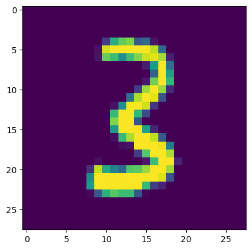

<!-- WARNING: THIS FILE WAS AUTOGENERATED! DO NOT EDIT! -->

## Load Data

``` python
import gzip, pickle
from pathlib import Path
from torch import tensor
```

``` python
p_data = Path('data')
p_gz = p_data/'mnist.pkl.gz'
with gzip.open(p_gz, 'rb') as f: ((trn_x, trn_y), (vld_x, vld_y), _) = pickle.load(f, encoding='latin-1')
trn_x, trn_y, vld_x, vld_y = map(tensor, [trn_x, trn_y, vld_x, vld_y])
```

## Basic Model

``` python
n, m = trn_x.shape
c = trn_y.max()+1
n, m, c
```

    (50000, 784, tensor(10))

``` python
nh = 50
```

``` python
from torch import nn
```

``` python
class Model(nn.Module):
  def __init__(self, n_inps, nh, n_outs):
    super().__init__()
    self.layers = [nn.Linear(n_inps, nh), nn.ReLU(), nn.Linear(nh, n_outs)]

  def __call__(self, x):
    for l in self.layers: x = l(x)
    return x
```

``` python
torch.set_printoptions(precision=2, linewidth=140, sci_mode=False)
model = Model(m, nh, c)
preds = model(trn_x); preds.shape
```

### Loss

``` python
def log_softmax(x): return (x.exp()/(x.exp().sum(-1, keepdim=True))).log()
```

``` python
log_softmax(preds)
```

    tensor([[-2.25, -2.25, -2.25,  ..., -2.42, -2.26, -2.25],
            [-2.32, -2.41, -2.20,  ..., -2.35, -2.32, -2.19],
            [-2.30, -2.30, -2.25,  ..., -2.40, -2.35, -2.22],
            ...,
            [-2.29, -2.41, -2.24,  ..., -2.35, -2.39, -2.18],
            [-2.30, -2.37, -2.27,  ..., -2.36, -2.21, -2.22],
            [-2.25, -2.35, -2.24,  ..., -2.43, -2.31, -2.28]], grad_fn=<LogBackward0>)

``` python
log_softmax(preds).shape
```

    torch.Size([50000, 10])

The logarithmic softmax computation above can be simplified by the
following rule: $\lg(\frac{a}{b}) = \lg(a) - \lg(b)$.

``` python
def log_softmax(x): return x.exp().log() - x.exp().sum(-1, keepdim=True).log()
```

``` python
log_softmax(preds)
```

    tensor([[-2.25, -2.25, -2.25,  ..., -2.42, -2.26, -2.25],
            [-2.32, -2.41, -2.20,  ..., -2.35, -2.32, -2.19],
            [-2.30, -2.30, -2.25,  ..., -2.40, -2.35, -2.22],
            ...,
            [-2.29, -2.41, -2.24,  ..., -2.35, -2.39, -2.18],
            [-2.30, -2.37, -2.27,  ..., -2.36, -2.21, -2.22],
            [-2.25, -2.35, -2.24,  ..., -2.43, -2.31, -2.28]], grad_fn=<SubBackward0>)

The computation can be further stabilized by using the LogSumExp trick.
$$
\lg\left(\sum^n\_{j=1} e^{x_j}\right) = \lg\left(e^a \sum^n\_{j=1} \frac{e^{x_j}}{e^a}\right) = \lg\left(e^a \sum^n\_{j=1} e^{x_j - a}\right) = a + \lg\left(\sum^n\_{j=1} e^{x_j - a}\right)
$$

``` python
?trn_x.max
```

    Docstring:
    max(dim=None, keepdim=False) -> Tensor or (Tensor, Tensor)

    See :func:`torch.max`
    Type:      builtin_function_or_method

``` python
trn_x.max(), trn_x.max(-1)
```

    (tensor(1.00),
     torch.return_types.max(
     values=tensor([1.00, 1.00, 1.00,  ..., 1.00, 1.00, 1.00]),
     indices=tensor([161, 272, 578,  ..., 151, 604, 435])))

``` python
trn_x.max(-1)[0], trn_x.max(-1)[0].shape
```

    (tensor([1.00, 1.00, 1.00,  ..., 1.00, 1.00, 1.00]), torch.Size([50000]))

``` python
trn_x.shape
```

    torch.Size([50000, 784])

``` python
tensor([1, 2])[:, None, None]
```

    tensor([[[1]],

            [[2]]])

``` python
m = trn_x.max(-1)[0]; m, m.shape
```

    (tensor([1.00, 1.00, 1.00,  ..., 1.00, 1.00, 1.00]), torch.Size([50000]))

``` python
(m[:, None] - trn_x).shape
```

    torch.Size([50000, 784])

``` python
preds.shape, preds.sum().shape
```

    (torch.Size([50000, 10]), torch.Size([]))

``` python
preds.sum(-1).shape, preds.sum(-1, keepdim=True).shape
```

    (torch.Size([50000]), torch.Size([50000, 1]))

``` python
(preds - preds.sum(-1, keepdim=True)).shape
```

    torch.Size([50000, 10])

------------------------------------------------------------------------

``` python
m = preds.max(-1)[0]
m, m.shape
```

    (tensor([0.01, 0.09, 0.04,  ..., 0.08, 0.03, 0.10], grad_fn=<MaxBackward0>),
     torch.Size([50000]))

``` python
(preds - m[:, None]), (preds - m[:, None]).shape
```

    (tensor([[-0.00, -0.01, -0.01,  ..., -0.18, -0.01,  0.00],
             [-0.13, -0.22, -0.01,  ..., -0.16, -0.13,  0.00],
             [-0.08, -0.09, -0.03,  ..., -0.18, -0.13,  0.00],
             ...,
             [-0.11, -0.22, -0.05,  ..., -0.16, -0.21,  0.00],
             [-0.09, -0.16, -0.06,  ..., -0.15,  0.00, -0.00],
             [-0.10, -0.20, -0.09,  ..., -0.28, -0.16, -0.13]], grad_fn=<SubBackward0>),
     torch.Size([50000, 10]))

``` python
(preds - m[:, None]).exp().sum(-1, keepdim=True).log(), (preds - m[:, None]).exp().sum(-1, keepdim=True).log().shape
```

    (tensor([[2.25],
             [2.19],
             [2.22],
             ...,
             [2.18],
             [2.21],
             [2.15]], grad_fn=<LogBackward0>),
     torch.Size([50000, 1]))

``` python
m[:, None] + (preds - m[:, None]).exp().sum(-1, keepdim=True).log()
```

    tensor([[2.25],
            [2.28],
            [2.26],
            ...,
            [2.26],
            [2.24],
            [2.25]], grad_fn=<AddBackward0>)

``` python
def logsumexp(x):
  m = x.max(-1)[0]
  return m[:, None] + (x - m[:, None]).exp().sum(-1, keepdim=True).log()
logsumexp(preds), logsumexp(preds).shape
```

    (tensor([[2.25],
             [2.28],
             [2.26],
             ...,
             [2.26],
             [2.24],
             [2.25]], grad_fn=<AddBackward0>),
     torch.Size([50000, 1]))

``` python
def log_softmax(x): return x - logsumexp(x)
```

``` python
log_softmax(preds)
```

    tensor([[-2.25, -2.25, -2.25,  ..., -2.42, -2.26, -2.25],
            [-2.32, -2.41, -2.20,  ..., -2.35, -2.32, -2.19],
            [-2.30, -2.30, -2.25,  ..., -2.40, -2.35, -2.22],
            ...,
            [-2.29, -2.41, -2.24,  ..., -2.35, -2.39, -2.18],
            [-2.30, -2.37, -2.27,  ..., -2.36, -2.21, -2.22],
            [-2.25, -2.35, -2.24,  ..., -2.43, -2.31, -2.28]], grad_fn=<SubBackward0>)

``` python
(preds - m[:, None]).exp().sum(-1).shape, (preds - m[:, None]).exp().sum(-1, keepdim=True).shape
```

    (torch.Size([50000]), torch.Size([50000, 1]))

``` python
def logsumexp(x):
  m = x.max(-1)[0]
  return m + (x - m[:, None]).exp().sum(-1).log()
logsumexp(preds), logsumexp(preds).shape
```

    (tensor([2.25, 2.28, 2.26,  ..., 2.26, 2.24, 2.25], grad_fn=<AddBackward0>),
     torch.Size([50000]))

``` python
def log_softmax(x): return x - logsumexp(x)[:, None]
log_softmax(preds)
```

    tensor([[-2.25, -2.25, -2.25,  ..., -2.42, -2.26, -2.25],
            [-2.32, -2.41, -2.20,  ..., -2.35, -2.32, -2.19],
            [-2.30, -2.30, -2.25,  ..., -2.40, -2.35, -2.22],
            ...,
            [-2.29, -2.41, -2.24,  ..., -2.35, -2.39, -2.18],
            [-2.30, -2.37, -2.27,  ..., -2.36, -2.21, -2.22],
            [-2.25, -2.35, -2.24,  ..., -2.43, -2.31, -2.28]], grad_fn=<SubBackward0>)

``` python
?preds.logsumexp
```

    Docstring:
    logsumexp(dim, keepdim=False) -> Tensor

    See :func:`torch.logsumexp`
    Type:      builtin_function_or_method

``` python
from fastcore.test import test_close
```

``` python
test_close(logsumexp(preds), preds.logsumexp(-1))
```

------------------------------------------------------------------------

``` python
t = tensor([[1, 2, 3], [4, 5, 6], [7, 8, 9]]); t
```

    tensor([[1, 2, 3],
            [4, 5, 6],
            [7, 8, 9]])

``` python
t[[0, 1, 2], [0, 1, 2]]
```

    tensor([1, 5, 9])

``` python
t[[0, 1, 2], [0, 2, 1]]
```

    tensor([1, 6, 8])

``` python
t[[0, 2], [2, 1]]
```

    tensor([3, 8])

------------------------------------------------------------------------

``` python
trn_y
```

    tensor([5, 0, 4,  ..., 8, 4, 8])

``` python
trn_y[:3]
```

    tensor([5, 0, 4])

``` python
sm_preds = log_softmax(preds); sm_preds, sm_preds.shape
```

    (tensor([[-2.25, -2.25, -2.25,  ..., -2.42, -2.26, -2.25],
             [-2.32, -2.41, -2.20,  ..., -2.35, -2.32, -2.19],
             [-2.30, -2.30, -2.25,  ..., -2.40, -2.35, -2.22],
             ...,
             [-2.29, -2.41, -2.24,  ..., -2.35, -2.39, -2.18],
             [-2.30, -2.37, -2.27,  ..., -2.36, -2.21, -2.22],
             [-2.25, -2.35, -2.24,  ..., -2.43, -2.31, -2.28]], grad_fn=<SubBackward0>),
     torch.Size([50000, 10]))

``` python
sm_preds[0, 5], sm_preds[1, 0], sm_preds[2, 4]
```

    (tensor(-2.39, grad_fn=<SelectBackward0>),
     tensor(-2.32, grad_fn=<SelectBackward0>),
     tensor(-2.34, grad_fn=<SelectBackward0>))

``` python
sm_preds[[0, 1, 2], [5, 0, 4]]
```

    tensor([-2.39, -2.32, -2.34], grad_fn=<IndexBackward0>)

``` python
sm_preds[[0, 1, 2], trn_y[:3]]
```

    tensor([-2.39, -2.32, -2.34], grad_fn=<IndexBackward0>)

``` python
def nll(preds, targs): return -preds[range(targs.shape[0]), targs].mean()
```

``` python
loss = nll(sm_preds, trn_y); loss
```

    tensor(2.32, grad_fn=<NegBackward0>)

PyTorch’s implementation.

``` python
import torch.nn.functional as F
```

``` python
test_close(F.nll_loss(F.log_softmax(preds, -1), trn_y), loss, 1e-3)
```

``` python
t = tensor([[2, 1, 3], [4, 6, 5], [7, 8, 9]]); t
```

    tensor([[2, 1, 3],
            [4, 6, 5],
            [7, 8, 9]])

``` python
t.max(), t.max(0), t.max(1), t.max(-1)
```

    (tensor(9),
     torch.return_types.max(
     values=tensor([7, 8, 9]),
     indices=tensor([2, 2, 2])),
     torch.return_types.max(
     values=tensor([3, 6, 9]),
     indices=tensor([2, 1, 2])),
     torch.return_types.max(
     values=tensor([3, 6, 9]),
     indices=tensor([2, 1, 2])))

When `dim=0`, it goes through each column, and returns which row has the
largest value. When `dim=1`, it goes through each row, and returns which
column has the largest value.

``` python
?F.log_softmax
```

    Signature:
    F.log_softmax(
        input: torch.Tensor,
        dim: Optional[int] = None,
        _stacklevel: int = 3,
        dtype: Optional[int] = None,
    ) -> torch.Tensor
    Docstring:
    Applies a softmax followed by a logarithm.

    While mathematically equivalent to log(softmax(x)), doing these two
    operations separately is slower and numerically unstable. This function
    uses an alternative formulation to compute the output and gradient correctly.

    See :class:`~torch.nn.LogSoftmax` for more details.

    Args:
        input (Tensor): input
        dim (int): A dimension along which log_softmax will be computed.
        dtype (:class:`torch.dtype`, optional): the desired data type of returned tensor.
          If specified, the input tensor is cast to :attr:`dtype` before the operation
          is performed. This is useful for preventing data type overflows. Default: None.
    File:      ~/mambaforge/envs/default/lib/python3.10/site-packages/torch/nn/functional.py
    Type:      function

## Basic Training Loop

Steps: - Get output from a batch of inputs - Compute loss - Calculate
gradients of loss with respect to all parameters - Update parameters
with gradients

``` python
loss_func = F.cross_entropy
```

``` python
bs = 50

xb = trn_x[0:bs]
preds = model(xb)
preds[0], preds.shape
```

    (tensor([ 0.00, -0.00, -0.00, -0.14, -0.05, -0.14, -0.03, -0.17, -0.01,  0.01], grad_fn=<SelectBackward0>),
     torch.Size([50, 10]))

``` python
yb = trn_y[:bs]; yb
```

    tensor([5, 0, 4, 1, 9, 2, 1, 3, 1, 4, 3, 5, 3, 6, 1, 7, 2, 8, 6, 9, 4, 0, 9, 1, 1, 2, 4, 3, 2, 7, 3, 8, 6, 9, 0, 5, 6, 0, 7, 6, 1, 8, 7, 9,
            3, 9, 8, 5, 9, 3])

``` python
loss_func(preds, yb)
```

    tensor(2.31, grad_fn=<NllLossBackward0>)

``` python
preds
```

    tensor([[     0.00,     -0.00,     -0.00,     -0.14,     -0.05,     -0.14,     -0.03,     -0.17,     -0.01,      0.01],
            [    -0.03,     -0.13,      0.09,     -0.03,     -0.03,     -0.17,      0.09,     -0.06,     -0.04,      0.09],
            [    -0.05,     -0.05,      0.01,      0.04,     -0.08,     -0.09,     -0.07,     -0.14,     -0.09,      0.04],
            [    -0.06,     -0.10,     -0.05,      0.02,     -0.01,     -0.11,     -0.10,     -0.11,     -0.04,      0.17],
            [     0.01,     -0.08,      0.02,      0.05,     -0.09,     -0.12,     -0.02,     -0.16,      0.02,      0.00],
            [     0.02,     -0.03,      0.03,     -0.00,     -0.04,     -0.06,     -0.04,     -0.16,     -0.03,      0.09],
            [    -0.08,     -0.07,     -0.05,     -0.05,     -0.02,     -0.15,     -0.12,     -0.06,     -0.09,      0.00],
            [     0.00,     -0.07,     -0.02,     -0.09,     -0.01,     -0.18,      0.02,     -0.11,     -0.10,      0.11],
            [    -0.07,     -0.06,     -0.05,      0.01,     -0.07,     -0.15,     -0.03,     -0.13,     -0.09,      0.04],
            [    -0.02,     -0.04,     -0.00,     -0.04,     -0.05,     -0.08,     -0.04,     -0.17,     -0.06,      0.08],
            [     0.05,     -0.10,      0.04,     -0.02,     -0.05,     -0.26,     -0.04,     -0.11,     -0.05,      0.03],
            [    -0.09,     -0.10,     -0.01,      0.02,     -0.08,     -0.03,     -0.00,     -0.11,     -0.06,      0.10],
            [    -0.02,     -0.09,      0.08,     -0.06,     -0.02,     -0.12,     -0.01,     -0.08,     -0.19,      0.14],
            [    -0.05,     -0.08,      0.03,      0.06,      0.04,     -0.15,     -0.02,     -0.13,      0.12,     -0.05],
            [    -0.07,     -0.07,      0.01,     -0.02,     -0.07,     -0.17,     -0.06,     -0.14,     -0.07,      0.01],
            [    -0.01,     -0.09,      0.02,     -0.05,     -0.11,     -0.11,     -0.02,     -0.12,     -0.05,      0.00],
            [    -0.05,     -0.12,     -0.02,      0.03,     -0.18,     -0.09,      0.02,     -0.15,     -0.07,      0.08],
            [     0.03,     -0.05,      0.02,     -0.05,     -0.00,     -0.09,     -0.03,     -0.14,     -0.01,      0.10],
            [    -0.02,     -0.06,      0.02,      0.03,     -0.05,     -0.06,     -0.02,     -0.08,     -0.10,      0.10],
            [    -0.00,     -0.07,     -0.02,     -0.01,     -0.09,     -0.09,     -0.06,     -0.12,     -0.08,      0.08],
            [    -0.04,     -0.14,      0.05,      0.08,     -0.16,     -0.03,     -0.11,     -0.14,     -0.02,     -0.09],
            [    -0.01,     -0.03,      0.09,     -0.05,      0.01,     -0.11,      0.04,     -0.04,     -0.07,      0.09],
            [    -0.06,     -0.07,     -0.01,      0.01,     -0.10,     -0.08,     -0.02,     -0.13,     -0.08,      0.10],
            [    -0.05,     -0.10,     -0.05,      0.03,     -0.02,     -0.11,     -0.10,     -0.11,     -0.04,      0.15],
            [    -0.02,     -0.04,      0.04,      0.01,     -0.05,     -0.00,     -0.08,     -0.14,     -0.10,      0.02],
            [     0.06,      0.04,     -0.00,     -0.07,     -0.03,     -0.01,     -0.05,     -0.12,     -0.05,      0.09],
            [    -0.02,     -0.13,      0.03,     -0.00,     -0.14,     -0.07,     -0.05,     -0.13,     -0.06,      0.06],
            [     0.01,     -0.12,     -0.03,     -0.15,     -0.08,     -0.17,     -0.01,     -0.13,     -0.14,      0.08],
            [    -0.07,     -0.21,     -0.02,      0.05,     -0.23,     -0.12,     -0.05,     -0.21,      0.02,     -0.07],
            [    -0.03,     -0.08,      0.01,      0.02,     -0.06,     -0.06,     -0.09,     -0.11,     -0.06,      0.04],
            [    -0.04,     -0.11,      0.02,     -0.04,     -0.09,     -0.05,     -0.04,     -0.12,     -0.12,     -0.01],
            [    -0.01,     -0.08,      0.05,     -0.02,      0.03,     -0.15,      0.02,     -0.10,     -0.03,      0.12],
            [    -0.13,     -0.09,      0.03,      0.02,     -0.09,     -0.11,     -0.07,     -0.07,     -0.01,      0.04],
            [     0.00,     -0.06,      0.01,     -0.01,     -0.06,     -0.11,     -0.07,     -0.12,     -0.06,      0.03],
            [    -0.04,     -0.00,      0.06,     -0.15,      0.03,     -0.16,      0.04,     -0.07,     -0.01,      0.05],
            [     0.04,     -0.10,      0.04,      0.04,     -0.02,     -0.09,     -0.09,     -0.11,     -0.09,      0.14],
            [    -0.04,     -0.02,     -0.03,     -0.09,     -0.02,     -0.05,     -0.01,     -0.15,     -0.07,      0.00],
            [    -0.09,      0.03,      0.11,     -0.16,      0.07,     -0.21,      0.14,     -0.03,      0.05,      0.03],
            [    -0.04,     -0.19,      0.00,      0.06,     -0.13,     -0.09,     -0.01,     -0.16,     -0.04,     -0.01],
            [    -0.10,     -0.12,      0.02,     -0.01,     -0.10,     -0.12,     -0.06,     -0.10,      0.04,     -0.04],
            [    -0.07,     -0.11,      0.03,      0.05,     -0.07,     -0.16,      0.02,     -0.16,     -0.10,      0.05],
            [     0.02,     -0.07,      0.01,     -0.09,     -0.02,     -0.07,     -0.03,     -0.11,     -0.03,      0.04],
            [    -0.02,     -0.09,      0.04,      0.02,     -0.09,     -0.14,      0.00,     -0.14,     -0.06,      0.03],
            [    -0.02,     -0.12,     -0.00,      0.02,     -0.09,     -0.13,     -0.04,     -0.15,     -0.09,      0.05],
            [    -0.11,     -0.14,     -0.04,      0.03,     -0.12,     -0.05,     -0.03,     -0.13,     -0.17,      0.00],
            [     0.03,     -0.06,      0.01,     -0.04,     -0.07,     -0.13,     -0.00,     -0.18,      0.04,      0.01],
            [    -0.06,     -0.12,     -0.04,     -0.01,     -0.10,     -0.08,     -0.06,     -0.13,     -0.06,      0.02],
            [    -0.03,     -0.11,      0.03,     -0.10,     -0.03,     -0.13,      0.05,     -0.12,     -0.07,      0.15],
            [    -0.04,     -0.16,     -0.06,      0.03,     -0.09,     -0.15,     -0.01,     -0.06,     -0.12,      0.06],
            [     0.01,     -0.07,      0.02,     -0.09,     -0.01,     -0.16,      0.01,     -0.11,     -0.12,      0.11]],
           grad_fn=<AddmmBackward0>)

``` python
preds.argmax(-1)
```

    tensor([9, 9, 9, 9, 3, 9, 9, 9, 9, 9, 0, 9, 9, 8, 2, 2, 9, 9, 9, 9, 3, 2, 9, 9, 2, 9, 9, 9, 3, 9, 2, 9, 9, 9, 2, 9, 9, 6, 3, 8, 3, 9, 2, 9,
            3, 8, 9, 9, 9, 9])

``` python
(preds.argmax(-1) == yb).sum()
```

    tensor(6)

------------------------------------------------------------------------

<a
href="https://github.com/ForBo7/xiaoai/blob/main/xiaoai/training.py#L10"
target="_blank" style="float:right; font-size:smaller">source</a>

### accuracy

>      accuracy (preds, yb)

``` python
accuracy(preds, yb)
```

    tensor(0.12)

``` python
test_close(accuracy(preds, yb), (preds.argmax(-1) == yb).float().mean())
```

------------------------------------------------------------------------

<a
href="https://github.com/ForBo7/xiaoai/blob/main/xiaoai/training.py#L13"
target="_blank" style="float:right; font-size:smaller">source</a>

### report

>      report (loss, preds, yb)

``` python
lr = .5
epochs = 3

xb, yb = trn_x[:bs], trn_y[:bs]
preds = model(xb)
report(loss_func(preds, yb), preds, yb)
```

    2.31, 0.12

``` python
?slice
```

    Init signature: slice(self, /, *args, **kwargs)
    Docstring:     
    slice(stop)
    slice(start, stop[, step])

    Create a slice object.  This is used for extended slicing (e.g. a[0:10:2]).
    Type:           type
    Subclasses:     

``` python
for i in range(0, n, bs): print(slice(i, min(n, bs+i)))
```

    slice(0, 50, None)
    slice(50, 100, None)
    slice(100, 150, None)
    slice(150, 200, None)
    slice(200, 250, None)
    slice(250, 300, None)
    slice(300, 350, None)
    slice(350, 400, None)
    slice(400, 450, None)
    slice(450, 500, None)
    slice(500, 550, None)
    slice(550, 600, None)
    slice(600, 650, None)
    slice(650, 700, None)
    slice(700, 750, None)
    slice(750, 800, None)
    slice(800, 850, None)
    slice(850, 900, None)
    slice(900, 950, None)
    slice(950, 1000, None)
    slice(1000, 1050, None)
    slice(1050, 1100, None)
    slice(1100, 1150, None)
    slice(1150, 1200, None)
    slice(1200, 1250, None)
    slice(1250, 1300, None)
    slice(1300, 1350, None)
    slice(1350, 1400, None)
    slice(1400, 1450, None)
    slice(1450, 1500, None)
    slice(1500, 1550, None)
    slice(1550, 1600, None)
    slice(1600, 1650, None)
    slice(1650, 1700, None)
    slice(1700, 1750, None)
    slice(1750, 1800, None)
    slice(1800, 1850, None)
    slice(1850, 1900, None)
    slice(1900, 1950, None)
    slice(1950, 2000, None)
    slice(2000, 2050, None)
    slice(2050, 2100, None)
    slice(2100, 2150, None)
    slice(2150, 2200, None)
    slice(2200, 2250, None)
    slice(2250, 2300, None)
    slice(2300, 2350, None)
    slice(2350, 2400, None)
    slice(2400, 2450, None)
    slice(2450, 2500, None)
    slice(2500, 2550, None)
    slice(2550, 2600, None)
    slice(2600, 2650, None)
    slice(2650, 2700, None)
    slice(2700, 2750, None)
    slice(2750, 2800, None)
    slice(2800, 2850, None)
    slice(2850, 2900, None)
    slice(2900, 2950, None)
    slice(2950, 3000, None)
    slice(3000, 3050, None)
    slice(3050, 3100, None)
    slice(3100, 3150, None)
    slice(3150, 3200, None)
    slice(3200, 3250, None)
    slice(3250, 3300, None)
    slice(3300, 3350, None)
    slice(3350, 3400, None)
    slice(3400, 3450, None)
    slice(3450, 3500, None)
    slice(3500, 3550, None)
    slice(3550, 3600, None)
    slice(3600, 3650, None)
    slice(3650, 3700, None)
    slice(3700, 3750, None)
    slice(3750, 3800, None)
    slice(3800, 3850, None)
    slice(3850, 3900, None)
    slice(3900, 3950, None)
    slice(3950, 4000, None)
    slice(4000, 4050, None)
    slice(4050, 4100, None)
    slice(4100, 4150, None)
    slice(4150, 4200, None)
    slice(4200, 4250, None)
    slice(4250, 4300, None)
    slice(4300, 4350, None)
    slice(4350, 4400, None)
    slice(4400, 4450, None)
    slice(4450, 4500, None)
    slice(4500, 4550, None)
    slice(4550, 4600, None)
    slice(4600, 4650, None)
    slice(4650, 4700, None)
    slice(4700, 4750, None)
    slice(4750, 4800, None)
    slice(4800, 4850, None)
    slice(4850, 4900, None)
    slice(4900, 4950, None)
    slice(4950, 5000, None)
    slice(5000, 5050, None)
    slice(5050, 5100, None)
    slice(5100, 5150, None)
    slice(5150, 5200, None)
    slice(5200, 5250, None)
    slice(5250, 5300, None)
    slice(5300, 5350, None)
    slice(5350, 5400, None)
    slice(5400, 5450, None)
    slice(5450, 5500, None)
    slice(5500, 5550, None)
    slice(5550, 5600, None)
    slice(5600, 5650, None)
    slice(5650, 5700, None)
    slice(5700, 5750, None)
    slice(5750, 5800, None)
    slice(5800, 5850, None)
    slice(5850, 5900, None)
    slice(5900, 5950, None)
    slice(5950, 6000, None)
    slice(6000, 6050, None)
    slice(6050, 6100, None)
    slice(6100, 6150, None)
    slice(6150, 6200, None)
    slice(6200, 6250, None)
    slice(6250, 6300, None)
    slice(6300, 6350, None)
    slice(6350, 6400, None)
    slice(6400, 6450, None)
    slice(6450, 6500, None)
    slice(6500, 6550, None)
    slice(6550, 6600, None)
    slice(6600, 6650, None)
    slice(6650, 6700, None)
    slice(6700, 6750, None)
    slice(6750, 6800, None)
    slice(6800, 6850, None)
    slice(6850, 6900, None)
    slice(6900, 6950, None)
    slice(6950, 7000, None)
    slice(7000, 7050, None)
    slice(7050, 7100, None)
    slice(7100, 7150, None)
    slice(7150, 7200, None)
    slice(7200, 7250, None)
    slice(7250, 7300, None)
    slice(7300, 7350, None)
    slice(7350, 7400, None)
    slice(7400, 7450, None)
    slice(7450, 7500, None)
    slice(7500, 7550, None)
    slice(7550, 7600, None)
    slice(7600, 7650, None)
    slice(7650, 7700, None)
    slice(7700, 7750, None)
    slice(7750, 7800, None)
    slice(7800, 7850, None)
    slice(7850, 7900, None)
    slice(7900, 7950, None)
    slice(7950, 8000, None)
    slice(8000, 8050, None)
    slice(8050, 8100, None)
    slice(8100, 8150, None)
    slice(8150, 8200, None)
    slice(8200, 8250, None)
    slice(8250, 8300, None)
    slice(8300, 8350, None)
    slice(8350, 8400, None)
    slice(8400, 8450, None)
    slice(8450, 8500, None)
    slice(8500, 8550, None)
    slice(8550, 8600, None)
    slice(8600, 8650, None)
    slice(8650, 8700, None)
    slice(8700, 8750, None)
    slice(8750, 8800, None)
    slice(8800, 8850, None)
    slice(8850, 8900, None)
    slice(8900, 8950, None)
    slice(8950, 9000, None)
    slice(9000, 9050, None)
    slice(9050, 9100, None)
    slice(9100, 9150, None)
    slice(9150, 9200, None)
    slice(9200, 9250, None)
    slice(9250, 9300, None)
    slice(9300, 9350, None)
    slice(9350, 9400, None)
    slice(9400, 9450, None)
    slice(9450, 9500, None)
    slice(9500, 9550, None)
    slice(9550, 9600, None)
    slice(9600, 9650, None)
    slice(9650, 9700, None)
    slice(9700, 9750, None)
    slice(9750, 9800, None)
    slice(9800, 9850, None)
    slice(9850, 9900, None)
    slice(9900, 9950, None)
    slice(9950, 10000, None)
    slice(10000, 10050, None)
    slice(10050, 10100, None)
    slice(10100, 10150, None)
    slice(10150, 10200, None)
    slice(10200, 10250, None)
    slice(10250, 10300, None)
    slice(10300, 10350, None)
    slice(10350, 10400, None)
    slice(10400, 10450, None)
    slice(10450, 10500, None)
    slice(10500, 10550, None)
    slice(10550, 10600, None)
    slice(10600, 10650, None)
    slice(10650, 10700, None)
    slice(10700, 10750, None)
    slice(10750, 10800, None)
    slice(10800, 10850, None)
    slice(10850, 10900, None)
    slice(10900, 10950, None)
    slice(10950, 11000, None)
    slice(11000, 11050, None)
    slice(11050, 11100, None)
    slice(11100, 11150, None)
    slice(11150, 11200, None)
    slice(11200, 11250, None)
    slice(11250, 11300, None)
    slice(11300, 11350, None)
    slice(11350, 11400, None)
    slice(11400, 11450, None)
    slice(11450, 11500, None)
    slice(11500, 11550, None)
    slice(11550, 11600, None)
    slice(11600, 11650, None)
    slice(11650, 11700, None)
    slice(11700, 11750, None)
    slice(11750, 11800, None)
    slice(11800, 11850, None)
    slice(11850, 11900, None)
    slice(11900, 11950, None)
    slice(11950, 12000, None)
    slice(12000, 12050, None)
    slice(12050, 12100, None)
    slice(12100, 12150, None)
    slice(12150, 12200, None)
    slice(12200, 12250, None)
    slice(12250, 12300, None)
    slice(12300, 12350, None)
    slice(12350, 12400, None)
    slice(12400, 12450, None)
    slice(12450, 12500, None)
    slice(12500, 12550, None)
    slice(12550, 12600, None)
    slice(12600, 12650, None)
    slice(12650, 12700, None)
    slice(12700, 12750, None)
    slice(12750, 12800, None)
    slice(12800, 12850, None)
    slice(12850, 12900, None)
    slice(12900, 12950, None)
    slice(12950, 13000, None)
    slice(13000, 13050, None)
    slice(13050, 13100, None)
    slice(13100, 13150, None)
    slice(13150, 13200, None)
    slice(13200, 13250, None)
    slice(13250, 13300, None)
    slice(13300, 13350, None)
    slice(13350, 13400, None)
    slice(13400, 13450, None)
    slice(13450, 13500, None)
    slice(13500, 13550, None)
    slice(13550, 13600, None)
    slice(13600, 13650, None)
    slice(13650, 13700, None)
    slice(13700, 13750, None)
    slice(13750, 13800, None)
    slice(13800, 13850, None)
    slice(13850, 13900, None)
    slice(13900, 13950, None)
    slice(13950, 14000, None)
    slice(14000, 14050, None)
    slice(14050, 14100, None)
    slice(14100, 14150, None)
    slice(14150, 14200, None)
    slice(14200, 14250, None)
    slice(14250, 14300, None)
    slice(14300, 14350, None)
    slice(14350, 14400, None)
    slice(14400, 14450, None)
    slice(14450, 14500, None)
    slice(14500, 14550, None)
    slice(14550, 14600, None)
    slice(14600, 14650, None)
    slice(14650, 14700, None)
    slice(14700, 14750, None)
    slice(14750, 14800, None)
    slice(14800, 14850, None)
    slice(14850, 14900, None)
    slice(14900, 14950, None)
    slice(14950, 15000, None)
    slice(15000, 15050, None)
    slice(15050, 15100, None)
    slice(15100, 15150, None)
    slice(15150, 15200, None)
    slice(15200, 15250, None)
    slice(15250, 15300, None)
    slice(15300, 15350, None)
    slice(15350, 15400, None)
    slice(15400, 15450, None)
    slice(15450, 15500, None)
    slice(15500, 15550, None)
    slice(15550, 15600, None)
    slice(15600, 15650, None)
    slice(15650, 15700, None)
    slice(15700, 15750, None)
    slice(15750, 15800, None)
    slice(15800, 15850, None)
    slice(15850, 15900, None)
    slice(15900, 15950, None)
    slice(15950, 16000, None)
    slice(16000, 16050, None)
    slice(16050, 16100, None)
    slice(16100, 16150, None)
    slice(16150, 16200, None)
    slice(16200, 16250, None)
    slice(16250, 16300, None)
    slice(16300, 16350, None)
    slice(16350, 16400, None)
    slice(16400, 16450, None)
    slice(16450, 16500, None)
    slice(16500, 16550, None)
    slice(16550, 16600, None)
    slice(16600, 16650, None)
    slice(16650, 16700, None)
    slice(16700, 16750, None)
    slice(16750, 16800, None)
    slice(16800, 16850, None)
    slice(16850, 16900, None)
    slice(16900, 16950, None)
    slice(16950, 17000, None)
    slice(17000, 17050, None)
    slice(17050, 17100, None)
    slice(17100, 17150, None)
    slice(17150, 17200, None)
    slice(17200, 17250, None)
    slice(17250, 17300, None)
    slice(17300, 17350, None)
    slice(17350, 17400, None)
    slice(17400, 17450, None)
    slice(17450, 17500, None)
    slice(17500, 17550, None)
    slice(17550, 17600, None)
    slice(17600, 17650, None)
    slice(17650, 17700, None)
    slice(17700, 17750, None)
    slice(17750, 17800, None)
    slice(17800, 17850, None)
    slice(17850, 17900, None)
    slice(17900, 17950, None)
    slice(17950, 18000, None)
    slice(18000, 18050, None)
    slice(18050, 18100, None)
    slice(18100, 18150, None)
    slice(18150, 18200, None)
    slice(18200, 18250, None)
    slice(18250, 18300, None)
    slice(18300, 18350, None)
    slice(18350, 18400, None)
    slice(18400, 18450, None)
    slice(18450, 18500, None)
    slice(18500, 18550, None)
    slice(18550, 18600, None)
    slice(18600, 18650, None)
    slice(18650, 18700, None)
    slice(18700, 18750, None)
    slice(18750, 18800, None)
    slice(18800, 18850, None)
    slice(18850, 18900, None)
    slice(18900, 18950, None)
    slice(18950, 19000, None)
    slice(19000, 19050, None)
    slice(19050, 19100, None)
    slice(19100, 19150, None)
    slice(19150, 19200, None)
    slice(19200, 19250, None)
    slice(19250, 19300, None)
    slice(19300, 19350, None)
    slice(19350, 19400, None)
    slice(19400, 19450, None)
    slice(19450, 19500, None)
    slice(19500, 19550, None)
    slice(19550, 19600, None)
    slice(19600, 19650, None)
    slice(19650, 19700, None)
    slice(19700, 19750, None)
    slice(19750, 19800, None)
    slice(19800, 19850, None)
    slice(19850, 19900, None)
    slice(19900, 19950, None)
    slice(19950, 20000, None)
    slice(20000, 20050, None)
    slice(20050, 20100, None)
    slice(20100, 20150, None)
    slice(20150, 20200, None)
    slice(20200, 20250, None)
    slice(20250, 20300, None)
    slice(20300, 20350, None)
    slice(20350, 20400, None)
    slice(20400, 20450, None)
    slice(20450, 20500, None)
    slice(20500, 20550, None)
    slice(20550, 20600, None)
    slice(20600, 20650, None)
    slice(20650, 20700, None)
    slice(20700, 20750, None)
    slice(20750, 20800, None)
    slice(20800, 20850, None)
    slice(20850, 20900, None)
    slice(20900, 20950, None)
    slice(20950, 21000, None)
    slice(21000, 21050, None)
    slice(21050, 21100, None)
    slice(21100, 21150, None)
    slice(21150, 21200, None)
    slice(21200, 21250, None)
    slice(21250, 21300, None)
    slice(21300, 21350, None)
    slice(21350, 21400, None)
    slice(21400, 21450, None)
    slice(21450, 21500, None)
    slice(21500, 21550, None)
    slice(21550, 21600, None)
    slice(21600, 21650, None)
    slice(21650, 21700, None)
    slice(21700, 21750, None)
    slice(21750, 21800, None)
    slice(21800, 21850, None)
    slice(21850, 21900, None)
    slice(21900, 21950, None)
    slice(21950, 22000, None)
    slice(22000, 22050, None)
    slice(22050, 22100, None)
    slice(22100, 22150, None)
    slice(22150, 22200, None)
    slice(22200, 22250, None)
    slice(22250, 22300, None)
    slice(22300, 22350, None)
    slice(22350, 22400, None)
    slice(22400, 22450, None)
    slice(22450, 22500, None)
    slice(22500, 22550, None)
    slice(22550, 22600, None)
    slice(22600, 22650, None)
    slice(22650, 22700, None)
    slice(22700, 22750, None)
    slice(22750, 22800, None)
    slice(22800, 22850, None)
    slice(22850, 22900, None)
    slice(22900, 22950, None)
    slice(22950, 23000, None)
    slice(23000, 23050, None)
    slice(23050, 23100, None)
    slice(23100, 23150, None)
    slice(23150, 23200, None)
    slice(23200, 23250, None)
    slice(23250, 23300, None)
    slice(23300, 23350, None)
    slice(23350, 23400, None)
    slice(23400, 23450, None)
    slice(23450, 23500, None)
    slice(23500, 23550, None)
    slice(23550, 23600, None)
    slice(23600, 23650, None)
    slice(23650, 23700, None)
    slice(23700, 23750, None)
    slice(23750, 23800, None)
    slice(23800, 23850, None)
    slice(23850, 23900, None)
    slice(23900, 23950, None)
    slice(23950, 24000, None)
    slice(24000, 24050, None)
    slice(24050, 24100, None)
    slice(24100, 24150, None)
    slice(24150, 24200, None)
    slice(24200, 24250, None)
    slice(24250, 24300, None)
    slice(24300, 24350, None)
    slice(24350, 24400, None)
    slice(24400, 24450, None)
    slice(24450, 24500, None)
    slice(24500, 24550, None)
    slice(24550, 24600, None)
    slice(24600, 24650, None)
    slice(24650, 24700, None)
    slice(24700, 24750, None)
    slice(24750, 24800, None)
    slice(24800, 24850, None)
    slice(24850, 24900, None)
    slice(24900, 24950, None)
    slice(24950, 25000, None)
    slice(25000, 25050, None)
    slice(25050, 25100, None)
    slice(25100, 25150, None)
    slice(25150, 25200, None)
    slice(25200, 25250, None)
    slice(25250, 25300, None)
    slice(25300, 25350, None)
    slice(25350, 25400, None)
    slice(25400, 25450, None)
    slice(25450, 25500, None)
    slice(25500, 25550, None)
    slice(25550, 25600, None)
    slice(25600, 25650, None)
    slice(25650, 25700, None)
    slice(25700, 25750, None)
    slice(25750, 25800, None)
    slice(25800, 25850, None)
    slice(25850, 25900, None)
    slice(25900, 25950, None)
    slice(25950, 26000, None)
    slice(26000, 26050, None)
    slice(26050, 26100, None)
    slice(26100, 26150, None)
    slice(26150, 26200, None)
    slice(26200, 26250, None)
    slice(26250, 26300, None)
    slice(26300, 26350, None)
    slice(26350, 26400, None)
    slice(26400, 26450, None)
    slice(26450, 26500, None)
    slice(26500, 26550, None)
    slice(26550, 26600, None)
    slice(26600, 26650, None)
    slice(26650, 26700, None)
    slice(26700, 26750, None)
    slice(26750, 26800, None)
    slice(26800, 26850, None)
    slice(26850, 26900, None)
    slice(26900, 26950, None)
    slice(26950, 27000, None)
    slice(27000, 27050, None)
    slice(27050, 27100, None)
    slice(27100, 27150, None)
    slice(27150, 27200, None)
    slice(27200, 27250, None)
    slice(27250, 27300, None)
    slice(27300, 27350, None)
    slice(27350, 27400, None)
    slice(27400, 27450, None)
    slice(27450, 27500, None)
    slice(27500, 27550, None)
    slice(27550, 27600, None)
    slice(27600, 27650, None)
    slice(27650, 27700, None)
    slice(27700, 27750, None)
    slice(27750, 27800, None)
    slice(27800, 27850, None)
    slice(27850, 27900, None)
    slice(27900, 27950, None)
    slice(27950, 28000, None)
    slice(28000, 28050, None)
    slice(28050, 28100, None)
    slice(28100, 28150, None)
    slice(28150, 28200, None)
    slice(28200, 28250, None)
    slice(28250, 28300, None)
    slice(28300, 28350, None)
    slice(28350, 28400, None)
    slice(28400, 28450, None)
    slice(28450, 28500, None)
    slice(28500, 28550, None)
    slice(28550, 28600, None)
    slice(28600, 28650, None)
    slice(28650, 28700, None)
    slice(28700, 28750, None)
    slice(28750, 28800, None)
    slice(28800, 28850, None)
    slice(28850, 28900, None)
    slice(28900, 28950, None)
    slice(28950, 29000, None)
    slice(29000, 29050, None)
    slice(29050, 29100, None)
    slice(29100, 29150, None)
    slice(29150, 29200, None)
    slice(29200, 29250, None)
    slice(29250, 29300, None)
    slice(29300, 29350, None)
    slice(29350, 29400, None)
    slice(29400, 29450, None)
    slice(29450, 29500, None)
    slice(29500, 29550, None)
    slice(29550, 29600, None)
    slice(29600, 29650, None)
    slice(29650, 29700, None)
    slice(29700, 29750, None)
    slice(29750, 29800, None)
    slice(29800, 29850, None)
    slice(29850, 29900, None)
    slice(29900, 29950, None)
    slice(29950, 30000, None)
    slice(30000, 30050, None)
    slice(30050, 30100, None)
    slice(30100, 30150, None)
    slice(30150, 30200, None)
    slice(30200, 30250, None)
    slice(30250, 30300, None)
    slice(30300, 30350, None)
    slice(30350, 30400, None)
    slice(30400, 30450, None)
    slice(30450, 30500, None)
    slice(30500, 30550, None)
    slice(30550, 30600, None)
    slice(30600, 30650, None)
    slice(30650, 30700, None)
    slice(30700, 30750, None)
    slice(30750, 30800, None)
    slice(30800, 30850, None)
    slice(30850, 30900, None)
    slice(30900, 30950, None)
    slice(30950, 31000, None)
    slice(31000, 31050, None)
    slice(31050, 31100, None)
    slice(31100, 31150, None)
    slice(31150, 31200, None)
    slice(31200, 31250, None)
    slice(31250, 31300, None)
    slice(31300, 31350, None)
    slice(31350, 31400, None)
    slice(31400, 31450, None)
    slice(31450, 31500, None)
    slice(31500, 31550, None)
    slice(31550, 31600, None)
    slice(31600, 31650, None)
    slice(31650, 31700, None)
    slice(31700, 31750, None)
    slice(31750, 31800, None)
    slice(31800, 31850, None)
    slice(31850, 31900, None)
    slice(31900, 31950, None)
    slice(31950, 32000, None)
    slice(32000, 32050, None)
    slice(32050, 32100, None)
    slice(32100, 32150, None)
    slice(32150, 32200, None)
    slice(32200, 32250, None)
    slice(32250, 32300, None)
    slice(32300, 32350, None)
    slice(32350, 32400, None)
    slice(32400, 32450, None)
    slice(32450, 32500, None)
    slice(32500, 32550, None)
    slice(32550, 32600, None)
    slice(32600, 32650, None)
    slice(32650, 32700, None)
    slice(32700, 32750, None)
    slice(32750, 32800, None)
    slice(32800, 32850, None)
    slice(32850, 32900, None)
    slice(32900, 32950, None)
    slice(32950, 33000, None)
    slice(33000, 33050, None)
    slice(33050, 33100, None)
    slice(33100, 33150, None)
    slice(33150, 33200, None)
    slice(33200, 33250, None)
    slice(33250, 33300, None)
    slice(33300, 33350, None)
    slice(33350, 33400, None)
    slice(33400, 33450, None)
    slice(33450, 33500, None)
    slice(33500, 33550, None)
    slice(33550, 33600, None)
    slice(33600, 33650, None)
    slice(33650, 33700, None)
    slice(33700, 33750, None)
    slice(33750, 33800, None)
    slice(33800, 33850, None)
    slice(33850, 33900, None)
    slice(33900, 33950, None)
    slice(33950, 34000, None)
    slice(34000, 34050, None)
    slice(34050, 34100, None)
    slice(34100, 34150, None)
    slice(34150, 34200, None)
    slice(34200, 34250, None)
    slice(34250, 34300, None)
    slice(34300, 34350, None)
    slice(34350, 34400, None)
    slice(34400, 34450, None)
    slice(34450, 34500, None)
    slice(34500, 34550, None)
    slice(34550, 34600, None)
    slice(34600, 34650, None)
    slice(34650, 34700, None)
    slice(34700, 34750, None)
    slice(34750, 34800, None)
    slice(34800, 34850, None)
    slice(34850, 34900, None)
    slice(34900, 34950, None)
    slice(34950, 35000, None)
    slice(35000, 35050, None)
    slice(35050, 35100, None)
    slice(35100, 35150, None)
    slice(35150, 35200, None)
    slice(35200, 35250, None)
    slice(35250, 35300, None)
    slice(35300, 35350, None)
    slice(35350, 35400, None)
    slice(35400, 35450, None)
    slice(35450, 35500, None)
    slice(35500, 35550, None)
    slice(35550, 35600, None)
    slice(35600, 35650, None)
    slice(35650, 35700, None)
    slice(35700, 35750, None)
    slice(35750, 35800, None)
    slice(35800, 35850, None)
    slice(35850, 35900, None)
    slice(35900, 35950, None)
    slice(35950, 36000, None)
    slice(36000, 36050, None)
    slice(36050, 36100, None)
    slice(36100, 36150, None)
    slice(36150, 36200, None)
    slice(36200, 36250, None)
    slice(36250, 36300, None)
    slice(36300, 36350, None)
    slice(36350, 36400, None)
    slice(36400, 36450, None)
    slice(36450, 36500, None)
    slice(36500, 36550, None)
    slice(36550, 36600, None)
    slice(36600, 36650, None)
    slice(36650, 36700, None)
    slice(36700, 36750, None)
    slice(36750, 36800, None)
    slice(36800, 36850, None)
    slice(36850, 36900, None)
    slice(36900, 36950, None)
    slice(36950, 37000, None)
    slice(37000, 37050, None)
    slice(37050, 37100, None)
    slice(37100, 37150, None)
    slice(37150, 37200, None)
    slice(37200, 37250, None)
    slice(37250, 37300, None)
    slice(37300, 37350, None)
    slice(37350, 37400, None)
    slice(37400, 37450, None)
    slice(37450, 37500, None)
    slice(37500, 37550, None)
    slice(37550, 37600, None)
    slice(37600, 37650, None)
    slice(37650, 37700, None)
    slice(37700, 37750, None)
    slice(37750, 37800, None)
    slice(37800, 37850, None)
    slice(37850, 37900, None)
    slice(37900, 37950, None)
    slice(37950, 38000, None)
    slice(38000, 38050, None)
    slice(38050, 38100, None)
    slice(38100, 38150, None)
    slice(38150, 38200, None)
    slice(38200, 38250, None)
    slice(38250, 38300, None)
    slice(38300, 38350, None)
    slice(38350, 38400, None)
    slice(38400, 38450, None)
    slice(38450, 38500, None)
    slice(38500, 38550, None)
    slice(38550, 38600, None)
    slice(38600, 38650, None)
    slice(38650, 38700, None)
    slice(38700, 38750, None)
    slice(38750, 38800, None)
    slice(38800, 38850, None)
    slice(38850, 38900, None)
    slice(38900, 38950, None)
    slice(38950, 39000, None)
    slice(39000, 39050, None)
    slice(39050, 39100, None)
    slice(39100, 39150, None)
    slice(39150, 39200, None)
    slice(39200, 39250, None)
    slice(39250, 39300, None)
    slice(39300, 39350, None)
    slice(39350, 39400, None)
    slice(39400, 39450, None)
    slice(39450, 39500, None)
    slice(39500, 39550, None)
    slice(39550, 39600, None)
    slice(39600, 39650, None)
    slice(39650, 39700, None)
    slice(39700, 39750, None)
    slice(39750, 39800, None)
    slice(39800, 39850, None)
    slice(39850, 39900, None)
    slice(39900, 39950, None)
    slice(39950, 40000, None)
    slice(40000, 40050, None)
    slice(40050, 40100, None)
    slice(40100, 40150, None)
    slice(40150, 40200, None)
    slice(40200, 40250, None)
    slice(40250, 40300, None)
    slice(40300, 40350, None)
    slice(40350, 40400, None)
    slice(40400, 40450, None)
    slice(40450, 40500, None)
    slice(40500, 40550, None)
    slice(40550, 40600, None)
    slice(40600, 40650, None)
    slice(40650, 40700, None)
    slice(40700, 40750, None)
    slice(40750, 40800, None)
    slice(40800, 40850, None)
    slice(40850, 40900, None)
    slice(40900, 40950, None)
    slice(40950, 41000, None)
    slice(41000, 41050, None)
    slice(41050, 41100, None)
    slice(41100, 41150, None)
    slice(41150, 41200, None)
    slice(41200, 41250, None)
    slice(41250, 41300, None)
    slice(41300, 41350, None)
    slice(41350, 41400, None)
    slice(41400, 41450, None)
    slice(41450, 41500, None)
    slice(41500, 41550, None)
    slice(41550, 41600, None)
    slice(41600, 41650, None)
    slice(41650, 41700, None)
    slice(41700, 41750, None)
    slice(41750, 41800, None)
    slice(41800, 41850, None)
    slice(41850, 41900, None)
    slice(41900, 41950, None)
    slice(41950, 42000, None)
    slice(42000, 42050, None)
    slice(42050, 42100, None)
    slice(42100, 42150, None)
    slice(42150, 42200, None)
    slice(42200, 42250, None)
    slice(42250, 42300, None)
    slice(42300, 42350, None)
    slice(42350, 42400, None)
    slice(42400, 42450, None)
    slice(42450, 42500, None)
    slice(42500, 42550, None)
    slice(42550, 42600, None)
    slice(42600, 42650, None)
    slice(42650, 42700, None)
    slice(42700, 42750, None)
    slice(42750, 42800, None)
    slice(42800, 42850, None)
    slice(42850, 42900, None)
    slice(42900, 42950, None)
    slice(42950, 43000, None)
    slice(43000, 43050, None)
    slice(43050, 43100, None)
    slice(43100, 43150, None)
    slice(43150, 43200, None)
    slice(43200, 43250, None)
    slice(43250, 43300, None)
    slice(43300, 43350, None)
    slice(43350, 43400, None)
    slice(43400, 43450, None)
    slice(43450, 43500, None)
    slice(43500, 43550, None)
    slice(43550, 43600, None)
    slice(43600, 43650, None)
    slice(43650, 43700, None)
    slice(43700, 43750, None)
    slice(43750, 43800, None)
    slice(43800, 43850, None)
    slice(43850, 43900, None)
    slice(43900, 43950, None)
    slice(43950, 44000, None)
    slice(44000, 44050, None)
    slice(44050, 44100, None)
    slice(44100, 44150, None)
    slice(44150, 44200, None)
    slice(44200, 44250, None)
    slice(44250, 44300, None)
    slice(44300, 44350, None)
    slice(44350, 44400, None)
    slice(44400, 44450, None)
    slice(44450, 44500, None)
    slice(44500, 44550, None)
    slice(44550, 44600, None)
    slice(44600, 44650, None)
    slice(44650, 44700, None)
    slice(44700, 44750, None)
    slice(44750, 44800, None)
    slice(44800, 44850, None)
    slice(44850, 44900, None)
    slice(44900, 44950, None)
    slice(44950, 45000, None)
    slice(45000, 45050, None)
    slice(45050, 45100, None)
    slice(45100, 45150, None)
    slice(45150, 45200, None)
    slice(45200, 45250, None)
    slice(45250, 45300, None)
    slice(45300, 45350, None)
    slice(45350, 45400, None)
    slice(45400, 45450, None)
    slice(45450, 45500, None)
    slice(45500, 45550, None)
    slice(45550, 45600, None)
    slice(45600, 45650, None)
    slice(45650, 45700, None)
    slice(45700, 45750, None)
    slice(45750, 45800, None)
    slice(45800, 45850, None)
    slice(45850, 45900, None)
    slice(45900, 45950, None)
    slice(45950, 46000, None)
    slice(46000, 46050, None)
    slice(46050, 46100, None)
    slice(46100, 46150, None)
    slice(46150, 46200, None)
    slice(46200, 46250, None)
    slice(46250, 46300, None)
    slice(46300, 46350, None)
    slice(46350, 46400, None)
    slice(46400, 46450, None)
    slice(46450, 46500, None)
    slice(46500, 46550, None)
    slice(46550, 46600, None)
    slice(46600, 46650, None)
    slice(46650, 46700, None)
    slice(46700, 46750, None)
    slice(46750, 46800, None)
    slice(46800, 46850, None)
    slice(46850, 46900, None)
    slice(46900, 46950, None)
    slice(46950, 47000, None)
    slice(47000, 47050, None)
    slice(47050, 47100, None)
    slice(47100, 47150, None)
    slice(47150, 47200, None)
    slice(47200, 47250, None)
    slice(47250, 47300, None)
    slice(47300, 47350, None)
    slice(47350, 47400, None)
    slice(47400, 47450, None)
    slice(47450, 47500, None)
    slice(47500, 47550, None)
    slice(47550, 47600, None)
    slice(47600, 47650, None)
    slice(47650, 47700, None)
    slice(47700, 47750, None)
    slice(47750, 47800, None)
    slice(47800, 47850, None)
    slice(47850, 47900, None)
    slice(47900, 47950, None)
    slice(47950, 48000, None)
    slice(48000, 48050, None)
    slice(48050, 48100, None)
    slice(48100, 48150, None)
    slice(48150, 48200, None)
    slice(48200, 48250, None)
    slice(48250, 48300, None)
    slice(48300, 48350, None)
    slice(48350, 48400, None)
    slice(48400, 48450, None)
    slice(48450, 48500, None)
    slice(48500, 48550, None)
    slice(48550, 48600, None)
    slice(48600, 48650, None)
    slice(48650, 48700, None)
    slice(48700, 48750, None)
    slice(48750, 48800, None)
    slice(48800, 48850, None)
    slice(48850, 48900, None)
    slice(48900, 48950, None)
    slice(48950, 49000, None)
    slice(49000, 49050, None)
    slice(49050, 49100, None)
    slice(49100, 49150, None)
    slice(49150, 49200, None)
    slice(49200, 49250, None)
    slice(49250, 49300, None)
    slice(49300, 49350, None)
    slice(49350, 49400, None)
    slice(49400, 49450, None)
    slice(49450, 49500, None)
    slice(49500, 49550, None)
    slice(49550, 49600, None)
    slice(49600, 49650, None)
    slice(49650, 49700, None)
    slice(49700, 49750, None)
    slice(49750, 49800, None)
    slice(49800, 49850, None)
    slice(49850, 49900, None)
    slice(49900, 49950, None)
    slice(49950, 50000, None)

``` python
bs = 64
for i in range(0, n, bs): print(slice(i, min(n, bs+i)))
```

    slice(0, 64, None)
    slice(64, 128, None)
    slice(128, 192, None)
    slice(192, 256, None)
    slice(256, 320, None)
    slice(320, 384, None)
    slice(384, 448, None)
    slice(448, 512, None)
    slice(512, 576, None)
    slice(576, 640, None)
    slice(640, 704, None)
    slice(704, 768, None)
    slice(768, 832, None)
    slice(832, 896, None)
    slice(896, 960, None)
    slice(960, 1024, None)
    slice(1024, 1088, None)
    slice(1088, 1152, None)
    slice(1152, 1216, None)
    slice(1216, 1280, None)
    slice(1280, 1344, None)
    slice(1344, 1408, None)
    slice(1408, 1472, None)
    slice(1472, 1536, None)
    slice(1536, 1600, None)
    slice(1600, 1664, None)
    slice(1664, 1728, None)
    slice(1728, 1792, None)
    slice(1792, 1856, None)
    slice(1856, 1920, None)
    slice(1920, 1984, None)
    slice(1984, 2048, None)
    slice(2048, 2112, None)
    slice(2112, 2176, None)
    slice(2176, 2240, None)
    slice(2240, 2304, None)
    slice(2304, 2368, None)
    slice(2368, 2432, None)
    slice(2432, 2496, None)
    slice(2496, 2560, None)
    slice(2560, 2624, None)
    slice(2624, 2688, None)
    slice(2688, 2752, None)
    slice(2752, 2816, None)
    slice(2816, 2880, None)
    slice(2880, 2944, None)
    slice(2944, 3008, None)
    slice(3008, 3072, None)
    slice(3072, 3136, None)
    slice(3136, 3200, None)
    slice(3200, 3264, None)
    slice(3264, 3328, None)
    slice(3328, 3392, None)
    slice(3392, 3456, None)
    slice(3456, 3520, None)
    slice(3520, 3584, None)
    slice(3584, 3648, None)
    slice(3648, 3712, None)
    slice(3712, 3776, None)
    slice(3776, 3840, None)
    slice(3840, 3904, None)
    slice(3904, 3968, None)
    slice(3968, 4032, None)
    slice(4032, 4096, None)
    slice(4096, 4160, None)
    slice(4160, 4224, None)
    slice(4224, 4288, None)
    slice(4288, 4352, None)
    slice(4352, 4416, None)
    slice(4416, 4480, None)
    slice(4480, 4544, None)
    slice(4544, 4608, None)
    slice(4608, 4672, None)
    slice(4672, 4736, None)
    slice(4736, 4800, None)
    slice(4800, 4864, None)
    slice(4864, 4928, None)
    slice(4928, 4992, None)
    slice(4992, 5056, None)
    slice(5056, 5120, None)
    slice(5120, 5184, None)
    slice(5184, 5248, None)
    slice(5248, 5312, None)
    slice(5312, 5376, None)
    slice(5376, 5440, None)
    slice(5440, 5504, None)
    slice(5504, 5568, None)
    slice(5568, 5632, None)
    slice(5632, 5696, None)
    slice(5696, 5760, None)
    slice(5760, 5824, None)
    slice(5824, 5888, None)
    slice(5888, 5952, None)
    slice(5952, 6016, None)
    slice(6016, 6080, None)
    slice(6080, 6144, None)
    slice(6144, 6208, None)
    slice(6208, 6272, None)
    slice(6272, 6336, None)
    slice(6336, 6400, None)
    slice(6400, 6464, None)
    slice(6464, 6528, None)
    slice(6528, 6592, None)
    slice(6592, 6656, None)
    slice(6656, 6720, None)
    slice(6720, 6784, None)
    slice(6784, 6848, None)
    slice(6848, 6912, None)
    slice(6912, 6976, None)
    slice(6976, 7040, None)
    slice(7040, 7104, None)
    slice(7104, 7168, None)
    slice(7168, 7232, None)
    slice(7232, 7296, None)
    slice(7296, 7360, None)
    slice(7360, 7424, None)
    slice(7424, 7488, None)
    slice(7488, 7552, None)
    slice(7552, 7616, None)
    slice(7616, 7680, None)
    slice(7680, 7744, None)
    slice(7744, 7808, None)
    slice(7808, 7872, None)
    slice(7872, 7936, None)
    slice(7936, 8000, None)
    slice(8000, 8064, None)
    slice(8064, 8128, None)
    slice(8128, 8192, None)
    slice(8192, 8256, None)
    slice(8256, 8320, None)
    slice(8320, 8384, None)
    slice(8384, 8448, None)
    slice(8448, 8512, None)
    slice(8512, 8576, None)
    slice(8576, 8640, None)
    slice(8640, 8704, None)
    slice(8704, 8768, None)
    slice(8768, 8832, None)
    slice(8832, 8896, None)
    slice(8896, 8960, None)
    slice(8960, 9024, None)
    slice(9024, 9088, None)
    slice(9088, 9152, None)
    slice(9152, 9216, None)
    slice(9216, 9280, None)
    slice(9280, 9344, None)
    slice(9344, 9408, None)
    slice(9408, 9472, None)
    slice(9472, 9536, None)
    slice(9536, 9600, None)
    slice(9600, 9664, None)
    slice(9664, 9728, None)
    slice(9728, 9792, None)
    slice(9792, 9856, None)
    slice(9856, 9920, None)
    slice(9920, 9984, None)
    slice(9984, 10048, None)
    slice(10048, 10112, None)
    slice(10112, 10176, None)
    slice(10176, 10240, None)
    slice(10240, 10304, None)
    slice(10304, 10368, None)
    slice(10368, 10432, None)
    slice(10432, 10496, None)
    slice(10496, 10560, None)
    slice(10560, 10624, None)
    slice(10624, 10688, None)
    slice(10688, 10752, None)
    slice(10752, 10816, None)
    slice(10816, 10880, None)
    slice(10880, 10944, None)
    slice(10944, 11008, None)
    slice(11008, 11072, None)
    slice(11072, 11136, None)
    slice(11136, 11200, None)
    slice(11200, 11264, None)
    slice(11264, 11328, None)
    slice(11328, 11392, None)
    slice(11392, 11456, None)
    slice(11456, 11520, None)
    slice(11520, 11584, None)
    slice(11584, 11648, None)
    slice(11648, 11712, None)
    slice(11712, 11776, None)
    slice(11776, 11840, None)
    slice(11840, 11904, None)
    slice(11904, 11968, None)
    slice(11968, 12032, None)
    slice(12032, 12096, None)
    slice(12096, 12160, None)
    slice(12160, 12224, None)
    slice(12224, 12288, None)
    slice(12288, 12352, None)
    slice(12352, 12416, None)
    slice(12416, 12480, None)
    slice(12480, 12544, None)
    slice(12544, 12608, None)
    slice(12608, 12672, None)
    slice(12672, 12736, None)
    slice(12736, 12800, None)
    slice(12800, 12864, None)
    slice(12864, 12928, None)
    slice(12928, 12992, None)
    slice(12992, 13056, None)
    slice(13056, 13120, None)
    slice(13120, 13184, None)
    slice(13184, 13248, None)
    slice(13248, 13312, None)
    slice(13312, 13376, None)
    slice(13376, 13440, None)
    slice(13440, 13504, None)
    slice(13504, 13568, None)
    slice(13568, 13632, None)
    slice(13632, 13696, None)
    slice(13696, 13760, None)
    slice(13760, 13824, None)
    slice(13824, 13888, None)
    slice(13888, 13952, None)
    slice(13952, 14016, None)
    slice(14016, 14080, None)
    slice(14080, 14144, None)
    slice(14144, 14208, None)
    slice(14208, 14272, None)
    slice(14272, 14336, None)
    slice(14336, 14400, None)
    slice(14400, 14464, None)
    slice(14464, 14528, None)
    slice(14528, 14592, None)
    slice(14592, 14656, None)
    slice(14656, 14720, None)
    slice(14720, 14784, None)
    slice(14784, 14848, None)
    slice(14848, 14912, None)
    slice(14912, 14976, None)
    slice(14976, 15040, None)
    slice(15040, 15104, None)
    slice(15104, 15168, None)
    slice(15168, 15232, None)
    slice(15232, 15296, None)
    slice(15296, 15360, None)
    slice(15360, 15424, None)
    slice(15424, 15488, None)
    slice(15488, 15552, None)
    slice(15552, 15616, None)
    slice(15616, 15680, None)
    slice(15680, 15744, None)
    slice(15744, 15808, None)
    slice(15808, 15872, None)
    slice(15872, 15936, None)
    slice(15936, 16000, None)
    slice(16000, 16064, None)
    slice(16064, 16128, None)
    slice(16128, 16192, None)
    slice(16192, 16256, None)
    slice(16256, 16320, None)
    slice(16320, 16384, None)
    slice(16384, 16448, None)
    slice(16448, 16512, None)
    slice(16512, 16576, None)
    slice(16576, 16640, None)
    slice(16640, 16704, None)
    slice(16704, 16768, None)
    slice(16768, 16832, None)
    slice(16832, 16896, None)
    slice(16896, 16960, None)
    slice(16960, 17024, None)
    slice(17024, 17088, None)
    slice(17088, 17152, None)
    slice(17152, 17216, None)
    slice(17216, 17280, None)
    slice(17280, 17344, None)
    slice(17344, 17408, None)
    slice(17408, 17472, None)
    slice(17472, 17536, None)
    slice(17536, 17600, None)
    slice(17600, 17664, None)
    slice(17664, 17728, None)
    slice(17728, 17792, None)
    slice(17792, 17856, None)
    slice(17856, 17920, None)
    slice(17920, 17984, None)
    slice(17984, 18048, None)
    slice(18048, 18112, None)
    slice(18112, 18176, None)
    slice(18176, 18240, None)
    slice(18240, 18304, None)
    slice(18304, 18368, None)
    slice(18368, 18432, None)
    slice(18432, 18496, None)
    slice(18496, 18560, None)
    slice(18560, 18624, None)
    slice(18624, 18688, None)
    slice(18688, 18752, None)
    slice(18752, 18816, None)
    slice(18816, 18880, None)
    slice(18880, 18944, None)
    slice(18944, 19008, None)
    slice(19008, 19072, None)
    slice(19072, 19136, None)
    slice(19136, 19200, None)
    slice(19200, 19264, None)
    slice(19264, 19328, None)
    slice(19328, 19392, None)
    slice(19392, 19456, None)
    slice(19456, 19520, None)
    slice(19520, 19584, None)
    slice(19584, 19648, None)
    slice(19648, 19712, None)
    slice(19712, 19776, None)
    slice(19776, 19840, None)
    slice(19840, 19904, None)
    slice(19904, 19968, None)
    slice(19968, 20032, None)
    slice(20032, 20096, None)
    slice(20096, 20160, None)
    slice(20160, 20224, None)
    slice(20224, 20288, None)
    slice(20288, 20352, None)
    slice(20352, 20416, None)
    slice(20416, 20480, None)
    slice(20480, 20544, None)
    slice(20544, 20608, None)
    slice(20608, 20672, None)
    slice(20672, 20736, None)
    slice(20736, 20800, None)
    slice(20800, 20864, None)
    slice(20864, 20928, None)
    slice(20928, 20992, None)
    slice(20992, 21056, None)
    slice(21056, 21120, None)
    slice(21120, 21184, None)
    slice(21184, 21248, None)
    slice(21248, 21312, None)
    slice(21312, 21376, None)
    slice(21376, 21440, None)
    slice(21440, 21504, None)
    slice(21504, 21568, None)
    slice(21568, 21632, None)
    slice(21632, 21696, None)
    slice(21696, 21760, None)
    slice(21760, 21824, None)
    slice(21824, 21888, None)
    slice(21888, 21952, None)
    slice(21952, 22016, None)
    slice(22016, 22080, None)
    slice(22080, 22144, None)
    slice(22144, 22208, None)
    slice(22208, 22272, None)
    slice(22272, 22336, None)
    slice(22336, 22400, None)
    slice(22400, 22464, None)
    slice(22464, 22528, None)
    slice(22528, 22592, None)
    slice(22592, 22656, None)
    slice(22656, 22720, None)
    slice(22720, 22784, None)
    slice(22784, 22848, None)
    slice(22848, 22912, None)
    slice(22912, 22976, None)
    slice(22976, 23040, None)
    slice(23040, 23104, None)
    slice(23104, 23168, None)
    slice(23168, 23232, None)
    slice(23232, 23296, None)
    slice(23296, 23360, None)
    slice(23360, 23424, None)
    slice(23424, 23488, None)
    slice(23488, 23552, None)
    slice(23552, 23616, None)
    slice(23616, 23680, None)
    slice(23680, 23744, None)
    slice(23744, 23808, None)
    slice(23808, 23872, None)
    slice(23872, 23936, None)
    slice(23936, 24000, None)
    slice(24000, 24064, None)
    slice(24064, 24128, None)
    slice(24128, 24192, None)
    slice(24192, 24256, None)
    slice(24256, 24320, None)
    slice(24320, 24384, None)
    slice(24384, 24448, None)
    slice(24448, 24512, None)
    slice(24512, 24576, None)
    slice(24576, 24640, None)
    slice(24640, 24704, None)
    slice(24704, 24768, None)
    slice(24768, 24832, None)
    slice(24832, 24896, None)
    slice(24896, 24960, None)
    slice(24960, 25024, None)
    slice(25024, 25088, None)
    slice(25088, 25152, None)
    slice(25152, 25216, None)
    slice(25216, 25280, None)
    slice(25280, 25344, None)
    slice(25344, 25408, None)
    slice(25408, 25472, None)
    slice(25472, 25536, None)
    slice(25536, 25600, None)
    slice(25600, 25664, None)
    slice(25664, 25728, None)
    slice(25728, 25792, None)
    slice(25792, 25856, None)
    slice(25856, 25920, None)
    slice(25920, 25984, None)
    slice(25984, 26048, None)
    slice(26048, 26112, None)
    slice(26112, 26176, None)
    slice(26176, 26240, None)
    slice(26240, 26304, None)
    slice(26304, 26368, None)
    slice(26368, 26432, None)
    slice(26432, 26496, None)
    slice(26496, 26560, None)
    slice(26560, 26624, None)
    slice(26624, 26688, None)
    slice(26688, 26752, None)
    slice(26752, 26816, None)
    slice(26816, 26880, None)
    slice(26880, 26944, None)
    slice(26944, 27008, None)
    slice(27008, 27072, None)
    slice(27072, 27136, None)
    slice(27136, 27200, None)
    slice(27200, 27264, None)
    slice(27264, 27328, None)
    slice(27328, 27392, None)
    slice(27392, 27456, None)
    slice(27456, 27520, None)
    slice(27520, 27584, None)
    slice(27584, 27648, None)
    slice(27648, 27712, None)
    slice(27712, 27776, None)
    slice(27776, 27840, None)
    slice(27840, 27904, None)
    slice(27904, 27968, None)
    slice(27968, 28032, None)
    slice(28032, 28096, None)
    slice(28096, 28160, None)
    slice(28160, 28224, None)
    slice(28224, 28288, None)
    slice(28288, 28352, None)
    slice(28352, 28416, None)
    slice(28416, 28480, None)
    slice(28480, 28544, None)
    slice(28544, 28608, None)
    slice(28608, 28672, None)
    slice(28672, 28736, None)
    slice(28736, 28800, None)
    slice(28800, 28864, None)
    slice(28864, 28928, None)
    slice(28928, 28992, None)
    slice(28992, 29056, None)
    slice(29056, 29120, None)
    slice(29120, 29184, None)
    slice(29184, 29248, None)
    slice(29248, 29312, None)
    slice(29312, 29376, None)
    slice(29376, 29440, None)
    slice(29440, 29504, None)
    slice(29504, 29568, None)
    slice(29568, 29632, None)
    slice(29632, 29696, None)
    slice(29696, 29760, None)
    slice(29760, 29824, None)
    slice(29824, 29888, None)
    slice(29888, 29952, None)
    slice(29952, 30016, None)
    slice(30016, 30080, None)
    slice(30080, 30144, None)
    slice(30144, 30208, None)
    slice(30208, 30272, None)
    slice(30272, 30336, None)
    slice(30336, 30400, None)
    slice(30400, 30464, None)
    slice(30464, 30528, None)
    slice(30528, 30592, None)
    slice(30592, 30656, None)
    slice(30656, 30720, None)
    slice(30720, 30784, None)
    slice(30784, 30848, None)
    slice(30848, 30912, None)
    slice(30912, 30976, None)
    slice(30976, 31040, None)
    slice(31040, 31104, None)
    slice(31104, 31168, None)
    slice(31168, 31232, None)
    slice(31232, 31296, None)
    slice(31296, 31360, None)
    slice(31360, 31424, None)
    slice(31424, 31488, None)
    slice(31488, 31552, None)
    slice(31552, 31616, None)
    slice(31616, 31680, None)
    slice(31680, 31744, None)
    slice(31744, 31808, None)
    slice(31808, 31872, None)
    slice(31872, 31936, None)
    slice(31936, 32000, None)
    slice(32000, 32064, None)
    slice(32064, 32128, None)
    slice(32128, 32192, None)
    slice(32192, 32256, None)
    slice(32256, 32320, None)
    slice(32320, 32384, None)
    slice(32384, 32448, None)
    slice(32448, 32512, None)
    slice(32512, 32576, None)
    slice(32576, 32640, None)
    slice(32640, 32704, None)
    slice(32704, 32768, None)
    slice(32768, 32832, None)
    slice(32832, 32896, None)
    slice(32896, 32960, None)
    slice(32960, 33024, None)
    slice(33024, 33088, None)
    slice(33088, 33152, None)
    slice(33152, 33216, None)
    slice(33216, 33280, None)
    slice(33280, 33344, None)
    slice(33344, 33408, None)
    slice(33408, 33472, None)
    slice(33472, 33536, None)
    slice(33536, 33600, None)
    slice(33600, 33664, None)
    slice(33664, 33728, None)
    slice(33728, 33792, None)
    slice(33792, 33856, None)
    slice(33856, 33920, None)
    slice(33920, 33984, None)
    slice(33984, 34048, None)
    slice(34048, 34112, None)
    slice(34112, 34176, None)
    slice(34176, 34240, None)
    slice(34240, 34304, None)
    slice(34304, 34368, None)
    slice(34368, 34432, None)
    slice(34432, 34496, None)
    slice(34496, 34560, None)
    slice(34560, 34624, None)
    slice(34624, 34688, None)
    slice(34688, 34752, None)
    slice(34752, 34816, None)
    slice(34816, 34880, None)
    slice(34880, 34944, None)
    slice(34944, 35008, None)
    slice(35008, 35072, None)
    slice(35072, 35136, None)
    slice(35136, 35200, None)
    slice(35200, 35264, None)
    slice(35264, 35328, None)
    slice(35328, 35392, None)
    slice(35392, 35456, None)
    slice(35456, 35520, None)
    slice(35520, 35584, None)
    slice(35584, 35648, None)
    slice(35648, 35712, None)
    slice(35712, 35776, None)
    slice(35776, 35840, None)
    slice(35840, 35904, None)
    slice(35904, 35968, None)
    slice(35968, 36032, None)
    slice(36032, 36096, None)
    slice(36096, 36160, None)
    slice(36160, 36224, None)
    slice(36224, 36288, None)
    slice(36288, 36352, None)
    slice(36352, 36416, None)
    slice(36416, 36480, None)
    slice(36480, 36544, None)
    slice(36544, 36608, None)
    slice(36608, 36672, None)
    slice(36672, 36736, None)
    slice(36736, 36800, None)
    slice(36800, 36864, None)
    slice(36864, 36928, None)
    slice(36928, 36992, None)
    slice(36992, 37056, None)
    slice(37056, 37120, None)
    slice(37120, 37184, None)
    slice(37184, 37248, None)
    slice(37248, 37312, None)
    slice(37312, 37376, None)
    slice(37376, 37440, None)
    slice(37440, 37504, None)
    slice(37504, 37568, None)
    slice(37568, 37632, None)
    slice(37632, 37696, None)
    slice(37696, 37760, None)
    slice(37760, 37824, None)
    slice(37824, 37888, None)
    slice(37888, 37952, None)
    slice(37952, 38016, None)
    slice(38016, 38080, None)
    slice(38080, 38144, None)
    slice(38144, 38208, None)
    slice(38208, 38272, None)
    slice(38272, 38336, None)
    slice(38336, 38400, None)
    slice(38400, 38464, None)
    slice(38464, 38528, None)
    slice(38528, 38592, None)
    slice(38592, 38656, None)
    slice(38656, 38720, None)
    slice(38720, 38784, None)
    slice(38784, 38848, None)
    slice(38848, 38912, None)
    slice(38912, 38976, None)
    slice(38976, 39040, None)
    slice(39040, 39104, None)
    slice(39104, 39168, None)
    slice(39168, 39232, None)
    slice(39232, 39296, None)
    slice(39296, 39360, None)
    slice(39360, 39424, None)
    slice(39424, 39488, None)
    slice(39488, 39552, None)
    slice(39552, 39616, None)
    slice(39616, 39680, None)
    slice(39680, 39744, None)
    slice(39744, 39808, None)
    slice(39808, 39872, None)
    slice(39872, 39936, None)
    slice(39936, 40000, None)
    slice(40000, 40064, None)
    slice(40064, 40128, None)
    slice(40128, 40192, None)
    slice(40192, 40256, None)
    slice(40256, 40320, None)
    slice(40320, 40384, None)
    slice(40384, 40448, None)
    slice(40448, 40512, None)
    slice(40512, 40576, None)
    slice(40576, 40640, None)
    slice(40640, 40704, None)
    slice(40704, 40768, None)
    slice(40768, 40832, None)
    slice(40832, 40896, None)
    slice(40896, 40960, None)
    slice(40960, 41024, None)
    slice(41024, 41088, None)
    slice(41088, 41152, None)
    slice(41152, 41216, None)
    slice(41216, 41280, None)
    slice(41280, 41344, None)
    slice(41344, 41408, None)
    slice(41408, 41472, None)
    slice(41472, 41536, None)
    slice(41536, 41600, None)
    slice(41600, 41664, None)
    slice(41664, 41728, None)
    slice(41728, 41792, None)
    slice(41792, 41856, None)
    slice(41856, 41920, None)
    slice(41920, 41984, None)
    slice(41984, 42048, None)
    slice(42048, 42112, None)
    slice(42112, 42176, None)
    slice(42176, 42240, None)
    slice(42240, 42304, None)
    slice(42304, 42368, None)
    slice(42368, 42432, None)
    slice(42432, 42496, None)
    slice(42496, 42560, None)
    slice(42560, 42624, None)
    slice(42624, 42688, None)
    slice(42688, 42752, None)
    slice(42752, 42816, None)
    slice(42816, 42880, None)
    slice(42880, 42944, None)
    slice(42944, 43008, None)
    slice(43008, 43072, None)
    slice(43072, 43136, None)
    slice(43136, 43200, None)
    slice(43200, 43264, None)
    slice(43264, 43328, None)
    slice(43328, 43392, None)
    slice(43392, 43456, None)
    slice(43456, 43520, None)
    slice(43520, 43584, None)
    slice(43584, 43648, None)
    slice(43648, 43712, None)
    slice(43712, 43776, None)
    slice(43776, 43840, None)
    slice(43840, 43904, None)
    slice(43904, 43968, None)
    slice(43968, 44032, None)
    slice(44032, 44096, None)
    slice(44096, 44160, None)
    slice(44160, 44224, None)
    slice(44224, 44288, None)
    slice(44288, 44352, None)
    slice(44352, 44416, None)
    slice(44416, 44480, None)
    slice(44480, 44544, None)
    slice(44544, 44608, None)
    slice(44608, 44672, None)
    slice(44672, 44736, None)
    slice(44736, 44800, None)
    slice(44800, 44864, None)
    slice(44864, 44928, None)
    slice(44928, 44992, None)
    slice(44992, 45056, None)
    slice(45056, 45120, None)
    slice(45120, 45184, None)
    slice(45184, 45248, None)
    slice(45248, 45312, None)
    slice(45312, 45376, None)
    slice(45376, 45440, None)
    slice(45440, 45504, None)
    slice(45504, 45568, None)
    slice(45568, 45632, None)
    slice(45632, 45696, None)
    slice(45696, 45760, None)
    slice(45760, 45824, None)
    slice(45824, 45888, None)
    slice(45888, 45952, None)
    slice(45952, 46016, None)
    slice(46016, 46080, None)
    slice(46080, 46144, None)
    slice(46144, 46208, None)
    slice(46208, 46272, None)
    slice(46272, 46336, None)
    slice(46336, 46400, None)
    slice(46400, 46464, None)
    slice(46464, 46528, None)
    slice(46528, 46592, None)
    slice(46592, 46656, None)
    slice(46656, 46720, None)
    slice(46720, 46784, None)
    slice(46784, 46848, None)
    slice(46848, 46912, None)
    slice(46912, 46976, None)
    slice(46976, 47040, None)
    slice(47040, 47104, None)
    slice(47104, 47168, None)
    slice(47168, 47232, None)
    slice(47232, 47296, None)
    slice(47296, 47360, None)
    slice(47360, 47424, None)
    slice(47424, 47488, None)
    slice(47488, 47552, None)
    slice(47552, 47616, None)
    slice(47616, 47680, None)
    slice(47680, 47744, None)
    slice(47744, 47808, None)
    slice(47808, 47872, None)
    slice(47872, 47936, None)
    slice(47936, 48000, None)
    slice(48000, 48064, None)
    slice(48064, 48128, None)
    slice(48128, 48192, None)
    slice(48192, 48256, None)
    slice(48256, 48320, None)
    slice(48320, 48384, None)
    slice(48384, 48448, None)
    slice(48448, 48512, None)
    slice(48512, 48576, None)
    slice(48576, 48640, None)
    slice(48640, 48704, None)
    slice(48704, 48768, None)
    slice(48768, 48832, None)
    slice(48832, 48896, None)
    slice(48896, 48960, None)
    slice(48960, 49024, None)
    slice(49024, 49088, None)
    slice(49088, 49152, None)
    slice(49152, 49216, None)
    slice(49216, 49280, None)
    slice(49280, 49344, None)
    slice(49344, 49408, None)
    slice(49408, 49472, None)
    slice(49472, 49536, None)
    slice(49536, 49600, None)
    slice(49600, 49664, None)
    slice(49664, 49728, None)
    slice(49728, 49792, None)
    slice(49792, 49856, None)
    slice(49856, 49920, None)
    slice(49920, 49984, None)
    slice(49984, 50000, None)

By using `min`, it makes it so if we go out of bounds, we stay within
bounds. It’s why simply adding `bs` to `n`, as shown below, doesn’t
work.

``` python
for i in range(0, n+bs, bs): print(i)
```

    0
    64
    128
    192
    256
    320
    384
    448
    512
    576
    640
    704
    768
    832
    896
    960
    1024
    1088
    1152
    1216
    1280
    1344
    1408
    1472
    1536
    1600
    1664
    1728
    1792
    1856
    1920
    1984
    2048
    2112
    2176
    2240
    2304
    2368
    2432
    2496
    2560
    2624
    2688
    2752
    2816
    2880
    2944
    3008
    3072
    3136
    3200
    3264
    3328
    3392
    3456
    3520
    3584
    3648
    3712
    3776
    3840
    3904
    3968
    4032
    4096
    4160
    4224
    4288
    4352
    4416
    4480
    4544
    4608
    4672
    4736
    4800
    4864
    4928
    4992
    5056
    5120
    5184
    5248
    5312
    5376
    5440
    5504
    5568
    5632
    5696
    5760
    5824
    5888
    5952
    6016
    6080
    6144
    6208
    6272
    6336
    6400
    6464
    6528
    6592
    6656
    6720
    6784
    6848
    6912
    6976
    7040
    7104
    7168
    7232
    7296
    7360
    7424
    7488
    7552
    7616
    7680
    7744
    7808
    7872
    7936
    8000
    8064
    8128
    8192
    8256
    8320
    8384
    8448
    8512
    8576
    8640
    8704
    8768
    8832
    8896
    8960
    9024
    9088
    9152
    9216
    9280
    9344
    9408
    9472
    9536
    9600
    9664
    9728
    9792
    9856
    9920
    9984
    10048
    10112
    10176
    10240
    10304
    10368
    10432
    10496
    10560
    10624
    10688
    10752
    10816
    10880
    10944
    11008
    11072
    11136
    11200
    11264
    11328
    11392
    11456
    11520
    11584
    11648
    11712
    11776
    11840
    11904
    11968
    12032
    12096
    12160
    12224
    12288
    12352
    12416
    12480
    12544
    12608
    12672
    12736
    12800
    12864
    12928
    12992
    13056
    13120
    13184
    13248
    13312
    13376
    13440
    13504
    13568
    13632
    13696
    13760
    13824
    13888
    13952
    14016
    14080
    14144
    14208
    14272
    14336
    14400
    14464
    14528
    14592
    14656
    14720
    14784
    14848
    14912
    14976
    15040
    15104
    15168
    15232
    15296
    15360
    15424
    15488
    15552
    15616
    15680
    15744
    15808
    15872
    15936
    16000
    16064
    16128
    16192
    16256
    16320
    16384
    16448
    16512
    16576
    16640
    16704
    16768
    16832
    16896
    16960
    17024
    17088
    17152
    17216
    17280
    17344
    17408
    17472
    17536
    17600
    17664
    17728
    17792
    17856
    17920
    17984
    18048
    18112
    18176
    18240
    18304
    18368
    18432
    18496
    18560
    18624
    18688
    18752
    18816
    18880
    18944
    19008
    19072
    19136
    19200
    19264
    19328
    19392
    19456
    19520
    19584
    19648
    19712
    19776
    19840
    19904
    19968
    20032
    20096
    20160
    20224
    20288
    20352
    20416
    20480
    20544
    20608
    20672
    20736
    20800
    20864
    20928
    20992
    21056
    21120
    21184
    21248
    21312
    21376
    21440
    21504
    21568
    21632
    21696
    21760
    21824
    21888
    21952
    22016
    22080
    22144
    22208
    22272
    22336
    22400
    22464
    22528
    22592
    22656
    22720
    22784
    22848
    22912
    22976
    23040
    23104
    23168
    23232
    23296
    23360
    23424
    23488
    23552
    23616
    23680
    23744
    23808
    23872
    23936
    24000
    24064
    24128
    24192
    24256
    24320
    24384
    24448
    24512
    24576
    24640
    24704
    24768
    24832
    24896
    24960
    25024
    25088
    25152
    25216
    25280
    25344
    25408
    25472
    25536
    25600
    25664
    25728
    25792
    25856
    25920
    25984
    26048
    26112
    26176
    26240
    26304
    26368
    26432
    26496
    26560
    26624
    26688
    26752
    26816
    26880
    26944
    27008
    27072
    27136
    27200
    27264
    27328
    27392
    27456
    27520
    27584
    27648
    27712
    27776
    27840
    27904
    27968
    28032
    28096
    28160
    28224
    28288
    28352
    28416
    28480
    28544
    28608
    28672
    28736
    28800
    28864
    28928
    28992
    29056
    29120
    29184
    29248
    29312
    29376
    29440
    29504
    29568
    29632
    29696
    29760
    29824
    29888
    29952
    30016
    30080
    30144
    30208
    30272
    30336
    30400
    30464
    30528
    30592
    30656
    30720
    30784
    30848
    30912
    30976
    31040
    31104
    31168
    31232
    31296
    31360
    31424
    31488
    31552
    31616
    31680
    31744
    31808
    31872
    31936
    32000
    32064
    32128
    32192
    32256
    32320
    32384
    32448
    32512
    32576
    32640
    32704
    32768
    32832
    32896
    32960
    33024
    33088
    33152
    33216
    33280
    33344
    33408
    33472
    33536
    33600
    33664
    33728
    33792
    33856
    33920
    33984
    34048
    34112
    34176
    34240
    34304
    34368
    34432
    34496
    34560
    34624
    34688
    34752
    34816
    34880
    34944
    35008
    35072
    35136
    35200
    35264
    35328
    35392
    35456
    35520
    35584
    35648
    35712
    35776
    35840
    35904
    35968
    36032
    36096
    36160
    36224
    36288
    36352
    36416
    36480
    36544
    36608
    36672
    36736
    36800
    36864
    36928
    36992
    37056
    37120
    37184
    37248
    37312
    37376
    37440
    37504
    37568
    37632
    37696
    37760
    37824
    37888
    37952
    38016
    38080
    38144
    38208
    38272
    38336
    38400
    38464
    38528
    38592
    38656
    38720
    38784
    38848
    38912
    38976
    39040
    39104
    39168
    39232
    39296
    39360
    39424
    39488
    39552
    39616
    39680
    39744
    39808
    39872
    39936
    40000
    40064
    40128
    40192
    40256
    40320
    40384
    40448
    40512
    40576
    40640
    40704
    40768
    40832
    40896
    40960
    41024
    41088
    41152
    41216
    41280
    41344
    41408
    41472
    41536
    41600
    41664
    41728
    41792
    41856
    41920
    41984
    42048
    42112
    42176
    42240
    42304
    42368
    42432
    42496
    42560
    42624
    42688
    42752
    42816
    42880
    42944
    43008
    43072
    43136
    43200
    43264
    43328
    43392
    43456
    43520
    43584
    43648
    43712
    43776
    43840
    43904
    43968
    44032
    44096
    44160
    44224
    44288
    44352
    44416
    44480
    44544
    44608
    44672
    44736
    44800
    44864
    44928
    44992
    45056
    45120
    45184
    45248
    45312
    45376
    45440
    45504
    45568
    45632
    45696
    45760
    45824
    45888
    45952
    46016
    46080
    46144
    46208
    46272
    46336
    46400
    46464
    46528
    46592
    46656
    46720
    46784
    46848
    46912
    46976
    47040
    47104
    47168
    47232
    47296
    47360
    47424
    47488
    47552
    47616
    47680
    47744
    47808
    47872
    47936
    48000
    48064
    48128
    48192
    48256
    48320
    48384
    48448
    48512
    48576
    48640
    48704
    48768
    48832
    48896
    48960
    49024
    49088
    49152
    49216
    49280
    49344
    49408
    49472
    49536
    49600
    49664
    49728
    49792
    49856
    49920
    49984
    50048

``` python
for epoch in range(epochs):
  for i in range(0, n, bs):
    s = slice(i, min(n, bs+i))
    xb, yb = trn_x[s], trn_y[s]
    preds = model(xb)
    loss = loss_func(preds, yb)
    loss.backward()
    with torch.no_grad():
      for l in model.layers:
        if hasattr(l, 'weight'):
          l.weight -= l.weight.grad * lr
          l.bias   -=   l.bias.grad * lr
          l.weight.grad.zero_()
          l.bias  .grad.zero_()
  report(loss, preds, yb)
```

    0.29, 0.88
    0.11, 0.94
    0.03, 1.00

## Parameters & Optimizers

``` python
?nn.Linear
```

    Init signature:
    nn.Linear(
        in_features: int,
        out_features: int,
        bias: bool = True,
        device=None,
        dtype=None,
    ) -> None
    Docstring:     
    Applies a linear transformation to the incoming data: :math:`y = xA^T + b`

    This module supports :ref:`TensorFloat32<tf32_on_ampere>`.

    On certain ROCm devices, when using float16 inputs this module will use :ref:`different precision<fp16_on_mi200>` for backward.

    Args:
        in_features: size of each input sample
        out_features: size of each output sample
        bias: If set to ``False``, the layer will not learn an additive bias.
            Default: ``True``

    Shape:
        - Input: :math:`(*, H_{in})` where :math:`*` means any number of
          dimensions including none and :math:`H_{in} = \text{in\_features}`.
        - Output: :math:`(*, H_{out})` where all but the last dimension
          are the same shape as the input and :math:`H_{out} = \text{out\_features}`.

    Attributes:
        weight: the learnable weights of the module of shape
            :math:`(\text{out\_features}, \text{in\_features})`. The values are
            initialized from :math:`\mathcal{U}(-\sqrt{k}, \sqrt{k})`, where
            :math:`k = \frac{1}{\text{in\_features}}`
        bias:   the learnable bias of the module of shape :math:`(\text{out\_features})`.
                If :attr:`bias` is ``True``, the values are initialized from
                :math:`\mathcal{U}(-\sqrt{k}, \sqrt{k})` where
                :math:`k = \frac{1}{\text{in\_features}}`

    Examples::

        >>> m = nn.Linear(20, 30)
        >>> input = torch.randn(128, 20)
        >>> output = m(input)
        >>> print(output.size())
        torch.Size([128, 30])
    Init docstring: Initializes internal Module state, shared by both nn.Module and ScriptModule.
    File:           ~/mambaforge/envs/default/lib/python3.10/site-packages/torch/nn/modules/linear.py
    Type:           type
    Subclasses:     NonDynamicallyQuantizableLinear, LazyLinear, Linear, LinearBn1d, Linear

``` python
m1 = nn.Module()
m1.foo = nn.Linear(3, 4); m1
```

    Module(
      (foo): Linear(in_features=3, out_features=4, bias=True)
    )

``` python
m1.named_children
```

    <bound method Module.named_children of Module(
      (foo): Linear(in_features=3, out_features=4, bias=True)
    )>

``` python
m1.named_children()
```

    <generator object Module.named_children>

``` python
list(m1.named_children())
```

    [('foo', Linear(in_features=3, out_features=4, bias=True))]

``` python
list(m1.parameters())
```

    [Parameter containing:
     tensor([[-0.47, -0.18,  0.28],
             [-0.35, -0.21, -0.35],
             [ 0.35,  0.05,  0.30],
             [ 0.24, -0.30, -0.37]], requires_grad=True),
     Parameter containing:
     tensor([-0.52,  0.41,  0.32,  0.28], requires_grad=True)]

``` python
class MLP(nn.Module):
  def __init__(self, n_inps, nh, n_outs):
    super().__init__()
    self.l1 = nn.Linear(n_inps, nh)
    self.l2 = nn.Linear(nh, n_outs)
    self.relu = nn.ReLU()
  
  def forward(self, x): return self.l2(self.relu(self.l1(x)))
```

``` python
m
```

    tensor([0.01, 0.09, 0.04,  ..., 0.08, 0.03, 0.10], grad_fn=<MaxBackward0>)

``` python
n, m = trn_x.shape
c = trn_y.max()+1
n, m, c
```

    (50000, 784, tensor(10))

``` python
model = MLP(m, nh, c); model.l1
```

    Linear(in_features=784, out_features=50, bias=True)

``` python
model
```

    MLP(
      (l1): Linear(in_features=784, out_features=50, bias=True)
      (l2): Linear(in_features=50, out_features=10, bias=True)
      (relu): ReLU()
    )

``` python
for name, l in model.named_children(): print(f'{name}: {l}')
```

    l1: Linear(in_features=784, out_features=50, bias=True)
    l2: Linear(in_features=50, out_features=10, bias=True)
    relu: ReLU()

``` python
for l in model.named_children(): print(l[1])
```

    Linear(in_features=784, out_features=50, bias=True)
    Linear(in_features=50, out_features=10, bias=True)
    ReLU()

``` python
for p in model.parameters(): print(p.shape)
```

    torch.Size([50, 784])
    torch.Size([50])
    torch.Size([10, 50])
    torch.Size([10])

``` python
for p in model.parameters(): print(p)
```

    Parameter containing:
    tensor([[ 0.02, -0.01, -0.02,  ..., -0.01,  0.03,  0.03],
            [-0.01, -0.03,  0.02,  ..., -0.02,  0.02, -0.01],
            [ 0.03, -0.01, -0.00,  ...,  0.03,  0.01, -0.02],
            ...,
            [ 0.01,  0.02,  0.02,  ..., -0.02, -0.00, -0.03],
            [-0.03, -0.02, -0.02,  ..., -0.01, -0.01, -0.01],
            [ 0.01, -0.02,  0.03,  ..., -0.01,  0.02, -0.01]], requires_grad=True)
    Parameter containing:
    tensor([-0.03, -0.03, -0.02,  0.00,  0.02, -0.01, -0.03, -0.02,  0.01, -0.01,  0.02,  0.01, -0.01,  0.01, -0.03, -0.01, -0.00, -0.02,  0.00,
             0.02,  0.02, -0.01,  0.03,  0.03,  0.03, -0.03,  0.02, -0.01, -0.01,  0.03, -0.02,  0.03,  0.01, -0.02, -0.02, -0.02, -0.00,  0.00,
             0.02,  0.00,  0.03,  0.03, -0.00,  0.01, -0.01,  0.01,  0.00, -0.01,  0.01,  0.02], requires_grad=True)
    Parameter containing:
    tensor([[    -0.12,      0.14,     -0.07,      0.11,     -0.14,     -0.09,      0.12,      0.02,      0.07,     -0.12,     -0.05,      0.13,
                 -0.04,      0.09,      0.03,     -0.05,     -0.09,      0.01,      0.05,      0.13,     -0.12,     -0.08,      0.01,      0.12,
                 -0.01,      0.11,     -0.12,     -0.03,     -0.02,      0.04,     -0.09,      0.10,      0.05,     -0.05,      0.01,     -0.09,
                  0.05,      0.14,     -0.11,     -0.09,      0.08,     -0.09,      0.05,     -0.09,      0.13,      0.02,     -0.04,     -0.13,
                  0.13,      0.09],
            [     0.03,     -0.07,      0.02,      0.10,      0.02,      0.01,      0.04,     -0.07,      0.01,      0.07,     -0.14,      0.12,
                  0.12,     -0.10,      0.01,     -0.05,      0.03,     -0.06,     -0.12,      0.07,     -0.14,      0.02,     -0.08,     -0.01,
                  0.09,     -0.06,      0.00,      0.10,      0.03,      0.09,      0.04,     -0.14,     -0.11,     -0.14,      0.12,      0.09,
                 -0.09,      0.02,      0.12,     -0.06,      0.03,      0.03,     -0.00,     -0.02,     -0.03,      0.06,      0.11,     -0.11,
                  0.00,      0.13],
            [     0.06,      0.09,      0.11,      0.05,      0.08,     -0.00,     -0.06,      0.06,     -0.04,      0.02,     -0.03,     -0.12,
                  0.07,     -0.00,     -0.04,     -0.01,      0.10,     -0.14,      0.13,     -0.08,      0.05,      0.10,     -0.11,      0.04,
                 -0.02,      0.01,      0.04,      0.04,      0.14,      0.06,      0.12,      0.11,     -0.00,     -0.05,      0.11,      0.02,
                  0.06,      0.06,      0.06,     -0.13,      0.07,     -0.04,      0.07,     -0.13,      0.02,     -0.08,      0.07,     -0.01,
                 -0.05,      0.08],
            [     0.07,     -0.02,      0.10,      0.07,      0.04,     -0.12,      0.07,     -0.08,      0.04,     -0.00,     -0.10,     -0.11,
                  0.11,     -0.07,     -0.13,     -0.02,     -0.04,      0.10,      0.05,      0.03,      0.08,     -0.05,      0.11,     -0.05,
                 -0.01,      0.06,     -0.01,     -0.04,     -0.13,     -0.06,      0.10,      0.03,     -0.01,      0.14,     -0.03,     -0.11,
                 -0.01,      0.01,      0.07,     -0.11,     -0.07,     -0.11,      0.05,      0.01,      0.09,     -0.04,     -0.10,      0.10,
                 -0.12,      0.13],
            [    -0.08,      0.08,     -0.06,     -0.11,     -0.05,     -0.09,     -0.01,      0.13,      0.14,     -0.11,     -0.07,     -0.14,
                 -0.02,     -0.11,      0.09,      0.06,      0.11,      0.06,      0.01,     -0.10,      0.03,     -0.01,      0.02,     -0.12,
                  0.00,      0.13,      0.09,      0.12,      0.13,      0.02,     -0.10,      0.10,      0.11,     -0.00,      0.07,     -0.13,
                 -0.06,     -0.01,     -0.04,     -0.02,     -0.04,      0.05,     -0.05,      0.12,     -0.06,      0.14,      0.10,     -0.13,
                  0.10,     -0.04],
            [     0.11,      0.03,      0.05,     -0.08,     -0.14,      0.11,     -0.04,     -0.12,      0.12,     -0.10,      0.13,      0.03,
                  0.13,      0.02,     -0.12,      0.10,      0.07,     -0.07,      0.07,     -0.10,      0.10,     -0.05,      0.02,     -0.03,
                  0.09,      0.11,      0.00,     -0.02,      0.13,     -0.01,     -0.10,     -0.05,      0.04,     -0.12,     -0.06,      0.07,
                 -0.11,     -0.04,     -0.13,     -0.12,      0.06,     -0.05,      0.13,      0.02,     -0.05,     -0.12,     -0.04,      0.10,
                 -0.06,     -0.04],
            [     0.08,     -0.13,     -0.13,      0.08,      0.10,      0.12,      0.14,     -0.03,      0.14,      0.11,      0.00,      0.10,
                  0.10,     -0.07,      0.05,     -0.05,     -0.12,      0.02,      0.06,      0.09,     -0.01,      0.03,     -0.05,      0.11,
                 -0.05,      0.05,     -0.11,      0.03,      0.05,      0.10,      0.05,     -0.10,     -0.01,     -0.13,      0.13,      0.05,
                  0.04,      0.12,      0.14,     -0.10,      0.12,      0.02,      0.04,     -0.09,      0.09,     -0.02,      0.14,      0.08,
                  0.02,     -0.05],
            [    -0.04,      0.06,     -0.13,      0.08,     -0.11,      0.00,      0.06,      0.01,     -0.06,     -0.12,      0.09,      0.06,
                  0.11,      0.07,     -0.00,      0.08,      0.11,     -0.12,      0.10,     -0.01,     -0.01,      0.06,      0.13,      0.01,
                 -0.04,      0.00,      0.04,     -0.13,     -0.05,     -0.01,     -0.14,      0.12,      0.03,      0.09,     -0.00,     -0.07,
                 -0.06,      0.10,     -0.07,      0.07,     -0.12,      0.07,      0.09,      0.08,      0.07,     -0.14,      0.11,      0.03,
                  0.08,     -0.07],
            [     0.13,      0.12,     -0.03,     -0.09,      0.00,     -0.12,      0.13,     -0.03,     -0.10,      0.08,     -0.05,     -0.07,
                  0.03,      0.12,     -0.10,      0.12,     -0.12,     -0.05,     -0.07,      0.09,      0.04,      0.00,      0.10,      0.08,
                 -0.12,      0.06,      0.01,      0.12,      0.03,      0.13,     -0.14,      0.06,     -0.03,     -0.10,      0.11,      0.08,
                  0.06,      0.09,     -0.08,      0.13,     -0.06,      0.01,     -0.01,     -0.04,     -0.03,     -0.02,      0.08,     -0.02,
                  0.07,      0.14],
            [     0.06,     -0.06,     -0.05,      0.05,     -0.09,     -0.08,      0.01,      0.01,     -0.02,     -0.14,     -0.11,     -0.04,
                 -0.04,      0.01,      0.13,      0.07,      0.12,     -0.04,      0.02,      0.08,     -0.12,     -0.13,      0.11,      0.00,
                  0.08,      0.07,      0.09,     -0.07,     -0.14,      0.12,     -0.13,      0.14,      0.12,     -0.14,      0.02,     -0.00,
                  0.08,      0.08,     -0.13,      0.04,     -0.13,      0.08,      0.08,     -0.01,      0.07,     -0.13,      0.07,      0.06,
                 -0.08,     -0.10]], requires_grad=True)
    Parameter containing:
    tensor([ 0.02, -0.12,  0.01, -0.10,  0.05,  0.07,  0.03, -0.06, -0.11, -0.01], requires_grad=True)

``` python
def fit():
  for epoch in range(epochs):
    for i in range(0, n, bs):
      s = slice(i, min(n, bs+i))
      xb, yb = trn_x[s], trn_y[s]
      preds = model(xb)
      loss = loss_func(preds, yb)
      loss.backward()
      with torch.no_grad():
        for p in model.parameters(): p -= p.grad * lr
        model.zero_grad()
    report(loss, preds, yb)
```

``` python
fit()
```

    0.25, 0.88
    0.06, 1.00
    0.03, 1.00

``` python
class MyModule:
  def __init__(self, n_inps, nh, n_outs):
    self._modules = {}
    self.l1 = nn.Linear(n_inps, nh)
    self.l2 = nn.Linear(nh, n_outs)

  def __setattr__(self, k, v):
    if not k.startswith('_'): self._modules[k] = v
    super().__setattr__(k, v)
  
  def __repr__(self): return f'{self._modules}'

  def parameters(self): 
    for l in self._modules.values(): yield from l.parameters()
```

Line 9  
`class MyModule` is actually `class MyModule(object)`.

``` python
mdl = MyModule(m, nh, c); mdl, model
```

    ({'l1': Linear(in_features=784, out_features=50, bias=True), 'l2': Linear(in_features=50, out_features=10, bias=True)},
     MLP(
       (l1): Linear(in_features=784, out_features=50, bias=True)
       (l2): Linear(in_features=50, out_features=10, bias=True)
       (relu): ReLU()
     ))

``` python
for p in mdl.parameters(): print(p.shape)
```

    torch.Size([50, 784])
    torch.Size([50])
    torch.Size([10, 50])
    torch.Size([10])

### Registering Modules

If we want to pass a list of layers instead, we can do so, though we
will have to register the modules.

``` python
layers = [nn.Linear(m, nh), nn.ReLU(), nn.Linear(nh, c)]
```

``` python
from functools import reduce
```

``` python
class Model(nn.Module):
  def __init__(self, layers):
    super().__init__()
    self.layers = layers
    for i, l in enumerate(self.layers): self.add_module(f'layer_{i}', l)
  
  def forward(self, x): return reduce(lambda val, layer: layer(val), self.layers, x)
```

``` python
model = Model(layers); model
```

    Model(
      (layer_0): Linear(in_features=784, out_features=50, bias=True)
      (layer_1): ReLU()
      (layer_2): Linear(in_features=50, out_features=10, bias=True)
    )

``` python
model(xb).shape
```

    torch.Size([16, 10])

`nn.ModuleList` does this for us.

``` python
?nn.ModuleList
```

    Init signature:
    nn.ModuleList(
        modules: Optional[Iterable[torch.nn.modules.module.Module]] = None,
    ) -> None
    Docstring:     
    Holds submodules in a list.

    :class:`~torch.nn.ModuleList` can be indexed like a regular Python list, but
    modules it contains are properly registered, and will be visible by all
    :class:`~torch.nn.Module` methods.

    Args:
        modules (iterable, optional): an iterable of modules to add

    Example::

        class MyModule(nn.Module):
            def __init__(self):
                super().__init__()
                self.linears = nn.ModuleList([nn.Linear(10, 10) for i in range(10)])

            def forward(self, x):
                # ModuleList can act as an iterable, or be indexed using ints
                for i, l in enumerate(self.linears):
                    x = self.linears[i // 2](x) + l(x)
                return x
    Init docstring: Initializes internal Module state, shared by both nn.Module and ScriptModule.
    File:           ~/mambaforge/envs/default/lib/python3.10/site-packages/torch/nn/modules/container.py
    Type:           type
    Subclasses:     ParametrizationList

``` python
class SequentialModel(nn.Module):
  def __init__(self, layers):
    super().__init__()
    self.layers = nn.ModuleList(layers)

  def forward(self, x):
    for l in self.layers: x = l(x)
    return x
```

``` python
model = SequentialModel(layers); model
```

    SequentialModel(
      (layers): ModuleList(
        (0): Linear(in_features=784, out_features=50, bias=True)
        (1): ReLU()
        (2): Linear(in_features=50, out_features=10, bias=True)
      )
    )

``` python
fit()
```

    0.24, 0.94
    0.10, 1.00
    0.05, 1.00

`nn.Sequential` further abstracts and simplifies this process.

``` python
model = nn.Sequential(nn.Linear(m, nh), nn.ReLU(), nn.Linear(nh, c)); model
```

    Sequential(
      (0): Linear(in_features=784, out_features=50, bias=True)
      (1): ReLU()
      (2): Linear(in_features=50, out_features=10, bias=True)
    )

``` python
fit()
```

    0.33, 0.94
    0.20, 0.94
    0.10, 0.94

### Optimizers

Optimizers are simply the name given to the algorithm that update the
weights.

``` python
class Optimizer():
  def __init__(self, params, lr=0.5): self.params, self.lr = list(params), lr

  def step(self):
    with torch.no_grad():
      for p in self.params: p -= p.grad * self.lr

  def zero_grad(self): 
    for p in self.params: p.grad.data.zero_()
```

``` python
model = nn.Sequential(nn.Linear(m, nh), nn.ReLU(), nn.Linear(nh, c))
opt = Optimizer(model.parameters())
```

``` python
def fit():
  for epoch in range(epochs):
    for i in range(0, n, bs):
      s = slice(i, min(n, i+bs))
      xb, yb = trn_x[s], trn_y[s]
      preds = model(xb)
      loss = loss_func(preds, yb)
      loss.backward()
      opt.step()
      opt.zero_grad()
    report(loss, preds, yb)
```

``` python
fit()
```

    0.28, 0.88
    0.13, 0.94
    0.06, 1.00

``` python
from torch import optim
```

``` python
def get_model():
  model = nn.Sequential(nn.Linear(m, nh), nn.ReLU(), nn.Linear(nh, c))
  return model, optim.SGD(model.parameters(), lr=lr)
```

``` python
model, opt = get_model()
loss_func(model(xb), yb)
```

    tensor(2.28, grad_fn=<NllLossBackward0>)

``` python
def fit():
  for epoch in range(epochs):
    for i in range(0, n, bs):
      s = slice(i, min(n, bs+i))
      xb, yb = trn_x[s], trn_y[s]
      preds = model(xb)
      loss = loss_func(preds, yb)
      loss.backward()
      opt.step()
      opt.zero_grad()
    report(loss, preds, yb)
```

``` python
fit()
```

    0.23, 0.88
    0.20, 0.88
    0.03, 1.00

## Dataset and Dataloader

Currently, we iterate through our minibatches like

``` py
xb, yb = trn_x[s], trn_y[s]
```

Let’s simplify.

------------------------------------------------------------------------

<a
href="https://github.com/ForBo7/xiaoai/blob/main/xiaoai/training.py#L16"
target="_blank" style="float:right; font-size:smaller">source</a>

### Dataset

>      Dataset (x, y)

*Initialize self. See help(type(self)) for accurate signature.*

``` python
trn_ds, vld_ds = Dataset(trn_x, trn_y), Dataset(vld_x, vld_y)
assert len(trn_ds) == len(trn_x)
assert len(vld_ds) == len(vld_x)
```

``` python
xb, yb = trn_ds[0:5]
assert xb.shape == (5, 28*28)
assert yb.shape == (5,)
xb, yb
```

    (tensor([[0., 0., 0.,  ..., 0., 0., 0.],
             [0., 0., 0.,  ..., 0., 0., 0.],
             [0., 0., 0.,  ..., 0., 0., 0.],
             [0., 0., 0.,  ..., 0., 0., 0.],
             [0., 0., 0.,  ..., 0., 0., 0.]]),
     tensor([5, 0, 4, 1, 9]))

``` python
model, opt = get_model()
```

``` python
for epoch in range(epochs):
  for i in range(0, n, bs):
    xb, yb = trn_ds[i:min(n, bs+i)]
    preds = model(xb)
    loss = loss_func(preds, yb)
    loss.backward()
    opt.step()
    opt.zero_grad()
  report(loss, preds, yb)
```

    0.33, 0.94
    0.13, 0.94
    0.06, 1.00

### DataLoader

Let’s simplify how we iterate over batches from

``` py
for i in range(0, n, bs):
  xb, yb = trn_ds[i:min(n, i+bs)]
  ...
```

to

``` py
for xb, yb in train_dl:
  ...
```

``` python
class DataLoader():
  def __init__(self, ds, bs): self.ds, self.bs = ds, bs
  def __iter__(self):
    for i in range(0, len(self.ds), self.bs): yield self.ds[i:min(len(self.ds), i+self.bs)]
```

``` python
trn_dl, vld_dl = DataLoader(trn_ds, bs), DataLoader(vld_ds, bs)
```

``` python
next(iter(vld_dl))
```

    (tensor([[0., 0., 0.,  ..., 0., 0., 0.],
             [0., 0., 0.,  ..., 0., 0., 0.],
             [0., 0., 0.,  ..., 0., 0., 0.],
             ...,
             [0., 0., 0.,  ..., 0., 0., 0.],
             [0., 0., 0.,  ..., 0., 0., 0.],
             [0., 0., 0.,  ..., 0., 0., 0.]]),
     tensor([3, 8, 6, 9, 6, 4, 5, 3, 8, 4, 5, 2, 3, 8, 4, 8, 1, 5, 0, 5, 9, 7, 4, 1, 0, 3, 0, 6, 2, 9, 9, 4, 1, 3, 6, 8, 0, 7, 7, 6, 8, 9, 0, 3,
             8, 3, 7, 7, 8, 4, 4, 1, 2, 9, 8, 1, 1, 0, 6, 6, 5, 0, 1, 1]))

``` python
xb, yb = next(iter(vld_dl)); xb.shape
```

    torch.Size([64, 784])

``` python
yb
```

    tensor([3, 8, 6, 9, 6, 4, 5, 3, 8, 4, 5, 2, 3, 8, 4, 8, 1, 5, 0, 5, 9, 7, 4, 1, 0, 3, 0, 6, 2, 9, 9, 4, 1, 3, 6, 8, 0, 7, 7, 6, 8, 9, 0, 3,
            8, 3, 7, 7, 8, 4, 4, 1, 2, 9, 8, 1, 1, 0, 6, 6, 5, 0, 1, 1])

``` python
import matplotlib.pyplot as plt
```

    tensor(3)


``` python
plt.imshow(xb[0].view(28, 28)); yb[0]
```

``` python
model, opt = get_model()
```

``` python
def fit():
  for epoch in range(epochs):
    for xb, yb in trn_dl:
      preds = model(xb)
      loss = loss_func(preds, yb)
      loss.backward()
      opt.step()
      opt.zero_grad()
    report(loss, preds, yb)
```

``` python
fit()
```

    0.24, 0.94
    0.15, 0.94
    0.09, 1.00

``` python
loss_func(model(xb), yb), accuracy(model(xb), yb)
```

    (tensor(0.06, grad_fn=<NllLossBackward0>), tensor(0.98))

### Random Sampling

Sampling from the training set should be random, but not from the
validation set.

``` python
import random
```

    Signature: random.shuffle(x, random=None)
    Docstring:
    Shuffle list x in place, and return None.

    Optional argument random is a 0-argument function returning a
    random float in [0.0, 1.0); if it is the default None, the
    standard random.random will be used.
    File:      ~/mambaforge/envs/default/lib/python3.10/random.py
    Type:      method

``` python
?random.shuffle
```

``` python
class Sampler():
  def __init__(self, ds, shuffle=False): self.n, self.shuffle = len(ds), shuffle
  def __iter__(self):
    res = list(range(self.n))
    if self.shuffle: random.shuffle(res)
    return iter(res) 
    # for samp in range(0, n): yield shuffle(samp)
```

``` python
ss = Sampler(trn_ds); ss
```

    <__main__.Sampler>

``` python
# This doesn't work because __iter__ isn't being called. __iter__ only gets called when we wrap the class with iter().
try: next(ss)
except: print('did not work')
```

    did not work

``` python
it = iter(ss)
for o in range(5): print(next(it))
```

    0
    1
    2
    3
    4

``` python
from itertools import islice
```

    [0, 1, 2, 3, 4]

``` python
list(islice(ss, 5))
```

``` python
ss = Sampler(trn_ds, shuffle=True)
list(islice(ss, 5))
```

    [14455, 28729, 4481, 1537, 220]

``` python
from fastcore.all import *
```

``` python
class BatchSampler():
  def __init__(self, sampler, bs, drop_last=False): store_attr()
  def __iter__(self): yield from chunked(iter(self.sampler), self.bs, drop_last=self.drop_last)
```

``` python
batches = BatchSampler(ss, 4)
list(islice(batches, 5))
```

    [[29101, 12004, 7800, 41667],
     [11511, 9520, 41994, 3466],
     [35643, 23112, 5022, 48859],
     [3547, 36552, 5050, 48237],
     [45039, 1143, 17595, 32287]]

``` python
def collate(b):
  xs, ys = zip(*b)
  return torch.stack(xs), torch.stack(ys)
```

``` python
class DataLoader():
  def __init__(self, ds, batches, collate_fn=collate): store_attr()
  def __iter__(self): yield from (self.collate_fn(self.ds[i] for i in b) for b in self.batches)
```

``` python
trn_samp = BatchSampler(Sampler(trn_ds, shuffle=True), bs)
vld_samp = BatchSampler(Sampler(vld_ds, shuffle=False), bs)
```

``` python
o = next(iter(vld_samp)); o
```

    [0,
     1,
     2,
     3,
     4,
     5,
     6,
     7,
     8,
     9,
     10,
     11,
     12,
     13,
     14,
     15,
     16,
     17,
     18,
     19,
     20,
     21,
     22,
     23,
     24,
     25,
     26,
     27,
     28,
     29,
     30,
     31,
     32,
     33,
     34,
     35,
     36,
     37,
     38,
     39,
     40,
     41,
     42,
     43,
     44,
     45,
     46,
     47,
     48,
     49,
     50,
     51,
     52,
     53,
     54,
     55,
     56,
     57,
     58,
     59,
     60,
     61,
     62,
     63]

``` python
p = [vld_ds[i] for i in o]; p, len(p)
```

    ([(tensor([0.00, 0.00, 0.00, 0.00, 0.00, 0.00, 0.00, 0.00, 0.00, 0.00, 0.00, 0.00, 0.00, 0.00, 0.00, 0.00, 0.00, 0.00, 0.00, 0.00, 0.00, 0.00,
               0.00, 0.00, 0.00, 0.00, 0.00, 0.00, 0.00, 0.00, 0.00, 0.00, 0.00, 0.00, 0.00, 0.00, 0.00, 0.00, 0.00, 0.00, 0.00, 0.00, 0.00, 0.00,
               0.00, 0.00, 0.00, 0.00, 0.00, 0.00, 0.00, 0.00, 0.00, 0.00, 0.00, 0.00, 0.00, 0.00, 0.00, 0.00, 0.00, 0.00, 0.00, 0.00, 0.00, 0.00,
               0.00, 0.00, 0.00, 0.00, 0.00, 0.00, 0.00, 0.00, 0.00, 0.00, 0.00, 0.00, 0.00, 0.00, 0.00, 0.00, 0.00, 0.00, 0.00, 0.00, 0.00, 0.00,
               0.00, 0.00, 0.00, 0.00, 0.00, 0.00, 0.00, 0.00, 0.00, 0.00, 0.00, 0.00, 0.00, 0.00, 0.00, 0.00, 0.00, 0.00, 0.00, 0.00, 0.00, 0.00,
               0.00, 0.00, 0.00, 0.00, 0.00, 0.00, 0.00, 0.00, 0.00, 0.00, 0.00, 0.00, 0.18, 0.62, 0.76, 0.80, 0.28, 0.34, 0.05, 0.00, 0.00, 0.00,
               0.00, 0.00, 0.00, 0.00, 0.00, 0.00, 0.00, 0.00, 0.00, 0.00, 0.00, 0.00, 0.00, 0.00, 0.00, 0.00, 0.00, 0.05, 0.93, 0.99, 0.99, 0.99,
               0.99, 0.99, 0.89, 0.33, 0.00, 0.00, 0.00, 0.00, 0.00, 0.00, 0.00, 0.00, 0.00, 0.00, 0.00, 0.00, 0.00, 0.00, 0.00, 0.00, 0.00, 0.00,
               0.00, 0.05, 0.77, 0.69, 0.50, 0.69, 0.81, 0.92, 0.96, 0.87, 0.09, 0.00, 0.00, 0.00, 0.00, 0.00, 0.00, 0.00, 0.00, 0.00, 0.00, 0.00,
               0.00, 0.00, 0.00, 0.00, 0.00, 0.00, 0.00, 0.00, 0.00, 0.00, 0.00, 0.00, 0.00, 0.08, 0.54, 0.99, 0.37, 0.00, 0.00, 0.00, 0.00, 0.00,
               0.00, 0.00, 0.00, 0.00, 0.00, 0.00, 0.00, 0.00, 0.00, 0.00, 0.00, 0.00, 0.00, 0.00, 0.00, 0.00, 0.00, 0.00, 0.00, 0.00, 0.30, 0.99,
               0.56, 0.00, 0.00, 0.00, 0.00, 0.00, 0.00, 0.00, 0.00, 0.00, 0.00, 0.00, 0.00, 0.00, 0.00, 0.00, 0.00, 0.00, 0.00, 0.00, 0.00, 0.00,
               0.00, 0.00, 0.00, 0.07, 0.78, 0.99, 0.66, 0.00, 0.00, 0.00, 0.00, 0.00, 0.00, 0.00, 0.00, 0.00, 0.00, 0.00, 0.00, 0.00, 0.00, 0.00,
               0.00, 0.00, 0.00, 0.00, 0.00, 0.00, 0.00, 0.00, 0.18, 0.85, 0.99, 0.84, 0.11, 0.00, 0.00, 0.00, 0.00, 0.00, 0.00, 0.00, 0.00, 0.00,
               0.00, 0.00, 0.00, 0.00, 0.00, 0.00, 0.00, 0.00, 0.00, 0.00, 0.00, 0.00, 0.00, 0.37, 0.88, 0.99, 0.96, 0.25, 0.00, 0.00, 0.00, 0.00,
               0.00, 0.00, 0.00, 0.00, 0.00, 0.00, 0.00, 0.00, 0.00, 0.00, 0.00, 0.00, 0.00, 0.00, 0.00, 0.00, 0.00, 0.05, 0.50, 0.98, 0.99, 0.92,
               0.16, 0.00, 0.00, 0.00, 0.00, 0.00, 0.00, 0.00, 0.00, 0.00, 0.00, 0.00, 0.00, 0.00, 0.00, 0.00, 0.00, 0.00, 0.00, 0.00, 0.00, 0.00,
               0.00, 0.67, 0.99, 0.99, 0.66, 0.23, 0.00, 0.00, 0.00, 0.00, 0.00, 0.00, 0.00, 0.00, 0.00, 0.00, 0.00, 0.00, 0.00, 0.00, 0.00, 0.00,
               0.00, 0.00, 0.00, 0.00, 0.00, 0.00, 0.00, 0.81, 0.99, 0.99, 0.25, 0.00, 0.00, 0.00, 0.00, 0.00, 0.00, 0.00, 0.00, 0.00, 0.00, 0.00,
               0.00, 0.00, 0.00, 0.00, 0.00, 0.00, 0.00, 0.00, 0.00, 0.00, 0.00, 0.00, 0.00, 0.54, 0.99, 0.99, 0.98, 0.57, 0.10, 0.00, 0.00, 0.00,
               0.00, 0.00, 0.00, 0.00, 0.00, 0.00, 0.00, 0.00, 0.00, 0.00, 0.00, 0.00, 0.00, 0.00, 0.00, 0.00, 0.00, 0.00, 0.00, 0.04, 0.68, 0.88,
               0.99, 0.99, 0.90, 0.28, 0.00, 0.00, 0.00, 0.00, 0.00, 0.00, 0.00, 0.00, 0.00, 0.00, 0.00, 0.00, 0.00, 0.00, 0.00, 0.00, 0.00, 0.00,
               0.00, 0.00, 0.00, 0.00, 0.03, 0.05, 0.99, 0.99, 0.99, 0.96, 0.41, 0.00, 0.00, 0.00, 0.00, 0.00, 0.00, 0.00, 0.00, 0.00, 0.00, 0.00,
               0.00, 0.00, 0.00, 0.00, 0.00, 0.00, 0.00, 0.00, 0.00, 0.00, 0.00, 0.00, 0.18, 0.74, 0.99, 0.99, 0.88, 0.00, 0.00, 0.00, 0.00, 0.00,
               0.00, 0.00, 0.00, 0.00, 0.00, 0.00, 0.00, 0.00, 0.00, 0.00, 0.00, 0.00, 0.00, 0.04, 0.00, 0.00, 0.00, 0.00, 0.00, 0.07, 0.68, 0.99,
               0.99, 0.10, 0.00, 0.00, 0.00, 0.00, 0.00, 0.00, 0.00, 0.00, 0.00, 0.00, 0.00, 0.00, 0.00, 0.00, 0.00, 0.00, 0.14, 0.90, 0.61, 0.44,
               0.34, 0.73, 0.75, 0.85, 0.99, 0.99, 0.86, 0.00, 0.00, 0.00, 0.00, 0.00, 0.00, 0.00, 0.00, 0.00, 0.00, 0.00, 0.00, 0.00, 0.00, 0.00,
               0.00, 0.00, 0.47, 1.00, 0.99, 0.99, 0.99, 0.99, 1.00, 0.99, 0.99, 0.95, 0.26, 0.00, 0.00, 0.00, 0.00, 0.00, 0.00, 0.00, 0.00, 0.00,
               0.00, 0.00, 0.00, 0.00, 0.00, 0.00, 0.00, 0.00, 0.54, 1.00, 0.99, 0.99, 0.99, 0.99, 1.00, 0.67, 0.18, 0.09, 0.00, 0.00, 0.00, 0.00,
               0.00, 0.00, 0.00, 0.00, 0.00, 0.00, 0.00, 0.00, 0.00, 0.00, 0.00, 0.00, 0.00, 0.00, 0.02, 0.28, 0.64, 0.74, 0.68, 0.68, 0.26, 0.02,
               0.00, 0.00, 0.00, 0.00, 0.00, 0.00, 0.00, 0.00, 0.00, 0.00, 0.00, 0.00, 0.00, 0.00, 0.00, 0.00, 0.00, 0.00, 0.00, 0.00, 0.00, 0.00,
               0.00, 0.00, 0.00, 0.00, 0.00, 0.00, 0.00, 0.00, 0.00, 0.00, 0.00, 0.00, 0.00, 0.00, 0.00, 0.00, 0.00, 0.00, 0.00, 0.00, 0.00, 0.00,
               0.00, 0.00, 0.00, 0.00, 0.00, 0.00, 0.00, 0.00, 0.00, 0.00, 0.00, 0.00, 0.00, 0.00, 0.00, 0.00, 0.00, 0.00, 0.00, 0.00, 0.00, 0.00,
               0.00, 0.00, 0.00, 0.00, 0.00, 0.00, 0.00, 0.00, 0.00, 0.00, 0.00, 0.00, 0.00, 0.00, 0.00, 0.00, 0.00, 0.00, 0.00, 0.00, 0.00, 0.00,
               0.00, 0.00, 0.00, 0.00, 0.00, 0.00, 0.00, 0.00, 0.00, 0.00, 0.00, 0.00, 0.00, 0.00, 0.00, 0.00, 0.00, 0.00, 0.00, 0.00, 0.00, 0.00,
               0.00, 0.00, 0.00, 0.00, 0.00, 0.00, 0.00, 0.00, 0.00, 0.00, 0.00, 0.00, 0.00, 0.00]),
       tensor(3)),
      (tensor([0.00, 0.00, 0.00, 0.00, 0.00, 0.00, 0.00, 0.00, 0.00, 0.00, 0.00, 0.00, 0.00, 0.00, 0.00, 0.00, 0.00, 0.00, 0.00, 0.00, 0.00, 0.00,
               0.00, 0.00, 0.00, 0.00, 0.00, 0.00, 0.00, 0.00, 0.00, 0.00, 0.00, 0.00, 0.00, 0.00, 0.00, 0.00, 0.00, 0.00, 0.00, 0.00, 0.00, 0.00,
               0.00, 0.00, 0.00, 0.00, 0.00, 0.00, 0.00, 0.00, 0.00, 0.00, 0.00, 0.00, 0.00, 0.00, 0.00, 0.00, 0.00, 0.00, 0.00, 0.00, 0.00, 0.00,
               0.00, 0.00, 0.00, 0.00, 0.00, 0.00, 0.00, 0.00, 0.00, 0.00, 0.00, 0.00, 0.00, 0.00, 0.00, 0.00, 0.00, 0.00, 0.00, 0.00, 0.00, 0.00,
               0.00, 0.00, 0.00, 0.00, 0.00, 0.00, 0.00, 0.00, 0.00, 0.00, 0.00, 0.00, 0.00, 0.00, 0.00, 0.00, 0.00, 0.00, 0.00, 0.00, 0.00, 0.00,
               0.00, 0.00, 0.00, 0.00, 0.00, 0.00, 0.00, 0.00, 0.00, 0.00, 0.00, 0.00, 0.00, 0.00, 0.00, 0.00, 0.00, 0.00, 0.00, 0.00, 0.00, 0.00,
               0.00, 0.00, 0.00, 0.00, 0.00, 0.00, 0.00, 0.00, 0.00, 0.00, 0.00, 0.00, 0.00, 0.00, 0.00, 0.00, 0.00, 0.00, 0.06, 0.38, 0.57, 0.80,
               0.85, 0.78, 0.88, 0.78, 0.41, 0.01, 0.00, 0.00, 0.00, 0.00, 0.00, 0.00, 0.00, 0.00, 0.00, 0.00, 0.00, 0.00, 0.00, 0.00, 0.00, 0.00,
               0.00, 0.11, 0.80, 0.99, 0.99, 0.93, 0.74, 0.77, 0.81, 0.90, 0.99, 0.34, 0.10, 0.00, 0.00, 0.00, 0.00, 0.00, 0.00, 0.00, 0.00, 0.00,
               0.00, 0.00, 0.00, 0.00, 0.00, 0.00, 0.00, 0.80, 0.99, 0.72, 0.18, 0.09, 0.00, 0.00, 0.00, 0.08, 0.80, 0.95, 0.42, 0.00, 0.00, 0.00,
               0.00, 0.00, 0.00, 0.00, 0.00, 0.00, 0.00, 0.00, 0.00, 0.00, 0.00, 0.00, 0.10, 0.99, 0.66, 0.01, 0.00, 0.00, 0.00, 0.00, 0.00, 0.00,
               0.64, 0.99, 0.19, 0.00, 0.00, 0.00, 0.00, 0.00, 0.00, 0.00, 0.00, 0.00, 0.00, 0.00, 0.00, 0.00, 0.00, 0.00, 0.29, 1.00, 0.55, 0.00,
               0.00, 0.00, 0.00, 0.00, 0.00, 0.22, 0.99, 0.74, 0.38, 0.00, 0.00, 0.00, 0.00, 0.00, 0.00, 0.00, 0.00, 0.00, 0.00, 0.00, 0.00, 0.00,
               0.00, 0.00, 0.00, 0.99, 0.91, 0.12, 0.00, 0.00, 0.00, 0.00, 0.05, 0.83, 0.68, 0.04, 0.17, 0.00, 0.00, 0.00, 0.00, 0.00, 0.00, 0.00,
               0.00, 0.00, 0.00, 0.00, 0.00, 0.00, 0.00, 0.00, 0.00, 0.50, 0.99, 0.84, 0.11, 0.00, 0.00, 0.00, 0.73, 0.97, 0.18, 0.00, 0.00, 0.00,
               0.00, 0.00, 0.00, 0.00, 0.00, 0.00, 0.00, 0.00, 0.00, 0.00, 0.00, 0.00, 0.00, 0.00, 0.00, 0.03, 0.66, 0.99, 0.85, 0.10, 0.00, 0.59,
               0.98, 0.45, 0.00, 0.00, 0.00, 0.00, 0.00, 0.00, 0.00, 0.00, 0.00, 0.00, 0.00, 0.00, 0.00, 0.00, 0.00, 0.00, 0.00, 0.00, 0.00, 0.00,
               0.05, 0.75, 0.99, 0.85, 0.52, 0.95, 0.66, 0.00, 0.00, 0.00, 0.00, 0.00, 0.00, 0.00, 0.00, 0.00, 0.00, 0.00, 0.00, 0.00, 0.00, 0.00,
               0.00, 0.00, 0.00, 0.00, 0.00, 0.00, 0.00, 0.05, 0.55, 0.99, 0.99, 0.99, 0.24, 0.00, 0.00, 0.00, 0.00, 0.00, 0.00, 0.00, 0.00, 0.00,
               0.00, 0.00, 0.00, 0.00, 0.00, 0.00, 0.00, 0.00, 0.00, 0.00, 0.00, 0.00, 0.00, 0.00, 0.05, 0.82, 0.99, 0.99, 0.50, 0.00, 0.00, 0.00,
               0.00, 0.00, 0.00, 0.00, 0.00, 0.00, 0.00, 0.00, 0.00, 0.00, 0.00, 0.00, 0.00, 0.00, 0.00, 0.00, 0.00, 0.00, 0.00, 0.00, 0.29, 0.97,
               0.99, 0.99, 0.96, 0.38, 0.00, 0.00, 0.00, 0.00, 0.00, 0.00, 0.00, 0.00, 0.00, 0.00, 0.00, 0.00, 0.00, 0.00, 0.00, 0.00, 0.00, 0.00,
               0.00, 0.00, 0.00, 0.00, 0.54, 0.96, 0.30, 0.24, 0.94, 0.97, 0.30, 0.00, 0.00, 0.00, 0.00, 0.00, 0.00, 0.00, 0.00, 0.00, 0.00, 0.00,
               0.00, 0.00, 0.00, 0.00, 0.00, 0.00, 0.00, 0.00, 0.00, 0.18, 0.97, 0.56, 0.00, 0.00, 0.33, 0.95, 0.95, 0.12, 0.00, 0.00, 0.00, 0.00,
               0.00, 0.00, 0.00, 0.00, 0.00, 0.00, 0.00, 0.00, 0.00, 0.00, 0.00, 0.00, 0.00, 0.00, 0.00, 0.23, 0.99, 0.24, 0.00, 0.00, 0.00, 0.45,
               0.99, 0.32, 0.00, 0.00, 0.00, 0.00, 0.00, 0.00, 0.00, 0.00, 0.00, 0.00, 0.00, 0.00, 0.00, 0.00, 0.00, 0.00, 0.00, 0.00, 0.00, 0.42,
               0.89, 0.00, 0.00, 0.00, 0.00, 0.03, 0.85, 0.73, 0.00, 0.00, 0.00, 0.00, 0.00, 0.00, 0.00, 0.00, 0.00, 0.00, 0.00, 0.00, 0.00, 0.00,
               0.00, 0.00, 0.00, 0.00, 0.00, 0.54, 0.68, 0.00, 0.00, 0.00, 0.00, 0.01, 0.78, 0.97, 0.07, 0.00, 0.00, 0.00, 0.00, 0.00, 0.00, 0.00,
               0.00, 0.00, 0.00, 0.00, 0.00, 0.00, 0.00, 0.00, 0.00, 0.00, 0.00, 0.53, 0.92, 0.34, 0.09, 0.13, 0.16, 0.31, 0.99, 0.57, 0.00, 0.00,
               0.00, 0.00, 0.00, 0.00, 0.00, 0.00, 0.00, 0.00, 0.00, 0.00, 0.00, 0.00, 0.00, 0.00, 0.00, 0.00, 0.00, 0.37, 0.99, 0.99, 0.92, 0.96,
               0.99, 0.99, 0.77, 0.07, 0.00, 0.00, 0.00, 0.00, 0.00, 0.00, 0.00, 0.00, 0.00, 0.00, 0.00, 0.00, 0.00, 0.00, 0.00, 0.00, 0.00, 0.00,
               0.00, 0.09, 0.57, 0.80, 0.99, 0.99, 0.99, 0.48, 0.09, 0.00, 0.00, 0.00, 0.00, 0.00, 0.00, 0.00, 0.00, 0.00, 0.00, 0.00, 0.00, 0.00,
               0.00, 0.00, 0.00, 0.00, 0.00, 0.00, 0.00, 0.00, 0.00, 0.00, 0.00, 0.00, 0.00, 0.00, 0.00, 0.00, 0.00, 0.00, 0.00, 0.00, 0.00, 0.00,
               0.00, 0.00, 0.00, 0.00, 0.00, 0.00, 0.00, 0.00, 0.00, 0.00, 0.00, 0.00, 0.00, 0.00, 0.00, 0.00, 0.00, 0.00, 0.00, 0.00, 0.00, 0.00,
               0.00, 0.00, 0.00, 0.00, 0.00, 0.00, 0.00, 0.00, 0.00, 0.00, 0.00, 0.00, 0.00, 0.00, 0.00, 0.00, 0.00, 0.00, 0.00, 0.00, 0.00, 0.00,
               0.00, 0.00, 0.00, 0.00, 0.00, 0.00, 0.00, 0.00, 0.00, 0.00, 0.00, 0.00, 0.00, 0.00]),
       tensor(8)),
      (tensor([0.00, 0.00, 0.00, 0.00, 0.00, 0.00, 0.00, 0.00, 0.00, 0.00, 0.00, 0.00, 0.00, 0.00, 0.00, 0.00, 0.00, 0.00, 0.00, 0.00, 0.00, 0.00,
               0.00, 0.00, 0.00, 0.00, 0.00, 0.00, 0.00, 0.00, 0.00, 0.00, 0.00, 0.00, 0.00, 0.00, 0.00, 0.00, 0.00, 0.00, 0.00, 0.00, 0.00, 0.00,
               0.00, 0.00, 0.00, 0.00, 0.00, 0.00, 0.00, 0.00, 0.00, 0.00, 0.00, 0.00, 0.00, 0.00, 0.00, 0.00, 0.00, 0.00, 0.00, 0.00, 0.00, 0.00,
               0.00, 0.00, 0.00, 0.00, 0.05, 0.43, 0.74, 0.05, 0.00, 0.00, 0.00, 0.00, 0.00, 0.00, 0.00, 0.00, 0.00, 0.00, 0.00, 0.00, 0.00, 0.00,
               0.00, 0.00, 0.00, 0.00, 0.00, 0.00, 0.00, 0.00, 0.00, 0.00, 0.42, 0.99, 0.99, 0.21, 0.00, 0.00, 0.00, 0.00, 0.00, 0.00, 0.00, 0.00,
               0.00, 0.00, 0.00, 0.00, 0.00, 0.00, 0.00, 0.00, 0.00, 0.00, 0.00, 0.00, 0.00, 0.00, 0.00, 0.38, 0.98, 0.97, 0.52, 0.02, 0.00, 0.00,
               0.00, 0.00, 0.00, 0.00, 0.00, 0.00, 0.00, 0.00, 0.00, 0.00, 0.00, 0.00, 0.00, 0.00, 0.00, 0.00, 0.00, 0.00, 0.00, 0.00, 0.30, 0.99,
               0.95, 0.44, 0.00, 0.00, 0.00, 0.00, 0.00, 0.00, 0.00, 0.00, 0.00, 0.00, 0.00, 0.00, 0.00, 0.00, 0.00, 0.00, 0.00, 0.00, 0.00, 0.00,
               0.00, 0.00, 0.00, 0.02, 0.64, 0.99, 0.73, 0.00, 0.00, 0.00, 0.00, 0.00, 0.00, 0.00, 0.00, 0.00, 0.00, 0.00, 0.00, 0.00, 0.00, 0.00,
               0.00, 0.00, 0.00, 0.00, 0.00, 0.00, 0.00, 0.00, 0.00, 0.48, 0.99, 0.63, 0.02, 0.00, 0.00, 0.00, 0.00, 0.00, 0.00, 0.00, 0.00, 0.00,
               0.00, 0.00, 0.00, 0.00, 0.00, 0.00, 0.00, 0.00, 0.00, 0.00, 0.00, 0.00, 0.00, 0.00, 0.20, 0.97, 0.84, 0.01, 0.00, 0.00, 0.00, 0.00,
               0.00, 0.00, 0.00, 0.00, 0.00, 0.00, 0.00, 0.00, 0.00, 0.00, 0.00, 0.00, 0.00, 0.00, 0.00, 0.00, 0.00, 0.00, 0.00, 0.01, 0.67, 0.99,
               0.54, 0.00, 0.00, 0.00, 0.00, 0.00, 0.00, 0.00, 0.00, 0.00, 0.00, 0.00, 0.00, 0.00, 0.00, 0.00, 0.00, 0.00, 0.00, 0.00, 0.00, 0.00,
               0.00, 0.00, 0.00, 0.10, 0.99, 0.99, 0.42, 0.00, 0.00, 0.00, 0.00, 0.00, 0.00, 0.00, 0.00, 0.00, 0.00, 0.00, 0.00, 0.00, 0.00, 0.00,
               0.00, 0.00, 0.00, 0.00, 0.00, 0.00, 0.00, 0.00, 0.00, 0.38, 0.99, 0.73, 0.01, 0.00, 0.00, 0.00, 0.00, 0.00, 0.00, 0.00, 0.00, 0.00,
               0.00, 0.00, 0.00, 0.00, 0.00, 0.00, 0.00, 0.00, 0.00, 0.00, 0.00, 0.00, 0.00, 0.00, 0.02, 0.86, 0.98, 0.11, 0.00, 0.00, 0.00, 0.00,
               0.00, 0.00, 0.00, 0.00, 0.00, 0.00, 0.00, 0.00, 0.00, 0.00, 0.00, 0.00, 0.00, 0.00, 0.00, 0.00, 0.00, 0.00, 0.00, 0.00, 0.34, 0.99,
               0.40, 0.00, 0.00, 0.00, 0.00, 0.00, 0.00, 0.28, 0.59, 0.30, 0.03, 0.00, 0.00, 0.00, 0.00, 0.00, 0.00, 0.00, 0.00, 0.00, 0.00, 0.00,
               0.00, 0.00, 0.00, 0.00, 0.46, 0.99, 0.43, 0.00, 0.00, 0.00, 0.00, 0.00, 0.38, 0.96, 0.99, 0.99, 0.93, 0.62, 0.00, 0.00, 0.00, 0.00,
               0.00, 0.00, 0.00, 0.00, 0.00, 0.00, 0.00, 0.00, 0.00, 0.00, 0.60, 0.99, 0.27, 0.00, 0.00, 0.00, 0.00, 0.06, 0.93, 0.99, 0.98, 0.71,
               0.94, 0.98, 0.00, 0.00, 0.00, 0.00, 0.00, 0.00, 0.00, 0.00, 0.00, 0.00, 0.00, 0.00, 0.00, 0.00, 0.71, 0.90, 0.00, 0.00, 0.00, 0.00,
               0.00, 0.44, 0.99, 0.63, 0.20, 0.08, 0.80, 0.98, 0.00, 0.00, 0.00, 0.00, 0.00, 0.00, 0.00, 0.00, 0.00, 0.00, 0.00, 0.00, 0.00, 0.00,
               0.92, 0.90, 0.00, 0.00, 0.00, 0.00, 0.00, 0.44, 0.99, 0.53, 0.31, 0.80, 1.00, 0.72, 0.00, 0.00, 0.00, 0.00, 0.00, 0.00, 0.00, 0.00,
               0.00, 0.00, 0.00, 0.00, 0.00, 0.00, 0.60, 0.90, 0.00, 0.00, 0.00, 0.00, 0.00, 0.45, 0.99, 0.99, 0.99, 0.99, 0.57, 0.05, 0.00, 0.00,
               0.00, 0.00, 0.00, 0.00, 0.00, 0.00, 0.00, 0.00, 0.00, 0.00, 0.00, 0.00, 0.60, 0.96, 0.64, 0.28, 0.29, 0.64, 0.71, 0.99, 0.99, 0.95,
               0.71, 0.26, 0.00, 0.00, 0.00, 0.00, 0.00, 0.00, 0.00, 0.00, 0.00, 0.00, 0.00, 0.00, 0.00, 0.00, 0.00, 0.00, 0.41, 0.99, 0.99, 0.99,
               0.99, 0.99, 0.99, 0.94, 0.61, 0.12, 0.00, 0.00, 0.00, 0.00, 0.00, 0.00, 0.00, 0.00, 0.00, 0.00, 0.00, 0.00, 0.00, 0.00, 0.00, 0.00,
               0.00, 0.00, 0.06, 0.74, 0.59, 0.61, 0.62, 0.62, 0.26, 0.14, 0.00, 0.00, 0.00, 0.00, 0.00, 0.00, 0.00, 0.00, 0.00, 0.00, 0.00, 0.00,
               0.00, 0.00, 0.00, 0.00, 0.00, 0.00, 0.00, 0.00, 0.00, 0.00, 0.00, 0.00, 0.00, 0.00, 0.00, 0.00, 0.00, 0.00, 0.00, 0.00, 0.00, 0.00,
               0.00, 0.00, 0.00, 0.00, 0.00, 0.00, 0.00, 0.00, 0.00, 0.00, 0.00, 0.00, 0.00, 0.00, 0.00, 0.00, 0.00, 0.00, 0.00, 0.00, 0.00, 0.00,
               0.00, 0.00, 0.00, 0.00, 0.00, 0.00, 0.00, 0.00, 0.00, 0.00, 0.00, 0.00, 0.00, 0.00, 0.00, 0.00, 0.00, 0.00, 0.00, 0.00, 0.00, 0.00,
               0.00, 0.00, 0.00, 0.00, 0.00, 0.00, 0.00, 0.00, 0.00, 0.00, 0.00, 0.00, 0.00, 0.00, 0.00, 0.00, 0.00, 0.00, 0.00, 0.00, 0.00, 0.00,
               0.00, 0.00, 0.00, 0.00, 0.00, 0.00, 0.00, 0.00, 0.00, 0.00, 0.00, 0.00, 0.00, 0.00, 0.00, 0.00, 0.00, 0.00, 0.00, 0.00, 0.00, 0.00,
               0.00, 0.00, 0.00, 0.00, 0.00, 0.00, 0.00, 0.00, 0.00, 0.00, 0.00, 0.00, 0.00, 0.00, 0.00, 0.00, 0.00, 0.00, 0.00, 0.00, 0.00, 0.00,
               0.00, 0.00, 0.00, 0.00, 0.00, 0.00, 0.00, 0.00, 0.00, 0.00, 0.00, 0.00, 0.00, 0.00, 0.00, 0.00, 0.00, 0.00, 0.00, 0.00, 0.00, 0.00,
               0.00, 0.00, 0.00, 0.00, 0.00, 0.00, 0.00, 0.00, 0.00, 0.00, 0.00, 0.00, 0.00, 0.00]),
       tensor(6)),
      (tensor([0.00, 0.00, 0.00, 0.00, 0.00, 0.00, 0.00, 0.00, 0.00, 0.00, 0.00, 0.00, 0.00, 0.00, 0.00, 0.00, 0.00, 0.00, 0.00, 0.00, 0.00, 0.00,
               0.00, 0.00, 0.00, 0.00, 0.00, 0.00, 0.00, 0.00, 0.00, 0.00, 0.00, 0.00, 0.00, 0.00, 0.00, 0.00, 0.00, 0.00, 0.00, 0.00, 0.00, 0.00,
               0.00, 0.00, 0.00, 0.00, 0.00, 0.00, 0.00, 0.00, 0.00, 0.00, 0.00, 0.00, 0.00, 0.00, 0.00, 0.00, 0.00, 0.00, 0.00, 0.00, 0.00, 0.00,
               0.00, 0.00, 0.00, 0.00, 0.00, 0.00, 0.00, 0.00, 0.00, 0.00, 0.00, 0.00, 0.00, 0.00, 0.00, 0.00, 0.00, 0.00, 0.00, 0.00, 0.00, 0.00,
               0.00, 0.00, 0.00, 0.00, 0.00, 0.00, 0.00, 0.00, 0.00, 0.00, 0.00, 0.00, 0.00, 0.00, 0.00, 0.00, 0.00, 0.00, 0.00, 0.00, 0.00, 0.00,
               0.00, 0.00, 0.00, 0.00, 0.00, 0.00, 0.00, 0.00, 0.00, 0.00, 0.00, 0.00, 0.00, 0.00, 0.00, 0.00, 0.00, 0.00, 0.00, 0.00, 0.00, 0.00,
               0.00, 0.00, 0.00, 0.00, 0.00, 0.00, 0.00, 0.00, 0.00, 0.00, 0.00, 0.00, 0.00, 0.00, 0.00, 0.00, 0.00, 0.00, 0.00, 0.00, 0.00, 0.00,
               0.00, 0.00, 0.00, 0.00, 0.00, 0.00, 0.00, 0.00, 0.00, 0.00, 0.00, 0.00, 0.00, 0.00, 0.00, 0.00, 0.00, 0.00, 0.00, 0.00, 0.00, 0.00,
               0.00, 0.00, 0.00, 0.00, 0.00, 0.00, 0.00, 0.00, 0.00, 0.00, 0.00, 0.00, 0.00, 0.00, 0.00, 0.00, 0.00, 0.00, 0.00, 0.00, 0.00, 0.00,
               0.00, 0.00, 0.00, 0.00, 0.00, 0.00, 0.00, 0.00, 0.10, 0.51, 0.93, 0.91, 0.79, 0.31, 0.11, 0.00, 0.00, 0.00, 0.00, 0.00, 0.00, 0.00,
               0.00, 0.00, 0.00, 0.00, 0.00, 0.00, 0.00, 0.00, 0.00, 0.00, 0.00, 0.00, 0.00, 0.13, 0.72, 0.99, 0.99, 0.99, 0.99, 0.99, 0.96, 0.20,
               0.00, 0.00, 0.00, 0.00, 0.00, 0.00, 0.00, 0.00, 0.00, 0.00, 0.00, 0.00, 0.00, 0.00, 0.00, 0.00, 0.00, 0.00, 0.11, 0.96, 0.98, 0.55,
               0.12, 0.23, 0.39, 0.93, 0.99, 0.86, 0.08, 0.00, 0.00, 0.00, 0.00, 0.00, 0.00, 0.00, 0.00, 0.00, 0.00, 0.00, 0.00, 0.00, 0.00, 0.00,
               0.00, 0.00, 0.57, 0.97, 0.37, 0.00, 0.00, 0.00, 0.00, 0.42, 0.98, 0.99, 0.84, 0.05, 0.00, 0.00, 0.00, 0.00, 0.00, 0.00, 0.00, 0.00,
               0.00, 0.00, 0.00, 0.00, 0.00, 0.00, 0.00, 0.05, 0.91, 0.53, 0.00, 0.00, 0.00, 0.00, 0.00, 0.00, 0.85, 0.99, 0.99, 0.55, 0.00, 0.00,
               0.00, 0.00, 0.00, 0.00, 0.00, 0.00, 0.00, 0.00, 0.00, 0.00, 0.00, 0.00, 0.00, 0.21, 0.99, 0.26, 0.00, 0.00, 0.00, 0.00, 0.00, 0.00,
               0.32, 1.00, 0.99, 0.93, 0.07, 0.00, 0.00, 0.00, 0.00, 0.00, 0.00, 0.00, 0.00, 0.00, 0.00, 0.00, 0.00, 0.00, 0.00, 0.40, 0.99, 0.07,
               0.00, 0.00, 0.00, 0.00, 0.00, 0.00, 0.03, 0.86, 0.99, 0.90, 0.03, 0.00, 0.00, 0.00, 0.00, 0.00, 0.00, 0.00, 0.00, 0.00, 0.00, 0.00,
               0.00, 0.00, 0.00, 0.17, 0.98, 0.80, 0.10, 0.00, 0.00, 0.00, 0.00, 0.00, 0.18, 0.89, 0.27, 0.31, 0.00, 0.00, 0.00, 0.00, 0.00, 0.00,
               0.00, 0.00, 0.00, 0.00, 0.00, 0.00, 0.00, 0.00, 0.00, 0.00, 0.69, 1.00, 0.94, 0.66, 0.33, 0.07, 0.18, 0.33, 0.89, 0.99, 0.25, 0.00,
               0.00, 0.00, 0.00, 0.00, 0.00, 0.00, 0.00, 0.00, 0.00, 0.00, 0.00, 0.00, 0.00, 0.00, 0.00, 0.00, 0.04, 0.56, 0.99, 0.99, 0.99, 0.92,
               0.99, 0.99, 0.99, 0.99, 0.32, 0.00, 0.00, 0.00, 0.00, 0.00, 0.00, 0.00, 0.00, 0.00, 0.00, 0.00, 0.00, 0.00, 0.00, 0.00, 0.00, 0.00,
               0.00, 0.00, 0.23, 0.58, 0.58, 0.67, 0.67, 0.65, 0.87, 1.00, 0.29, 0.00, 0.00, 0.00, 0.00, 0.00, 0.00, 0.00, 0.00, 0.00, 0.00, 0.00,
               0.00, 0.00, 0.00, 0.00, 0.00, 0.00, 0.00, 0.00, 0.00, 0.00, 0.00, 0.00, 0.00, 0.00, 0.64, 0.99, 0.27, 0.00, 0.00, 0.00, 0.00, 0.00,
               0.00, 0.00, 0.00, 0.00, 0.00, 0.00, 0.00, 0.00, 0.00, 0.00, 0.00, 0.00, 0.00, 0.00, 0.00, 0.00, 0.00, 0.00, 0.00, 0.00, 0.64, 0.99,
               0.41, 0.00, 0.00, 0.00, 0.00, 0.00, 0.00, 0.00, 0.00, 0.00, 0.00, 0.00, 0.00, 0.00, 0.00, 0.00, 0.00, 0.00, 0.00, 0.00, 0.00, 0.00,
               0.00, 0.00, 0.00, 0.00, 0.59, 0.99, 0.41, 0.00, 0.00, 0.00, 0.00, 0.00, 0.00, 0.00, 0.00, 0.00, 0.00, 0.00, 0.00, 0.00, 0.00, 0.00,
               0.00, 0.00, 0.00, 0.00, 0.00, 0.00, 0.00, 0.00, 0.00, 0.00, 0.35, 0.99, 0.50, 0.00, 0.00, 0.00, 0.00, 0.00, 0.00, 0.00, 0.00, 0.00,
               0.00, 0.00, 0.00, 0.00, 0.00, 0.00, 0.00, 0.00, 0.00, 0.00, 0.00, 0.00, 0.00, 0.00, 0.00, 0.00, 0.36, 1.00, 0.41, 0.00, 0.00, 0.00,
               0.00, 0.00, 0.00, 0.00, 0.00, 0.00, 0.00, 0.00, 0.00, 0.00, 0.00, 0.00, 0.00, 0.00, 0.00, 0.00, 0.00, 0.00, 0.00, 0.00, 0.00, 0.00,
               0.35, 0.99, 0.41, 0.00, 0.00, 0.00, 0.00, 0.00, 0.00, 0.00, 0.00, 0.00, 0.00, 0.00, 0.00, 0.00, 0.00, 0.00, 0.00, 0.00, 0.00, 0.00,
               0.00, 0.00, 0.00, 0.00, 0.00, 0.00, 0.35, 0.99, 0.68, 0.00, 0.00, 0.00, 0.00, 0.00, 0.00, 0.00, 0.00, 0.00, 0.00, 0.00, 0.00, 0.00,
               0.00, 0.00, 0.00, 0.00, 0.00, 0.00, 0.00, 0.00, 0.00, 0.00, 0.00, 0.00, 0.30, 0.99, 0.70, 0.00, 0.00, 0.00, 0.00, 0.00, 0.00, 0.00,
               0.00, 0.00, 0.00, 0.00, 0.00, 0.00, 0.00, 0.00, 0.00, 0.00, 0.00, 0.00, 0.00, 0.00, 0.00, 0.00, 0.00, 0.00, 0.06, 0.99, 0.96, 0.00,
               0.00, 0.00, 0.00, 0.00, 0.00, 0.00, 0.00, 0.00, 0.00, 0.00, 0.00, 0.00, 0.00, 0.00, 0.00, 0.00, 0.00, 0.00, 0.00, 0.00, 0.00, 0.00,
               0.00, 0.00, 0.00, 0.00, 0.00, 0.00, 0.00, 0.00, 0.00, 0.00, 0.00, 0.00, 0.00, 0.00]),
       tensor(9)),
      (tensor([0.00, 0.00, 0.00, 0.00, 0.00, 0.00, 0.00, 0.00, 0.00, 0.00, 0.00, 0.00, 0.00, 0.00, 0.00, 0.00, 0.00, 0.00, 0.00, 0.00, 0.00, 0.00,
               0.00, 0.00, 0.00, 0.00, 0.00, 0.00, 0.00, 0.00, 0.00, 0.00, 0.00, 0.00, 0.00, 0.00, 0.00, 0.00, 0.00, 0.00, 0.00, 0.00, 0.00, 0.00,
               0.00, 0.00, 0.00, 0.00, 0.00, 0.00, 0.00, 0.00, 0.00, 0.00, 0.00, 0.00, 0.00, 0.00, 0.00, 0.00, 0.00, 0.00, 0.00, 0.00, 0.00, 0.00,
               0.00, 0.00, 0.00, 0.00, 0.00, 0.00, 0.00, 0.00, 0.00, 0.00, 0.00, 0.00, 0.00, 0.00, 0.00, 0.00, 0.00, 0.00, 0.00, 0.00, 0.00, 0.00,
               0.00, 0.00, 0.00, 0.00, 0.00, 0.00, 0.00, 0.00, 0.29, 0.73, 1.00, 0.99, 0.85, 0.52, 0.10, 0.00, 0.00, 0.00, 0.00, 0.00, 0.00, 0.00,
               0.00, 0.00, 0.00, 0.00, 0.00, 0.00, 0.00, 0.00, 0.00, 0.00, 0.00, 0.00, 0.00, 0.41, 0.97, 0.99, 0.99, 0.99, 0.99, 0.99, 0.74, 0.10,
               0.00, 0.00, 0.00, 0.00, 0.00, 0.00, 0.00, 0.00, 0.00, 0.00, 0.00, 0.00, 0.00, 0.00, 0.00, 0.00, 0.00, 0.00, 0.29, 0.96, 0.99, 0.80,
               0.27, 0.10, 0.10, 0.49, 0.99, 0.57, 0.00, 0.00, 0.00, 0.00, 0.00, 0.00, 0.00, 0.00, 0.00, 0.00, 0.00, 0.00, 0.00, 0.00, 0.00, 0.00,
               0.00, 0.30, 0.95, 0.99, 0.68, 0.09, 0.00, 0.00, 0.00, 0.00, 0.39, 0.66, 0.00, 0.00, 0.00, 0.00, 0.00, 0.00, 0.00, 0.00, 0.00, 0.00,
               0.00, 0.00, 0.00, 0.00, 0.00, 0.00, 0.02, 0.80, 0.99, 0.81, 0.08, 0.00, 0.00, 0.00, 0.00, 0.00, 0.00, 0.07, 0.00, 0.00, 0.00, 0.00,
               0.00, 0.00, 0.00, 0.00, 0.00, 0.00, 0.00, 0.00, 0.00, 0.00, 0.00, 0.00, 0.41, 0.99, 0.96, 0.19, 0.00, 0.00, 0.00, 0.00, 0.00, 0.00,
               0.00, 0.00, 0.00, 0.00, 0.00, 0.00, 0.00, 0.00, 0.00, 0.00, 0.00, 0.00, 0.00, 0.00, 0.00, 0.00, 0.00, 0.00, 0.84, 0.99, 0.37, 0.00,
               0.00, 0.00, 0.00, 0.00, 0.00, 0.00, 0.00, 0.00, 0.00, 0.00, 0.00, 0.00, 0.00, 0.00, 0.00, 0.00, 0.00, 0.00, 0.00, 0.00, 0.00, 0.00,
               0.00, 0.00, 0.84, 0.99, 0.26, 0.00, 0.00, 0.00, 0.00, 0.00, 0.00, 0.00, 0.00, 0.00, 0.00, 0.00, 0.00, 0.00, 0.00, 0.00, 0.00, 0.00,
               0.00, 0.00, 0.00, 0.00, 0.00, 0.00, 0.00, 0.18, 0.98, 0.94, 0.11, 0.00, 0.00, 0.00, 0.00, 0.00, 0.00, 0.00, 0.00, 0.00, 0.00, 0.00,
               0.00, 0.00, 0.00, 0.00, 0.00, 0.00, 0.00, 0.00, 0.00, 0.00, 0.00, 0.00, 0.00, 0.20, 0.99, 0.90, 0.00, 0.00, 0.00, 0.00, 0.00, 0.00,
               0.00, 0.00, 0.00, 0.00, 0.00, 0.00, 0.00, 0.00, 0.00, 0.00, 0.00, 0.00, 0.00, 0.00, 0.00, 0.00, 0.00, 0.00, 0.00, 0.20, 0.99, 0.90,
               0.00, 0.00, 0.00, 0.07, 0.37, 0.82, 0.82, 0.70, 0.82, 0.73, 0.40, 0.02, 0.00, 0.00, 0.00, 0.00, 0.00, 0.00, 0.00, 0.00, 0.00, 0.00,
               0.00, 0.00, 0.00, 0.20, 0.99, 0.97, 0.20, 0.00, 0.14, 0.88, 0.99, 0.96, 0.77, 0.57, 0.57, 0.95, 0.99, 0.68, 0.00, 0.00, 0.00, 0.00,
               0.00, 0.00, 0.00, 0.00, 0.00, 0.00, 0.00, 0.00, 0.00, 0.12, 0.93, 0.99, 0.26, 0.13, 0.88, 0.99, 0.73, 0.15, 0.00, 0.00, 0.00, 0.27,
               0.95, 0.83, 0.00, 0.00, 0.00, 0.00, 0.00, 0.00, 0.00, 0.00, 0.00, 0.00, 0.00, 0.00, 0.00, 0.00, 0.84, 0.99, 0.61, 0.78, 0.99, 0.73,
               0.04, 0.00, 0.00, 0.00, 0.00, 0.00, 0.56, 0.83, 0.00, 0.00, 0.00, 0.00, 0.00, 0.00, 0.00, 0.00, 0.00, 0.00, 0.00, 0.00, 0.00, 0.00,
               0.53, 0.99, 0.99, 0.99, 0.60, 0.04, 0.00, 0.00, 0.00, 0.00, 0.00, 0.00, 0.65, 0.93, 0.12, 0.00, 0.00, 0.00, 0.00, 0.00, 0.00, 0.00,
               0.00, 0.00, 0.00, 0.00, 0.00, 0.00, 0.06, 0.88, 0.99, 0.99, 0.44, 0.00, 0.00, 0.00, 0.00, 0.00, 0.00, 0.00, 0.91, 0.96, 0.15, 0.00,
               0.00, 0.00, 0.00, 0.00, 0.00, 0.00, 0.00, 0.00, 0.00, 0.00, 0.00, 0.00, 0.00, 0.29, 0.95, 0.99, 0.95, 0.65, 0.17, 0.00, 0.00, 0.00,
               0.00, 0.29, 0.98, 0.83, 0.00, 0.00, 0.00, 0.00, 0.00, 0.00, 0.00, 0.00, 0.00, 0.00, 0.00, 0.00, 0.00, 0.00, 0.00, 0.00, 0.28, 0.81,
               0.99, 0.99, 0.96, 0.35, 0.23, 0.11, 0.34, 0.91, 0.97, 0.62, 0.00, 0.00, 0.00, 0.00, 0.00, 0.00, 0.00, 0.00, 0.00, 0.00, 0.00, 0.00,
               0.00, 0.00, 0.00, 0.00, 0.00, 0.08, 0.46, 0.93, 0.99, 0.99, 0.99, 0.99, 0.99, 0.98, 0.50, 0.00, 0.00, 0.00, 0.00, 0.00, 0.00, 0.00,
               0.00, 0.00, 0.00, 0.00, 0.00, 0.00, 0.00, 0.00, 0.00, 0.00, 0.00, 0.00, 0.00, 0.07, 0.48, 0.81, 0.99, 0.99, 0.88, 0.48, 0.00, 0.00,
               0.00, 0.00, 0.00, 0.00, 0.00, 0.00, 0.00, 0.00, 0.00, 0.00, 0.00, 0.00, 0.00, 0.00, 0.00, 0.00, 0.00, 0.00, 0.00, 0.00, 0.00, 0.00,
               0.00, 0.00, 0.00, 0.00, 0.00, 0.00, 0.00, 0.00, 0.00, 0.00, 0.00, 0.00, 0.00, 0.00, 0.00, 0.00, 0.00, 0.00, 0.00, 0.00, 0.00, 0.00,
               0.00, 0.00, 0.00, 0.00, 0.00, 0.00, 0.00, 0.00, 0.00, 0.00, 0.00, 0.00, 0.00, 0.00, 0.00, 0.00, 0.00, 0.00, 0.00, 0.00, 0.00, 0.00,
               0.00, 0.00, 0.00, 0.00, 0.00, 0.00, 0.00, 0.00, 0.00, 0.00, 0.00, 0.00, 0.00, 0.00, 0.00, 0.00, 0.00, 0.00, 0.00, 0.00, 0.00, 0.00,
               0.00, 0.00, 0.00, 0.00, 0.00, 0.00, 0.00, 0.00, 0.00, 0.00, 0.00, 0.00, 0.00, 0.00, 0.00, 0.00, 0.00, 0.00, 0.00, 0.00, 0.00, 0.00,
               0.00, 0.00, 0.00, 0.00, 0.00, 0.00, 0.00, 0.00, 0.00, 0.00, 0.00, 0.00, 0.00, 0.00, 0.00, 0.00, 0.00, 0.00, 0.00, 0.00, 0.00, 0.00,
               0.00, 0.00, 0.00, 0.00, 0.00, 0.00, 0.00, 0.00, 0.00, 0.00, 0.00, 0.00, 0.00, 0.00]),
       tensor(6)),
      (tensor([0.00, 0.00, 0.00, 0.00, 0.00, 0.00, 0.00, 0.00, 0.00, 0.00, 0.00, 0.00, 0.00, 0.00, 0.00, 0.00, 0.00, 0.00, 0.00, 0.00, 0.00, 0.00,
               0.00, 0.00, 0.00, 0.00, 0.00, 0.00, 0.00, 0.00, 0.00, 0.00, 0.00, 0.00, 0.00, 0.00, 0.00, 0.00, 0.00, 0.00, 0.00, 0.00, 0.00, 0.00,
               0.00, 0.00, 0.00, 0.00, 0.00, 0.00, 0.00, 0.00, 0.00, 0.00, 0.00, 0.00, 0.00, 0.00, 0.00, 0.00, 0.00, 0.00, 0.00, 0.00, 0.00, 0.00,
               0.00, 0.00, 0.00, 0.00, 0.00, 0.00, 0.00, 0.00, 0.00, 0.00, 0.00, 0.00, 0.00, 0.00, 0.00, 0.00, 0.00, 0.00, 0.00, 0.00, 0.00, 0.00,
               0.00, 0.00, 0.00, 0.00, 0.00, 0.00, 0.00, 0.00, 0.00, 0.00, 0.00, 0.00, 0.00, 0.00, 0.00, 0.00, 0.00, 0.00, 0.00, 0.00, 0.00, 0.00,
               0.00, 0.00, 0.00, 0.00, 0.00, 0.00, 0.00, 0.00, 0.00, 0.00, 0.00, 0.00, 0.00, 0.00, 0.00, 0.00, 0.00, 0.00, 0.00, 0.00, 0.00, 0.00,
               0.00, 0.00, 0.00, 0.00, 0.00, 0.00, 0.00, 0.00, 0.00, 0.00, 0.00, 0.00, 0.00, 0.00, 0.00, 0.00, 0.00, 0.00, 0.04, 0.52, 0.00, 0.00,
               0.51, 0.69, 0.00, 0.00, 0.00, 0.00, 0.00, 0.00, 0.00, 0.00, 0.00, 0.00, 0.00, 0.00, 0.00, 0.00, 0.00, 0.00, 0.00, 0.00, 0.00, 0.00,
               0.00, 0.00, 0.12, 0.99, 0.20, 0.00, 0.51, 0.93, 0.09, 0.00, 0.00, 0.00, 0.00, 0.00, 0.00, 0.00, 0.00, 0.00, 0.00, 0.00, 0.00, 0.00,
               0.00, 0.00, 0.00, 0.00, 0.00, 0.00, 0.00, 0.00, 0.24, 0.99, 0.20, 0.00, 0.49, 0.99, 0.25, 0.00, 0.00, 0.00, 0.00, 0.00, 0.00, 0.00,
               0.00, 0.00, 0.00, 0.00, 0.00, 0.00, 0.00, 0.00, 0.00, 0.00, 0.00, 0.00, 0.00, 0.00, 0.46, 0.99, 0.20, 0.00, 0.18, 0.99, 0.46, 0.00,
               0.00, 0.00, 0.00, 0.00, 0.00, 0.00, 0.00, 0.00, 0.00, 0.00, 0.00, 0.00, 0.00, 0.00, 0.00, 0.00, 0.00, 0.00, 0.00, 0.01, 0.79, 0.98,
               0.18, 0.00, 0.18, 0.99, 0.46, 0.00, 0.00, 0.00, 0.00, 0.00, 0.00, 0.00, 0.00, 0.00, 0.00, 0.00, 0.00, 0.00, 0.00, 0.00, 0.00, 0.00,
               0.00, 0.00, 0.00, 0.10, 0.99, 0.86, 0.00, 0.00, 0.16, 0.98, 0.59, 0.00, 0.00, 0.00, 0.00, 0.00, 0.00, 0.00, 0.00, 0.00, 0.00, 0.00,
               0.00, 0.00, 0.00, 0.00, 0.00, 0.00, 0.00, 0.00, 0.00, 0.10, 0.99, 0.72, 0.00, 0.00, 0.02, 0.87, 0.78, 0.00, 0.00, 0.00, 0.00, 0.00,
               0.00, 0.00, 0.00, 0.00, 0.00, 0.00, 0.00, 0.00, 0.00, 0.00, 0.00, 0.00, 0.00, 0.00, 0.00, 0.36, 0.99, 0.28, 0.00, 0.00, 0.04, 0.88,
               0.88, 0.05, 0.00, 0.00, 0.00, 0.00, 0.00, 0.00, 0.00, 0.00, 0.00, 0.00, 0.00, 0.00, 0.00, 0.00, 0.00, 0.00, 0.00, 0.00, 0.00, 0.58,
               0.90, 0.04, 0.00, 0.00, 0.00, 0.59, 0.99, 0.11, 0.00, 0.00, 0.00, 0.00, 0.00, 0.00, 0.00, 0.00, 0.00, 0.00, 0.00, 0.00, 0.00, 0.00,
               0.00, 0.00, 0.00, 0.00, 0.04, 0.87, 0.88, 0.00, 0.00, 0.00, 0.00, 0.52, 0.99, 0.11, 0.00, 0.00, 0.00, 0.00, 0.00, 0.00, 0.00, 0.00,
               0.00, 0.00, 0.00, 0.00, 0.00, 0.00, 0.00, 0.00, 0.00, 0.00, 0.08, 0.99, 0.88, 0.00, 0.00, 0.00, 0.00, 0.47, 0.99, 0.17, 0.00, 0.00,
               0.00, 0.00, 0.00, 0.00, 0.00, 0.00, 0.00, 0.00, 0.00, 0.00, 0.00, 0.00, 0.00, 0.00, 0.00, 0.00, 0.08, 0.99, 0.90, 0.20, 0.17, 0.10,
               0.13, 0.46, 0.99, 0.76, 0.02, 0.00, 0.00, 0.00, 0.00, 0.00, 0.00, 0.00, 0.00, 0.00, 0.00, 0.00, 0.00, 0.00, 0.00, 0.00, 0.00, 0.00,
               0.08, 0.99, 0.99, 0.99, 0.98, 0.93, 0.95, 0.99, 0.99, 0.99, 0.31, 0.00, 0.00, 0.00, 0.00, 0.00, 0.00, 0.00, 0.00, 0.00, 0.00, 0.00,
               0.00, 0.00, 0.00, 0.00, 0.00, 0.00, 0.01, 0.52, 0.99, 0.99, 0.99, 0.99, 0.99, 0.99, 0.99, 0.79, 0.01, 0.00, 0.00, 0.00, 0.00, 0.00,
               0.00, 0.00, 0.00, 0.00, 0.00, 0.00, 0.00, 0.00, 0.00, 0.00, 0.00, 0.00, 0.00, 0.01, 0.10, 0.14, 0.43, 0.26, 0.10, 0.27, 0.99, 0.77,
               0.00, 0.00, 0.00, 0.00, 0.00, 0.00, 0.00, 0.00, 0.00, 0.00, 0.00, 0.00, 0.00, 0.00, 0.00, 0.00, 0.00, 0.00, 0.00, 0.00, 0.00, 0.00,
               0.00, 0.00, 0.00, 0.20, 0.99, 0.77, 0.00, 0.00, 0.00, 0.00, 0.00, 0.00, 0.00, 0.00, 0.00, 0.00, 0.00, 0.00, 0.00, 0.00, 0.00, 0.00,
               0.00, 0.00, 0.00, 0.00, 0.00, 0.00, 0.00, 0.00, 0.00, 0.08, 0.92, 0.91, 0.06, 0.00, 0.00, 0.00, 0.00, 0.00, 0.00, 0.00, 0.00, 0.00,
               0.00, 0.00, 0.00, 0.00, 0.00, 0.00, 0.00, 0.00, 0.00, 0.00, 0.00, 0.00, 0.00, 0.00, 0.00, 0.00, 0.77, 0.99, 0.10, 0.00, 0.00, 0.00,
               0.00, 0.00, 0.00, 0.00, 0.00, 0.00, 0.00, 0.00, 0.00, 0.00, 0.00, 0.00, 0.00, 0.00, 0.00, 0.00, 0.00, 0.00, 0.00, 0.00, 0.00, 0.00,
               0.44, 0.99, 0.31, 0.00, 0.00, 0.00, 0.00, 0.00, 0.00, 0.00, 0.00, 0.00, 0.00, 0.00, 0.00, 0.00, 0.00, 0.00, 0.00, 0.00, 0.00, 0.00,
               0.00, 0.00, 0.00, 0.00, 0.00, 0.00, 0.21, 0.99, 0.74, 0.00, 0.00, 0.00, 0.00, 0.00, 0.00, 0.00, 0.00, 0.00, 0.00, 0.00, 0.00, 0.00,
               0.00, 0.00, 0.00, 0.00, 0.00, 0.00, 0.00, 0.00, 0.00, 0.00, 0.00, 0.00, 0.00, 0.00, 0.00, 0.00, 0.00, 0.00, 0.00, 0.00, 0.00, 0.00,
               0.00, 0.00, 0.00, 0.00, 0.00, 0.00, 0.00, 0.00, 0.00, 0.00, 0.00, 0.00, 0.00, 0.00, 0.00, 0.00, 0.00, 0.00, 0.00, 0.00, 0.00, 0.00,
               0.00, 0.00, 0.00, 0.00, 0.00, 0.00, 0.00, 0.00, 0.00, 0.00, 0.00, 0.00, 0.00, 0.00, 0.00, 0.00, 0.00, 0.00, 0.00, 0.00, 0.00, 0.00,
               0.00, 0.00, 0.00, 0.00, 0.00, 0.00, 0.00, 0.00, 0.00, 0.00, 0.00, 0.00, 0.00, 0.00]),
       tensor(4)),
      (tensor([0.00, 0.00, 0.00, 0.00, 0.00, 0.00, 0.00, 0.00, 0.00, 0.00, 0.00, 0.00, 0.00, 0.00, 0.00, 0.00, 0.00, 0.00, 0.00, 0.00, 0.00, 0.00,
               0.00, 0.00, 0.00, 0.00, 0.00, 0.00, 0.00, 0.00, 0.00, 0.00, 0.00, 0.00, 0.00, 0.00, 0.00, 0.00, 0.00, 0.00, 0.00, 0.00, 0.00, 0.00,
               0.00, 0.00, 0.00, 0.00, 0.00, 0.00, 0.00, 0.00, 0.00, 0.00, 0.00, 0.00, 0.00, 0.00, 0.00, 0.00, 0.00, 0.00, 0.00, 0.00, 0.00, 0.00,
               0.00, 0.00, 0.00, 0.00, 0.00, 0.00, 0.00, 0.00, 0.00, 0.00, 0.00, 0.00, 0.00, 0.00, 0.00, 0.00, 0.00, 0.00, 0.00, 0.00, 0.00, 0.00,
               0.00, 0.00, 0.00, 0.00, 0.00, 0.00, 0.00, 0.00, 0.00, 0.00, 0.00, 0.00, 0.00, 0.00, 0.00, 0.00, 0.00, 0.00, 0.00, 0.00, 0.00, 0.00,
               0.00, 0.00, 0.00, 0.00, 0.00, 0.00, 0.00, 0.00, 0.00, 0.00, 0.00, 0.00, 0.00, 0.00, 0.00, 0.00, 0.00, 0.00, 0.00, 0.00, 0.00, 0.00,
               0.00, 0.00, 0.00, 0.00, 0.00, 0.00, 0.00, 0.00, 0.00, 0.00, 0.00, 0.00, 0.00, 0.00, 0.00, 0.00, 0.00, 0.00, 0.00, 0.00, 0.00, 0.00,
               0.00, 0.00, 0.00, 0.00, 0.00, 0.00, 0.00, 0.00, 0.00, 0.00, 0.00, 0.00, 0.00, 0.00, 0.00, 0.00, 0.00, 0.00, 0.00, 0.00, 0.00, 0.00,
               0.00, 0.00, 0.00, 0.00, 0.00, 0.00, 0.00, 0.00, 0.00, 0.00, 0.00, 0.00, 0.09, 0.23, 0.26, 0.61, 0.26, 0.23, 0.00, 0.00, 0.00, 0.00,
               0.00, 0.00, 0.00, 0.00, 0.00, 0.00, 0.00, 0.00, 0.00, 0.00, 0.00, 0.00, 0.00, 0.00, 0.00, 0.00, 0.17, 0.52, 0.89, 0.99, 0.99, 0.99,
               0.99, 0.99, 0.00, 0.00, 0.00, 0.00, 0.00, 0.00, 0.00, 0.00, 0.00, 0.00, 0.00, 0.00, 0.00, 0.00, 0.00, 0.00, 0.00, 0.00, 0.19, 0.63,
               0.89, 0.99, 0.99, 0.99, 0.99, 0.99, 0.94, 0.68, 0.00, 0.00, 0.00, 0.00, 0.00, 0.00, 0.00, 0.00, 0.00, 0.02, 0.05, 0.00, 0.00, 0.00,
               0.00, 0.00, 0.20, 0.83, 0.96, 0.99, 0.99, 0.99, 0.99, 0.99, 0.83, 0.31, 0.24, 0.00, 0.00, 0.00, 0.00, 0.00, 0.00, 0.00, 0.00, 0.00,
               0.00, 0.52, 0.83, 0.50, 0.00, 0.00, 0.18, 0.64, 0.97, 0.99, 0.99, 0.99, 0.99, 0.99, 0.99, 0.67, 0.04, 0.00, 0.00, 0.00, 0.00, 0.00,
               0.00, 0.00, 0.00, 0.00, 0.00, 0.00, 0.05, 0.88, 0.99, 0.99, 0.55, 0.70, 0.99, 0.99, 0.99, 0.99, 1.00, 0.99, 0.92, 0.55, 0.23, 0.00,
               0.00, 0.00, 0.00, 0.00, 0.00, 0.00, 0.00, 0.00, 0.00, 0.00, 0.00, 0.00, 0.12, 0.92, 0.99, 0.99, 0.99, 0.99, 0.99, 0.99, 0.99, 0.78,
               0.45, 0.15, 0.11, 0.00, 0.00, 0.00, 0.00, 0.00, 0.00, 0.00, 0.00, 0.00, 0.00, 0.00, 0.00, 0.00, 0.00, 0.00, 0.00, 0.84, 0.99, 0.99,
               0.99, 0.99, 0.99, 0.99, 0.50, 0.07, 0.00, 0.00, 0.00, 0.00, 0.00, 0.00, 0.00, 0.00, 0.00, 0.00, 0.00, 0.00, 0.00, 0.00, 0.00, 0.00,
               0.00, 0.00, 0.00, 0.57, 0.99, 0.99, 0.99, 0.75, 0.43, 0.07, 0.01, 0.00, 0.00, 0.00, 0.00, 0.00, 0.00, 0.00, 0.00, 0.00, 0.00, 0.00,
               0.00, 0.00, 0.00, 0.00, 0.00, 0.00, 0.00, 0.00, 0.00, 0.05, 0.87, 0.99, 0.99, 0.00, 0.00, 0.00, 0.00, 0.00, 0.00, 0.00, 0.00, 0.00,
               0.00, 0.00, 0.00, 0.00, 0.00, 0.00, 0.00, 0.00, 0.00, 0.00, 0.00, 0.00, 0.00, 0.00, 0.00, 0.00, 0.53, 0.89, 0.99, 0.91, 0.58, 0.07,
               0.00, 0.00, 0.00, 0.00, 0.00, 0.00, 0.00, 0.00, 0.00, 0.00, 0.00, 0.00, 0.00, 0.00, 0.00, 0.00, 0.00, 0.00, 0.00, 0.00, 0.00, 0.00,
               0.00, 0.35, 0.94, 0.99, 0.99, 0.77, 0.07, 0.00, 0.00, 0.00, 0.00, 0.00, 0.00, 0.00, 0.00, 0.00, 0.00, 0.00, 0.00, 0.00, 0.00, 0.00,
               0.00, 0.00, 0.00, 0.00, 0.00, 0.00, 0.00, 0.00, 0.12, 0.73, 0.99, 0.99, 0.82, 0.16, 0.00, 0.00, 0.00, 0.00, 0.00, 0.00, 0.00, 0.00,
               0.00, 0.00, 0.00, 0.00, 0.00, 0.00, 0.00, 0.00, 0.00, 0.00, 0.00, 0.00, 0.00, 0.00, 0.00, 0.22, 0.91, 0.99, 0.99, 0.78, 0.21, 0.00,
               0.00, 0.00, 0.00, 0.00, 0.00, 0.00, 0.00, 0.00, 0.00, 0.00, 0.00, 0.00, 0.00, 0.00, 0.00, 0.00, 0.00, 0.00, 0.00, 0.00, 0.00, 0.00,
               0.31, 0.99, 0.99, 0.99, 0.38, 0.00, 0.00, 0.00, 0.00, 0.00, 0.00, 0.00, 0.00, 0.00, 0.00, 0.00, 0.00, 0.00, 0.00, 0.00, 0.00, 0.00,
               0.00, 0.00, 0.00, 0.00, 0.00, 0.41, 0.99, 0.99, 0.99, 0.99, 0.62, 0.00, 0.00, 0.00, 0.00, 0.00, 0.00, 0.00, 0.00, 0.00, 0.00, 0.00,
               0.00, 0.00, 0.00, 0.00, 0.00, 0.00, 0.00, 0.00, 0.00, 0.28, 0.75, 0.99, 0.99, 0.99, 0.99, 0.99, 0.41, 0.00, 0.00, 0.00, 0.00, 0.00,
               0.00, 0.00, 0.00, 0.00, 0.00, 0.00, 0.00, 0.00, 0.00, 0.00, 0.00, 0.00, 0.00, 0.29, 0.68, 0.96, 0.99, 0.99, 0.99, 0.99, 0.50, 0.30,
               0.00, 0.00, 0.00, 0.00, 0.00, 0.00, 0.00, 0.00, 0.00, 0.00, 0.00, 0.00, 0.00, 0.00, 0.00, 0.00, 0.00, 0.00, 0.39, 0.92, 0.99, 0.99,
               0.93, 0.69, 0.51, 0.19, 0.01, 0.00, 0.00, 0.00, 0.00, 0.00, 0.00, 0.00, 0.00, 0.00, 0.00, 0.00, 0.00, 0.00, 0.00, 0.00, 0.00, 0.00,
               0.00, 0.00, 0.23, 0.52, 0.23, 0.23, 0.14, 0.00, 0.00, 0.00, 0.00, 0.00, 0.00, 0.00, 0.00, 0.00, 0.00, 0.00, 0.00, 0.00, 0.00, 0.00,
               0.00, 0.00, 0.00, 0.00, 0.00, 0.00, 0.00, 0.00, 0.00, 0.00, 0.00, 0.00, 0.00, 0.00, 0.00, 0.00, 0.00, 0.00, 0.00, 0.00, 0.00, 0.00,
               0.00, 0.00, 0.00, 0.00, 0.00, 0.00, 0.00, 0.00, 0.00, 0.00, 0.00, 0.00, 0.00, 0.00, 0.00, 0.00, 0.00, 0.00, 0.00, 0.00, 0.00, 0.00,
               0.00, 0.00, 0.00, 0.00, 0.00, 0.00, 0.00, 0.00, 0.00, 0.00, 0.00, 0.00, 0.00, 0.00]),
       tensor(5)),
      (tensor([0.00, 0.00, 0.00, 0.00, 0.00, 0.00, 0.00, 0.00, 0.00, 0.00, 0.00, 0.00, 0.00, 0.00, 0.00, 0.00, 0.00, 0.00, 0.00, 0.00, 0.00, 0.00,
               0.00, 0.00, 0.00, 0.00, 0.00, 0.00, 0.00, 0.00, 0.00, 0.00, 0.00, 0.00, 0.00, 0.00, 0.00, 0.00, 0.00, 0.00, 0.00, 0.00, 0.00, 0.00,
               0.00, 0.00, 0.00, 0.00, 0.00, 0.00, 0.00, 0.00, 0.00, 0.00, 0.00, 0.00, 0.00, 0.00, 0.00, 0.00, 0.00, 0.00, 0.00, 0.00, 0.00, 0.00,
               0.00, 0.00, 0.00, 0.00, 0.00, 0.00, 0.00, 0.00, 0.00, 0.00, 0.00, 0.00, 0.00, 0.00, 0.00, 0.00, 0.00, 0.00, 0.00, 0.00, 0.00, 0.00,
               0.00, 0.00, 0.00, 0.00, 0.00, 0.00, 0.00, 0.00, 0.00, 0.00, 0.00, 0.00, 0.00, 0.00, 0.00, 0.00, 0.00, 0.00, 0.00, 0.00, 0.00, 0.00,
               0.00, 0.00, 0.00, 0.00, 0.00, 0.00, 0.00, 0.00, 0.00, 0.00, 0.00, 0.63, 0.99, 0.70, 0.38, 0.15, 0.04, 0.04, 0.01, 0.00, 0.00, 0.00,
               0.00, 0.00, 0.00, 0.00, 0.00, 0.00, 0.00, 0.00, 0.00, 0.00, 0.00, 0.00, 0.00, 0.00, 0.00, 0.00, 0.00, 0.47, 0.98, 0.99, 0.99, 0.99,
               0.99, 0.99, 0.61, 0.02, 0.00, 0.00, 0.00, 0.00, 0.00, 0.00, 0.00, 0.00, 0.00, 0.00, 0.00, 0.00, 0.00, 0.00, 0.00, 0.00, 0.00, 0.00,
               0.00, 0.00, 0.30, 0.57, 0.57, 0.78, 0.90, 0.93, 0.99, 0.25, 0.00, 0.00, 0.00, 0.00, 0.00, 0.00, 0.00, 0.00, 0.00, 0.00, 0.00, 0.00,
               0.00, 0.00, 0.00, 0.00, 0.00, 0.00, 0.00, 0.00, 0.00, 0.00, 0.00, 0.00, 0.00, 0.29, 0.99, 0.54, 0.00, 0.00, 0.00, 0.00, 0.00, 0.00,
               0.00, 0.00, 0.00, 0.00, 0.00, 0.00, 0.00, 0.00, 0.00, 0.00, 0.00, 0.00, 0.00, 0.00, 0.00, 0.00, 0.00, 0.00, 0.07, 0.78, 0.98, 0.25,
               0.00, 0.00, 0.00, 0.00, 0.00, 0.00, 0.00, 0.00, 0.00, 0.00, 0.00, 0.00, 0.00, 0.00, 0.00, 0.00, 0.00, 0.00, 0.00, 0.00, 0.00, 0.05,
               0.29, 0.31, 0.79, 0.99, 0.62, 0.00, 0.00, 0.00, 0.00, 0.00, 0.00, 0.00, 0.00, 0.00, 0.00, 0.00, 0.00, 0.00, 0.00, 0.00, 0.00, 0.00,
               0.00, 0.00, 0.00, 0.05, 0.58, 0.90, 0.99, 0.99, 0.99, 0.78, 0.16, 0.00, 0.00, 0.00, 0.00, 0.00, 0.00, 0.00, 0.00, 0.00, 0.00, 0.00,
               0.00, 0.00, 0.00, 0.00, 0.00, 0.00, 0.00, 0.00, 0.00, 0.28, 0.99, 0.99, 0.99, 0.99, 0.99, 0.83, 0.15, 0.00, 0.00, 0.00, 0.00, 0.00,
               0.00, 0.00, 0.00, 0.00, 0.00, 0.00, 0.00, 0.00, 0.00, 0.00, 0.00, 0.00, 0.00, 0.00, 0.00, 0.51, 0.99, 0.99, 0.91, 0.50, 0.50, 0.99,
               0.68, 0.07, 0.00, 0.00, 0.00, 0.00, 0.00, 0.00, 0.00, 0.00, 0.00, 0.00, 0.00, 0.00, 0.00, 0.00, 0.00, 0.00, 0.00, 0.00, 0.00, 0.02,
               0.31, 0.27, 0.02, 0.00, 0.00, 0.18, 0.91, 0.68, 0.06, 0.00, 0.00, 0.00, 0.00, 0.00, 0.00, 0.00, 0.00, 0.00, 0.00, 0.00, 0.00, 0.00,
               0.00, 0.00, 0.00, 0.00, 0.00, 0.00, 0.00, 0.00, 0.00, 0.00, 0.00, 0.00, 0.30, 0.99, 0.42, 0.00, 0.00, 0.00, 0.00, 0.00, 0.00, 0.00,
               0.00, 0.00, 0.00, 0.00, 0.00, 0.00, 0.00, 0.00, 0.00, 0.00, 0.00, 0.00, 0.00, 0.00, 0.00, 0.00, 0.00, 0.00, 0.00, 0.64, 0.89, 0.08,
               0.00, 0.00, 0.00, 0.00, 0.00, 0.00, 0.00, 0.00, 0.00, 0.00, 0.00, 0.00, 0.00, 0.00, 0.00, 0.00, 0.00, 0.00, 0.00, 0.00, 0.00, 0.00,
               0.00, 0.00, 0.00, 0.21, 0.99, 0.48, 0.00, 0.00, 0.00, 0.00, 0.00, 0.00, 0.00, 0.00, 0.00, 0.00, 0.00, 0.00, 0.00, 0.00, 0.00, 0.00,
               0.00, 0.00, 0.00, 0.00, 0.00, 0.00, 0.00, 0.00, 0.00, 0.03, 0.80, 0.62, 0.00, 0.00, 0.00, 0.00, 0.00, 0.00, 0.00, 0.00, 0.00, 0.00,
               0.00, 0.00, 0.00, 0.00, 0.00, 0.11, 0.70, 0.03, 0.00, 0.00, 0.00, 0.00, 0.00, 0.00, 0.00, 0.00, 0.48, 0.89, 0.06, 0.00, 0.00, 0.00,
               0.00, 0.00, 0.00, 0.00, 0.00, 0.00, 0.00, 0.00, 0.00, 0.00, 0.00, 0.13, 0.99, 0.63, 0.09, 0.00, 0.00, 0.00, 0.00, 0.00, 0.00, 0.00,
               0.48, 0.99, 0.13, 0.00, 0.00, 0.00, 0.00, 0.00, 0.00, 0.00, 0.00, 0.00, 0.00, 0.00, 0.00, 0.00, 0.00, 0.10, 0.95, 0.99, 0.85, 0.26,
               0.02, 0.00, 0.00, 0.00, 0.00, 0.32, 0.86, 0.89, 0.06, 0.00, 0.00, 0.00, 0.00, 0.00, 0.00, 0.00, 0.00, 0.00, 0.00, 0.00, 0.00, 0.00,
               0.00, 0.00, 0.33, 0.99, 0.99, 0.99, 0.90, 0.90, 0.59, 0.90, 0.90, 0.97, 0.99, 0.51, 0.00, 0.00, 0.00, 0.00, 0.00, 0.00, 0.00, 0.00,
               0.00, 0.00, 0.00, 0.00, 0.00, 0.00, 0.00, 0.00, 0.01, 0.29, 0.77, 0.99, 0.99, 0.99, 1.00, 0.99, 0.99, 0.99, 0.60, 0.08, 0.00, 0.00,
               0.00, 0.00, 0.00, 0.00, 0.00, 0.00, 0.00, 0.00, 0.00, 0.00, 0.00, 0.00, 0.00, 0.00, 0.00, 0.00, 0.01, 0.22, 0.55, 0.77, 0.99, 0.97,
               0.64, 0.21, 0.01, 0.00, 0.00, 0.00, 0.00, 0.00, 0.00, 0.00, 0.00, 0.00, 0.00, 0.00, 0.00, 0.00, 0.00, 0.00, 0.00, 0.00, 0.00, 0.00,
               0.00, 0.00, 0.00, 0.00, 0.00, 0.00, 0.00, 0.00, 0.00, 0.00, 0.00, 0.00, 0.00, 0.00, 0.00, 0.00, 0.00, 0.00, 0.00, 0.00, 0.00, 0.00,
               0.00, 0.00, 0.00, 0.00, 0.00, 0.00, 0.00, 0.00, 0.00, 0.00, 0.00, 0.00, 0.00, 0.00, 0.00, 0.00, 0.00, 0.00, 0.00, 0.00, 0.00, 0.00,
               0.00, 0.00, 0.00, 0.00, 0.00, 0.00, 0.00, 0.00, 0.00, 0.00, 0.00, 0.00, 0.00, 0.00, 0.00, 0.00, 0.00, 0.00, 0.00, 0.00, 0.00, 0.00,
               0.00, 0.00, 0.00, 0.00, 0.00, 0.00, 0.00, 0.00, 0.00, 0.00, 0.00, 0.00, 0.00, 0.00, 0.00, 0.00, 0.00, 0.00, 0.00, 0.00, 0.00, 0.00,
               0.00, 0.00, 0.00, 0.00, 0.00, 0.00, 0.00, 0.00, 0.00, 0.00, 0.00, 0.00, 0.00, 0.00]),
       tensor(3)),
      (tensor([0.00, 0.00, 0.00, 0.00, 0.00, 0.00, 0.00, 0.00, 0.00, 0.00, 0.00, 0.00, 0.00, 0.00, 0.00, 0.00, 0.00, 0.00, 0.00, 0.00, 0.00, 0.00,
               0.00, 0.00, 0.00, 0.00, 0.00, 0.00, 0.00, 0.00, 0.00, 0.00, 0.00, 0.00, 0.00, 0.00, 0.00, 0.00, 0.00, 0.00, 0.00, 0.00, 0.00, 0.00,
               0.00, 0.00, 0.00, 0.00, 0.00, 0.00, 0.00, 0.00, 0.00, 0.00, 0.00, 0.00, 0.00, 0.00, 0.00, 0.00, 0.00, 0.00, 0.00, 0.00, 0.00, 0.00,
               0.00, 0.00, 0.00, 0.00, 0.00, 0.00, 0.00, 0.00, 0.00, 0.00, 0.00, 0.00, 0.00, 0.00, 0.00, 0.00, 0.00, 0.00, 0.00, 0.00, 0.00, 0.00,
               0.00, 0.00, 0.00, 0.00, 0.00, 0.00, 0.00, 0.00, 0.00, 0.00, 0.00, 0.00, 0.00, 0.00, 0.00, 0.00, 0.00, 0.00, 0.00, 0.00, 0.00, 0.00,
               0.00, 0.00, 0.00, 0.00, 0.00, 0.00, 0.00, 0.00, 0.00, 0.00, 0.00, 0.00, 0.00, 0.00, 0.00, 0.00, 0.00, 0.00, 0.00, 0.00, 0.00, 0.00,
               0.00, 0.00, 0.00, 0.00, 0.00, 0.00, 0.00, 0.00, 0.00, 0.00, 0.00, 0.00, 0.00, 0.00, 0.00, 0.00, 0.00, 0.00, 0.00, 0.00, 0.00, 0.05,
               0.55, 0.84, 0.64, 0.55, 0.10, 0.00, 0.00, 0.00, 0.00, 0.00, 0.00, 0.00, 0.00, 0.00, 0.00, 0.00, 0.00, 0.00, 0.00, 0.00, 0.00, 0.00,
               0.00, 0.00, 0.03, 0.51, 0.66, 0.80, 0.99, 0.84, 0.77, 0.86, 0.95, 0.32, 0.00, 0.00, 0.00, 0.00, 0.00, 0.00, 0.00, 0.00, 0.00, 0.00,
               0.00, 0.00, 0.00, 0.00, 0.00, 0.00, 0.00, 0.00, 0.11, 0.98, 0.98, 0.98, 0.41, 0.07, 0.00, 0.10, 0.70, 0.94, 0.32, 0.00, 0.00, 0.00,
               0.00, 0.00, 0.00, 0.00, 0.00, 0.00, 0.00, 0.00, 0.00, 0.00, 0.00, 0.00, 0.00, 0.00, 0.11, 0.98, 0.98, 0.59, 0.00, 0.00, 0.00, 0.00,
               0.11, 0.98, 0.66, 0.00, 0.00, 0.00, 0.00, 0.00, 0.00, 0.00, 0.00, 0.00, 0.00, 0.00, 0.00, 0.00, 0.00, 0.00, 0.00, 0.00, 0.05, 0.81,
               0.99, 0.16, 0.00, 0.00, 0.00, 0.00, 0.11, 0.99, 0.66, 0.00, 0.00, 0.00, 0.00, 0.00, 0.00, 0.00, 0.00, 0.00, 0.00, 0.00, 0.00, 0.00,
               0.00, 0.00, 0.00, 0.00, 0.00, 0.66, 0.98, 0.54, 0.00, 0.00, 0.00, 0.00, 0.21, 0.98, 0.36, 0.00, 0.00, 0.00, 0.00, 0.00, 0.00, 0.00,
               0.00, 0.00, 0.00, 0.00, 0.00, 0.00, 0.00, 0.00, 0.00, 0.00, 0.00, 0.66, 0.98, 0.69, 0.00, 0.00, 0.00, 0.00, 0.70, 0.47, 0.05, 0.00,
               0.00, 0.00, 0.00, 0.00, 0.00, 0.00, 0.00, 0.00, 0.00, 0.00, 0.00, 0.00, 0.00, 0.00, 0.00, 0.00, 0.00, 0.17, 0.89, 0.98, 0.00, 0.00,
               0.00, 0.59, 0.99, 0.33, 0.00, 0.00, 0.00, 0.00, 0.00, 0.00, 0.00, 0.00, 0.00, 0.00, 0.00, 0.00, 0.00, 0.00, 0.00, 0.00, 0.00, 0.00,
               0.00, 0.00, 0.33, 0.99, 0.30, 0.03, 0.41, 0.99, 0.20, 0.00, 0.00, 0.00, 0.00, 0.00, 0.00, 0.00, 0.00, 0.00, 0.00, 0.00, 0.00, 0.00,
               0.00, 0.00, 0.00, 0.00, 0.00, 0.00, 0.00, 0.00, 0.26, 0.96, 0.95, 0.73, 0.91, 0.38, 0.00, 0.00, 0.00, 0.00, 0.00, 0.00, 0.00, 0.00,
               0.00, 0.00, 0.00, 0.00, 0.00, 0.00, 0.00, 0.00, 0.00, 0.00, 0.00, 0.00, 0.00, 0.00, 0.00, 0.54, 0.99, 0.98, 0.66, 0.00, 0.00, 0.00,
               0.00, 0.00, 0.00, 0.00, 0.00, 0.00, 0.00, 0.00, 0.00, 0.00, 0.00, 0.00, 0.00, 0.00, 0.00, 0.00, 0.00, 0.00, 0.00, 0.00, 0.00, 0.64,
               0.99, 0.98, 0.27, 0.00, 0.00, 0.00, 0.00, 0.00, 0.00, 0.00, 0.00, 0.00, 0.00, 0.00, 0.00, 0.00, 0.00, 0.00, 0.00, 0.00, 0.00, 0.00,
               0.00, 0.00, 0.00, 0.00, 0.19, 0.94, 1.00, 0.99, 0.27, 0.00, 0.00, 0.00, 0.00, 0.00, 0.00, 0.00, 0.00, 0.00, 0.00, 0.00, 0.00, 0.00,
               0.00, 0.00, 0.00, 0.00, 0.00, 0.00, 0.00, 0.00, 0.00, 0.00, 0.43, 0.98, 0.38, 0.91, 0.66, 0.00, 0.00, 0.00, 0.00, 0.00, 0.00, 0.00,
               0.00, 0.00, 0.00, 0.00, 0.00, 0.00, 0.00, 0.00, 0.00, 0.00, 0.00, 0.00, 0.00, 0.00, 0.00, 0.00, 0.77, 0.50, 0.00, 0.66, 0.77, 0.04,
               0.00, 0.00, 0.00, 0.00, 0.00, 0.00, 0.00, 0.00, 0.00, 0.00, 0.00, 0.00, 0.00, 0.00, 0.00, 0.00, 0.00, 0.00, 0.00, 0.00, 0.00, 0.39,
               0.96, 0.11, 0.00, 0.66, 0.98, 0.30, 0.00, 0.00, 0.00, 0.00, 0.00, 0.00, 0.00, 0.00, 0.00, 0.00, 0.00, 0.00, 0.00, 0.00, 0.00, 0.00,
               0.00, 0.00, 0.00, 0.00, 0.00, 0.66, 0.66, 0.00, 0.00, 0.66, 0.99, 0.55, 0.00, 0.00, 0.00, 0.00, 0.00, 0.00, 0.00, 0.00, 0.00, 0.00,
               0.00, 0.00, 0.00, 0.00, 0.00, 0.00, 0.00, 0.00, 0.00, 0.00, 0.00, 0.66, 0.88, 0.17, 0.00, 0.66, 0.91, 0.23, 0.00, 0.00, 0.00, 0.00,
               0.00, 0.00, 0.00, 0.00, 0.00, 0.00, 0.00, 0.00, 0.00, 0.00, 0.00, 0.00, 0.00, 0.00, 0.00, 0.00, 0.00, 0.44, 0.91, 0.89, 0.77, 0.91,
               0.66, 0.00, 0.00, 0.00, 0.00, 0.00, 0.00, 0.00, 0.00, 0.00, 0.00, 0.00, 0.00, 0.00, 0.00, 0.00, 0.00, 0.00, 0.00, 0.00, 0.00, 0.00,
               0.00, 0.00, 0.23, 0.74, 0.99, 0.69, 0.17, 0.00, 0.00, 0.00, 0.00, 0.00, 0.00, 0.00, 0.00, 0.00, 0.00, 0.00, 0.00, 0.00, 0.00, 0.00,
               0.00, 0.00, 0.00, 0.00, 0.00, 0.00, 0.00, 0.00, 0.00, 0.00, 0.00, 0.00, 0.00, 0.00, 0.00, 0.00, 0.00, 0.00, 0.00, 0.00, 0.00, 0.00,
               0.00, 0.00, 0.00, 0.00, 0.00, 0.00, 0.00, 0.00, 0.00, 0.00, 0.00, 0.00, 0.00, 0.00, 0.00, 0.00, 0.00, 0.00, 0.00, 0.00, 0.00, 0.00,
               0.00, 0.00, 0.00, 0.00, 0.00, 0.00, 0.00, 0.00, 0.00, 0.00, 0.00, 0.00, 0.00, 0.00, 0.00, 0.00, 0.00, 0.00, 0.00, 0.00, 0.00, 0.00,
               0.00, 0.00, 0.00, 0.00, 0.00, 0.00, 0.00, 0.00, 0.00, 0.00, 0.00, 0.00, 0.00, 0.00]),
       tensor(8)),
      (tensor([0.00, 0.00, 0.00, 0.00, 0.00, 0.00, 0.00, 0.00, 0.00, 0.00, 0.00, 0.00, 0.00, 0.00, 0.00, 0.00, 0.00, 0.00, 0.00, 0.00, 0.00, 0.00,
               0.00, 0.00, 0.00, 0.00, 0.00, 0.00, 0.00, 0.00, 0.00, 0.00, 0.00, 0.00, 0.00, 0.00, 0.00, 0.00, 0.00, 0.00, 0.00, 0.00, 0.00, 0.00,
               0.00, 0.00, 0.00, 0.00, 0.00, 0.00, 0.00, 0.00, 0.00, 0.00, 0.00, 0.00, 0.00, 0.00, 0.00, 0.00, 0.00, 0.00, 0.00, 0.00, 0.00, 0.00,
               0.00, 0.00, 0.00, 0.00, 0.00, 0.00, 0.00, 0.00, 0.00, 0.00, 0.00, 0.00, 0.00, 0.00, 0.00, 0.00, 0.00, 0.00, 0.00, 0.00, 0.00, 0.00,
               0.00, 0.00, 0.00, 0.00, 0.00, 0.00, 0.00, 0.00, 0.00, 0.00, 0.00, 0.00, 0.00, 0.00, 0.00, 0.00, 0.00, 0.00, 0.00, 0.00, 0.00, 0.00,
               0.00, 0.00, 0.00, 0.00, 0.00, 0.00, 0.00, 0.00, 0.00, 0.00, 0.00, 0.00, 0.00, 0.00, 0.00, 0.00, 0.00, 0.00, 0.00, 0.00, 0.00, 0.00,
               0.00, 0.00, 0.00, 0.00, 0.00, 0.00, 0.00, 0.00, 0.00, 0.00, 0.00, 0.00, 0.00, 0.00, 0.00, 0.00, 0.00, 0.00, 0.13, 0.00, 0.00, 0.00,
               0.11, 0.95, 0.23, 0.00, 0.00, 0.00, 0.00, 0.00, 0.00, 0.00, 0.00, 0.00, 0.00, 0.00, 0.00, 0.00, 0.00, 0.00, 0.00, 0.00, 0.00, 0.00,
               0.00, 0.02, 0.85, 0.02, 0.00, 0.00, 0.16, 0.99, 0.66, 0.00, 0.00, 0.00, 0.00, 0.00, 0.00, 0.00, 0.00, 0.00, 0.00, 0.00, 0.00, 0.00,
               0.00, 0.00, 0.00, 0.00, 0.00, 0.00, 0.00, 0.24, 0.99, 0.32, 0.00, 0.00, 0.16, 0.99, 0.74, 0.00, 0.00, 0.00, 0.00, 0.00, 0.00, 0.00,
               0.00, 0.00, 0.00, 0.00, 0.00, 0.00, 0.00, 0.00, 0.00, 0.00, 0.00, 0.00, 0.00, 0.24, 0.99, 0.66, 0.00, 0.00, 0.13, 0.96, 0.74, 0.00,
               0.00, 0.00, 0.00, 0.00, 0.00, 0.00, 0.00, 0.00, 0.00, 0.00, 0.00, 0.00, 0.00, 0.00, 0.00, 0.00, 0.00, 0.00, 0.00, 0.24, 0.99, 0.66,
               0.00, 0.00, 0.00, 0.84, 0.74, 0.00, 0.00, 0.00, 0.00, 0.00, 0.00, 0.00, 0.00, 0.00, 0.00, 0.00, 0.00, 0.00, 0.00, 0.00, 0.00, 0.00,
               0.00, 0.00, 0.00, 0.24, 1.00, 0.37, 0.00, 0.00, 0.00, 0.84, 0.74, 0.00, 0.00, 0.00, 0.00, 0.00, 0.00, 0.00, 0.00, 0.00, 0.00, 0.00,
               0.00, 0.00, 0.00, 0.00, 0.00, 0.00, 0.00, 0.00, 0.00, 0.24, 0.99, 0.35, 0.00, 0.00, 0.00, 0.63, 0.74, 0.00, 0.00, 0.00, 0.00, 0.00,
               0.00, 0.00, 0.00, 0.00, 0.00, 0.00, 0.00, 0.00, 0.00, 0.00, 0.00, 0.00, 0.00, 0.00, 0.00, 0.24, 0.99, 0.37, 0.00, 0.00, 0.00, 0.52,
               0.76, 0.00, 0.00, 0.00, 0.00, 0.00, 0.00, 0.00, 0.00, 0.00, 0.00, 0.00, 0.00, 0.00, 0.00, 0.00, 0.00, 0.00, 0.00, 0.00, 0.00, 0.21,
               0.98, 0.66, 0.00, 0.00, 0.00, 0.52, 0.96, 0.05, 0.00, 0.00, 0.00, 0.00, 0.00, 0.00, 0.00, 0.00, 0.00, 0.00, 0.00, 0.00, 0.00, 0.00,
               0.00, 0.00, 0.00, 0.00, 0.00, 0.00, 0.92, 0.76, 0.00, 0.00, 0.00, 0.52, 0.74, 0.00, 0.00, 0.00, 0.00, 0.00, 0.00, 0.00, 0.00, 0.00,
               0.00, 0.00, 0.00, 0.00, 0.00, 0.00, 0.00, 0.00, 0.00, 0.00, 0.00, 0.00, 0.92, 0.73, 0.00, 0.00, 0.00, 0.52, 0.74, 0.00, 0.00, 0.00,
               0.00, 0.00, 0.00, 0.00, 0.00, 0.00, 0.00, 0.00, 0.00, 0.00, 0.00, 0.00, 0.00, 0.00, 0.00, 0.00, 0.00, 0.00, 0.92, 0.99, 0.57, 0.44,
               0.25, 0.64, 0.96, 0.68, 0.68, 0.89, 0.21, 0.00, 0.00, 0.00, 0.00, 0.00, 0.00, 0.00, 0.00, 0.00, 0.00, 0.00, 0.00, 0.00, 0.00, 0.00,
               0.00, 0.00, 0.62, 0.99, 0.99, 0.99, 0.99, 0.99, 0.99, 0.99, 0.99, 0.62, 0.02, 0.00, 0.00, 0.00, 0.00, 0.00, 0.00, 0.00, 0.00, 0.00,
               0.00, 0.00, 0.00, 0.00, 0.00, 0.00, 0.00, 0.00, 0.00, 0.93, 0.96, 0.98, 0.96, 0.98, 0.99, 0.67, 0.12, 0.00, 0.00, 0.00, 0.00, 0.00,
               0.00, 0.00, 0.00, 0.00, 0.00, 0.00, 0.00, 0.00, 0.00, 0.00, 0.00, 0.00, 0.00, 0.00, 0.00, 0.00, 0.02, 0.16, 0.00, 0.40, 0.89, 0.04,
               0.00, 0.00, 0.00, 0.00, 0.00, 0.00, 0.00, 0.00, 0.00, 0.00, 0.00, 0.00, 0.00, 0.00, 0.00, 0.00, 0.00, 0.00, 0.00, 0.00, 0.00, 0.00,
               0.00, 0.00, 0.00, 0.21, 0.93, 0.05, 0.00, 0.00, 0.00, 0.00, 0.00, 0.00, 0.00, 0.00, 0.00, 0.00, 0.00, 0.00, 0.00, 0.00, 0.00, 0.00,
               0.00, 0.00, 0.00, 0.00, 0.00, 0.00, 0.00, 0.00, 0.00, 0.21, 0.99, 0.06, 0.00, 0.00, 0.00, 0.00, 0.00, 0.00, 0.00, 0.00, 0.00, 0.00,
               0.00, 0.00, 0.00, 0.00, 0.00, 0.00, 0.00, 0.00, 0.00, 0.00, 0.00, 0.00, 0.00, 0.00, 0.00, 0.21, 0.99, 0.23, 0.00, 0.00, 0.00, 0.00,
               0.00, 0.00, 0.00, 0.00, 0.00, 0.00, 0.00, 0.00, 0.00, 0.00, 0.00, 0.00, 0.00, 0.00, 0.00, 0.00, 0.00, 0.00, 0.00, 0.00, 0.00, 0.15,
               0.96, 0.66, 0.00, 0.00, 0.00, 0.00, 0.00, 0.00, 0.00, 0.00, 0.00, 0.00, 0.00, 0.00, 0.00, 0.00, 0.00, 0.00, 0.00, 0.00, 0.00, 0.00,
               0.00, 0.00, 0.00, 0.00, 0.00, 0.00, 0.89, 0.69, 0.00, 0.00, 0.00, 0.00, 0.00, 0.00, 0.00, 0.00, 0.00, 0.00, 0.00, 0.00, 0.00, 0.00,
               0.00, 0.00, 0.00, 0.00, 0.00, 0.00, 0.00, 0.00, 0.00, 0.00, 0.00, 0.00, 0.00, 0.00, 0.00, 0.00, 0.00, 0.00, 0.00, 0.00, 0.00, 0.00,
               0.00, 0.00, 0.00, 0.00, 0.00, 0.00, 0.00, 0.00, 0.00, 0.00, 0.00, 0.00, 0.00, 0.00, 0.00, 0.00, 0.00, 0.00, 0.00, 0.00, 0.00, 0.00,
               0.00, 0.00, 0.00, 0.00, 0.00, 0.00, 0.00, 0.00, 0.00, 0.00, 0.00, 0.00, 0.00, 0.00, 0.00, 0.00, 0.00, 0.00, 0.00, 0.00, 0.00, 0.00,
               0.00, 0.00, 0.00, 0.00, 0.00, 0.00, 0.00, 0.00, 0.00, 0.00, 0.00, 0.00, 0.00, 0.00]),
       tensor(4)),
      (tensor([0.00, 0.00, 0.00, 0.00, 0.00, 0.00, 0.00, 0.00, 0.00, 0.00, 0.00, 0.00, 0.00, 0.00, 0.00, 0.00, 0.00, 0.00, 0.00, 0.00, 0.00, 0.00,
               0.00, 0.00, 0.00, 0.00, 0.00, 0.00, 0.00, 0.00, 0.00, 0.00, 0.00, 0.00, 0.00, 0.00, 0.00, 0.00, 0.00, 0.00, 0.00, 0.00, 0.00, 0.00,
               0.00, 0.00, 0.00, 0.00, 0.00, 0.00, 0.00, 0.00, 0.00, 0.00, 0.00, 0.00, 0.00, 0.00, 0.00, 0.00, 0.00, 0.00, 0.00, 0.00, 0.00, 0.00,
               0.00, 0.00, 0.00, 0.00, 0.00, 0.00, 0.00, 0.00, 0.00, 0.00, 0.00, 0.00, 0.00, 0.00, 0.00, 0.00, 0.00, 0.00, 0.00, 0.00, 0.00, 0.00,
               0.00, 0.00, 0.00, 0.00, 0.00, 0.00, 0.00, 0.00, 0.00, 0.00, 0.00, 0.00, 0.00, 0.00, 0.00, 0.00, 0.00, 0.00, 0.00, 0.00, 0.00, 0.00,
               0.00, 0.00, 0.00, 0.00, 0.00, 0.00, 0.00, 0.00, 0.00, 0.00, 0.00, 0.00, 0.00, 0.00, 0.00, 0.00, 0.00, 0.00, 0.00, 0.00, 0.00, 0.00,
               0.00, 0.00, 0.00, 0.00, 0.00, 0.00, 0.00, 0.00, 0.00, 0.00, 0.00, 0.00, 0.00, 0.00, 0.00, 0.00, 0.00, 0.00, 0.00, 0.00, 0.00, 0.00,
               0.00, 0.50, 0.75, 0.75, 0.50, 0.50, 0.00, 0.00, 0.00, 0.00, 0.00, 0.00, 0.00, 0.00, 0.00, 0.00, 0.00, 0.00, 0.00, 0.00, 0.00, 0.00,
               0.00, 0.00, 0.00, 0.00, 0.00, 0.50, 0.75, 1.00, 1.00, 1.00, 1.00, 1.00, 0.25, 0.00, 0.00, 0.00, 0.00, 0.00, 0.00, 0.00, 0.00, 0.00,
               0.00, 0.00, 0.00, 0.00, 0.00, 0.00, 0.00, 0.00, 0.00, 0.25, 1.00, 1.00, 1.00, 1.00, 1.00, 1.00, 1.00, 0.75, 0.00, 0.00, 0.00, 0.00,
               0.00, 0.00, 0.00, 0.00, 0.00, 0.00, 0.00, 0.00, 0.00, 0.00, 0.00, 0.00, 0.00, 0.00, 0.25, 1.00, 1.00, 1.00, 1.00, 0.50, 0.50, 0.75,
               0.50, 0.00, 0.00, 0.00, 0.00, 0.00, 0.00, 0.00, 0.00, 0.00, 0.00, 0.00, 0.00, 0.00, 0.00, 0.00, 0.00, 0.00, 0.00, 0.00, 1.00, 1.00,
               1.00, 0.75, 0.00, 0.00, 0.00, 0.00, 0.00, 0.00, 0.00, 0.00, 0.00, 0.00, 0.00, 0.00, 0.00, 0.00, 0.00, 0.00, 0.00, 0.00, 0.00, 0.00,
               0.00, 0.00, 0.00, 0.50, 1.00, 1.00, 1.00, 0.25, 0.00, 0.00, 0.00, 0.00, 0.00, 0.00, 0.00, 0.00, 0.00, 0.00, 0.00, 0.00, 0.00, 0.00,
               0.00, 0.00, 0.00, 0.00, 0.00, 0.00, 0.00, 0.00, 0.00, 0.75, 1.00, 1.00, 1.00, 0.00, 0.00, 0.00, 0.00, 0.00, 0.00, 0.00, 0.00, 0.00,
               0.00, 0.00, 0.00, 0.00, 0.00, 0.00, 0.00, 0.00, 0.00, 0.00, 0.00, 0.00, 0.00, 0.00, 0.25, 1.00, 1.00, 1.00, 1.00, 0.00, 0.00, 0.00,
               0.00, 0.00, 0.00, 0.00, 0.00, 0.00, 0.00, 0.00, 0.00, 0.00, 0.00, 0.00, 0.00, 0.00, 0.00, 0.00, 0.00, 0.00, 0.00, 0.00, 0.25, 1.00,
               1.00, 1.00, 1.00, 0.00, 0.00, 0.00, 0.00, 0.00, 0.00, 0.00, 0.00, 0.00, 0.00, 0.00, 0.00, 0.00, 0.00, 0.00, 0.00, 0.00, 0.00, 0.00,
               0.00, 0.00, 0.00, 0.00, 0.50, 1.00, 1.00, 1.00, 1.00, 1.00, 0.25, 0.00, 0.00, 0.00, 0.00, 0.00, 0.00, 0.00, 0.00, 0.00, 0.00, 0.00,
               0.00, 0.00, 0.00, 0.00, 0.00, 0.00, 0.00, 0.00, 0.00, 0.00, 0.50, 1.00, 1.00, 1.00, 1.00, 1.00, 1.00, 1.00, 0.50, 0.00, 0.00, 0.00,
               0.00, 0.00, 0.00, 0.00, 0.00, 0.00, 0.00, 0.00, 0.00, 0.00, 0.00, 0.00, 0.00, 0.00, 0.00, 0.00, 0.25, 1.00, 1.00, 1.00, 1.00, 1.00,
               1.00, 1.00, 1.00, 1.00, 1.00, 1.00, 0.50, 0.00, 0.00, 0.00, 0.00, 0.00, 0.00, 0.00, 0.00, 0.00, 0.00, 0.00, 0.00, 0.00, 0.00, 0.00,
               0.00, 0.25, 0.50, 0.50, 1.00, 1.00, 1.00, 1.00, 1.00, 1.00, 1.00, 1.00, 0.50, 0.00, 0.00, 0.00, 0.00, 0.00, 0.00, 0.00, 0.00, 0.00,
               0.00, 0.00, 0.00, 0.00, 0.00, 0.00, 0.00, 0.00, 0.00, 0.00, 0.00, 0.00, 0.50, 0.50, 1.00, 1.00, 1.00, 1.00, 0.50, 0.00, 0.00, 0.00,
               0.00, 0.00, 0.00, 0.00, 0.00, 0.00, 0.00, 0.00, 0.00, 0.00, 0.00, 0.00, 0.00, 0.00, 0.00, 0.00, 0.00, 0.00, 0.00, 0.00, 0.00, 1.00,
               1.00, 1.00, 0.75, 0.00, 0.00, 0.00, 0.00, 0.00, 0.00, 0.00, 0.00, 0.00, 0.00, 0.00, 0.00, 0.00, 0.00, 0.00, 0.00, 0.00, 0.00, 0.00,
               0.00, 0.00, 0.00, 0.00, 0.00, 1.00, 1.00, 1.00, 1.00, 0.00, 0.00, 0.00, 0.00, 0.00, 0.00, 0.00, 0.00, 0.00, 0.00, 0.00, 0.00, 0.00,
               0.00, 0.00, 0.00, 0.00, 0.00, 0.00, 0.00, 0.00, 0.00, 0.00, 0.50, 1.00, 1.00, 1.00, 0.50, 0.00, 0.00, 0.00, 0.00, 0.00, 0.00, 0.00,
               0.00, 0.00, 0.00, 0.00, 0.00, 0.00, 0.00, 0.00, 0.00, 0.00, 0.00, 0.00, 0.00, 0.00, 0.75, 1.00, 1.00, 1.00, 1.00, 0.25, 0.00, 0.00,
               0.00, 0.00, 0.00, 0.00, 0.00, 0.00, 0.00, 0.00, 0.00, 0.00, 0.00, 0.00, 0.00, 0.00, 0.00, 0.00, 0.00, 0.00, 0.00, 1.00, 1.00, 1.00,
               1.00, 0.75, 0.25, 0.00, 0.00, 0.00, 0.00, 0.00, 0.00, 0.00, 0.00, 0.00, 0.00, 0.00, 0.00, 0.00, 0.00, 0.00, 0.00, 0.00, 0.00, 0.00,
               0.00, 0.00, 0.50, 1.00, 0.75, 0.50, 0.00, 0.00, 0.00, 0.00, 0.00, 0.00, 0.00, 0.00, 0.00, 0.00, 0.00, 0.00, 0.00, 0.00, 0.00, 0.00,
               0.00, 0.00, 0.00, 0.00, 0.00, 0.00, 0.00, 0.00, 0.00, 0.00, 0.00, 0.00, 0.00, 0.00, 0.00, 0.00, 0.00, 0.00, 0.00, 0.00, 0.00, 0.00,
               0.00, 0.00, 0.00, 0.00, 0.00, 0.00, 0.00, 0.00, 0.00, 0.00, 0.00, 0.00, 0.00, 0.00, 0.00, 0.00, 0.00, 0.00, 0.00, 0.00, 0.00, 0.00,
               0.00, 0.00, 0.00, 0.00, 0.00, 0.00, 0.00, 0.00, 0.00, 0.00, 0.00, 0.00, 0.00, 0.00, 0.00, 0.00, 0.00, 0.00, 0.00, 0.00, 0.00, 0.00,
               0.00, 0.00, 0.00, 0.00, 0.00, 0.00, 0.00, 0.00, 0.00, 0.00, 0.00, 0.00, 0.00, 0.00]),
       tensor(5)),
      (tensor([0.00, 0.00, 0.00, 0.00, 0.00, 0.00, 0.00, 0.00, 0.00, 0.00, 0.00, 0.00, 0.00, 0.00, 0.00, 0.00, 0.00, 0.00, 0.00, 0.00, 0.00, 0.00,
               0.00, 0.00, 0.00, 0.00, 0.00, 0.00, 0.00, 0.00, 0.00, 0.00, 0.00, 0.00, 0.00, 0.00, 0.00, 0.00, 0.00, 0.00, 0.00, 0.00, 0.00, 0.00,
               0.00, 0.00, 0.00, 0.00, 0.00, 0.00, 0.00, 0.00, 0.00, 0.00, 0.00, 0.00, 0.00, 0.00, 0.00, 0.00, 0.00, 0.00, 0.00, 0.00, 0.00, 0.00,
               0.00, 0.23, 0.93, 0.30, 0.00, 0.00, 0.00, 0.00, 0.00, 0.00, 0.00, 0.00, 0.00, 0.00, 0.00, 0.00, 0.00, 0.00, 0.00, 0.00, 0.00, 0.00,
               0.00, 0.00, 0.00, 0.00, 0.00, 0.00, 0.00, 0.64, 0.99, 0.65, 0.37, 0.02, 0.00, 0.00, 0.00, 0.00, 0.00, 0.00, 0.00, 0.00, 0.00, 0.00,
               0.00, 0.00, 0.00, 0.00, 0.00, 0.00, 0.00, 0.00, 0.00, 0.00, 0.00, 0.00, 0.00, 0.99, 0.99, 0.99, 0.99, 0.61, 0.00, 0.00, 0.00, 0.00,
               0.00, 0.00, 0.00, 0.00, 0.00, 0.00, 0.00, 0.00, 0.00, 0.00, 0.00, 0.00, 0.00, 0.00, 0.00, 0.00, 0.00, 0.00, 0.21, 0.99, 0.99, 0.99,
               0.99, 0.99, 0.27, 0.00, 0.00, 0.00, 0.00, 0.00, 0.00, 0.00, 0.00, 0.00, 0.00, 0.00, 0.00, 0.00, 0.00, 0.00, 0.00, 0.00, 0.00, 0.00,
               0.00, 0.00, 0.68, 0.99, 0.78, 0.23, 0.49, 0.99, 0.94, 0.12, 0.00, 0.00, 0.00, 0.00, 0.00, 0.00, 0.00, 0.00, 0.00, 0.00, 0.00, 0.00,
               0.00, 0.00, 0.00, 0.00, 0.00, 0.00, 0.00, 0.00, 0.77, 0.77, 0.06, 0.00, 0.06, 0.76, 1.00, 0.24, 0.00, 0.00, 0.00, 0.00, 0.00, 0.00,
               0.00, 0.00, 0.00, 0.00, 0.00, 0.00, 0.00, 0.00, 0.00, 0.00, 0.00, 0.00, 0.00, 0.00, 0.12, 0.06, 0.00, 0.00, 0.00, 0.21, 0.99, 0.71,
               0.00, 0.00, 0.00, 0.00, 0.00, 0.00, 0.00, 0.00, 0.00, 0.00, 0.00, 0.00, 0.00, 0.00, 0.00, 0.00, 0.00, 0.00, 0.00, 0.00, 0.00, 0.00,
               0.00, 0.00, 0.00, 0.00, 0.99, 0.93, 0.09, 0.00, 0.00, 0.00, 0.00, 0.00, 0.00, 0.00, 0.00, 0.00, 0.00, 0.00, 0.00, 0.00, 0.00, 0.00,
               0.00, 0.00, 0.00, 0.00, 0.00, 0.00, 0.00, 0.00, 0.00, 0.00, 0.93, 0.99, 0.30, 0.00, 0.00, 0.00, 0.00, 0.00, 0.00, 0.00, 0.00, 0.00,
               0.00, 0.00, 0.00, 0.00, 0.00, 0.00, 0.00, 0.00, 0.00, 0.00, 0.00, 0.00, 0.00, 0.00, 0.00, 0.00, 0.61, 0.99, 0.30, 0.00, 0.00, 0.00,
               0.00, 0.00, 0.00, 0.00, 0.00, 0.00, 0.00, 0.00, 0.00, 0.00, 0.00, 0.00, 0.00, 0.00, 0.00, 0.00, 0.00, 0.00, 0.00, 0.00, 0.00, 0.00,
               0.23, 0.99, 0.30, 0.00, 0.00, 0.00, 0.00, 0.00, 0.00, 0.00, 0.00, 0.00, 0.00, 0.00, 0.00, 0.00, 0.00, 0.00, 0.00, 0.00, 0.00, 0.00,
               0.00, 0.00, 0.00, 0.00, 0.00, 0.00, 0.23, 0.99, 0.30, 0.00, 0.00, 0.00, 0.00, 0.00, 0.00, 0.00, 0.00, 0.00, 0.00, 0.00, 0.00, 0.00,
               0.00, 0.00, 0.00, 0.00, 0.00, 0.00, 0.12, 0.24, 0.14, 0.21, 0.00, 0.00, 0.23, 0.99, 0.30, 0.00, 0.00, 0.00, 0.00, 0.00, 0.00, 0.00,
               0.00, 0.00, 0.00, 0.00, 0.00, 0.00, 0.00, 0.00, 0.00, 0.00, 0.00, 0.35, 0.86, 0.97, 0.95, 0.96, 0.71, 0.53, 0.79, 0.99, 0.36, 0.00,
               0.00, 0.00, 0.00, 0.00, 0.00, 0.00, 0.00, 0.00, 0.00, 0.00, 0.00, 0.00, 0.00, 0.00, 0.00, 0.00, 0.12, 0.94, 0.99, 0.99, 0.99, 0.99,
               0.99, 0.99, 0.99, 0.99, 0.80, 0.03, 0.00, 0.00, 0.00, 0.00, 0.00, 0.00, 0.00, 0.00, 0.00, 0.00, 0.00, 0.00, 0.00, 0.00, 0.00, 0.00,
               0.54, 0.87, 0.32, 0.00, 0.00, 0.12, 0.48, 0.99, 1.00, 0.99, 0.99, 0.73, 0.05, 0.00, 0.00, 0.00, 0.00, 0.00, 0.00, 0.00, 0.00, 0.00,
               0.00, 0.00, 0.00, 0.00, 0.00, 0.00, 0.68, 0.79, 0.02, 0.00, 0.00, 0.00, 0.18, 0.99, 0.99, 0.93, 0.99, 0.99, 0.72, 0.38, 0.01, 0.00,
               0.00, 0.00, 0.00, 0.00, 0.00, 0.00, 0.00, 0.00, 0.00, 0.00, 0.00, 0.00, 0.68, 0.99, 0.46, 0.19, 0.31, 0.43, 0.85, 0.99, 0.71, 0.07,
               0.57, 0.96, 0.99, 0.99, 0.42, 0.00, 0.00, 0.00, 0.00, 0.00, 0.00, 0.00, 0.00, 0.00, 0.00, 0.00, 0.00, 0.00, 0.43, 0.98, 0.99, 0.96,
               0.99, 0.99, 0.96, 0.69, 0.03, 0.00, 0.00, 0.13, 0.60, 0.99, 0.89, 0.05, 0.00, 0.00, 0.00, 0.00, 0.00, 0.00, 0.00, 0.00, 0.00, 0.00,
               0.00, 0.00, 0.00, 0.42, 0.90, 0.99, 0.99, 0.87, 0.37, 0.00, 0.00, 0.00, 0.00, 0.00, 0.00, 0.55, 0.99, 0.59, 0.00, 0.00, 0.00, 0.00,
               0.00, 0.00, 0.00, 0.00, 0.00, 0.00, 0.00, 0.00, 0.00, 0.00, 0.00, 0.00, 0.00, 0.00, 0.00, 0.00, 0.00, 0.00, 0.00, 0.00, 0.00, 0.00,
               0.00, 0.00, 0.00, 0.00, 0.00, 0.00, 0.00, 0.00, 0.00, 0.00, 0.00, 0.00, 0.00, 0.00, 0.00, 0.00, 0.00, 0.00, 0.00, 0.00, 0.00, 0.00,
               0.00, 0.00, 0.00, 0.00, 0.00, 0.00, 0.00, 0.00, 0.00, 0.00, 0.00, 0.00, 0.00, 0.00, 0.00, 0.00, 0.00, 0.00, 0.00, 0.00, 0.00, 0.00,
               0.00, 0.00, 0.00, 0.00, 0.00, 0.00, 0.00, 0.00, 0.00, 0.00, 0.00, 0.00, 0.00, 0.00, 0.00, 0.00, 0.00, 0.00, 0.00, 0.00, 0.00, 0.00,
               0.00, 0.00, 0.00, 0.00, 0.00, 0.00, 0.00, 0.00, 0.00, 0.00, 0.00, 0.00, 0.00, 0.00, 0.00, 0.00, 0.00, 0.00, 0.00, 0.00, 0.00, 0.00,
               0.00, 0.00, 0.00, 0.00, 0.00, 0.00, 0.00, 0.00, 0.00, 0.00, 0.00, 0.00, 0.00, 0.00, 0.00, 0.00, 0.00, 0.00, 0.00, 0.00, 0.00, 0.00,
               0.00, 0.00, 0.00, 0.00, 0.00, 0.00, 0.00, 0.00, 0.00, 0.00, 0.00, 0.00, 0.00, 0.00, 0.00, 0.00, 0.00, 0.00, 0.00, 0.00, 0.00, 0.00,
               0.00, 0.00, 0.00, 0.00, 0.00, 0.00, 0.00, 0.00, 0.00, 0.00, 0.00, 0.00, 0.00, 0.00]),
       tensor(2)),
      (tensor([0.00, 0.00, 0.00, 0.00, 0.00, 0.00, 0.00, 0.00, 0.00, 0.00, 0.00, 0.00, 0.00, 0.00, 0.00, 0.00, 0.00, 0.00, 0.00, 0.00, 0.00, 0.00,
               0.00, 0.00, 0.00, 0.00, 0.00, 0.00, 0.00, 0.00, 0.00, 0.00, 0.00, 0.00, 0.00, 0.00, 0.00, 0.00, 0.00, 0.00, 0.00, 0.00, 0.00, 0.00,
               0.00, 0.00, 0.00, 0.00, 0.00, 0.00, 0.00, 0.00, 0.00, 0.00, 0.00, 0.00, 0.00, 0.00, 0.00, 0.00, 0.00, 0.00, 0.00, 0.00, 0.00, 0.00,
               0.00, 0.00, 0.00, 0.00, 0.00, 0.00, 0.00, 0.00, 0.00, 0.00, 0.00, 0.00, 0.00, 0.00, 0.00, 0.00, 0.00, 0.00, 0.00, 0.00, 0.00, 0.00,
               0.00, 0.00, 0.00, 0.00, 0.00, 0.00, 0.00, 0.00, 0.00, 0.00, 0.00, 0.00, 0.00, 0.00, 0.00, 0.00, 0.00, 0.00, 0.00, 0.00, 0.00, 0.00,
               0.00, 0.00, 0.00, 0.00, 0.00, 0.00, 0.00, 0.00, 0.00, 0.00, 0.00, 0.05, 0.34, 0.56, 0.88, 0.80, 0.56, 0.45, 0.13, 0.12, 0.00, 0.00,
               0.00, 0.00, 0.00, 0.00, 0.00, 0.00, 0.00, 0.00, 0.00, 0.00, 0.00, 0.00, 0.00, 0.00, 0.00, 0.00, 0.06, 0.70, 0.98, 0.98, 0.98, 0.98,
               0.99, 0.98, 0.98, 0.96, 0.35, 0.00, 0.00, 0.00, 0.00, 0.00, 0.00, 0.00, 0.00, 0.00, 0.00, 0.00, 0.00, 0.00, 0.00, 0.00, 0.00, 0.00,
               0.57, 0.98, 0.98, 0.98, 0.70, 0.60, 0.60, 0.70, 0.98, 0.98, 0.95, 0.35, 0.00, 0.00, 0.00, 0.00, 0.00, 0.00, 0.00, 0.00, 0.00, 0.00,
               0.00, 0.00, 0.00, 0.00, 0.00, 0.00, 0.03, 0.04, 0.06, 0.21, 0.01, 0.00, 0.00, 0.01, 0.04, 0.72, 0.98, 0.97, 0.08, 0.00, 0.00, 0.00,
               0.00, 0.00, 0.00, 0.00, 0.00, 0.00, 0.00, 0.00, 0.00, 0.00, 0.00, 0.00, 0.00, 0.00, 0.00, 0.00, 0.00, 0.00, 0.00, 0.00, 0.00, 0.24,
               0.98, 0.98, 0.46, 0.00, 0.00, 0.00, 0.00, 0.00, 0.00, 0.00, 0.00, 0.00, 0.00, 0.00, 0.00, 0.00, 0.00, 0.00, 0.00, 0.00, 0.00, 0.00,
               0.00, 0.00, 0.00, 0.00, 0.00, 0.09, 0.98, 0.98, 0.79, 0.00, 0.00, 0.00, 0.00, 0.00, 0.00, 0.00, 0.00, 0.00, 0.00, 0.00, 0.00, 0.00,
               0.00, 0.00, 0.00, 0.00, 0.00, 0.00, 0.00, 0.00, 0.00, 0.00, 0.00, 0.48, 0.98, 0.98, 0.50, 0.00, 0.00, 0.00, 0.00, 0.00, 0.00, 0.00,
               0.00, 0.00, 0.00, 0.00, 0.00, 0.00, 0.00, 0.00, 0.00, 0.00, 0.00, 0.00, 0.00, 0.00, 0.00, 0.00, 0.14, 0.79, 0.98, 0.93, 0.07, 0.00,
               0.00, 0.00, 0.00, 0.00, 0.00, 0.00, 0.00, 0.00, 0.00, 0.00, 0.00, 0.00, 0.00, 0.00, 0.00, 0.00, 0.00, 0.00, 0.00, 0.00, 0.04, 0.60,
               0.94, 0.98, 0.92, 0.45, 0.00, 0.00, 0.00, 0.00, 0.00, 0.00, 0.00, 0.00, 0.00, 0.00, 0.00, 0.00, 0.00, 0.00, 0.00, 0.00, 0.00, 0.00,
               0.00, 0.00, 0.00, 0.56, 0.88, 0.98, 0.98, 0.98, 0.77, 0.00, 0.00, 0.00, 0.00, 0.00, 0.00, 0.00, 0.00, 0.00, 0.00, 0.00, 0.00, 0.00,
               0.00, 0.00, 0.00, 0.00, 0.00, 0.00, 0.00, 0.00, 0.30, 0.99, 1.00, 0.99, 0.99, 0.99, 0.99, 0.46, 0.00, 0.00, 0.00, 0.00, 0.00, 0.00,
               0.00, 0.00, 0.00, 0.00, 0.00, 0.00, 0.00, 0.00, 0.00, 0.00, 0.00, 0.00, 0.00, 0.00, 0.23, 0.95, 0.96, 0.73, 0.94, 0.98, 0.98, 0.88,
               0.06, 0.00, 0.00, 0.00, 0.00, 0.00, 0.00, 0.00, 0.00, 0.00, 0.00, 0.00, 0.00, 0.00, 0.00, 0.00, 0.00, 0.00, 0.00, 0.00, 0.00, 0.15,
               0.15, 0.00, 0.14, 0.79, 0.98, 0.98, 0.44, 0.00, 0.00, 0.00, 0.00, 0.00, 0.00, 0.00, 0.00, 0.00, 0.00, 0.00, 0.00, 0.00, 0.00, 0.00,
               0.00, 0.00, 0.00, 0.00, 0.00, 0.00, 0.00, 0.00, 0.00, 0.29, 0.98, 0.98, 0.29, 0.00, 0.00, 0.00, 0.00, 0.00, 0.00, 0.00, 0.00, 0.00,
               0.00, 0.00, 0.00, 0.00, 0.00, 0.00, 0.00, 0.10, 0.00, 0.00, 0.00, 0.00, 0.00, 0.00, 0.00, 0.18, 0.98, 0.98, 0.08, 0.00, 0.00, 0.00,
               0.00, 0.00, 0.00, 0.00, 0.00, 0.00, 0.00, 0.00, 0.00, 0.00, 0.00, 0.03, 0.44, 0.59, 0.00, 0.00, 0.00, 0.00, 0.00, 0.09, 0.70, 0.89,
               0.98, 0.56, 0.02, 0.00, 0.00, 0.00, 0.00, 0.00, 0.00, 0.00, 0.00, 0.00, 0.00, 0.00, 0.00, 0.00, 0.00, 0.88, 0.98, 0.96, 0.51, 0.21,
               0.05, 0.61, 0.91, 0.93, 0.98, 0.98, 0.75, 0.02, 0.00, 0.00, 0.00, 0.00, 0.00, 0.00, 0.00, 0.00, 0.00, 0.00, 0.00, 0.00, 0.00, 0.00,
               0.17, 0.96, 0.98, 0.98, 0.98, 0.98, 0.98, 0.98, 0.99, 0.98, 0.98, 0.64, 0.00, 0.00, 0.00, 0.00, 0.00, 0.00, 0.00, 0.00, 0.00, 0.00,
               0.00, 0.00, 0.00, 0.00, 0.00, 0.00, 0.00, 0.95, 0.98, 0.98, 0.98, 0.98, 0.98, 0.98, 0.99, 0.98, 0.57, 0.12, 0.00, 0.00, 0.00, 0.00,
               0.00, 0.00, 0.00, 0.00, 0.00, 0.00, 0.00, 0.00, 0.00, 0.00, 0.00, 0.00, 0.00, 0.16, 0.74, 0.70, 0.98, 0.98, 0.98, 0.80, 0.50, 0.13,
               0.02, 0.00, 0.00, 0.00, 0.00, 0.00, 0.00, 0.00, 0.00, 0.00, 0.00, 0.00, 0.00, 0.00, 0.00, 0.00, 0.00, 0.00, 0.00, 0.00, 0.00, 0.00,
               0.00, 0.00, 0.00, 0.00, 0.00, 0.00, 0.00, 0.00, 0.00, 0.00, 0.00, 0.00, 0.00, 0.00, 0.00, 0.00, 0.00, 0.00, 0.00, 0.00, 0.00, 0.00,
               0.00, 0.00, 0.00, 0.00, 0.00, 0.00, 0.00, 0.00, 0.00, 0.00, 0.00, 0.00, 0.00, 0.00, 0.00, 0.00, 0.00, 0.00, 0.00, 0.00, 0.00, 0.00,
               0.00, 0.00, 0.00, 0.00, 0.00, 0.00, 0.00, 0.00, 0.00, 0.00, 0.00, 0.00, 0.00, 0.00, 0.00, 0.00, 0.00, 0.00, 0.00, 0.00, 0.00, 0.00,
               0.00, 0.00, 0.00, 0.00, 0.00, 0.00, 0.00, 0.00, 0.00, 0.00, 0.00, 0.00, 0.00, 0.00, 0.00, 0.00, 0.00, 0.00, 0.00, 0.00, 0.00, 0.00,
               0.00, 0.00, 0.00, 0.00, 0.00, 0.00, 0.00, 0.00, 0.00, 0.00, 0.00, 0.00, 0.00, 0.00]),
       tensor(3)),
      (tensor([0.00, 0.00, 0.00, 0.00, 0.00, 0.00, 0.00, 0.00, 0.00, 0.00, 0.00, 0.00, 0.00, 0.00, 0.00, 0.00, 0.00, 0.00, 0.00, 0.00, 0.00, 0.00,
               0.00, 0.00, 0.00, 0.00, 0.00, 0.00, 0.00, 0.00, 0.00, 0.00, 0.00, 0.00, 0.00, 0.00, 0.00, 0.00, 0.00, 0.00, 0.00, 0.00, 0.00, 0.00,
               0.00, 0.00, 0.00, 0.00, 0.00, 0.00, 0.00, 0.00, 0.00, 0.00, 0.00, 0.00, 0.00, 0.00, 0.00, 0.00, 0.00, 0.00, 0.00, 0.00, 0.00, 0.00,
               0.00, 0.00, 0.00, 0.00, 0.00, 0.00, 0.00, 0.00, 0.00, 0.00, 0.00, 0.00, 0.00, 0.00, 0.00, 0.00, 0.00, 0.00, 0.00, 0.00, 0.00, 0.00,
               0.00, 0.00, 0.00, 0.00, 0.00, 0.00, 0.00, 0.00, 0.00, 0.00, 0.00, 0.00, 0.00, 0.00, 0.00, 0.00, 0.00, 0.00, 0.00, 0.00, 0.00, 0.00,
               0.00, 0.00, 0.00, 0.00, 0.00, 0.00, 0.00, 0.00, 0.00, 0.00, 0.00, 0.00, 0.00, 0.00, 0.00, 0.00, 0.00, 0.00, 0.00, 0.00, 0.00, 0.00,
               0.00, 0.00, 0.00, 0.00, 0.00, 0.00, 0.00, 0.00, 0.00, 0.00, 0.00, 0.00, 0.00, 0.00, 0.00, 0.00, 0.00, 0.00, 0.00, 0.38, 0.66, 0.99,
               1.00, 0.78, 0.04, 0.00, 0.39, 0.05, 0.00, 0.00, 0.00, 0.00, 0.00, 0.00, 0.00, 0.00, 0.00, 0.00, 0.00, 0.00, 0.00, 0.00, 0.00, 0.00,
               0.00, 0.04, 0.58, 0.98, 0.99, 0.99, 0.99, 0.99, 0.79, 0.23, 0.98, 0.17, 0.00, 0.00, 0.00, 0.00, 0.00, 0.00, 0.00, 0.00, 0.00, 0.00,
               0.00, 0.00, 0.00, 0.00, 0.00, 0.00, 0.04, 0.70, 0.99, 0.97, 0.62, 0.41, 0.41, 0.80, 0.99, 0.62, 0.99, 0.17, 0.00, 0.00, 0.00, 0.00,
               0.00, 0.00, 0.00, 0.00, 0.00, 0.00, 0.00, 0.00, 0.00, 0.00, 0.00, 0.00, 0.25, 0.99, 0.79, 0.18, 0.00, 0.00, 0.00, 0.12, 0.95, 0.95,
               0.99, 0.17, 0.00, 0.00, 0.00, 0.00, 0.00, 0.00, 0.00, 0.00, 0.00, 0.00, 0.00, 0.00, 0.00, 0.00, 0.00, 0.00, 0.51, 0.87, 0.03, 0.00,
               0.00, 0.00, 0.00, 0.00, 0.80, 0.99, 0.90, 0.08, 0.00, 0.00, 0.00, 0.00, 0.00, 0.00, 0.00, 0.00, 0.00, 0.00, 0.00, 0.00, 0.00, 0.00,
               0.00, 0.00, 0.51, 0.92, 0.15, 0.00, 0.00, 0.00, 0.00, 0.00, 0.92, 0.99, 0.37, 0.00, 0.00, 0.00, 0.00, 0.00, 0.00, 0.00, 0.00, 0.00,
               0.00, 0.00, 0.00, 0.00, 0.00, 0.00, 0.00, 0.00, 0.36, 0.99, 0.86, 0.14, 0.00, 0.00, 0.00, 0.52, 0.97, 0.99, 0.14, 0.00, 0.00, 0.00,
               0.00, 0.00, 0.00, 0.00, 0.00, 0.00, 0.00, 0.00, 0.00, 0.00, 0.00, 0.00, 0.00, 0.00, 0.10, 0.89, 0.99, 0.87, 0.16, 0.00, 0.26, 0.98,
               0.99, 0.66, 0.04, 0.00, 0.00, 0.00, 0.00, 0.00, 0.00, 0.00, 0.00, 0.00, 0.00, 0.00, 0.00, 0.00, 0.00, 0.00, 0.00, 0.00, 0.00, 0.18,
               0.90, 0.99, 0.98, 0.72, 0.78, 0.99, 0.88, 0.06, 0.00, 0.00, 0.00, 0.00, 0.00, 0.00, 0.00, 0.00, 0.00, 0.00, 0.00, 0.00, 0.00, 0.00,
               0.00, 0.00, 0.00, 0.00, 0.00, 0.00, 0.18, 0.91, 0.99, 0.99, 0.99, 0.99, 0.17, 0.00, 0.00, 0.00, 0.00, 0.00, 0.00, 0.00, 0.00, 0.00,
               0.00, 0.00, 0.00, 0.00, 0.00, 0.00, 0.00, 0.00, 0.00, 0.00, 0.00, 0.00, 0.00, 0.05, 0.80, 0.99, 1.00, 0.80, 0.02, 0.00, 0.00, 0.00,
               0.00, 0.00, 0.00, 0.00, 0.00, 0.00, 0.00, 0.00, 0.00, 0.00, 0.00, 0.00, 0.00, 0.00, 0.00, 0.00, 0.00, 0.00, 0.00, 0.02, 0.66, 0.99,
               0.99, 0.99, 0.26, 0.00, 0.00, 0.00, 0.00, 0.00, 0.00, 0.00, 0.00, 0.00, 0.00, 0.00, 0.00, 0.00, 0.00, 0.00, 0.00, 0.00, 0.00, 0.00,
               0.00, 0.00, 0.00, 0.07, 0.99, 0.99, 0.51, 0.98, 0.97, 0.18, 0.00, 0.00, 0.00, 0.00, 0.00, 0.00, 0.00, 0.00, 0.00, 0.00, 0.00, 0.00,
               0.00, 0.00, 0.00, 0.00, 0.00, 0.00, 0.00, 0.00, 0.00, 0.26, 0.99, 0.61, 0.00, 0.52, 0.97, 0.86, 0.07, 0.00, 0.00, 0.00, 0.00, 0.00,
               0.00, 0.00, 0.00, 0.00, 0.00, 0.00, 0.00, 0.00, 0.00, 0.00, 0.00, 0.00, 0.00, 0.00, 0.00, 0.59, 0.96, 0.04, 0.00, 0.00, 0.68, 0.99,
               0.31, 0.00, 0.00, 0.00, 0.00, 0.00, 0.00, 0.00, 0.00, 0.00, 0.00, 0.00, 0.00, 0.00, 0.00, 0.00, 0.00, 0.00, 0.00, 0.00, 0.00, 0.70,
               0.95, 0.00, 0.00, 0.00, 0.12, 0.94, 0.76, 0.00, 0.00, 0.00, 0.00, 0.00, 0.00, 0.00, 0.00, 0.00, 0.00, 0.00, 0.00, 0.00, 0.00, 0.00,
               0.00, 0.00, 0.00, 0.00, 0.00, 0.41, 0.98, 0.43, 0.00, 0.00, 0.00, 0.89, 0.95, 0.14, 0.00, 0.00, 0.00, 0.00, 0.00, 0.00, 0.00, 0.00,
               0.00, 0.00, 0.00, 0.00, 0.00, 0.00, 0.00, 0.00, 0.00, 0.00, 0.00, 0.15, 0.99, 0.99, 0.75, 0.54, 0.50, 0.96, 0.98, 0.16, 0.00, 0.00,
               0.00, 0.00, 0.00, 0.00, 0.00, 0.00, 0.00, 0.00, 0.00, 0.00, 0.00, 0.00, 0.00, 0.00, 0.00, 0.00, 0.00, 0.02, 0.65, 0.99, 0.99, 0.99,
               0.99, 0.99, 0.44, 0.00, 0.00, 0.00, 0.00, 0.00, 0.00, 0.00, 0.00, 0.00, 0.00, 0.00, 0.00, 0.00, 0.00, 0.00, 0.00, 0.00, 0.00, 0.00,
               0.00, 0.00, 0.02, 0.64, 0.99, 0.99, 0.79, 0.46, 0.04, 0.00, 0.00, 0.00, 0.00, 0.00, 0.00, 0.00, 0.00, 0.00, 0.00, 0.00, 0.00, 0.00,
               0.00, 0.00, 0.00, 0.00, 0.00, 0.00, 0.00, 0.00, 0.00, 0.00, 0.00, 0.00, 0.00, 0.00, 0.00, 0.00, 0.00, 0.00, 0.00, 0.00, 0.00, 0.00,
               0.00, 0.00, 0.00, 0.00, 0.00, 0.00, 0.00, 0.00, 0.00, 0.00, 0.00, 0.00, 0.00, 0.00, 0.00, 0.00, 0.00, 0.00, 0.00, 0.00, 0.00, 0.00,
               0.00, 0.00, 0.00, 0.00, 0.00, 0.00, 0.00, 0.00, 0.00, 0.00, 0.00, 0.00, 0.00, 0.00, 0.00, 0.00, 0.00, 0.00, 0.00, 0.00, 0.00, 0.00,
               0.00, 0.00, 0.00, 0.00, 0.00, 0.00, 0.00, 0.00, 0.00, 0.00, 0.00, 0.00, 0.00, 0.00]),
       tensor(8)),
      (tensor([0.00, 0.00, 0.00, 0.00, 0.00, 0.00, 0.00, 0.00, 0.00, 0.00, 0.00, 0.00, 0.00, 0.00, 0.00, 0.00, 0.00, 0.00, 0.00, 0.00, 0.00, 0.00,
               0.00, 0.00, 0.00, 0.00, 0.00, 0.00, 0.00, 0.00, 0.00, 0.00, 0.00, 0.00, 0.00, 0.00, 0.00, 0.00, 0.00, 0.00, 0.00, 0.00, 0.00, 0.00,
               0.00, 0.00, 0.00, 0.00, 0.00, 0.00, 0.00, 0.00, 0.00, 0.00, 0.00, 0.00, 0.00, 0.00, 0.00, 0.00, 0.00, 0.00, 0.00, 0.00, 0.00, 0.00,
               0.00, 0.00, 0.00, 0.00, 0.00, 0.00, 0.00, 0.00, 0.00, 0.00, 0.00, 0.00, 0.00, 0.00, 0.00, 0.00, 0.00, 0.00, 0.00, 0.00, 0.00, 0.00,
               0.00, 0.00, 0.00, 0.00, 0.00, 0.00, 0.00, 0.00, 0.00, 0.00, 0.00, 0.00, 0.00, 0.00, 0.00, 0.00, 0.00, 0.00, 0.00, 0.00, 0.00, 0.00,
               0.00, 0.00, 0.00, 0.00, 0.00, 0.00, 0.00, 0.00, 0.00, 0.00, 0.00, 0.00, 0.00, 0.00, 0.00, 0.00, 0.00, 0.00, 0.00, 0.00, 0.00, 0.00,
               0.00, 0.00, 0.00, 0.00, 0.00, 0.00, 0.00, 0.00, 0.00, 0.00, 0.00, 0.00, 0.00, 0.00, 0.00, 0.00, 0.00, 0.00, 0.00, 0.00, 0.00, 0.00,
               0.00, 0.00, 0.00, 0.00, 0.00, 0.00, 0.00, 0.00, 0.00, 0.00, 0.00, 0.00, 0.00, 0.00, 0.00, 0.00, 0.00, 0.00, 0.00, 0.00, 0.00, 0.00,
               0.00, 0.00, 0.00, 0.07, 0.22, 0.22, 0.00, 0.00, 0.00, 0.00, 0.51, 0.96, 0.61, 0.13, 0.00, 0.00, 0.00, 0.00, 0.00, 0.00, 0.00, 0.00,
               0.00, 0.00, 0.00, 0.00, 0.00, 0.00, 0.00, 0.00, 0.00, 0.50, 0.99, 0.99, 0.66, 0.00, 0.00, 0.04, 0.81, 0.99, 0.99, 0.30, 0.00, 0.00,
               0.00, 0.00, 0.00, 0.00, 0.00, 0.00, 0.00, 0.00, 0.00, 0.00, 0.00, 0.00, 0.00, 0.00, 0.18, 0.90, 0.99, 0.99, 0.70, 0.00, 0.00, 0.45,
               0.99, 0.99, 0.99, 0.08, 0.00, 0.00, 0.00, 0.00, 0.00, 0.00, 0.00, 0.00, 0.00, 0.00, 0.00, 0.00, 0.00, 0.00, 0.00, 0.02, 0.70, 0.99,
               0.99, 0.96, 0.07, 0.00, 0.00, 0.63, 0.99, 0.99, 0.72, 0.01, 0.00, 0.00, 0.00, 0.00, 0.00, 0.00, 0.00, 0.00, 0.00, 0.00, 0.00, 0.00,
               0.00, 0.00, 0.00, 0.56, 0.99, 0.99, 0.95, 0.29, 0.00, 0.00, 0.16, 0.95, 0.99, 0.99, 0.41, 0.00, 0.00, 0.00, 0.00, 0.00, 0.00, 0.00,
               0.00, 0.00, 0.00, 0.00, 0.00, 0.00, 0.00, 0.00, 0.09, 0.84, 0.99, 0.99, 0.59, 0.00, 0.00, 0.00, 0.44, 0.99, 0.99, 0.91, 0.03, 0.00,
               0.00, 0.00, 0.00, 0.00, 0.00, 0.00, 0.00, 0.00, 0.00, 0.00, 0.00, 0.00, 0.00, 0.00, 0.60, 0.99, 0.99, 0.75, 0.02, 0.00, 0.00, 0.00,
               0.62, 0.99, 0.99, 0.61, 0.00, 0.00, 0.00, 0.00, 0.00, 0.00, 0.00, 0.00, 0.00, 0.00, 0.00, 0.00, 0.00, 0.00, 0.00, 0.00, 0.86, 0.99,
               0.99, 0.60, 0.00, 0.00, 0.00, 0.01, 0.83, 0.99, 0.99, 0.50, 0.00, 0.00, 0.00, 0.00, 0.00, 0.00, 0.00, 0.00, 0.00, 0.00, 0.00, 0.00,
               0.00, 0.00, 0.00, 0.00, 0.86, 0.99, 0.99, 0.27, 0.00, 0.29, 0.38, 0.39, 0.99, 0.99, 0.99, 0.36, 0.00, 0.00, 0.00, 0.00, 0.00, 0.00,
               0.00, 0.00, 0.00, 0.00, 0.00, 0.00, 0.00, 0.00, 0.00, 0.00, 0.86, 0.99, 0.99, 0.85, 0.65, 0.99, 0.99, 0.99, 0.99, 0.99, 0.72, 0.00,
               0.00, 0.00, 0.00, 0.00, 0.00, 0.00, 0.00, 0.00, 0.00, 0.00, 0.00, 0.00, 0.00, 0.00, 0.00, 0.00, 0.36, 0.85, 0.99, 0.99, 0.99, 0.99,
               0.99, 0.99, 0.99, 0.99, 0.56, 0.00, 0.00, 0.00, 0.00, 0.00, 0.00, 0.00, 0.00, 0.00, 0.00, 0.00, 0.00, 0.00, 0.00, 0.00, 0.00, 0.00,
               0.00, 0.00, 0.34, 0.37, 0.37, 0.37, 0.74, 0.99, 0.99, 0.98, 0.25, 0.00, 0.00, 0.00, 0.00, 0.00, 0.00, 0.00, 0.00, 0.00, 0.00, 0.00,
               0.00, 0.00, 0.00, 0.00, 0.00, 0.00, 0.00, 0.00, 0.00, 0.00, 0.00, 0.00, 0.77, 0.99, 0.99, 0.93, 0.00, 0.00, 0.00, 0.00, 0.00, 0.00,
               0.00, 0.00, 0.00, 0.00, 0.00, 0.00, 0.00, 0.00, 0.00, 0.00, 0.00, 0.00, 0.00, 0.00, 0.00, 0.00, 0.00, 0.00, 0.98, 0.99, 0.99, 0.93,
               0.00, 0.00, 0.00, 0.00, 0.00, 0.00, 0.00, 0.00, 0.00, 0.00, 0.00, 0.00, 0.00, 0.00, 0.00, 0.00, 0.00, 0.00, 0.00, 0.00, 0.00, 0.00,
               0.00, 0.00, 0.98, 0.99, 0.99, 0.59, 0.00, 0.00, 0.00, 0.00, 0.00, 0.00, 0.00, 0.00, 0.00, 0.00, 0.00, 0.00, 0.00, 0.00, 0.00, 0.00,
               0.00, 0.00, 0.00, 0.00, 0.00, 0.00, 0.00, 0.00, 0.98, 0.99, 0.99, 0.54, 0.00, 0.00, 0.00, 0.00, 0.00, 0.00, 0.00, 0.00, 0.00, 0.00,
               0.00, 0.00, 0.00, 0.00, 0.00, 0.00, 0.00, 0.00, 0.00, 0.00, 0.00, 0.00, 0.00, 0.05, 0.98, 0.99, 0.99, 0.54, 0.00, 0.00, 0.00, 0.00,
               0.00, 0.00, 0.00, 0.00, 0.00, 0.00, 0.00, 0.00, 0.00, 0.00, 0.00, 0.00, 0.00, 0.00, 0.00, 0.00, 0.00, 0.00, 0.00, 0.38, 0.99, 0.99,
               0.99, 0.54, 0.00, 0.00, 0.00, 0.00, 0.00, 0.00, 0.00, 0.00, 0.00, 0.00, 0.00, 0.00, 0.00, 0.00, 0.00, 0.00, 0.00, 0.00, 0.00, 0.00,
               0.00, 0.00, 0.00, 0.02, 0.98, 0.99, 0.99, 0.48, 0.00, 0.00, 0.00, 0.00, 0.00, 0.00, 0.00, 0.00, 0.00, 0.00, 0.00, 0.00, 0.00, 0.00,
               0.00, 0.00, 0.00, 0.00, 0.00, 0.00, 0.00, 0.00, 0.00, 0.00, 0.67, 0.99, 0.90, 0.09, 0.00, 0.00, 0.00, 0.00, 0.00, 0.00, 0.00, 0.00,
               0.00, 0.00, 0.00, 0.00, 0.00, 0.00, 0.00, 0.00, 0.00, 0.00, 0.00, 0.00, 0.00, 0.00, 0.00, 0.00, 0.00, 0.00, 0.00, 0.00, 0.00, 0.00,
               0.00, 0.00, 0.00, 0.00, 0.00, 0.00, 0.00, 0.00, 0.00, 0.00, 0.00, 0.00, 0.00, 0.00, 0.00, 0.00, 0.00, 0.00, 0.00, 0.00, 0.00, 0.00,
               0.00, 0.00, 0.00, 0.00, 0.00, 0.00, 0.00, 0.00, 0.00, 0.00, 0.00, 0.00, 0.00, 0.00]),
       tensor(4)),
      (tensor([0.00, 0.00, 0.00, 0.00, 0.00, 0.00, 0.00, 0.00, 0.00, 0.00, 0.00, 0.00, 0.00, 0.00, 0.00, 0.00, 0.00, 0.00, 0.00, 0.00, 0.00, 0.00,
               0.00, 0.00, 0.00, 0.00, 0.00, 0.00, 0.00, 0.00, 0.00, 0.00, 0.00, 0.00, 0.00, 0.00, 0.00, 0.00, 0.00, 0.00, 0.00, 0.00, 0.00, 0.00,
               0.00, 0.00, 0.00, 0.00, 0.00, 0.00, 0.00, 0.00, 0.00, 0.00, 0.00, 0.00, 0.00, 0.00, 0.00, 0.00, 0.00, 0.00, 0.00, 0.00, 0.00, 0.00,
               0.00, 0.00, 0.00, 0.00, 0.00, 0.00, 0.00, 0.00, 0.00, 0.00, 0.00, 0.00, 0.00, 0.00, 0.00, 0.00, 0.00, 0.00, 0.00, 0.00, 0.00, 0.00,
               0.00, 0.00, 0.00, 0.00, 0.00, 0.00, 0.00, 0.00, 0.00, 0.00, 0.00, 0.00, 0.00, 0.00, 0.00, 0.00, 0.00, 0.00, 0.00, 0.00, 0.00, 0.00,
               0.00, 0.00, 0.00, 0.00, 0.00, 0.00, 0.00, 0.00, 0.00, 0.00, 0.00, 0.00, 0.00, 0.00, 0.00, 0.00, 0.00, 0.00, 0.00, 0.00, 0.00, 0.00,
               0.00, 0.00, 0.00, 0.00, 0.00, 0.00, 0.00, 0.00, 0.00, 0.00, 0.00, 0.00, 0.00, 0.00, 0.00, 0.00, 0.00, 0.00, 0.00, 0.00, 0.00, 0.00,
               0.11, 0.51, 0.71, 0.99, 0.67, 0.00, 0.00, 0.00, 0.00, 0.00, 0.00, 0.00, 0.00, 0.00, 0.00, 0.00, 0.00, 0.00, 0.00, 0.00, 0.00, 0.00,
               0.00, 0.00, 0.00, 0.00, 0.36, 0.72, 0.95, 0.99, 0.99, 0.99, 0.93, 0.06, 0.00, 0.00, 0.00, 0.00, 0.00, 0.00, 0.00, 0.00, 0.00, 0.00,
               0.00, 0.00, 0.00, 0.00, 0.00, 0.00, 0.00, 0.00, 0.00, 0.54, 0.97, 0.99, 0.94, 0.85, 0.64, 0.56, 0.99, 0.76, 0.40, 0.01, 0.00, 0.00,
               0.00, 0.00, 0.00, 0.00, 0.00, 0.00, 0.00, 0.00, 0.00, 0.00, 0.00, 0.00, 0.00, 0.03, 0.66, 0.98, 0.98, 0.74, 0.14, 0.00, 0.00, 0.20,
               0.99, 0.99, 0.97, 0.19, 0.00, 0.00, 0.00, 0.00, 0.00, 0.00, 0.00, 0.00, 0.00, 0.00, 0.00, 0.00, 0.00, 0.00, 0.03, 0.71, 0.99, 0.91,
               0.42, 0.00, 0.00, 0.00, 0.28, 0.95, 0.99, 0.99, 0.33, 0.00, 0.00, 0.00, 0.00, 0.00, 0.00, 0.00, 0.00, 0.00, 0.00, 0.00, 0.00, 0.00,
               0.00, 0.00, 0.66, 0.99, 0.81, 0.18, 0.00, 0.00, 0.00, 0.29, 0.97, 0.99, 1.00, 0.54, 0.00, 0.00, 0.00, 0.00, 0.00, 0.00, 0.00, 0.00,
               0.00, 0.00, 0.00, 0.00, 0.00, 0.00, 0.00, 0.00, 0.78, 0.99, 0.36, 0.00, 0.00, 0.00, 0.21, 0.97, 0.99, 0.96, 0.54, 0.28, 0.00, 0.00,
               0.00, 0.00, 0.00, 0.00, 0.00, 0.00, 0.00, 0.00, 0.00, 0.00, 0.00, 0.00, 0.00, 0.00, 0.78, 0.99, 0.91, 0.29, 0.00, 0.27, 0.80, 0.99,
               0.88, 0.30, 0.01, 0.04, 0.00, 0.00, 0.00, 0.00, 0.00, 0.00, 0.00, 0.00, 0.00, 0.00, 0.00, 0.00, 0.00, 0.00, 0.00, 0.00, 0.60, 0.99,
               0.99, 0.95, 0.65, 0.95, 0.99, 0.87, 0.32, 0.00, 0.00, 0.00, 0.00, 0.00, 0.00, 0.00, 0.00, 0.00, 0.00, 0.00, 0.00, 0.00, 0.00, 0.00,
               0.00, 0.00, 0.00, 0.00, 0.02, 0.54, 1.00, 0.99, 0.99, 0.99, 0.99, 0.33, 0.00, 0.00, 0.00, 0.00, 0.00, 0.00, 0.00, 0.00, 0.00, 0.00,
               0.00, 0.00, 0.00, 0.00, 0.00, 0.00, 0.00, 0.00, 0.00, 0.00, 0.00, 0.00, 0.23, 0.85, 0.99, 0.99, 1.00, 0.33, 0.00, 0.00, 0.00, 0.00,
               0.00, 0.00, 0.00, 0.00, 0.00, 0.00, 0.00, 0.00, 0.00, 0.00, 0.00, 0.00, 0.00, 0.00, 0.00, 0.00, 0.00, 0.00, 0.00, 0.57, 0.99, 0.99,
               0.99, 0.87, 0.32, 0.00, 0.00, 0.00, 0.00, 0.00, 0.00, 0.00, 0.00, 0.00, 0.00, 0.00, 0.00, 0.00, 0.00, 0.00, 0.00, 0.00, 0.00, 0.00,
               0.00, 0.00, 0.00, 0.75, 0.92, 0.39, 0.95, 0.99, 0.81, 0.02, 0.00, 0.00, 0.00, 0.00, 0.00, 0.00, 0.00, 0.00, 0.00, 0.00, 0.00, 0.00,
               0.00, 0.00, 0.00, 0.00, 0.00, 0.00, 0.00, 0.00, 0.00, 0.92, 0.57, 0.00, 0.28, 0.97, 0.99, 0.57, 0.00, 0.00, 0.00, 0.00, 0.00, 0.00,
               0.00, 0.00, 0.00, 0.00, 0.00, 0.00, 0.00, 0.00, 0.00, 0.00, 0.00, 0.00, 0.00, 0.00, 0.21, 0.97, 0.50, 0.00, 0.00, 0.39, 0.99, 0.90,
               0.08, 0.00, 0.00, 0.00, 0.00, 0.00, 0.00, 0.00, 0.00, 0.00, 0.00, 0.00, 0.00, 0.00, 0.00, 0.00, 0.00, 0.00, 0.00, 0.00, 0.41, 0.99,
               0.50, 0.00, 0.00, 0.00, 0.70, 0.99, 0.44, 0.00, 0.00, 0.00, 0.00, 0.00, 0.00, 0.00, 0.00, 0.00, 0.00, 0.00, 0.00, 0.00, 0.00, 0.00,
               0.00, 0.00, 0.00, 0.00, 0.41, 0.99, 0.70, 0.00, 0.00, 0.00, 0.24, 0.99, 0.89, 0.00, 0.00, 0.00, 0.00, 0.00, 0.00, 0.00, 0.00, 0.00,
               0.00, 0.00, 0.00, 0.00, 0.00, 0.00, 0.00, 0.00, 0.00, 0.00, 0.14, 0.96, 0.97, 0.70, 0.50, 0.50, 0.86, 0.99, 0.61, 0.00, 0.00, 0.00,
               0.00, 0.00, 0.00, 0.00, 0.00, 0.00, 0.00, 0.00, 0.00, 0.00, 0.00, 0.00, 0.00, 0.00, 0.00, 0.00, 0.00, 0.75, 0.99, 0.99, 0.99, 0.99,
               0.99, 0.95, 0.40, 0.00, 0.00, 0.00, 0.00, 0.00, 0.00, 0.00, 0.00, 0.00, 0.00, 0.00, 0.00, 0.00, 0.00, 0.00, 0.00, 0.00, 0.00, 0.00,
               0.00, 0.06, 0.76, 0.99, 0.99, 0.99, 0.91, 0.19, 0.00, 0.00, 0.00, 0.00, 0.00, 0.00, 0.00, 0.00, 0.00, 0.00, 0.00, 0.00, 0.00, 0.00,
               0.00, 0.00, 0.00, 0.00, 0.00, 0.00, 0.00, 0.00, 0.00, 0.00, 0.00, 0.00, 0.00, 0.00, 0.00, 0.00, 0.00, 0.00, 0.00, 0.00, 0.00, 0.00,
               0.00, 0.00, 0.00, 0.00, 0.00, 0.00, 0.00, 0.00, 0.00, 0.00, 0.00, 0.00, 0.00, 0.00, 0.00, 0.00, 0.00, 0.00, 0.00, 0.00, 0.00, 0.00,
               0.00, 0.00, 0.00, 0.00, 0.00, 0.00, 0.00, 0.00, 0.00, 0.00, 0.00, 0.00, 0.00, 0.00, 0.00, 0.00, 0.00, 0.00, 0.00, 0.00, 0.00, 0.00,
               0.00, 0.00, 0.00, 0.00, 0.00, 0.00, 0.00, 0.00, 0.00, 0.00, 0.00, 0.00, 0.00, 0.00]),
       tensor(8)),
      (tensor([0.00, 0.00, 0.00, 0.00, 0.00, 0.00, 0.00, 0.00, 0.00, 0.00, 0.00, 0.00, 0.00, 0.00, 0.00, 0.00, 0.00, 0.00, 0.00, 0.00, 0.00, 0.00,
               0.00, 0.00, 0.00, 0.00, 0.00, 0.00, 0.00, 0.00, 0.00, 0.00, 0.00, 0.00, 0.00, 0.00, 0.00, 0.00, 0.00, 0.00, 0.00, 0.00, 0.00, 0.00,
               0.00, 0.00, 0.00, 0.00, 0.00, 0.00, 0.00, 0.00, 0.00, 0.00, 0.00, 0.00, 0.00, 0.00, 0.00, 0.00, 0.00, 0.00, 0.00, 0.00, 0.00, 0.00,
               0.00, 0.00, 0.00, 0.00, 0.00, 0.00, 0.00, 0.00, 0.00, 0.00, 0.00, 0.00, 0.00, 0.00, 0.00, 0.00, 0.00, 0.00, 0.00, 0.00, 0.00, 0.00,
               0.00, 0.00, 0.00, 0.00, 0.00, 0.00, 0.00, 0.00, 0.00, 0.00, 0.00, 0.00, 0.00, 0.00, 0.00, 0.00, 0.00, 0.00, 0.00, 0.00, 0.00, 0.00,
               0.00, 0.00, 0.00, 0.00, 0.00, 0.00, 0.00, 0.00, 0.00, 0.00, 0.00, 0.00, 0.00, 1.00, 1.00, 1.00, 0.00, 0.00, 0.00, 0.00, 0.00, 0.00,
               0.00, 0.00, 0.00, 0.00, 0.00, 0.00, 0.00, 0.00, 0.00, 0.00, 0.00, 0.00, 0.00, 0.00, 0.00, 0.00, 0.00, 0.00, 1.00, 1.00, 1.00, 1.00,
               1.00, 0.00, 0.00, 0.00, 0.00, 0.00, 0.00, 0.00, 0.00, 0.00, 0.00, 0.00, 0.00, 0.00, 0.00, 0.00, 0.00, 0.00, 0.00, 0.00, 0.00, 0.00,
               0.00, 0.00, 0.00, 1.00, 1.00, 1.00, 1.00, 0.00, 0.00, 0.00, 0.00, 0.00, 0.00, 0.00, 0.00, 0.00, 0.00, 0.00, 0.00, 0.00, 0.00, 0.00,
               0.00, 0.00, 0.00, 0.00, 0.00, 0.00, 0.00, 0.00, 0.00, 1.00, 1.00, 1.00, 1.00, 1.00, 0.00, 0.00, 0.00, 0.00, 0.00, 0.00, 0.00, 0.00,
               0.00, 0.00, 0.00, 0.00, 0.00, 0.00, 0.00, 0.00, 0.00, 0.00, 0.00, 0.00, 0.00, 0.00, 0.00, 1.00, 1.00, 1.00, 1.00, 1.00, 0.00, 0.00,
               0.00, 0.00, 0.00, 0.00, 0.00, 0.00, 0.00, 0.00, 0.00, 0.00, 0.00, 0.00, 0.00, 0.00, 0.00, 0.00, 0.00, 0.00, 0.00, 0.00, 0.00, 1.00,
               1.00, 1.00, 1.00, 1.00, 1.00, 0.00, 0.00, 0.00, 0.00, 0.00, 0.00, 0.00, 0.00, 0.00, 0.00, 0.00, 0.00, 0.00, 0.00, 0.00, 0.00, 0.00,
               0.00, 0.00, 0.00, 0.00, 0.00, 1.00, 1.00, 1.00, 1.00, 1.00, 1.00, 0.00, 0.00, 0.00, 0.00, 0.00, 0.00, 0.00, 0.00, 0.00, 0.00, 0.00,
               0.00, 0.00, 0.00, 0.00, 0.00, 0.00, 0.00, 0.00, 0.00, 0.00, 0.00, 1.00, 1.00, 1.00, 1.00, 1.00, 1.00, 0.00, 0.00, 0.00, 0.00, 0.00,
               0.00, 0.00, 0.00, 0.00, 0.00, 0.00, 0.00, 0.00, 0.00, 0.00, 0.00, 0.00, 0.00, 0.00, 0.00, 0.00, 0.00, 1.00, 1.00, 1.00, 1.00, 1.00,
               1.00, 0.00, 0.00, 0.00, 0.00, 0.00, 0.00, 0.00, 0.00, 0.00, 0.00, 0.00, 0.00, 0.00, 0.00, 0.00, 0.00, 0.00, 0.00, 0.00, 0.00, 0.00,
               0.00, 1.00, 1.00, 1.00, 1.00, 1.00, 1.00, 0.00, 0.00, 0.00, 0.00, 0.00, 0.00, 0.00, 0.00, 0.00, 0.00, 0.00, 0.00, 0.00, 0.00, 0.00,
               0.00, 0.00, 0.00, 0.00, 0.00, 0.00, 0.00, 0.00, 1.00, 1.00, 1.00, 1.00, 1.00, 0.00, 0.00, 0.00, 0.00, 0.00, 0.00, 0.00, 0.00, 0.00,
               0.00, 0.00, 0.00, 0.00, 0.00, 0.00, 0.00, 0.00, 0.00, 0.00, 0.00, 0.00, 0.00, 0.00, 1.00, 1.00, 1.00, 1.00, 1.00, 0.00, 0.00, 0.00,
               0.00, 0.00, 0.00, 0.00, 0.00, 0.00, 0.00, 0.00, 0.00, 0.00, 0.00, 0.00, 0.00, 0.00, 0.00, 0.00, 0.00, 0.00, 0.00, 0.00, 1.00, 1.00,
               1.00, 1.00, 1.00, 0.00, 0.00, 0.00, 0.00, 0.00, 0.00, 0.00, 0.00, 0.00, 0.00, 0.00, 0.00, 0.00, 0.00, 0.00, 0.00, 0.00, 0.00, 0.00,
               0.00, 0.00, 0.00, 0.00, 0.00, 1.00, 1.00, 1.00, 1.00, 0.00, 0.00, 0.00, 0.00, 0.00, 0.00, 0.00, 0.00, 0.00, 0.00, 0.00, 0.00, 0.00,
               0.00, 0.00, 0.00, 0.00, 0.00, 0.00, 0.00, 0.00, 0.00, 0.00, 0.00, 1.00, 1.00, 1.00, 1.00, 1.00, 0.00, 0.00, 0.00, 0.00, 0.00, 0.00,
               0.00, 0.00, 0.00, 0.00, 0.00, 0.00, 0.00, 0.00, 0.00, 0.00, 0.00, 0.00, 0.00, 0.00, 0.00, 0.00, 0.00, 1.00, 1.00, 1.00, 1.00, 1.00,
               1.00, 1.00, 0.00, 0.00, 0.00, 0.00, 0.00, 0.00, 0.00, 0.00, 0.00, 0.00, 0.00, 0.00, 0.00, 0.00, 0.00, 0.00, 0.00, 0.00, 0.00, 0.00,
               0.00, 1.00, 1.00, 1.00, 1.00, 1.00, 1.00, 1.00, 0.00, 0.00, 0.00, 0.00, 0.00, 0.00, 0.00, 0.00, 0.00, 0.00, 0.00, 0.00, 0.00, 0.00,
               0.00, 0.00, 0.00, 0.00, 0.00, 0.00, 0.00, 0.00, 1.00, 1.00, 1.00, 1.00, 1.00, 1.00, 0.00, 0.00, 0.00, 0.00, 0.00, 0.00, 0.00, 0.00,
               0.00, 0.00, 0.00, 0.00, 0.00, 0.00, 0.00, 0.00, 0.00, 0.00, 0.00, 0.00, 0.00, 0.00, 1.00, 1.00, 1.00, 1.00, 1.00, 0.00, 0.00, 0.00,
               0.00, 0.00, 0.00, 0.00, 0.00, 0.00, 0.00, 0.00, 0.00, 0.00, 0.00, 0.00, 0.00, 0.00, 0.00, 0.00, 0.00, 0.00, 0.00, 0.00, 0.00, 1.00,
               1.00, 1.00, 0.00, 0.00, 0.00, 0.00, 0.00, 0.00, 0.00, 0.00, 0.00, 0.00, 0.00, 0.00, 0.00, 0.00, 0.00, 0.00, 0.00, 0.00, 0.00, 0.00,
               0.00, 0.00, 0.00, 0.00, 0.00, 0.00, 0.00, 0.00, 0.00, 0.00, 0.00, 0.00, 0.00, 0.00, 0.00, 0.00, 0.00, 0.00, 0.00, 0.00, 0.00, 0.00,
               0.00, 0.00, 0.00, 0.00, 0.00, 0.00, 0.00, 0.00, 0.00, 0.00, 0.00, 0.00, 0.00, 0.00, 0.00, 0.00, 0.00, 0.00, 0.00, 0.00, 0.00, 0.00,
               0.00, 0.00, 0.00, 0.00, 0.00, 0.00, 0.00, 0.00, 0.00, 0.00, 0.00, 0.00, 0.00, 0.00, 0.00, 0.00, 0.00, 0.00, 0.00, 0.00, 0.00, 0.00,
               0.00, 0.00, 0.00, 0.00, 0.00, 0.00, 0.00, 0.00, 0.00, 0.00, 0.00, 0.00, 0.00, 0.00, 0.00, 0.00, 0.00, 0.00, 0.00, 0.00, 0.00, 0.00,
               0.00, 0.00, 0.00, 0.00, 0.00, 0.00, 0.00, 0.00, 0.00, 0.00, 0.00, 0.00, 0.00, 0.00]),
       tensor(1)),
      (tensor([0.00, 0.00, 0.00, 0.00, 0.00, 0.00, 0.00, 0.00, 0.00, 0.00, 0.00, 0.00, 0.00, 0.00, 0.00, 0.00, 0.00, 0.00, 0.00, 0.00, 0.00, 0.00,
               0.00, 0.00, 0.00, 0.00, 0.00, 0.00, 0.00, 0.00, 0.00, 0.00, 0.00, 0.00, 0.00, 0.00, 0.00, 0.00, 0.00, 0.00, 0.00, 0.00, 0.00, 0.00,
               0.00, 0.00, 0.00, 0.00, 0.00, 0.00, 0.00, 0.00, 0.00, 0.00, 0.00, 0.00, 0.00, 0.00, 0.00, 0.00, 0.00, 0.00, 0.00, 0.00, 0.00, 0.00,
               0.00, 0.00, 0.00, 0.00, 0.00, 0.00, 0.00, 0.00, 0.00, 0.00, 0.00, 0.00, 0.00, 0.00, 0.00, 0.00, 0.00, 0.00, 0.00, 0.00, 0.00, 0.00,
               0.00, 0.00, 0.00, 0.00, 0.00, 0.00, 0.00, 0.00, 0.00, 0.00, 0.00, 0.00, 0.00, 0.00, 0.00, 0.00, 0.00, 0.00, 0.00, 0.00, 0.00, 0.00,
               0.00, 0.00, 0.00, 0.00, 0.00, 0.00, 0.00, 0.00, 0.00, 0.00, 0.00, 0.00, 0.21, 0.84, 0.99, 0.99, 1.00, 0.51, 0.00, 0.00, 0.00, 0.00,
               0.00, 0.00, 0.00, 0.00, 0.00, 0.00, 0.00, 0.00, 0.00, 0.00, 0.00, 0.00, 0.00, 0.00, 0.00, 0.00, 0.00, 0.00, 0.38, 0.99, 0.99, 0.99,
               0.99, 0.94, 0.04, 0.00, 0.00, 0.00, 0.00, 0.00, 0.00, 0.00, 0.00, 0.00, 0.00, 0.00, 0.00, 0.00, 0.00, 0.00, 0.00, 0.00, 0.00, 0.00,
               0.00, 0.04, 0.81, 0.99, 0.99, 0.99, 0.99, 0.97, 0.20, 0.00, 0.00, 0.00, 0.00, 0.00, 0.00, 0.00, 0.00, 0.00, 0.00, 0.00, 0.00, 0.00,
               0.00, 0.00, 0.00, 0.00, 0.00, 0.00, 0.00, 0.32, 0.99, 0.99, 0.77, 0.14, 0.39, 0.09, 0.00, 0.00, 0.00, 0.00, 0.00, 0.00, 0.00, 0.00,
               0.00, 0.00, 0.00, 0.00, 0.00, 0.00, 0.00, 0.00, 0.00, 0.00, 0.00, 0.00, 0.00, 0.50, 0.99, 0.64, 0.42, 0.00, 0.00, 0.00, 0.00, 0.00,
               0.00, 0.00, 0.00, 0.00, 0.00, 0.00, 0.00, 0.00, 0.00, 0.00, 0.00, 0.00, 0.00, 0.00, 0.00, 0.00, 0.00, 0.00, 0.00, 0.84, 0.99, 0.14,
               0.00, 0.00, 0.00, 0.00, 0.00, 0.00, 0.00, 0.00, 0.00, 0.00, 0.00, 0.00, 0.00, 0.00, 0.00, 0.00, 0.00, 0.00, 0.00, 0.00, 0.00, 0.00,
               0.00, 0.00, 0.13, 0.93, 0.99, 0.38, 0.38, 0.58, 0.58, 0.28, 0.07, 0.00, 0.00, 0.00, 0.00, 0.00, 0.00, 0.00, 0.00, 0.00, 0.00, 0.00,
               0.00, 0.00, 0.00, 0.00, 0.00, 0.00, 0.00, 0.00, 0.23, 0.99, 0.99, 0.99, 0.99, 0.99, 0.99, 0.99, 0.77, 0.25, 0.02, 0.00, 0.00, 0.00,
               0.00, 0.00, 0.00, 0.00, 0.00, 0.00, 0.00, 0.00, 0.00, 0.00, 0.00, 0.00, 0.00, 0.00, 0.07, 0.89, 0.99, 0.99, 0.99, 0.99, 0.99, 0.99,
               0.99, 0.99, 0.47, 0.00, 0.00, 0.00, 0.00, 0.00, 0.00, 0.00, 0.00, 0.00, 0.00, 0.00, 0.00, 0.00, 0.00, 0.00, 0.00, 0.00, 0.00, 0.54,
               0.68, 0.43, 0.29, 0.43, 0.43, 0.74, 0.99, 0.99, 0.95, 0.26, 0.00, 0.00, 0.00, 0.00, 0.00, 0.00, 0.00, 0.00, 0.00, 0.00, 0.00, 0.00,
               0.00, 0.00, 0.00, 0.00, 0.00, 0.00, 0.00, 0.00, 0.00, 0.00, 0.00, 0.01, 0.30, 0.80, 0.99, 0.83, 0.04, 0.00, 0.00, 0.00, 0.00, 0.00,
               0.00, 0.00, 0.00, 0.00, 0.00, 0.00, 0.00, 0.00, 0.00, 0.00, 0.00, 0.00, 0.00, 0.00, 0.00, 0.00, 0.00, 0.00, 0.00, 0.24, 0.93, 0.99,
               0.46, 0.00, 0.00, 0.00, 0.00, 0.00, 0.00, 0.00, 0.00, 0.00, 0.00, 0.00, 0.00, 0.00, 0.00, 0.00, 0.00, 0.07, 0.00, 0.00, 0.00, 0.00,
               0.00, 0.00, 0.00, 0.00, 0.44, 0.99, 0.84, 0.00, 0.00, 0.00, 0.00, 0.00, 0.00, 0.00, 0.00, 0.00, 0.00, 0.00, 0.00, 0.00, 0.00, 0.00,
               0.11, 0.81, 0.22, 0.00, 0.00, 0.00, 0.00, 0.00, 0.00, 0.00, 0.11, 0.98, 0.90, 0.09, 0.00, 0.00, 0.00, 0.00, 0.00, 0.00, 0.00, 0.00,
               0.00, 0.00, 0.00, 0.00, 0.00, 0.00, 0.60, 0.99, 0.39, 0.00, 0.00, 0.00, 0.00, 0.00, 0.00, 0.00, 0.00, 0.55, 0.99, 0.22, 0.00, 0.00,
               0.00, 0.00, 0.00, 0.00, 0.00, 0.00, 0.00, 0.00, 0.00, 0.00, 0.00, 0.00, 0.54, 0.99, 0.83, 0.42, 0.00, 0.00, 0.00, 0.00, 0.00, 0.00,
               0.00, 0.62, 0.99, 0.22, 0.00, 0.00, 0.00, 0.00, 0.00, 0.00, 0.00, 0.00, 0.00, 0.00, 0.00, 0.00, 0.00, 0.00, 0.05, 0.88, 0.99, 0.95,
               0.74, 0.40, 0.18, 0.02, 0.01, 0.00, 0.05, 0.91, 0.88, 0.05, 0.00, 0.00, 0.00, 0.00, 0.00, 0.00, 0.00, 0.00, 0.00, 0.00, 0.00, 0.00,
               0.00, 0.00, 0.00, 0.60, 0.99, 0.99, 0.99, 0.99, 0.99, 0.99, 0.75, 0.64, 0.92, 0.99, 0.84, 0.00, 0.00, 0.00, 0.00, 0.00, 0.00, 0.00,
               0.00, 0.00, 0.00, 0.00, 0.00, 0.00, 0.00, 0.00, 0.00, 0.05, 0.50, 0.94, 0.99, 0.99, 0.99, 0.99, 0.99, 0.99, 0.99, 0.80, 0.27, 0.00,
               0.00, 0.00, 0.00, 0.00, 0.00, 0.00, 0.00, 0.00, 0.00, 0.00, 0.00, 0.00, 0.00, 0.00, 0.00, 0.00, 0.00, 0.22, 0.64, 0.99, 0.99, 0.99,
               0.99, 0.79, 0.60, 0.08, 0.00, 0.00, 0.00, 0.00, 0.00, 0.00, 0.00, 0.00, 0.00, 0.00, 0.00, 0.00, 0.00, 0.00, 0.00, 0.00, 0.00, 0.00,
               0.00, 0.00, 0.00, 0.00, 0.00, 0.00, 0.00, 0.00, 0.00, 0.00, 0.00, 0.00, 0.00, 0.00, 0.00, 0.00, 0.00, 0.00, 0.00, 0.00, 0.00, 0.00,
               0.00, 0.00, 0.00, 0.00, 0.00, 0.00, 0.00, 0.00, 0.00, 0.00, 0.00, 0.00, 0.00, 0.00, 0.00, 0.00, 0.00, 0.00, 0.00, 0.00, 0.00, 0.00,
               0.00, 0.00, 0.00, 0.00, 0.00, 0.00, 0.00, 0.00, 0.00, 0.00, 0.00, 0.00, 0.00, 0.00, 0.00, 0.00, 0.00, 0.00, 0.00, 0.00, 0.00, 0.00,
               0.00, 0.00, 0.00, 0.00, 0.00, 0.00, 0.00, 0.00, 0.00, 0.00, 0.00, 0.00, 0.00, 0.00, 0.00, 0.00, 0.00, 0.00, 0.00, 0.00, 0.00, 0.00,
               0.00, 0.00, 0.00, 0.00, 0.00, 0.00, 0.00, 0.00, 0.00, 0.00, 0.00, 0.00, 0.00, 0.00]),
       tensor(5)),
      (tensor([0.00, 0.00, 0.00, 0.00, 0.00, 0.00, 0.00, 0.00, 0.00, 0.00, 0.00, 0.00, 0.00, 0.00, 0.00, 0.00, 0.00, 0.00, 0.00, 0.00, 0.00, 0.00,
               0.00, 0.00, 0.00, 0.00, 0.00, 0.00, 0.00, 0.00, 0.00, 0.00, 0.00, 0.00, 0.00, 0.00, 0.00, 0.00, 0.00, 0.00, 0.00, 0.00, 0.00, 0.00,
               0.00, 0.00, 0.00, 0.00, 0.00, 0.00, 0.00, 0.00, 0.00, 0.00, 0.00, 0.00, 0.00, 0.00, 0.00, 0.00, 0.00, 0.00, 0.00, 0.00, 0.00, 0.00,
               0.00, 0.00, 0.00, 0.00, 0.00, 0.00, 0.00, 0.00, 0.00, 0.00, 0.00, 0.00, 0.00, 0.00, 0.00, 0.00, 0.00, 0.00, 0.00, 0.00, 0.00, 0.00,
               0.00, 0.00, 0.00, 0.00, 0.00, 0.00, 0.00, 0.00, 0.00, 0.00, 0.00, 0.00, 0.00, 0.00, 0.00, 0.00, 0.00, 0.00, 0.00, 0.00, 0.00, 0.00,
               0.00, 0.00, 0.00, 0.00, 0.00, 0.00, 0.00, 0.00, 0.00, 0.00, 0.00, 0.00, 0.00, 0.00, 0.00, 0.00, 0.32, 0.85, 0.96, 0.43, 0.00, 0.00,
               0.00, 0.00, 0.00, 0.00, 0.00, 0.00, 0.00, 0.00, 0.00, 0.00, 0.00, 0.00, 0.00, 0.00, 0.00, 0.00, 0.00, 0.03, 0.17, 0.63, 0.84, 0.49,
               0.87, 0.99, 0.99, 0.94, 0.27, 0.00, 0.00, 0.00, 0.00, 0.00, 0.00, 0.00, 0.00, 0.00, 0.00, 0.00, 0.00, 0.00, 0.00, 0.00, 0.00, 0.00,
               0.00, 0.50, 0.99, 0.99, 0.99, 0.99, 0.99, 0.99, 0.99, 0.99, 0.94, 0.39, 0.00, 0.00, 0.00, 0.00, 0.00, 0.00, 0.00, 0.00, 0.00, 0.00,
               0.00, 0.00, 0.00, 0.00, 0.00, 0.00, 0.20, 0.97, 0.95, 0.51, 0.46, 0.95, 0.99, 0.66, 0.64, 0.99, 0.99, 0.99, 0.06, 0.00, 0.00, 0.00,
               0.00, 0.00, 0.00, 0.00, 0.00, 0.00, 0.00, 0.00, 0.00, 0.00, 0.00, 0.00, 0.53, 0.99, 0.61, 0.00, 0.12, 0.94, 0.99, 0.23, 0.02, 0.46,
               0.99, 0.99, 0.68, 0.00, 0.00, 0.00, 0.00, 0.00, 0.00, 0.00, 0.00, 0.00, 0.00, 0.00, 0.00, 0.00, 0.00, 0.00, 0.54, 0.99, 0.15, 0.00,
               0.60, 0.99, 0.46, 0.00, 0.00, 0.00, 0.59, 0.99, 1.00, 0.24, 0.00, 0.00, 0.00, 0.00, 0.00, 0.00, 0.00, 0.00, 0.00, 0.00, 0.00, 0.00,
               0.00, 0.03, 0.71, 0.99, 0.00, 0.00, 0.63, 0.99, 0.57, 0.00, 0.00, 0.00, 0.02, 0.80, 0.99, 0.56, 0.00, 0.00, 0.00, 0.00, 0.00, 0.00,
               0.00, 0.00, 0.00, 0.00, 0.00, 0.00, 0.00, 0.31, 0.99, 0.72, 0.00, 0.00, 0.68, 0.94, 0.16, 0.00, 0.00, 0.00, 0.00, 0.50, 0.99, 0.93,
               0.09, 0.00, 0.00, 0.00, 0.00, 0.00, 0.00, 0.00, 0.00, 0.00, 0.00, 0.00, 0.00, 0.51, 0.99, 0.55, 0.00, 0.28, 0.96, 0.77, 0.00, 0.00,
               0.00, 0.00, 0.00, 0.03, 0.93, 0.99, 0.30, 0.00, 0.00, 0.00, 0.00, 0.00, 0.00, 0.00, 0.00, 0.00, 0.00, 0.00, 0.00, 0.68, 0.99, 0.23,
               0.00, 0.75, 0.99, 0.46, 0.00, 0.00, 0.00, 0.00, 0.00, 0.00, 0.61, 0.99, 0.45, 0.00, 0.00, 0.00, 0.00, 0.00, 0.00, 0.00, 0.00, 0.00,
               0.00, 0.00, 0.00, 0.69, 0.99, 0.23, 0.00, 0.84, 0.99, 0.46, 0.00, 0.00, 0.00, 0.00, 0.00, 0.00, 0.61, 0.99, 0.68, 0.00, 0.00, 0.00,
               0.00, 0.00, 0.00, 0.00, 0.00, 0.00, 0.00, 0.00, 0.00, 0.68, 0.99, 0.23, 0.00, 0.48, 0.91, 0.12, 0.00, 0.00, 0.00, 0.00, 0.00, 0.00,
               0.61, 0.99, 0.68, 0.00, 0.00, 0.00, 0.00, 0.00, 0.00, 0.00, 0.00, 0.00, 0.00, 0.00, 0.00, 0.68, 0.93, 0.14, 0.00, 0.00, 0.00, 0.00,
               0.00, 0.00, 0.00, 0.00, 0.00, 0.00, 0.61, 0.99, 0.68, 0.00, 0.00, 0.00, 0.00, 0.00, 0.00, 0.00, 0.00, 0.00, 0.00, 0.00, 0.00, 0.68,
               0.99, 0.43, 0.00, 0.00, 0.00, 0.00, 0.00, 0.00, 0.00, 0.00, 0.00, 0.00, 0.82, 0.99, 0.48, 0.00, 0.00, 0.00, 0.00, 0.00, 0.00, 0.00,
               0.00, 0.00, 0.00, 0.00, 0.00, 0.39, 0.99, 0.90, 0.00, 0.00, 0.00, 0.00, 0.00, 0.00, 0.00, 0.00, 0.00, 0.45, 0.99, 0.99, 0.30, 0.00,
               0.00, 0.00, 0.00, 0.00, 0.00, 0.00, 0.00, 0.00, 0.00, 0.00, 0.00, 0.31, 0.99, 0.99, 0.32, 0.00, 0.00, 0.00, 0.00, 0.00, 0.00, 0.00,
               0.18, 0.90, 1.00, 0.91, 0.00, 0.00, 0.00, 0.00, 0.00, 0.00, 0.00, 0.00, 0.00, 0.00, 0.00, 0.00, 0.00, 0.16, 0.89, 0.99, 0.96, 0.49,
               0.02, 0.00, 0.00, 0.00, 0.01, 0.20, 0.89, 0.99, 0.99, 0.55, 0.00, 0.00, 0.00, 0.00, 0.00, 0.00, 0.00, 0.00, 0.00, 0.00, 0.00, 0.00,
               0.00, 0.00, 0.11, 0.92, 0.99, 0.99, 0.78, 0.68, 0.54, 0.54, 0.71, 0.99, 0.99, 0.99, 0.71, 0.05, 0.00, 0.00, 0.00, 0.00, 0.00, 0.00,
               0.00, 0.00, 0.00, 0.00, 0.00, 0.00, 0.00, 0.00, 0.00, 0.21, 0.87, 0.99, 0.99, 0.99, 0.99, 0.99, 0.99, 0.99, 0.90, 0.54, 0.03, 0.00,
               0.00, 0.00, 0.00, 0.00, 0.00, 0.00, 0.00, 0.00, 0.00, 0.00, 0.00, 0.00, 0.00, 0.00, 0.00, 0.00, 0.05, 0.55, 0.72, 0.78, 0.90, 0.99,
               0.78, 0.23, 0.11, 0.00, 0.00, 0.00, 0.00, 0.00, 0.00, 0.00, 0.00, 0.00, 0.00, 0.00, 0.00, 0.00, 0.00, 0.00, 0.00, 0.00, 0.00, 0.00,
               0.00, 0.00, 0.00, 0.00, 0.00, 0.00, 0.00, 0.00, 0.00, 0.00, 0.00, 0.00, 0.00, 0.00, 0.00, 0.00, 0.00, 0.00, 0.00, 0.00, 0.00, 0.00,
               0.00, 0.00, 0.00, 0.00, 0.00, 0.00, 0.00, 0.00, 0.00, 0.00, 0.00, 0.00, 0.00, 0.00, 0.00, 0.00, 0.00, 0.00, 0.00, 0.00, 0.00, 0.00,
               0.00, 0.00, 0.00, 0.00, 0.00, 0.00, 0.00, 0.00, 0.00, 0.00, 0.00, 0.00, 0.00, 0.00, 0.00, 0.00, 0.00, 0.00, 0.00, 0.00, 0.00, 0.00,
               0.00, 0.00, 0.00, 0.00, 0.00, 0.00, 0.00, 0.00, 0.00, 0.00, 0.00, 0.00, 0.00, 0.00, 0.00, 0.00, 0.00, 0.00, 0.00, 0.00, 0.00, 0.00,
               0.00, 0.00, 0.00, 0.00, 0.00, 0.00, 0.00, 0.00, 0.00, 0.00, 0.00, 0.00, 0.00, 0.00]),
       tensor(0)),
      (tensor([0.00, 0.00, 0.00, 0.00, 0.00, 0.00, 0.00, 0.00, 0.00, 0.00, 0.00, 0.00, 0.00, 0.00, 0.00, 0.00, 0.00, 0.00, 0.00, 0.00, 0.00, 0.00,
               0.00, 0.00, 0.00, 0.00, 0.00, 0.00, 0.00, 0.00, 0.00, 0.00, 0.00, 0.00, 0.00, 0.00, 0.00, 0.00, 0.00, 0.00, 0.00, 0.00, 0.00, 0.00,
               0.00, 0.00, 0.00, 0.00, 0.00, 0.00, 0.00, 0.00, 0.00, 0.00, 0.00, 0.00, 0.00, 0.00, 0.00, 0.00, 0.00, 0.00, 0.00, 0.00, 0.00, 0.00,
               0.00, 0.00, 0.00, 0.00, 0.00, 0.00, 0.00, 0.00, 0.00, 0.00, 0.00, 0.00, 0.00, 0.00, 0.00, 0.00, 0.00, 0.00, 0.00, 0.00, 0.00, 0.00,
               0.00, 0.00, 0.00, 0.00, 0.00, 0.00, 0.00, 0.00, 0.00, 0.00, 0.00, 0.00, 0.00, 0.00, 0.00, 0.00, 0.00, 0.00, 0.00, 0.00, 0.00, 0.00,
               0.00, 0.00, 0.00, 0.00, 0.00, 0.00, 0.00, 0.00, 0.00, 0.00, 0.00, 0.00, 0.00, 0.00, 0.12, 0.23, 0.47, 0.61, 0.61, 0.82, 0.84, 1.00,
               0.39, 0.00, 0.00, 0.00, 0.00, 0.00, 0.00, 0.00, 0.00, 0.00, 0.00, 0.00, 0.00, 0.00, 0.00, 0.00, 0.00, 0.00, 0.24, 0.72, 0.92, 0.99,
               0.99, 0.99, 0.99, 0.99, 0.99, 0.97, 0.20, 0.00, 0.00, 0.00, 0.00, 0.00, 0.00, 0.00, 0.00, 0.00, 0.00, 0.00, 0.00, 0.00, 0.00, 0.00,
               0.00, 0.07, 0.88, 0.99, 0.99, 0.99, 0.99, 0.99, 0.99, 0.82, 0.68, 0.38, 0.00, 0.00, 0.00, 0.00, 0.00, 0.00, 0.00, 0.00, 0.00, 0.00,
               0.00, 0.00, 0.00, 0.00, 0.00, 0.00, 0.00, 0.79, 0.95, 0.19, 0.63, 0.83, 0.60, 0.43, 0.07, 0.04, 0.00, 0.00, 0.00, 0.00, 0.00, 0.00,
               0.00, 0.00, 0.00, 0.00, 0.00, 0.00, 0.00, 0.00, 0.00, 0.00, 0.00, 0.00, 0.00, 0.99, 0.62, 0.00, 0.00, 0.00, 0.00, 0.00, 0.00, 0.00,
               0.00, 0.00, 0.00, 0.00, 0.00, 0.00, 0.00, 0.00, 0.00, 0.00, 0.00, 0.00, 0.00, 0.00, 0.00, 0.00, 0.00, 0.00, 0.24, 1.00, 0.15, 0.00,
               0.00, 0.00, 0.00, 0.00, 0.00, 0.00, 0.00, 0.00, 0.00, 0.00, 0.00, 0.00, 0.00, 0.00, 0.00, 0.00, 0.00, 0.00, 0.00, 0.00, 0.00, 0.00,
               0.00, 0.00, 0.55, 0.99, 0.21, 0.34, 0.46, 0.60, 0.46, 0.13, 0.00, 0.00, 0.00, 0.00, 0.00, 0.00, 0.00, 0.00, 0.00, 0.00, 0.00, 0.00,
               0.00, 0.00, 0.00, 0.00, 0.00, 0.00, 0.00, 0.06, 0.85, 0.99, 0.99, 0.99, 0.99, 0.99, 0.99, 0.96, 0.68, 0.05, 0.00, 0.00, 0.00, 0.00,
               0.00, 0.00, 0.00, 0.00, 0.00, 0.00, 0.00, 0.00, 0.00, 0.00, 0.00, 0.00, 0.00, 0.00, 0.55, 0.99, 0.99, 0.99, 0.99, 0.99, 0.99, 0.99,
               0.99, 0.71, 0.12, 0.00, 0.00, 0.00, 0.00, 0.00, 0.00, 0.00, 0.00, 0.00, 0.00, 0.00, 0.00, 0.00, 0.00, 0.00, 0.00, 0.00, 0.23, 0.75,
               0.57, 0.23, 0.23, 0.23, 0.32, 0.78, 0.99, 0.99, 0.66, 0.00, 0.00, 0.00, 0.00, 0.00, 0.00, 0.00, 0.00, 0.00, 0.00, 0.00, 0.00, 0.00,
               0.00, 0.00, 0.00, 0.00, 0.00, 0.00, 0.00, 0.00, 0.00, 0.00, 0.00, 0.03, 0.57, 0.99, 0.99, 0.24, 0.00, 0.00, 0.00, 0.00, 0.00, 0.00,
               0.00, 0.00, 0.00, 0.00, 0.00, 0.00, 0.00, 0.00, 0.00, 0.00, 0.00, 0.00, 0.00, 0.00, 0.00, 0.00, 0.00, 0.00, 0.05, 0.75, 0.99, 0.55,
               0.00, 0.00, 0.00, 0.00, 0.00, 0.00, 0.00, 0.00, 0.00, 0.00, 0.00, 0.00, 0.00, 0.00, 0.00, 0.00, 0.00, 0.00, 0.00, 0.00, 0.00, 0.00,
               0.00, 0.00, 0.00, 0.27, 0.99, 0.83, 0.05, 0.00, 0.00, 0.00, 0.00, 0.00, 0.00, 0.00, 0.00, 0.00, 0.00, 0.00, 0.00, 0.00, 0.00, 0.00,
               0.00, 0.00, 0.00, 0.00, 0.00, 0.00, 0.00, 0.00, 0.00, 0.01, 0.78, 0.99, 0.15, 0.00, 0.00, 0.00, 0.00, 0.00, 0.00, 0.00, 0.00, 0.00,
               0.00, 0.00, 0.00, 0.00, 0.00, 0.30, 0.00, 0.00, 0.00, 0.00, 0.00, 0.00, 0.00, 0.00, 0.00, 0.00, 0.76, 0.99, 0.30, 0.00, 0.00, 0.00,
               0.00, 0.00, 0.00, 0.00, 0.00, 0.00, 0.00, 0.00, 0.00, 0.00, 0.00, 0.54, 0.55, 0.00, 0.00, 0.00, 0.00, 0.00, 0.00, 0.00, 0.00, 0.00,
               0.62, 1.00, 0.30, 0.00, 0.00, 0.00, 0.00, 0.00, 0.00, 0.00, 0.00, 0.00, 0.00, 0.00, 0.00, 0.00, 0.00, 0.21, 0.99, 0.75, 0.28, 0.08,
               0.04, 0.00, 0.00, 0.01, 0.02, 0.13, 0.87, 0.99, 0.15, 0.00, 0.00, 0.00, 0.00, 0.00, 0.00, 0.00, 0.00, 0.00, 0.00, 0.00, 0.00, 0.00,
               0.00, 0.05, 0.83, 0.99, 0.99, 0.99, 0.82, 0.68, 0.69, 0.71, 0.78, 0.96, 0.99, 0.83, 0.05, 0.00, 0.00, 0.00, 0.00, 0.00, 0.00, 0.00,
               0.00, 0.00, 0.00, 0.00, 0.00, 0.00, 0.00, 0.00, 0.21, 0.87, 0.99, 0.99, 0.99, 0.99, 0.99, 0.99, 0.99, 0.99, 0.99, 0.35, 0.00, 0.00,
               0.00, 0.00, 0.00, 0.00, 0.00, 0.00, 0.00, 0.00, 0.00, 0.00, 0.00, 0.00, 0.00, 0.00, 0.00, 0.05, 0.26, 0.61, 0.66, 0.99, 0.99, 0.99,
               0.99, 0.78, 0.31, 0.00, 0.00, 0.00, 0.00, 0.00, 0.00, 0.00, 0.00, 0.00, 0.00, 0.00, 0.00, 0.00, 0.00, 0.00, 0.00, 0.00, 0.00, 0.00,
               0.00, 0.00, 0.00, 0.00, 0.00, 0.00, 0.00, 0.00, 0.00, 0.00, 0.00, 0.00, 0.00, 0.00, 0.00, 0.00, 0.00, 0.00, 0.00, 0.00, 0.00, 0.00,
               0.00, 0.00, 0.00, 0.00, 0.00, 0.00, 0.00, 0.00, 0.00, 0.00, 0.00, 0.00, 0.00, 0.00, 0.00, 0.00, 0.00, 0.00, 0.00, 0.00, 0.00, 0.00,
               0.00, 0.00, 0.00, 0.00, 0.00, 0.00, 0.00, 0.00, 0.00, 0.00, 0.00, 0.00, 0.00, 0.00, 0.00, 0.00, 0.00, 0.00, 0.00, 0.00, 0.00, 0.00,
               0.00, 0.00, 0.00, 0.00, 0.00, 0.00, 0.00, 0.00, 0.00, 0.00, 0.00, 0.00, 0.00, 0.00, 0.00, 0.00, 0.00, 0.00, 0.00, 0.00, 0.00, 0.00,
               0.00, 0.00, 0.00, 0.00, 0.00, 0.00, 0.00, 0.00, 0.00, 0.00, 0.00, 0.00, 0.00, 0.00]),
       tensor(5)),
      (tensor([0.00, 0.00, 0.00, 0.00, 0.00, 0.00, 0.00, 0.00, 0.00, 0.00, 0.00, 0.00, 0.00, 0.00, 0.00, 0.00, 0.00, 0.00, 0.00, 0.00, 0.00, 0.00,
               0.00, 0.00, 0.00, 0.00, 0.00, 0.00, 0.00, 0.00, 0.00, 0.00, 0.00, 0.00, 0.00, 0.00, 0.00, 0.00, 0.00, 0.00, 0.00, 0.00, 0.00, 0.00,
               0.00, 0.00, 0.00, 0.00, 0.00, 0.00, 0.00, 0.00, 0.00, 0.00, 0.00, 0.00, 0.00, 0.00, 0.00, 0.00, 0.00, 0.00, 0.00, 0.00, 0.00, 0.00,
               0.00, 0.00, 0.00, 0.00, 0.00, 0.00, 0.00, 0.00, 0.00, 0.00, 0.00, 0.00, 0.00, 0.00, 0.00, 0.00, 0.00, 0.00, 0.00, 0.00, 0.00, 0.00,
               0.00, 0.00, 0.00, 0.00, 0.00, 0.00, 0.00, 0.00, 0.00, 0.00, 0.00, 0.00, 0.00, 0.00, 0.00, 0.00, 0.00, 0.00, 0.00, 0.00, 0.00, 0.00,
               0.00, 0.00, 0.00, 0.00, 0.00, 0.00, 0.00, 0.00, 0.00, 0.00, 0.00, 0.00, 0.00, 0.00, 0.00, 0.00, 0.00, 0.00, 0.00, 0.00, 0.00, 0.00,
               0.00, 0.00, 0.00, 0.00, 0.00, 0.00, 0.00, 0.00, 0.00, 0.00, 0.00, 0.00, 0.00, 0.00, 0.00, 0.00, 0.00, 0.00, 0.00, 0.00, 0.00, 0.00,
               0.00, 0.00, 0.00, 0.00, 0.00, 0.00, 0.00, 0.00, 0.00, 0.00, 0.00, 0.00, 0.00, 0.00, 0.00, 0.00, 0.00, 0.00, 0.00, 0.00, 0.00, 0.00,
               0.00, 0.00, 0.00, 0.00, 0.00, 0.00, 0.00, 0.00, 0.00, 0.00, 0.00, 0.00, 0.00, 0.00, 0.00, 0.00, 0.00, 0.00, 0.00, 0.00, 0.00, 0.00,
               0.00, 0.00, 0.00, 0.00, 0.00, 0.00, 0.00, 0.00, 0.00, 0.00, 0.00, 0.46, 0.93, 1.00, 0.94, 0.41, 0.00, 0.00, 0.00, 0.00, 0.00, 0.00,
               0.00, 0.00, 0.00, 0.00, 0.00, 0.00, 0.00, 0.00, 0.00, 0.00, 0.00, 0.00, 0.00, 0.00, 0.00, 0.04, 0.68, 0.98, 0.99, 0.99, 0.99, 0.98,
               0.12, 0.00, 0.00, 0.00, 0.00, 0.00, 0.00, 0.00, 0.00, 0.00, 0.00, 0.00, 0.00, 0.00, 0.00, 0.00, 0.00, 0.00, 0.00, 0.00, 0.00, 0.61,
               0.99, 0.98, 0.29, 0.11, 0.86, 0.99, 0.68, 0.00, 0.00, 0.00, 0.00, 0.00, 0.00, 0.00, 0.00, 0.00, 0.00, 0.00, 0.00, 0.00, 0.00, 0.00,
               0.00, 0.00, 0.00, 0.00, 0.21, 0.94, 0.99, 0.96, 0.00, 0.00, 0.28, 0.98, 0.86, 0.02, 0.00, 0.00, 0.00, 0.00, 0.00, 0.00, 0.00, 0.00,
               0.00, 0.00, 0.00, 0.00, 0.00, 0.00, 0.00, 0.00, 0.00, 0.00, 0.61, 0.86, 0.99, 0.87, 0.00, 0.00, 0.00, 0.94, 0.99, 0.65, 0.00, 0.00,
               0.00, 0.00, 0.00, 0.00, 0.00, 0.00, 0.00, 0.00, 0.00, 0.00, 0.00, 0.00, 0.00, 0.00, 0.00, 0.00, 0.37, 0.16, 0.97, 0.73, 0.00, 0.00,
               0.07, 0.96, 0.99, 0.46, 0.00, 0.00, 0.00, 0.00, 0.00, 0.00, 0.00, 0.00, 0.00, 0.00, 0.00, 0.00, 0.00, 0.00, 0.00, 0.00, 0.00, 0.00,
               0.00, 0.00, 0.81, 0.98, 0.58, 0.34, 0.66, 0.99, 0.98, 0.09, 0.00, 0.00, 0.00, 0.00, 0.00, 0.00, 0.00, 0.00, 0.00, 0.00, 0.00, 0.00,
               0.00, 0.00, 0.00, 0.00, 0.00, 0.00, 0.00, 0.00, 0.39, 0.99, 0.99, 0.99, 0.99, 0.99, 0.49, 0.00, 0.00, 0.00, 0.00, 0.00, 0.00, 0.00,
               0.00, 0.00, 0.00, 0.00, 0.00, 0.00, 0.00, 0.00, 0.00, 0.00, 0.00, 0.00, 0.00, 0.00, 0.01, 0.34, 0.65, 0.86, 0.99, 0.82, 0.09, 0.00,
               0.00, 0.00, 0.00, 0.00, 0.00, 0.00, 0.00, 0.00, 0.00, 0.00, 0.00, 0.00, 0.00, 0.00, 0.00, 0.00, 0.00, 0.00, 0.00, 0.00, 0.00, 0.00,
               0.00, 0.74, 0.99, 0.43, 0.00, 0.00, 0.00, 0.00, 0.00, 0.00, 0.00, 0.00, 0.00, 0.00, 0.00, 0.00, 0.00, 0.00, 0.00, 0.00, 0.00, 0.00,
               0.00, 0.00, 0.00, 0.00, 0.00, 0.00, 0.25, 0.99, 0.84, 0.02, 0.00, 0.00, 0.00, 0.00, 0.00, 0.00, 0.00, 0.00, 0.00, 0.00, 0.00, 0.00,
               0.00, 0.00, 0.00, 0.00, 0.00, 0.00, 0.00, 0.00, 0.00, 0.00, 0.00, 0.01, 0.74, 0.99, 0.24, 0.00, 0.00, 0.00, 0.00, 0.00, 0.00, 0.00,
               0.00, 0.00, 0.00, 0.00, 0.00, 0.00, 0.00, 0.00, 0.00, 0.00, 0.00, 0.00, 0.00, 0.00, 0.00, 0.00, 0.00, 0.32, 0.99, 0.84, 0.02, 0.00,
               0.00, 0.00, 0.00, 0.00, 0.00, 0.00, 0.00, 0.00, 0.00, 0.00, 0.00, 0.00, 0.00, 0.00, 0.00, 0.00, 0.00, 0.00, 0.00, 0.00, 0.00, 0.00,
               0.02, 0.79, 0.99, 0.34, 0.00, 0.00, 0.00, 0.00, 0.00, 0.00, 0.00, 0.00, 0.00, 0.00, 0.00, 0.00, 0.00, 0.00, 0.00, 0.00, 0.00, 0.00,
               0.00, 0.00, 0.00, 0.00, 0.00, 0.00, 0.25, 0.99, 0.86, 0.03, 0.00, 0.00, 0.00, 0.00, 0.00, 0.00, 0.00, 0.00, 0.00, 0.00, 0.00, 0.00,
               0.00, 0.00, 0.00, 0.00, 0.00, 0.00, 0.00, 0.00, 0.00, 0.00, 0.00, 0.01, 0.80, 0.98, 0.25, 0.00, 0.00, 0.00, 0.00, 0.00, 0.00, 0.00,
               0.00, 0.00, 0.00, 0.00, 0.00, 0.00, 0.00, 0.00, 0.00, 0.00, 0.00, 0.00, 0.00, 0.00, 0.00, 0.00, 0.00, 0.31, 0.99, 0.66, 0.00, 0.00,
               0.00, 0.00, 0.00, 0.00, 0.00, 0.00, 0.00, 0.00, 0.00, 0.00, 0.00, 0.00, 0.00, 0.00, 0.00, 0.00, 0.00, 0.00, 0.00, 0.00, 0.00, 0.00,
               0.07, 0.88, 0.93, 0.08, 0.00, 0.00, 0.00, 0.00, 0.00, 0.00, 0.00, 0.00, 0.00, 0.00, 0.00, 0.00, 0.00, 0.00, 0.00, 0.00, 0.00, 0.00,
               0.00, 0.00, 0.00, 0.00, 0.00, 0.00, 0.57, 0.99, 0.68, 0.00, 0.00, 0.00, 0.00, 0.00, 0.00, 0.00, 0.00, 0.00, 0.00, 0.00, 0.00, 0.00,
               0.00, 0.00, 0.00, 0.00, 0.00, 0.00, 0.00, 0.00, 0.00, 0.00, 0.00, 0.13, 0.99, 0.82, 0.14, 0.00, 0.00, 0.00, 0.00, 0.00, 0.00, 0.00,
               0.00, 0.00, 0.00, 0.00, 0.00, 0.00, 0.00, 0.00, 0.00, 0.00, 0.00, 0.00, 0.00, 0.00, 0.00, 0.00, 0.00, 0.00, 0.00, 0.00, 0.00, 0.00,
               0.00, 0.00, 0.00, 0.00, 0.00, 0.00, 0.00, 0.00, 0.00, 0.00, 0.00, 0.00, 0.00, 0.00]),
       tensor(9)),
      (tensor([0.00, 0.00, 0.00, 0.00, 0.00, 0.00, 0.00, 0.00, 0.00, 0.00, 0.00, 0.00, 0.00, 0.00, 0.00, 0.00, 0.00, 0.00, 0.00, 0.00, 0.00, 0.00,
               0.00, 0.00, 0.00, 0.00, 0.00, 0.00, 0.00, 0.00, 0.00, 0.00, 0.00, 0.00, 0.00, 0.00, 0.00, 0.00, 0.00, 0.00, 0.00, 0.00, 0.00, 0.00,
               0.00, 0.00, 0.00, 0.00, 0.00, 0.00, 0.00, 0.00, 0.00, 0.00, 0.00, 0.00, 0.00, 0.00, 0.00, 0.00, 0.00, 0.00, 0.00, 0.00, 0.00, 0.00,
               0.00, 0.00, 0.00, 0.00, 0.00, 0.00, 0.00, 0.00, 0.00, 0.00, 0.00, 0.00, 0.00, 0.00, 0.00, 0.00, 0.00, 0.00, 0.00, 0.00, 0.00, 0.00,
               0.00, 0.00, 0.00, 0.00, 0.00, 0.00, 0.00, 0.00, 0.00, 0.00, 0.00, 0.00, 0.00, 0.00, 0.00, 0.00, 0.00, 0.00, 0.00, 0.00, 0.00, 0.00,
               0.00, 0.00, 0.00, 0.00, 0.00, 0.00, 0.00, 0.00, 0.00, 0.00, 0.00, 0.00, 0.00, 0.00, 0.00, 0.00, 0.00, 0.00, 0.00, 0.00, 0.00, 0.00,
               0.00, 0.00, 0.00, 0.00, 0.00, 0.00, 0.00, 0.00, 0.00, 0.00, 0.00, 0.00, 0.00, 0.00, 0.00, 0.00, 0.00, 0.00, 0.00, 0.00, 0.00, 0.00,
               0.00, 0.00, 0.00, 0.00, 0.00, 0.00, 0.00, 0.00, 0.00, 0.00, 0.00, 0.00, 0.00, 0.00, 0.00, 0.00, 0.00, 0.00, 0.00, 0.00, 0.00, 0.00,
               0.00, 0.00, 0.00, 0.00, 0.00, 0.00, 0.00, 0.00, 0.00, 0.00, 0.00, 0.00, 0.00, 0.00, 0.00, 0.00, 0.00, 0.00, 0.00, 0.00, 0.00, 0.00,
               0.00, 0.00, 0.00, 0.00, 0.00, 0.00, 0.00, 0.00, 0.11, 1.00, 0.00, 0.45, 0.66, 0.88, 0.11, 0.00, 0.00, 0.00, 0.00, 0.00, 0.00, 0.00,
               0.00, 0.00, 0.00, 0.00, 0.00, 0.00, 0.00, 0.00, 0.00, 0.00, 0.00, 0.00, 0.00, 0.00, 0.77, 1.00, 0.77, 1.00, 1.00, 1.00, 0.77, 0.00,
               0.00, 0.00, 0.00, 0.00, 0.00, 0.00, 0.00, 0.00, 0.00, 0.00, 0.00, 0.00, 0.00, 0.00, 0.00, 0.00, 0.00, 0.00, 0.00, 0.11, 1.00, 1.00,
               1.00, 0.88, 0.66, 1.00, 1.00, 0.00, 0.00, 0.00, 0.00, 0.00, 0.00, 0.00, 0.00, 0.00, 0.00, 0.00, 0.00, 0.00, 0.00, 0.00, 0.00, 0.00,
               0.00, 0.00, 0.00, 1.00, 1.00, 1.00, 0.11, 0.00, 0.00, 0.34, 1.00, 0.45, 0.00, 0.00, 0.00, 0.00, 0.00, 0.00, 0.00, 0.00, 0.00, 0.00,
               0.00, 0.00, 0.00, 0.00, 0.00, 0.00, 0.00, 0.00, 0.22, 1.00, 1.00, 0.34, 0.00, 0.00, 0.00, 0.11, 1.00, 0.88, 0.00, 0.00, 0.00, 0.00,
               0.00, 0.00, 0.00, 0.00, 0.00, 0.00, 0.00, 0.00, 0.00, 0.00, 0.00, 0.00, 0.00, 0.00, 0.88, 1.00, 0.66, 0.00, 0.00, 0.00, 0.00, 0.00,
               1.00, 0.88, 0.00, 0.00, 0.00, 0.00, 0.00, 0.00, 0.00, 0.00, 0.00, 0.00, 0.00, 0.00, 0.00, 0.00, 0.00, 0.00, 0.00, 0.00, 1.00, 1.00,
               0.11, 0.00, 0.00, 0.00, 0.00, 0.00, 1.00, 0.77, 0.00, 0.00, 0.00, 0.00, 0.00, 0.00, 0.00, 0.00, 0.00, 0.00, 0.00, 0.00, 0.00, 0.00,
               0.00, 0.00, 0.00, 0.00, 0.34, 0.22, 0.00, 0.00, 0.00, 0.00, 0.00, 0.00, 1.00, 1.00, 0.00, 0.00, 0.00, 0.00, 0.00, 0.00, 0.00, 0.00,
               0.00, 0.00, 0.00, 0.00, 0.00, 0.00, 0.00, 0.00, 0.00, 0.00, 0.00, 0.00, 0.00, 0.00, 0.00, 0.00, 0.00, 0.00, 1.00, 0.77, 0.00, 0.00,
               0.00, 0.00, 0.00, 0.00, 0.00, 0.00, 0.00, 0.00, 0.00, 0.00, 0.00, 0.00, 0.00, 0.00, 0.00, 0.00, 0.00, 0.00, 0.00, 0.00, 0.00, 0.00,
               0.00, 0.00, 1.00, 0.66, 0.00, 0.00, 0.00, 0.00, 0.00, 0.00, 0.00, 0.00, 0.00, 0.00, 0.00, 0.00, 0.00, 0.00, 0.00, 0.00, 0.00, 0.00,
               0.00, 0.00, 0.00, 0.00, 0.00, 0.00, 0.00, 0.22, 1.00, 0.45, 0.00, 0.00, 0.00, 0.00, 0.00, 0.00, 0.00, 0.00, 0.00, 0.00, 0.00, 0.00,
               0.00, 0.00, 0.00, 0.00, 0.00, 0.00, 0.00, 0.00, 0.00, 0.00, 0.00, 0.00, 0.00, 0.66, 1.00, 0.11, 0.00, 0.00, 0.00, 0.00, 0.00, 0.00,
               0.00, 0.00, 0.00, 0.00, 0.00, 0.00, 0.00, 0.00, 0.00, 0.00, 0.00, 0.00, 0.00, 0.00, 0.00, 0.00, 0.00, 0.00, 0.00, 1.00, 1.00, 0.00,
               0.00, 0.00, 0.00, 0.00, 0.00, 0.00, 0.00, 0.00, 0.00, 0.00, 0.00, 0.00, 0.00, 0.00, 0.00, 0.00, 0.00, 0.00, 0.00, 0.00, 0.00, 0.00,
               0.00, 0.00, 0.11, 1.00, 0.88, 0.00, 0.00, 0.00, 0.00, 0.00, 0.00, 0.00, 0.00, 0.00, 0.00, 0.00, 0.00, 0.00, 0.00, 0.00, 0.00, 0.00,
               0.00, 0.00, 0.00, 0.00, 0.00, 0.00, 0.00, 0.00, 0.66, 1.00, 0.34, 0.00, 0.00, 0.00, 0.00, 0.00, 0.00, 0.00, 0.00, 0.00, 0.00, 0.00,
               0.00, 0.00, 0.00, 0.00, 0.00, 0.00, 0.00, 0.00, 0.00, 0.00, 0.00, 0.00, 0.00, 0.00, 1.00, 1.00, 0.00, 0.00, 0.00, 0.00, 0.00, 0.00,
               0.00, 0.00, 0.00, 0.00, 0.00, 0.00, 0.00, 0.00, 0.00, 0.00, 0.00, 0.00, 0.00, 0.00, 0.00, 0.00, 0.00, 0.00, 0.00, 0.45, 1.00, 0.55,
               0.00, 0.00, 0.00, 0.00, 0.00, 0.00, 0.00, 0.00, 0.00, 0.00, 0.00, 0.00, 0.00, 0.00, 0.00, 0.00, 0.00, 0.00, 0.00, 0.00, 0.00, 0.00,
               0.00, 0.00, 0.00, 1.00, 1.00, 0.11, 0.00, 0.00, 0.00, 0.00, 0.00, 0.00, 0.00, 0.00, 0.00, 0.00, 0.00, 0.00, 0.00, 0.00, 0.00, 0.00,
               0.00, 0.00, 0.00, 0.00, 0.00, 0.00, 0.00, 0.00, 0.11, 1.00, 0.66, 0.00, 0.00, 0.00, 0.00, 0.00, 0.00, 0.00, 0.00, 0.00, 0.00, 0.00,
               0.00, 0.00, 0.00, 0.00, 0.00, 0.00, 0.00, 0.00, 0.00, 0.00, 0.00, 0.00, 0.00, 0.00, 0.34, 1.00, 0.11, 0.00, 0.00, 0.00, 0.00, 0.00,
               0.00, 0.00, 0.00, 0.00, 0.00, 0.00, 0.00, 0.00, 0.00, 0.00, 0.00, 0.00, 0.00, 0.00, 0.00, 0.00, 0.00, 0.00, 0.00, 0.00, 0.00, 0.00,
               0.00, 0.00, 0.00, 0.00, 0.00, 0.00, 0.00, 0.00, 0.00, 0.00, 0.00, 0.00, 0.00, 0.00]),
       tensor(7)),
      (tensor([0.00, 0.00, 0.00, 0.00, 0.00, 0.00, 0.00, 0.00, 0.00, 0.00, 0.00, 0.00, 0.00, 0.00, 0.00, 0.00, 0.00, 0.00, 0.00, 0.00, 0.00, 0.00,
               0.00, 0.00, 0.00, 0.00, 0.00, 0.00, 0.00, 0.00, 0.00, 0.00, 0.00, 0.00, 0.00, 0.00, 0.00, 0.00, 0.00, 0.00, 0.00, 0.00, 0.00, 0.00,
               0.00, 0.00, 0.00, 0.00, 0.00, 0.00, 0.00, 0.00, 0.00, 0.00, 0.00, 0.00, 0.00, 0.00, 0.00, 0.00, 0.00, 0.00, 0.00, 0.00, 0.00, 0.00,
               0.00, 0.00, 0.00, 0.00, 0.00, 0.00, 0.00, 0.00, 0.00, 0.00, 0.00, 0.00, 0.00, 0.00, 0.00, 0.00, 0.00, 0.00, 0.00, 0.00, 0.00, 0.00,
               0.00, 0.00, 0.00, 0.00, 0.00, 0.00, 0.00, 0.00, 0.00, 0.00, 0.00, 0.00, 0.00, 0.00, 0.00, 0.00, 0.00, 0.00, 0.00, 0.00, 0.00, 0.00,
               0.00, 0.00, 0.00, 0.00, 0.00, 0.00, 0.00, 0.00, 0.00, 0.00, 0.00, 0.00, 0.00, 0.00, 0.00, 0.00, 0.00, 0.00, 0.00, 0.00, 0.00, 0.00,
               0.00, 0.00, 0.00, 0.00, 0.00, 0.00, 0.00, 0.00, 0.00, 0.00, 0.00, 0.00, 0.00, 0.00, 0.00, 0.00, 0.01, 0.54, 0.45, 0.01, 0.00, 0.00,
               0.00, 0.00, 0.00, 0.00, 0.00, 0.00, 0.00, 0.00, 0.00, 0.00, 0.00, 0.00, 0.00, 0.00, 0.00, 0.00, 0.00, 0.00, 0.00, 0.00, 0.00, 0.00,
               0.24, 0.99, 0.99, 0.14, 0.00, 0.00, 0.00, 0.00, 0.00, 0.00, 0.00, 0.00, 0.00, 0.00, 0.00, 0.00, 0.00, 0.00, 0.00, 0.00, 0.00, 0.00,
               0.00, 0.00, 0.00, 0.00, 0.00, 0.00, 0.31, 0.99, 0.99, 0.14, 0.00, 0.00, 0.00, 0.00, 0.00, 0.19, 0.61, 0.61, 0.12, 0.00, 0.00, 0.00,
               0.00, 0.00, 0.00, 0.00, 0.00, 0.00, 0.00, 0.00, 0.00, 0.00, 0.00, 0.04, 0.76, 0.99, 0.99, 0.14, 0.00, 0.00, 0.00, 0.00, 0.00, 0.66,
               0.99, 0.93, 0.15, 0.00, 0.00, 0.00, 0.00, 0.00, 0.00, 0.00, 0.00, 0.00, 0.00, 0.00, 0.00, 0.00, 0.00, 0.19, 0.99, 0.99, 0.75, 0.04,
               0.00, 0.00, 0.00, 0.00, 0.11, 0.90, 0.99, 0.37, 0.00, 0.00, 0.00, 0.00, 0.00, 0.00, 0.00, 0.00, 0.00, 0.00, 0.00, 0.00, 0.00, 0.00,
               0.00, 0.19, 0.99, 0.99, 0.66, 0.00, 0.00, 0.00, 0.00, 0.00, 0.50, 0.99, 0.92, 0.17, 0.00, 0.00, 0.00, 0.00, 0.00, 0.00, 0.00, 0.00,
               0.00, 0.00, 0.00, 0.00, 0.00, 0.00, 0.00, 0.19, 0.99, 0.99, 0.28, 0.00, 0.00, 0.00, 0.00, 0.00, 0.61, 0.99, 0.75, 0.00, 0.00, 0.00,
               0.00, 0.00, 0.00, 0.00, 0.00, 0.00, 0.00, 0.00, 0.00, 0.00, 0.00, 0.00, 0.00, 0.19, 0.99, 0.99, 0.37, 0.00, 0.00, 0.00, 0.38, 0.43,
               0.94, 0.99, 0.75, 0.00, 0.00, 0.00, 0.00, 0.00, 0.00, 0.00, 0.00, 0.00, 0.00, 0.00, 0.00, 0.00, 0.00, 0.00, 0.00, 0.19, 0.99, 0.99,
               0.96, 0.90, 0.90, 0.90, 0.99, 0.99, 0.99, 0.99, 0.75, 0.00, 0.00, 0.00, 0.00, 0.00, 0.00, 0.00, 0.00, 0.00, 0.00, 0.00, 0.00, 0.00,
               0.00, 0.00, 0.00, 0.10, 0.63, 0.99, 0.99, 0.99, 0.99, 0.99, 0.99, 0.99, 0.99, 0.99, 0.52, 0.00, 0.00, 0.00, 0.00, 0.00, 0.00, 0.00,
               0.00, 0.00, 0.00, 0.00, 0.00, 0.00, 0.00, 0.00, 0.00, 0.00, 0.00, 0.36, 0.63, 0.95, 0.95, 0.95, 0.68, 0.05, 0.82, 1.00, 0.75, 0.00,
               0.00, 0.00, 0.00, 0.00, 0.00, 0.00, 0.00, 0.00, 0.00, 0.00, 0.00, 0.00, 0.00, 0.00, 0.00, 0.00, 0.00, 0.00, 0.00, 0.00, 0.00, 0.00,
               0.00, 0.14, 0.99, 0.99, 0.48, 0.00, 0.00, 0.00, 0.00, 0.00, 0.00, 0.00, 0.00, 0.00, 0.00, 0.00, 0.00, 0.00, 0.00, 0.00, 0.00, 0.00,
               0.00, 0.00, 0.00, 0.00, 0.00, 0.00, 0.00, 0.57, 0.99, 0.99, 0.28, 0.00, 0.00, 0.00, 0.00, 0.00, 0.00, 0.00, 0.00, 0.00, 0.00, 0.00,
               0.00, 0.00, 0.00, 0.00, 0.00, 0.00, 0.00, 0.00, 0.00, 0.00, 0.00, 0.00, 0.00, 0.57, 0.99, 0.86, 0.09, 0.00, 0.00, 0.00, 0.00, 0.00,
               0.00, 0.00, 0.00, 0.00, 0.00, 0.00, 0.00, 0.00, 0.00, 0.00, 0.00, 0.00, 0.00, 0.00, 0.00, 0.00, 0.00, 0.00, 0.00, 0.57, 0.99, 0.80,
               0.00, 0.00, 0.00, 0.00, 0.00, 0.00, 0.00, 0.00, 0.00, 0.00, 0.00, 0.00, 0.00, 0.00, 0.00, 0.00, 0.00, 0.00, 0.00, 0.00, 0.00, 0.00,
               0.00, 0.00, 0.02, 0.69, 0.99, 0.80, 0.00, 0.00, 0.00, 0.00, 0.00, 0.00, 0.00, 0.00, 0.00, 0.00, 0.00, 0.00, 0.00, 0.00, 0.00, 0.00,
               0.00, 0.00, 0.00, 0.00, 0.00, 0.00, 0.00, 0.00, 0.05, 0.99, 0.99, 0.80, 0.00, 0.00, 0.00, 0.00, 0.00, 0.00, 0.00, 0.00, 0.00, 0.00,
               0.00, 0.00, 0.00, 0.00, 0.00, 0.00, 0.00, 0.00, 0.00, 0.00, 0.00, 0.00, 0.00, 0.00, 0.05, 0.99, 0.99, 0.62, 0.00, 0.00, 0.00, 0.00,
               0.00, 0.00, 0.00, 0.00, 0.00, 0.00, 0.00, 0.00, 0.00, 0.00, 0.00, 0.00, 0.00, 0.00, 0.00, 0.00, 0.00, 0.00, 0.00, 0.00, 0.05, 0.99,
               0.99, 0.33, 0.00, 0.00, 0.00, 0.00, 0.00, 0.00, 0.00, 0.00, 0.00, 0.00, 0.00, 0.00, 0.00, 0.00, 0.00, 0.00, 0.00, 0.00, 0.00, 0.00,
               0.00, 0.00, 0.00, 0.00, 0.03, 0.79, 0.92, 0.17, 0.00, 0.00, 0.00, 0.00, 0.00, 0.00, 0.00, 0.00, 0.00, 0.00, 0.00, 0.00, 0.00, 0.00,
               0.00, 0.00, 0.00, 0.00, 0.00, 0.00, 0.00, 0.00, 0.00, 0.00, 0.00, 0.00, 0.00, 0.00, 0.00, 0.00, 0.00, 0.00, 0.00, 0.00, 0.00, 0.00,
               0.00, 0.00, 0.00, 0.00, 0.00, 0.00, 0.00, 0.00, 0.00, 0.00, 0.00, 0.00, 0.00, 0.00, 0.00, 0.00, 0.00, 0.00, 0.00, 0.00, 0.00, 0.00,
               0.00, 0.00, 0.00, 0.00, 0.00, 0.00, 0.00, 0.00, 0.00, 0.00, 0.00, 0.00, 0.00, 0.00, 0.00, 0.00, 0.00, 0.00, 0.00, 0.00, 0.00, 0.00,
               0.00, 0.00, 0.00, 0.00, 0.00, 0.00, 0.00, 0.00, 0.00, 0.00, 0.00, 0.00, 0.00, 0.00]),
       tensor(4)),
      (tensor([0.00, 0.00, 0.00, 0.00, 0.00, 0.00, 0.00, 0.00, 0.00, 0.00, 0.00, 0.00, 0.00, 0.00, 0.00, 0.00, 0.00, 0.00, 0.00, 0.00, 0.00, 0.00,
               0.00, 0.00, 0.00, 0.00, 0.00, 0.00, 0.00, 0.00, 0.00, 0.00, 0.00, 0.00, 0.00, 0.00, 0.00, 0.00, 0.00, 0.00, 0.00, 0.00, 0.00, 0.00,
               0.00, 0.00, 0.00, 0.00, 0.00, 0.00, 0.00, 0.00, 0.00, 0.00, 0.00, 0.00, 0.00, 0.00, 0.00, 0.00, 0.00, 0.00, 0.00, 0.00, 0.00, 0.00,
               0.00, 0.00, 0.00, 0.00, 0.00, 0.00, 0.00, 0.00, 0.00, 0.00, 0.00, 0.00, 0.00, 0.00, 0.00, 0.00, 0.00, 0.00, 0.00, 0.00, 0.00, 0.00,
               0.00, 0.00, 0.00, 0.00, 0.00, 0.00, 0.00, 0.00, 0.00, 0.00, 0.00, 0.00, 0.00, 0.00, 0.00, 0.00, 0.00, 0.00, 0.00, 0.00, 0.00, 0.00,
               0.00, 0.00, 0.00, 0.00, 0.00, 0.00, 0.00, 0.00, 0.00, 0.00, 0.00, 0.00, 0.00, 0.79, 0.85, 0.10, 0.00, 0.00, 0.00, 0.00, 0.00, 0.00,
               0.00, 0.00, 0.00, 0.00, 0.00, 0.00, 0.00, 0.00, 0.00, 0.00, 0.00, 0.00, 0.00, 0.00, 0.00, 0.00, 0.00, 0.00, 0.00, 0.77, 0.99, 0.41,
               0.00, 0.00, 0.00, 0.00, 0.00, 0.00, 0.00, 0.00, 0.00, 0.00, 0.00, 0.00, 0.00, 0.00, 0.00, 0.00, 0.00, 0.00, 0.00, 0.00, 0.00, 0.00,
               0.00, 0.00, 0.00, 0.30, 0.99, 0.66, 0.00, 0.00, 0.00, 0.00, 0.00, 0.00, 0.00, 0.00, 0.00, 0.00, 0.00, 0.00, 0.00, 0.00, 0.00, 0.00,
               0.00, 0.00, 0.00, 0.00, 0.00, 0.00, 0.00, 0.00, 0.00, 0.16, 0.99, 0.89, 0.09, 0.00, 0.00, 0.00, 0.00, 0.00, 0.00, 0.00, 0.00, 0.00,
               0.00, 0.00, 0.00, 0.00, 0.00, 0.00, 0.00, 0.00, 0.00, 0.00, 0.00, 0.00, 0.00, 0.00, 0.00, 0.05, 0.84, 0.99, 0.46, 0.00, 0.00, 0.00,
               0.00, 0.00, 0.00, 0.00, 0.00, 0.00, 0.00, 0.00, 0.00, 0.00, 0.00, 0.00, 0.00, 0.00, 0.00, 0.00, 0.00, 0.00, 0.00, 0.00, 0.00, 0.00,
               0.76, 0.99, 0.58, 0.00, 0.00, 0.00, 0.00, 0.00, 0.00, 0.00, 0.00, 0.00, 0.00, 0.00, 0.00, 0.00, 0.00, 0.00, 0.00, 0.00, 0.00, 0.00,
               0.00, 0.00, 0.00, 0.00, 0.00, 0.00, 0.76, 0.99, 0.58, 0.00, 0.00, 0.00, 0.00, 0.00, 0.00, 0.00, 0.00, 0.00, 0.00, 0.00, 0.00, 0.00,
               0.00, 0.00, 0.00, 0.00, 0.00, 0.00, 0.00, 0.00, 0.00, 0.00, 0.00, 0.00, 0.55, 0.99, 0.80, 0.00, 0.00, 0.00, 0.00, 0.00, 0.00, 0.00,
               0.00, 0.00, 0.00, 0.00, 0.00, 0.00, 0.00, 0.00, 0.00, 0.00, 0.00, 0.00, 0.00, 0.00, 0.00, 0.00, 0.00, 0.00, 0.38, 0.99, 0.98, 0.14,
               0.00, 0.00, 0.00, 0.00, 0.00, 0.00, 0.00, 0.00, 0.00, 0.00, 0.00, 0.00, 0.00, 0.00, 0.00, 0.00, 0.00, 0.00, 0.00, 0.00, 0.00, 0.00,
               0.00, 0.00, 0.30, 0.99, 0.99, 0.37, 0.00, 0.00, 0.00, 0.00, 0.00, 0.00, 0.00, 0.00, 0.00, 0.00, 0.00, 0.00, 0.00, 0.00, 0.00, 0.00,
               0.00, 0.00, 0.00, 0.00, 0.00, 0.00, 0.00, 0.00, 0.00, 0.98, 0.99, 0.53, 0.00, 0.00, 0.00, 0.00, 0.00, 0.00, 0.00, 0.00, 0.00, 0.00,
               0.00, 0.00, 0.00, 0.00, 0.00, 0.00, 0.00, 0.00, 0.00, 0.00, 0.00, 0.00, 0.00, 0.00, 0.00, 0.73, 0.99, 0.76, 0.00, 0.00, 0.00, 0.00,
               0.00, 0.00, 0.00, 0.00, 0.00, 0.00, 0.00, 0.00, 0.00, 0.00, 0.00, 0.00, 0.00, 0.00, 0.00, 0.00, 0.00, 0.00, 0.00, 0.00, 0.00, 0.59,
               0.99, 0.76, 0.00, 0.00, 0.00, 0.00, 0.00, 0.00, 0.00, 0.00, 0.00, 0.00, 0.00, 0.00, 0.00, 0.00, 0.00, 0.00, 0.00, 0.00, 0.00, 0.00,
               0.00, 0.00, 0.00, 0.00, 0.00, 0.59, 0.99, 0.82, 0.04, 0.00, 0.00, 0.00, 0.00, 0.00, 0.00, 0.00, 0.00, 0.00, 0.00, 0.00, 0.00, 0.00,
               0.00, 0.00, 0.00, 0.00, 0.00, 0.00, 0.00, 0.00, 0.00, 0.00, 0.00, 0.59, 0.99, 0.99, 0.16, 0.00, 0.00, 0.00, 0.00, 0.00, 0.00, 0.00,
               0.00, 0.00, 0.00, 0.00, 0.00, 0.00, 0.00, 0.00, 0.00, 0.00, 0.00, 0.00, 0.00, 0.00, 0.00, 0.00, 0.00, 0.46, 0.99, 0.99, 0.28, 0.00,
               0.00, 0.00, 0.00, 0.00, 0.00, 0.00, 0.00, 0.00, 0.00, 0.00, 0.00, 0.00, 0.00, 0.00, 0.00, 0.00, 0.00, 0.00, 0.00, 0.00, 0.00, 0.00,
               0.00, 0.17, 0.97, 0.99, 0.54, 0.00, 0.00, 0.00, 0.00, 0.00, 0.00, 0.00, 0.00, 0.00, 0.00, 0.00, 0.00, 0.00, 0.00, 0.00, 0.00, 0.00,
               0.00, 0.00, 0.00, 0.00, 0.00, 0.00, 0.00, 0.00, 0.80, 0.99, 0.84, 0.00, 0.00, 0.00, 0.00, 0.00, 0.00, 0.00, 0.00, 0.00, 0.00, 0.00,
               0.00, 0.00, 0.00, 0.00, 0.00, 0.00, 0.00, 0.00, 0.00, 0.00, 0.00, 0.00, 0.00, 0.00, 0.80, 0.99, 0.93, 0.00, 0.00, 0.00, 0.00, 0.00,
               0.00, 0.00, 0.00, 0.00, 0.00, 0.00, 0.00, 0.00, 0.00, 0.00, 0.00, 0.00, 0.00, 0.00, 0.00, 0.00, 0.00, 0.00, 0.00, 0.00, 0.65, 0.99,
               0.48, 0.00, 0.00, 0.00, 0.00, 0.00, 0.00, 0.00, 0.00, 0.00, 0.00, 0.00, 0.00, 0.00, 0.00, 0.00, 0.00, 0.00, 0.00, 0.00, 0.00, 0.00,
               0.00, 0.00, 0.00, 0.00, 0.00, 0.00, 0.00, 0.00, 0.00, 0.00, 0.00, 0.00, 0.00, 0.00, 0.00, 0.00, 0.00, 0.00, 0.00, 0.00, 0.00, 0.00,
               0.00, 0.00, 0.00, 0.00, 0.00, 0.00, 0.00, 0.00, 0.00, 0.00, 0.00, 0.00, 0.00, 0.00, 0.00, 0.00, 0.00, 0.00, 0.00, 0.00, 0.00, 0.00,
               0.00, 0.00, 0.00, 0.00, 0.00, 0.00, 0.00, 0.00, 0.00, 0.00, 0.00, 0.00, 0.00, 0.00, 0.00, 0.00, 0.00, 0.00, 0.00, 0.00, 0.00, 0.00,
               0.00, 0.00, 0.00, 0.00, 0.00, 0.00, 0.00, 0.00, 0.00, 0.00, 0.00, 0.00, 0.00, 0.00, 0.00, 0.00, 0.00, 0.00, 0.00, 0.00, 0.00, 0.00,
               0.00, 0.00, 0.00, 0.00, 0.00, 0.00, 0.00, 0.00, 0.00, 0.00, 0.00, 0.00, 0.00, 0.00]),
       tensor(1)),
      (tensor([0.00, 0.00, 0.00, 0.00, 0.00, 0.00, 0.00, 0.00, 0.00, 0.00, 0.00, 0.00, 0.00, 0.00, 0.00, 0.00, 0.00, 0.00, 0.00, 0.00, 0.00, 0.00,
               0.00, 0.00, 0.00, 0.00, 0.00, 0.00, 0.00, 0.00, 0.00, 0.00, 0.00, 0.00, 0.00, 0.00, 0.00, 0.00, 0.00, 0.00, 0.00, 0.00, 0.00, 0.00,
               0.00, 0.00, 0.00, 0.00, 0.00, 0.00, 0.00, 0.00, 0.00, 0.00, 0.00, 0.00, 0.00, 0.00, 0.00, 0.00, 0.00, 0.00, 0.00, 0.00, 0.00, 0.00,
               0.00, 0.00, 0.00, 0.00, 0.00, 0.00, 0.00, 0.00, 0.00, 0.00, 0.00, 0.00, 0.00, 0.00, 0.00, 0.00, 0.00, 0.00, 0.00, 0.00, 0.00, 0.00,
               0.00, 0.00, 0.00, 0.00, 0.00, 0.00, 0.00, 0.00, 0.00, 0.00, 0.00, 0.00, 0.00, 0.00, 0.00, 0.00, 0.00, 0.00, 0.00, 0.00, 0.00, 0.00,
               0.00, 0.00, 0.00, 0.00, 0.00, 0.00, 0.00, 0.00, 0.00, 0.00, 0.00, 0.00, 0.00, 0.00, 0.00, 0.00, 0.00, 0.00, 0.00, 0.00, 0.00, 0.00,
               0.00, 0.00, 0.00, 0.00, 0.00, 0.00, 0.00, 0.00, 0.00, 0.00, 0.00, 0.00, 0.00, 0.00, 0.00, 0.00, 0.00, 0.00, 0.00, 0.00, 0.00, 0.00,
               0.00, 0.00, 0.09, 0.04, 0.00, 0.00, 0.00, 0.00, 0.00, 0.00, 0.00, 0.00, 0.00, 0.00, 0.00, 0.00, 0.00, 0.00, 0.00, 0.00, 0.00, 0.00,
               0.00, 0.00, 0.00, 0.00, 0.00, 0.00, 0.29, 0.54, 0.98, 0.84, 0.62, 0.04, 0.00, 0.00, 0.00, 0.00, 0.00, 0.00, 0.00, 0.00, 0.00, 0.00,
               0.00, 0.00, 0.00, 0.00, 0.00, 0.00, 0.00, 0.00, 0.00, 0.02, 0.23, 0.55, 0.96, 0.94, 0.80, 0.48, 0.38, 0.04, 0.00, 0.00, 0.00, 0.00,
               0.00, 0.00, 0.00, 0.00, 0.00, 0.00, 0.00, 0.00, 0.00, 0.00, 0.00, 0.00, 0.00, 0.00, 0.16, 0.49, 0.99, 0.90, 0.44, 0.13, 0.00, 0.00,
               0.00, 0.00, 0.00, 0.00, 0.00, 0.00, 0.00, 0.00, 0.00, 0.00, 0.00, 0.00, 0.00, 0.00, 0.00, 0.00, 0.00, 0.00, 0.00, 0.08, 0.94, 0.91,
               0.93, 0.57, 0.24, 0.91, 0.91, 0.80, 0.30, 0.07, 0.00, 0.00, 0.00, 0.00, 0.00, 0.00, 0.00, 0.00, 0.00, 0.00, 0.00, 0.00, 0.00, 0.00,
               0.00, 0.00, 0.37, 0.85, 0.98, 0.12, 0.03, 0.06, 0.12, 0.37, 0.03, 0.03, 0.38, 0.75, 0.13, 0.00, 0.00, 0.00, 0.00, 0.00, 0.00, 0.00,
               0.00, 0.00, 0.00, 0.00, 0.00, 0.00, 0.03, 0.59, 0.95, 0.99, 0.61, 0.00, 0.00, 0.00, 0.00, 0.00, 0.00, 0.00, 0.00, 0.18, 0.75, 0.46,
               0.01, 0.00, 0.00, 0.00, 0.00, 0.00, 0.00, 0.00, 0.00, 0.00, 0.00, 0.01, 0.72, 0.99, 0.82, 0.28, 0.01, 0.00, 0.00, 0.00, 0.00, 0.00,
               0.00, 0.00, 0.00, 0.00, 0.18, 0.80, 0.37, 0.00, 0.00, 0.00, 0.00, 0.00, 0.00, 0.00, 0.00, 0.00, 0.01, 0.54, 0.97, 0.77, 0.07, 0.00,
               0.00, 0.00, 0.00, 0.00, 0.00, 0.00, 0.00, 0.00, 0.00, 0.00, 0.00, 0.29, 0.94, 0.19, 0.00, 0.00, 0.00, 0.00, 0.00, 0.00, 0.00, 0.00,
               0.48, 0.99, 0.68, 0.00, 0.00, 0.00, 0.00, 0.00, 0.00, 0.00, 0.00, 0.00, 0.00, 0.00, 0.00, 0.00, 0.00, 0.11, 0.94, 0.43, 0.00, 0.00,
               0.00, 0.00, 0.00, 0.00, 0.00, 0.00, 0.76, 0.97, 0.20, 0.00, 0.00, 0.00, 0.00, 0.00, 0.00, 0.00, 0.00, 0.00, 0.00, 0.00, 0.00, 0.00,
               0.00, 0.28, 0.98, 0.96, 0.00, 0.00, 0.00, 0.00, 0.00, 0.00, 0.00, 0.00, 0.99, 0.70, 0.00, 0.00, 0.00, 0.00, 0.00, 0.00, 0.00, 0.00,
               0.00, 0.00, 0.00, 0.00, 0.00, 0.04, 0.36, 0.82, 0.99, 0.99, 0.00, 0.00, 0.00, 0.00, 0.00, 0.00, 0.00, 0.00, 1.00, 0.47, 0.00, 0.00,
               0.00, 0.00, 0.00, 0.00, 0.00, 0.00, 0.00, 0.00, 0.00, 0.00, 0.27, 0.91, 0.99, 0.99, 0.98, 0.55, 0.00, 0.00, 0.00, 0.00, 0.00, 0.00,
               0.00, 0.00, 0.82, 0.62, 0.00, 0.00, 0.00, 0.00, 0.00, 0.00, 0.00, 0.00, 0.00, 0.00, 0.17, 0.50, 0.82, 0.99, 0.95, 0.64, 0.24, 0.00,
               0.00, 0.00, 0.00, 0.00, 0.00, 0.00, 0.00, 0.00, 0.03, 0.85, 0.47, 0.11, 0.00, 0.00, 0.00, 0.00, 0.10, 0.13, 0.36, 0.76, 0.98, 0.99,
               0.90, 0.62, 0.28, 0.00, 0.00, 0.00, 0.00, 0.00, 0.00, 0.00, 0.00, 0.00, 0.00, 0.00, 0.00, 0.17, 0.65, 0.93, 0.80, 0.80, 0.50, 0.80,
               0.95, 0.99, 0.99, 0.95, 0.62, 0.19, 0.05, 0.00, 0.00, 0.00, 0.00, 0.00, 0.00, 0.00, 0.00, 0.00, 0.00, 0.00, 0.00, 0.00, 0.00, 0.00,
               0.00, 0.18, 0.53, 0.83, 0.85, 0.91, 0.73, 0.26, 0.26, 0.14, 0.00, 0.00, 0.00, 0.00, 0.00, 0.00, 0.00, 0.00, 0.00, 0.00, 0.00, 0.00,
               0.00, 0.00, 0.00, 0.00, 0.00, 0.00, 0.00, 0.00, 0.00, 0.03, 0.04, 0.06, 0.00, 0.00, 0.00, 0.00, 0.00, 0.00, 0.00, 0.00, 0.00, 0.00,
               0.00, 0.00, 0.00, 0.00, 0.00, 0.00, 0.00, 0.00, 0.00, 0.00, 0.00, 0.00, 0.00, 0.00, 0.00, 0.00, 0.00, 0.00, 0.00, 0.00, 0.00, 0.00,
               0.00, 0.00, 0.00, 0.00, 0.00, 0.00, 0.00, 0.00, 0.00, 0.00, 0.00, 0.00, 0.00, 0.00, 0.00, 0.00, 0.00, 0.00, 0.00, 0.00, 0.00, 0.00,
               0.00, 0.00, 0.00, 0.00, 0.00, 0.00, 0.00, 0.00, 0.00, 0.00, 0.00, 0.00, 0.00, 0.00, 0.00, 0.00, 0.00, 0.00, 0.00, 0.00, 0.00, 0.00,
               0.00, 0.00, 0.00, 0.00, 0.00, 0.00, 0.00, 0.00, 0.00, 0.00, 0.00, 0.00, 0.00, 0.00, 0.00, 0.00, 0.00, 0.00, 0.00, 0.00, 0.00, 0.00,
               0.00, 0.00, 0.00, 0.00, 0.00, 0.00, 0.00, 0.00, 0.00, 0.00, 0.00, 0.00, 0.00, 0.00, 0.00, 0.00, 0.00, 0.00, 0.00, 0.00, 0.00, 0.00,
               0.00, 0.00, 0.00, 0.00, 0.00, 0.00, 0.00, 0.00, 0.00, 0.00, 0.00, 0.00, 0.00, 0.00, 0.00, 0.00, 0.00, 0.00, 0.00, 0.00, 0.00, 0.00,
               0.00, 0.00, 0.00, 0.00, 0.00, 0.00, 0.00, 0.00, 0.00, 0.00, 0.00, 0.00, 0.00, 0.00]),
       tensor(0)),
      (tensor([0.00, 0.00, 0.00, 0.00, 0.00, 0.00, 0.00, 0.00, 0.00, 0.00, 0.00, 0.00, 0.00, 0.00, 0.00, 0.00, 0.00, 0.00, 0.00, 0.00, 0.00, 0.00,
               0.00, 0.00, 0.00, 0.00, 0.00, 0.00, 0.00, 0.00, 0.00, 0.00, 0.00, 0.00, 0.00, 0.00, 0.00, 0.00, 0.00, 0.00, 0.00, 0.00, 0.00, 0.00,
               0.00, 0.00, 0.00, 0.00, 0.00, 0.00, 0.00, 0.00, 0.00, 0.00, 0.00, 0.00, 0.00, 0.00, 0.00, 0.00, 0.00, 0.00, 0.00, 0.00, 0.00, 0.00,
               0.00, 0.00, 0.00, 0.00, 0.00, 0.00, 0.00, 0.00, 0.00, 0.00, 0.00, 0.00, 0.00, 0.00, 0.00, 0.00, 0.00, 0.00, 0.00, 0.00, 0.00, 0.00,
               0.00, 0.00, 0.00, 0.00, 0.00, 0.00, 0.00, 0.00, 0.00, 0.00, 0.00, 0.00, 0.00, 0.00, 0.00, 0.00, 0.00, 0.00, 0.00, 0.00, 0.00, 0.00,
               0.00, 0.00, 0.00, 0.00, 0.00, 0.00, 0.00, 0.00, 0.00, 0.00, 0.39, 0.74, 0.99, 1.00, 0.99, 0.99, 0.99, 0.63, 0.00, 0.00, 0.00, 0.00,
               0.00, 0.00, 0.00, 0.00, 0.00, 0.00, 0.00, 0.00, 0.00, 0.00, 0.00, 0.00, 0.00, 0.00, 0.00, 0.27, 0.99, 0.99, 0.99, 0.99, 0.99, 0.99,
               0.99, 0.99, 0.42, 0.00, 0.00, 0.00, 0.00, 0.00, 0.00, 0.00, 0.00, 0.00, 0.00, 0.00, 0.00, 0.00, 0.00, 0.00, 0.00, 0.00, 0.00, 0.27,
               0.99, 0.92, 0.52, 0.19, 0.03, 0.03, 0.29, 0.99, 0.86, 0.00, 0.00, 0.00, 0.00, 0.00, 0.00, 0.00, 0.00, 0.00, 0.00, 0.00, 0.00, 0.00,
               0.00, 0.00, 0.00, 0.00, 0.00, 0.02, 0.16, 0.04, 0.00, 0.00, 0.00, 0.00, 0.15, 0.99, 0.87, 0.00, 0.00, 0.00, 0.00, 0.00, 0.00, 0.00,
               0.00, 0.00, 0.00, 0.00, 0.00, 0.00, 0.00, 0.00, 0.00, 0.00, 0.00, 0.00, 0.00, 0.00, 0.00, 0.00, 0.00, 0.05, 0.48, 0.99, 0.79, 0.00,
               0.00, 0.00, 0.00, 0.00, 0.00, 0.00, 0.00, 0.00, 0.00, 0.00, 0.00, 0.00, 0.00, 0.00, 0.00, 0.00, 0.00, 0.00, 0.00, 0.00, 0.00, 0.05,
               0.30, 0.76, 0.99, 0.96, 0.30, 0.00, 0.00, 0.00, 0.00, 0.00, 0.00, 0.00, 0.00, 0.00, 0.00, 0.00, 0.00, 0.00, 0.00, 0.00, 0.00, 0.00,
               0.00, 0.00, 0.00, 0.21, 0.63, 0.91, 0.99, 0.99, 0.99, 0.86, 0.00, 0.00, 0.00, 0.00, 0.00, 0.00, 0.00, 0.00, 0.00, 0.00, 0.00, 0.00,
               0.00, 0.00, 0.00, 0.00, 0.00, 0.00, 0.00, 0.00, 0.14, 0.80, 0.99, 0.99, 0.99, 0.99, 0.99, 0.93, 0.25, 0.00, 0.00, 0.00, 0.00, 0.00,
               0.00, 0.00, 0.00, 0.00, 0.00, 0.00, 0.00, 0.00, 0.00, 0.00, 0.00, 0.00, 0.00, 0.00, 0.25, 0.99, 0.99, 0.99, 0.83, 0.52, 0.66, 0.99,
               0.93, 0.18, 0.00, 0.00, 0.00, 0.00, 0.00, 0.00, 0.00, 0.00, 0.00, 0.00, 0.00, 0.00, 0.00, 0.00, 0.00, 0.00, 0.00, 0.00, 0.21, 0.82,
               0.82, 0.46, 0.02, 0.00, 0.02, 0.61, 0.99, 0.86, 0.04, 0.00, 0.00, 0.00, 0.00, 0.00, 0.00, 0.00, 0.00, 0.00, 0.00, 0.00, 0.00, 0.00,
               0.00, 0.00, 0.00, 0.00, 0.00, 0.00, 0.00, 0.00, 0.00, 0.00, 0.00, 0.07, 0.84, 0.99, 0.40, 0.00, 0.00, 0.00, 0.00, 0.00, 0.00, 0.00,
               0.00, 0.00, 0.00, 0.00, 0.00, 0.00, 0.00, 0.00, 0.00, 0.00, 0.00, 0.00, 0.00, 0.00, 0.00, 0.00, 0.00, 0.00, 0.18, 0.99, 0.84, 0.00,
               0.00, 0.00, 0.00, 0.00, 0.00, 0.00, 0.00, 0.00, 0.00, 0.00, 0.00, 0.00, 0.00, 0.00, 0.00, 0.00, 0.00, 0.00, 0.00, 0.00, 0.00, 0.00,
               0.00, 0.00, 0.03, 0.78, 0.97, 0.20, 0.00, 0.00, 0.00, 0.00, 0.00, 0.00, 0.00, 0.00, 0.00, 0.00, 0.00, 0.00, 0.00, 0.00, 0.00, 0.00,
               0.00, 0.00, 0.28, 0.44, 0.13, 0.00, 0.00, 0.00, 0.00, 0.41, 0.99, 0.51, 0.00, 0.00, 0.00, 0.00, 0.00, 0.00, 0.00, 0.00, 0.00, 0.00,
               0.00, 0.00, 0.00, 0.00, 0.00, 0.00, 0.00, 0.18, 0.97, 0.99, 0.95, 0.59, 0.37, 0.07, 0.00, 0.13, 0.99, 0.84, 0.00, 0.00, 0.00, 0.00,
               0.00, 0.00, 0.00, 0.00, 0.00, 0.00, 0.00, 0.00, 0.00, 0.00, 0.00, 0.00, 0.00, 0.24, 0.99, 0.99, 0.99, 0.99, 0.99, 0.96, 0.74, 0.85,
               0.99, 0.92, 0.00, 0.00, 0.00, 0.00, 0.00, 0.00, 0.00, 0.00, 0.00, 0.00, 0.00, 0.00, 0.00, 0.00, 0.00, 0.00, 0.00, 0.23, 0.98, 0.99,
               0.99, 0.99, 0.99, 0.99, 0.99, 0.99, 0.99, 0.92, 0.00, 0.00, 0.00, 0.00, 0.00, 0.00, 0.00, 0.00, 0.00, 0.00, 0.00, 0.00, 0.00, 0.00,
               0.00, 0.00, 0.00, 0.00, 0.77, 0.99, 0.99, 0.99, 0.99, 0.99, 0.99, 0.99, 0.99, 0.92, 0.00, 0.00, 0.00, 0.00, 0.00, 0.00, 0.00, 0.00,
               0.00, 0.00, 0.00, 0.00, 0.00, 0.00, 0.00, 0.00, 0.00, 0.00, 0.32, 0.99, 0.99, 0.99, 0.99, 0.99, 0.99, 0.98, 0.75, 0.91, 0.00, 0.00,
               0.00, 0.00, 0.00, 0.00, 0.00, 0.00, 0.00, 0.00, 0.00, 0.00, 0.00, 0.00, 0.00, 0.00, 0.00, 0.00, 0.00, 0.35, 0.77, 0.82, 0.71, 0.65,
               0.50, 0.07, 0.00, 0.00, 0.00, 0.00, 0.00, 0.00, 0.00, 0.00, 0.00, 0.00, 0.00, 0.00, 0.00, 0.00, 0.00, 0.00, 0.00, 0.00, 0.00, 0.00,
               0.00, 0.00, 0.00, 0.00, 0.00, 0.00, 0.00, 0.00, 0.00, 0.00, 0.00, 0.00, 0.00, 0.00, 0.00, 0.00, 0.00, 0.00, 0.00, 0.00, 0.00, 0.00,
               0.00, 0.00, 0.00, 0.00, 0.00, 0.00, 0.00, 0.00, 0.00, 0.00, 0.00, 0.00, 0.00, 0.00, 0.00, 0.00, 0.00, 0.00, 0.00, 0.00, 0.00, 0.00,
               0.00, 0.00, 0.00, 0.00, 0.00, 0.00, 0.00, 0.00, 0.00, 0.00, 0.00, 0.00, 0.00, 0.00, 0.00, 0.00, 0.00, 0.00, 0.00, 0.00, 0.00, 0.00,
               0.00, 0.00, 0.00, 0.00, 0.00, 0.00, 0.00, 0.00, 0.00, 0.00, 0.00, 0.00, 0.00, 0.00, 0.00, 0.00, 0.00, 0.00, 0.00, 0.00, 0.00, 0.00,
               0.00, 0.00, 0.00, 0.00, 0.00, 0.00, 0.00, 0.00, 0.00, 0.00, 0.00, 0.00, 0.00, 0.00]),
       tensor(3)),
      (tensor([0.00, 0.00, 0.00, 0.00, 0.00, 0.00, 0.00, 0.00, 0.00, 0.00, 0.00, 0.00, 0.00, 0.00, 0.00, 0.00, 0.00, 0.00, 0.00, 0.00, 0.00, 0.00,
               0.00, 0.00, 0.00, 0.00, 0.00, 0.00, 0.00, 0.00, 0.00, 0.00, 0.00, 0.00, 0.00, 0.00, 0.00, 0.00, 0.00, 0.00, 0.00, 0.00, 0.00, 0.00,
               0.00, 0.00, 0.00, 0.00, 0.00, 0.00, 0.00, 0.00, 0.00, 0.00, 0.00, 0.00, 0.00, 0.00, 0.00, 0.00, 0.00, 0.00, 0.00, 0.00, 0.00, 0.00,
               0.00, 0.00, 0.00, 0.00, 0.00, 0.00, 0.00, 0.00, 0.00, 0.00, 0.00, 0.00, 0.00, 0.00, 0.00, 0.00, 0.00, 0.00, 0.00, 0.00, 0.00, 0.00,
               0.00, 0.00, 0.00, 0.00, 0.00, 0.00, 0.00, 0.00, 0.00, 0.00, 0.00, 0.00, 0.00, 0.00, 0.00, 0.00, 0.00, 0.00, 0.00, 0.00, 0.00, 0.00,
               0.00, 0.00, 0.00, 0.00, 0.00, 0.00, 0.00, 0.00, 0.00, 0.00, 0.00, 0.00, 0.00, 0.14, 0.89, 0.41, 0.00, 0.00, 0.00, 0.00, 0.00, 0.00,
               0.00, 0.00, 0.00, 0.00, 0.00, 0.00, 0.00, 0.00, 0.00, 0.00, 0.00, 0.00, 0.00, 0.00, 0.00, 0.00, 0.00, 0.00, 0.00, 0.77, 0.99, 0.71,
               0.52, 0.38, 0.15, 0.07, 0.00, 0.00, 0.00, 0.00, 0.00, 0.00, 0.00, 0.00, 0.00, 0.00, 0.00, 0.00, 0.00, 0.00, 0.00, 0.00, 0.00, 0.00,
               0.00, 0.00, 0.17, 0.95, 0.99, 0.98, 0.95, 0.95, 0.96, 0.82, 0.25, 0.00, 0.00, 0.00, 0.00, 0.00, 0.00, 0.00, 0.00, 0.00, 0.00, 0.00,
               0.00, 0.00, 0.00, 0.00, 0.00, 0.00, 0.00, 0.09, 0.94, 0.99, 0.89, 0.27, 0.00, 0.00, 0.09, 0.81, 0.98, 0.55, 0.02, 0.00, 0.00, 0.00,
               0.00, 0.00, 0.00, 0.00, 0.00, 0.00, 0.00, 0.00, 0.00, 0.00, 0.00, 0.00, 0.00, 0.37, 0.99, 0.99, 0.32, 0.00, 0.00, 0.00, 0.00, 0.09,
               0.80, 0.99, 0.07, 0.00, 0.00, 0.00, 0.00, 0.00, 0.00, 0.00, 0.00, 0.00, 0.00, 0.00, 0.00, 0.00, 0.00, 0.00, 0.02, 0.81, 0.99, 0.90,
               0.05, 0.00, 0.00, 0.00, 0.00, 0.00, 0.11, 0.99, 0.54, 0.00, 0.00, 0.00, 0.00, 0.00, 0.00, 0.00, 0.00, 0.00, 0.00, 0.00, 0.00, 0.00,
               0.00, 0.00, 0.04, 0.99, 0.99, 0.55, 0.00, 0.00, 0.00, 0.00, 0.00, 0.00, 0.01, 0.64, 0.94, 0.13, 0.00, 0.00, 0.00, 0.00, 0.00, 0.00,
               0.00, 0.00, 0.00, 0.00, 0.00, 0.00, 0.00, 0.00, 0.04, 0.99, 0.99, 0.20, 0.00, 0.00, 0.00, 0.00, 0.00, 0.00, 0.00, 0.12, 0.95, 0.27,
               0.00, 0.00, 0.00, 0.00, 0.00, 0.00, 0.00, 0.00, 0.00, 0.00, 0.00, 0.00, 0.00, 0.00, 0.04, 0.99, 0.99, 0.18, 0.00, 0.00, 0.00, 0.00,
               0.00, 0.00, 0.00, 0.00, 0.56, 0.86, 0.00, 0.00, 0.00, 0.00, 0.00, 0.00, 0.00, 0.00, 0.00, 0.00, 0.00, 0.00, 0.00, 0.00, 0.04, 0.99,
               0.92, 0.12, 0.00, 0.00, 0.00, 0.00, 0.00, 0.00, 0.00, 0.00, 0.05, 0.84, 0.22, 0.00, 0.00, 0.00, 0.00, 0.00, 0.00, 0.00, 0.00, 0.00,
               0.00, 0.00, 0.00, 0.00, 0.04, 0.99, 0.81, 0.00, 0.00, 0.00, 0.00, 0.00, 0.00, 0.00, 0.00, 0.00, 0.00, 0.81, 0.29, 0.00, 0.00, 0.00,
               0.00, 0.00, 0.00, 0.00, 0.00, 0.00, 0.00, 0.00, 0.00, 0.00, 0.04, 0.99, 0.75, 0.00, 0.00, 0.00, 0.00, 0.00, 0.00, 0.00, 0.00, 0.00,
               0.00, 0.81, 0.35, 0.00, 0.00, 0.00, 0.00, 0.00, 0.00, 0.00, 0.00, 0.00, 0.00, 0.00, 0.00, 0.00, 0.04, 0.99, 0.45, 0.00, 0.00, 0.00,
               0.00, 0.00, 0.00, 0.00, 0.00, 0.00, 0.00, 0.81, 0.78, 0.02, 0.00, 0.00, 0.00, 0.00, 0.00, 0.00, 0.00, 0.00, 0.00, 0.00, 0.00, 0.00,
               0.04, 0.99, 0.80, 0.00, 0.00, 0.00, 0.00, 0.00, 0.00, 0.00, 0.00, 0.00, 0.00, 0.81, 0.66, 0.00, 0.00, 0.00, 0.00, 0.00, 0.00, 0.00,
               0.00, 0.00, 0.00, 0.00, 0.00, 0.00, 0.03, 0.93, 0.98, 0.17, 0.00, 0.00, 0.00, 0.00, 0.00, 0.00, 0.00, 0.00, 0.00, 0.81, 0.59, 0.00,
               0.00, 0.00, 0.00, 0.00, 0.00, 0.00, 0.00, 0.00, 0.00, 0.00, 0.00, 0.00, 0.00, 0.50, 0.99, 0.38, 0.00, 0.00, 0.00, 0.00, 0.00, 0.00,
               0.00, 0.00, 0.11, 0.89, 0.27, 0.00, 0.00, 0.00, 0.00, 0.00, 0.00, 0.00, 0.00, 0.00, 0.00, 0.00, 0.00, 0.00, 0.00, 0.09, 0.94, 0.97,
               0.21, 0.00, 0.00, 0.00, 0.00, 0.00, 0.00, 0.10, 0.84, 0.79, 0.00, 0.00, 0.00, 0.00, 0.00, 0.00, 0.00, 0.00, 0.00, 0.00, 0.00, 0.00,
               0.00, 0.00, 0.00, 0.00, 0.31, 0.95, 0.97, 0.52, 0.22, 0.14, 0.00, 0.09, 0.34, 0.97, 0.87, 0.16, 0.00, 0.00, 0.00, 0.00, 0.00, 0.00,
               0.00, 0.00, 0.00, 0.00, 0.00, 0.00, 0.00, 0.00, 0.00, 0.00, 0.00, 0.15, 0.77, 0.99, 0.99, 0.94, 0.85, 0.90, 0.96, 0.81, 0.09, 0.00,
               0.00, 0.00, 0.00, 0.00, 0.00, 0.00, 0.00, 0.00, 0.00, 0.00, 0.00, 0.00, 0.00, 0.00, 0.00, 0.00, 0.00, 0.00, 0.00, 0.33, 0.62, 0.76,
               1.00, 0.80, 0.47, 0.09, 0.00, 0.00, 0.00, 0.00, 0.00, 0.00, 0.00, 0.00, 0.00, 0.00, 0.00, 0.00, 0.00, 0.00, 0.00, 0.00, 0.00, 0.00,
               0.00, 0.00, 0.00, 0.00, 0.00, 0.00, 0.00, 0.00, 0.00, 0.00, 0.00, 0.00, 0.00, 0.00, 0.00, 0.00, 0.00, 0.00, 0.00, 0.00, 0.00, 0.00,
               0.00, 0.00, 0.00, 0.00, 0.00, 0.00, 0.00, 0.00, 0.00, 0.00, 0.00, 0.00, 0.00, 0.00, 0.00, 0.00, 0.00, 0.00, 0.00, 0.00, 0.00, 0.00,
               0.00, 0.00, 0.00, 0.00, 0.00, 0.00, 0.00, 0.00, 0.00, 0.00, 0.00, 0.00, 0.00, 0.00, 0.00, 0.00, 0.00, 0.00, 0.00, 0.00, 0.00, 0.00,
               0.00, 0.00, 0.00, 0.00, 0.00, 0.00, 0.00, 0.00, 0.00, 0.00, 0.00, 0.00, 0.00, 0.00, 0.00, 0.00, 0.00, 0.00, 0.00, 0.00, 0.00, 0.00,
               0.00, 0.00, 0.00, 0.00, 0.00, 0.00, 0.00, 0.00, 0.00, 0.00, 0.00, 0.00, 0.00, 0.00]),
       tensor(0)),
      (tensor([0.00, 0.00, 0.00, 0.00, 0.00, 0.00, 0.00, 0.00, 0.00, 0.00, 0.00, 0.00, 0.00, 0.00, 0.00, 0.00, 0.00, 0.00, 0.00, 0.00, 0.00, 0.00,
               0.00, 0.00, 0.00, 0.00, 0.00, 0.00, 0.00, 0.00, 0.00, 0.00, 0.00, 0.00, 0.00, 0.00, 0.00, 0.52, 0.62, 0.00, 0.00, 0.00, 0.00, 0.00,
               0.00, 0.00, 0.00, 0.00, 0.00, 0.00, 0.00, 0.00, 0.00, 0.00, 0.00, 0.00, 0.00, 0.00, 0.00, 0.00, 0.00, 0.00, 0.00, 0.00, 0.00, 0.85,
               0.94, 0.13, 0.00, 0.00, 0.00, 0.00, 0.00, 0.00, 0.00, 0.00, 0.00, 0.00, 0.00, 0.00, 0.00, 0.00, 0.00, 0.00, 0.00, 0.00, 0.00, 0.00,
               0.00, 0.00, 0.00, 0.00, 0.00, 0.86, 0.99, 0.20, 0.00, 0.00, 0.00, 0.00, 0.00, 0.00, 0.00, 0.00, 0.00, 0.00, 0.00, 0.00, 0.00, 0.00,
               0.00, 0.00, 0.00, 0.00, 0.00, 0.00, 0.00, 0.00, 0.00, 0.00, 0.00, 0.86, 0.99, 0.20, 0.00, 0.00, 0.00, 0.00, 0.00, 0.00, 0.00, 0.00,
               0.00, 0.00, 0.00, 0.00, 0.00, 0.00, 0.00, 0.00, 0.00, 0.00, 0.00, 0.00, 0.00, 0.00, 0.00, 0.00, 0.00, 0.86, 0.99, 0.20, 0.00, 0.00,
               0.00, 0.00, 0.00, 0.00, 0.00, 0.00, 0.00, 0.00, 0.00, 0.00, 0.00, 0.00, 0.00, 0.00, 0.00, 0.00, 0.00, 0.00, 0.00, 0.00, 0.00, 0.00,
               0.00, 0.86, 0.97, 0.18, 0.00, 0.00, 0.00, 0.00, 0.00, 0.00, 0.00, 0.00, 0.00, 0.00, 0.00, 0.00, 0.00, 0.00, 0.00, 0.00, 0.00, 0.00,
               0.00, 0.00, 0.00, 0.00, 0.00, 0.00, 0.00, 0.86, 0.85, 0.00, 0.00, 0.00, 0.00, 0.00, 0.00, 0.00, 0.00, 0.00, 0.00, 0.00, 0.00, 0.00,
               0.00, 0.00, 0.00, 0.00, 0.00, 0.00, 0.00, 0.00, 0.00, 0.00, 0.00, 0.00, 0.00, 0.86, 0.85, 0.00, 0.00, 0.00, 0.00, 0.00, 0.00, 0.00,
               0.00, 0.00, 0.00, 0.00, 0.00, 0.00, 0.00, 0.00, 0.00, 0.00, 0.00, 0.00, 0.00, 0.00, 0.00, 0.00, 0.00, 0.00, 0.00, 0.86, 0.85, 0.00,
               0.00, 0.00, 0.00, 0.00, 0.00, 0.00, 0.00, 0.00, 0.00, 0.00, 0.00, 0.00, 0.00, 0.00, 0.00, 0.00, 0.00, 0.00, 0.00, 0.00, 0.00, 0.00,
               0.00, 0.00, 0.00, 0.86, 0.90, 0.07, 0.00, 0.00, 0.00, 0.00, 0.00, 0.00, 0.00, 0.00, 0.00, 0.00, 0.00, 0.00, 0.00, 0.00, 0.00, 0.00,
               0.00, 0.00, 0.00, 0.00, 0.00, 0.00, 0.00, 0.00, 0.00, 0.86, 0.99, 0.21, 0.00, 0.00, 0.00, 0.00, 0.00, 0.00, 0.00, 0.00, 0.00, 0.00,
               0.00, 0.00, 0.00, 0.00, 0.00, 0.00, 0.00, 0.00, 0.00, 0.00, 0.00, 0.00, 0.00, 0.00, 0.00, 0.86, 0.99, 0.20, 0.00, 0.00, 0.00, 0.00,
               0.48, 0.82, 0.41, 0.00, 0.00, 0.00, 0.00, 0.00, 0.00, 0.00, 0.00, 0.00, 0.00, 0.00, 0.00, 0.00, 0.00, 0.00, 0.00, 0.00, 0.00, 0.77,
               0.99, 0.52, 0.00, 0.00, 0.00, 0.57, 0.99, 0.99, 0.98, 0.64, 0.00, 0.00, 0.00, 0.00, 0.00, 0.00, 0.00, 0.00, 0.00, 0.00, 0.00, 0.00,
               0.00, 0.00, 0.00, 0.00, 0.00, 0.51, 0.99, 0.54, 0.00, 0.00, 0.38, 0.99, 0.99, 0.71, 0.94, 0.97, 0.23, 0.00, 0.00, 0.00, 0.00, 0.00,
               0.00, 0.00, 0.00, 0.00, 0.00, 0.00, 0.00, 0.00, 0.00, 0.00, 0.00, 0.51, 0.99, 0.72, 0.00, 0.01, 0.74, 0.99, 0.70, 0.01, 0.54, 0.99,
               0.69, 0.00, 0.00, 0.00, 0.00, 0.00, 0.00, 0.00, 0.00, 0.00, 0.00, 0.00, 0.00, 0.00, 0.00, 0.00, 0.00, 0.15, 0.91, 0.94, 0.16, 0.20,
               0.99, 0.99, 0.21, 0.00, 0.42, 0.99, 0.85, 0.00, 0.00, 0.00, 0.00, 0.00, 0.00, 0.00, 0.00, 0.00, 0.00, 0.00, 0.00, 0.00, 0.00, 0.00,
               0.00, 0.00, 0.67, 0.99, 0.77, 0.54, 0.99, 0.99, 0.13, 0.39, 0.97, 0.99, 0.58, 0.00, 0.00, 0.00, 0.00, 0.00, 0.00, 0.00, 0.00, 0.00,
               0.00, 0.00, 0.00, 0.00, 0.00, 0.00, 0.00, 0.00, 0.16, 0.91, 0.99, 0.99, 0.99, 1.00, 0.99, 0.99, 0.99, 0.89, 0.18, 0.00, 0.00, 0.00,
               0.00, 0.00, 0.00, 0.00, 0.00, 0.00, 0.00, 0.00, 0.00, 0.00, 0.00, 0.00, 0.00, 0.00, 0.00, 0.41, 0.97, 0.99, 0.99, 0.99, 0.99, 0.99,
               0.99, 0.61, 0.00, 0.00, 0.00, 0.00, 0.00, 0.00, 0.00, 0.00, 0.00, 0.00, 0.00, 0.00, 0.00, 0.00, 0.00, 0.00, 0.00, 0.00, 0.00, 0.00,
               0.15, 0.65, 0.89, 0.99, 0.99, 0.99, 0.92, 0.30, 0.00, 0.00, 0.00, 0.00, 0.00, 0.00, 0.00, 0.00, 0.00, 0.00, 0.00, 0.00, 0.00, 0.00,
               0.00, 0.00, 0.00, 0.00, 0.00, 0.00, 0.00, 0.00, 0.00, 0.00, 0.00, 0.00, 0.00, 0.00, 0.00, 0.00, 0.00, 0.00, 0.00, 0.00, 0.00, 0.00,
               0.00, 0.00, 0.00, 0.00, 0.00, 0.00, 0.00, 0.00, 0.00, 0.00, 0.00, 0.00, 0.00, 0.00, 0.00, 0.00, 0.00, 0.00, 0.00, 0.00, 0.00, 0.00,
               0.00, 0.00, 0.00, 0.00, 0.00, 0.00, 0.00, 0.00, 0.00, 0.00, 0.00, 0.00, 0.00, 0.00, 0.00, 0.00, 0.00, 0.00, 0.00, 0.00, 0.00, 0.00,
               0.00, 0.00, 0.00, 0.00, 0.00, 0.00, 0.00, 0.00, 0.00, 0.00, 0.00, 0.00, 0.00, 0.00, 0.00, 0.00, 0.00, 0.00, 0.00, 0.00, 0.00, 0.00,
               0.00, 0.00, 0.00, 0.00, 0.00, 0.00, 0.00, 0.00, 0.00, 0.00, 0.00, 0.00, 0.00, 0.00, 0.00, 0.00, 0.00, 0.00, 0.00, 0.00, 0.00, 0.00,
               0.00, 0.00, 0.00, 0.00, 0.00, 0.00, 0.00, 0.00, 0.00, 0.00, 0.00, 0.00, 0.00, 0.00, 0.00, 0.00, 0.00, 0.00, 0.00, 0.00, 0.00, 0.00,
               0.00, 0.00, 0.00, 0.00, 0.00, 0.00, 0.00, 0.00, 0.00, 0.00, 0.00, 0.00, 0.00, 0.00, 0.00, 0.00, 0.00, 0.00, 0.00, 0.00, 0.00, 0.00,
               0.00, 0.00, 0.00, 0.00, 0.00, 0.00, 0.00, 0.00, 0.00, 0.00, 0.00, 0.00, 0.00, 0.00, 0.00, 0.00, 0.00, 0.00, 0.00, 0.00, 0.00, 0.00,
               0.00, 0.00, 0.00, 0.00, 0.00, 0.00, 0.00, 0.00, 0.00, 0.00, 0.00, 0.00, 0.00, 0.00]),
       tensor(6)),
      (tensor([0.00, 0.00, 0.00, 0.00, 0.00, 0.00, 0.00, 0.00, 0.00, 0.00, 0.00, 0.00, 0.00, 0.00, 0.00, 0.00, 0.00, 0.00, 0.00, 0.00, 0.00, 0.00,
               0.00, 0.00, 0.00, 0.00, 0.00, 0.00, 0.00, 0.00, 0.00, 0.00, 0.00, 0.00, 0.00, 0.00, 0.00, 0.00, 0.00, 0.00, 0.00, 0.00, 0.00, 0.00,
               0.00, 0.00, 0.00, 0.00, 0.00, 0.00, 0.00, 0.00, 0.00, 0.00, 0.00, 0.00, 0.00, 0.00, 0.00, 0.00, 0.00, 0.00, 0.00, 0.00, 0.00, 0.00,
               0.00, 0.00, 0.00, 0.00, 0.00, 0.00, 0.00, 0.00, 0.00, 0.00, 0.00, 0.00, 0.00, 0.00, 0.00, 0.00, 0.00, 0.00, 0.00, 0.00, 0.00, 0.00,
               0.00, 0.00, 0.00, 0.00, 0.00, 0.00, 0.00, 0.00, 0.00, 0.00, 0.00, 0.00, 0.00, 0.00, 0.00, 0.00, 0.00, 0.00, 0.00, 0.00, 0.00, 0.00,
               0.00, 0.00, 0.00, 0.00, 0.00, 0.00, 0.00, 0.00, 0.00, 0.00, 0.00, 0.25, 0.50, 0.75, 1.00, 1.00, 1.00, 1.00, 0.75, 0.50, 0.00, 0.00,
               0.00, 0.00, 0.00, 0.00, 0.00, 0.00, 0.00, 0.00, 0.00, 0.00, 0.00, 0.00, 0.00, 0.00, 0.00, 0.00, 0.25, 0.75, 1.00, 1.00, 1.00, 1.00,
               1.00, 1.00, 1.00, 1.00, 1.00, 0.25, 0.00, 0.00, 0.00, 0.00, 0.00, 0.00, 0.00, 0.00, 0.00, 0.00, 0.00, 0.00, 0.00, 0.00, 0.00, 0.00,
               1.00, 1.00, 1.00, 0.75, 0.50, 0.50, 0.50, 0.75, 1.00, 1.00, 1.00, 1.00, 0.00, 0.00, 0.00, 0.00, 0.00, 0.00, 0.00, 0.00, 0.00, 0.00,
               0.00, 0.00, 0.00, 0.00, 0.00, 0.25, 1.00, 0.75, 0.00, 0.00, 0.00, 0.00, 0.00, 0.00, 0.00, 1.00, 1.00, 1.00, 0.00, 0.00, 0.00, 0.00,
               0.00, 0.00, 0.00, 0.00, 0.00, 0.00, 0.00, 0.00, 0.00, 0.00, 0.00, 0.50, 1.00, 0.25, 0.00, 0.00, 0.00, 0.00, 0.00, 0.00, 0.00, 0.50,
               1.00, 1.00, 0.00, 0.00, 0.00, 0.00, 0.00, 0.00, 0.00, 0.00, 0.00, 0.00, 0.00, 0.00, 0.00, 0.00, 0.00, 0.00, 0.50, 0.00, 0.00, 0.00,
               0.00, 0.00, 0.00, 0.00, 0.00, 0.50, 1.00, 1.00, 0.00, 0.00, 0.00, 0.00, 0.00, 0.00, 0.00, 0.00, 0.00, 0.00, 0.00, 0.00, 0.00, 0.00,
               0.00, 0.00, 0.00, 0.00, 0.00, 0.00, 0.00, 0.00, 0.00, 0.00, 0.00, 1.00, 1.00, 1.00, 0.00, 0.00, 0.00, 0.00, 0.00, 0.00, 0.00, 0.00,
               0.00, 0.00, 0.00, 0.00, 0.00, 0.00, 0.00, 0.00, 0.00, 0.00, 0.00, 0.00, 0.00, 0.00, 0.00, 0.00, 0.00, 1.00, 1.00, 1.00, 0.00, 0.00,
               0.00, 0.00, 0.00, 0.00, 0.00, 0.00, 0.00, 0.00, 0.00, 0.00, 0.00, 0.00, 0.00, 0.00, 0.00, 0.00, 0.00, 0.00, 0.00, 0.00, 0.00, 0.00,
               0.50, 1.00, 1.00, 0.50, 0.00, 0.00, 0.00, 0.00, 0.00, 0.00, 0.00, 0.00, 0.00, 0.00, 0.00, 0.00, 0.00, 0.00, 0.00, 0.00, 0.00, 0.00,
               0.00, 0.00, 0.00, 0.00, 0.00, 0.25, 1.00, 1.00, 0.75, 0.00, 0.00, 0.00, 0.00, 0.00, 0.00, 0.00, 0.00, 0.00, 0.00, 0.00, 0.00, 0.00,
               0.00, 0.00, 0.00, 0.00, 0.00, 0.00, 0.00, 0.00, 0.00, 0.00, 0.00, 0.75, 1.00, 1.00, 0.25, 0.00, 0.00, 0.00, 0.00, 0.00, 0.00, 0.00,
               0.00, 0.00, 0.00, 0.00, 0.00, 0.00, 0.00, 0.00, 0.00, 0.00, 0.00, 0.00, 0.00, 0.00, 0.00, 0.00, 0.75, 1.00, 1.00, 0.25, 0.00, 0.00,
               0.00, 0.00, 0.00, 0.00, 0.00, 0.00, 0.00, 0.00, 0.00, 0.00, 0.00, 0.00, 0.00, 0.00, 0.00, 0.00, 0.00, 0.00, 0.00, 0.00, 0.25, 0.75,
               1.00, 1.00, 0.75, 0.00, 0.00, 0.00, 0.00, 0.00, 0.00, 0.00, 0.00, 0.00, 0.00, 0.00, 0.00, 0.00, 0.00, 0.00, 0.00, 0.00, 0.00, 0.00,
               0.00, 0.00, 0.00, 0.25, 1.00, 1.00, 1.00, 0.75, 0.00, 0.00, 0.00, 0.00, 0.00, 0.00, 0.00, 0.00, 0.00, 0.00, 0.00, 0.00, 0.00, 0.00,
               0.00, 0.00, 0.00, 0.00, 0.00, 0.00, 0.00, 0.00, 0.00, 1.00, 1.00, 1.00, 1.00, 0.25, 0.00, 0.00, 0.00, 0.00, 0.00, 0.00, 0.00, 0.00,
               0.00, 0.00, 0.00, 0.00, 0.00, 0.00, 0.00, 0.00, 0.00, 0.00, 0.00, 0.00, 0.00, 0.25, 1.00, 1.00, 1.00, 1.00, 0.25, 0.00, 0.00, 0.00,
               0.00, 0.50, 0.50, 0.50, 1.00, 0.50, 0.75, 0.00, 0.00, 0.00, 0.00, 0.00, 0.00, 0.00, 0.00, 0.00, 0.00, 0.00, 0.25, 1.00, 1.00, 1.00,
               1.00, 0.75, 0.50, 0.50, 0.75, 1.00, 1.00, 1.00, 1.00, 1.00, 1.00, 0.50, 0.25, 0.00, 0.00, 0.00, 0.00, 0.00, 0.00, 0.00, 0.00, 0.00,
               0.00, 0.50, 1.00, 1.00, 1.00, 1.00, 1.00, 1.00, 1.00, 1.00, 1.00, 1.00, 1.00, 0.50, 0.50, 0.00, 0.00, 0.00, 0.00, 0.00, 0.00, 0.00,
               0.00, 0.00, 0.00, 0.00, 0.00, 0.00, 0.50, 1.00, 1.00, 1.00, 1.00, 1.00, 1.00, 1.00, 1.00, 0.50, 0.50, 0.00, 0.00, 0.00, 0.00, 0.00,
               0.00, 0.00, 0.00, 0.00, 0.00, 0.00, 0.00, 0.00, 0.00, 0.00, 0.00, 0.00, 0.25, 1.00, 1.00, 1.00, 0.50, 0.50, 0.25, 0.00, 0.00, 0.00,
               0.00, 0.00, 0.00, 0.00, 0.00, 0.00, 0.00, 0.00, 0.00, 0.00, 0.00, 0.00, 0.00, 0.00, 0.00, 0.00, 0.00, 0.00, 0.00, 0.00, 0.00, 0.00,
               0.00, 0.00, 0.00, 0.00, 0.00, 0.00, 0.00, 0.00, 0.00, 0.00, 0.00, 0.00, 0.00, 0.00, 0.00, 0.00, 0.00, 0.00, 0.00, 0.00, 0.00, 0.00,
               0.00, 0.00, 0.00, 0.00, 0.00, 0.00, 0.00, 0.00, 0.00, 0.00, 0.00, 0.00, 0.00, 0.00, 0.00, 0.00, 0.00, 0.00, 0.00, 0.00, 0.00, 0.00,
               0.00, 0.00, 0.00, 0.00, 0.00, 0.00, 0.00, 0.00, 0.00, 0.00, 0.00, 0.00, 0.00, 0.00, 0.00, 0.00, 0.00, 0.00, 0.00, 0.00, 0.00, 0.00,
               0.00, 0.00, 0.00, 0.00, 0.00, 0.00, 0.00, 0.00, 0.00, 0.00, 0.00, 0.00, 0.00, 0.00, 0.00, 0.00, 0.00, 0.00, 0.00, 0.00, 0.00, 0.00,
               0.00, 0.00, 0.00, 0.00, 0.00, 0.00, 0.00, 0.00, 0.00, 0.00, 0.00, 0.00, 0.00, 0.00]),
       tensor(2)),
      (tensor([0.00, 0.00, 0.00, 0.00, 0.00, 0.00, 0.00, 0.00, 0.00, 0.00, 0.00, 0.00, 0.00, 0.00, 0.00, 0.00, 0.00, 0.00, 0.00, 0.00, 0.00, 0.00,
               0.00, 0.00, 0.00, 0.00, 0.00, 0.00, 0.00, 0.00, 0.00, 0.00, 0.00, 0.00, 0.00, 0.00, 0.00, 0.00, 0.00, 0.00, 0.00, 0.00, 0.00, 0.00,
               0.00, 0.00, 0.00, 0.00, 0.00, 0.00, 0.00, 0.00, 0.00, 0.00, 0.00, 0.00, 0.00, 0.00, 0.00, 0.00, 0.00, 0.00, 0.00, 0.00, 0.00, 0.00,
               0.00, 0.00, 0.00, 0.00, 0.00, 0.00, 0.00, 0.00, 0.00, 0.00, 0.00, 0.00, 0.00, 0.00, 0.00, 0.00, 0.00, 0.00, 0.00, 0.00, 0.00, 0.00,
               0.00, 0.00, 0.00, 0.00, 0.00, 0.00, 0.00, 0.00, 0.00, 0.00, 0.00, 0.00, 0.00, 0.00, 0.00, 0.00, 0.00, 0.00, 0.00, 0.00, 0.00, 0.00,
               0.00, 0.00, 0.00, 0.00, 0.00, 0.00, 0.00, 0.00, 0.00, 0.00, 0.00, 0.00, 0.00, 0.00, 0.00, 0.00, 0.00, 0.00, 0.00, 0.00, 0.00, 0.00,
               0.00, 0.00, 0.00, 0.00, 0.00, 0.00, 0.00, 0.00, 0.00, 0.00, 0.00, 0.00, 0.00, 0.00, 0.00, 0.00, 0.00, 0.00, 0.00, 0.00, 0.00, 0.00,
               0.00, 0.00, 0.00, 0.00, 0.00, 0.00, 0.00, 0.00, 0.00, 0.00, 0.00, 0.00, 0.00, 0.00, 0.00, 0.00, 0.00, 0.00, 0.00, 0.00, 0.00, 0.00,
               0.00, 0.00, 0.00, 0.00, 0.00, 0.00, 0.00, 0.00, 0.00, 0.00, 0.00, 0.00, 0.00, 0.00, 0.00, 0.00, 0.00, 0.00, 0.00, 0.00, 0.00, 0.00,
               0.00, 0.00, 0.00, 0.00, 0.00, 0.00, 0.00, 0.18, 0.84, 0.99, 0.96, 0.64, 0.29, 0.08, 0.89, 0.31, 0.00, 0.00, 0.00, 0.00, 0.00, 0.00,
               0.00, 0.00, 0.00, 0.00, 0.00, 0.00, 0.00, 0.00, 0.00, 0.00, 0.00, 0.00, 0.21, 0.94, 0.99, 0.99, 0.99, 0.99, 0.99, 0.94, 0.99, 0.93,
               0.16, 0.00, 0.00, 0.00, 0.00, 0.00, 0.00, 0.00, 0.00, 0.00, 0.00, 0.00, 0.00, 0.00, 0.00, 0.00, 0.00, 0.09, 0.80, 0.99, 0.57, 0.19,
               0.52, 0.84, 0.99, 0.99, 0.99, 0.99, 0.51, 0.00, 0.00, 0.00, 0.00, 0.00, 0.00, 0.00, 0.00, 0.00, 0.00, 0.00, 0.00, 0.00, 0.00, 0.00,
               0.00, 0.43, 0.99, 0.77, 0.02, 0.00, 0.00, 0.00, 0.21, 0.63, 0.99, 0.99, 0.99, 0.28, 0.00, 0.00, 0.00, 0.00, 0.00, 0.00, 0.00, 0.00,
               0.00, 0.00, 0.00, 0.00, 0.00, 0.00, 0.00, 0.43, 0.99, 0.71, 0.00, 0.00, 0.00, 0.00, 0.00, 0.06, 0.33, 0.91, 0.99, 0.61, 0.00, 0.00,
               0.00, 0.00, 0.00, 0.00, 0.00, 0.00, 0.00, 0.00, 0.00, 0.00, 0.00, 0.00, 0.00, 0.65, 0.99, 0.36, 0.00, 0.00, 0.00, 0.00, 0.00, 0.00,
               0.00, 0.33, 0.99, 1.00, 0.07, 0.00, 0.00, 0.00, 0.00, 0.00, 0.00, 0.00, 0.00, 0.00, 0.00, 0.00, 0.00, 0.00, 0.00, 0.45, 0.99, 0.36,
               0.00, 0.00, 0.00, 0.00, 0.00, 0.12, 0.64, 0.05, 0.20, 0.43, 0.03, 0.00, 0.00, 0.00, 0.00, 0.00, 0.00, 0.00, 0.00, 0.00, 0.00, 0.00,
               0.00, 0.00, 0.00, 0.43, 0.99, 0.53, 0.00, 0.00, 0.00, 0.00, 0.00, 0.57, 0.99, 0.39, 0.00, 0.00, 0.00, 0.00, 0.00, 0.00, 0.00, 0.00,
               0.00, 0.00, 0.00, 0.00, 0.00, 0.00, 0.00, 0.00, 0.00, 0.40, 0.99, 0.83, 0.08, 0.00, 0.00, 0.00, 0.07, 0.93, 0.99, 0.71, 0.00, 0.00,
               0.00, 0.00, 0.00, 0.00, 0.00, 0.00, 0.00, 0.00, 0.00, 0.00, 0.00, 0.00, 0.00, 0.00, 0.00, 0.02, 0.66, 0.99, 0.93, 0.71, 0.71, 0.71,
               0.99, 0.99, 0.99, 0.94, 0.10, 0.00, 0.00, 0.00, 0.00, 0.00, 0.00, 0.00, 0.00, 0.00, 0.00, 0.00, 0.00, 0.00, 0.00, 0.00, 0.00, 0.00,
               0.13, 0.66, 0.99, 0.99, 0.99, 0.99, 1.00, 0.99, 0.89, 0.99, 0.28, 0.00, 0.00, 0.00, 0.00, 0.00, 0.00, 0.00, 0.00, 0.00, 0.00, 0.00,
               0.00, 0.00, 0.00, 0.00, 0.00, 0.00, 0.00, 0.02, 0.48, 0.77, 0.87, 0.99, 0.68, 0.22, 0.15, 0.94, 0.36, 0.00, 0.00, 0.00, 0.00, 0.00,
               0.00, 0.00, 0.00, 0.00, 0.00, 0.00, 0.00, 0.00, 0.00, 0.00, 0.00, 0.00, 0.00, 0.00, 0.00, 0.00, 0.06, 0.14, 0.00, 0.00, 0.00, 0.78,
               0.94, 0.00, 0.00, 0.00, 0.00, 0.00, 0.00, 0.00, 0.00, 0.00, 0.00, 0.00, 0.00, 0.00, 0.00, 0.00, 0.00, 0.00, 0.00, 0.00, 0.00, 0.00,
               0.00, 0.00, 0.00, 0.00, 0.00, 0.78, 0.99, 0.03, 0.00, 0.00, 0.00, 0.00, 0.00, 0.00, 0.00, 0.00, 0.00, 0.00, 0.00, 0.00, 0.00, 0.00,
               0.00, 0.00, 0.00, 0.00, 0.00, 0.00, 0.00, 0.00, 0.00, 0.00, 0.00, 0.78, 0.99, 0.36, 0.00, 0.00, 0.00, 0.00, 0.00, 0.00, 0.00, 0.00,
               0.00, 0.00, 0.00, 0.00, 0.00, 0.00, 0.00, 0.00, 0.00, 0.00, 0.00, 0.00, 0.00, 0.00, 0.00, 0.00, 0.00, 0.33, 0.99, 0.46, 0.00, 0.00,
               0.00, 0.00, 0.00, 0.00, 0.00, 0.00, 0.00, 0.00, 0.00, 0.00, 0.00, 0.00, 0.00, 0.00, 0.00, 0.00, 0.00, 0.00, 0.00, 0.00, 0.00, 0.00,
               0.00, 0.07, 0.99, 0.97, 0.39, 0.00, 0.00, 0.00, 0.00, 0.00, 0.00, 0.00, 0.00, 0.00, 0.00, 0.00, 0.00, 0.00, 0.00, 0.00, 0.00, 0.00,
               0.00, 0.00, 0.00, 0.00, 0.00, 0.00, 0.00, 0.04, 0.85, 0.99, 0.42, 0.00, 0.00, 0.00, 0.00, 0.00, 0.00, 0.00, 0.00, 0.00, 0.00, 0.00,
               0.00, 0.00, 0.00, 0.00, 0.00, 0.00, 0.00, 0.00, 0.00, 0.00, 0.00, 0.00, 0.00, 0.00, 0.66, 0.99, 0.70, 0.00, 0.00, 0.00, 0.00, 0.00,
               0.00, 0.00, 0.00, 0.00, 0.00, 0.00, 0.00, 0.00, 0.00, 0.00, 0.00, 0.00, 0.00, 0.00, 0.00, 0.00, 0.00, 0.00, 0.00, 0.00, 0.00, 0.86,
               0.77, 0.00, 0.00, 0.00, 0.00, 0.00, 0.00, 0.00, 0.00, 0.00, 0.00, 0.00, 0.00, 0.00, 0.00, 0.00, 0.00, 0.00, 0.00, 0.00, 0.00, 0.00,
               0.00, 0.00, 0.00, 0.00, 0.00, 0.00, 0.00, 0.00, 0.00, 0.00, 0.00, 0.00, 0.00, 0.00]),
       tensor(9)),
      (tensor([0.00, 0.00, 0.00, 0.00, 0.00, 0.00, 0.00, 0.00, 0.00, 0.00, 0.00, 0.00, 0.00, 0.00, 0.00, 0.00, 0.00, 0.00, 0.00, 0.00, 0.00, 0.00,
               0.00, 0.00, 0.00, 0.00, 0.00, 0.00, 0.00, 0.00, 0.00, 0.00, 0.00, 0.00, 0.00, 0.00, 0.00, 0.00, 0.00, 0.00, 0.00, 0.00, 0.00, 0.00,
               0.00, 0.00, 0.00, 0.00, 0.00, 0.00, 0.00, 0.00, 0.00, 0.00, 0.00, 0.00, 0.00, 0.00, 0.00, 0.00, 0.00, 0.00, 0.00, 0.00, 0.00, 0.00,
               0.00, 0.00, 0.00, 0.00, 0.00, 0.00, 0.00, 0.00, 0.00, 0.00, 0.00, 0.00, 0.00, 0.00, 0.00, 0.00, 0.00, 0.00, 0.00, 0.00, 0.00, 0.00,
               0.00, 0.00, 0.00, 0.00, 0.00, 0.00, 0.00, 0.00, 0.00, 0.00, 0.00, 0.00, 0.00, 0.00, 0.00, 0.00, 0.00, 0.00, 0.00, 0.00, 0.00, 0.00,
               0.00, 0.00, 0.00, 0.00, 0.00, 0.00, 0.00, 0.00, 0.00, 0.00, 0.00, 0.00, 0.00, 0.00, 0.00, 0.00, 0.00, 0.00, 0.00, 0.00, 0.00, 0.00,
               0.00, 0.00, 0.00, 0.00, 0.00, 0.00, 0.00, 0.00, 0.00, 0.00, 0.00, 0.00, 0.00, 0.00, 0.00, 0.00, 0.00, 0.00, 0.00, 0.00, 0.00, 0.00,
               0.00, 0.00, 0.00, 0.00, 0.00, 0.00, 0.00, 0.00, 0.00, 0.00, 0.00, 0.00, 0.00, 0.00, 0.00, 0.00, 0.00, 0.00, 0.00, 0.00, 0.00, 0.00,
               0.00, 0.00, 0.00, 0.09, 0.79, 0.99, 0.54, 0.02, 0.00, 0.00, 0.00, 0.00, 0.00, 0.00, 0.00, 0.00, 0.00, 0.00, 0.00, 0.00, 0.00, 0.00,
               0.00, 0.00, 0.00, 0.00, 0.00, 0.00, 0.00, 0.06, 0.50, 0.93, 0.99, 0.99, 0.99, 0.64, 0.06, 0.47, 0.06, 0.00, 0.00, 0.00, 0.00, 0.00,
               0.00, 0.00, 0.00, 0.00, 0.00, 0.00, 0.00, 0.00, 0.00, 0.00, 0.00, 0.00, 0.00, 0.51, 0.99, 0.99, 0.85, 0.50, 0.99, 0.99, 0.89, 0.99,
               0.89, 0.18, 0.00, 0.00, 0.00, 0.00, 0.00, 0.00, 0.00, 0.00, 0.00, 0.00, 0.00, 0.00, 0.00, 0.00, 0.00, 0.00, 0.28, 0.99, 0.99, 0.72,
               0.05, 0.00, 0.94, 0.99, 0.99, 0.99, 0.99, 0.38, 0.00, 0.00, 0.00, 0.00, 0.00, 0.00, 0.00, 0.00, 0.00, 0.00, 0.00, 0.00, 0.00, 0.00,
               0.00, 0.00, 0.61, 0.99, 0.99, 0.24, 0.00, 0.00, 0.54, 0.99, 0.99, 0.99, 0.99, 0.71, 0.00, 0.00, 0.00, 0.00, 0.00, 0.00, 0.00, 0.00,
               0.00, 0.00, 0.00, 0.00, 0.00, 0.00, 0.00, 0.05, 0.89, 1.00, 0.68, 0.00, 0.00, 0.00, 0.41, 0.99, 0.99, 0.99, 0.99, 0.71, 0.00, 0.00,
               0.00, 0.00, 0.00, 0.00, 0.00, 0.00, 0.00, 0.00, 0.00, 0.00, 0.00, 0.00, 0.00, 0.07, 0.99, 0.99, 0.42, 0.00, 0.00, 0.00, 0.02, 0.52,
               0.99, 0.99, 0.99, 0.50, 0.00, 0.00, 0.00, 0.00, 0.00, 0.00, 0.00, 0.00, 0.00, 0.00, 0.00, 0.00, 0.00, 0.00, 0.00, 0.07, 0.99, 0.99,
               0.60, 0.00, 0.00, 0.00, 0.00, 0.52, 0.99, 0.99, 0.99, 0.36, 0.00, 0.00, 0.00, 0.00, 0.00, 0.00, 0.00, 0.00, 0.00, 0.00, 0.00, 0.00,
               0.00, 0.00, 0.00, 0.07, 0.97, 0.99, 0.87, 0.06, 0.00, 0.00, 0.00, 0.57, 0.99, 0.99, 0.96, 0.08, 0.00, 0.00, 0.00, 0.00, 0.00, 0.00,
               0.00, 0.00, 0.00, 0.00, 0.00, 0.00, 0.00, 0.00, 0.00, 0.00, 0.46, 0.99, 0.99, 0.45, 0.08, 0.13, 0.58, 0.87, 0.99, 0.99, 0.50, 0.00,
               0.00, 0.00, 0.00, 0.00, 0.00, 0.00, 0.00, 0.00, 0.00, 0.00, 0.00, 0.00, 0.00, 0.00, 0.00, 0.00, 0.00, 0.71, 0.97, 0.99, 0.99, 0.99,
               1.00, 0.99, 0.99, 0.69, 0.00, 0.00, 0.00, 0.00, 0.00, 0.00, 0.00, 0.00, 0.00, 0.00, 0.00, 0.00, 0.00, 0.00, 0.00, 0.00, 0.00, 0.00,
               0.00, 0.00, 0.72, 0.96, 0.99, 0.99, 0.99, 0.99, 0.99, 0.56, 0.00, 0.00, 0.00, 0.00, 0.00, 0.00, 0.00, 0.00, 0.00, 0.00, 0.00, 0.00,
               0.00, 0.00, 0.00, 0.00, 0.00, 0.00, 0.00, 0.00, 0.00, 0.12, 0.14, 0.14, 0.69, 0.99, 0.99, 0.26, 0.00, 0.00, 0.00, 0.00, 0.00, 0.00,
               0.00, 0.00, 0.00, 0.00, 0.00, 0.00, 0.00, 0.00, 0.00, 0.00, 0.00, 0.00, 0.00, 0.00, 0.00, 0.00, 0.00, 0.00, 0.66, 0.99, 0.93, 0.12,
               0.00, 0.00, 0.00, 0.00, 0.00, 0.00, 0.00, 0.00, 0.00, 0.00, 0.00, 0.00, 0.00, 0.00, 0.00, 0.00, 0.00, 0.00, 0.00, 0.00, 0.00, 0.00,
               0.00, 0.00, 0.99, 0.99, 0.72, 0.00, 0.00, 0.00, 0.00, 0.00, 0.00, 0.00, 0.00, 0.00, 0.00, 0.00, 0.00, 0.00, 0.00, 0.00, 0.00, 0.00,
               0.00, 0.00, 0.00, 0.00, 0.00, 0.00, 0.00, 0.00, 1.00, 0.99, 0.50, 0.00, 0.00, 0.00, 0.00, 0.00, 0.00, 0.00, 0.00, 0.00, 0.00, 0.00,
               0.00, 0.00, 0.00, 0.00, 0.00, 0.00, 0.00, 0.00, 0.00, 0.00, 0.00, 0.00, 0.00, 0.00, 0.99, 0.99, 0.50, 0.00, 0.00, 0.00, 0.00, 0.00,
               0.00, 0.00, 0.00, 0.00, 0.00, 0.00, 0.00, 0.00, 0.00, 0.00, 0.00, 0.00, 0.00, 0.00, 0.00, 0.00, 0.00, 0.00, 0.00, 0.05, 0.99, 0.99,
               0.32, 0.00, 0.00, 0.00, 0.00, 0.00, 0.00, 0.00, 0.00, 0.00, 0.00, 0.00, 0.00, 0.00, 0.00, 0.00, 0.00, 0.00, 0.00, 0.00, 0.00, 0.00,
               0.00, 0.00, 0.00, 0.36, 0.99, 0.99, 0.14, 0.00, 0.00, 0.00, 0.00, 0.00, 0.00, 0.00, 0.00, 0.00, 0.00, 0.00, 0.00, 0.00, 0.00, 0.00,
               0.00, 0.00, 0.00, 0.00, 0.00, 0.00, 0.00, 0.00, 0.00, 0.10, 0.76, 0.68, 0.04, 0.00, 0.00, 0.00, 0.00, 0.00, 0.00, 0.00, 0.00, 0.00,
               0.00, 0.00, 0.00, 0.00, 0.00, 0.00, 0.00, 0.00, 0.00, 0.00, 0.00, 0.00, 0.00, 0.00, 0.00, 0.00, 0.00, 0.00, 0.00, 0.00, 0.00, 0.00,
               0.00, 0.00, 0.00, 0.00, 0.00, 0.00, 0.00, 0.00, 0.00, 0.00, 0.00, 0.00, 0.00, 0.00, 0.00, 0.00, 0.00, 0.00, 0.00, 0.00, 0.00, 0.00,
               0.00, 0.00, 0.00, 0.00, 0.00, 0.00, 0.00, 0.00, 0.00, 0.00, 0.00, 0.00, 0.00, 0.00]),
       tensor(9)),
      (tensor([0.00, 0.00, 0.00, 0.00, 0.00, 0.00, 0.00, 0.00, 0.00, 0.00, 0.00, 0.00, 0.00, 0.00, 0.00, 0.00, 0.00, 0.00, 0.00, 0.00, 0.00, 0.00,
               0.00, 0.00, 0.00, 0.00, 0.00, 0.00, 0.00, 0.00, 0.00, 0.00, 0.00, 0.00, 0.00, 0.00, 0.00, 0.00, 0.00, 0.00, 0.00, 0.00, 0.00, 0.00,
               0.00, 0.00, 0.00, 0.00, 0.00, 0.00, 0.00, 0.00, 0.00, 0.00, 0.00, 0.00, 0.00, 0.00, 0.00, 0.00, 0.00, 0.00, 0.00, 0.00, 0.00, 0.00,
               0.00, 0.00, 0.00, 0.00, 0.00, 0.00, 0.00, 0.00, 0.00, 0.00, 0.00, 0.00, 0.00, 0.00, 0.00, 0.00, 0.00, 0.00, 0.00, 0.00, 0.00, 0.00,
               0.00, 0.00, 0.00, 0.00, 0.00, 0.00, 0.00, 0.00, 0.00, 0.00, 0.00, 0.00, 0.00, 0.00, 0.00, 0.00, 0.00, 0.00, 0.00, 0.00, 0.00, 0.00,
               0.00, 0.00, 0.00, 0.00, 0.00, 0.00, 0.00, 0.00, 0.00, 0.00, 0.00, 0.00, 0.00, 0.00, 0.00, 0.00, 0.00, 0.77, 0.33, 0.00, 0.00, 0.00,
               0.00, 0.00, 0.00, 0.00, 0.00, 0.00, 0.00, 0.00, 0.00, 0.00, 0.00, 0.00, 0.00, 0.00, 0.00, 0.00, 0.00, 0.00, 0.00, 0.00, 0.00, 0.00,
               0.04, 0.97, 0.56, 0.02, 0.00, 0.00, 0.00, 0.00, 0.00, 0.00, 0.00, 0.00, 0.00, 0.00, 0.00, 0.00, 0.00, 0.00, 0.00, 0.00, 0.00, 0.00,
               0.00, 0.00, 0.00, 0.00, 0.00, 0.00, 0.19, 0.99, 0.35, 0.03, 0.00, 0.00, 0.00, 0.00, 0.00, 0.00, 0.00, 0.00, 0.00, 0.00, 0.00, 0.00,
               0.00, 0.00, 0.00, 0.00, 0.00, 0.00, 0.00, 0.00, 0.00, 0.00, 0.00, 0.00, 0.04, 0.99, 0.33, 0.00, 0.00, 0.00, 0.00, 0.00, 0.00, 0.00,
               0.00, 0.00, 0.00, 0.00, 0.00, 0.00, 0.00, 0.00, 0.00, 0.00, 0.00, 0.00, 0.01, 0.04, 0.00, 0.00, 0.00, 0.00, 0.02, 0.85, 0.50, 0.00,
               0.00, 0.00, 0.00, 0.00, 0.00, 0.00, 0.00, 0.00, 0.00, 0.00, 0.00, 0.00, 0.00, 0.00, 0.00, 0.00, 0.00, 0.00, 0.36, 0.69, 0.00, 0.00,
               0.00, 0.00, 0.00, 0.77, 0.60, 0.00, 0.00, 0.00, 0.00, 0.00, 0.00, 0.00, 0.00, 0.00, 0.00, 0.00, 0.00, 0.00, 0.00, 0.00, 0.00, 0.00,
               0.00, 0.00, 0.80, 0.75, 0.00, 0.00, 0.00, 0.00, 0.00, 0.77, 0.79, 0.00, 0.00, 0.00, 0.00, 0.00, 0.00, 0.00, 0.00, 0.00, 0.00, 0.00,
               0.00, 0.00, 0.00, 0.00, 0.00, 0.00, 0.00, 0.00, 0.89, 0.75, 0.00, 0.00, 0.00, 0.00, 0.00, 0.52, 0.88, 0.01, 0.00, 0.00, 0.00, 0.00,
               0.00, 0.00, 0.00, 0.00, 0.00, 0.00, 0.00, 0.00, 0.00, 0.00, 0.00, 0.00, 0.00, 0.00, 0.89, 0.75, 0.00, 0.00, 0.00, 0.00, 0.00, 0.50,
               0.99, 0.15, 0.00, 0.00, 0.00, 0.00, 0.00, 0.00, 0.00, 0.00, 0.00, 0.00, 0.00, 0.00, 0.00, 0.00, 0.00, 0.00, 0.00, 0.00, 0.89, 0.75,
               0.00, 0.00, 0.00, 0.00, 0.00, 0.46, 0.99, 0.15, 0.00, 0.00, 0.00, 0.00, 0.00, 0.00, 0.00, 0.00, 0.00, 0.00, 0.00, 0.00, 0.00, 0.00,
               0.00, 0.00, 0.00, 0.00, 0.89, 0.89, 0.11, 0.00, 0.00, 0.00, 0.00, 0.22, 0.99, 0.39, 0.00, 0.18, 0.00, 0.00, 0.00, 0.00, 0.00, 0.00,
               0.00, 0.00, 0.00, 0.00, 0.00, 0.00, 0.00, 0.00, 0.00, 0.00, 0.77, 1.00, 0.89, 0.60, 0.28, 0.01, 0.00, 0.28, 0.99, 0.62, 0.28, 0.71,
               0.00, 0.00, 0.00, 0.00, 0.00, 0.00, 0.00, 0.00, 0.00, 0.00, 0.00, 0.00, 0.00, 0.00, 0.00, 0.00, 0.13, 0.66, 0.96, 0.99, 0.99, 0.83,
               0.75, 0.97, 0.99, 0.99, 0.99, 0.56, 0.00, 0.00, 0.00, 0.00, 0.00, 0.00, 0.00, 0.00, 0.00, 0.00, 0.00, 0.00, 0.00, 0.00, 0.00, 0.00,
               0.00, 0.00, 0.22, 0.60, 0.96, 0.97, 0.99, 0.99, 0.99, 0.98, 0.36, 0.01, 0.00, 0.00, 0.00, 0.00, 0.00, 0.00, 0.00, 0.00, 0.00, 0.00,
               0.00, 0.00, 0.00, 0.00, 0.00, 0.00, 0.00, 0.00, 0.00, 0.00, 0.00, 0.04, 0.25, 0.30, 0.97, 0.76, 0.00, 0.00, 0.00, 0.00, 0.00, 0.00,
               0.00, 0.00, 0.00, 0.00, 0.00, 0.00, 0.00, 0.00, 0.00, 0.00, 0.00, 0.00, 0.00, 0.00, 0.00, 0.00, 0.00, 0.00, 0.00, 0.00, 0.94, 0.69,
               0.00, 0.00, 0.00, 0.00, 0.00, 0.00, 0.00, 0.00, 0.00, 0.00, 0.00, 0.00, 0.00, 0.00, 0.00, 0.00, 0.00, 0.00, 0.00, 0.00, 0.00, 0.00,
               0.00, 0.00, 0.00, 0.00, 0.71, 0.69, 0.00, 0.00, 0.00, 0.00, 0.00, 0.00, 0.00, 0.00, 0.00, 0.00, 0.00, 0.00, 0.00, 0.00, 0.00, 0.00,
               0.00, 0.00, 0.00, 0.00, 0.00, 0.00, 0.00, 0.00, 0.00, 0.00, 0.67, 0.82, 0.00, 0.00, 0.00, 0.00, 0.00, 0.00, 0.00, 0.00, 0.00, 0.00,
               0.00, 0.00, 0.00, 0.00, 0.00, 0.00, 0.00, 0.00, 0.00, 0.00, 0.00, 0.00, 0.00, 0.00, 0.00, 0.00, 0.67, 0.96, 0.00, 0.00, 0.00, 0.00,
               0.00, 0.00, 0.00, 0.00, 0.00, 0.00, 0.00, 0.00, 0.00, 0.00, 0.00, 0.00, 0.00, 0.00, 0.00, 0.00, 0.00, 0.00, 0.00, 0.00, 0.00, 0.00,
               0.26, 0.93, 0.00, 0.00, 0.00, 0.00, 0.00, 0.00, 0.00, 0.00, 0.00, 0.00, 0.00, 0.00, 0.00, 0.00, 0.00, 0.00, 0.00, 0.00, 0.00, 0.00,
               0.00, 0.00, 0.00, 0.00, 0.00, 0.00, 0.00, 0.00, 0.00, 0.00, 0.00, 0.00, 0.00, 0.00, 0.00, 0.00, 0.00, 0.00, 0.00, 0.00, 0.00, 0.00,
               0.00, 0.00, 0.00, 0.00, 0.00, 0.00, 0.00, 0.00, 0.00, 0.00, 0.00, 0.00, 0.00, 0.00, 0.00, 0.00, 0.00, 0.00, 0.00, 0.00, 0.00, 0.00,
               0.00, 0.00, 0.00, 0.00, 0.00, 0.00, 0.00, 0.00, 0.00, 0.00, 0.00, 0.00, 0.00, 0.00, 0.00, 0.00, 0.00, 0.00, 0.00, 0.00, 0.00, 0.00,
               0.00, 0.00, 0.00, 0.00, 0.00, 0.00, 0.00, 0.00, 0.00, 0.00, 0.00, 0.00, 0.00, 0.00, 0.00, 0.00, 0.00, 0.00, 0.00, 0.00, 0.00, 0.00,
               0.00, 0.00, 0.00, 0.00, 0.00, 0.00, 0.00, 0.00, 0.00, 0.00, 0.00, 0.00, 0.00, 0.00]),
       tensor(4)),
      (tensor([0.00, 0.00, 0.00, 0.00, 0.00, 0.00, 0.00, 0.00, 0.00, 0.00, 0.00, 0.00, 0.00, 0.00, 0.00, 0.00, 0.00, 0.00, 0.00, 0.00, 0.00, 0.00,
               0.00, 0.00, 0.00, 0.00, 0.00, 0.00, 0.00, 0.00, 0.00, 0.00, 0.00, 0.00, 0.00, 0.00, 0.00, 0.00, 0.00, 0.00, 0.00, 0.00, 0.00, 0.00,
               0.00, 0.00, 0.00, 0.00, 0.00, 0.00, 0.00, 0.00, 0.00, 0.00, 0.00, 0.00, 0.00, 0.00, 0.00, 0.00, 0.00, 0.00, 0.00, 0.00, 0.00, 0.00,
               0.00, 0.00, 0.00, 0.00, 0.00, 0.00, 0.00, 0.00, 0.00, 0.00, 0.00, 0.00, 0.00, 0.00, 0.00, 0.00, 0.00, 0.00, 0.00, 0.00, 0.00, 0.00,
               0.00, 0.00, 0.00, 0.00, 0.00, 0.00, 0.00, 0.00, 0.00, 0.00, 0.00, 0.00, 0.00, 0.00, 0.00, 0.00, 0.00, 0.00, 0.00, 0.00, 0.00, 0.00,
               0.00, 0.00, 0.00, 0.00, 0.00, 0.00, 0.00, 0.00, 0.00, 0.00, 0.00, 0.00, 0.00, 0.00, 0.00, 0.00, 0.00, 0.75, 0.18, 0.00, 0.00, 0.00,
               0.00, 0.00, 0.00, 0.00, 0.00, 0.00, 0.00, 0.00, 0.00, 0.00, 0.00, 0.00, 0.00, 0.00, 0.00, 0.00, 0.00, 0.00, 0.00, 0.00, 0.00, 0.00,
               0.00, 0.77, 0.61, 0.00, 0.00, 0.00, 0.00, 0.00, 0.00, 0.00, 0.00, 0.00, 0.00, 0.00, 0.00, 0.00, 0.00, 0.00, 0.00, 0.00, 0.00, 0.00,
               0.00, 0.00, 0.00, 0.00, 0.00, 0.00, 0.00, 0.77, 0.62, 0.00, 0.00, 0.00, 0.00, 0.00, 0.00, 0.00, 0.00, 0.00, 0.00, 0.00, 0.00, 0.00,
               0.00, 0.00, 0.00, 0.00, 0.00, 0.00, 0.00, 0.00, 0.00, 0.00, 0.00, 0.00, 0.06, 0.88, 0.62, 0.00, 0.00, 0.00, 0.00, 0.00, 0.00, 0.00,
               0.00, 0.00, 0.00, 0.00, 0.00, 0.00, 0.00, 0.00, 0.00, 0.00, 0.00, 0.00, 0.00, 0.00, 0.00, 0.00, 0.00, 0.00, 0.28, 0.99, 0.62, 0.00,
               0.00, 0.00, 0.00, 0.00, 0.00, 0.00, 0.00, 0.00, 0.00, 0.00, 0.00, 0.00, 0.00, 0.00, 0.00, 0.00, 0.00, 0.00, 0.00, 0.00, 0.00, 0.00,
               0.00, 0.00, 0.48, 0.99, 0.62, 0.00, 0.00, 0.00, 0.00, 0.00, 0.00, 0.00, 0.00, 0.00, 0.00, 0.00, 0.00, 0.00, 0.00, 0.00, 0.00, 0.00,
               0.00, 0.00, 0.00, 0.00, 0.00, 0.00, 0.00, 0.00, 0.59, 0.99, 0.62, 0.00, 0.00, 0.00, 0.00, 0.00, 0.00, 0.00, 0.00, 0.00, 0.00, 0.00,
               0.00, 0.00, 0.00, 0.00, 0.00, 0.00, 0.00, 0.00, 0.00, 0.00, 0.00, 0.00, 0.00, 0.00, 0.82, 0.99, 0.29, 0.00, 0.00, 0.00, 0.00, 0.00,
               0.00, 0.00, 0.00, 0.00, 0.00, 0.00, 0.00, 0.00, 0.00, 0.00, 0.00, 0.00, 0.00, 0.00, 0.00, 0.00, 0.00, 0.00, 0.00, 0.16, 0.98, 0.98,
               0.21, 0.00, 0.00, 0.00, 0.00, 0.00, 0.00, 0.00, 0.00, 0.00, 0.00, 0.00, 0.00, 0.00, 0.00, 0.00, 0.00, 0.00, 0.00, 0.00, 0.00, 0.00,
               0.00, 0.00, 0.00, 0.48, 0.99, 0.93, 0.00, 0.00, 0.00, 0.00, 0.00, 0.00, 0.00, 0.00, 0.00, 0.00, 0.00, 0.00, 0.00, 0.00, 0.00, 0.00,
               0.00, 0.00, 0.00, 0.00, 0.00, 0.00, 0.00, 0.00, 0.03, 0.83, 0.99, 0.63, 0.00, 0.00, 0.00, 0.00, 0.00, 0.00, 0.00, 0.00, 0.00, 0.00,
               0.00, 0.00, 0.00, 0.00, 0.00, 0.00, 0.00, 0.00, 0.00, 0.00, 0.00, 0.00, 0.00, 0.00, 0.50, 0.99, 0.99, 0.43, 0.00, 0.00, 0.00, 0.00,
               0.00, 0.00, 0.00, 0.00, 0.00, 0.00, 0.00, 0.00, 0.00, 0.00, 0.00, 0.00, 0.00, 0.00, 0.00, 0.00, 0.00, 0.00, 0.00, 0.00, 0.58, 0.99,
               0.95, 0.14, 0.00, 0.00, 0.00, 0.00, 0.00, 0.00, 0.00, 0.00, 0.00, 0.00, 0.00, 0.00, 0.00, 0.00, 0.00, 0.00, 0.00, 0.00, 0.00, 0.00,
               0.00, 0.00, 0.00, 0.00, 0.81, 0.99, 0.64, 0.00, 0.00, 0.00, 0.00, 0.00, 0.00, 0.00, 0.00, 0.00, 0.00, 0.00, 0.00, 0.00, 0.00, 0.00,
               0.00, 0.00, 0.00, 0.00, 0.00, 0.00, 0.00, 0.00, 0.00, 0.27, 0.99, 0.99, 0.52, 0.00, 0.00, 0.00, 0.00, 0.00, 0.00, 0.00, 0.00, 0.00,
               0.00, 0.00, 0.00, 0.00, 0.00, 0.00, 0.00, 0.00, 0.00, 0.00, 0.00, 0.00, 0.00, 0.00, 0.00, 0.60, 0.99, 0.99, 0.33, 0.00, 0.00, 0.00,
               0.00, 0.00, 0.00, 0.00, 0.00, 0.00, 0.00, 0.00, 0.00, 0.00, 0.00, 0.00, 0.00, 0.00, 0.00, 0.00, 0.00, 0.00, 0.00, 0.00, 0.00, 0.63,
               0.99, 0.79, 0.03, 0.00, 0.00, 0.00, 0.00, 0.00, 0.00, 0.00, 0.00, 0.00, 0.00, 0.00, 0.00, 0.00, 0.00, 0.00, 0.00, 0.00, 0.00, 0.00,
               0.00, 0.00, 0.00, 0.00, 0.00, 0.91, 0.99, 0.47, 0.00, 0.00, 0.00, 0.00, 0.00, 0.00, 0.00, 0.00, 0.00, 0.00, 0.00, 0.00, 0.00, 0.00,
               0.00, 0.00, 0.00, 0.00, 0.00, 0.00, 0.00, 0.00, 0.00, 0.00, 0.00, 0.96, 0.99, 0.45, 0.00, 0.00, 0.00, 0.00, 0.00, 0.00, 0.00, 0.00,
               0.00, 0.00, 0.00, 0.00, 0.00, 0.00, 0.00, 0.00, 0.00, 0.00, 0.00, 0.00, 0.00, 0.00, 0.00, 0.00, 0.00, 0.63, 0.71, 0.04, 0.00, 0.00,
               0.00, 0.00, 0.00, 0.00, 0.00, 0.00, 0.00, 0.00, 0.00, 0.00, 0.00, 0.00, 0.00, 0.00, 0.00, 0.00, 0.00, 0.00, 0.00, 0.00, 0.00, 0.00,
               0.00, 0.00, 0.00, 0.00, 0.00, 0.00, 0.00, 0.00, 0.00, 0.00, 0.00, 0.00, 0.00, 0.00, 0.00, 0.00, 0.00, 0.00, 0.00, 0.00, 0.00, 0.00,
               0.00, 0.00, 0.00, 0.00, 0.00, 0.00, 0.00, 0.00, 0.00, 0.00, 0.00, 0.00, 0.00, 0.00, 0.00, 0.00, 0.00, 0.00, 0.00, 0.00, 0.00, 0.00,
               0.00, 0.00, 0.00, 0.00, 0.00, 0.00, 0.00, 0.00, 0.00, 0.00, 0.00, 0.00, 0.00, 0.00, 0.00, 0.00, 0.00, 0.00, 0.00, 0.00, 0.00, 0.00,
               0.00, 0.00, 0.00, 0.00, 0.00, 0.00, 0.00, 0.00, 0.00, 0.00, 0.00, 0.00, 0.00, 0.00, 0.00, 0.00, 0.00, 0.00, 0.00, 0.00, 0.00, 0.00,
               0.00, 0.00, 0.00, 0.00, 0.00, 0.00, 0.00, 0.00, 0.00, 0.00, 0.00, 0.00, 0.00, 0.00]),
       tensor(1)),
      (tensor([0.00, 0.00, 0.00, 0.00, 0.00, 0.00, 0.00, 0.00, 0.00, 0.00, 0.00, 0.00, 0.00, 0.00, 0.00, 0.00, 0.00, 0.00, 0.00, 0.00, 0.00, 0.00,
               0.00, 0.00, 0.00, 0.00, 0.00, 0.00, 0.00, 0.00, 0.00, 0.00, 0.00, 0.00, 0.00, 0.00, 0.00, 0.00, 0.00, 0.00, 0.00, 0.00, 0.00, 0.00,
               0.00, 0.00, 0.00, 0.00, 0.00, 0.00, 0.00, 0.00, 0.00, 0.00, 0.00, 0.00, 0.00, 0.00, 0.00, 0.00, 0.00, 0.00, 0.00, 0.00, 0.00, 0.00,
               0.00, 0.00, 0.00, 0.00, 0.00, 0.00, 0.00, 0.00, 0.00, 0.00, 0.00, 0.00, 0.00, 0.00, 0.00, 0.00, 0.00, 0.00, 0.00, 0.00, 0.00, 0.00,
               0.00, 0.00, 0.00, 0.00, 0.00, 0.00, 0.00, 0.00, 0.00, 0.00, 0.00, 0.00, 0.00, 0.00, 0.00, 0.00, 0.00, 0.00, 0.00, 0.00, 0.00, 0.00,
               0.00, 0.00, 0.00, 0.00, 0.00, 0.00, 0.00, 0.00, 0.00, 0.00, 0.00, 0.00, 0.00, 0.00, 0.00, 0.45, 0.64, 0.91, 1.00, 0.99, 0.37, 0.00,
               0.00, 0.00, 0.00, 0.00, 0.00, 0.00, 0.00, 0.00, 0.00, 0.00, 0.00, 0.00, 0.00, 0.00, 0.00, 0.00, 0.00, 0.00, 0.00, 0.00, 0.55, 0.98,
               0.99, 0.99, 0.99, 0.99, 0.79, 0.02, 0.00, 0.00, 0.00, 0.00, 0.00, 0.00, 0.00, 0.00, 0.00, 0.00, 0.00, 0.00, 0.00, 0.00, 0.00, 0.00,
               0.00, 0.00, 0.00, 0.00, 0.14, 0.86, 0.99, 0.91, 0.67, 0.50, 0.99, 0.28, 0.00, 0.00, 0.00, 0.00, 0.00, 0.00, 0.00, 0.00, 0.00, 0.00,
               0.00, 0.00, 0.00, 0.00, 0.00, 0.00, 0.00, 0.00, 0.00, 0.00, 0.00, 0.08, 0.32, 0.29, 0.00, 0.32, 0.99, 0.43, 0.00, 0.00, 0.00, 0.00,
               0.00, 0.00, 0.00, 0.00, 0.00, 0.00, 0.00, 0.00, 0.00, 0.00, 0.00, 0.00, 0.00, 0.00, 0.00, 0.00, 0.00, 0.00, 0.00, 0.01, 0.35, 0.85,
               0.97, 0.15, 0.00, 0.00, 0.00, 0.00, 0.00, 0.00, 0.00, 0.00, 0.00, 0.00, 0.00, 0.00, 0.00, 0.00, 0.00, 0.00, 0.00, 0.00, 0.03, 0.26,
               0.39, 0.39, 0.39, 0.55, 0.99, 0.99, 0.46, 0.00, 0.00, 0.00, 0.00, 0.00, 0.00, 0.00, 0.00, 0.00, 0.00, 0.00, 0.00, 0.00, 0.00, 0.00,
               0.00, 0.00, 0.00, 0.01, 0.79, 0.99, 0.99, 0.99, 0.99, 0.99, 0.99, 0.77, 0.01, 0.00, 0.00, 0.00, 0.00, 0.00, 0.00, 0.00, 0.00, 0.00,
               0.00, 0.00, 0.00, 0.00, 0.00, 0.00, 0.00, 0.00, 0.00, 0.26, 0.99, 0.99, 0.99, 0.99, 0.99, 0.99, 0.99, 0.43, 0.00, 0.00, 0.00, 0.00,
               0.00, 0.00, 0.00, 0.00, 0.00, 0.00, 0.00, 0.00, 0.00, 0.00, 0.00, 0.00, 0.00, 0.00, 0.00, 0.50, 0.99, 0.99, 0.99, 0.99, 0.88, 0.76,
               0.93, 0.86, 0.02, 0.00, 0.00, 0.00, 0.00, 0.00, 0.00, 0.00, 0.00, 0.00, 0.00, 0.00, 0.00, 0.00, 0.00, 0.00, 0.00, 0.00, 0.00, 0.20,
               0.94, 0.99, 0.89, 0.63, 0.12, 0.00, 0.35, 0.99, 0.52, 0.00, 0.00, 0.00, 0.00, 0.00, 0.00, 0.00, 0.00, 0.00, 0.00, 0.00, 0.00, 0.00,
               0.00, 0.00, 0.00, 0.00, 0.00, 0.00, 0.24, 0.43, 0.07, 0.00, 0.00, 0.00, 0.00, 0.55, 0.85, 0.04, 0.00, 0.00, 0.00, 0.00, 0.00, 0.00,
               0.00, 0.00, 0.00, 0.00, 0.00, 0.00, 0.00, 0.00, 0.00, 0.00, 0.00, 0.00, 0.00, 0.00, 0.00, 0.00, 0.00, 0.00, 0.00, 0.29, 0.99, 0.36,
               0.00, 0.00, 0.00, 0.00, 0.00, 0.00, 0.00, 0.00, 0.00, 0.00, 0.00, 0.00, 0.00, 0.00, 0.00, 0.00, 0.00, 0.00, 0.00, 0.00, 0.00, 0.00,
               0.00, 0.00, 0.00, 0.00, 0.83, 0.68, 0.00, 0.00, 0.00, 0.00, 0.00, 0.00, 0.00, 0.00, 0.00, 0.00, 0.00, 0.00, 0.00, 0.00, 0.00, 0.00,
               0.00, 0.00, 0.00, 0.00, 0.00, 0.00, 0.00, 0.00, 0.00, 0.00, 0.50, 0.78, 0.00, 0.00, 0.00, 0.00, 0.00, 0.00, 0.00, 0.00, 0.00, 0.00,
               0.00, 0.00, 0.00, 0.00, 0.00, 0.00, 0.76, 0.25, 0.00, 0.00, 0.00, 0.00, 0.00, 0.00, 0.00, 0.00, 0.36, 0.78, 0.00, 0.00, 0.00, 0.00,
               0.00, 0.00, 0.00, 0.00, 0.00, 0.00, 0.00, 0.00, 0.00, 0.00, 0.00, 0.00, 0.79, 0.92, 0.18, 0.00, 0.00, 0.00, 0.00, 0.00, 0.00, 0.00,
               0.68, 0.78, 0.00, 0.00, 0.00, 0.00, 0.00, 0.00, 0.00, 0.00, 0.00, 0.00, 0.00, 0.00, 0.00, 0.00, 0.00, 0.00, 0.79, 0.71, 0.04, 0.00,
               0.00, 0.00, 0.00, 0.00, 0.12, 0.50, 0.98, 0.60, 0.00, 0.00, 0.00, 0.00, 0.00, 0.00, 0.00, 0.00, 0.00, 0.00, 0.00, 0.00, 0.00, 0.00,
               0.00, 0.00, 0.59, 0.98, 0.80, 0.58, 0.25, 0.11, 0.27, 0.72, 0.94, 0.99, 0.83, 0.11, 0.00, 0.00, 0.00, 0.00, 0.00, 0.00, 0.00, 0.00,
               0.00, 0.00, 0.00, 0.00, 0.00, 0.00, 0.00, 0.00, 0.05, 0.89, 0.99, 0.99, 0.99, 0.99, 0.99, 0.99, 0.99, 0.84, 0.11, 0.00, 0.00, 0.00,
               0.00, 0.00, 0.00, 0.00, 0.00, 0.00, 0.00, 0.00, 0.00, 0.00, 0.00, 0.00, 0.00, 0.00, 0.00, 0.22, 0.53, 0.98, 0.99, 0.99, 0.99, 0.84,
               0.51, 0.10, 0.00, 0.00, 0.00, 0.00, 0.00, 0.00, 0.00, 0.00, 0.00, 0.00, 0.00, 0.00, 0.00, 0.00, 0.00, 0.00, 0.00, 0.00, 0.00, 0.00,
               0.00, 0.00, 0.00, 0.00, 0.00, 0.00, 0.00, 0.00, 0.00, 0.00, 0.00, 0.00, 0.00, 0.00, 0.00, 0.00, 0.00, 0.00, 0.00, 0.00, 0.00, 0.00,
               0.00, 0.00, 0.00, 0.00, 0.00, 0.00, 0.00, 0.00, 0.00, 0.00, 0.00, 0.00, 0.00, 0.00, 0.00, 0.00, 0.00, 0.00, 0.00, 0.00, 0.00, 0.00,
               0.00, 0.00, 0.00, 0.00, 0.00, 0.00, 0.00, 0.00, 0.00, 0.00, 0.00, 0.00, 0.00, 0.00, 0.00, 0.00, 0.00, 0.00, 0.00, 0.00, 0.00, 0.00,
               0.00, 0.00, 0.00, 0.00, 0.00, 0.00, 0.00, 0.00, 0.00, 0.00, 0.00, 0.00, 0.00, 0.00, 0.00, 0.00, 0.00, 0.00, 0.00, 0.00, 0.00, 0.00,
               0.00, 0.00, 0.00, 0.00, 0.00, 0.00, 0.00, 0.00, 0.00, 0.00, 0.00, 0.00, 0.00, 0.00]),
       tensor(3)),
      (tensor([0.00, 0.00, 0.00, 0.00, 0.00, 0.00, 0.00, 0.00, 0.00, 0.00, 0.00, 0.00, 0.00, 0.00, 0.00, 0.00, 0.00, 0.00, 0.00, 0.00, 0.00, 0.00,
               0.00, 0.00, 0.00, 0.00, 0.00, 0.00, 0.00, 0.00, 0.00, 0.00, 0.00, 0.00, 0.00, 0.00, 0.00, 0.00, 0.00, 0.00, 0.00, 0.00, 0.00, 0.00,
               0.00, 0.00, 0.00, 0.00, 0.00, 0.00, 0.00, 0.00, 0.00, 0.00, 0.00, 0.00, 0.00, 0.00, 0.00, 0.00, 0.00, 0.00, 0.00, 0.00, 0.00, 0.00,
               0.18, 0.71, 0.95, 0.00, 0.00, 0.00, 0.00, 0.00, 0.00, 0.00, 0.00, 0.00, 0.00, 0.00, 0.00, 0.00, 0.00, 0.00, 0.00, 0.00, 0.00, 0.00,
               0.00, 0.00, 0.00, 0.00, 0.00, 0.02, 0.74, 0.99, 0.53, 0.00, 0.00, 0.00, 0.00, 0.00, 0.00, 0.00, 0.00, 0.00, 0.00, 0.00, 0.00, 0.00,
               0.00, 0.00, 0.00, 0.00, 0.00, 0.00, 0.00, 0.00, 0.00, 0.00, 0.00, 0.45, 0.99, 0.70, 0.02, 0.00, 0.00, 0.00, 0.00, 0.00, 0.00, 0.00,
               0.00, 0.00, 0.00, 0.00, 0.00, 0.00, 0.00, 0.00, 0.00, 0.00, 0.00, 0.00, 0.00, 0.00, 0.00, 0.00, 0.00, 0.93, 0.99, 0.64, 0.00, 0.00,
               0.00, 0.00, 0.00, 0.00, 0.00, 0.00, 0.00, 0.00, 0.00, 0.00, 0.00, 0.00, 0.00, 0.00, 0.00, 0.00, 0.00, 0.00, 0.00, 0.00, 0.00, 0.00,
               0.26, 0.98, 0.99, 0.36, 0.00, 0.00, 0.00, 0.00, 0.00, 0.00, 0.00, 0.00, 0.00, 0.00, 0.00, 0.00, 0.00, 0.00, 0.00, 0.00, 0.00, 0.00,
               0.00, 0.00, 0.00, 0.00, 0.00, 0.00, 0.54, 0.99, 0.82, 0.05, 0.00, 0.00, 0.00, 0.00, 0.00, 0.00, 0.00, 0.00, 0.00, 0.00, 0.00, 0.00,
               0.00, 0.00, 0.00, 0.00, 0.00, 0.00, 0.00, 0.00, 0.00, 0.00, 0.00, 0.24, 0.98, 0.99, 0.38, 0.00, 0.00, 0.00, 0.00, 0.00, 0.00, 0.00,
               0.00, 0.00, 0.00, 0.00, 0.00, 0.00, 0.00, 0.00, 0.00, 0.00, 0.00, 0.00, 0.00, 0.00, 0.00, 0.00, 0.00, 0.26, 0.99, 0.99, 0.34, 0.00,
               0.00, 0.00, 0.00, 0.00, 0.00, 0.00, 0.00, 0.00, 0.00, 0.00, 0.00, 0.00, 0.00, 0.00, 0.00, 0.00, 0.00, 0.00, 0.00, 0.00, 0.00, 0.00,
               0.00, 0.26, 0.99, 0.99, 0.34, 0.00, 0.00, 0.00, 0.00, 0.00, 0.04, 0.42, 0.73, 0.73, 0.73, 0.40, 0.03, 0.00, 0.00, 0.00, 0.00, 0.00,
               0.00, 0.00, 0.00, 0.00, 0.00, 0.00, 0.00, 0.26, 0.99, 0.99, 0.34, 0.00, 0.00, 0.00, 0.00, 0.19, 0.70, 0.99, 0.99, 0.99, 0.99, 0.99,
               0.67, 0.17, 0.00, 0.00, 0.00, 0.00, 0.00, 0.00, 0.00, 0.00, 0.00, 0.00, 0.00, 0.26, 0.99, 0.99, 0.34, 0.00, 0.00, 0.02, 0.77, 0.99,
               0.98, 0.75, 0.27, 0.23, 0.74, 0.99, 0.99, 0.63, 0.00, 0.00, 0.00, 0.00, 0.00, 0.00, 0.00, 0.00, 0.00, 0.00, 0.00, 0.26, 0.99, 0.99,
               0.34, 0.00, 0.01, 0.57, 0.99, 0.88, 0.26, 0.00, 0.00, 0.00, 0.07, 0.45, 0.97, 0.82, 0.00, 0.00, 0.00, 0.00, 0.00, 0.00, 0.00, 0.00,
               0.00, 0.00, 0.00, 0.26, 0.99, 0.99, 0.34, 0.00, 0.21, 0.99, 0.99, 0.39, 0.00, 0.00, 0.00, 0.00, 0.00, 0.00, 0.91, 0.88, 0.10, 0.00,
               0.00, 0.00, 0.00, 0.00, 0.00, 0.00, 0.00, 0.00, 0.00, 0.26, 0.99, 0.99, 0.34, 0.18, 0.93, 0.99, 0.48, 0.01, 0.00, 0.00, 0.00, 0.00,
               0.02, 0.58, 0.99, 0.90, 0.12, 0.00, 0.00, 0.00, 0.00, 0.00, 0.00, 0.00, 0.00, 0.00, 0.00, 0.09, 0.88, 0.99, 0.44, 0.44, 0.99, 0.78,
               0.09, 0.00, 0.00, 0.00, 0.00, 0.00, 0.31, 0.99, 0.99, 0.53, 0.00, 0.00, 0.00, 0.00, 0.00, 0.00, 0.00, 0.00, 0.00, 0.00, 0.00, 0.00,
               0.82, 0.99, 0.95, 0.95, 0.98, 0.25, 0.00, 0.00, 0.00, 0.00, 0.00, 0.56, 0.92, 0.99, 0.65, 0.09, 0.00, 0.00, 0.00, 0.00, 0.00, 0.00,
               0.00, 0.00, 0.00, 0.00, 0.00, 0.00, 0.41, 0.99, 0.99, 0.99, 0.97, 0.21, 0.05, 0.03, 0.05, 0.35, 0.83, 0.99, 0.98, 0.61, 0.04, 0.00,
               0.00, 0.00, 0.00, 0.00, 0.00, 0.00, 0.00, 0.00, 0.00, 0.00, 0.00, 0.00, 0.00, 0.95, 0.99, 0.99, 0.99, 0.99, 0.99, 0.82, 1.00, 0.99,
               0.99, 0.79, 0.30, 0.00, 0.00, 0.00, 0.00, 0.00, 0.00, 0.00, 0.00, 0.00, 0.00, 0.00, 0.00, 0.00, 0.00, 0.00, 0.00, 0.47, 0.89, 0.99,
               0.99, 0.99, 0.99, 0.99, 0.99, 0.91, 0.33, 0.01, 0.00, 0.00, 0.00, 0.00, 0.00, 0.00, 0.00, 0.00, 0.00, 0.00, 0.00, 0.00, 0.00, 0.00,
               0.00, 0.00, 0.00, 0.00, 0.09, 0.47, 0.77, 0.91, 0.56, 0.56, 0.50, 0.09, 0.00, 0.00, 0.00, 0.00, 0.00, 0.00, 0.00, 0.00, 0.00, 0.00,
               0.00, 0.00, 0.00, 0.00, 0.00, 0.00, 0.00, 0.00, 0.00, 0.00, 0.00, 0.00, 0.00, 0.00, 0.00, 0.00, 0.00, 0.00, 0.00, 0.00, 0.00, 0.00,
               0.00, 0.00, 0.00, 0.00, 0.00, 0.00, 0.00, 0.00, 0.00, 0.00, 0.00, 0.00, 0.00, 0.00, 0.00, 0.00, 0.00, 0.00, 0.00, 0.00, 0.00, 0.00,
               0.00, 0.00, 0.00, 0.00, 0.00, 0.00, 0.00, 0.00, 0.00, 0.00, 0.00, 0.00, 0.00, 0.00, 0.00, 0.00, 0.00, 0.00, 0.00, 0.00, 0.00, 0.00,
               0.00, 0.00, 0.00, 0.00, 0.00, 0.00, 0.00, 0.00, 0.00, 0.00, 0.00, 0.00, 0.00, 0.00, 0.00, 0.00, 0.00, 0.00, 0.00, 0.00, 0.00, 0.00,
               0.00, 0.00, 0.00, 0.00, 0.00, 0.00, 0.00, 0.00, 0.00, 0.00, 0.00, 0.00, 0.00, 0.00, 0.00, 0.00, 0.00, 0.00, 0.00, 0.00, 0.00, 0.00,
               0.00, 0.00, 0.00, 0.00, 0.00, 0.00, 0.00, 0.00, 0.00, 0.00, 0.00, 0.00, 0.00, 0.00, 0.00, 0.00, 0.00, 0.00, 0.00, 0.00, 0.00, 0.00,
               0.00, 0.00, 0.00, 0.00, 0.00, 0.00, 0.00, 0.00, 0.00, 0.00, 0.00, 0.00, 0.00, 0.00, 0.00, 0.00, 0.00, 0.00, 0.00, 0.00, 0.00, 0.00,
               0.00, 0.00, 0.00, 0.00, 0.00, 0.00, 0.00, 0.00, 0.00, 0.00, 0.00, 0.00, 0.00, 0.00]),
       tensor(6)),
      (tensor([0.00, 0.00, 0.00, 0.00, 0.00, 0.00, 0.00, 0.00, 0.00, 0.00, 0.00, 0.00, 0.00, 0.00, 0.00, 0.00, 0.00, 0.00, 0.00, 0.00, 0.00, 0.00,
               0.00, 0.00, 0.00, 0.00, 0.00, 0.00, 0.00, 0.00, 0.00, 0.00, 0.00, 0.00, 0.00, 0.00, 0.00, 0.00, 0.00, 0.00, 0.00, 0.00, 0.00, 0.00,
               0.00, 0.00, 0.00, 0.00, 0.00, 0.00, 0.00, 0.00, 0.00, 0.00, 0.00, 0.00, 0.00, 0.00, 0.00, 0.00, 0.00, 0.00, 0.00, 0.00, 0.00, 0.00,
               0.00, 0.00, 0.00, 0.00, 0.00, 0.00, 0.00, 0.00, 0.00, 0.00, 0.00, 0.00, 0.00, 0.00, 0.00, 0.00, 0.00, 0.00, 0.00, 0.00, 0.00, 0.00,
               0.00, 0.00, 0.00, 0.00, 0.00, 0.00, 0.00, 0.00, 0.00, 0.00, 0.00, 0.00, 0.00, 0.00, 0.00, 0.00, 0.00, 0.00, 0.00, 0.00, 0.00, 0.00,
               0.00, 0.00, 0.00, 0.00, 0.00, 0.00, 0.00, 0.00, 0.00, 0.00, 0.00, 0.00, 0.00, 0.00, 0.00, 0.05, 0.51, 0.98, 0.85, 0.46, 0.24, 0.00,
               0.00, 0.00, 0.00, 0.00, 0.00, 0.00, 0.00, 0.00, 0.00, 0.00, 0.00, 0.00, 0.00, 0.00, 0.00, 0.00, 0.00, 0.00, 0.00, 0.00, 0.23, 0.80,
               0.99, 0.84, 0.93, 0.63, 0.74, 0.00, 0.00, 0.00, 0.00, 0.00, 0.00, 0.00, 0.00, 0.00, 0.00, 0.00, 0.00, 0.00, 0.00, 0.00, 0.06, 0.04,
               0.00, 0.00, 0.00, 0.12, 0.93, 0.81, 0.20, 0.02, 0.15, 0.95, 0.88, 0.00, 0.00, 0.00, 0.00, 0.00, 0.00, 0.00, 0.00, 0.00, 0.00, 0.00,
               0.00, 0.00, 0.00, 0.00, 0.18, 0.12, 0.00, 0.00, 0.01, 0.57, 0.94, 0.22, 0.00, 0.00, 0.00, 0.88, 0.93, 0.08, 0.00, 0.00, 0.00, 0.00,
               0.00, 0.00, 0.00, 0.00, 0.00, 0.00, 0.00, 0.00, 0.00, 0.00, 0.02, 0.02, 0.00, 0.00, 0.06, 0.99, 0.44, 0.00, 0.00, 0.00, 0.00, 0.62,
               0.99, 0.18, 0.00, 0.00, 0.00, 0.00, 0.00, 0.00, 0.00, 0.00, 0.00, 0.00, 0.00, 0.00, 0.00, 0.00, 0.00, 0.00, 0.00, 0.00, 0.18, 0.87,
               0.04, 0.00, 0.00, 0.00, 0.02, 0.89, 0.91, 0.05, 0.00, 0.00, 0.00, 0.00, 0.00, 0.00, 0.00, 0.00, 0.00, 0.00, 0.00, 0.00, 0.00, 0.00,
               0.00, 0.00, 0.00, 0.00, 0.20, 0.86, 0.03, 0.00, 0.00, 0.00, 0.57, 0.99, 0.72, 0.00, 0.00, 0.00, 0.00, 0.00, 0.00, 0.00, 0.00, 0.00,
               0.00, 0.00, 0.00, 0.00, 0.00, 0.00, 0.00, 0.00, 0.00, 0.00, 0.06, 0.98, 0.41, 0.00, 0.00, 0.18, 0.98, 0.99, 0.12, 0.00, 0.00, 0.00,
               0.00, 0.00, 0.00, 0.00, 0.00, 0.00, 0.00, 0.00, 0.00, 0.00, 0.00, 0.00, 0.00, 0.00, 0.00, 0.00, 0.00, 0.40, 0.92, 0.19, 0.04, 0.79,
               0.99, 0.62, 0.00, 0.00, 0.00, 0.00, 0.00, 0.00, 0.00, 0.00, 0.00, 0.00, 0.00, 0.00, 0.00, 0.00, 0.00, 0.00, 0.00, 0.00, 0.00, 0.00,
               0.00, 0.07, 0.84, 0.91, 0.77, 0.99, 0.99, 0.15, 0.00, 0.00, 0.00, 0.00, 0.00, 0.00, 0.00, 0.00, 0.00, 0.00, 0.00, 0.00, 0.00, 0.00,
               0.00, 0.00, 0.12, 0.12, 0.00, 0.00, 0.00, 0.00, 0.29, 1.00, 0.99, 0.99, 0.49, 0.00, 0.00, 0.00, 0.00, 0.00, 0.00, 0.00, 0.00, 0.00,
               0.00, 0.00, 0.00, 0.00, 0.00, 0.00, 0.00, 0.00, 0.18, 0.41, 0.00, 0.00, 0.00, 0.00, 0.36, 0.99, 0.99, 0.99, 0.67, 0.03, 0.00, 0.00,
               0.00, 0.00, 0.00, 0.00, 0.00, 0.00, 0.00, 0.00, 0.00, 0.00, 0.00, 0.00, 0.00, 0.00, 0.18, 0.41, 0.00, 0.00, 0.00, 0.01, 0.69, 0.99,
               0.70, 0.85, 0.99, 0.32, 0.00, 0.00, 0.00, 0.00, 0.00, 0.00, 0.00, 0.00, 0.00, 0.00, 0.00, 0.00, 0.00, 0.00, 0.00, 0.00, 0.18, 0.41,
               0.00, 0.00, 0.00, 0.18, 0.99, 0.68, 0.04, 0.10, 0.83, 0.92, 0.00, 0.00, 0.00, 0.00, 0.00, 0.00, 0.00, 0.00, 0.00, 0.00, 0.00, 0.00,
               0.00, 0.00, 0.00, 0.00, 0.18, 0.23, 0.00, 0.00, 0.00, 0.44, 0.99, 0.24, 0.00, 0.00, 0.16, 0.95, 0.43, 0.00, 0.00, 0.00, 0.00, 0.00,
               0.00, 0.00, 0.00, 0.00, 0.00, 0.00, 0.00, 0.00, 0.00, 0.00, 0.00, 0.00, 0.00, 0.00, 0.00, 0.73, 0.70, 0.00, 0.00, 0.00, 0.00, 0.55,
               0.88, 0.00, 0.00, 0.00, 0.00, 0.00, 0.00, 0.00, 0.00, 0.00, 0.00, 0.00, 0.00, 0.00, 0.00, 0.00, 0.00, 0.00, 0.00, 0.00, 0.00, 0.47,
               0.70, 0.00, 0.00, 0.00, 0.00, 0.29, 0.88, 0.00, 0.00, 0.00, 0.00, 0.00, 0.00, 0.00, 0.00, 0.00, 0.00, 0.00, 0.00, 0.00, 0.00, 0.00,
               0.00, 0.00, 0.00, 0.00, 0.00, 0.28, 0.97, 0.61, 0.35, 0.37, 0.55, 0.91, 0.88, 0.00, 0.00, 0.00, 0.00, 0.00, 0.00, 0.00, 0.00, 0.00,
               0.00, 0.00, 0.00, 0.00, 0.00, 0.00, 0.00, 0.00, 0.00, 0.00, 0.00, 0.04, 0.76, 0.99, 0.99, 0.99, 0.99, 0.99, 0.46, 0.00, 0.00, 0.00,
               0.00, 0.00, 0.00, 0.00, 0.00, 0.00, 0.00, 0.00, 0.00, 0.00, 0.00, 0.00, 0.00, 0.00, 0.00, 0.00, 0.00, 0.00, 0.16, 0.70, 0.85, 0.99,
               0.77, 0.44, 0.00, 0.00, 0.00, 0.00, 0.00, 0.00, 0.00, 0.00, 0.00, 0.00, 0.00, 0.00, 0.00, 0.00, 0.00, 0.00, 0.00, 0.00, 0.00, 0.00,
               0.00, 0.00, 0.00, 0.00, 0.00, 0.00, 0.00, 0.00, 0.00, 0.00, 0.00, 0.00, 0.00, 0.00, 0.00, 0.00, 0.00, 0.00, 0.00, 0.00, 0.00, 0.00,
               0.00, 0.00, 0.00, 0.00, 0.00, 0.00, 0.00, 0.00, 0.00, 0.00, 0.00, 0.00, 0.00, 0.00, 0.00, 0.00, 0.00, 0.00, 0.00, 0.00, 0.00, 0.00,
               0.00, 0.00, 0.00, 0.00, 0.00, 0.00, 0.00, 0.00, 0.00, 0.00, 0.00, 0.00, 0.00, 0.00, 0.00, 0.00, 0.00, 0.00, 0.00, 0.00, 0.00, 0.00,
               0.00, 0.00, 0.00, 0.00, 0.00, 0.00, 0.00, 0.00, 0.00, 0.00, 0.00, 0.00, 0.00, 0.00, 0.00, 0.00, 0.00, 0.00, 0.00, 0.00, 0.00, 0.00,
               0.00, 0.00, 0.00, 0.00, 0.00, 0.00, 0.00, 0.00, 0.00, 0.00, 0.00, 0.00, 0.00, 0.00]),
       tensor(8)),
      (tensor([0.00, 0.00, 0.00, 0.00, 0.00, 0.00, 0.00, 0.00, 0.00, 0.00, 0.00, 0.00, 0.00, 0.00, 0.00, 0.00, 0.00, 0.00, 0.00, 0.00, 0.00, 0.00,
               0.00, 0.00, 0.00, 0.00, 0.00, 0.00, 0.00, 0.00, 0.00, 0.00, 0.00, 0.00, 0.00, 0.00, 0.00, 0.00, 0.00, 0.00, 0.00, 0.00, 0.00, 0.00,
               0.00, 0.00, 0.00, 0.00, 0.00, 0.00, 0.00, 0.00, 0.00, 0.00, 0.00, 0.00, 0.00, 0.00, 0.00, 0.00, 0.00, 0.00, 0.00, 0.00, 0.00, 0.00,
               0.00, 0.00, 0.00, 0.00, 0.00, 0.00, 0.00, 0.00, 0.00, 0.00, 0.00, 0.00, 0.00, 0.00, 0.00, 0.00, 0.00, 0.00, 0.00, 0.00, 0.00, 0.00,
               0.00, 0.00, 0.00, 0.00, 0.00, 0.00, 0.00, 0.00, 0.00, 0.00, 0.00, 0.00, 0.00, 0.00, 0.00, 0.00, 0.00, 0.00, 0.00, 0.00, 0.00, 0.00,
               0.00, 0.00, 0.00, 0.00, 0.00, 0.00, 0.00, 0.00, 0.00, 0.00, 0.00, 0.00, 0.00, 0.00, 0.00, 0.00, 0.00, 0.00, 0.00, 0.00, 0.00, 0.00,
               0.00, 0.00, 0.00, 0.00, 0.00, 0.00, 0.00, 0.00, 0.00, 0.00, 0.00, 0.00, 0.00, 0.00, 0.00, 0.00, 0.00, 0.00, 0.00, 0.00, 0.00, 0.00,
               0.38, 0.46, 0.52, 0.70, 0.99, 0.99, 0.67, 0.00, 0.00, 0.00, 0.00, 0.00, 0.00, 0.00, 0.00, 0.00, 0.00, 0.00, 0.00, 0.00, 0.00, 0.00,
               0.00, 0.00, 0.00, 0.00, 0.00, 0.53, 0.98, 0.99, 0.99, 0.99, 0.99, 0.99, 0.66, 0.00, 0.00, 0.00, 0.00, 0.00, 0.00, 0.00, 0.00, 0.00,
               0.00, 0.00, 0.00, 0.00, 0.00, 0.00, 0.00, 0.00, 0.00, 0.00, 0.52, 0.97, 0.99, 0.99, 0.99, 0.99, 0.99, 0.99, 0.94, 0.70, 0.09, 0.00,
               0.00, 0.00, 0.00, 0.00, 0.00, 0.00, 0.00, 0.00, 0.00, 0.00, 0.00, 0.00, 0.00, 0.00, 0.04, 0.75, 0.98, 0.99, 0.99, 0.99, 0.99, 0.99,
               0.99, 0.99, 0.99, 0.99, 0.73, 0.08, 0.00, 0.00, 0.00, 0.00, 0.00, 0.00, 0.00, 0.00, 0.00, 0.00, 0.00, 0.00, 0.00, 0.00, 0.42, 0.99,
               0.99, 0.99, 0.99, 0.79, 0.67, 0.93, 0.99, 0.99, 0.99, 0.99, 0.99, 0.73, 0.00, 0.00, 0.00, 0.00, 0.00, 0.00, 0.00, 0.00, 0.00, 0.00,
               0.00, 0.00, 0.00, 0.11, 0.83, 0.99, 0.99, 0.99, 0.80, 0.11, 0.00, 0.23, 0.40, 0.40, 0.91, 0.99, 0.99, 0.91, 0.00, 0.00, 0.00, 0.00,
               0.00, 0.00, 0.00, 0.00, 0.00, 0.00, 0.00, 0.00, 0.00, 0.67, 0.99, 0.99, 0.99, 0.81, 0.09, 0.00, 0.00, 0.00, 0.00, 0.00, 0.58, 0.99,
               0.99, 0.91, 0.00, 0.00, 0.00, 0.00, 0.00, 0.00, 0.00, 0.00, 0.00, 0.00, 0.00, 0.00, 0.21, 0.98, 0.99, 0.99, 0.80, 0.07, 0.00, 0.00,
               0.00, 0.00, 0.00, 0.18, 0.90, 0.99, 0.99, 0.91, 0.00, 0.00, 0.00, 0.00, 0.00, 0.00, 0.00, 0.00, 0.00, 0.00, 0.00, 0.00, 0.41, 0.99,
               0.99, 0.99, 0.56, 0.00, 0.00, 0.00, 0.00, 0.00, 0.00, 0.59, 0.99, 0.99, 0.99, 0.72, 0.00, 0.00, 0.00, 0.00, 0.00, 0.00, 0.00, 0.00,
               0.00, 0.00, 0.00, 0.24, 0.95, 0.99, 0.99, 0.99, 0.12, 0.00, 0.00, 0.00, 0.00, 0.00, 0.13, 0.95, 0.99, 0.99, 0.86, 0.07, 0.00, 0.00,
               0.00, 0.00, 0.00, 0.00, 0.00, 0.00, 0.00, 0.00, 0.00, 0.40, 0.99, 0.99, 0.99, 0.61, 0.01, 0.00, 0.00, 0.00, 0.00, 0.42, 0.86, 0.99,
               0.99, 0.99, 0.44, 0.00, 0.00, 0.00, 0.00, 0.00, 0.00, 0.00, 0.00, 0.00, 0.00, 0.00, 0.04, 0.85, 0.99, 0.99, 0.95, 0.17, 0.00, 0.00,
               0.00, 0.00, 0.13, 0.84, 0.99, 0.99, 0.99, 0.77, 0.10, 0.00, 0.00, 0.00, 0.00, 0.00, 0.00, 0.00, 0.00, 0.00, 0.00, 0.00, 0.38, 0.99,
               0.99, 0.99, 0.63, 0.00, 0.00, 0.00, 0.01, 0.13, 0.84, 0.99, 0.99, 0.99, 0.79, 0.09, 0.00, 0.00, 0.00, 0.00, 0.00, 0.00, 0.00, 0.00,
               0.00, 0.00, 0.00, 0.00, 0.38, 0.99, 0.99, 0.99, 0.40, 0.00, 0.00, 0.00, 0.53, 0.99, 0.99, 0.99, 0.99, 0.79, 0.07, 0.00, 0.00, 0.00,
               0.00, 0.00, 0.00, 0.00, 0.00, 0.00, 0.00, 0.00, 0.00, 0.00, 0.59, 0.99, 0.99, 0.91, 0.18, 0.00, 0.18, 0.88, 0.98, 0.99, 0.99, 0.99,
               0.99, 0.08, 0.00, 0.00, 0.00, 0.00, 0.00, 0.00, 0.00, 0.00, 0.00, 0.00, 0.00, 0.00, 0.00, 0.00, 0.91, 0.99, 0.99, 0.99, 0.91, 0.86,
               0.91, 0.99, 0.99, 0.99, 0.99, 0.80, 0.41, 0.01, 0.00, 0.00, 0.00, 0.00, 0.00, 0.00, 0.00, 0.00, 0.00, 0.00, 0.00, 0.00, 0.00, 0.00,
               0.78, 0.99, 0.99, 0.99, 0.99, 0.99, 0.99, 0.99, 0.99, 0.94, 0.69, 0.09, 0.00, 0.00, 0.00, 0.00, 0.00, 0.00, 0.00, 0.00, 0.00, 0.00,
               0.00, 0.00, 0.00, 0.00, 0.00, 0.00, 0.32, 0.96, 0.99, 0.99, 0.99, 0.99, 0.99, 0.99, 0.86, 0.67, 0.00, 0.00, 0.00, 0.00, 0.00, 0.00,
               0.00, 0.00, 0.00, 0.00, 0.00, 0.00, 0.00, 0.00, 0.00, 0.00, 0.00, 0.00, 0.00, 0.79, 0.99, 0.99, 0.99, 0.99, 0.95, 0.43, 0.07, 0.00,
               0.00, 0.00, 0.00, 0.00, 0.00, 0.00, 0.00, 0.00, 0.00, 0.00, 0.00, 0.00, 0.00, 0.00, 0.00, 0.00, 0.00, 0.00, 0.00, 0.14, 0.45, 0.82,
               0.99, 0.99, 0.27, 0.00, 0.00, 0.00, 0.00, 0.00, 0.00, 0.00, 0.00, 0.00, 0.00, 0.00, 0.00, 0.00, 0.00, 0.00, 0.00, 0.00, 0.00, 0.00,
               0.00, 0.00, 0.00, 0.00, 0.00, 0.00, 0.00, 0.00, 0.00, 0.00, 0.00, 0.00, 0.00, 0.00, 0.00, 0.00, 0.00, 0.00, 0.00, 0.00, 0.00, 0.00,
               0.00, 0.00, 0.00, 0.00, 0.00, 0.00, 0.00, 0.00, 0.00, 0.00, 0.00, 0.00, 0.00, 0.00, 0.00, 0.00, 0.00, 0.00, 0.00, 0.00, 0.00, 0.00,
               0.00, 0.00, 0.00, 0.00, 0.00, 0.00, 0.00, 0.00, 0.00, 0.00, 0.00, 0.00, 0.00, 0.00, 0.00, 0.00, 0.00, 0.00, 0.00, 0.00, 0.00, 0.00,
               0.00, 0.00, 0.00, 0.00, 0.00, 0.00, 0.00, 0.00, 0.00, 0.00, 0.00, 0.00, 0.00, 0.00]),
       tensor(0)),
      (tensor([0.00, 0.00, 0.00, 0.00, 0.00, 0.00, 0.00, 0.00, 0.00, 0.00, 0.00, 0.00, 0.00, 0.00, 0.00, 0.00, 0.00, 0.00, 0.00, 0.00, 0.00, 0.00,
               0.00, 0.00, 0.00, 0.00, 0.00, 0.00, 0.00, 0.00, 0.00, 0.00, 0.00, 0.00, 0.00, 0.00, 0.00, 0.00, 0.00, 0.00, 0.00, 0.00, 0.00, 0.00,
               0.00, 0.00, 0.00, 0.00, 0.00, 0.00, 0.00, 0.00, 0.00, 0.00, 0.00, 0.00, 0.00, 0.00, 0.00, 0.00, 0.00, 0.00, 0.00, 0.00, 0.00, 0.00,
               0.00, 0.00, 0.00, 0.00, 0.00, 0.00, 0.00, 0.00, 0.00, 0.00, 0.00, 0.00, 0.00, 0.00, 0.00, 0.00, 0.00, 0.00, 0.00, 0.00, 0.00, 0.00,
               0.00, 0.00, 0.00, 0.00, 0.00, 0.00, 0.00, 0.00, 0.00, 0.00, 0.00, 0.00, 0.00, 0.00, 0.00, 0.00, 0.00, 0.00, 0.00, 0.00, 0.00, 0.00,
               0.00, 0.00, 0.00, 0.00, 0.00, 0.00, 0.00, 0.00, 0.00, 0.00, 0.00, 0.00, 0.00, 0.00, 0.00, 0.00, 0.00, 0.00, 0.00, 0.00, 0.00, 0.00,
               0.00, 0.00, 0.00, 0.00, 0.00, 0.00, 0.00, 0.00, 0.00, 0.00, 0.00, 0.00, 0.00, 0.00, 0.00, 0.00, 0.00, 0.00, 0.00, 0.00, 0.00, 0.00,
               0.00, 0.00, 0.00, 0.00, 0.00, 0.00, 0.00, 0.00, 0.00, 0.00, 0.00, 0.00, 0.00, 0.00, 0.00, 0.00, 0.00, 0.00, 0.00, 0.00, 0.00, 0.00,
               0.00, 0.00, 0.33, 0.97, 0.18, 0.00, 0.00, 0.00, 0.00, 0.00, 0.00, 0.00, 0.00, 0.00, 0.00, 0.00, 0.00, 0.00, 0.00, 0.00, 0.00, 0.00,
               0.00, 0.00, 0.00, 0.00, 0.00, 0.00, 0.00, 0.00, 0.45, 0.99, 0.60, 0.00, 0.00, 0.00, 0.00, 0.00, 0.00, 0.00, 0.00, 0.00, 0.00, 0.00,
               0.00, 0.00, 0.00, 0.00, 0.00, 0.00, 0.00, 0.00, 0.00, 0.00, 0.00, 0.00, 0.00, 0.00, 0.77, 0.99, 0.96, 0.93, 0.82, 0.49, 0.02, 0.00,
               0.00, 0.00, 0.00, 0.00, 0.00, 0.00, 0.00, 0.00, 0.00, 0.00, 0.00, 0.00, 0.00, 0.00, 0.00, 0.00, 0.00, 0.00, 0.00, 0.08, 0.90, 0.99,
               0.99, 0.99, 0.99, 0.99, 0.45, 0.00, 0.00, 0.00, 0.00, 0.00, 0.00, 0.00, 0.00, 0.00, 0.00, 0.00, 0.00, 0.00, 0.00, 0.00, 0.00, 0.00,
               0.00, 0.00, 0.00, 0.20, 0.99, 0.98, 0.69, 0.59, 0.82, 0.98, 0.88, 0.11, 0.00, 0.00, 0.00, 0.00, 0.00, 0.00, 0.00, 0.00, 0.00, 0.00,
               0.00, 0.00, 0.00, 0.00, 0.00, 0.00, 0.00, 0.00, 0.00, 0.48, 0.99, 0.64, 0.00, 0.00, 0.00, 0.36, 0.98, 0.61, 0.00, 0.00, 0.00, 0.00,
               0.00, 0.00, 0.00, 0.00, 0.00, 0.00, 0.00, 0.00, 0.00, 0.00, 0.00, 0.00, 0.00, 0.00, 0.00, 0.52, 0.99, 0.43, 0.00, 0.00, 0.00, 0.00,
               0.73, 0.80, 0.02, 0.00, 0.00, 0.00, 0.00, 0.00, 0.00, 0.00, 0.00, 0.00, 0.00, 0.00, 0.00, 0.00, 0.00, 0.00, 0.00, 0.00, 0.00, 0.82,
               0.98, 0.22, 0.00, 0.00, 0.00, 0.00, 0.24, 0.99, 0.28, 0.00, 0.00, 0.00, 0.00, 0.00, 0.00, 0.00, 0.00, 0.00, 0.00, 0.00, 0.00, 0.00,
               0.00, 0.00, 0.00, 0.00, 0.00, 0.82, 0.88, 0.00, 0.00, 0.00, 0.00, 0.00, 0.24, 0.99, 0.48, 0.00, 0.00, 0.00, 0.00, 0.00, 0.00, 0.00,
               0.00, 0.00, 0.00, 0.00, 0.00, 0.00, 0.00, 0.00, 0.00, 0.00, 0.00, 0.70, 0.66, 0.00, 0.00, 0.00, 0.00, 0.00, 0.24, 0.99, 0.48, 0.00,
               0.00, 0.00, 0.00, 0.00, 0.00, 0.00, 0.00, 0.00, 0.00, 0.00, 0.00, 0.00, 0.00, 0.00, 0.00, 0.00, 0.00, 0.17, 0.31, 0.00, 0.00, 0.00,
               0.00, 0.00, 0.24, 1.00, 0.60, 0.00, 0.00, 0.00, 0.00, 0.00, 0.00, 0.00, 0.00, 0.00, 0.00, 0.00, 0.00, 0.00, 0.00, 0.00, 0.00, 0.00,
               0.00, 0.00, 0.00, 0.00, 0.00, 0.00, 0.00, 0.00, 0.24, 0.99, 0.48, 0.00, 0.00, 0.00, 0.00, 0.00, 0.00, 0.00, 0.00, 0.00, 0.00, 0.00,
               0.00, 0.00, 0.00, 0.00, 0.00, 0.00, 0.00, 0.00, 0.00, 0.00, 0.00, 0.00, 0.00, 0.00, 0.56, 0.99, 0.36, 0.00, 0.00, 0.00, 0.00, 0.00,
               0.00, 0.00, 0.00, 0.00, 0.00, 0.00, 0.00, 0.00, 0.00, 0.00, 0.00, 0.00, 0.00, 0.00, 0.00, 0.00, 0.00, 0.00, 0.00, 0.00, 0.65, 0.99,
               0.48, 0.00, 0.00, 0.00, 0.00, 0.00, 0.00, 0.00, 0.00, 0.00, 0.00, 0.00, 0.00, 0.00, 0.00, 0.00, 0.00, 0.00, 0.00, 0.00, 0.00, 0.00,
               0.00, 0.00, 0.00, 0.24, 0.98, 0.88, 0.11, 0.00, 0.00, 0.00, 0.00, 0.00, 0.00, 0.00, 0.00, 0.00, 0.00, 0.00, 0.00, 0.00, 0.00, 0.00,
               0.00, 0.00, 0.00, 0.00, 0.00, 0.00, 0.00, 0.00, 0.00, 0.44, 0.99, 0.74, 0.00, 0.00, 0.00, 0.00, 0.00, 0.00, 0.00, 0.00, 0.00, 0.00,
               0.00, 0.00, 0.00, 0.00, 0.00, 0.00, 0.00, 0.00, 0.00, 0.00, 0.00, 0.00, 0.00, 0.00, 0.14, 0.79, 0.99, 0.41, 0.00, 0.00, 0.00, 0.00,
               0.00, 0.00, 0.00, 0.00, 0.00, 0.00, 0.00, 0.00, 0.00, 0.00, 0.00, 0.00, 0.00, 0.00, 0.00, 0.00, 0.00, 0.00, 0.00, 0.03, 0.71, 0.99,
               0.97, 0.33, 0.00, 0.00, 0.00, 0.00, 0.00, 0.00, 0.00, 0.00, 0.00, 0.00, 0.00, 0.00, 0.00, 0.00, 0.00, 0.00, 0.00, 0.00, 0.00, 0.00,
               0.00, 0.00, 0.00, 0.33, 0.99, 0.99, 0.73, 0.00, 0.00, 0.00, 0.00, 0.00, 0.00, 0.00, 0.00, 0.00, 0.00, 0.00, 0.00, 0.00, 0.00, 0.00,
               0.00, 0.00, 0.00, 0.00, 0.00, 0.00, 0.00, 0.00, 0.00, 0.00, 0.64, 0.80, 0.02, 0.00, 0.00, 0.00, 0.00, 0.00, 0.00, 0.00, 0.00, 0.00,
               0.00, 0.00, 0.00, 0.00, 0.00, 0.00, 0.00, 0.00, 0.00, 0.00, 0.00, 0.00, 0.00, 0.00, 0.00, 0.00, 0.00, 0.00, 0.00, 0.00, 0.00, 0.00,
               0.00, 0.00, 0.00, 0.00, 0.00, 0.00, 0.00, 0.00, 0.00, 0.00, 0.00, 0.00, 0.00, 0.00, 0.00, 0.00, 0.00, 0.00, 0.00, 0.00, 0.00, 0.00,
               0.00, 0.00, 0.00, 0.00, 0.00, 0.00, 0.00, 0.00, 0.00, 0.00, 0.00, 0.00, 0.00, 0.00]),
       tensor(7)),
      (tensor([0.00, 0.00, 0.00, 0.00, 0.00, 0.00, 0.00, 0.00, 0.00, 0.00, 0.00, 0.00, 0.00, 0.00, 0.00, 0.00, 0.00, 0.00, 0.00, 0.00, 0.00, 0.00,
               0.00, 0.00, 0.00, 0.00, 0.00, 0.00, 0.00, 0.00, 0.00, 0.00, 0.00, 0.00, 0.00, 0.00, 0.00, 0.00, 0.00, 0.00, 0.00, 0.00, 0.00, 0.00,
               0.00, 0.00, 0.00, 0.00, 0.00, 0.00, 0.00, 0.00, 0.00, 0.00, 0.00, 0.00, 0.00, 0.00, 0.00, 0.00, 0.00, 0.00, 0.00, 0.00, 0.00, 0.00,
               0.00, 0.00, 0.00, 0.00, 0.00, 0.00, 0.00, 0.00, 0.00, 0.00, 0.00, 0.00, 0.00, 0.00, 0.00, 0.00, 0.00, 0.00, 0.00, 0.00, 0.00, 0.00,
               0.00, 0.00, 0.00, 0.00, 0.00, 0.00, 0.00, 0.00, 0.00, 0.00, 0.00, 0.00, 0.00, 0.00, 0.00, 0.00, 0.00, 0.00, 0.00, 0.00, 0.00, 0.00,
               0.00, 0.00, 0.00, 0.00, 0.00, 0.00, 0.00, 0.00, 0.00, 0.00, 0.00, 0.00, 0.00, 0.00, 0.00, 0.00, 0.00, 0.00, 0.00, 0.00, 0.00, 0.00,
               0.00, 0.00, 0.00, 0.00, 0.00, 0.00, 0.00, 0.00, 0.00, 0.00, 0.00, 0.00, 0.00, 0.00, 0.00, 0.00, 0.00, 0.00, 0.00, 0.00, 0.00, 0.00,
               0.00, 0.00, 0.00, 0.00, 0.00, 0.00, 0.00, 0.00, 0.00, 0.00, 0.00, 0.00, 0.00, 0.00, 0.00, 0.00, 0.00, 0.00, 0.00, 0.00, 0.00, 0.00,
               0.00, 0.00, 0.00, 0.00, 0.00, 0.00, 0.00, 0.03, 0.49, 0.80, 1.00, 0.34, 0.00, 0.00, 0.00, 0.00, 0.00, 0.00, 0.00, 0.00, 0.00, 0.00,
               0.00, 0.00, 0.00, 0.00, 0.00, 0.00, 0.00, 0.00, 0.00, 0.00, 0.00, 0.00, 0.30, 0.80, 0.99, 0.99, 0.99, 0.50, 0.00, 0.00, 0.00, 0.00,
               0.00, 0.00, 0.00, 0.00, 0.00, 0.00, 0.00, 0.00, 0.00, 0.00, 0.00, 0.00, 0.00, 0.00, 0.07, 0.25, 0.72, 0.87, 0.89, 0.99, 0.99, 0.99,
               0.99, 0.79, 0.27, 0.00, 0.00, 0.00, 0.00, 0.00, 0.00, 0.00, 0.00, 0.00, 0.00, 0.00, 0.00, 0.00, 0.00, 0.00, 0.00, 0.09, 0.80, 0.99,
               0.99, 0.92, 0.93, 0.86, 0.99, 0.99, 0.99, 0.61, 0.00, 0.00, 0.00, 0.00, 0.00, 0.00, 0.00, 0.00, 0.00, 0.00, 0.00, 0.00, 0.00, 0.00,
               0.00, 0.04, 0.68, 0.93, 0.99, 0.96, 0.71, 0.22, 0.06, 0.20, 0.99, 0.99, 0.96, 0.12, 0.00, 0.00, 0.00, 0.00, 0.00, 0.00, 0.00, 0.00,
               0.00, 0.00, 0.00, 0.00, 0.00, 0.00, 0.00, 0.23, 0.97, 0.99, 0.71, 0.23, 0.00, 0.00, 0.00, 0.16, 0.99, 0.99, 0.41, 0.00, 0.00, 0.00,
               0.00, 0.00, 0.00, 0.00, 0.00, 0.00, 0.00, 0.00, 0.00, 0.00, 0.00, 0.00, 0.00, 0.00, 0.32, 0.41, 0.02, 0.00, 0.00, 0.00, 0.03, 0.71,
               0.99, 0.93, 0.15, 0.00, 0.00, 0.00, 0.00, 0.00, 0.00, 0.00, 0.00, 0.00, 0.00, 0.00, 0.00, 0.00, 0.00, 0.00, 0.00, 0.00, 0.00, 0.00,
               0.00, 0.00, 0.00, 0.00, 0.39, 0.99, 0.99, 0.60, 0.00, 0.00, 0.00, 0.00, 0.00, 0.00, 0.00, 0.00, 0.00, 0.00, 0.00, 0.00, 0.00, 0.00,
               0.00, 0.00, 0.00, 0.00, 0.00, 0.00, 0.00, 0.00, 0.00, 0.01, 0.73, 0.99, 0.98, 0.12, 0.00, 0.00, 0.00, 0.00, 0.00, 0.00, 0.00, 0.00,
               0.00, 0.00, 0.00, 0.00, 0.00, 0.00, 0.00, 0.00, 0.00, 0.00, 0.00, 0.00, 0.00, 0.00, 0.00, 0.46, 0.99, 0.99, 0.56, 0.00, 0.00, 0.00,
               0.00, 0.00, 0.00, 0.00, 0.00, 0.00, 0.00, 0.00, 0.00, 0.00, 0.00, 0.00, 0.00, 0.00, 0.00, 0.00, 0.00, 0.00, 0.00, 0.00, 0.01, 0.76,
               0.99, 0.86, 0.05, 0.00, 0.00, 0.00, 0.00, 0.00, 0.00, 0.00, 0.00, 0.00, 0.00, 0.00, 0.00, 0.00, 0.00, 0.00, 0.00, 0.00, 0.00, 0.00,
               0.00, 0.00, 0.00, 0.00, 0.25, 0.99, 0.99, 0.76, 0.00, 0.00, 0.00, 0.00, 0.00, 0.00, 0.00, 0.00, 0.00, 0.00, 0.00, 0.00, 0.00, 0.00,
               0.00, 0.00, 0.00, 0.00, 0.00, 0.00, 0.00, 0.00, 0.00, 0.00, 0.73, 0.99, 0.86, 0.11, 0.00, 0.00, 0.00, 0.00, 0.00, 0.00, 0.00, 0.00,
               0.00, 0.00, 0.00, 0.00, 0.00, 0.00, 0.00, 0.00, 0.00, 0.00, 0.00, 0.00, 0.00, 0.00, 0.00, 0.28, 0.98, 0.99, 0.61, 0.00, 0.00, 0.00,
               0.00, 0.00, 0.00, 0.00, 0.00, 0.00, 0.00, 0.00, 0.00, 0.00, 0.00, 0.00, 0.00, 0.00, 0.00, 0.00, 0.00, 0.00, 0.00, 0.00, 0.02, 0.75,
               0.99, 0.84, 0.17, 0.00, 0.00, 0.00, 0.00, 0.00, 0.00, 0.00, 0.00, 0.00, 0.00, 0.00, 0.00, 0.00, 0.00, 0.00, 0.00, 0.00, 0.00, 0.00,
               0.00, 0.00, 0.00, 0.00, 0.06, 0.99, 0.99, 0.59, 0.00, 0.00, 0.00, 0.00, 0.00, 0.00, 0.00, 0.00, 0.00, 0.00, 0.00, 0.00, 0.00, 0.00,
               0.00, 0.00, 0.00, 0.00, 0.00, 0.00, 0.00, 0.00, 0.00, 0.00, 0.17, 0.99, 0.99, 0.66, 0.00, 0.00, 0.00, 0.00, 0.00, 0.00, 0.00, 0.00,
               0.00, 0.00, 0.00, 0.00, 0.00, 0.00, 0.00, 0.00, 0.00, 0.00, 0.00, 0.00, 0.00, 0.00, 0.00, 0.00, 0.48, 0.99, 0.99, 0.77, 0.00, 0.00,
               0.00, 0.00, 0.00, 0.00, 0.00, 0.00, 0.00, 0.00, 0.00, 0.00, 0.00, 0.00, 0.00, 0.00, 0.00, 0.00, 0.00, 0.00, 0.00, 0.00, 0.00, 0.00,
               0.61, 0.99, 0.98, 0.30, 0.00, 0.00, 0.00, 0.00, 0.00, 0.00, 0.00, 0.00, 0.00, 0.00, 0.00, 0.00, 0.00, 0.00, 0.00, 0.00, 0.00, 0.00,
               0.00, 0.00, 0.00, 0.00, 0.00, 0.00, 0.11, 0.68, 0.31, 0.00, 0.00, 0.00, 0.00, 0.00, 0.00, 0.00, 0.00, 0.00, 0.00, 0.00, 0.00, 0.00,
               0.00, 0.00, 0.00, 0.00, 0.00, 0.00, 0.00, 0.00, 0.00, 0.00, 0.00, 0.00, 0.00, 0.00, 0.00, 0.00, 0.00, 0.00, 0.00, 0.00, 0.00, 0.00,
               0.00, 0.00, 0.00, 0.00, 0.00, 0.00, 0.00, 0.00, 0.00, 0.00, 0.00, 0.00, 0.00, 0.00, 0.00, 0.00, 0.00, 0.00, 0.00, 0.00, 0.00, 0.00,
               0.00, 0.00, 0.00, 0.00, 0.00, 0.00, 0.00, 0.00, 0.00, 0.00, 0.00, 0.00, 0.00, 0.00]),
       tensor(7)),
      (tensor([0.00, 0.00, 0.00, 0.00, 0.00, 0.00, 0.00, 0.00, 0.00, 0.00, 0.00, 0.00, 0.00, 0.00, 0.00, 0.00, 0.00, 0.00, 0.00, 0.00, 0.00, 0.00,
               0.00, 0.00, 0.00, 0.00, 0.00, 0.00, 0.00, 0.00, 0.00, 0.00, 0.00, 0.00, 0.00, 0.00, 0.00, 0.00, 0.00, 0.00, 0.00, 0.00, 0.00, 0.00,
               0.00, 0.00, 0.00, 0.00, 0.00, 0.00, 0.00, 0.00, 0.00, 0.00, 0.00, 0.00, 0.00, 0.00, 0.00, 0.00, 0.00, 0.00, 0.00, 0.00, 0.00, 0.00,
               0.37, 0.81, 0.00, 0.00, 0.00, 0.00, 0.00, 0.00, 0.00, 0.00, 0.00, 0.00, 0.00, 0.00, 0.00, 0.00, 0.00, 0.00, 0.00, 0.00, 0.00, 0.00,
               0.00, 0.00, 0.00, 0.00, 0.00, 0.00, 0.63, 0.97, 0.23, 0.00, 0.00, 0.00, 0.00, 0.00, 0.00, 0.00, 0.00, 0.00, 0.00, 0.00, 0.00, 0.00,
               0.00, 0.00, 0.00, 0.00, 0.00, 0.00, 0.00, 0.00, 0.00, 0.00, 0.00, 0.00, 0.66, 0.99, 0.70, 0.00, 0.00, 0.00, 0.00, 0.00, 0.00, 0.00,
               0.00, 0.00, 0.00, 0.00, 0.00, 0.00, 0.00, 0.00, 0.00, 0.00, 0.00, 0.00, 0.00, 0.00, 0.00, 0.00, 0.00, 0.00, 0.86, 0.99, 0.90, 0.00,
               0.00, 0.00, 0.00, 0.00, 0.00, 0.00, 0.00, 0.00, 0.00, 0.00, 0.00, 0.00, 0.00, 0.00, 0.00, 0.00, 0.00, 0.00, 0.00, 0.00, 0.00, 0.00,
               0.00, 0.23, 1.00, 0.99, 0.67, 0.00, 0.00, 0.00, 0.00, 0.00, 0.00, 0.00, 0.00, 0.00, 0.00, 0.00, 0.00, 0.00, 0.00, 0.00, 0.00, 0.00,
               0.00, 0.00, 0.00, 0.00, 0.00, 0.00, 0.00, 0.36, 0.99, 0.99, 0.54, 0.00, 0.00, 0.00, 0.00, 0.00, 0.00, 0.00, 0.00, 0.00, 0.00, 0.00,
               0.00, 0.00, 0.00, 0.00, 0.00, 0.00, 0.00, 0.00, 0.00, 0.00, 0.00, 0.00, 0.00, 0.36, 0.99, 0.91, 0.16, 0.00, 0.00, 0.00, 0.00, 0.00,
               0.00, 0.00, 0.00, 0.00, 0.00, 0.00, 0.00, 0.00, 0.00, 0.00, 0.00, 0.00, 0.00, 0.00, 0.00, 0.00, 0.00, 0.00, 0.00, 0.36, 0.99, 0.80,
               0.00, 0.00, 0.00, 0.00, 0.00, 0.00, 0.00, 0.00, 0.00, 0.00, 0.00, 0.00, 0.00, 0.00, 0.00, 0.00, 0.00, 0.00, 0.00, 0.00, 0.00, 0.00,
               0.00, 0.00, 0.00, 0.36, 0.99, 0.45, 0.00, 0.00, 0.00, 0.00, 0.00, 0.00, 0.00, 0.00, 0.00, 0.00, 0.00, 0.00, 0.00, 0.00, 0.00, 0.00,
               0.00, 0.00, 0.00, 0.00, 0.00, 0.00, 0.00, 0.00, 0.00, 0.36, 0.99, 0.45, 0.00, 0.00, 0.00, 0.00, 0.00, 0.00, 0.00, 0.00, 0.00, 0.00,
               0.00, 0.00, 0.00, 0.00, 0.00, 0.00, 0.00, 0.00, 0.00, 0.00, 0.00, 0.00, 0.00, 0.00, 0.01, 0.68, 0.99, 0.45, 0.00, 0.00, 0.00, 0.00,
               0.00, 0.07, 0.32, 0.58, 0.45, 0.16, 0.00, 0.00, 0.00, 0.00, 0.00, 0.00, 0.00, 0.00, 0.00, 0.00, 0.00, 0.00, 0.00, 0.00, 0.09, 0.99,
               0.99, 0.45, 0.00, 0.00, 0.00, 0.00, 0.33, 0.91, 0.99, 0.99, 0.99, 0.62, 0.00, 0.00, 0.00, 0.00, 0.00, 0.00, 0.00, 0.00, 0.00, 0.00,
               0.00, 0.00, 0.00, 0.00, 0.03, 0.80, 0.99, 0.45, 0.00, 0.00, 0.00, 0.21, 0.93, 0.99, 0.99, 0.99, 0.99, 0.99, 0.10, 0.00, 0.00, 0.00,
               0.00, 0.00, 0.00, 0.00, 0.00, 0.00, 0.00, 0.00, 0.00, 0.00, 0.01, 0.74, 0.99, 0.77, 0.00, 0.00, 0.00, 0.87, 0.99, 0.99, 0.58, 0.12,
               0.63, 0.99, 0.55, 0.00, 0.00, 0.00, 0.00, 0.00, 0.00, 0.00, 0.00, 0.00, 0.00, 0.00, 0.00, 0.00, 0.00, 0.69, 0.99, 0.89, 0.12, 0.00,
               0.12, 0.94, 0.98, 0.50, 0.00, 0.02, 0.63, 0.99, 0.69, 0.00, 0.00, 0.00, 0.00, 0.00, 0.00, 0.00, 0.00, 0.00, 0.00, 0.00, 0.00, 0.00,
               0.00, 0.36, 0.99, 0.99, 0.80, 0.00, 0.41, 0.99, 0.63, 0.00, 0.10, 0.61, 0.99, 0.99, 0.36, 0.00, 0.00, 0.00, 0.00, 0.00, 0.00, 0.00,
               0.00, 0.00, 0.00, 0.00, 0.00, 0.00, 0.00, 0.00, 0.41, 0.99, 0.99, 0.86, 0.99, 0.99, 0.56, 0.63, 0.86, 0.99, 0.99, 0.89, 0.13, 0.00,
               0.00, 0.00, 0.00, 0.00, 0.00, 0.00, 0.00, 0.00, 0.00, 0.00, 0.00, 0.00, 0.00, 0.00, 0.03, 0.39, 0.99, 0.99, 0.99, 0.99, 0.99, 0.99,
               0.99, 0.99, 0.97, 0.25, 0.00, 0.00, 0.00, 0.00, 0.00, 0.00, 0.00, 0.00, 0.00, 0.00, 0.00, 0.00, 0.00, 0.00, 0.00, 0.00, 0.00, 0.04,
               0.50, 0.93, 0.99, 0.99, 0.99, 0.99, 0.99, 0.87, 0.36, 0.00, 0.00, 0.00, 0.00, 0.00, 0.00, 0.00, 0.00, 0.00, 0.00, 0.00, 0.00, 0.00,
               0.00, 0.00, 0.00, 0.00, 0.00, 0.00, 0.00, 0.10, 0.37, 0.96, 0.99, 0.86, 0.53, 0.12, 0.00, 0.00, 0.00, 0.00, 0.00, 0.00, 0.00, 0.00,
               0.00, 0.00, 0.00, 0.00, 0.00, 0.00, 0.00, 0.00, 0.00, 0.00, 0.00, 0.00, 0.00, 0.00, 0.00, 0.00, 0.00, 0.00, 0.00, 0.00, 0.00, 0.00,
               0.00, 0.00, 0.00, 0.00, 0.00, 0.00, 0.00, 0.00, 0.00, 0.00, 0.00, 0.00, 0.00, 0.00, 0.00, 0.00, 0.00, 0.00, 0.00, 0.00, 0.00, 0.00,
               0.00, 0.00, 0.00, 0.00, 0.00, 0.00, 0.00, 0.00, 0.00, 0.00, 0.00, 0.00, 0.00, 0.00, 0.00, 0.00, 0.00, 0.00, 0.00, 0.00, 0.00, 0.00,
               0.00, 0.00, 0.00, 0.00, 0.00, 0.00, 0.00, 0.00, 0.00, 0.00, 0.00, 0.00, 0.00, 0.00, 0.00, 0.00, 0.00, 0.00, 0.00, 0.00, 0.00, 0.00,
               0.00, 0.00, 0.00, 0.00, 0.00, 0.00, 0.00, 0.00, 0.00, 0.00, 0.00, 0.00, 0.00, 0.00, 0.00, 0.00, 0.00, 0.00, 0.00, 0.00, 0.00, 0.00,
               0.00, 0.00, 0.00, 0.00, 0.00, 0.00, 0.00, 0.00, 0.00, 0.00, 0.00, 0.00, 0.00, 0.00, 0.00, 0.00, 0.00, 0.00, 0.00, 0.00, 0.00, 0.00,
               0.00, 0.00, 0.00, 0.00, 0.00, 0.00, 0.00, 0.00, 0.00, 0.00, 0.00, 0.00, 0.00, 0.00, 0.00, 0.00, 0.00, 0.00, 0.00, 0.00, 0.00, 0.00,
               0.00, 0.00, 0.00, 0.00, 0.00, 0.00, 0.00, 0.00, 0.00, 0.00, 0.00, 0.00, 0.00, 0.00]),
       tensor(6)),
      (tensor([0.00, 0.00, 0.00, 0.00, 0.00, 0.00, 0.00, 0.00, 0.00, 0.00, 0.00, 0.00, 0.00, 0.00, 0.00, 0.00, 0.00, 0.00, 0.00, 0.00, 0.00, 0.00,
               0.00, 0.00, 0.00, 0.00, 0.00, 0.00, 0.00, 0.00, 0.00, 0.00, 0.00, 0.00, 0.00, 0.00, 0.00, 0.00, 0.00, 0.00, 0.00, 0.00, 0.00, 0.00,
               0.00, 0.00, 0.00, 0.00, 0.00, 0.00, 0.00, 0.00, 0.00, 0.00, 0.00, 0.00, 0.00, 0.00, 0.00, 0.00, 0.00, 0.00, 0.00, 0.00, 0.00, 0.00,
               0.00, 0.00, 0.00, 0.00, 0.00, 0.00, 0.00, 0.00, 0.00, 0.00, 0.00, 0.00, 0.00, 0.00, 0.00, 0.00, 0.00, 0.00, 0.00, 0.00, 0.00, 0.00,
               0.00, 0.00, 0.00, 0.00, 0.00, 0.00, 0.00, 0.00, 0.00, 0.00, 0.00, 0.00, 0.00, 0.00, 0.00, 0.00, 0.00, 0.00, 0.00, 0.00, 0.00, 0.00,
               0.00, 0.00, 0.00, 0.00, 0.00, 0.00, 0.00, 0.00, 0.00, 0.00, 0.23, 0.38, 0.84, 0.68, 0.38, 0.38, 0.38, 0.33, 0.00, 0.00, 0.00, 0.00,
               0.00, 0.00, 0.00, 0.00, 0.00, 0.00, 0.00, 0.00, 0.00, 0.00, 0.00, 0.00, 0.00, 0.00, 0.00, 0.65, 0.89, 0.99, 0.98, 0.98, 0.98, 0.98,
               0.99, 0.95, 0.74, 0.20, 0.05, 0.00, 0.00, 0.00, 0.00, 0.00, 0.00, 0.00, 0.00, 0.00, 0.00, 0.00, 0.00, 0.00, 0.00, 0.00, 0.25, 0.92,
               0.98, 0.99, 0.98, 0.98, 0.98, 0.98, 0.99, 0.98, 0.98, 0.98, 0.68, 0.00, 0.00, 0.00, 0.00, 0.00, 0.00, 0.00, 0.00, 0.00, 0.00, 0.00,
               0.00, 0.00, 0.00, 0.00, 0.37, 0.95, 0.98, 0.50, 0.12, 0.12, 0.12, 0.12, 0.12, 0.12, 0.43, 0.95, 0.98, 0.64, 0.06, 0.00, 0.00, 0.00,
               0.00, 0.00, 0.00, 0.00, 0.00, 0.00, 0.00, 0.00, 0.00, 0.00, 0.00, 0.86, 0.98, 0.39, 0.00, 0.00, 0.00, 0.00, 0.00, 0.00, 0.00, 0.48,
               0.98, 0.99, 0.63, 0.00, 0.00, 0.00, 0.00, 0.00, 0.00, 0.00, 0.00, 0.00, 0.00, 0.00, 0.00, 0.00, 0.00, 0.25, 0.99, 1.00, 0.48, 0.00,
               0.00, 0.00, 0.00, 0.00, 0.00, 0.00, 0.62, 1.00, 0.86, 0.00, 0.00, 0.00, 0.00, 0.00, 0.00, 0.00, 0.00, 0.00, 0.00, 0.00, 0.00, 0.00,
               0.00, 0.06, 0.63, 0.91, 0.95, 0.43, 0.09, 0.00, 0.00, 0.00, 0.00, 0.00, 0.62, 0.99, 0.94, 0.31, 0.00, 0.00, 0.00, 0.00, 0.00, 0.00,
               0.00, 0.00, 0.00, 0.00, 0.00, 0.00, 0.00, 0.00, 0.00, 0.38, 0.98, 0.98, 0.86, 0.19, 0.00, 0.00, 0.00, 0.12, 0.80, 0.99, 0.86, 0.00,
               0.00, 0.00, 0.00, 0.00, 0.00, 0.00, 0.00, 0.00, 0.00, 0.00, 0.00, 0.00, 0.00, 0.00, 0.00, 0.05, 0.58, 0.86, 0.98, 0.91, 0.64, 0.25,
               0.56, 0.89, 0.98, 0.74, 0.26, 0.00, 0.00, 0.00, 0.00, 0.00, 0.00, 0.00, 0.00, 0.00, 0.00, 0.00, 0.00, 0.00, 0.00, 0.00, 0.00, 0.00,
               0.00, 0.19, 0.91, 0.98, 0.99, 0.98, 0.98, 0.44, 0.37, 0.00, 0.00, 0.00, 0.00, 0.00, 0.00, 0.00, 0.00, 0.00, 0.00, 0.00, 0.00, 0.00,
               0.00, 0.00, 0.00, 0.00, 0.00, 0.00, 0.00, 0.19, 0.52, 0.99, 1.00, 0.99, 0.99, 0.12, 0.00, 0.00, 0.00, 0.00, 0.00, 0.00, 0.00, 0.00,
               0.00, 0.00, 0.00, 0.00, 0.00, 0.00, 0.00, 0.00, 0.00, 0.00, 0.00, 0.00, 0.17, 0.86, 0.98, 0.90, 0.86, 0.95, 0.98, 0.77, 0.36, 0.00,
               0.00, 0.00, 0.00, 0.00, 0.00, 0.00, 0.00, 0.00, 0.00, 0.00, 0.00, 0.00, 0.00, 0.00, 0.00, 0.00, 0.00, 0.19, 0.86, 0.98, 0.86, 0.18,
               0.00, 0.74, 0.98, 0.98, 0.98, 0.31, 0.00, 0.00, 0.00, 0.00, 0.00, 0.00, 0.00, 0.00, 0.00, 0.00, 0.00, 0.00, 0.00, 0.00, 0.00, 0.00,
               0.00, 0.91, 0.98, 0.86, 0.16, 0.00, 0.00, 0.09, 0.43, 0.95, 0.98, 0.95, 0.37, 0.00, 0.00, 0.00, 0.00, 0.00, 0.00, 0.00, 0.00, 0.00,
               0.00, 0.00, 0.00, 0.00, 0.00, 0.00, 0.39, 0.99, 0.90, 0.18, 0.00, 0.00, 0.00, 0.00, 0.00, 0.48, 0.98, 0.99, 0.86, 0.00, 0.00, 0.00,
               0.00, 0.00, 0.00, 0.00, 0.00, 0.00, 0.00, 0.00, 0.00, 0.00, 0.00, 0.25, 0.99, 1.00, 0.25, 0.00, 0.00, 0.00, 0.00, 0.00, 0.00, 0.16,
               0.85, 1.00, 0.86, 0.00, 0.00, 0.00, 0.00, 0.00, 0.00, 0.00, 0.00, 0.00, 0.00, 0.00, 0.00, 0.00, 0.00, 0.22, 0.94, 0.99, 0.72, 0.06,
               0.00, 0.00, 0.00, 0.00, 0.00, 0.00, 0.62, 0.99, 0.86, 0.00, 0.00, 0.00, 0.00, 0.00, 0.00, 0.00, 0.00, 0.00, 0.00, 0.00, 0.00, 0.00,
               0.00, 0.00, 0.31, 0.99, 0.98, 0.73, 0.50, 0.50, 0.50, 0.12, 0.00, 0.44, 0.80, 0.99, 0.86, 0.00, 0.00, 0.00, 0.00, 0.00, 0.00, 0.00,
               0.00, 0.00, 0.00, 0.00, 0.00, 0.00, 0.00, 0.00, 0.00, 0.36, 0.92, 0.98, 0.98, 0.98, 0.99, 0.89, 0.86, 0.97, 0.98, 0.99, 0.70, 0.00,
               0.00, 0.00, 0.00, 0.00, 0.00, 0.00, 0.00, 0.00, 0.00, 0.00, 0.00, 0.00, 0.00, 0.00, 0.00, 0.00, 0.28, 0.68, 0.98, 0.98, 0.99, 0.98,
               0.98, 0.98, 0.98, 0.37, 0.09, 0.00, 0.00, 0.00, 0.00, 0.00, 0.00, 0.00, 0.00, 0.00, 0.00, 0.00, 0.00, 0.00, 0.00, 0.00, 0.00, 0.00,
               0.00, 0.00, 0.00, 0.00, 0.00, 0.00, 0.00, 0.00, 0.00, 0.00, 0.00, 0.00, 0.00, 0.00, 0.00, 0.00, 0.00, 0.00, 0.00, 0.00, 0.00, 0.00,
               0.00, 0.00, 0.00, 0.00, 0.00, 0.00, 0.00, 0.00, 0.00, 0.00, 0.00, 0.00, 0.00, 0.00, 0.00, 0.00, 0.00, 0.00, 0.00, 0.00, 0.00, 0.00,
               0.00, 0.00, 0.00, 0.00, 0.00, 0.00, 0.00, 0.00, 0.00, 0.00, 0.00, 0.00, 0.00, 0.00, 0.00, 0.00, 0.00, 0.00, 0.00, 0.00, 0.00, 0.00,
               0.00, 0.00, 0.00, 0.00, 0.00, 0.00, 0.00, 0.00, 0.00, 0.00, 0.00, 0.00, 0.00, 0.00, 0.00, 0.00, 0.00, 0.00, 0.00, 0.00, 0.00, 0.00,
               0.00, 0.00, 0.00, 0.00, 0.00, 0.00, 0.00, 0.00, 0.00, 0.00, 0.00, 0.00, 0.00, 0.00]),
       tensor(8)),
      (tensor([0.00, 0.00, 0.00, 0.00, 0.00, 0.00, 0.00, 0.00, 0.00, 0.00, 0.00, 0.00, 0.00, 0.00, 0.00, 0.00, 0.00, 0.00, 0.00, 0.00, 0.00, 0.00,
               0.00, 0.00, 0.00, 0.00, 0.00, 0.00, 0.00, 0.00, 0.00, 0.00, 0.00, 0.00, 0.00, 0.00, 0.00, 0.00, 0.00, 0.00, 0.00, 0.00, 0.00, 0.00,
               0.00, 0.00, 0.00, 0.00, 0.00, 0.00, 0.00, 0.00, 0.00, 0.00, 0.00, 0.00, 0.00, 0.00, 0.00, 0.00, 0.00, 0.00, 0.00, 0.00, 0.00, 0.00,
               0.00, 0.00, 0.00, 0.00, 0.00, 0.00, 0.00, 0.00, 0.00, 0.00, 0.00, 0.00, 0.00, 0.00, 0.00, 0.00, 0.00, 0.00, 0.00, 0.00, 0.00, 0.00,
               0.00, 0.00, 0.00, 0.00, 0.00, 0.00, 0.00, 0.00, 0.00, 0.00, 0.00, 0.00, 0.00, 0.00, 0.00, 0.00, 0.00, 0.00, 0.00, 0.00, 0.00, 0.00,
               0.00, 0.00, 0.00, 0.00, 0.00, 0.00, 0.00, 0.00, 0.00, 0.00, 0.00, 0.00, 0.00, 0.00, 0.00, 0.00, 0.00, 0.00, 0.00, 0.00, 0.00, 0.00,
               0.00, 0.00, 0.00, 0.00, 0.00, 0.00, 0.00, 0.00, 0.00, 0.00, 0.00, 0.00, 0.00, 0.00, 0.00, 0.00, 0.00, 0.00, 0.00, 0.00, 0.00, 0.00,
               0.00, 0.00, 0.00, 0.00, 0.00, 0.00, 0.00, 0.00, 0.00, 0.00, 0.00, 0.00, 0.00, 0.00, 0.00, 0.00, 0.00, 0.00, 0.00, 0.00, 0.00, 0.00,
               0.00, 0.00, 0.00, 0.00, 0.00, 0.00, 0.00, 0.00, 0.00, 0.00, 0.00, 0.00, 0.00, 0.00, 0.00, 0.00, 0.00, 0.00, 0.00, 0.00, 0.00, 0.00,
               0.00, 0.00, 0.00, 0.00, 0.00, 0.00, 0.00, 0.00, 0.00, 0.21, 0.64, 0.97, 0.66, 0.51, 0.15, 0.00, 0.00, 0.00, 0.00, 0.00, 0.00, 0.00,
               0.00, 0.00, 0.00, 0.00, 0.00, 0.00, 0.00, 0.00, 0.00, 0.00, 0.00, 0.00, 0.00, 0.00, 0.37, 0.94, 0.99, 0.99, 0.99, 0.99, 0.73, 0.00,
               0.00, 0.00, 0.00, 0.00, 0.00, 0.00, 0.00, 0.00, 0.00, 0.00, 0.00, 0.00, 0.00, 0.00, 0.00, 0.00, 0.00, 0.00, 0.00, 0.21, 0.94, 0.89,
               0.46, 0.18, 0.52, 0.99, 0.95, 0.10, 0.00, 0.00, 0.00, 0.00, 0.00, 0.00, 0.00, 0.00, 0.00, 0.00, 0.00, 0.00, 0.00, 0.00, 0.00, 0.00,
               0.00, 0.00, 0.00, 0.82, 0.96, 0.27, 0.00, 0.00, 0.01, 0.62, 0.99, 0.57, 0.00, 0.00, 0.00, 0.00, 0.00, 0.00, 0.00, 0.00, 0.00, 0.00,
               0.00, 0.00, 0.00, 0.00, 0.00, 0.00, 0.00, 0.00, 0.29, 0.99, 0.48, 0.00, 0.00, 0.00, 0.00, 0.09, 0.93, 0.97, 0.06, 0.00, 0.00, 0.00,
               0.00, 0.00, 0.00, 0.00, 0.00, 0.00, 0.00, 0.00, 0.00, 0.00, 0.00, 0.00, 0.00, 0.00, 0.43, 0.99, 0.23, 0.00, 0.00, 0.00, 0.00, 0.00,
               0.56, 0.97, 0.06, 0.00, 0.00, 0.00, 0.00, 0.00, 0.00, 0.00, 0.00, 0.00, 0.00, 0.00, 0.00, 0.00, 0.00, 0.00, 0.00, 0.00, 0.49, 0.79,
               0.00, 0.00, 0.00, 0.00, 0.00, 0.00, 0.00, 0.16, 0.00, 0.00, 0.00, 0.00, 0.00, 0.00, 0.00, 0.00, 0.00, 0.00, 0.00, 0.00, 0.00, 0.00,
               0.00, 0.00, 0.00, 0.00, 0.31, 0.77, 0.00, 0.00, 0.00, 0.00, 0.00, 0.00, 0.27, 0.32, 0.00, 0.00, 0.00, 0.00, 0.00, 0.00, 0.00, 0.00,
               0.00, 0.00, 0.00, 0.00, 0.00, 0.00, 0.00, 0.00, 0.00, 0.00, 0.31, 0.98, 0.47, 0.00, 0.00, 0.00, 0.00, 0.03, 0.85, 0.88, 0.04, 0.00,
               0.00, 0.00, 0.00, 0.00, 0.00, 0.00, 0.00, 0.00, 0.00, 0.00, 0.00, 0.00, 0.00, 0.00, 0.00, 0.00, 0.02, 0.70, 0.98, 0.77, 0.62, 0.62,
               0.74, 0.94, 0.99, 0.91, 0.04, 0.00, 0.00, 0.00, 0.00, 0.00, 0.00, 0.00, 0.00, 0.00, 0.00, 0.00, 0.00, 0.00, 0.00, 0.00, 0.00, 0.00,
               0.00, 0.14, 0.88, 0.99, 0.99, 0.99, 1.00, 0.95, 0.96, 0.91, 0.04, 0.00, 0.00, 0.00, 0.00, 0.00, 0.00, 0.00, 0.00, 0.00, 0.00, 0.00,
               0.00, 0.00, 0.00, 0.00, 0.00, 0.00, 0.00, 0.00, 0.11, 0.50, 0.55, 0.55, 0.34, 0.06, 0.27, 0.99, 0.06, 0.00, 0.00, 0.00, 0.00, 0.00,
               0.00, 0.00, 0.00, 0.00, 0.00, 0.00, 0.00, 0.00, 0.00, 0.00, 0.00, 0.00, 0.00, 0.00, 0.00, 0.00, 0.00, 0.00, 0.00, 0.00, 0.19, 0.99,
               0.06, 0.00, 0.00, 0.00, 0.00, 0.00, 0.00, 0.00, 0.00, 0.00, 0.00, 0.00, 0.00, 0.00, 0.00, 0.00, 0.00, 0.00, 0.00, 0.00, 0.00, 0.00,
               0.00, 0.00, 0.00, 0.00, 0.02, 0.88, 0.16, 0.00, 0.00, 0.00, 0.00, 0.00, 0.00, 0.00, 0.00, 0.00, 0.00, 0.00, 0.00, 0.00, 0.00, 0.00,
               0.00, 0.00, 0.00, 0.00, 0.00, 0.00, 0.00, 0.00, 0.00, 0.00, 0.12, 0.94, 0.16, 0.00, 0.00, 0.00, 0.00, 0.00, 0.00, 0.00, 0.00, 0.00,
               0.00, 0.00, 0.00, 0.00, 0.00, 0.00, 0.00, 0.00, 0.00, 0.00, 0.00, 0.00, 0.00, 0.00, 0.00, 0.00, 0.00, 0.87, 0.37, 0.00, 0.00, 0.00,
               0.00, 0.00, 0.00, 0.00, 0.00, 0.00, 0.00, 0.00, 0.00, 0.00, 0.00, 0.00, 0.00, 0.00, 0.00, 0.00, 0.00, 0.00, 0.00, 0.00, 0.00, 0.00,
               0.00, 0.87, 0.41, 0.00, 0.00, 0.00, 0.00, 0.00, 0.00, 0.00, 0.00, 0.00, 0.00, 0.00, 0.00, 0.00, 0.00, 0.00, 0.00, 0.00, 0.00, 0.00,
               0.00, 0.00, 0.00, 0.00, 0.00, 0.00, 0.00, 0.87, 0.93, 0.00, 0.00, 0.00, 0.00, 0.00, 0.00, 0.00, 0.00, 0.00, 0.00, 0.00, 0.00, 0.00,
               0.00, 0.00, 0.00, 0.00, 0.00, 0.00, 0.00, 0.00, 0.00, 0.00, 0.00, 0.00, 0.00, 0.79, 0.99, 0.00, 0.00, 0.00, 0.00, 0.00, 0.00, 0.00,
               0.00, 0.00, 0.00, 0.00, 0.00, 0.00, 0.00, 0.00, 0.00, 0.00, 0.00, 0.00, 0.00, 0.00, 0.00, 0.00, 0.00, 0.00, 0.00, 0.11, 0.95, 0.20,
               0.00, 0.00, 0.00, 0.00, 0.00, 0.00, 0.00, 0.00, 0.00, 0.00, 0.00, 0.00, 0.00, 0.00, 0.00, 0.00, 0.00, 0.00, 0.00, 0.00, 0.00, 0.00,
               0.00, 0.00, 0.00, 0.00, 0.00, 0.00, 0.00, 0.00, 0.00, 0.00, 0.00, 0.00, 0.00, 0.00]),
       tensor(9)),
      (tensor([0.00, 0.00, 0.00, 0.00, 0.00, 0.00, 0.00, 0.00, 0.00, 0.00, 0.00, 0.00, 0.00, 0.00, 0.00, 0.00, 0.00, 0.00, 0.00, 0.00, 0.00, 0.00,
               0.00, 0.00, 0.00, 0.00, 0.00, 0.00, 0.00, 0.00, 0.00, 0.00, 0.00, 0.00, 0.00, 0.00, 0.00, 0.00, 0.00, 0.00, 0.00, 0.00, 0.00, 0.00,
               0.00, 0.00, 0.00, 0.00, 0.00, 0.00, 0.00, 0.00, 0.00, 0.00, 0.00, 0.00, 0.00, 0.00, 0.00, 0.00, 0.00, 0.00, 0.00, 0.00, 0.00, 0.00,
               0.00, 0.00, 0.00, 0.00, 0.00, 0.00, 0.00, 0.00, 0.00, 0.00, 0.00, 0.00, 0.00, 0.00, 0.00, 0.00, 0.00, 0.00, 0.00, 0.00, 0.00, 0.00,
               0.00, 0.00, 0.00, 0.00, 0.00, 0.00, 0.00, 0.00, 0.00, 0.00, 0.00, 0.00, 0.00, 0.00, 0.00, 0.00, 0.00, 0.00, 0.00, 0.00, 0.00, 0.00,
               0.00, 0.00, 0.00, 0.00, 0.00, 0.00, 0.00, 0.00, 0.00, 0.00, 0.00, 0.00, 0.00, 0.00, 0.09, 0.38, 0.82, 0.51, 0.17, 0.02, 0.00, 0.00,
               0.00, 0.00, 0.00, 0.00, 0.00, 0.00, 0.00, 0.00, 0.00, 0.00, 0.00, 0.00, 0.00, 0.00, 0.00, 0.00, 0.00, 0.00, 0.00, 0.25, 0.86, 0.98,
               0.98, 0.99, 0.98, 0.73, 0.11, 0.00, 0.00, 0.00, 0.00, 0.00, 0.00, 0.00, 0.00, 0.00, 0.00, 0.00, 0.00, 0.00, 0.00, 0.00, 0.00, 0.00,
               0.00, 0.00, 0.29, 0.66, 0.98, 0.98, 0.57, 0.39, 0.93, 0.95, 0.93, 0.73, 0.67, 0.33, 0.00, 0.00, 0.00, 0.00, 0.00, 0.00, 0.00, 0.00,
               0.00, 0.00, 0.00, 0.00, 0.00, 0.00, 0.00, 0.11, 0.85, 0.98, 0.86, 0.63, 0.05, 0.00, 0.11, 0.23, 0.80, 0.98, 0.95, 0.49, 0.00, 0.00,
               0.00, 0.00, 0.00, 0.00, 0.00, 0.00, 0.00, 0.00, 0.00, 0.00, 0.00, 0.00, 0.11, 0.82, 0.99, 0.85, 0.11, 0.00, 0.00, 0.00, 0.00, 0.00,
               0.04, 0.16, 0.79, 0.82, 0.58, 0.00, 0.00, 0.00, 0.00, 0.00, 0.00, 0.00, 0.00, 0.00, 0.00, 0.00, 0.00, 0.12, 0.85, 0.99, 0.52, 0.00,
               0.00, 0.00, 0.00, 0.00, 0.00, 0.00, 0.00, 0.00, 0.00, 0.50, 0.96, 0.26, 0.00, 0.00, 0.00, 0.00, 0.00, 0.00, 0.00, 0.00, 0.00, 0.00,
               0.00, 0.63, 0.98, 0.54, 0.00, 0.00, 0.00, 0.00, 0.00, 0.00, 0.00, 0.00, 0.00, 0.00, 0.00, 0.08, 0.93, 0.74, 0.00, 0.00, 0.00, 0.00,
               0.00, 0.00, 0.00, 0.00, 0.00, 0.00, 0.51, 0.97, 0.80, 0.08, 0.00, 0.00, 0.00, 0.00, 0.00, 0.00, 0.00, 0.00, 0.00, 0.00, 0.00, 0.00,
               0.32, 0.74, 0.00, 0.00, 0.00, 0.00, 0.00, 0.00, 0.00, 0.00, 0.00, 0.04, 0.80, 0.94, 0.14, 0.00, 0.00, 0.00, 0.00, 0.00, 0.00, 0.00,
               0.00, 0.00, 0.00, 0.00, 0.00, 0.00, 0.03, 0.68, 0.11, 0.00, 0.00, 0.00, 0.00, 0.00, 0.00, 0.00, 0.00, 0.17, 0.98, 0.56, 0.00, 0.00,
               0.00, 0.00, 0.00, 0.00, 0.00, 0.00, 0.00, 0.00, 0.00, 0.00, 0.00, 0.00, 0.00, 0.66, 0.34, 0.00, 0.00, 0.00, 0.00, 0.00, 0.00, 0.00,
               0.00, 0.17, 0.99, 0.08, 0.00, 0.00, 0.00, 0.00, 0.00, 0.00, 0.00, 0.00, 0.00, 0.00, 0.00, 0.00, 0.00, 0.00, 0.05, 0.85, 0.16, 0.00,
               0.00, 0.00, 0.00, 0.00, 0.00, 0.00, 0.00, 0.17, 0.98, 0.08, 0.00, 0.00, 0.00, 0.00, 0.00, 0.00, 0.00, 0.00, 0.00, 0.00, 0.00, 0.00,
               0.00, 0.00, 0.22, 0.90, 0.11, 0.00, 0.00, 0.00, 0.00, 0.00, 0.00, 0.00, 0.00, 0.38, 0.98, 0.08, 0.00, 0.00, 0.00, 0.00, 0.00, 0.00,
               0.00, 0.00, 0.00, 0.00, 0.00, 0.00, 0.00, 0.03, 0.71, 0.36, 0.00, 0.00, 0.00, 0.00, 0.00, 0.00, 0.00, 0.00, 0.00, 0.58, 0.98, 0.08,
               0.00, 0.00, 0.00, 0.00, 0.00, 0.00, 0.00, 0.00, 0.00, 0.00, 0.00, 0.00, 0.04, 0.50, 0.96, 0.25, 0.00, 0.00, 0.00, 0.00, 0.00, 0.00,
               0.00, 0.00, 0.00, 0.58, 0.98, 0.63, 0.14, 0.00, 0.00, 0.00, 0.00, 0.00, 0.00, 0.00, 0.00, 0.00, 0.00, 0.00, 0.34, 0.98, 0.39, 0.00,
               0.00, 0.00, 0.00, 0.00, 0.00, 0.00, 0.00, 0.00, 0.00, 0.17, 0.99, 0.99, 0.37, 0.03, 0.00, 0.00, 0.00, 0.00, 0.00, 0.00, 0.00, 0.00,
               0.00, 0.31, 1.00, 0.93, 0.07, 0.00, 0.00, 0.00, 0.00, 0.00, 0.00, 0.00, 0.00, 0.00, 0.00, 0.04, 0.66, 0.98, 0.88, 0.47, 0.00, 0.00,
               0.00, 0.00, 0.00, 0.00, 0.00, 0.03, 0.61, 0.95, 0.93, 0.27, 0.00, 0.00, 0.00, 0.00, 0.00, 0.00, 0.00, 0.00, 0.00, 0.00, 0.00, 0.00,
               0.03, 0.50, 0.96, 0.95, 0.91, 0.91, 0.32, 0.34, 0.84, 0.84, 0.50, 0.54, 0.98, 0.78, 0.58, 0.00, 0.00, 0.00, 0.00, 0.00, 0.00, 0.00,
               0.00, 0.00, 0.00, 0.00, 0.00, 0.00, 0.00, 0.00, 0.50, 0.84, 0.99, 0.98, 0.96, 0.88, 0.98, 0.99, 0.98, 0.98, 0.98, 0.57, 0.00, 0.00,
               0.00, 0.00, 0.00, 0.00, 0.00, 0.00, 0.00, 0.00, 0.00, 0.00, 0.00, 0.00, 0.00, 0.00, 0.00, 0.07, 0.41, 0.71, 0.95, 0.68, 0.81, 0.99,
               0.98, 0.61, 0.30, 0.09, 0.00, 0.00, 0.00, 0.00, 0.00, 0.00, 0.00, 0.00, 0.00, 0.00, 0.00, 0.00, 0.00, 0.00, 0.00, 0.00, 0.00, 0.00,
               0.00, 0.00, 0.00, 0.00, 0.00, 0.00, 0.00, 0.00, 0.00, 0.00, 0.00, 0.00, 0.00, 0.00, 0.00, 0.00, 0.00, 0.00, 0.00, 0.00, 0.00, 0.00,
               0.00, 0.00, 0.00, 0.00, 0.00, 0.00, 0.00, 0.00, 0.00, 0.00, 0.00, 0.00, 0.00, 0.00, 0.00, 0.00, 0.00, 0.00, 0.00, 0.00, 0.00, 0.00,
               0.00, 0.00, 0.00, 0.00, 0.00, 0.00, 0.00, 0.00, 0.00, 0.00, 0.00, 0.00, 0.00, 0.00, 0.00, 0.00, 0.00, 0.00, 0.00, 0.00, 0.00, 0.00,
               0.00, 0.00, 0.00, 0.00, 0.00, 0.00, 0.00, 0.00, 0.00, 0.00, 0.00, 0.00, 0.00, 0.00, 0.00, 0.00, 0.00, 0.00, 0.00, 0.00, 0.00, 0.00,
               0.00, 0.00, 0.00, 0.00, 0.00, 0.00, 0.00, 0.00, 0.00, 0.00, 0.00, 0.00, 0.00, 0.00]),
       tensor(0)),
      (tensor([0.00, 0.00, 0.00, 0.00, 0.00, 0.00, 0.00, 0.00, 0.00, 0.00, 0.00, 0.00, 0.00, 0.00, 0.00, 0.00, 0.00, 0.00, 0.00, 0.00, 0.00, 0.00,
               0.00, 0.00, 0.00, 0.00, 0.00, 0.00, 0.00, 0.00, 0.00, 0.00, 0.00, 0.00, 0.00, 0.00, 0.00, 0.00, 0.00, 0.00, 0.00, 0.00, 0.00, 0.00,
               0.00, 0.00, 0.00, 0.00, 0.00, 0.00, 0.00, 0.00, 0.00, 0.00, 0.00, 0.00, 0.00, 0.00, 0.00, 0.00, 0.00, 0.00, 0.00, 0.00, 0.00, 0.00,
               0.00, 0.00, 0.00, 0.00, 0.00, 0.00, 0.00, 0.00, 0.00, 0.00, 0.00, 0.00, 0.00, 0.00, 0.00, 0.00, 0.00, 0.00, 0.00, 0.00, 0.00, 0.00,
               0.00, 0.00, 0.00, 0.00, 0.00, 0.00, 0.00, 0.00, 0.00, 0.00, 0.00, 0.00, 0.00, 0.00, 0.00, 0.00, 0.00, 0.00, 0.00, 0.00, 0.00, 0.00,
               0.00, 0.00, 0.00, 0.00, 0.00, 0.00, 0.00, 0.00, 0.00, 0.00, 0.00, 0.00, 0.00, 0.00, 0.00, 0.00, 0.00, 0.00, 0.00, 0.00, 0.00, 0.00,
               0.00, 0.00, 0.00, 0.00, 0.00, 0.00, 0.00, 0.00, 0.00, 0.00, 0.00, 0.00, 0.00, 0.00, 0.00, 0.00, 0.00, 0.09, 0.61, 0.61, 0.61, 0.61,
               0.61, 1.00, 0.96, 0.28, 0.00, 0.00, 0.00, 0.00, 0.00, 0.00, 0.00, 0.00, 0.00, 0.00, 0.00, 0.00, 0.00, 0.00, 0.00, 0.00, 0.00, 0.00,
               0.00, 0.55, 0.99, 0.99, 0.99, 0.99, 0.99, 0.96, 0.99, 0.68, 0.00, 0.00, 0.00, 0.00, 0.00, 0.00, 0.00, 0.00, 0.00, 0.00, 0.00, 0.00,
               0.00, 0.00, 0.00, 0.00, 0.00, 0.00, 0.00, 0.38, 0.99, 0.96, 0.68, 0.68, 0.39, 0.46, 0.99, 0.56, 0.00, 0.00, 0.00, 0.00, 0.00, 0.00,
               0.00, 0.00, 0.00, 0.00, 0.00, 0.00, 0.00, 0.00, 0.00, 0.00, 0.00, 0.00, 0.00, 0.00, 0.40, 0.89, 0.00, 0.00, 0.00, 0.67, 0.89, 0.14,
               0.00, 0.00, 0.00, 0.00, 0.00, 0.00, 0.00, 0.00, 0.00, 0.00, 0.00, 0.00, 0.00, 0.00, 0.00, 0.00, 0.00, 0.00, 0.00, 0.00, 0.00, 0.32,
               0.00, 0.00, 0.30, 0.99, 0.53, 0.00, 0.00, 0.00, 0.00, 0.00, 0.00, 0.00, 0.00, 0.00, 0.00, 0.00, 0.00, 0.00, 0.00, 0.00, 0.00, 0.00,
               0.00, 0.00, 0.00, 0.00, 0.00, 0.00, 0.00, 0.27, 0.90, 0.94, 0.27, 0.00, 0.00, 0.00, 0.00, 0.00, 0.00, 0.00, 0.00, 0.00, 0.00, 0.00,
               0.00, 0.00, 0.00, 0.00, 0.00, 0.00, 0.00, 0.00, 0.00, 0.00, 0.00, 0.27, 0.84, 0.98, 0.99, 0.87, 0.10, 0.00, 0.00, 0.00, 0.00, 0.00,
               0.00, 0.00, 0.00, 0.00, 0.00, 0.00, 0.00, 0.00, 0.00, 0.00, 0.00, 0.00, 0.00, 0.00, 0.00, 0.00, 0.16, 0.94, 0.99, 0.99, 0.99, 0.99,
               0.85, 0.48, 0.00, 0.00, 0.00, 0.00, 0.00, 0.00, 0.00, 0.00, 0.00, 0.00, 0.00, 0.00, 0.00, 0.00, 0.00, 0.00, 0.00, 0.00, 0.00, 0.00,
               0.58, 0.99, 0.88, 0.28, 0.07, 0.69, 0.96, 0.96, 0.07, 0.00, 0.00, 0.00, 0.00, 0.00, 0.00, 0.00, 0.00, 0.00, 0.00, 0.00, 0.00, 0.00,
               0.00, 0.00, 0.00, 0.00, 0.00, 0.00, 0.38, 0.57, 0.07, 0.00, 0.00, 0.00, 0.40, 0.99, 0.51, 0.00, 0.00, 0.00, 0.00, 0.00, 0.00, 0.00,
               0.00, 0.00, 0.00, 0.00, 0.00, 0.00, 0.00, 0.00, 0.00, 0.00, 0.00, 0.00, 0.00, 0.00, 0.00, 0.00, 0.00, 0.00, 0.00, 0.46, 0.93, 0.14,
               0.00, 0.00, 0.00, 0.00, 0.00, 0.00, 0.00, 0.00, 0.00, 0.00, 0.00, 0.00, 0.00, 0.00, 0.00, 0.00, 0.00, 0.00, 0.00, 0.00, 0.00, 0.00,
               0.00, 0.00, 0.00, 0.16, 0.95, 0.58, 0.00, 0.00, 0.00, 0.00, 0.00, 0.00, 0.00, 0.00, 0.00, 0.00, 0.00, 0.00, 0.00, 0.00, 0.00, 0.00,
               0.00, 0.00, 0.00, 0.00, 0.00, 0.00, 0.00, 0.00, 0.00, 0.00, 0.65, 0.99, 0.00, 0.00, 0.00, 0.00, 0.00, 0.00, 0.00, 0.00, 0.00, 0.00,
               0.00, 0.00, 0.00, 0.00, 0.00, 0.00, 0.00, 0.00, 0.00, 0.00, 0.00, 0.00, 0.00, 0.00, 0.00, 0.00, 0.18, 0.99, 0.21, 0.00, 0.00, 0.00,
               0.00, 0.00, 0.00, 0.00, 0.00, 0.00, 0.00, 0.00, 0.00, 0.00, 0.00, 0.00, 0.00, 0.00, 0.09, 0.21, 0.00, 0.00, 0.00, 0.00, 0.00, 0.00,
               0.16, 0.99, 0.38, 0.00, 0.00, 0.00, 0.00, 0.00, 0.00, 0.00, 0.00, 0.00, 0.00, 0.00, 0.00, 0.00, 0.00, 0.00, 0.00, 0.00, 0.85, 0.91,
               0.00, 0.00, 0.00, 0.00, 0.00, 0.00, 0.16, 0.99, 0.39, 0.00, 0.00, 0.00, 0.00, 0.00, 0.00, 0.00, 0.00, 0.00, 0.00, 0.00, 0.00, 0.00,
               0.00, 0.00, 0.00, 0.00, 0.99, 0.95, 0.34, 0.05, 0.02, 0.00, 0.00, 0.03, 0.66, 0.99, 0.36, 0.00, 0.00, 0.00, 0.00, 0.00, 0.00, 0.00,
               0.00, 0.00, 0.00, 0.00, 0.00, 0.00, 0.00, 0.00, 0.00, 0.00, 0.87, 0.99, 0.99, 0.87, 0.75, 0.69, 0.68, 0.78, 0.99, 0.87, 0.00, 0.00,
               0.00, 0.00, 0.00, 0.00, 0.00, 0.00, 0.00, 0.00, 0.00, 0.00, 0.00, 0.00, 0.00, 0.00, 0.00, 0.00, 0.37, 0.84, 0.99, 0.99, 0.99, 0.99,
               0.99, 0.99, 0.90, 0.13, 0.00, 0.00, 0.00, 0.00, 0.00, 0.00, 0.00, 0.00, 0.00, 0.00, 0.00, 0.00, 0.00, 0.00, 0.00, 0.00, 0.00, 0.00,
               0.00, 0.05, 0.61, 0.61, 0.90, 0.99, 0.96, 0.61, 0.22, 0.00, 0.00, 0.00, 0.00, 0.00, 0.00, 0.00, 0.00, 0.00, 0.00, 0.00, 0.00, 0.00,
               0.00, 0.00, 0.00, 0.00, 0.00, 0.00, 0.00, 0.00, 0.00, 0.00, 0.00, 0.00, 0.00, 0.00, 0.00, 0.00, 0.00, 0.00, 0.00, 0.00, 0.00, 0.00,
               0.00, 0.00, 0.00, 0.00, 0.00, 0.00, 0.00, 0.00, 0.00, 0.00, 0.00, 0.00, 0.00, 0.00, 0.00, 0.00, 0.00, 0.00, 0.00, 0.00, 0.00, 0.00,
               0.00, 0.00, 0.00, 0.00, 0.00, 0.00, 0.00, 0.00, 0.00, 0.00, 0.00, 0.00, 0.00, 0.00, 0.00, 0.00, 0.00, 0.00, 0.00, 0.00, 0.00, 0.00,
               0.00, 0.00, 0.00, 0.00, 0.00, 0.00, 0.00, 0.00, 0.00, 0.00, 0.00, 0.00, 0.00, 0.00]),
       tensor(3)),
      (tensor([0.00, 0.00, 0.00, 0.00, 0.00, 0.00, 0.00, 0.00, 0.00, 0.00, 0.00, 0.00, 0.00, 0.00, 0.00, 0.00, 0.00, 0.00, 0.00, 0.00, 0.00, 0.00,
               0.00, 0.00, 0.00, 0.00, 0.00, 0.00, 0.00, 0.00, 0.00, 0.00, 0.00, 0.00, 0.00, 0.00, 0.00, 0.00, 0.00, 0.00, 0.00, 0.00, 0.00, 0.00,
               0.00, 0.00, 0.00, 0.00, 0.00, 0.00, 0.00, 0.00, 0.00, 0.00, 0.00, 0.00, 0.00, 0.00, 0.00, 0.00, 0.00, 0.00, 0.00, 0.00, 0.00, 0.00,
               0.00, 0.00, 0.00, 0.00, 0.00, 0.00, 0.00, 0.00, 0.00, 0.00, 0.00, 0.00, 0.00, 0.00, 0.00, 0.00, 0.00, 0.00, 0.00, 0.00, 0.00, 0.00,
               0.00, 0.00, 0.00, 0.00, 0.00, 0.00, 0.00, 0.00, 0.00, 0.00, 0.00, 0.00, 0.00, 0.00, 0.00, 0.00, 0.00, 0.00, 0.00, 0.00, 0.00, 0.00,
               0.00, 0.00, 0.00, 0.00, 0.00, 0.00, 0.00, 0.00, 0.00, 0.00, 0.00, 0.00, 0.00, 0.00, 0.00, 0.00, 0.00, 0.00, 0.00, 0.00, 0.00, 0.00,
               0.00, 0.00, 0.00, 0.00, 0.00, 0.00, 0.00, 0.00, 0.00, 0.00, 0.00, 0.00, 0.00, 0.00, 0.00, 0.00, 0.00, 0.00, 0.00, 0.00, 0.00, 0.14,
               0.85, 1.00, 0.99, 0.82, 0.17, 0.00, 0.00, 0.00, 0.00, 0.00, 0.00, 0.00, 0.00, 0.00, 0.00, 0.00, 0.00, 0.00, 0.00, 0.00, 0.00, 0.00,
               0.00, 0.00, 0.00, 0.00, 0.15, 0.95, 0.93, 0.69, 0.51, 0.73, 0.89, 0.12, 0.00, 0.00, 0.00, 0.00, 0.00, 0.00, 0.00, 0.00, 0.00, 0.00,
               0.00, 0.00, 0.00, 0.00, 0.00, 0.00, 0.00, 0.00, 0.00, 0.02, 0.84, 0.99, 0.51, 0.00, 0.00, 0.04, 0.96, 0.32, 0.00, 0.00, 0.00, 0.00,
               0.00, 0.00, 0.00, 0.00, 0.00, 0.00, 0.00, 0.00, 0.00, 0.00, 0.00, 0.00, 0.00, 0.00, 0.00, 0.63, 0.95, 0.41, 0.01, 0.00, 0.00, 0.00,
               0.96, 0.54, 0.00, 0.00, 0.00, 0.00, 0.00, 0.00, 0.00, 0.00, 0.00, 0.00, 0.00, 0.00, 0.00, 0.00, 0.00, 0.00, 0.00, 0.00, 0.32, 0.97,
               0.82, 0.00, 0.00, 0.00, 0.00, 0.00, 0.78, 0.63, 0.00, 0.00, 0.00, 0.00, 0.00, 0.00, 0.00, 0.00, 0.00, 0.00, 0.00, 0.00, 0.00, 0.00,
               0.00, 0.00, 0.00, 0.00, 0.47, 0.96, 0.09, 0.00, 0.00, 0.00, 0.00, 0.00, 0.96, 0.54, 0.00, 0.00, 0.00, 0.00, 0.00, 0.00, 0.00, 0.00,
               0.00, 0.00, 0.00, 0.00, 0.00, 0.00, 0.00, 0.00, 0.00, 0.00, 0.09, 0.93, 0.10, 0.00, 0.00, 0.00, 0.00, 0.18, 0.98, 0.35, 0.00, 0.00,
               0.00, 0.00, 0.00, 0.00, 0.00, 0.00, 0.00, 0.00, 0.00, 0.00, 0.00, 0.00, 0.00, 0.00, 0.00, 0.00, 0.00, 0.55, 0.84, 0.11, 0.00, 0.00,
               0.00, 0.61, 0.99, 0.24, 0.00, 0.00, 0.00, 0.00, 0.00, 0.00, 0.00, 0.00, 0.00, 0.00, 0.00, 0.00, 0.00, 0.00, 0.00, 0.00, 0.00, 0.00,
               0.00, 0.02, 0.79, 0.72, 0.00, 0.00, 0.16, 0.93, 0.96, 0.12, 0.00, 0.00, 0.00, 0.00, 0.00, 0.00, 0.00, 0.00, 0.00, 0.00, 0.00, 0.00,
               0.00, 0.00, 0.00, 0.00, 0.00, 0.00, 0.00, 0.00, 0.07, 0.77, 0.45, 0.15, 0.88, 0.99, 0.56, 0.00, 0.00, 0.00, 0.00, 0.00, 0.00, 0.00,
               0.00, 0.00, 0.00, 0.00, 0.00, 0.00, 0.00, 0.00, 0.00, 0.00, 0.00, 0.00, 0.00, 0.00, 0.00, 0.30, 0.90, 0.90, 0.99, 0.96, 0.21, 0.00,
               0.00, 0.00, 0.00, 0.00, 0.00, 0.00, 0.00, 0.00, 0.00, 0.00, 0.00, 0.00, 0.00, 0.00, 0.00, 0.00, 0.00, 0.00, 0.00, 0.00, 0.21, 0.82,
               0.99, 0.99, 0.96, 0.41, 0.00, 0.00, 0.00, 0.00, 0.00, 0.00, 0.00, 0.00, 0.00, 0.00, 0.00, 0.00, 0.00, 0.00, 0.00, 0.00, 0.00, 0.00,
               0.00, 0.00, 0.00, 0.11, 0.96, 0.99, 0.99, 0.99, 0.46, 0.00, 0.00, 0.00, 0.00, 0.00, 0.00, 0.00, 0.00, 0.00, 0.00, 0.00, 0.00, 0.00,
               0.00, 0.00, 0.00, 0.00, 0.00, 0.00, 0.00, 0.00, 0.00, 0.82, 0.98, 0.77, 0.83, 0.94, 0.08, 0.00, 0.00, 0.00, 0.00, 0.00, 0.00, 0.00,
               0.00, 0.00, 0.00, 0.00, 0.00, 0.00, 0.00, 0.00, 0.00, 0.00, 0.00, 0.00, 0.00, 0.00, 0.11, 0.96, 0.87, 0.00, 0.53, 0.90, 0.11, 0.00,
               0.00, 0.00, 0.00, 0.00, 0.00, 0.00, 0.00, 0.00, 0.00, 0.00, 0.00, 0.00, 0.00, 0.00, 0.00, 0.00, 0.00, 0.00, 0.00, 0.04, 0.79, 0.96,
               0.13, 0.18, 0.93, 0.60, 0.00, 0.00, 0.00, 0.00, 0.00, 0.00, 0.00, 0.00, 0.00, 0.00, 0.00, 0.00, 0.00, 0.00, 0.00, 0.00, 0.00, 0.00,
               0.00, 0.00, 0.00, 0.15, 0.99, 0.57, 0.00, 0.41, 0.99, 0.49, 0.00, 0.00, 0.00, 0.00, 0.00, 0.00, 0.00, 0.00, 0.00, 0.00, 0.00, 0.00,
               0.00, 0.00, 0.00, 0.00, 0.00, 0.00, 0.00, 0.00, 0.00, 0.09, 0.93, 0.49, 0.09, 0.94, 0.95, 0.00, 0.00, 0.00, 0.00, 0.00, 0.00, 0.00,
               0.00, 0.00, 0.00, 0.00, 0.00, 0.00, 0.00, 0.00, 0.00, 0.00, 0.00, 0.00, 0.00, 0.00, 0.00, 0.00, 0.78, 0.84, 0.83, 0.99, 0.62, 0.00,
               0.00, 0.00, 0.00, 0.00, 0.00, 0.00, 0.00, 0.00, 0.00, 0.00, 0.00, 0.00, 0.00, 0.00, 0.00, 0.00, 0.00, 0.00, 0.00, 0.00, 0.00, 0.00,
               0.05, 0.57, 0.95, 0.56, 0.04, 0.00, 0.00, 0.00, 0.00, 0.00, 0.00, 0.00, 0.00, 0.00, 0.00, 0.00, 0.00, 0.00, 0.00, 0.00, 0.00, 0.00,
               0.00, 0.00, 0.00, 0.00, 0.00, 0.00, 0.00, 0.00, 0.00, 0.00, 0.00, 0.00, 0.00, 0.00, 0.00, 0.00, 0.00, 0.00, 0.00, 0.00, 0.00, 0.00,
               0.00, 0.00, 0.00, 0.00, 0.00, 0.00, 0.00, 0.00, 0.00, 0.00, 0.00, 0.00, 0.00, 0.00, 0.00, 0.00, 0.00, 0.00, 0.00, 0.00, 0.00, 0.00,
               0.00, 0.00, 0.00, 0.00, 0.00, 0.00, 0.00, 0.00, 0.00, 0.00, 0.00, 0.00, 0.00, 0.00, 0.00, 0.00, 0.00, 0.00, 0.00, 0.00, 0.00, 0.00,
               0.00, 0.00, 0.00, 0.00, 0.00, 0.00, 0.00, 0.00, 0.00, 0.00, 0.00, 0.00, 0.00, 0.00]),
       tensor(8)),
      (tensor([0.00, 0.00, 0.00, 0.00, 0.00, 0.00, 0.00, 0.00, 0.00, 0.00, 0.00, 0.00, 0.00, 0.00, 0.00, 0.00, 0.00, 0.00, 0.00, 0.00, 0.00, 0.00,
               0.00, 0.00, 0.00, 0.00, 0.00, 0.00, 0.00, 0.00, 0.00, 0.00, 0.00, 0.00, 0.00, 0.00, 0.00, 0.00, 0.00, 0.00, 0.00, 0.00, 0.00, 0.00,
               0.00, 0.00, 0.00, 0.00, 0.00, 0.00, 0.00, 0.00, 0.00, 0.00, 0.00, 0.00, 0.00, 0.00, 0.00, 0.00, 0.00, 0.00, 0.00, 0.00, 0.00, 0.00,
               0.00, 0.00, 0.00, 0.00, 0.00, 0.00, 0.00, 0.00, 0.00, 0.00, 0.00, 0.00, 0.00, 0.00, 0.00, 0.00, 0.00, 0.00, 0.00, 0.00, 0.00, 0.00,
               0.00, 0.00, 0.00, 0.00, 0.00, 0.00, 0.00, 0.00, 0.00, 0.00, 0.00, 0.00, 0.00, 0.00, 0.00, 0.00, 0.00, 0.00, 0.00, 0.00, 0.00, 0.00,
               0.00, 0.00, 0.00, 0.00, 0.00, 0.00, 0.00, 0.00, 0.00, 0.00, 0.00, 0.42, 1.00, 0.97, 0.59, 0.58, 0.18, 0.04, 0.00, 0.00, 0.00, 0.00,
               0.00, 0.00, 0.00, 0.00, 0.00, 0.00, 0.00, 0.00, 0.00, 0.00, 0.00, 0.00, 0.00, 0.00, 0.00, 0.00, 0.00, 0.91, 0.99, 0.99, 0.99, 0.99,
               0.99, 0.66, 0.16, 0.00, 0.00, 0.00, 0.00, 0.00, 0.00, 0.00, 0.00, 0.00, 0.00, 0.00, 0.00, 0.00, 0.00, 0.00, 0.00, 0.00, 0.00, 0.00,
               0.00, 0.91, 0.99, 0.86, 0.85, 0.85, 0.99, 0.99, 0.43, 0.00, 0.00, 0.00, 0.00, 0.00, 0.00, 0.00, 0.00, 0.00, 0.00, 0.00, 0.00, 0.00,
               0.00, 0.00, 0.00, 0.00, 0.00, 0.00, 0.00, 0.78, 0.99, 0.12, 0.00, 0.02, 0.86, 0.99, 0.43, 0.00, 0.00, 0.00, 0.00, 0.00, 0.00, 0.00,
               0.00, 0.00, 0.00, 0.00, 0.00, 0.00, 0.00, 0.00, 0.00, 0.00, 0.00, 0.00, 0.00, 0.12, 0.96, 0.50, 0.00, 0.00, 0.28, 0.99, 0.43, 0.00,
               0.00, 0.00, 0.00, 0.00, 0.00, 0.00, 0.00, 0.00, 0.00, 0.00, 0.00, 0.00, 0.00, 0.00, 0.00, 0.00, 0.00, 0.00, 0.00, 0.00, 0.69, 0.52,
               0.00, 0.01, 0.72, 0.99, 0.31, 0.00, 0.00, 0.00, 0.00, 0.00, 0.00, 0.00, 0.00, 0.00, 0.00, 0.00, 0.00, 0.00, 0.00, 0.00, 0.00, 0.00,
               0.00, 0.00, 0.00, 0.00, 0.20, 0.45, 0.16, 0.48, 0.99, 0.99, 0.04, 0.00, 0.00, 0.00, 0.00, 0.00, 0.00, 0.00, 0.00, 0.00, 0.00, 0.00,
               0.00, 0.00, 0.00, 0.00, 0.00, 0.00, 0.00, 0.00, 0.00, 0.00, 0.00, 0.33, 0.99, 0.99, 0.99, 0.99, 0.73, 0.16, 0.00, 0.00, 0.00, 0.00,
               0.00, 0.00, 0.00, 0.00, 0.00, 0.00, 0.00, 0.00, 0.00, 0.00, 0.00, 0.00, 0.00, 0.00, 0.00, 0.00, 0.12, 0.86, 0.99, 0.99, 0.99, 0.99,
               0.99, 0.79, 0.04, 0.00, 0.00, 0.00, 0.00, 0.00, 0.00, 0.00, 0.00, 0.00, 0.00, 0.00, 0.00, 0.00, 0.00, 0.00, 0.00, 0.00, 0.00, 0.00,
               0.53, 0.99, 0.99, 0.89, 0.38, 0.38, 0.90, 0.99, 0.71, 0.00, 0.00, 0.00, 0.00, 0.00, 0.00, 0.00, 0.00, 0.00, 0.00, 0.00, 0.00, 0.00,
               0.00, 0.00, 0.00, 0.00, 0.00, 0.00, 0.69, 0.99, 0.64, 0.12, 0.00, 0.00, 0.41, 0.99, 0.96, 0.38, 0.00, 0.00, 0.00, 0.00, 0.00, 0.00,
               0.00, 0.00, 0.00, 0.00, 0.00, 0.00, 0.00, 0.00, 0.00, 0.00, 0.00, 0.00, 0.01, 0.02, 0.01, 0.00, 0.00, 0.00, 0.00, 0.52, 0.99, 0.86,
               0.06, 0.00, 0.00, 0.00, 0.00, 0.00, 0.00, 0.00, 0.00, 0.00, 0.00, 0.00, 0.00, 0.00, 0.00, 0.00, 0.00, 0.00, 0.00, 0.00, 0.00, 0.00,
               0.00, 0.00, 0.00, 0.09, 0.64, 0.99, 0.24, 0.00, 0.00, 0.00, 0.00, 0.00, 0.00, 0.00, 0.00, 0.00, 0.00, 0.00, 0.00, 0.00, 0.00, 0.00,
               0.00, 0.00, 0.00, 0.00, 0.00, 0.00, 0.00, 0.00, 0.00, 0.00, 0.48, 0.99, 0.72, 0.00, 0.00, 0.00, 0.00, 0.00, 0.00, 0.00, 0.00, 0.00,
               0.00, 0.00, 0.00, 0.00, 0.00, 0.00, 0.00, 0.00, 0.00, 0.00, 0.00, 0.00, 0.00, 0.00, 0.00, 0.00, 0.12, 0.99, 0.79, 0.00, 0.00, 0.00,
               0.00, 0.00, 0.00, 0.00, 0.00, 0.00, 0.00, 0.00, 0.00, 0.00, 0.00, 0.00, 0.00, 0.05, 0.77, 0.44, 0.00, 0.00, 0.00, 0.00, 0.00, 0.03,
               0.36, 0.99, 0.67, 0.00, 0.00, 0.00, 0.00, 0.00, 0.00, 0.00, 0.00, 0.00, 0.00, 0.00, 0.00, 0.00, 0.00, 0.00, 0.00, 0.38, 0.99, 0.23,
               0.00, 0.00, 0.00, 0.11, 0.33, 0.78, 0.99, 0.99, 0.23, 0.00, 0.00, 0.00, 0.00, 0.00, 0.00, 0.00, 0.00, 0.00, 0.00, 0.00, 0.00, 0.00,
               0.00, 0.00, 0.00, 0.67, 0.99, 0.93, 0.85, 0.85, 0.85, 0.91, 0.99, 0.99, 0.98, 0.66, 0.05, 0.00, 0.00, 0.00, 0.00, 0.00, 0.00, 0.00,
               0.00, 0.00, 0.00, 0.00, 0.00, 0.00, 0.00, 0.00, 0.00, 0.25, 0.99, 0.99, 0.99, 0.99, 0.99, 0.99, 0.99, 0.91, 0.67, 0.00, 0.00, 0.00,
               0.00, 0.00, 0.00, 0.00, 0.00, 0.00, 0.00, 0.00, 0.00, 0.00, 0.00, 0.00, 0.00, 0.00, 0.00, 0.02, 0.46, 0.94, 0.99, 0.82, 0.99, 0.83,
               0.52, 0.12, 0.00, 0.00, 0.00, 0.00, 0.00, 0.00, 0.00, 0.00, 0.00, 0.00, 0.00, 0.00, 0.00, 0.00, 0.00, 0.00, 0.00, 0.00, 0.00, 0.00,
               0.00, 0.00, 0.00, 0.00, 0.00, 0.00, 0.00, 0.00, 0.00, 0.00, 0.00, 0.00, 0.00, 0.00, 0.00, 0.00, 0.00, 0.00, 0.00, 0.00, 0.00, 0.00,
               0.00, 0.00, 0.00, 0.00, 0.00, 0.00, 0.00, 0.00, 0.00, 0.00, 0.00, 0.00, 0.00, 0.00, 0.00, 0.00, 0.00, 0.00, 0.00, 0.00, 0.00, 0.00,
               0.00, 0.00, 0.00, 0.00, 0.00, 0.00, 0.00, 0.00, 0.00, 0.00, 0.00, 0.00, 0.00, 0.00, 0.00, 0.00, 0.00, 0.00, 0.00, 0.00, 0.00, 0.00,
               0.00, 0.00, 0.00, 0.00, 0.00, 0.00, 0.00, 0.00, 0.00, 0.00, 0.00, 0.00, 0.00, 0.00, 0.00, 0.00, 0.00, 0.00, 0.00, 0.00, 0.00, 0.00,
               0.00, 0.00, 0.00, 0.00, 0.00, 0.00, 0.00, 0.00, 0.00, 0.00, 0.00, 0.00, 0.00, 0.00]),
       tensor(3)),
      (tensor([0.00, 0.00, 0.00, 0.00, 0.00, 0.00, 0.00, 0.00, 0.00, 0.00, 0.00, 0.00, 0.00, 0.00, 0.00, 0.00, 0.00, 0.00, 0.00, 0.00, 0.00, 0.00,
               0.00, 0.00, 0.00, 0.00, 0.00, 0.00, 0.00, 0.00, 0.00, 0.00, 0.00, 0.00, 0.00, 0.00, 0.00, 0.00, 0.00, 0.00, 0.00, 0.00, 0.00, 0.00,
               0.00, 0.00, 0.00, 0.00, 0.00, 0.00, 0.00, 0.00, 0.00, 0.00, 0.00, 0.00, 0.00, 0.00, 0.00, 0.00, 0.00, 0.00, 0.00, 0.00, 0.00, 0.00,
               0.00, 0.00, 0.00, 0.00, 0.00, 0.00, 0.00, 0.00, 0.00, 0.00, 0.00, 0.00, 0.00, 0.00, 0.00, 0.00, 0.00, 0.00, 0.00, 0.00, 0.00, 0.00,
               0.00, 0.00, 0.00, 0.00, 0.00, 0.00, 0.00, 0.00, 0.00, 0.00, 0.00, 0.00, 0.00, 0.00, 0.00, 0.00, 0.00, 0.00, 0.00, 0.00, 0.00, 0.00,
               0.00, 0.00, 0.00, 0.00, 0.00, 0.00, 0.00, 0.00, 0.00, 0.00, 0.00, 0.00, 0.00, 0.00, 0.00, 0.00, 0.00, 0.00, 0.00, 0.00, 0.00, 0.00,
               0.00, 0.00, 0.00, 0.00, 0.00, 0.00, 0.00, 0.00, 0.00, 0.00, 0.00, 0.00, 0.00, 0.00, 0.00, 0.00, 0.00, 0.00, 0.00, 0.00, 0.00, 0.00,
               0.00, 0.00, 0.00, 0.00, 0.00, 0.00, 0.00, 0.00, 0.00, 0.00, 0.00, 0.00, 0.00, 0.00, 0.00, 0.00, 0.00, 0.00, 0.00, 0.00, 0.00, 0.00,
               0.00, 0.18, 0.33, 0.56, 0.59, 0.49, 0.38, 0.00, 0.00, 0.00, 0.00, 0.00, 0.00, 0.00, 0.00, 0.00, 0.00, 0.00, 0.00, 0.00, 0.00, 0.00,
               0.00, 0.00, 0.00, 0.00, 0.00, 0.00, 0.00, 0.86, 0.99, 0.99, 0.99, 1.00, 0.99, 0.97, 0.71, 0.56, 0.00, 0.00, 0.00, 0.00, 0.00, 0.00,
               0.00, 0.00, 0.00, 0.00, 0.00, 0.00, 0.00, 0.00, 0.00, 0.00, 0.00, 0.00, 0.00, 0.87, 0.99, 0.86, 0.56, 0.67, 0.99, 0.99, 0.99, 0.91,
               0.38, 0.00, 0.00, 0.00, 0.00, 0.00, 0.00, 0.00, 0.00, 0.00, 0.00, 0.00, 0.00, 0.00, 0.00, 0.00, 0.00, 0.00, 0.00, 0.07, 0.07, 0.05,
               0.00, 0.02, 0.07, 0.45, 0.66, 0.99, 0.98, 0.87, 0.17, 0.00, 0.00, 0.00, 0.00, 0.00, 0.00, 0.00, 0.00, 0.00, 0.00, 0.00, 0.00, 0.00,
               0.00, 0.00, 0.00, 0.00, 0.00, 0.00, 0.00, 0.00, 0.00, 0.00, 0.02, 0.45, 0.66, 0.99, 0.90, 0.17, 0.00, 0.00, 0.00, 0.00, 0.00, 0.00,
               0.00, 0.00, 0.00, 0.00, 0.00, 0.00, 0.00, 0.00, 0.00, 0.00, 0.00, 0.00, 0.00, 0.00, 0.00, 0.00, 0.00, 0.00, 0.02, 0.48, 0.99, 0.61,
               0.00, 0.00, 0.00, 0.00, 0.00, 0.00, 0.00, 0.00, 0.00, 0.00, 0.00, 0.00, 0.00, 0.00, 0.00, 0.00, 0.00, 0.00, 0.00, 0.00, 0.00, 0.00,
               0.00, 0.00, 0.00, 0.28, 0.99, 0.96, 0.16, 0.00, 0.00, 0.00, 0.00, 0.00, 0.00, 0.00, 0.00, 0.00, 0.00, 0.00, 0.00, 0.00, 0.00, 0.00,
               0.00, 0.00, 0.00, 0.00, 0.00, 0.00, 0.00, 0.00, 0.00, 0.61, 0.99, 0.98, 0.32, 0.00, 0.00, 0.00, 0.00, 0.00, 0.00, 0.00, 0.00, 0.00,
               0.00, 0.00, 0.00, 0.00, 0.00, 0.00, 0.00, 0.00, 0.00, 0.00, 0.00, 0.00, 0.00, 0.27, 0.79, 0.92, 0.99, 0.53, 0.00, 0.00, 0.00, 0.00,
               0.00, 0.00, 0.00, 0.00, 0.00, 0.00, 0.00, 0.00, 0.00, 0.00, 0.00, 0.00, 0.00, 0.00, 0.00, 0.00, 0.00, 0.05, 0.35, 0.92, 0.99, 0.97,
               0.44, 0.10, 0.00, 0.00, 0.00, 0.00, 0.00, 0.00, 0.00, 0.00, 0.00, 0.00, 0.00, 0.00, 0.00, 0.00, 0.00, 0.00, 0.00, 0.00, 0.00, 0.06,
               0.35, 0.79, 0.99, 0.99, 0.84, 0.68, 0.00, 0.00, 0.00, 0.00, 0.00, 0.00, 0.00, 0.00, 0.00, 0.00, 0.00, 0.00, 0.00, 0.00, 0.00, 0.00,
               0.00, 0.00, 0.07, 0.21, 0.21, 0.67, 0.99, 0.99, 0.96, 0.71, 0.10, 0.00, 0.00, 0.00, 0.00, 0.00, 0.00, 0.00, 0.00, 0.00, 0.00, 0.00,
               0.00, 0.00, 0.00, 0.00, 0.00, 0.00, 0.00, 0.00, 0.43, 0.99, 0.99, 1.00, 0.99, 0.76, 0.25, 0.00, 0.00, 0.00, 0.00, 0.00, 0.00, 0.00,
               0.00, 0.00, 0.00, 0.00, 0.00, 0.00, 0.00, 0.00, 0.00, 0.00, 0.00, 0.00, 0.00, 0.32, 0.95, 0.99, 0.99, 0.88, 0.46, 0.09, 0.00, 0.00,
               0.00, 0.00, 0.00, 0.00, 0.00, 0.00, 0.00, 0.00, 0.00, 0.00, 0.00, 0.00, 0.00, 0.00, 0.00, 0.00, 0.00, 0.05, 0.59, 0.95, 0.99, 0.95,
               0.72, 0.08, 0.00, 0.00, 0.00, 0.00, 0.00, 0.00, 0.00, 0.00, 0.00, 0.00, 0.00, 0.00, 0.00, 0.00, 0.00, 0.00, 0.00, 0.00, 0.00, 0.00,
               0.00, 0.73, 0.99, 0.96, 0.46, 0.27, 0.00, 0.00, 0.00, 0.00, 0.00, 0.00, 0.00, 0.00, 0.00, 0.00, 0.00, 0.00, 0.00, 0.00, 0.00, 0.00,
               0.00, 0.00, 0.00, 0.00, 0.00, 0.00, 0.56, 0.96, 0.99, 0.34, 0.00, 0.00, 0.00, 0.00, 0.00, 0.00, 0.00, 0.00, 0.00, 0.00, 0.00, 0.00,
               0.00, 0.00, 0.00, 0.00, 0.00, 0.00, 0.00, 0.00, 0.00, 0.00, 0.00, 0.29, 0.97, 0.95, 0.48, 0.05, 0.00, 0.00, 0.00, 0.00, 0.00, 0.00,
               0.00, 0.00, 0.00, 0.00, 0.00, 0.00, 0.00, 0.00, 0.00, 0.00, 0.00, 0.00, 0.00, 0.00, 0.00, 0.00, 0.00, 0.96, 0.48, 0.04, 0.00, 0.00,
               0.00, 0.00, 0.00, 0.00, 0.00, 0.00, 0.00, 0.00, 0.00, 0.00, 0.00, 0.00, 0.00, 0.00, 0.00, 0.00, 0.00, 0.00, 0.00, 0.00, 0.00, 0.00,
               0.00, 0.51, 0.00, 0.00, 0.00, 0.00, 0.00, 0.00, 0.00, 0.00, 0.00, 0.00, 0.00, 0.00, 0.00, 0.00, 0.00, 0.00, 0.00, 0.00, 0.00, 0.00,
               0.00, 0.00, 0.00, 0.00, 0.00, 0.00, 0.00, 0.00, 0.00, 0.00, 0.00, 0.00, 0.00, 0.00, 0.00, 0.00, 0.00, 0.00, 0.00, 0.00, 0.00, 0.00,
               0.00, 0.00, 0.00, 0.00, 0.00, 0.00, 0.00, 0.00, 0.00, 0.00, 0.00, 0.00, 0.00, 0.00, 0.00, 0.00, 0.00, 0.00, 0.00, 0.00, 0.00, 0.00,
               0.00, 0.00, 0.00, 0.00, 0.00, 0.00, 0.00, 0.00, 0.00, 0.00, 0.00, 0.00, 0.00, 0.00]),
       tensor(7)),
      (tensor([0.00, 0.00, 0.00, 0.00, 0.00, 0.00, 0.00, 0.00, 0.00, 0.00, 0.00, 0.00, 0.00, 0.00, 0.00, 0.00, 0.00, 0.00, 0.00, 0.00, 0.00, 0.00,
               0.00, 0.00, 0.00, 0.00, 0.00, 0.00, 0.00, 0.00, 0.00, 0.00, 0.00, 0.00, 0.00, 0.00, 0.00, 0.00, 0.00, 0.00, 0.00, 0.00, 0.00, 0.00,
               0.00, 0.00, 0.00, 0.00, 0.00, 0.00, 0.00, 0.00, 0.00, 0.00, 0.00, 0.00, 0.00, 0.00, 0.00, 0.00, 0.00, 0.00, 0.00, 0.00, 0.00, 0.00,
               0.00, 0.00, 0.00, 0.00, 0.00, 0.00, 0.00, 0.00, 0.00, 0.00, 0.00, 0.00, 0.00, 0.00, 0.00, 0.00, 0.00, 0.00, 0.00, 0.00, 0.00, 0.00,
               0.00, 0.00, 0.00, 0.00, 0.00, 0.00, 0.00, 0.00, 0.00, 0.00, 0.00, 0.00, 0.00, 0.00, 0.00, 0.00, 0.00, 0.00, 0.00, 0.00, 0.00, 0.00,
               0.00, 0.00, 0.00, 0.00, 0.00, 0.00, 0.00, 0.00, 0.00, 0.00, 0.00, 0.00, 0.00, 0.00, 0.00, 0.00, 0.00, 0.00, 0.00, 0.00, 0.00, 0.00,
               0.00, 0.00, 0.00, 0.00, 0.00, 0.00, 0.00, 0.00, 0.00, 0.00, 0.00, 0.00, 0.00, 0.00, 0.00, 0.00, 0.00, 0.00, 0.00, 0.00, 0.00, 0.00,
               0.00, 0.00, 0.00, 0.00, 0.00, 0.00, 0.00, 0.00, 0.00, 0.00, 0.00, 0.00, 0.00, 0.00, 0.00, 0.00, 0.00, 0.00, 0.00, 0.00, 0.00, 0.00,
               0.00, 0.00, 0.00, 0.00, 0.00, 0.00, 0.00, 0.00, 0.00, 0.00, 0.00, 0.00, 0.00, 0.00, 0.00, 0.00, 0.00, 0.00, 0.00, 0.00, 0.00, 0.00,
               0.00, 0.00, 0.00, 0.00, 0.00, 0.00, 0.00, 0.09, 0.01, 0.03, 0.26, 0.72, 1.00, 0.83, 0.09, 0.00, 0.00, 0.00, 0.00, 0.00, 0.00, 0.00,
               0.00, 0.00, 0.00, 0.00, 0.00, 0.00, 0.00, 0.00, 0.00, 0.00, 0.00, 0.00, 0.01, 0.57, 0.67, 0.70, 0.99, 0.99, 0.99, 0.99, 0.56, 0.01,
               0.00, 0.00, 0.00, 0.00, 0.00, 0.00, 0.00, 0.00, 0.00, 0.00, 0.00, 0.00, 0.00, 0.00, 0.00, 0.00, 0.00, 0.00, 0.38, 0.99, 0.99, 0.99,
               0.82, 0.22, 0.27, 0.90, 0.99, 0.22, 0.00, 0.00, 0.00, 0.00, 0.00, 0.00, 0.00, 0.00, 0.00, 0.00, 0.00, 0.00, 0.00, 0.00, 0.00, 0.00,
               0.00, 0.00, 0.81, 0.99, 0.99, 0.52, 0.00, 0.00, 0.00, 0.53, 0.99, 0.44, 0.00, 0.00, 0.00, 0.00, 0.00, 0.00, 0.00, 0.00, 0.00, 0.00,
               0.00, 0.00, 0.00, 0.00, 0.00, 0.00, 0.00, 0.24, 0.98, 0.99, 0.99, 0.14, 0.00, 0.00, 0.00, 0.04, 0.81, 0.64, 0.00, 0.00, 0.00, 0.00,
               0.00, 0.00, 0.00, 0.00, 0.00, 0.00, 0.00, 0.00, 0.00, 0.00, 0.00, 0.00, 0.00, 0.55, 0.99, 0.69, 0.18, 0.03, 0.00, 0.00, 0.00, 0.00,
               0.66, 0.80, 0.00, 0.00, 0.00, 0.00, 0.00, 0.00, 0.00, 0.00, 0.00, 0.00, 0.00, 0.00, 0.00, 0.00, 0.00, 0.00, 0.00, 0.43, 0.82, 0.09,
               0.00, 0.00, 0.00, 0.00, 0.00, 0.00, 0.66, 0.87, 0.06, 0.00, 0.00, 0.00, 0.00, 0.00, 0.00, 0.00, 0.00, 0.00, 0.00, 0.00, 0.00, 0.00,
               0.00, 0.00, 0.00, 0.01, 0.02, 0.00, 0.00, 0.00, 0.00, 0.00, 0.00, 0.00, 0.66, 0.99, 0.18, 0.00, 0.00, 0.00, 0.00, 0.00, 0.00, 0.00,
               0.00, 0.00, 0.00, 0.00, 0.00, 0.00, 0.00, 0.00, 0.00, 0.00, 0.00, 0.00, 0.00, 0.00, 0.00, 0.00, 0.00, 0.00, 0.66, 0.99, 0.18, 0.00,
               0.00, 0.00, 0.00, 0.00, 0.00, 0.00, 0.00, 0.00, 0.00, 0.00, 0.00, 0.00, 0.00, 0.00, 0.00, 0.00, 0.00, 0.00, 0.00, 0.00, 0.00, 0.00,
               0.00, 0.00, 0.66, 0.99, 0.46, 0.00, 0.00, 0.00, 0.00, 0.00, 0.00, 0.00, 0.00, 0.00, 0.00, 0.00, 0.00, 0.00, 0.00, 0.00, 0.00, 0.00,
               0.00, 0.00, 0.00, 0.00, 0.00, 0.00, 0.00, 0.00, 0.66, 0.99, 0.55, 0.00, 0.00, 0.00, 0.00, 0.00, 0.00, 0.00, 0.00, 0.00, 0.00, 0.00,
               0.00, 0.00, 0.00, 0.00, 0.00, 0.00, 0.00, 0.00, 0.00, 0.00, 0.00, 0.00, 0.00, 0.02, 0.83, 0.99, 0.22, 0.00, 0.00, 0.00, 0.00, 0.00,
               0.00, 0.00, 0.00, 0.00, 0.00, 0.00, 0.00, 0.00, 0.00, 0.00, 0.00, 0.00, 0.00, 0.00, 0.00, 0.00, 0.00, 0.00, 0.00, 0.01, 0.73, 0.91,
               0.11, 0.00, 0.00, 0.00, 0.00, 0.00, 0.00, 0.00, 0.00, 0.00, 0.00, 0.00, 0.00, 0.00, 0.00, 0.00, 0.00, 0.00, 0.00, 0.00, 0.00, 0.00,
               0.00, 0.00, 0.00, 0.01, 0.76, 0.56, 0.00, 0.00, 0.00, 0.00, 0.00, 0.00, 0.00, 0.00, 0.00, 0.00, 0.00, 0.00, 0.00, 0.00, 0.00, 0.00,
               0.00, 0.00, 0.00, 0.00, 0.00, 0.00, 0.00, 0.00, 0.00, 0.04, 0.99, 0.44, 0.00, 0.00, 0.00, 0.00, 0.00, 0.00, 0.00, 0.00, 0.00, 0.00,
               0.00, 0.00, 0.00, 0.00, 0.00, 0.00, 0.00, 0.00, 0.00, 0.00, 0.00, 0.00, 0.00, 0.00, 0.00, 0.34, 0.99, 0.44, 0.00, 0.00, 0.00, 0.00,
               0.00, 0.00, 0.00, 0.00, 0.00, 0.00, 0.00, 0.00, 0.00, 0.00, 0.00, 0.00, 0.00, 0.00, 0.00, 0.00, 0.00, 0.00, 0.00, 0.00, 0.00, 0.66,
               0.99, 0.32, 0.00, 0.00, 0.00, 0.00, 0.00, 0.00, 0.00, 0.00, 0.00, 0.00, 0.00, 0.00, 0.00, 0.00, 0.00, 0.00, 0.00, 0.00, 0.00, 0.00,
               0.00, 0.00, 0.00, 0.00, 0.00, 0.77, 0.88, 0.05, 0.00, 0.00, 0.00, 0.00, 0.00, 0.00, 0.00, 0.00, 0.00, 0.00, 0.00, 0.00, 0.00, 0.00,
               0.00, 0.00, 0.00, 0.00, 0.00, 0.00, 0.00, 0.00, 0.00, 0.00, 0.02, 0.80, 0.85, 0.04, 0.00, 0.00, 0.00, 0.00, 0.00, 0.00, 0.00, 0.00,
               0.00, 0.00, 0.00, 0.00, 0.00, 0.00, 0.00, 0.00, 0.00, 0.00, 0.00, 0.00, 0.00, 0.00, 0.00, 0.00, 0.09, 0.91, 0.56, 0.00, 0.00, 0.00,
               0.00, 0.00, 0.00, 0.00, 0.00, 0.00, 0.00, 0.00, 0.00, 0.00, 0.00, 0.00, 0.00, 0.00, 0.00, 0.00, 0.00, 0.00, 0.00, 0.00, 0.00, 0.00,
               0.00, 0.00, 0.00, 0.00, 0.00, 0.00, 0.00, 0.00, 0.00, 0.00, 0.00, 0.00, 0.00, 0.00]),
       tensor(7)),
      (tensor([0.00, 0.00, 0.00, 0.00, 0.00, 0.00, 0.00, 0.00, 0.00, 0.00, 0.00, 0.00, 0.00, 0.00, 0.00, 0.00, 0.00, 0.00, 0.00, 0.00, 0.00, 0.00,
               0.00, 0.00, 0.00, 0.00, 0.00, 0.00, 0.00, 0.00, 0.00, 0.00, 0.00, 0.00, 0.00, 0.00, 0.00, 0.00, 0.00, 0.00, 0.00, 0.00, 0.00, 0.00,
               0.00, 0.00, 0.00, 0.00, 0.00, 0.00, 0.00, 0.00, 0.00, 0.00, 0.00, 0.00, 0.00, 0.00, 0.00, 0.00, 0.00, 0.00, 0.00, 0.00, 0.00, 0.00,
               0.00, 0.00, 0.00, 0.00, 0.00, 0.00, 0.00, 0.00, 0.00, 0.00, 0.00, 0.00, 0.00, 0.00, 0.00, 0.00, 0.00, 0.00, 0.00, 0.00, 0.00, 0.00,
               0.00, 0.00, 0.00, 0.00, 0.00, 0.00, 0.00, 0.00, 0.00, 0.00, 0.00, 0.00, 0.00, 0.00, 0.00, 0.00, 0.00, 0.00, 0.00, 0.00, 0.00, 0.00,
               0.00, 0.00, 0.00, 0.00, 0.00, 0.00, 0.00, 0.00, 0.00, 0.00, 0.00, 0.00, 0.00, 0.00, 0.00, 0.00, 0.00, 0.00, 0.00, 0.00, 0.00, 0.00,
               0.00, 0.00, 0.00, 0.00, 0.00, 0.00, 0.00, 0.00, 0.00, 0.00, 0.00, 0.00, 0.00, 0.00, 0.00, 0.00, 0.00, 0.00, 0.45, 0.88, 1.00, 0.88,
               0.34, 0.11, 0.00, 0.00, 0.00, 0.00, 0.00, 0.00, 0.00, 0.00, 0.00, 0.00, 0.00, 0.00, 0.00, 0.00, 0.00, 0.00, 0.00, 0.00, 0.00, 0.00,
               0.00, 0.55, 1.00, 1.00, 1.00, 1.00, 1.00, 1.00, 0.77, 0.34, 0.00, 0.00, 0.00, 0.00, 0.00, 0.00, 0.00, 0.00, 0.00, 0.00, 0.00, 0.00,
               0.00, 0.00, 0.00, 0.00, 0.00, 0.00, 0.00, 0.55, 1.00, 1.00, 1.00, 1.00, 0.66, 0.77, 0.77, 1.00, 0.55, 0.00, 0.00, 0.00, 0.00, 0.00,
               0.00, 0.00, 0.00, 0.00, 0.00, 0.00, 0.00, 0.00, 0.00, 0.00, 0.00, 0.00, 0.00, 0.55, 1.00, 1.00, 0.77, 0.11, 0.00, 0.00, 0.00, 1.00,
               1.00, 0.00, 0.00, 0.00, 0.00, 0.00, 0.00, 0.00, 0.00, 0.00, 0.00, 0.00, 0.00, 0.00, 0.00, 0.00, 0.00, 0.00, 0.00, 0.11, 1.00, 1.00,
               0.00, 0.00, 0.00, 0.11, 0.00, 1.00, 0.88, 0.00, 0.00, 0.00, 0.00, 0.00, 0.00, 0.00, 0.00, 0.00, 0.00, 0.00, 0.00, 0.00, 0.00, 0.00,
               0.00, 0.00, 0.00, 0.00, 0.88, 1.00, 0.11, 0.00, 0.66, 0.00, 0.45, 1.00, 0.11, 0.00, 0.00, 0.00, 0.00, 0.00, 0.00, 0.00, 0.00, 0.00,
               0.00, 0.00, 0.00, 0.00, 0.00, 0.00, 0.00, 0.00, 0.00, 0.00, 0.11, 1.00, 0.88, 0.55, 0.22, 0.34, 1.00, 0.34, 0.00, 0.00, 0.00, 0.00,
               0.00, 0.00, 0.00, 0.00, 0.00, 0.00, 0.00, 0.00, 0.00, 0.00, 0.00, 0.00, 0.00, 0.00, 0.00, 0.00, 0.11, 0.55, 1.00, 1.00, 0.66, 1.00,
               0.34, 0.00, 0.00, 0.00, 0.00, 0.00, 0.00, 0.00, 0.00, 0.00, 0.00, 0.00, 0.00, 0.00, 0.00, 0.00, 0.00, 0.00, 0.00, 0.00, 0.00, 0.00,
               0.00, 0.00, 0.66, 1.00, 1.00, 0.66, 0.00, 0.00, 0.00, 0.00, 0.00, 0.00, 0.00, 0.00, 0.00, 0.00, 0.00, 0.00, 0.00, 0.00, 0.00, 0.00,
               0.00, 0.00, 0.00, 0.00, 0.00, 0.00, 0.00, 0.00, 0.88, 0.66, 0.77, 0.88, 0.88, 0.11, 0.00, 0.00, 0.00, 0.00, 0.00, 0.00, 0.00, 0.00,
               0.00, 0.00, 0.00, 0.00, 0.00, 0.00, 0.00, 0.00, 0.00, 0.00, 0.00, 0.00, 0.11, 0.66, 0.88, 0.00, 0.00, 0.34, 1.00, 0.66, 0.00, 0.00,
               0.00, 0.00, 0.00, 0.00, 0.00, 0.00, 0.00, 0.00, 0.00, 0.00, 0.00, 0.00, 0.00, 0.00, 0.00, 0.00, 0.00, 0.00, 0.88, 0.34, 0.11, 0.00,
               0.00, 0.45, 1.00, 1.00, 0.45, 0.00, 0.00, 0.00, 0.00, 0.00, 0.00, 0.00, 0.00, 0.00, 0.00, 0.00, 0.00, 0.00, 0.00, 0.00, 0.00, 0.00,
               0.00, 0.66, 1.00, 0.00, 0.00, 0.00, 0.00, 0.34, 1.00, 0.66, 0.77, 0.00, 0.00, 0.00, 0.00, 0.00, 0.00, 0.00, 0.00, 0.00, 0.00, 0.00,
               0.00, 0.00, 0.00, 0.00, 0.00, 0.00, 0.11, 1.00, 0.55, 0.00, 0.00, 0.00, 0.00, 0.34, 0.66, 0.11, 1.00, 0.00, 0.00, 0.00, 0.00, 0.00,
               0.00, 0.00, 0.00, 0.00, 0.00, 0.00, 0.00, 0.00, 0.00, 0.00, 0.00, 0.00, 0.00, 0.88, 0.45, 0.00, 0.00, 0.00, 0.00, 0.66, 0.00, 0.34,
               1.00, 0.11, 0.00, 0.00, 0.00, 0.00, 0.00, 0.00, 0.00, 0.00, 0.00, 0.00, 0.00, 0.00, 0.00, 0.00, 0.00, 0.00, 0.00, 0.55, 1.00, 0.00,
               0.00, 0.00, 0.00, 0.11, 0.00, 0.45, 1.00, 0.00, 0.00, 0.00, 0.00, 0.00, 0.00, 0.00, 0.00, 0.00, 0.00, 0.00, 0.00, 0.00, 0.00, 0.00,
               0.00, 0.00, 0.00, 0.11, 1.00, 0.88, 0.22, 0.00, 0.00, 0.00, 0.00, 0.88, 1.00, 0.00, 0.00, 0.00, 0.00, 0.00, 0.00, 0.00, 0.00, 0.00,
               0.00, 0.00, 0.00, 0.00, 0.00, 0.00, 0.00, 0.00, 0.00, 0.00, 0.22, 1.00, 0.88, 0.22, 0.00, 0.11, 0.66, 1.00, 0.66, 0.00, 0.00, 0.00,
               0.00, 0.00, 0.00, 0.00, 0.00, 0.00, 0.00, 0.00, 0.00, 0.00, 0.00, 0.00, 0.00, 0.00, 0.00, 0.00, 0.00, 0.45, 1.00, 1.00, 0.77, 1.00,
               1.00, 1.00, 0.11, 0.00, 0.00, 0.00, 0.00, 0.00, 0.00, 0.00, 0.00, 0.00, 0.00, 0.00, 0.00, 0.00, 0.00, 0.00, 0.00, 0.00, 0.00, 0.00,
               0.00, 0.00, 0.11, 0.66, 1.00, 0.66, 0.55, 0.00, 0.00, 0.00, 0.00, 0.00, 0.00, 0.00, 0.00, 0.00, 0.00, 0.00, 0.00, 0.00, 0.00, 0.00,
               0.00, 0.00, 0.00, 0.00, 0.00, 0.00, 0.00, 0.00, 0.00, 0.00, 0.00, 0.00, 0.00, 0.00, 0.00, 0.00, 0.00, 0.00, 0.00, 0.00, 0.00, 0.00,
               0.00, 0.00, 0.00, 0.00, 0.00, 0.00, 0.00, 0.00, 0.00, 0.00, 0.00, 0.00, 0.00, 0.00, 0.00, 0.00, 0.00, 0.00, 0.00, 0.00, 0.00, 0.00,
               0.00, 0.00, 0.00, 0.00, 0.00, 0.00, 0.00, 0.00, 0.00, 0.00, 0.00, 0.00, 0.00, 0.00, 0.00, 0.00, 0.00, 0.00, 0.00, 0.00, 0.00, 0.00,
               0.00, 0.00, 0.00, 0.00, 0.00, 0.00, 0.00, 0.00, 0.00, 0.00, 0.00, 0.00, 0.00, 0.00]),
       tensor(8)),
      (tensor([0.00, 0.00, 0.00, 0.00, 0.00, 0.00, 0.00, 0.00, 0.00, 0.00, 0.00, 0.00, 0.00, 0.00, 0.00, 0.00, 0.00, 0.00, 0.00, 0.00, 0.00, 0.00,
               0.00, 0.00, 0.00, 0.00, 0.00, 0.00, 0.00, 0.00, 0.00, 0.00, 0.00, 0.00, 0.00, 0.00, 0.00, 0.00, 0.00, 0.00, 0.00, 0.00, 0.00, 0.00,
               0.00, 0.00, 0.00, 0.00, 0.00, 0.00, 0.00, 0.00, 0.00, 0.00, 0.00, 0.00, 0.00, 0.00, 0.00, 0.00, 0.00, 0.00, 0.00, 0.00, 0.00, 0.00,
               0.00, 0.00, 0.00, 0.00, 0.00, 0.00, 0.00, 0.00, 0.00, 0.00, 0.00, 0.00, 0.00, 0.00, 0.00, 0.00, 0.00, 0.00, 0.00, 0.00, 0.00, 0.00,
               0.00, 0.00, 0.00, 0.00, 0.00, 0.00, 0.00, 0.00, 0.00, 0.00, 0.00, 0.00, 0.00, 0.00, 0.00, 0.00, 0.00, 0.00, 0.00, 0.00, 0.00, 0.00,
               0.00, 0.00, 0.00, 0.00, 0.00, 0.00, 0.00, 0.00, 0.00, 0.00, 0.00, 0.00, 0.00, 0.00, 0.00, 0.00, 0.00, 0.00, 0.72, 0.92, 0.00, 0.00,
               0.00, 0.00, 0.00, 0.00, 0.00, 0.00, 0.00, 0.00, 0.00, 0.00, 0.00, 0.00, 0.00, 0.00, 0.00, 0.00, 0.00, 0.00, 0.00, 0.00, 0.00, 0.00,
               0.00, 0.05, 0.92, 0.94, 0.04, 0.00, 0.00, 0.00, 0.00, 0.00, 0.00, 0.00, 0.00, 0.00, 0.00, 0.00, 0.00, 0.00, 0.00, 0.00, 0.00, 0.00,
               0.00, 0.00, 0.00, 0.00, 0.00, 0.00, 0.00, 0.29, 0.95, 0.56, 0.23, 0.00, 0.00, 0.00, 0.00, 0.00, 0.00, 0.00, 0.00, 0.00, 0.00, 0.00,
               0.00, 0.00, 0.00, 0.00, 0.00, 0.00, 0.00, 0.00, 0.00, 0.00, 0.00, 0.00, 0.00, 0.41, 0.73, 0.02, 0.12, 0.00, 0.00, 0.00, 0.00, 0.00,
               0.00, 0.00, 0.00, 0.00, 0.00, 0.00, 0.00, 0.00, 0.00, 0.00, 0.00, 0.00, 0.00, 0.13, 0.08, 0.00, 0.00, 0.00, 0.00, 0.61, 0.61, 0.00,
               0.00, 0.00, 0.00, 0.00, 0.00, 0.00, 0.00, 0.00, 0.00, 0.00, 0.00, 0.00, 0.00, 0.00, 0.00, 0.00, 0.00, 0.00, 0.00, 0.77, 0.33, 0.00,
               0.00, 0.00, 0.02, 0.80, 0.40, 0.00, 0.00, 0.00, 0.00, 0.00, 0.00, 0.00, 0.00, 0.00, 0.00, 0.00, 0.00, 0.00, 0.00, 0.00, 0.00, 0.00,
               0.00, 0.00, 0.08, 0.96, 0.29, 0.00, 0.00, 0.00, 0.12, 0.99, 0.40, 0.00, 0.00, 0.00, 0.00, 0.00, 0.00, 0.00, 0.00, 0.00, 0.00, 0.00,
               0.00, 0.00, 0.00, 0.00, 0.00, 0.00, 0.00, 0.00, 0.19, 0.71, 0.03, 0.00, 0.00, 0.00, 0.12, 0.99, 0.40, 0.00, 0.00, 0.00, 0.00, 0.00,
               0.00, 0.00, 0.00, 0.00, 0.00, 0.00, 0.00, 0.00, 0.00, 0.00, 0.00, 0.00, 0.00, 0.00, 0.38, 0.56, 0.00, 0.00, 0.00, 0.00, 0.12, 0.99,
               0.37, 0.00, 0.00, 0.00, 0.00, 0.00, 0.00, 0.00, 0.00, 0.00, 0.00, 0.00, 0.00, 0.00, 0.00, 0.00, 0.00, 0.00, 0.00, 0.00, 0.35, 0.56,
               0.00, 0.00, 0.00, 0.00, 0.12, 0.99, 0.25, 0.00, 0.00, 0.00, 0.00, 0.00, 0.00, 0.00, 0.00, 0.00, 0.00, 0.00, 0.00, 0.00, 0.00, 0.00,
               0.00, 0.00, 0.00, 0.00, 0.45, 0.59, 0.00, 0.00, 0.00, 0.00, 0.21, 0.99, 0.40, 0.00, 0.00, 0.00, 0.00, 0.00, 0.00, 0.00, 0.00, 0.00,
               0.00, 0.00, 0.00, 0.00, 0.00, 0.00, 0.00, 0.00, 0.00, 0.00, 0.23, 0.93, 0.16, 0.00, 0.00, 0.00, 0.30, 0.99, 0.38, 0.00, 0.01, 0.11,
               0.00, 0.00, 0.00, 0.00, 0.00, 0.00, 0.00, 0.00, 0.00, 0.00, 0.00, 0.00, 0.00, 0.00, 0.00, 0.00, 0.08, 0.93, 0.89, 0.43, 0.12, 0.06,
               0.41, 0.99, 0.42, 0.13, 0.61, 0.34, 0.00, 0.00, 0.00, 0.00, 0.00, 0.00, 0.00, 0.00, 0.00, 0.00, 0.00, 0.00, 0.00, 0.00, 0.00, 0.00,
               0.00, 0.39, 0.95, 0.99, 0.99, 0.93, 0.97, 0.99, 0.99, 0.99, 0.60, 0.00, 0.00, 0.00, 0.00, 0.00, 0.00, 0.00, 0.00, 0.00, 0.00, 0.00,
               0.00, 0.00, 0.00, 0.00, 0.00, 0.00, 0.00, 0.00, 0.23, 0.66, 0.91, 0.97, 0.99, 0.99, 0.78, 0.33, 0.00, 0.00, 0.00, 0.00, 0.00, 0.00,
               0.00, 0.00, 0.00, 0.00, 0.00, 0.00, 0.00, 0.00, 0.00, 0.00, 0.00, 0.00, 0.00, 0.00, 0.00, 0.00, 0.00, 0.12, 0.49, 0.99, 0.20, 0.00,
               0.00, 0.00, 0.00, 0.00, 0.00, 0.00, 0.00, 0.00, 0.00, 0.00, 0.00, 0.00, 0.00, 0.00, 0.00, 0.00, 0.00, 0.00, 0.00, 0.00, 0.00, 0.00,
               0.00, 0.00, 0.29, 0.99, 0.15, 0.00, 0.00, 0.00, 0.00, 0.00, 0.00, 0.00, 0.00, 0.00, 0.00, 0.00, 0.00, 0.00, 0.00, 0.00, 0.00, 0.00,
               0.00, 0.00, 0.00, 0.00, 0.00, 0.00, 0.00, 0.00, 0.12, 0.99, 0.35, 0.00, 0.00, 0.00, 0.00, 0.00, 0.00, 0.00, 0.00, 0.00, 0.00, 0.00,
               0.00, 0.00, 0.00, 0.00, 0.00, 0.00, 0.00, 0.00, 0.00, 0.00, 0.00, 0.00, 0.00, 0.00, 0.12, 0.99, 0.54, 0.00, 0.00, 0.00, 0.00, 0.00,
               0.00, 0.00, 0.00, 0.00, 0.00, 0.00, 0.00, 0.00, 0.00, 0.00, 0.00, 0.00, 0.00, 0.00, 0.00, 0.00, 0.00, 0.00, 0.00, 0.00, 0.06, 0.80,
               0.93, 0.04, 0.00, 0.00, 0.00, 0.00, 0.00, 0.00, 0.00, 0.00, 0.00, 0.00, 0.00, 0.00, 0.00, 0.00, 0.00, 0.00, 0.00, 0.00, 0.00, 0.00,
               0.00, 0.00, 0.00, 0.00, 0.00, 0.00, 0.00, 0.00, 0.00, 0.00, 0.00, 0.00, 0.00, 0.00, 0.00, 0.00, 0.00, 0.00, 0.00, 0.00, 0.00, 0.00,
               0.00, 0.00, 0.00, 0.00, 0.00, 0.00, 0.00, 0.00, 0.00, 0.00, 0.00, 0.00, 0.00, 0.00, 0.00, 0.00, 0.00, 0.00, 0.00, 0.00, 0.00, 0.00,
               0.00, 0.00, 0.00, 0.00, 0.00, 0.00, 0.00, 0.00, 0.00, 0.00, 0.00, 0.00, 0.00, 0.00, 0.00, 0.00, 0.00, 0.00, 0.00, 0.00, 0.00, 0.00,
               0.00, 0.00, 0.00, 0.00, 0.00, 0.00, 0.00, 0.00, 0.00, 0.00, 0.00, 0.00, 0.00, 0.00, 0.00, 0.00, 0.00, 0.00, 0.00, 0.00, 0.00, 0.00,
               0.00, 0.00, 0.00, 0.00, 0.00, 0.00, 0.00, 0.00, 0.00, 0.00, 0.00, 0.00, 0.00, 0.00]),
       tensor(4)),
      (tensor([0.00, 0.00, 0.00, 0.00, 0.00, 0.00, 0.00, 0.00, 0.00, 0.00, 0.00, 0.00, 0.00, 0.00, 0.00, 0.00, 0.00, 0.00, 0.00, 0.00, 0.00, 0.00,
               0.00, 0.00, 0.00, 0.00, 0.00, 0.00, 0.00, 0.00, 0.00, 0.00, 0.00, 0.00, 0.00, 0.00, 0.00, 0.00, 0.00, 0.00, 0.00, 0.00, 0.00, 0.00,
               0.00, 0.00, 0.00, 0.00, 0.00, 0.00, 0.00, 0.00, 0.00, 0.00, 0.00, 0.00, 0.00, 0.00, 0.00, 0.00, 0.00, 0.00, 0.00, 0.00, 0.00, 0.00,
               0.00, 0.00, 0.00, 0.00, 0.00, 0.00, 0.00, 0.00, 0.00, 0.00, 0.00, 0.00, 0.00, 0.00, 0.00, 0.00, 0.00, 0.00, 0.00, 0.00, 0.00, 0.00,
               0.00, 0.00, 0.00, 0.00, 0.00, 0.00, 0.00, 0.00, 0.00, 0.00, 0.00, 0.00, 0.00, 0.00, 0.00, 0.00, 0.00, 0.00, 0.00, 0.00, 0.00, 0.00,
               0.00, 0.00, 0.00, 0.00, 0.00, 0.00, 0.00, 0.00, 0.00, 0.00, 0.00, 0.00, 0.00, 0.00, 0.00, 0.00, 0.00, 0.00, 0.00, 0.00, 0.00, 0.00,
               0.00, 0.00, 0.00, 0.00, 0.00, 0.00, 0.00, 0.00, 0.00, 0.00, 0.00, 0.00, 0.00, 0.00, 0.00, 0.00, 0.00, 0.00, 0.00, 0.00, 0.00, 0.00,
               0.00, 0.00, 0.00, 0.00, 0.54, 0.78, 0.60, 0.04, 0.00, 0.00, 0.00, 0.00, 0.00, 0.00, 0.00, 0.00, 0.00, 0.00, 0.00, 0.00, 0.00, 0.00,
               0.00, 0.00, 0.00, 0.00, 0.00, 0.00, 0.00, 0.00, 0.00, 0.00, 0.80, 0.99, 0.99, 0.09, 0.00, 0.00, 0.00, 0.00, 0.00, 0.00, 0.00, 0.00,
               0.00, 0.00, 0.00, 0.00, 0.00, 0.00, 0.00, 0.00, 0.00, 0.00, 0.00, 0.00, 0.00, 0.00, 0.00, 0.05, 0.88, 0.99, 0.89, 0.05, 0.00, 0.00,
               0.00, 0.00, 0.00, 0.00, 0.00, 0.00, 0.00, 0.00, 0.00, 0.00, 0.00, 0.00, 0.00, 0.00, 0.11, 0.74, 0.77, 0.13, 0.00, 0.00, 0.00, 0.11,
               0.96, 0.99, 0.62, 0.00, 0.00, 0.00, 0.00, 0.00, 0.00, 0.00, 0.00, 0.00, 0.00, 0.00, 0.00, 0.00, 0.00, 0.00, 0.00, 0.00, 0.43, 0.99,
               0.85, 0.02, 0.00, 0.00, 0.00, 0.02, 0.83, 0.99, 0.29, 0.00, 0.00, 0.00, 0.00, 0.00, 0.00, 0.00, 0.00, 0.00, 0.00, 0.00, 0.00, 0.00,
               0.00, 0.00, 0.00, 0.00, 0.77, 0.99, 0.43, 0.00, 0.00, 0.00, 0.00, 0.36, 0.99, 0.99, 0.13, 0.00, 0.00, 0.00, 0.00, 0.00, 0.00, 0.00,
               0.00, 0.00, 0.00, 0.00, 0.00, 0.00, 0.00, 0.00, 0.00, 0.35, 0.98, 0.93, 0.20, 0.00, 0.00, 0.00, 0.02, 0.82, 0.99, 0.81, 0.06, 0.00,
               0.00, 0.00, 0.00, 0.00, 0.00, 0.00, 0.00, 0.00, 0.00, 0.00, 0.00, 0.00, 0.00, 0.00, 0.00, 0.59, 0.99, 0.45, 0.00, 0.00, 0.00, 0.00,
               0.29, 0.99, 0.99, 0.29, 0.00, 0.00, 0.00, 0.00, 0.00, 0.00, 0.00, 0.00, 0.00, 0.00, 0.00, 0.00, 0.00, 0.00, 0.00, 0.00, 0.30, 0.93,
               0.99, 0.11, 0.00, 0.00, 0.00, 0.00, 0.72, 0.99, 0.89, 0.06, 0.00, 0.00, 0.00, 0.00, 0.00, 0.00, 0.00, 0.00, 0.00, 0.00, 0.00, 0.00,
               0.00, 0.00, 0.00, 0.19, 0.91, 0.99, 0.57, 0.00, 0.00, 0.00, 0.00, 0.02, 0.82, 0.99, 0.52, 0.00, 0.00, 0.00, 0.00, 0.00, 0.00, 0.00,
               0.00, 0.00, 0.00, 0.00, 0.00, 0.00, 0.00, 0.00, 0.00, 0.46, 0.99, 0.69, 0.00, 0.03, 0.23, 0.36, 0.36, 0.50, 0.99, 0.99, 0.19, 0.00,
               0.00, 0.00, 0.00, 0.00, 0.00, 0.00, 0.00, 0.00, 0.00, 0.00, 0.00, 0.00, 0.00, 0.00, 0.00, 0.77, 0.99, 0.84, 0.70, 0.96, 0.99, 0.99,
               0.93, 0.97, 0.99, 0.94, 0.12, 0.00, 0.00, 0.00, 0.00, 0.00, 0.00, 0.00, 0.00, 0.00, 0.00, 0.00, 0.00, 0.00, 0.00, 0.00, 0.06, 0.88,
               0.99, 0.97, 0.98, 0.93, 0.40, 0.25, 0.00, 0.70, 0.99, 0.86, 0.00, 0.00, 0.00, 0.00, 0.00, 0.00, 0.00, 0.00, 0.00, 0.00, 0.00, 0.00,
               0.00, 0.00, 0.00, 0.00, 0.00, 0.10, 0.43, 0.18, 0.20, 0.09, 0.00, 0.00, 0.01, 0.74, 0.99, 0.90, 0.06, 0.00, 0.00, 0.00, 0.00, 0.00,
               0.00, 0.00, 0.00, 0.00, 0.00, 0.00, 0.00, 0.00, 0.00, 0.00, 0.00, 0.00, 0.00, 0.00, 0.00, 0.00, 0.00, 0.00, 0.29, 0.99, 0.99, 0.81,
               0.00, 0.00, 0.00, 0.00, 0.00, 0.00, 0.00, 0.00, 0.00, 0.00, 0.00, 0.00, 0.00, 0.00, 0.00, 0.00, 0.00, 0.00, 0.00, 0.00, 0.00, 0.00,
               0.00, 0.00, 0.42, 0.99, 0.99, 0.54, 0.00, 0.00, 0.00, 0.00, 0.00, 0.00, 0.00, 0.00, 0.00, 0.00, 0.00, 0.00, 0.00, 0.00, 0.00, 0.00,
               0.00, 0.00, 0.00, 0.00, 0.00, 0.00, 0.00, 0.00, 0.67, 0.99, 0.99, 0.37, 0.00, 0.00, 0.00, 0.00, 0.00, 0.00, 0.00, 0.00, 0.00, 0.00,
               0.00, 0.00, 0.00, 0.00, 0.00, 0.00, 0.00, 0.00, 0.00, 0.00, 0.00, 0.00, 0.00, 0.00, 0.76, 0.99, 0.99, 0.22, 0.00, 0.00, 0.00, 0.00,
               0.00, 0.00, 0.00, 0.00, 0.00, 0.00, 0.00, 0.00, 0.00, 0.00, 0.00, 0.00, 0.00, 0.00, 0.00, 0.00, 0.00, 0.00, 0.00, 0.20, 1.00, 0.99,
               0.93, 0.09, 0.00, 0.00, 0.00, 0.00, 0.00, 0.00, 0.00, 0.00, 0.00, 0.00, 0.00, 0.00, 0.00, 0.00, 0.00, 0.00, 0.00, 0.00, 0.00, 0.00,
               0.00, 0.00, 0.00, 0.22, 0.79, 0.99, 0.58, 0.00, 0.00, 0.00, 0.00, 0.00, 0.00, 0.00, 0.00, 0.00, 0.00, 0.00, 0.00, 0.00, 0.00, 0.00,
               0.00, 0.00, 0.00, 0.00, 0.00, 0.00, 0.00, 0.00, 0.00, 0.00, 0.00, 0.00, 0.00, 0.00, 0.00, 0.00, 0.00, 0.00, 0.00, 0.00, 0.00, 0.00,
               0.00, 0.00, 0.00, 0.00, 0.00, 0.00, 0.00, 0.00, 0.00, 0.00, 0.00, 0.00, 0.00, 0.00, 0.00, 0.00, 0.00, 0.00, 0.00, 0.00, 0.00, 0.00,
               0.00, 0.00, 0.00, 0.00, 0.00, 0.00, 0.00, 0.00, 0.00, 0.00, 0.00, 0.00, 0.00, 0.00, 0.00, 0.00, 0.00, 0.00, 0.00, 0.00, 0.00, 0.00,
               0.00, 0.00, 0.00, 0.00, 0.00, 0.00, 0.00, 0.00, 0.00, 0.00, 0.00, 0.00, 0.00, 0.00]),
       tensor(4)),
      (tensor([0.00, 0.00, 0.00, 0.00, 0.00, 0.00, 0.00, 0.00, 0.00, 0.00, 0.00, 0.00, 0.00, 0.00, 0.00, 0.00, 0.00, 0.00, 0.00, 0.00, 0.00, 0.00,
               0.00, 0.00, 0.00, 0.00, 0.00, 0.00, 0.00, 0.00, 0.00, 0.00, 0.00, 0.00, 0.00, 0.00, 0.00, 0.00, 0.00, 0.00, 0.00, 0.00, 0.00, 0.00,
               0.00, 0.00, 0.00, 0.00, 0.00, 0.00, 0.00, 0.00, 0.00, 0.00, 0.00, 0.00, 0.00, 0.00, 0.00, 0.00, 0.00, 0.00, 0.00, 0.00, 0.00, 0.00,
               0.00, 0.00, 0.00, 0.00, 0.00, 0.00, 0.00, 0.00, 0.00, 0.00, 0.00, 0.00, 0.00, 0.00, 0.00, 0.00, 0.00, 0.00, 0.00, 0.00, 0.00, 0.00,
               0.00, 0.00, 0.00, 0.00, 0.00, 0.00, 0.00, 0.00, 0.00, 0.00, 0.00, 0.00, 0.00, 0.00, 0.00, 0.00, 0.00, 0.00, 0.00, 0.00, 0.00, 0.00,
               0.00, 0.00, 0.00, 0.00, 0.00, 0.00, 0.00, 0.00, 0.00, 0.00, 0.00, 0.00, 0.00, 0.00, 0.25, 1.00, 0.39, 0.00, 0.00, 0.00, 0.00, 0.00,
               0.00, 0.00, 0.00, 0.00, 0.00, 0.00, 0.00, 0.00, 0.00, 0.00, 0.00, 0.00, 0.00, 0.00, 0.00, 0.00, 0.00, 0.00, 0.00, 0.00, 0.39, 0.99,
               0.38, 0.00, 0.00, 0.00, 0.00, 0.00, 0.00, 0.00, 0.00, 0.00, 0.00, 0.00, 0.00, 0.00, 0.00, 0.00, 0.00, 0.00, 0.00, 0.00, 0.00, 0.00,
               0.00, 0.00, 0.00, 0.00, 0.59, 0.99, 0.55, 0.00, 0.00, 0.00, 0.00, 0.00, 0.00, 0.00, 0.00, 0.00, 0.00, 0.00, 0.00, 0.00, 0.00, 0.00,
               0.00, 0.00, 0.00, 0.00, 0.00, 0.00, 0.00, 0.00, 0.00, 0.00, 0.25, 0.99, 0.38, 0.00, 0.00, 0.00, 0.00, 0.00, 0.00, 0.00, 0.00, 0.00,
               0.00, 0.00, 0.00, 0.00, 0.00, 0.00, 0.00, 0.00, 0.00, 0.00, 0.00, 0.00, 0.00, 0.00, 0.00, 0.00, 0.25, 0.99, 0.75, 0.00, 0.00, 0.00,
               0.00, 0.00, 0.00, 0.00, 0.00, 0.00, 0.00, 0.00, 0.00, 0.00, 0.00, 0.00, 0.00, 0.00, 0.00, 0.00, 0.00, 0.00, 0.00, 0.00, 0.00, 0.00,
               0.25, 0.99, 0.67, 0.00, 0.00, 0.00, 0.00, 0.00, 0.00, 0.00, 0.00, 0.00, 0.00, 0.00, 0.00, 0.00, 0.00, 0.00, 0.00, 0.00, 0.00, 0.00,
               0.00, 0.00, 0.00, 0.00, 0.00, 0.00, 0.25, 0.99, 0.38, 0.00, 0.00, 0.00, 0.00, 0.00, 0.00, 0.00, 0.00, 0.00, 0.00, 0.00, 0.00, 0.00,
               0.00, 0.00, 0.00, 0.00, 0.00, 0.00, 0.00, 0.00, 0.00, 0.00, 0.00, 0.00, 0.25, 0.99, 0.65, 0.00, 0.00, 0.00, 0.00, 0.00, 0.00, 0.00,
               0.00, 0.00, 0.00, 0.00, 0.00, 0.00, 0.00, 0.00, 0.00, 0.00, 0.00, 0.00, 0.00, 0.00, 0.00, 0.00, 0.00, 0.00, 0.25, 0.99, 0.79, 0.00,
               0.00, 0.00, 0.00, 0.00, 0.00, 0.00, 0.00, 0.00, 0.00, 0.00, 0.00, 0.00, 0.00, 0.00, 0.00, 0.00, 0.00, 0.00, 0.00, 0.00, 0.00, 0.00,
               0.00, 0.00, 0.25, 0.99, 0.79, 0.00, 0.00, 0.00, 0.00, 0.00, 0.00, 0.00, 0.00, 0.00, 0.00, 0.00, 0.00, 0.00, 0.00, 0.00, 0.00, 0.00,
               0.00, 0.00, 0.00, 0.00, 0.00, 0.00, 0.00, 0.00, 0.25, 0.99, 0.95, 0.16, 0.00, 0.00, 0.00, 0.00, 0.00, 0.00, 0.00, 0.00, 0.00, 0.00,
               0.00, 0.00, 0.00, 0.00, 0.00, 0.00, 0.00, 0.00, 0.00, 0.00, 0.00, 0.00, 0.00, 0.00, 0.11, 0.90, 0.99, 0.20, 0.00, 0.00, 0.00, 0.00,
               0.00, 0.00, 0.00, 0.00, 0.00, 0.00, 0.00, 0.00, 0.00, 0.00, 0.00, 0.00, 0.00, 0.00, 0.00, 0.00, 0.00, 0.00, 0.00, 0.00, 0.00, 0.83,
               0.99, 0.20, 0.00, 0.00, 0.00, 0.00, 0.00, 0.00, 0.00, 0.00, 0.00, 0.00, 0.00, 0.00, 0.00, 0.00, 0.00, 0.00, 0.00, 0.00, 0.00, 0.00,
               0.00, 0.00, 0.00, 0.00, 0.00, 0.45, 0.99, 0.42, 0.00, 0.00, 0.00, 0.00, 0.00, 0.00, 0.00, 0.00, 0.00, 0.00, 0.00, 0.00, 0.00, 0.00,
               0.00, 0.00, 0.00, 0.00, 0.00, 0.00, 0.00, 0.00, 0.00, 0.00, 0.00, 0.43, 0.99, 0.72, 0.01, 0.00, 0.00, 0.00, 0.00, 0.00, 0.00, 0.00,
               0.00, 0.00, 0.00, 0.00, 0.00, 0.00, 0.00, 0.00, 0.00, 0.00, 0.00, 0.00, 0.00, 0.00, 0.00, 0.00, 0.00, 0.43, 0.99, 0.99, 0.02, 0.00,
               0.00, 0.00, 0.00, 0.00, 0.00, 0.00, 0.00, 0.00, 0.00, 0.00, 0.00, 0.00, 0.00, 0.00, 0.00, 0.00, 0.00, 0.00, 0.00, 0.00, 0.00, 0.00,
               0.00, 0.15, 0.99, 0.99, 0.02, 0.00, 0.00, 0.00, 0.00, 0.00, 0.00, 0.00, 0.00, 0.00, 0.00, 0.00, 0.00, 0.00, 0.00, 0.00, 0.00, 0.00,
               0.00, 0.00, 0.00, 0.00, 0.00, 0.00, 0.00, 0.02, 0.99, 0.99, 0.37, 0.00, 0.00, 0.00, 0.00, 0.00, 0.00, 0.00, 0.00, 0.00, 0.00, 0.00,
               0.00, 0.00, 0.00, 0.00, 0.00, 0.00, 0.00, 0.00, 0.00, 0.00, 0.00, 0.00, 0.00, 0.02, 0.90, 0.99, 0.43, 0.00, 0.00, 0.00, 0.00, 0.00,
               0.00, 0.00, 0.00, 0.00, 0.00, 0.00, 0.00, 0.00, 0.00, 0.00, 0.00, 0.00, 0.00, 0.00, 0.00, 0.00, 0.00, 0.00, 0.00, 0.00, 0.61, 0.99,
               0.82, 0.10, 0.00, 0.00, 0.00, 0.00, 0.00, 0.00, 0.00, 0.00, 0.00, 0.00, 0.00, 0.00, 0.00, 0.00, 0.00, 0.00, 0.00, 0.00, 0.00, 0.00,
               0.00, 0.00, 0.00, 0.00, 0.00, 0.00, 0.00, 0.00, 0.00, 0.00, 0.00, 0.00, 0.00, 0.00, 0.00, 0.00, 0.00, 0.00, 0.00, 0.00, 0.00, 0.00,
               0.00, 0.00, 0.00, 0.00, 0.00, 0.00, 0.00, 0.00, 0.00, 0.00, 0.00, 0.00, 0.00, 0.00, 0.00, 0.00, 0.00, 0.00, 0.00, 0.00, 0.00, 0.00,
               0.00, 0.00, 0.00, 0.00, 0.00, 0.00, 0.00, 0.00, 0.00, 0.00, 0.00, 0.00, 0.00, 0.00, 0.00, 0.00, 0.00, 0.00, 0.00, 0.00, 0.00, 0.00,
               0.00, 0.00, 0.00, 0.00, 0.00, 0.00, 0.00, 0.00, 0.00, 0.00, 0.00, 0.00, 0.00, 0.00, 0.00, 0.00, 0.00, 0.00, 0.00, 0.00, 0.00, 0.00,
               0.00, 0.00, 0.00, 0.00, 0.00, 0.00, 0.00, 0.00, 0.00, 0.00, 0.00, 0.00, 0.00, 0.00]),
       tensor(1)),
      (tensor([0.00, 0.00, 0.00, 0.00, 0.00, 0.00, 0.00, 0.00, 0.00, 0.00, 0.00, 0.00, 0.00, 0.00, 0.00, 0.00, 0.00, 0.00, 0.00, 0.00, 0.00, 0.00,
               0.00, 0.00, 0.00, 0.00, 0.00, 0.00, 0.00, 0.00, 0.00, 0.00, 0.00, 0.00, 0.00, 0.00, 0.00, 0.00, 0.00, 0.00, 0.00, 0.00, 0.00, 0.00,
               0.00, 0.00, 0.00, 0.00, 0.00, 0.00, 0.00, 0.00, 0.00, 0.00, 0.00, 0.00, 0.00, 0.00, 0.00, 0.00, 0.00, 0.00, 0.00, 0.00, 0.00, 0.00,
               0.00, 0.00, 0.00, 0.00, 0.00, 0.00, 0.00, 0.00, 0.00, 0.00, 0.00, 0.00, 0.00, 0.00, 0.00, 0.00, 0.00, 0.00, 0.00, 0.00, 0.00, 0.00,
               0.00, 0.00, 0.00, 0.00, 0.00, 0.00, 0.00, 0.00, 0.00, 0.13, 0.86, 0.99, 1.00, 0.91, 0.49, 0.44, 0.00, 0.00, 0.00, 0.00, 0.00, 0.00,
               0.00, 0.00, 0.00, 0.00, 0.00, 0.00, 0.00, 0.00, 0.00, 0.00, 0.00, 0.00, 0.00, 0.00, 0.00, 0.14, 0.87, 0.99, 0.99, 0.99, 0.99, 0.99,
               0.93, 0.46, 0.21, 0.00, 0.00, 0.00, 0.00, 0.00, 0.00, 0.00, 0.00, 0.00, 0.00, 0.00, 0.00, 0.00, 0.00, 0.00, 0.00, 0.00, 0.00, 0.00,
               0.16, 0.64, 0.99, 0.99, 0.99, 0.99, 0.99, 0.99, 0.69, 0.21, 0.00, 0.00, 0.00, 0.00, 0.00, 0.00, 0.00, 0.00, 0.00, 0.00, 0.00, 0.00,
               0.00, 0.00, 0.00, 0.00, 0.00, 0.00, 0.00, 0.02, 0.07, 0.07, 0.40, 0.83, 0.99, 0.99, 0.99, 0.48, 0.00, 0.00, 0.00, 0.00, 0.00, 0.00,
               0.00, 0.00, 0.00, 0.00, 0.00, 0.00, 0.00, 0.00, 0.00, 0.00, 0.00, 0.00, 0.00, 0.00, 0.00, 0.00, 0.00, 0.15, 0.99, 0.99, 0.99, 0.94,
               0.00, 0.00, 0.00, 0.00, 0.00, 0.00, 0.00, 0.00, 0.00, 0.00, 0.00, 0.00, 0.00, 0.00, 0.00, 0.00, 0.00, 0.00, 0.00, 0.00, 0.00, 0.00,
               0.00, 0.11, 0.99, 0.99, 0.99, 0.99, 0.00, 0.00, 0.00, 0.00, 0.00, 0.00, 0.00, 0.00, 0.00, 0.00, 0.00, 0.00, 0.00, 0.00, 0.00, 0.00,
               0.00, 0.00, 0.00, 0.00, 0.00, 0.00, 0.00, 0.27, 0.99, 0.99, 0.99, 0.55, 0.00, 0.00, 0.00, 0.00, 0.00, 0.00, 0.00, 0.00, 0.00, 0.00,
               0.00, 0.00, 0.00, 0.00, 0.00, 0.00, 0.00, 0.00, 0.00, 0.00, 0.00, 0.00, 0.04, 0.73, 0.99, 0.99, 0.98, 0.33, 0.00, 0.00, 0.00, 0.00,
               0.00, 0.00, 0.00, 0.00, 0.00, 0.00, 0.00, 0.00, 0.00, 0.25, 0.28, 0.20, 0.00, 0.00, 0.00, 0.00, 0.00, 0.00, 0.27, 0.99, 0.99, 0.99,
               0.55, 0.00, 0.00, 0.00, 0.00, 0.00, 0.00, 0.00, 0.00, 0.00, 0.00, 0.00, 0.11, 0.73, 0.77, 0.96, 0.99, 0.92, 0.77, 0.77, 0.64, 0.20,
               0.00, 0.12, 0.91, 0.99, 0.99, 0.98, 0.34, 0.00, 0.00, 0.00, 0.00, 0.00, 0.00, 0.00, 0.00, 0.00, 0.00, 0.46, 0.85, 0.99, 0.99, 0.99,
               0.99, 0.99, 0.99, 0.99, 0.99, 0.94, 0.39, 0.61, 0.99, 0.99, 0.99, 0.82, 0.00, 0.00, 0.00, 0.00, 0.00, 0.00, 0.00, 0.00, 0.00, 0.00,
               0.10, 0.97, 0.99, 0.99, 0.99, 0.99, 0.82, 0.79, 0.79, 0.79, 0.94, 0.99, 0.99, 0.99, 0.99, 0.99, 0.93, 0.12, 0.00, 0.00, 0.00, 0.00,
               0.00, 0.00, 0.00, 0.00, 0.00, 0.00, 0.84, 0.99, 0.99, 0.99, 0.92, 0.62, 0.05, 0.00, 0.00, 0.00, 0.39, 0.99, 0.99, 0.99, 0.99, 0.99,
               0.82, 0.00, 0.00, 0.00, 0.00, 0.00, 0.00, 0.00, 0.00, 0.00, 0.00, 0.00, 0.91, 0.99, 0.99, 0.99, 0.35, 0.00, 0.00, 0.00, 0.00, 0.00,
               0.31, 0.99, 0.99, 0.99, 0.99, 0.94, 0.20, 0.00, 0.00, 0.00, 0.00, 0.00, 0.00, 0.00, 0.00, 0.00, 0.00, 0.00, 0.49, 0.99, 0.99, 0.99,
               0.28, 0.00, 0.00, 0.00, 0.00, 0.23, 0.90, 0.99, 0.99, 0.99, 0.99, 0.99, 0.47, 0.00, 0.00, 0.00, 0.00, 0.00, 0.00, 0.00, 0.00, 0.00,
               0.00, 0.00, 0.49, 0.99, 0.99, 0.99, 0.15, 0.00, 0.00, 0.00, 0.49, 0.90, 0.99, 0.99, 0.99, 0.99, 0.99, 0.99, 0.60, 0.00, 0.00, 0.00,
               0.00, 0.00, 0.00, 0.00, 0.00, 0.00, 0.00, 0.00, 0.49, 0.99, 0.99, 0.99, 0.83, 0.32, 0.59, 0.59, 0.91, 0.99, 0.99, 0.99, 0.94, 0.96,
               0.99, 0.99, 0.41, 0.00, 0.00, 0.00, 0.00, 0.00, 0.00, 0.00, 0.00, 0.00, 0.00, 0.00, 0.21, 0.93, 0.99, 0.99, 0.99, 0.99, 0.99, 0.99,
               0.99, 0.99, 0.99, 0.85, 0.13, 0.64, 0.99, 0.98, 0.38, 0.00, 0.00, 0.00, 0.00, 0.00, 0.00, 0.00, 0.00, 0.00, 0.00, 0.00, 0.00, 0.00,
               0.92, 0.99, 0.99, 0.99, 0.99, 0.99, 0.99, 0.84, 0.46, 0.13, 0.00, 0.15, 0.98, 0.89, 0.00, 0.00, 0.00, 0.00, 0.00, 0.00, 0.00, 0.00,
               0.00, 0.00, 0.00, 0.00, 0.00, 0.00, 0.00, 0.45, 0.94, 0.99, 0.99, 0.83, 0.48, 0.11, 0.00, 0.00, 0.00, 0.00, 0.31, 0.43, 0.00, 0.00,
               0.00, 0.00, 0.00, 0.00, 0.00, 0.00, 0.00, 0.00, 0.00, 0.00, 0.00, 0.00, 0.00, 0.00, 0.00, 0.00, 0.00, 0.00, 0.00, 0.00, 0.00, 0.00,
               0.00, 0.00, 0.00, 0.00, 0.00, 0.00, 0.00, 0.00, 0.00, 0.00, 0.00, 0.00, 0.00, 0.00, 0.00, 0.00, 0.00, 0.00, 0.00, 0.00, 0.00, 0.00,
               0.00, 0.00, 0.00, 0.00, 0.00, 0.00, 0.00, 0.00, 0.00, 0.00, 0.00, 0.00, 0.00, 0.00, 0.00, 0.00, 0.00, 0.00, 0.00, 0.00, 0.00, 0.00,
               0.00, 0.00, 0.00, 0.00, 0.00, 0.00, 0.00, 0.00, 0.00, 0.00, 0.00, 0.00, 0.00, 0.00, 0.00, 0.00, 0.00, 0.00, 0.00, 0.00, 0.00, 0.00,
               0.00, 0.00, 0.00, 0.00, 0.00, 0.00, 0.00, 0.00, 0.00, 0.00, 0.00, 0.00, 0.00, 0.00, 0.00, 0.00, 0.00, 0.00, 0.00, 0.00, 0.00, 0.00,
               0.00, 0.00, 0.00, 0.00, 0.00, 0.00, 0.00, 0.00, 0.00, 0.00, 0.00, 0.00, 0.00, 0.00, 0.00, 0.00, 0.00, 0.00, 0.00, 0.00, 0.00, 0.00,
               0.00, 0.00, 0.00, 0.00, 0.00, 0.00, 0.00, 0.00, 0.00, 0.00, 0.00, 0.00, 0.00, 0.00]),
       tensor(2)),
      (tensor([0.00, 0.00, 0.00, 0.00, 0.00, 0.00, 0.00, 0.00, 0.00, 0.00, 0.00, 0.00, 0.00, 0.00, 0.00, 0.00, 0.00, 0.00, 0.00, 0.00, 0.00, 0.00,
               0.00, 0.00, 0.00, 0.00, 0.00, 0.00, 0.00, 0.00, 0.00, 0.00, 0.00, 0.00, 0.00, 0.00, 0.00, 0.00, 0.00, 0.00, 0.00, 0.00, 0.00, 0.00,
               0.00, 0.00, 0.00, 0.00, 0.00, 0.00, 0.00, 0.00, 0.00, 0.00, 0.00, 0.00, 0.00, 0.00, 0.00, 0.00, 0.00, 0.00, 0.00, 0.00, 0.00, 0.00,
               0.00, 0.00, 0.00, 0.00, 0.00, 0.00, 0.00, 0.00, 0.00, 0.00, 0.00, 0.00, 0.00, 0.00, 0.00, 0.00, 0.00, 0.00, 0.00, 0.00, 0.00, 0.00,
               0.00, 0.00, 0.00, 0.00, 0.00, 0.00, 0.00, 0.00, 0.00, 0.00, 0.00, 0.00, 0.00, 0.00, 0.00, 0.00, 0.00, 0.00, 0.00, 0.00, 0.00, 0.00,
               0.00, 0.00, 0.00, 0.00, 0.00, 0.00, 0.00, 0.00, 0.00, 0.00, 0.00, 0.00, 0.00, 0.00, 0.00, 0.00, 0.00, 0.00, 0.00, 0.00, 0.00, 0.00,
               0.00, 0.00, 0.00, 0.00, 0.00, 0.00, 0.00, 0.00, 0.00, 0.00, 0.00, 0.00, 0.00, 0.00, 0.00, 0.00, 0.00, 0.00, 0.00, 0.00, 0.00, 0.00,
               0.00, 0.00, 0.00, 0.00, 0.00, 0.00, 0.00, 0.00, 0.00, 0.00, 0.00, 0.00, 0.00, 0.00, 0.00, 0.00, 0.00, 0.00, 0.00, 0.00, 0.00, 0.00,
               0.00, 0.00, 0.10, 0.40, 0.45, 0.14, 0.12, 0.95, 0.09, 0.00, 0.00, 0.00, 0.00, 0.00, 0.00, 0.00, 0.00, 0.00, 0.00, 0.00, 0.00, 0.00,
               0.00, 0.00, 0.00, 0.00, 0.00, 0.00, 0.02, 0.64, 0.96, 0.99, 0.99, 0.91, 0.77, 0.99, 0.28, 0.00, 0.00, 0.00, 0.00, 0.00, 0.00, 0.00,
               0.00, 0.00, 0.00, 0.00, 0.00, 0.00, 0.00, 0.00, 0.00, 0.00, 0.00, 0.00, 0.59, 0.99, 0.93, 0.86, 0.99, 0.99, 0.99, 0.99, 0.54, 0.00,
               0.00, 0.00, 0.00, 0.00, 0.00, 0.00, 0.00, 0.00, 0.00, 0.00, 0.00, 0.00, 0.00, 0.00, 0.00, 0.00, 0.00, 0.42, 0.96, 0.62, 0.11, 0.05,
               0.24, 0.57, 0.97, 0.99, 0.98, 0.10, 0.00, 0.00, 0.00, 0.00, 0.00, 0.00, 0.00, 0.00, 0.00, 0.00, 0.00, 0.00, 0.00, 0.00, 0.00, 0.00,
               0.02, 0.78, 0.77, 0.05, 0.00, 0.00, 0.00, 0.00, 0.38, 0.97, 0.99, 0.82, 0.02, 0.00, 0.00, 0.00, 0.00, 0.00, 0.00, 0.00, 0.00, 0.00,
               0.00, 0.00, 0.00, 0.00, 0.00, 0.00, 0.45, 0.99, 0.55, 0.00, 0.00, 0.00, 0.00, 0.00, 0.00, 0.62, 0.99, 0.99, 0.04, 0.00, 0.00, 0.00,
               0.00, 0.00, 0.00, 0.00, 0.00, 0.00, 0.00, 0.00, 0.00, 0.00, 0.00, 0.00, 0.54, 0.99, 0.55, 0.00, 0.00, 0.00, 0.00, 0.00, 0.00, 0.07,
               0.99, 0.99, 0.04, 0.00, 0.00, 0.00, 0.00, 0.00, 0.00, 0.00, 0.00, 0.00, 0.00, 0.00, 0.00, 0.00, 0.00, 0.00, 0.54, 0.99, 0.44, 0.00,
               0.00, 0.00, 0.00, 0.00, 0.00, 0.00, 0.16, 0.65, 0.01, 0.00, 0.00, 0.00, 0.00, 0.00, 0.00, 0.00, 0.00, 0.00, 0.00, 0.00, 0.00, 0.00,
               0.00, 0.00, 0.42, 0.96, 0.96, 0.66, 0.23, 0.16, 0.00, 0.04, 0.23, 0.38, 0.71, 0.99, 0.24, 0.00, 0.00, 0.00, 0.00, 0.00, 0.00, 0.00,
               0.00, 0.00, 0.00, 0.00, 0.00, 0.00, 0.00, 0.00, 0.00, 0.78, 0.99, 0.99, 0.99, 0.96, 0.88, 0.89, 0.99, 0.99, 0.99, 0.99, 0.69, 0.00,
               0.00, 0.00, 0.00, 0.00, 0.00, 0.00, 0.00, 0.00, 0.00, 0.00, 0.00, 0.00, 0.00, 0.00, 0.00, 0.14, 0.68, 0.92, 0.99, 0.99, 0.99, 0.99,
               0.98, 0.85, 0.65, 0.99, 0.76, 0.01, 0.00, 0.00, 0.00, 0.00, 0.00, 0.00, 0.00, 0.00, 0.00, 0.00, 0.00, 0.00, 0.00, 0.00, 0.00, 0.00,
               0.00, 0.09, 0.34, 0.36, 0.23, 0.23, 0.20, 0.00, 0.02, 0.99, 0.99, 0.09, 0.00, 0.00, 0.00, 0.00, 0.00, 0.00, 0.00, 0.00, 0.00, 0.00,
               0.00, 0.00, 0.00, 0.00, 0.00, 0.00, 0.00, 0.00, 0.00, 0.00, 0.00, 0.00, 0.00, 0.00, 0.02, 0.99, 0.99, 0.09, 0.00, 0.00, 0.00, 0.00,
               0.00, 0.00, 0.00, 0.00, 0.00, 0.00, 0.00, 0.00, 0.00, 0.00, 0.00, 0.00, 0.00, 0.00, 0.00, 0.00, 0.00, 0.00, 0.00, 0.00, 0.00, 0.55,
               0.99, 0.32, 0.00, 0.00, 0.00, 0.00, 0.00, 0.00, 0.00, 0.00, 0.00, 0.00, 0.00, 0.00, 0.00, 0.00, 0.00, 0.00, 0.00, 0.00, 0.00, 0.00,
               0.00, 0.00, 0.00, 0.00, 0.00, 0.32, 0.99, 0.83, 0.04, 0.00, 0.00, 0.00, 0.00, 0.00, 0.00, 0.00, 0.00, 0.00, 0.00, 0.00, 0.00, 0.00,
               0.00, 0.00, 0.00, 0.00, 0.00, 0.00, 0.00, 0.00, 0.00, 0.00, 0.00, 0.14, 0.98, 0.99, 0.14, 0.00, 0.00, 0.00, 0.00, 0.00, 0.00, 0.00,
               0.00, 0.00, 0.00, 0.00, 0.00, 0.00, 0.00, 0.00, 0.00, 0.00, 0.00, 0.00, 0.00, 0.00, 0.00, 0.00, 0.00, 0.00, 0.96, 0.99, 0.14, 0.00,
               0.00, 0.00, 0.00, 0.00, 0.00, 0.00, 0.00, 0.00, 0.00, 0.00, 0.00, 0.00, 0.00, 0.00, 0.00, 0.00, 0.00, 0.00, 0.00, 0.00, 0.00, 0.00,
               0.00, 0.00, 0.89, 0.99, 0.42, 0.00, 0.00, 0.00, 0.00, 0.00, 0.00, 0.00, 0.00, 0.00, 0.00, 0.00, 0.00, 0.00, 0.00, 0.00, 0.00, 0.00,
               0.00, 0.00, 0.00, 0.00, 0.00, 0.00, 0.00, 0.00, 0.25, 0.99, 0.82, 0.08, 0.00, 0.00, 0.00, 0.00, 0.00, 0.00, 0.00, 0.00, 0.00, 0.00,
               0.00, 0.00, 0.00, 0.00, 0.00, 0.00, 0.00, 0.00, 0.00, 0.00, 0.00, 0.00, 0.00, 0.00, 0.00, 0.91, 0.99, 0.19, 0.00, 0.00, 0.00, 0.00,
               0.00, 0.00, 0.00, 0.00, 0.00, 0.00, 0.00, 0.00, 0.00, 0.00, 0.00, 0.00, 0.00, 0.00, 0.00, 0.00, 0.00, 0.00, 0.00, 0.00, 0.00, 0.00,
               0.00, 0.00, 0.00, 0.00, 0.00, 0.00, 0.00, 0.00, 0.00, 0.00, 0.00, 0.00, 0.00, 0.00, 0.00, 0.00, 0.00, 0.00, 0.00, 0.00, 0.00, 0.00,
               0.00, 0.00, 0.00, 0.00, 0.00, 0.00, 0.00, 0.00, 0.00, 0.00, 0.00, 0.00, 0.00, 0.00]),
       tensor(9)),
      (tensor([0.00, 0.00, 0.00, 0.00, 0.00, 0.00, 0.00, 0.00, 0.00, 0.00, 0.00, 0.00, 0.00, 0.00, 0.00, 0.00, 0.00, 0.00, 0.00, 0.00, 0.00, 0.00,
               0.00, 0.00, 0.00, 0.00, 0.00, 0.00, 0.00, 0.00, 0.00, 0.00, 0.00, 0.00, 0.00, 0.00, 0.00, 0.00, 0.00, 0.00, 0.00, 0.00, 0.00, 0.00,
               0.00, 0.00, 0.00, 0.00, 0.00, 0.00, 0.00, 0.00, 0.00, 0.00, 0.00, 0.00, 0.00, 0.00, 0.00, 0.00, 0.00, 0.00, 0.00, 0.00, 0.00, 0.00,
               0.00, 0.00, 0.00, 0.00, 0.00, 0.00, 0.00, 0.00, 0.00, 0.00, 0.00, 0.00, 0.00, 0.00, 0.00, 0.00, 0.00, 0.00, 0.00, 0.00, 0.00, 0.00,
               0.00, 0.00, 0.00, 0.00, 0.00, 0.00, 0.00, 0.00, 0.00, 0.00, 0.00, 0.00, 0.00, 0.00, 0.00, 0.00, 0.00, 0.00, 0.00, 0.00, 0.00, 0.00,
               0.00, 0.00, 0.00, 0.00, 0.00, 0.00, 0.00, 0.00, 0.00, 0.00, 0.00, 0.00, 0.00, 0.00, 0.00, 0.00, 0.00, 0.00, 0.00, 0.16, 0.36, 0.69,
               0.44, 0.15, 0.00, 0.00, 0.00, 0.00, 0.00, 0.00, 0.00, 0.00, 0.00, 0.00, 0.00, 0.00, 0.00, 0.00, 0.00, 0.00, 0.00, 0.00, 0.00, 0.07,
               0.50, 0.71, 0.71, 0.84, 0.99, 0.99, 0.99, 0.79, 0.04, 0.00, 0.00, 0.00, 0.00, 0.00, 0.00, 0.00, 0.00, 0.00, 0.00, 0.00, 0.00, 0.00,
               0.00, 0.00, 0.00, 0.00, 0.26, 0.98, 0.99, 0.99, 0.99, 0.99, 0.99, 0.99, 0.90, 0.24, 0.00, 0.00, 0.00, 0.00, 0.00, 0.00, 0.00, 0.00,
               0.00, 0.00, 0.00, 0.00, 0.00, 0.00, 0.00, 0.00, 0.07, 0.71, 0.91, 0.99, 0.99, 0.86, 0.39, 0.22, 0.22, 0.22, 0.17, 0.00, 0.00, 0.00,
               0.00, 0.00, 0.00, 0.00, 0.00, 0.00, 0.00, 0.00, 0.00, 0.00, 0.00, 0.00, 0.00, 0.41, 0.77, 0.99, 0.99, 0.99, 0.65, 0.00, 0.00, 0.00,
               0.00, 0.00, 0.00, 0.00, 0.00, 0.00, 0.00, 0.00, 0.00, 0.00, 0.00, 0.00, 0.00, 0.00, 0.00, 0.00, 0.00, 0.03, 0.51, 0.97, 0.99, 0.99,
               0.88, 0.18, 0.05, 0.08, 0.68, 0.84, 0.84, 0.84, 0.11, 0.00, 0.00, 0.00, 0.00, 0.00, 0.00, 0.00, 0.00, 0.00, 0.00, 0.00, 0.00, 0.00,
               0.00, 0.49, 0.99, 0.99, 0.99, 0.50, 0.17, 0.00, 0.38, 0.72, 0.99, 0.99, 0.91, 0.45, 0.06, 0.00, 0.00, 0.00, 0.00, 0.00, 0.00, 0.00,
               0.00, 0.00, 0.00, 0.00, 0.00, 0.00, 0.38, 0.97, 0.99, 0.95, 0.38, 0.01, 0.00, 0.09, 0.76, 0.99, 0.97, 0.73, 0.20, 0.00, 0.00, 0.00,
               0.00, 0.00, 0.00, 0.00, 0.00, 0.00, 0.00, 0.00, 0.00, 0.00, 0.00, 0.04, 0.77, 0.99, 0.99, 0.41, 0.00, 0.00, 0.00, 0.32, 0.99, 0.99,
               0.50, 0.00, 0.00, 0.00, 0.00, 0.00, 0.00, 0.00, 0.00, 0.00, 0.00, 0.00, 0.00, 0.00, 0.00, 0.00, 0.00, 0.07, 0.99, 0.99, 0.52, 0.01,
               0.00, 0.00, 0.20, 0.96, 0.99, 0.99, 0.25, 0.00, 0.00, 0.00, 0.00, 0.00, 0.00, 0.00, 0.00, 0.00, 0.00, 0.00, 0.00, 0.00, 0.00, 0.00,
               0.00, 0.07, 0.99, 0.99, 0.84, 0.13, 0.00, 0.01, 0.62, 0.99, 0.99, 0.71, 0.08, 0.00, 0.00, 0.00, 0.00, 0.00, 0.00, 0.00, 0.00, 0.00,
               0.00, 0.00, 0.00, 0.00, 0.00, 0.00, 0.00, 0.04, 0.77, 0.99, 0.99, 0.88, 0.18, 0.51, 0.99, 0.99, 0.71, 0.00, 0.00, 0.00, 0.00, 0.00,
               0.00, 0.00, 0.00, 0.00, 0.00, 0.00, 0.00, 0.00, 0.00, 0.00, 0.00, 0.00, 0.00, 0.00, 0.11, 0.75, 0.95, 0.99, 0.86, 0.97, 0.99, 0.99,
               0.32, 0.00, 0.00, 0.00, 0.00, 0.00, 0.00, 0.00, 0.00, 0.00, 0.00, 0.00, 0.00, 0.00, 0.00, 0.00, 0.00, 0.00, 0.00, 0.00, 0.00, 0.00,
               0.49, 0.99, 0.99, 0.99, 0.99, 0.99, 0.32, 0.00, 0.00, 0.00, 0.00, 0.00, 0.00, 0.00, 0.00, 0.00, 0.00, 0.00, 0.00, 0.00, 0.00, 0.00,
               0.00, 0.00, 0.00, 0.00, 0.00, 0.00, 0.09, 0.32, 0.92, 0.99, 1.00, 0.99, 0.87, 0.80, 0.33, 0.09, 0.00, 0.00, 0.00, 0.00, 0.00, 0.00,
               0.00, 0.00, 0.00, 0.00, 0.00, 0.00, 0.00, 0.00, 0.00, 0.00, 0.00, 0.00, 0.00, 0.00, 0.27, 0.95, 0.99, 0.99, 0.99, 0.99, 0.99, 0.78,
               0.43, 0.00, 0.00, 0.00, 0.00, 0.00, 0.00, 0.00, 0.00, 0.00, 0.00, 0.00, 0.00, 0.00, 0.00, 0.00, 0.00, 0.00, 0.00, 0.00, 0.00, 0.76,
               0.99, 0.99, 0.99, 0.99, 0.99, 0.99, 0.97, 0.87, 0.26, 0.00, 0.00, 0.00, 0.00, 0.00, 0.00, 0.00, 0.00, 0.00, 0.00, 0.00, 0.00, 0.00,
               0.00, 0.00, 0.00, 0.00, 0.00, 0.26, 0.99, 0.99, 0.98, 0.41, 0.85, 0.99, 1.00, 0.99, 0.90, 0.24, 0.00, 0.00, 0.00, 0.00, 0.00, 0.00,
               0.00, 0.00, 0.00, 0.00, 0.00, 0.00, 0.00, 0.00, 0.00, 0.00, 0.00, 0.02, 0.64, 0.99, 0.99, 0.68, 0.12, 0.36, 0.75, 0.99, 0.99, 0.96,
               0.06, 0.00, 0.00, 0.00, 0.00, 0.00, 0.00, 0.00, 0.00, 0.00, 0.00, 0.00, 0.00, 0.00, 0.00, 0.00, 0.00, 0.00, 0.61, 0.99, 0.99, 0.99,
               0.73, 0.36, 0.06, 0.68, 0.99, 0.99, 0.06, 0.00, 0.00, 0.00, 0.00, 0.00, 0.00, 0.00, 0.00, 0.00, 0.00, 0.00, 0.00, 0.00, 0.00, 0.00,
               0.00, 0.00, 0.00, 0.00, 0.00, 0.00, 0.00, 0.00, 0.00, 0.00, 0.00, 0.00, 0.00, 0.00, 0.00, 0.00, 0.00, 0.00, 0.00, 0.00, 0.00, 0.00,
               0.00, 0.00, 0.00, 0.00, 0.00, 0.00, 0.00, 0.00, 0.00, 0.00, 0.00, 0.00, 0.00, 0.00, 0.00, 0.00, 0.00, 0.00, 0.00, 0.00, 0.00, 0.00,
               0.00, 0.00, 0.00, 0.00, 0.00, 0.00, 0.00, 0.00, 0.00, 0.00, 0.00, 0.00, 0.00, 0.00, 0.00, 0.00, 0.00, 0.00, 0.00, 0.00, 0.00, 0.00,
               0.00, 0.00, 0.00, 0.00, 0.00, 0.00, 0.00, 0.00, 0.00, 0.00, 0.00, 0.00, 0.00, 0.00, 0.00, 0.00, 0.00, 0.00, 0.00, 0.00, 0.00, 0.00,
               0.00, 0.00, 0.00, 0.00, 0.00, 0.00, 0.00, 0.00, 0.00, 0.00, 0.00, 0.00, 0.00, 0.00]),
       tensor(8)),
      (tensor([0.00, 0.00, 0.00, 0.00, 0.00, 0.00, 0.00, 0.00, 0.00, 0.00, 0.00, 0.00, 0.00, 0.00, 0.00, 0.00, 0.00, 0.00, 0.00, 0.00, 0.00, 0.00,
               0.00, 0.00, 0.00, 0.00, 0.00, 0.00, 0.00, 0.00, 0.00, 0.00, 0.00, 0.00, 0.00, 0.00, 0.00, 0.00, 0.00, 0.00, 0.00, 0.00, 0.00, 0.00,
               0.00, 0.00, 0.00, 0.00, 0.00, 0.00, 0.00, 0.00, 0.00, 0.00, 0.00, 0.00, 0.00, 0.00, 0.00, 0.00, 0.00, 0.00, 0.00, 0.00, 0.00, 0.00,
               0.00, 0.00, 0.00, 0.00, 0.00, 0.00, 0.00, 0.00, 0.00, 0.00, 0.00, 0.00, 0.00, 0.00, 0.00, 0.00, 0.00, 0.00, 0.00, 0.00, 0.00, 0.00,
               0.00, 0.00, 0.00, 0.00, 0.00, 0.00, 0.00, 0.00, 0.00, 0.00, 0.00, 0.00, 0.00, 0.00, 0.00, 0.00, 0.00, 0.00, 0.00, 0.00, 0.00, 0.00,
               0.00, 0.00, 0.00, 0.00, 0.00, 0.00, 0.00, 0.00, 0.00, 0.00, 0.00, 0.00, 0.00, 0.00, 0.00, 0.18, 0.91, 0.39, 0.00, 0.00, 0.00, 0.00,
               0.00, 0.00, 0.00, 0.00, 0.00, 0.00, 0.00, 0.00, 0.00, 0.00, 0.00, 0.00, 0.00, 0.00, 0.00, 0.00, 0.00, 0.00, 0.00, 0.00, 0.00, 0.86,
               0.99, 0.39, 0.00, 0.00, 0.00, 0.00, 0.00, 0.00, 0.00, 0.00, 0.00, 0.00, 0.00, 0.00, 0.00, 0.00, 0.00, 0.00, 0.00, 0.00, 0.00, 0.00,
               0.00, 0.00, 0.00, 0.00, 0.00, 0.92, 0.99, 0.39, 0.00, 0.00, 0.00, 0.00, 0.00, 0.00, 0.00, 0.00, 0.00, 0.00, 0.00, 0.00, 0.00, 0.00,
               0.00, 0.00, 0.00, 0.00, 0.00, 0.00, 0.00, 0.00, 0.00, 0.00, 0.00, 0.92, 0.99, 0.24, 0.00, 0.00, 0.00, 0.00, 0.00, 0.00, 0.00, 0.00,
               0.00, 0.00, 0.00, 0.00, 0.00, 0.00, 0.00, 0.00, 0.00, 0.00, 0.00, 0.00, 0.00, 0.00, 0.00, 0.00, 0.00, 0.92, 0.99, 0.39, 0.00, 0.00,
               0.00, 0.00, 0.00, 0.00, 0.00, 0.00, 0.00, 0.00, 0.00, 0.00, 0.00, 0.00, 0.00, 0.00, 0.00, 0.00, 0.00, 0.00, 0.00, 0.00, 0.00, 0.00,
               0.00, 0.92, 0.99, 0.39, 0.00, 0.00, 0.00, 0.00, 0.00, 0.00, 0.00, 0.00, 0.00, 0.00, 0.00, 0.00, 0.00, 0.00, 0.00, 0.00, 0.00, 0.00,
               0.00, 0.00, 0.00, 0.00, 0.00, 0.00, 0.00, 0.92, 0.99, 0.39, 0.00, 0.00, 0.00, 0.00, 0.00, 0.00, 0.00, 0.00, 0.00, 0.00, 0.00, 0.00,
               0.00, 0.00, 0.00, 0.00, 0.00, 0.00, 0.00, 0.00, 0.00, 0.00, 0.00, 0.00, 0.00, 0.92, 0.99, 0.24, 0.00, 0.00, 0.00, 0.00, 0.00, 0.00,
               0.00, 0.00, 0.00, 0.00, 0.00, 0.00, 0.00, 0.00, 0.00, 0.00, 0.00, 0.00, 0.00, 0.00, 0.00, 0.00, 0.00, 0.00, 0.00, 0.92, 0.99, 0.39,
               0.00, 0.00, 0.00, 0.00, 0.00, 0.00, 0.00, 0.00, 0.00, 0.00, 0.00, 0.00, 0.00, 0.00, 0.00, 0.00, 0.00, 0.00, 0.00, 0.00, 0.00, 0.00,
               0.00, 0.00, 0.00, 0.92, 0.99, 0.39, 0.00, 0.00, 0.00, 0.00, 0.00, 0.00, 0.00, 0.00, 0.00, 0.00, 0.00, 0.00, 0.00, 0.00, 0.00, 0.00,
               0.00, 0.00, 0.00, 0.00, 0.00, 0.00, 0.00, 0.00, 0.00, 0.54, 0.99, 0.39, 0.00, 0.00, 0.00, 0.00, 0.00, 0.00, 0.00, 0.00, 0.00, 0.00,
               0.00, 0.00, 0.00, 0.00, 0.00, 0.00, 0.00, 0.00, 0.00, 0.00, 0.00, 0.00, 0.00, 0.00, 0.00, 0.56, 0.99, 0.39, 0.00, 0.00, 0.00, 0.00,
               0.00, 0.00, 0.00, 0.00, 0.00, 0.00, 0.00, 0.00, 0.00, 0.00, 0.00, 0.00, 0.00, 0.00, 0.00, 0.00, 0.00, 0.00, 0.00, 0.00, 0.00, 0.92,
               0.99, 0.65, 0.00, 0.00, 0.00, 0.00, 0.00, 0.00, 0.00, 0.00, 0.00, 0.00, 0.00, 0.00, 0.00, 0.00, 0.00, 0.00, 0.00, 0.00, 0.00, 0.00,
               0.00, 0.00, 0.00, 0.00, 0.00, 0.71, 0.99, 0.56, 0.00, 0.00, 0.00, 0.00, 0.00, 0.00, 0.00, 0.00, 0.00, 0.00, 0.00, 0.00, 0.00, 0.00,
               0.00, 0.00, 0.00, 0.00, 0.00, 0.00, 0.00, 0.00, 0.00, 0.00, 0.00, 0.39, 0.99, 0.53, 0.00, 0.00, 0.00, 0.00, 0.00, 0.00, 0.00, 0.00,
               0.00, 0.00, 0.00, 0.00, 0.00, 0.00, 0.00, 0.00, 0.00, 0.00, 0.00, 0.00, 0.00, 0.00, 0.00, 0.00, 0.00, 0.30, 0.99, 0.77, 0.00, 0.00,
               0.00, 0.00, 0.00, 0.00, 0.00, 0.00, 0.00, 0.00, 0.00, 0.00, 0.00, 0.00, 0.00, 0.00, 0.00, 0.00, 0.00, 0.00, 0.00, 0.00, 0.00, 0.00,
               0.00, 0.16, 0.99, 0.87, 0.07, 0.00, 0.00, 0.00, 0.00, 0.00, 0.00, 0.00, 0.00, 0.00, 0.00, 0.00, 0.00, 0.00, 0.00, 0.00, 0.00, 0.00,
               0.00, 0.00, 0.00, 0.00, 0.00, 0.00, 0.00, 0.16, 0.99, 0.99, 0.42, 0.00, 0.00, 0.00, 0.00, 0.00, 0.00, 0.00, 0.00, 0.00, 0.00, 0.00,
               0.00, 0.00, 0.00, 0.00, 0.00, 0.00, 0.00, 0.00, 0.00, 0.00, 0.00, 0.00, 0.00, 0.07, 0.87, 1.00, 0.83, 0.00, 0.00, 0.00, 0.00, 0.00,
               0.00, 0.00, 0.00, 0.00, 0.00, 0.00, 0.00, 0.00, 0.00, 0.00, 0.00, 0.00, 0.00, 0.00, 0.00, 0.00, 0.00, 0.00, 0.00, 0.00, 0.62, 0.91,
               0.18, 0.00, 0.00, 0.00, 0.00, 0.00, 0.00, 0.00, 0.00, 0.00, 0.00, 0.00, 0.00, 0.00, 0.00, 0.00, 0.00, 0.00, 0.00, 0.00, 0.00, 0.00,
               0.00, 0.00, 0.00, 0.00, 0.00, 0.00, 0.00, 0.00, 0.00, 0.00, 0.00, 0.00, 0.00, 0.00, 0.00, 0.00, 0.00, 0.00, 0.00, 0.00, 0.00, 0.00,
               0.00, 0.00, 0.00, 0.00, 0.00, 0.00, 0.00, 0.00, 0.00, 0.00, 0.00, 0.00, 0.00, 0.00, 0.00, 0.00, 0.00, 0.00, 0.00, 0.00, 0.00, 0.00,
               0.00, 0.00, 0.00, 0.00, 0.00, 0.00, 0.00, 0.00, 0.00, 0.00, 0.00, 0.00, 0.00, 0.00, 0.00, 0.00, 0.00, 0.00, 0.00, 0.00, 0.00, 0.00,
               0.00, 0.00, 0.00, 0.00, 0.00, 0.00, 0.00, 0.00, 0.00, 0.00, 0.00, 0.00, 0.00, 0.00, 0.00, 0.00, 0.00, 0.00, 0.00, 0.00, 0.00, 0.00,
               0.00, 0.00, 0.00, 0.00, 0.00, 0.00, 0.00, 0.00, 0.00, 0.00, 0.00, 0.00, 0.00, 0.00]),
       tensor(1)),
      (tensor([0.00, 0.00, 0.00, 0.00, 0.00, 0.00, 0.00, 0.00, 0.00, 0.00, 0.00, 0.00, 0.00, 0.00, 0.00, 0.00, 0.00, 0.00, 0.00, 0.00, 0.00, 0.00,
               0.00, 0.00, 0.00, 0.00, 0.00, 0.00, 0.00, 0.00, 0.00, 0.00, 0.00, 0.00, 0.00, 0.00, 0.00, 0.00, 0.00, 0.00, 0.00, 0.00, 0.00, 0.00,
               0.00, 0.00, 0.00, 0.00, 0.00, 0.00, 0.00, 0.00, 0.00, 0.00, 0.00, 0.00, 0.00, 0.00, 0.00, 0.00, 0.00, 0.00, 0.00, 0.00, 0.00, 0.00,
               0.00, 0.00, 0.00, 0.00, 0.00, 0.00, 0.00, 0.00, 0.00, 0.00, 0.00, 0.00, 0.00, 0.00, 0.00, 0.00, 0.00, 0.00, 0.00, 0.00, 0.00, 0.00,
               0.00, 0.00, 0.00, 0.00, 0.00, 0.00, 0.00, 0.00, 0.00, 0.00, 0.00, 0.00, 0.00, 0.00, 0.00, 0.00, 0.00, 0.00, 0.00, 0.00, 0.00, 0.00,
               0.00, 0.00, 0.00, 0.00, 0.00, 0.00, 0.00, 0.00, 0.00, 0.00, 0.00, 0.00, 0.00, 0.00, 0.00, 0.00, 0.00, 0.00, 0.00, 0.00, 0.00, 0.00,
               0.00, 0.00, 0.00, 0.00, 0.00, 0.00, 0.00, 0.00, 0.00, 0.00, 0.00, 0.00, 0.00, 0.00, 0.00, 0.00, 0.00, 0.00, 0.00, 0.00, 0.00, 0.56,
               0.39, 0.00, 0.00, 0.00, 0.00, 0.00, 0.00, 0.00, 0.00, 0.00, 0.00, 0.00, 0.00, 0.00, 0.00, 0.00, 0.00, 0.00, 0.00, 0.00, 0.00, 0.00,
               0.00, 0.00, 0.00, 0.00, 0.00, 0.56, 0.68, 0.00, 0.00, 0.00, 0.00, 0.00, 0.00, 0.00, 0.00, 0.00, 0.00, 0.00, 0.00, 0.00, 0.00, 0.00,
               0.00, 0.00, 0.00, 0.00, 0.00, 0.00, 0.00, 0.00, 0.00, 0.00, 0.00, 0.56, 0.93, 0.00, 0.00, 0.00, 0.00, 0.00, 0.00, 0.00, 0.00, 0.00,
               0.00, 0.00, 0.00, 0.00, 0.00, 0.00, 0.00, 0.00, 0.00, 0.00, 0.00, 0.00, 0.00, 0.00, 0.00, 0.00, 0.00, 0.56, 0.99, 0.00, 0.00, 0.00,
               0.00, 0.00, 0.00, 0.00, 0.00, 0.00, 0.00, 0.00, 0.00, 0.00, 0.00, 0.00, 0.00, 0.00, 0.00, 0.00, 0.00, 0.00, 0.00, 0.00, 0.00, 0.00,
               0.00, 0.56, 0.99, 0.10, 0.00, 0.00, 0.00, 0.00, 0.00, 0.00, 0.00, 0.00, 0.00, 0.00, 0.00, 0.00, 0.00, 0.00, 0.00, 0.00, 0.00, 0.00,
               0.00, 0.00, 0.00, 0.00, 0.00, 0.00, 0.00, 0.56, 1.00, 0.20, 0.00, 0.00, 0.00, 0.00, 0.00, 0.00, 0.00, 0.00, 0.00, 0.00, 0.00, 0.00,
               0.00, 0.00, 0.00, 0.00, 0.00, 0.00, 0.00, 0.00, 0.00, 0.00, 0.00, 0.00, 0.00, 0.56, 0.99, 0.14, 0.00, 0.00, 0.00, 0.00, 0.00, 0.00,
               0.00, 0.00, 0.00, 0.00, 0.00, 0.00, 0.00, 0.00, 0.00, 0.00, 0.00, 0.00, 0.00, 0.00, 0.00, 0.00, 0.00, 0.00, 0.00, 0.31, 0.99, 0.56,
               0.00, 0.00, 0.00, 0.00, 0.00, 0.00, 0.00, 0.00, 0.00, 0.00, 0.00, 0.00, 0.00, 0.00, 0.00, 0.00, 0.00, 0.00, 0.00, 0.00, 0.00, 0.00,
               0.00, 0.00, 0.00, 0.25, 0.99, 0.62, 0.00, 0.00, 0.00, 0.00, 0.00, 0.00, 0.00, 0.00, 0.00, 0.00, 0.00, 0.00, 0.00, 0.00, 0.00, 0.00,
               0.00, 0.00, 0.00, 0.00, 0.00, 0.00, 0.00, 0.00, 0.00, 0.25, 0.99, 0.62, 0.00, 0.00, 0.00, 0.00, 0.00, 0.00, 0.00, 0.00, 0.00, 0.00,
               0.00, 0.00, 0.00, 0.00, 0.00, 0.00, 0.00, 0.00, 0.00, 0.00, 0.00, 0.00, 0.00, 0.00, 0.00, 0.16, 0.97, 0.62, 0.00, 0.00, 0.00, 0.00,
               0.00, 0.00, 0.00, 0.00, 0.00, 0.00, 0.00, 0.00, 0.00, 0.00, 0.00, 0.00, 0.00, 0.00, 0.00, 0.00, 0.00, 0.00, 0.00, 0.00, 0.00, 0.00,
               0.93, 0.62, 0.00, 0.00, 0.00, 0.00, 0.00, 0.00, 0.00, 0.00, 0.00, 0.00, 0.00, 0.00, 0.00, 0.00, 0.00, 0.00, 0.00, 0.00, 0.00, 0.00,
               0.00, 0.00, 0.00, 0.00, 0.00, 0.00, 0.93, 0.78, 0.00, 0.00, 0.00, 0.00, 0.00, 0.00, 0.00, 0.00, 0.00, 0.00, 0.00, 0.00, 0.00, 0.00,
               0.00, 0.00, 0.00, 0.00, 0.00, 0.00, 0.00, 0.00, 0.00, 0.00, 0.00, 0.00, 0.66, 0.93, 0.00, 0.00, 0.00, 0.00, 0.00, 0.00, 0.00, 0.00,
               0.00, 0.00, 0.00, 0.00, 0.00, 0.00, 0.00, 0.00, 0.00, 0.00, 0.00, 0.00, 0.00, 0.00, 0.00, 0.00, 0.00, 0.00, 0.62, 0.93, 0.00, 0.00,
               0.00, 0.00, 0.00, 0.00, 0.00, 0.00, 0.00, 0.00, 0.00, 0.00, 0.00, 0.00, 0.00, 0.00, 0.00, 0.00, 0.00, 0.00, 0.00, 0.00, 0.00, 0.00,
               0.00, 0.00, 0.62, 0.93, 0.00, 0.00, 0.00, 0.00, 0.00, 0.00, 0.00, 0.00, 0.00, 0.00, 0.00, 0.00, 0.00, 0.00, 0.00, 0.00, 0.00, 0.00,
               0.00, 0.00, 0.00, 0.00, 0.00, 0.00, 0.00, 0.00, 0.39, 0.93, 0.00, 0.00, 0.00, 0.00, 0.00, 0.00, 0.00, 0.00, 0.00, 0.00, 0.00, 0.00,
               0.00, 0.00, 0.00, 0.00, 0.00, 0.00, 0.00, 0.00, 0.00, 0.00, 0.00, 0.00, 0.00, 0.00, 0.31, 0.98, 0.20, 0.00, 0.00, 0.00, 0.00, 0.00,
               0.00, 0.00, 0.00, 0.00, 0.00, 0.00, 0.00, 0.00, 0.00, 0.00, 0.00, 0.00, 0.00, 0.00, 0.00, 0.00, 0.00, 0.00, 0.00, 0.00, 0.31, 0.96,
               0.11, 0.00, 0.00, 0.00, 0.00, 0.00, 0.00, 0.00, 0.00, 0.00, 0.00, 0.00, 0.00, 0.00, 0.00, 0.00, 0.00, 0.00, 0.00, 0.00, 0.00, 0.00,
               0.00, 0.00, 0.00, 0.00, 0.02, 0.84, 0.00, 0.00, 0.00, 0.00, 0.00, 0.00, 0.00, 0.00, 0.00, 0.00, 0.00, 0.00, 0.00, 0.00, 0.00, 0.00,
               0.00, 0.00, 0.00, 0.00, 0.00, 0.00, 0.00, 0.00, 0.00, 0.00, 0.00, 0.00, 0.00, 0.00, 0.00, 0.00, 0.00, 0.00, 0.00, 0.00, 0.00, 0.00,
               0.00, 0.00, 0.00, 0.00, 0.00, 0.00, 0.00, 0.00, 0.00, 0.00, 0.00, 0.00, 0.00, 0.00, 0.00, 0.00, 0.00, 0.00, 0.00, 0.00, 0.00, 0.00,
               0.00, 0.00, 0.00, 0.00, 0.00, 0.00, 0.00, 0.00, 0.00, 0.00, 0.00, 0.00, 0.00, 0.00, 0.00, 0.00, 0.00, 0.00, 0.00, 0.00, 0.00, 0.00,
               0.00, 0.00, 0.00, 0.00, 0.00, 0.00, 0.00, 0.00, 0.00, 0.00, 0.00, 0.00, 0.00, 0.00]),
       tensor(1)),
      (tensor([0.00, 0.00, 0.00, 0.00, 0.00, 0.00, 0.00, 0.00, 0.00, 0.00, 0.00, 0.00, 0.00, 0.00, 0.00, 0.00, 0.00, 0.00, 0.00, 0.00, 0.00, 0.00,
               0.00, 0.00, 0.00, 0.00, 0.00, 0.00, 0.00, 0.00, 0.00, 0.00, 0.00, 0.00, 0.00, 0.00, 0.00, 0.00, 0.00, 0.00, 0.00, 0.00, 0.00, 0.00,
               0.00, 0.00, 0.00, 0.00, 0.00, 0.00, 0.00, 0.00, 0.00, 0.00, 0.00, 0.00, 0.00, 0.00, 0.00, 0.00, 0.00, 0.00, 0.00, 0.00, 0.00, 0.00,
               0.00, 0.00, 0.00, 0.00, 0.00, 0.00, 0.00, 0.00, 0.00, 0.00, 0.00, 0.00, 0.00, 0.00, 0.00, 0.00, 0.00, 0.00, 0.00, 0.00, 0.00, 0.00,
               0.00, 0.00, 0.00, 0.00, 0.00, 0.00, 0.00, 0.00, 0.00, 0.00, 0.00, 0.00, 0.00, 0.00, 0.00, 0.00, 0.00, 0.00, 0.00, 0.00, 0.00, 0.00,
               0.00, 0.00, 0.00, 0.00, 0.00, 0.00, 0.00, 0.00, 0.00, 0.00, 0.00, 0.00, 0.35, 0.99, 0.99, 1.00, 0.72, 0.24, 0.01, 0.00, 0.00, 0.00,
               0.00, 0.00, 0.00, 0.00, 0.00, 0.00, 0.00, 0.00, 0.00, 0.00, 0.00, 0.00, 0.00, 0.00, 0.00, 0.00, 0.00, 0.00, 0.89, 0.99, 0.99, 0.99,
               0.99, 0.99, 0.50, 0.00, 0.00, 0.00, 0.00, 0.00, 0.00, 0.00, 0.00, 0.00, 0.00, 0.00, 0.00, 0.00, 0.00, 0.00, 0.00, 0.00, 0.00, 0.00,
               0.00, 0.28, 0.98, 0.98, 0.64, 0.57, 0.99, 0.99, 0.98, 0.77, 0.10, 0.00, 0.00, 0.00, 0.00, 0.00, 0.00, 0.00, 0.00, 0.00, 0.00, 0.00,
               0.00, 0.00, 0.00, 0.00, 0.00, 0.00, 0.00, 0.39, 0.99, 0.55, 0.00, 0.03, 0.49, 0.95, 0.99, 0.99, 0.99, 0.11, 0.00, 0.00, 0.00, 0.00,
               0.00, 0.00, 0.00, 0.00, 0.00, 0.00, 0.00, 0.00, 0.00, 0.00, 0.00, 0.00, 0.00, 0.74, 0.99, 0.38, 0.00, 0.00, 0.00, 0.36, 0.97, 0.99,
               0.99, 0.81, 0.10, 0.00, 0.00, 0.00, 0.00, 0.00, 0.00, 0.00, 0.00, 0.00, 0.00, 0.00, 0.00, 0.00, 0.00, 0.00, 0.15, 0.96, 0.75, 0.04,
               0.00, 0.00, 0.00, 0.00, 0.35, 0.98, 0.99, 0.99, 0.51, 0.00, 0.00, 0.00, 0.00, 0.00, 0.00, 0.00, 0.00, 0.00, 0.00, 0.00, 0.00, 0.00,
               0.00, 0.00, 0.25, 0.99, 0.45, 0.00, 0.00, 0.00, 0.00, 0.00, 0.00, 0.39, 0.99, 0.99, 0.89, 0.19, 0.00, 0.00, 0.00, 0.00, 0.00, 0.00,
               0.00, 0.00, 0.00, 0.00, 0.00, 0.00, 0.00, 0.00, 0.59, 0.99, 0.11, 0.00, 0.00, 0.00, 0.00, 0.00, 0.00, 0.16, 0.93, 0.99, 0.99, 0.59,
               0.00, 0.00, 0.00, 0.00, 0.00, 0.00, 0.00, 0.00, 0.00, 0.00, 0.00, 0.00, 0.00, 0.01, 0.79, 0.99, 0.11, 0.00, 0.00, 0.00, 0.00, 0.00,
               0.00, 0.00, 0.23, 0.97, 0.99, 0.79, 0.01, 0.00, 0.00, 0.00, 0.00, 0.00, 0.00, 0.00, 0.00, 0.00, 0.00, 0.00, 0.00, 0.11, 0.99, 0.99,
               0.11, 0.00, 0.00, 0.00, 0.00, 0.00, 0.00, 0.00, 0.00, 0.86, 0.99, 0.99, 0.02, 0.00, 0.00, 0.00, 0.00, 0.00, 0.00, 0.00, 0.00, 0.00,
               0.00, 0.00, 0.00, 0.45, 0.99, 0.88, 0.07, 0.00, 0.00, 0.00, 0.00, 0.00, 0.00, 0.00, 0.00, 0.53, 0.99, 0.99, 0.17, 0.00, 0.00, 0.00,
               0.00, 0.00, 0.00, 0.00, 0.00, 0.00, 0.00, 0.00, 0.00, 0.45, 0.99, 0.67, 0.00, 0.00, 0.00, 0.00, 0.00, 0.00, 0.00, 0.00, 0.00, 0.13,
               0.99, 0.99, 0.23, 0.00, 0.00, 0.00, 0.00, 0.00, 0.00, 0.00, 0.00, 0.00, 0.00, 0.00, 0.00, 0.45, 0.99, 0.67, 0.00, 0.00, 0.00, 0.00,
               0.00, 0.00, 0.00, 0.00, 0.00, 0.11, 0.99, 0.89, 0.02, 0.00, 0.00, 0.00, 0.00, 0.00, 0.00, 0.00, 0.00, 0.00, 0.00, 0.00, 0.00, 0.45,
               0.99, 0.79, 0.04, 0.00, 0.00, 0.00, 0.00, 0.00, 0.00, 0.00, 0.00, 0.61, 0.99, 0.59, 0.00, 0.00, 0.00, 0.00, 0.00, 0.00, 0.00, 0.00,
               0.00, 0.00, 0.00, 0.00, 0.00, 0.22, 0.99, 0.99, 0.15, 0.00, 0.00, 0.00, 0.00, 0.00, 0.00, 0.00, 0.04, 0.96, 0.99, 0.36, 0.00, 0.00,
               0.00, 0.00, 0.00, 0.00, 0.00, 0.00, 0.00, 0.00, 0.00, 0.00, 0.00, 0.02, 0.89, 0.99, 0.82, 0.10, 0.00, 0.00, 0.00, 0.00, 0.00, 0.06,
               0.72, 0.99, 0.71, 0.05, 0.00, 0.00, 0.00, 0.00, 0.00, 0.00, 0.00, 0.00, 0.00, 0.00, 0.00, 0.00, 0.00, 0.00, 0.24, 0.99, 0.99, 0.62,
               0.27, 0.00, 0.00, 0.00, 0.25, 0.86, 0.99, 0.95, 0.19, 0.00, 0.00, 0.00, 0.00, 0.00, 0.00, 0.00, 0.00, 0.00, 0.00, 0.00, 0.00, 0.00,
               0.00, 0.00, 0.15, 0.96, 0.99, 0.99, 0.98, 0.79, 0.97, 0.97, 0.98, 0.99, 0.94, 0.23, 0.00, 0.00, 0.00, 0.00, 0.00, 0.00, 0.00, 0.00,
               0.00, 0.00, 0.00, 0.00, 0.00, 0.00, 0.00, 0.00, 0.00, 0.36, 0.84, 0.99, 0.99, 0.99, 0.99, 0.99, 0.99, 0.82, 0.18, 0.00, 0.00, 0.00,
               0.00, 0.00, 0.00, 0.00, 0.00, 0.00, 0.00, 0.00, 0.00, 0.00, 0.00, 0.00, 0.00, 0.00, 0.00, 0.00, 0.07, 0.41, 0.89, 0.99, 0.99, 0.66,
               0.35, 0.11, 0.00, 0.00, 0.00, 0.00, 0.00, 0.00, 0.00, 0.00, 0.00, 0.00, 0.00, 0.00, 0.00, 0.00, 0.00, 0.00, 0.00, 0.00, 0.00, 0.00,
               0.00, 0.00, 0.00, 0.00, 0.00, 0.00, 0.00, 0.00, 0.00, 0.00, 0.00, 0.00, 0.00, 0.00, 0.00, 0.00, 0.00, 0.00, 0.00, 0.00, 0.00, 0.00,
               0.00, 0.00, 0.00, 0.00, 0.00, 0.00, 0.00, 0.00, 0.00, 0.00, 0.00, 0.00, 0.00, 0.00, 0.00, 0.00, 0.00, 0.00, 0.00, 0.00, 0.00, 0.00,
               0.00, 0.00, 0.00, 0.00, 0.00, 0.00, 0.00, 0.00, 0.00, 0.00, 0.00, 0.00, 0.00, 0.00, 0.00, 0.00, 0.00, 0.00, 0.00, 0.00, 0.00, 0.00,
               0.00, 0.00, 0.00, 0.00, 0.00, 0.00, 0.00, 0.00, 0.00, 0.00, 0.00, 0.00, 0.00, 0.00, 0.00, 0.00, 0.00, 0.00, 0.00, 0.00, 0.00, 0.00,
               0.00, 0.00, 0.00, 0.00, 0.00, 0.00, 0.00, 0.00, 0.00, 0.00, 0.00, 0.00, 0.00, 0.00]),
       tensor(0)),
      (tensor([0.00, 0.00, 0.00, 0.00, 0.00, 0.00, 0.00, 0.00, 0.00, 0.00, 0.00, 0.00, 0.00, 0.00, 0.00, 0.00, 0.00, 0.00, 0.00, 0.00, 0.00, 0.00,
               0.00, 0.00, 0.00, 0.00, 0.00, 0.00, 0.00, 0.00, 0.00, 0.00, 0.00, 0.00, 0.00, 0.00, 0.00, 0.00, 0.00, 0.00, 0.00, 0.00, 0.00, 0.00,
               0.00, 0.00, 0.00, 0.00, 0.00, 0.00, 0.00, 0.00, 0.00, 0.00, 0.00, 0.00, 0.00, 0.00, 0.00, 0.00, 0.00, 0.00, 0.00, 0.00, 0.00, 0.00,
               0.00, 0.00, 0.00, 0.00, 0.00, 0.00, 0.00, 0.00, 0.00, 0.00, 0.00, 0.00, 0.00, 0.00, 0.00, 0.00, 0.00, 0.00, 0.00, 0.00, 0.00, 0.00,
               0.00, 0.00, 0.00, 0.00, 0.00, 0.00, 0.00, 0.00, 0.00, 0.00, 0.13, 0.49, 0.85, 1.00, 0.58, 0.00, 0.00, 0.00, 0.00, 0.00, 0.00, 0.00,
               0.00, 0.00, 0.00, 0.00, 0.00, 0.00, 0.00, 0.00, 0.00, 0.00, 0.00, 0.00, 0.00, 0.00, 0.00, 0.51, 0.97, 0.99, 0.66, 0.61, 0.98, 0.35,
               0.00, 0.00, 0.00, 0.00, 0.00, 0.00, 0.00, 0.00, 0.00, 0.00, 0.00, 0.00, 0.00, 0.00, 0.00, 0.00, 0.00, 0.00, 0.00, 0.00, 0.14, 0.88,
               0.99, 0.55, 0.02, 0.18, 0.99, 0.36, 0.00, 0.00, 0.00, 0.00, 0.00, 0.00, 0.00, 0.00, 0.00, 0.00, 0.00, 0.00, 0.00, 0.00, 0.00, 0.00,
               0.00, 0.00, 0.00, 0.00, 0.52, 0.99, 0.75, 0.02, 0.00, 0.02, 0.07, 0.03, 0.00, 0.00, 0.00, 0.00, 0.00, 0.00, 0.00, 0.00, 0.00, 0.00,
               0.00, 0.00, 0.00, 0.00, 0.00, 0.00, 0.00, 0.00, 0.00, 0.30, 0.97, 0.88, 0.19, 0.00, 0.00, 0.00, 0.00, 0.00, 0.00, 0.00, 0.00, 0.00,
               0.00, 0.00, 0.00, 0.00, 0.00, 0.00, 0.00, 0.00, 0.00, 0.00, 0.00, 0.00, 0.00, 0.00, 0.00, 0.33, 0.99, 0.27, 0.00, 0.00, 0.00, 0.00,
               0.00, 0.00, 0.00, 0.00, 0.00, 0.00, 0.00, 0.00, 0.00, 0.00, 0.00, 0.00, 0.00, 0.00, 0.00, 0.00, 0.00, 0.00, 0.00, 0.00, 0.00, 0.77,
               0.99, 0.20, 0.00, 0.00, 0.00, 0.00, 0.00, 0.00, 0.00, 0.00, 0.00, 0.00, 0.00, 0.00, 0.00, 0.00, 0.00, 0.00, 0.00, 0.00, 0.00, 0.00,
               0.00, 0.00, 0.00, 0.00, 0.30, 0.96, 0.99, 0.20, 0.00, 0.00, 0.00, 0.00, 0.00, 0.00, 0.00, 0.00, 0.00, 0.00, 0.00, 0.00, 0.00, 0.00,
               0.00, 0.00, 0.00, 0.00, 0.00, 0.00, 0.00, 0.00, 0.00, 0.00, 0.77, 0.99, 0.99, 0.20, 0.00, 0.00, 0.00, 0.00, 0.00, 0.00, 0.00, 0.00,
               0.00, 0.00, 0.00, 0.00, 0.00, 0.00, 0.00, 0.00, 0.00, 0.00, 0.00, 0.00, 0.00, 0.00, 0.00, 0.00, 0.87, 0.99, 0.75, 0.05, 0.00, 0.00,
               0.00, 0.00, 0.00, 0.00, 0.00, 0.00, 0.00, 0.00, 0.00, 0.00, 0.00, 0.00, 0.00, 0.00, 0.00, 0.00, 0.00, 0.00, 0.00, 0.00, 0.00, 0.00,
               0.87, 0.99, 0.68, 0.00, 0.00, 0.00, 0.00, 0.00, 0.00, 0.00, 0.00, 0.00, 0.00, 0.00, 0.00, 0.00, 0.00, 0.00, 0.00, 0.00, 0.00, 0.00,
               0.00, 0.00, 0.00, 0.00, 0.00, 0.00, 0.87, 0.99, 0.68, 0.00, 0.00, 0.00, 0.00, 0.00, 0.00, 0.00, 0.00, 0.00, 0.00, 0.00, 0.00, 0.00,
               0.00, 0.00, 0.00, 0.00, 0.00, 0.00, 0.00, 0.00, 0.00, 0.00, 0.00, 0.00, 0.77, 0.99, 0.89, 0.69, 0.55, 0.05, 0.00, 0.00, 0.00, 0.00,
               0.00, 0.00, 0.00, 0.00, 0.00, 0.00, 0.00, 0.00, 0.00, 0.00, 0.00, 0.00, 0.00, 0.00, 0.00, 0.00, 0.00, 0.00, 0.36, 0.99, 0.99, 0.99,
               0.99, 0.75, 0.30, 0.05, 0.00, 0.00, 0.00, 0.00, 0.00, 0.00, 0.00, 0.00, 0.00, 0.00, 0.00, 0.00, 0.00, 0.00, 0.00, 0.00, 0.00, 0.00,
               0.00, 0.00, 0.31, 0.97, 0.99, 0.54, 0.48, 0.96, 0.99, 0.65, 0.04, 0.00, 0.00, 0.00, 0.00, 0.00, 0.00, 0.00, 0.00, 0.00, 0.00, 0.00,
               0.00, 0.00, 0.00, 0.00, 0.00, 0.00, 0.00, 0.00, 0.00, 0.84, 0.99, 0.88, 0.20, 0.29, 0.82, 0.99, 0.66, 0.04, 0.00, 0.00, 0.00, 0.00,
               0.00, 0.00, 0.00, 0.00, 0.00, 0.00, 0.00, 0.00, 0.00, 0.00, 0.00, 0.00, 0.00, 0.00, 0.00, 0.54, 0.99, 0.99, 0.75, 0.02, 0.41, 0.99,
               0.99, 0.36, 0.00, 0.00, 0.00, 0.00, 0.00, 0.00, 0.00, 0.00, 0.00, 0.00, 0.00, 0.00, 0.00, 0.00, 0.00, 0.00, 0.00, 0.00, 0.00, 0.14,
               0.86, 0.99, 0.99, 0.67, 0.65, 0.99, 0.99, 0.64, 0.00, 0.00, 0.00, 0.00, 0.00, 0.00, 0.00, 0.00, 0.00, 0.00, 0.00, 0.00, 0.00, 0.00,
               0.00, 0.00, 0.00, 0.00, 0.00, 0.00, 0.14, 0.86, 0.98, 0.99, 0.99, 0.99, 0.99, 0.85, 0.00, 0.00, 0.00, 0.00, 0.00, 0.00, 0.00, 0.00,
               0.00, 0.00, 0.00, 0.00, 0.00, 0.00, 0.00, 0.00, 0.00, 0.00, 0.00, 0.00, 0.00, 0.00, 0.38, 0.86, 0.99, 0.99, 0.91, 0.17, 0.00, 0.00,
               0.00, 0.00, 0.00, 0.00, 0.00, 0.00, 0.00, 0.00, 0.00, 0.00, 0.00, 0.00, 0.00, 0.00, 0.00, 0.00, 0.00, 0.00, 0.00, 0.00, 0.00, 0.00,
               0.00, 0.00, 0.00, 0.00, 0.00, 0.00, 0.00, 0.00, 0.00, 0.00, 0.00, 0.00, 0.00, 0.00, 0.00, 0.00, 0.00, 0.00, 0.00, 0.00, 0.00, 0.00,
               0.00, 0.00, 0.00, 0.00, 0.00, 0.00, 0.00, 0.00, 0.00, 0.00, 0.00, 0.00, 0.00, 0.00, 0.00, 0.00, 0.00, 0.00, 0.00, 0.00, 0.00, 0.00,
               0.00, 0.00, 0.00, 0.00, 0.00, 0.00, 0.00, 0.00, 0.00, 0.00, 0.00, 0.00, 0.00, 0.00, 0.00, 0.00, 0.00, 0.00, 0.00, 0.00, 0.00, 0.00,
               0.00, 0.00, 0.00, 0.00, 0.00, 0.00, 0.00, 0.00, 0.00, 0.00, 0.00, 0.00, 0.00, 0.00, 0.00, 0.00, 0.00, 0.00, 0.00, 0.00, 0.00, 0.00,
               0.00, 0.00, 0.00, 0.00, 0.00, 0.00, 0.00, 0.00, 0.00, 0.00, 0.00, 0.00, 0.00, 0.00, 0.00, 0.00, 0.00, 0.00, 0.00, 0.00, 0.00, 0.00,
               0.00, 0.00, 0.00, 0.00, 0.00, 0.00, 0.00, 0.00, 0.00, 0.00, 0.00, 0.00, 0.00, 0.00]),
       tensor(6)),
      (tensor([0.00, 0.00, 0.00, 0.00, 0.00, 0.00, 0.00, 0.00, 0.00, 0.00, 0.00, 0.00, 0.00, 0.00, 0.00, 0.00, 0.00, 0.00, 0.00, 0.00, 0.00, 0.00,
               0.00, 0.00, 0.00, 0.00, 0.00, 0.00, 0.00, 0.00, 0.00, 0.00, 0.00, 0.00, 0.00, 0.00, 0.00, 0.00, 0.00, 0.00, 0.00, 0.00, 0.00, 0.00,
               0.00, 0.00, 0.00, 0.00, 0.00, 0.00, 0.00, 0.00, 0.00, 0.00, 0.00, 0.00, 0.00, 0.00, 0.00, 0.00, 0.00, 0.00, 0.00, 0.00, 0.00, 0.00,
               0.00, 0.00, 0.00, 0.00, 0.00, 0.00, 0.00, 0.00, 0.00, 0.00, 0.00, 0.00, 0.00, 0.00, 0.00, 0.00, 0.00, 0.00, 0.00, 0.00, 0.00, 0.00,
               0.00, 0.00, 0.00, 0.00, 0.05, 0.89, 0.71, 0.00, 0.00, 0.00, 0.00, 0.00, 0.00, 0.00, 0.00, 0.00, 0.00, 0.00, 0.00, 0.00, 0.00, 0.00,
               0.00, 0.00, 0.00, 0.00, 0.00, 0.00, 0.00, 0.00, 0.00, 0.03, 0.65, 0.99, 0.71, 0.00, 0.00, 0.00, 0.00, 0.00, 0.00, 0.00, 0.00, 0.00,
               0.00, 0.00, 0.00, 0.00, 0.00, 0.00, 0.00, 0.00, 0.00, 0.00, 0.00, 0.00, 0.00, 0.00, 0.00, 0.20, 0.99, 0.99, 0.71, 0.00, 0.00, 0.00,
               0.00, 0.00, 0.00, 0.00, 0.00, 0.00, 0.00, 0.00, 0.00, 0.00, 0.00, 0.00, 0.00, 0.00, 0.00, 0.00, 0.00, 0.00, 0.00, 0.00, 0.02, 0.79,
               0.96, 0.69, 0.41, 0.00, 0.00, 0.00, 0.00, 0.00, 0.00, 0.00, 0.00, 0.00, 0.00, 0.00, 0.00, 0.00, 0.00, 0.00, 0.00, 0.00, 0.00, 0.00,
               0.00, 0.00, 0.00, 0.00, 0.21, 0.99, 0.79, 0.00, 0.00, 0.00, 0.00, 0.00, 0.00, 0.00, 0.00, 0.00, 0.00, 0.00, 0.00, 0.00, 0.00, 0.00,
               0.00, 0.00, 0.00, 0.00, 0.00, 0.00, 0.00, 0.00, 0.00, 0.00, 0.45, 0.99, 0.34, 0.00, 0.00, 0.00, 0.00, 0.00, 0.00, 0.00, 0.00, 0.00,
               0.00, 0.00, 0.00, 0.00, 0.00, 0.00, 0.00, 0.00, 0.00, 0.00, 0.00, 0.00, 0.00, 0.00, 0.00, 0.00, 0.64, 0.99, 0.21, 0.00, 0.00, 0.00,
               0.00, 0.00, 0.00, 0.00, 0.00, 0.00, 0.17, 0.21, 0.34, 0.21, 0.03, 0.00, 0.00, 0.00, 0.00, 0.00, 0.00, 0.00, 0.00, 0.00, 0.00, 0.00,
               0.92, 0.86, 0.03, 0.00, 0.00, 0.00, 0.00, 0.00, 0.00, 0.00, 0.34, 0.67, 0.96, 0.99, 0.99, 0.99, 0.64, 0.03, 0.00, 0.00, 0.00, 0.00,
               0.00, 0.00, 0.00, 0.00, 0.00, 0.00, 0.92, 0.91, 0.09, 0.00, 0.00, 0.00, 0.00, 0.00, 0.05, 0.65, 0.97, 0.95, 0.92, 0.92, 0.94, 0.99,
               0.99, 0.51, 0.00, 0.00, 0.00, 0.00, 0.00, 0.00, 0.00, 0.00, 0.00, 0.00, 0.92, 0.99, 0.21, 0.00, 0.00, 0.00, 0.00, 0.03, 0.81, 0.99,
               0.71, 0.14, 0.00, 0.00, 0.08, 0.81, 0.99, 0.92, 0.00, 0.00, 0.00, 0.00, 0.00, 0.00, 0.00, 0.00, 0.00, 0.00, 0.82, 0.99, 0.66, 0.00,
               0.00, 0.00, 0.00, 0.53, 0.99, 0.58, 0.03, 0.00, 0.00, 0.00, 0.00, 0.21, 0.99, 0.92, 0.00, 0.00, 0.00, 0.00, 0.00, 0.00, 0.00, 0.00,
               0.00, 0.00, 0.57, 0.99, 0.93, 0.06, 0.00, 0.00, 0.08, 0.90, 0.79, 0.03, 0.00, 0.00, 0.00, 0.00, 0.00, 0.21, 0.99, 0.92, 0.00, 0.00,
               0.00, 0.00, 0.00, 0.00, 0.00, 0.00, 0.00, 0.00, 0.23, 0.97, 0.99, 0.76, 0.00, 0.00, 0.62, 0.99, 0.33, 0.00, 0.00, 0.00, 0.00, 0.00,
               0.00, 0.32, 0.99, 0.56, 0.00, 0.00, 0.00, 0.00, 0.00, 0.00, 0.00, 0.00, 0.00, 0.00, 0.00, 0.70, 0.99, 0.99, 0.68, 0.22, 0.86, 0.99,
               0.28, 0.00, 0.00, 0.00, 0.00, 0.03, 0.53, 0.97, 0.85, 0.05, 0.00, 0.00, 0.00, 0.00, 0.00, 0.00, 0.00, 0.00, 0.00, 0.00, 0.00, 0.19,
               0.91, 0.99, 0.99, 0.99, 0.99, 0.99, 0.53, 0.36, 0.36, 0.53, 0.71, 0.81, 0.99, 0.84, 0.14, 0.00, 0.00, 0.00, 0.00, 0.00, 0.00, 0.00,
               0.00, 0.00, 0.00, 0.00, 0.00, 0.00, 0.18, 0.81, 1.00, 0.99, 0.99, 0.99, 0.99, 1.00, 0.99, 0.99, 0.99, 0.99, 0.61, 0.15, 0.00, 0.00,
               0.00, 0.00, 0.00, 0.00, 0.00, 0.00, 0.00, 0.00, 0.00, 0.00, 0.00, 0.00, 0.00, 0.03, 0.30, 0.75, 0.80, 0.99, 0.99, 0.99, 0.86, 0.72,
               0.42, 0.30, 0.00, 0.00, 0.00, 0.00, 0.00, 0.00, 0.00, 0.00, 0.00, 0.00, 0.00, 0.00, 0.00, 0.00, 0.00, 0.00, 0.00, 0.00, 0.00, 0.00,
               0.02, 0.71, 0.99, 0.99, 0.70, 0.12, 0.00, 0.00, 0.00, 0.00, 0.00, 0.00, 0.00, 0.00, 0.00, 0.00, 0.00, 0.00, 0.00, 0.00, 0.00, 0.00,
               0.00, 0.00, 0.00, 0.00, 0.00, 0.00, 0.00, 0.02, 0.59, 0.96, 0.99, 0.70, 0.12, 0.00, 0.00, 0.00, 0.00, 0.00, 0.00, 0.00, 0.00, 0.00,
               0.00, 0.00, 0.00, 0.00, 0.00, 0.00, 0.00, 0.00, 0.00, 0.00, 0.00, 0.00, 0.00, 0.00, 0.00, 0.18, 0.81, 0.99, 0.69, 0.00, 0.00, 0.00,
               0.00, 0.00, 0.00, 0.00, 0.00, 0.00, 0.00, 0.00, 0.00, 0.00, 0.00, 0.00, 0.00, 0.00, 0.00, 0.00, 0.00, 0.00, 0.00, 0.00, 0.00, 0.00,
               0.00, 0.00, 0.00, 0.00, 0.00, 0.00, 0.00, 0.00, 0.00, 0.00, 0.00, 0.00, 0.00, 0.00, 0.00, 0.00, 0.00, 0.00, 0.00, 0.00, 0.00, 0.00,
               0.00, 0.00, 0.00, 0.00, 0.00, 0.00, 0.00, 0.00, 0.00, 0.00, 0.00, 0.00, 0.00, 0.00, 0.00, 0.00, 0.00, 0.00, 0.00, 0.00, 0.00, 0.00,
               0.00, 0.00, 0.00, 0.00, 0.00, 0.00, 0.00, 0.00, 0.00, 0.00, 0.00, 0.00, 0.00, 0.00, 0.00, 0.00, 0.00, 0.00, 0.00, 0.00, 0.00, 0.00,
               0.00, 0.00, 0.00, 0.00, 0.00, 0.00, 0.00, 0.00, 0.00, 0.00, 0.00, 0.00, 0.00, 0.00, 0.00, 0.00, 0.00, 0.00, 0.00, 0.00, 0.00, 0.00,
               0.00, 0.00, 0.00, 0.00, 0.00, 0.00, 0.00, 0.00, 0.00, 0.00, 0.00, 0.00, 0.00, 0.00, 0.00, 0.00, 0.00, 0.00, 0.00, 0.00, 0.00, 0.00,
               0.00, 0.00, 0.00, 0.00, 0.00, 0.00, 0.00, 0.00, 0.00, 0.00, 0.00, 0.00, 0.00, 0.00]),
       tensor(6)),
      (tensor([0.00, 0.00, 0.00, 0.00, 0.00, 0.00, 0.00, 0.00, 0.00, 0.00, 0.00, 0.00, 0.00, 0.00, 0.00, 0.00, 0.00, 0.00, 0.00, 0.00, 0.00, 0.00,
               0.00, 0.00, 0.00, 0.00, 0.00, 0.00, 0.00, 0.00, 0.00, 0.00, 0.00, 0.00, 0.00, 0.00, 0.00, 0.00, 0.00, 0.00, 0.00, 0.00, 0.00, 0.00,
               0.00, 0.00, 0.00, 0.00, 0.00, 0.00, 0.00, 0.00, 0.00, 0.00, 0.00, 0.00, 0.00, 0.00, 0.00, 0.00, 0.00, 0.00, 0.00, 0.00, 0.00, 0.00,
               0.00, 0.00, 0.00, 0.00, 0.00, 0.00, 0.00, 0.00, 0.00, 0.00, 0.00, 0.00, 0.00, 0.00, 0.00, 0.00, 0.00, 0.00, 0.00, 0.00, 0.00, 0.00,
               0.00, 0.00, 0.00, 0.00, 0.00, 0.00, 0.00, 0.00, 0.00, 0.00, 0.00, 0.00, 0.00, 0.00, 0.00, 0.00, 0.00, 0.00, 0.00, 0.00, 0.00, 0.00,
               0.00, 0.00, 0.00, 0.00, 0.00, 0.00, 0.00, 0.00, 0.00, 0.00, 0.00, 0.00, 0.00, 0.00, 0.00, 0.00, 0.00, 0.00, 0.00, 0.00, 0.00, 0.00,
               0.00, 0.00, 0.00, 0.00, 0.00, 0.00, 0.00, 0.00, 0.00, 0.00, 0.00, 0.00, 0.00, 0.00, 0.00, 0.00, 0.00, 0.00, 0.00, 0.00, 0.00, 0.00,
               0.00, 0.00, 0.00, 0.00, 0.23, 0.54, 0.62, 0.62, 0.62, 0.62, 0.62, 0.62, 0.62, 0.00, 0.00, 0.00, 0.00, 0.00, 0.00, 0.00, 0.00, 0.00,
               0.00, 0.00, 0.00, 0.00, 0.00, 0.00, 0.04, 0.15, 0.42, 0.89, 0.98, 0.99, 0.99, 0.91, 0.84, 0.84, 0.49, 0.16, 0.11, 0.00, 0.00, 0.00,
               0.00, 0.00, 0.00, 0.00, 0.00, 0.00, 0.00, 0.00, 0.00, 0.00, 0.02, 0.42, 0.82, 0.99, 0.99, 0.97, 0.95, 0.66, 0.34, 0.10, 0.00, 0.00,
               0.00, 0.00, 0.00, 0.00, 0.00, 0.00, 0.00, 0.00, 0.00, 0.00, 0.00, 0.00, 0.00, 0.00, 0.00, 0.00, 0.45, 0.99, 0.99, 0.96, 0.56, 0.12,
               0.00, 0.00, 0.00, 0.00, 0.00, 0.00, 0.00, 0.00, 0.00, 0.00, 0.00, 0.00, 0.00, 0.00, 0.00, 0.00, 0.00, 0.00, 0.00, 0.00, 0.00, 0.24,
               0.88, 0.99, 0.87, 0.12, 0.00, 0.00, 0.00, 0.00, 0.00, 0.00, 0.00, 0.00, 0.00, 0.00, 0.00, 0.00, 0.00, 0.00, 0.00, 0.00, 0.00, 0.00,
               0.00, 0.00, 0.00, 0.36, 0.81, 0.98, 0.79, 0.67, 0.44, 0.00, 0.00, 0.00, 0.00, 0.00, 0.00, 0.00, 0.00, 0.00, 0.00, 0.00, 0.00, 0.00,
               0.00, 0.00, 0.00, 0.00, 0.00, 0.00, 0.00, 0.09, 0.66, 0.93, 0.99, 0.80, 0.23, 0.00, 0.00, 0.00, 0.00, 0.00, 0.00, 0.00, 0.00, 0.00,
               0.00, 0.00, 0.00, 0.00, 0.00, 0.00, 0.00, 0.00, 0.00, 0.00, 0.00, 0.00, 0.00, 0.97, 0.99, 0.80, 0.40, 0.04, 0.00, 0.00, 0.00, 0.00,
               0.00, 0.00, 0.00, 0.00, 0.00, 0.00, 0.00, 0.00, 0.00, 0.00, 0.00, 0.00, 0.00, 0.00, 0.00, 0.00, 0.00, 0.00, 0.00, 0.99, 0.94, 0.22,
               0.00, 0.00, 0.00, 0.00, 0.00, 0.00, 0.00, 0.00, 0.00, 0.00, 0.00, 0.00, 0.00, 0.00, 0.00, 0.00, 0.00, 0.00, 0.00, 0.00, 0.00, 0.00,
               0.00, 0.00, 0.00, 0.72, 0.99, 0.98, 0.62, 0.16, 0.00, 0.00, 0.00, 0.00, 0.00, 0.00, 0.00, 0.00, 0.00, 0.00, 0.00, 0.00, 0.00, 0.00,
               0.00, 0.00, 0.00, 0.00, 0.00, 0.00, 0.00, 0.00, 0.00, 0.00, 0.70, 0.79, 0.91, 0.93, 0.60, 0.17, 0.00, 0.00, 0.00, 0.00, 0.00, 0.00,
               0.00, 0.00, 0.00, 0.00, 0.00, 0.00, 0.00, 0.00, 0.00, 0.00, 0.00, 0.00, 0.00, 0.00, 0.00, 0.00, 0.02, 0.03, 0.07, 0.65, 0.96, 0.95,
               0.80, 0.32, 0.00, 0.00, 0.00, 0.00, 0.00, 0.00, 0.00, 0.00, 0.00, 0.00, 0.00, 0.00, 0.00, 0.00, 0.00, 0.00, 0.00, 0.00, 0.00, 0.00,
               0.00, 0.00, 0.00, 0.00, 0.34, 0.86, 0.99, 0.96, 0.64, 0.03, 0.00, 0.00, 0.00, 0.00, 0.00, 0.00, 0.00, 0.00, 0.00, 0.00, 0.00, 0.00,
               0.00, 0.00, 0.00, 0.00, 0.00, 0.00, 0.00, 0.00, 0.00, 0.00, 0.00, 0.11, 0.41, 0.95, 0.99, 0.91, 0.18, 0.00, 0.00, 0.00, 0.00, 0.00,
               0.00, 0.00, 0.00, 0.00, 0.00, 0.00, 0.00, 0.00, 0.00, 0.00, 0.00, 0.00, 0.00, 0.00, 0.00, 0.00, 0.00, 0.00, 0.00, 0.10, 0.71, 0.99,
               0.90, 0.12, 0.00, 0.00, 0.00, 0.00, 0.00, 0.00, 0.00, 0.00, 0.00, 0.00, 0.00, 0.00, 0.00, 0.00, 0.00, 0.00, 0.00, 0.00, 0.00, 0.00,
               0.00, 0.00, 0.00, 0.00, 0.00, 0.99, 0.99, 0.22, 0.00, 0.00, 0.00, 0.00, 0.00, 0.00, 0.00, 0.00, 0.00, 0.00, 0.00, 0.00, 0.00, 0.00,
               0.00, 0.00, 0.62, 0.55, 0.11, 0.00, 0.00, 0.00, 0.00, 0.04, 0.47, 1.00, 0.94, 0.15, 0.00, 0.00, 0.00, 0.00, 0.00, 0.00, 0.00, 0.00,
               0.00, 0.00, 0.00, 0.00, 0.00, 0.00, 0.00, 0.00, 0.80, 0.99, 0.97, 0.61, 0.56, 0.35, 0.59, 0.77, 0.99, 0.94, 0.25, 0.00, 0.00, 0.00,
               0.00, 0.00, 0.00, 0.00, 0.00, 0.00, 0.00, 0.00, 0.00, 0.00, 0.00, 0.00, 0.00, 0.00, 0.13, 0.52, 0.95, 0.99, 0.99, 0.99, 0.99, 0.98,
               0.88, 0.25, 0.00, 0.00, 0.00, 0.00, 0.00, 0.00, 0.00, 0.00, 0.00, 0.00, 0.00, 0.00, 0.00, 0.00, 0.00, 0.00, 0.00, 0.00, 0.00, 0.00,
               0.17, 0.26, 0.26, 0.26, 0.26, 0.23, 0.00, 0.00, 0.00, 0.00, 0.00, 0.00, 0.00, 0.00, 0.00, 0.00, 0.00, 0.00, 0.00, 0.00, 0.00, 0.00,
               0.00, 0.00, 0.00, 0.00, 0.00, 0.00, 0.00, 0.00, 0.00, 0.00, 0.00, 0.00, 0.00, 0.00, 0.00, 0.00, 0.00, 0.00, 0.00, 0.00, 0.00, 0.00,
               0.00, 0.00, 0.00, 0.00, 0.00, 0.00, 0.00, 0.00, 0.00, 0.00, 0.00, 0.00, 0.00, 0.00, 0.00, 0.00, 0.00, 0.00, 0.00, 0.00, 0.00, 0.00,
               0.00, 0.00, 0.00, 0.00, 0.00, 0.00, 0.00, 0.00, 0.00, 0.00, 0.00, 0.00, 0.00, 0.00, 0.00, 0.00, 0.00, 0.00, 0.00, 0.00, 0.00, 0.00,
               0.00, 0.00, 0.00, 0.00, 0.00, 0.00, 0.00, 0.00, 0.00, 0.00, 0.00, 0.00, 0.00, 0.00]),
       tensor(5)),
      (tensor([0.00, 0.00, 0.00, 0.00, 0.00, 0.00, 0.00, 0.00, 0.00, 0.00, 0.00, 0.00, 0.00, 0.00, 0.00, 0.00, 0.00, 0.00, 0.00, 0.00, 0.00, 0.00,
               0.00, 0.00, 0.00, 0.00, 0.00, 0.00, 0.00, 0.00, 0.00, 0.00, 0.00, 0.00, 0.00, 0.00, 0.00, 0.00, 0.00, 0.00, 0.00, 0.00, 0.00, 0.00,
               0.00, 0.00, 0.00, 0.00, 0.00, 0.00, 0.00, 0.00, 0.00, 0.00, 0.00, 0.00, 0.00, 0.00, 0.00, 0.00, 0.00, 0.00, 0.00, 0.00, 0.00, 0.00,
               0.00, 0.00, 0.00, 0.00, 0.00, 0.00, 0.00, 0.00, 0.00, 0.00, 0.00, 0.00, 0.00, 0.00, 0.00, 0.00, 0.00, 0.00, 0.00, 0.00, 0.00, 0.00,
               0.00, 0.00, 0.00, 0.00, 0.00, 0.00, 0.00, 0.00, 0.00, 0.00, 0.00, 0.00, 0.00, 0.00, 0.00, 0.00, 0.00, 0.00, 0.00, 0.00, 0.00, 0.00,
               0.00, 0.00, 0.00, 0.00, 0.00, 0.00, 0.00, 0.00, 0.00, 0.00, 0.00, 0.00, 0.00, 0.00, 0.02, 0.27, 0.92, 0.66, 0.00, 0.12, 0.85, 0.64,
               0.07, 0.00, 0.00, 0.00, 0.00, 0.00, 0.00, 0.00, 0.00, 0.00, 0.00, 0.00, 0.00, 0.00, 0.00, 0.00, 0.00, 0.00, 0.00, 0.11, 0.55, 0.98,
               0.98, 0.69, 0.00, 0.63, 0.98, 0.98, 0.78, 0.22, 0.00, 0.00, 0.00, 0.00, 0.00, 0.00, 0.00, 0.00, 0.00, 0.00, 0.00, 0.00, 0.00, 0.00,
               0.00, 0.00, 0.02, 0.55, 0.98, 0.98, 0.57, 0.21, 0.17, 0.95, 0.98, 0.98, 0.99, 0.68, 0.01, 0.00, 0.00, 0.00, 0.00, 0.00, 0.00, 0.00,
               0.00, 0.00, 0.00, 0.00, 0.00, 0.00, 0.00, 0.00, 0.45, 0.98, 0.98, 0.98, 0.16, 0.00, 0.33, 0.98, 0.98, 0.98, 0.99, 0.98, 0.36, 0.00,
               0.00, 0.00, 0.00, 0.00, 0.00, 0.00, 0.00, 0.00, 0.00, 0.00, 0.00, 0.00, 0.00, 0.18, 0.92, 0.98, 0.92, 0.16, 0.03, 0.00, 0.50, 0.98,
               0.98, 0.98, 0.99, 0.98, 0.84, 0.00, 0.00, 0.00, 0.00, 0.00, 0.00, 0.00, 0.00, 0.00, 0.00, 0.00, 0.00, 0.00, 0.04, 0.86, 0.99, 0.99,
               0.43, 0.00, 0.00, 0.00, 0.75, 0.99, 0.84, 0.24, 0.93, 0.99, 0.99, 0.57, 0.00, 0.00, 0.00, 0.00, 0.00, 0.00, 0.00, 0.00, 0.00, 0.00,
               0.00, 0.03, 0.67, 0.98, 0.99, 0.60, 0.02, 0.00, 0.00, 0.00, 0.74, 0.98, 0.43, 0.00, 0.58, 0.98, 0.98, 0.93, 0.12, 0.00, 0.00, 0.00,
               0.00, 0.00, 0.00, 0.00, 0.00, 0.00, 0.00, 0.33, 0.98, 0.98, 0.70, 0.12, 0.00, 0.00, 0.00, 0.00, 0.37, 0.98, 0.30, 0.00, 0.36, 0.96,
               0.98, 0.98, 0.20, 0.00, 0.00, 0.00, 0.00, 0.00, 0.00, 0.00, 0.00, 0.00, 0.22, 0.96, 0.98, 0.98, 0.31, 0.00, 0.00, 0.00, 0.00, 0.00,
               0.25, 0.88, 0.00, 0.00, 0.00, 0.64, 0.98, 0.98, 0.85, 0.00, 0.00, 0.00, 0.00, 0.00, 0.00, 0.00, 0.00, 0.00, 0.33, 0.98, 0.98, 0.47,
               0.00, 0.00, 0.00, 0.00, 0.00, 0.00, 0.00, 0.14, 0.00, 0.00, 0.00, 0.33, 0.98, 0.98, 0.81, 0.00, 0.00, 0.00, 0.00, 0.00, 0.00, 0.00,
               0.00, 0.03, 0.79, 0.99, 0.99, 0.16, 0.00, 0.00, 0.00, 0.00, 0.00, 0.00, 0.00, 0.00, 0.00, 0.00, 0.00, 0.40, 0.99, 0.99, 0.34, 0.00,
               0.00, 0.00, 0.00, 0.00, 0.00, 0.00, 0.00, 0.48, 0.98, 0.98, 0.80, 0.04, 0.00, 0.00, 0.00, 0.00, 0.00, 0.00, 0.00, 0.00, 0.00, 0.00,
               0.44, 0.93, 0.98, 0.90, 0.11, 0.00, 0.00, 0.00, 0.00, 0.00, 0.00, 0.00, 0.00, 0.58, 0.98, 0.98, 0.53, 0.00, 0.00, 0.00, 0.00, 0.00,
               0.00, 0.00, 0.00, 0.00, 0.02, 0.60, 0.96, 0.98, 0.95, 0.20, 0.00, 0.00, 0.00, 0.00, 0.00, 0.00, 0.00, 0.00, 0.00, 0.58, 0.98, 0.93,
               0.11, 0.00, 0.00, 0.00, 0.00, 0.00, 0.00, 0.00, 0.00, 0.06, 0.74, 0.98, 0.99, 0.98, 0.52, 0.00, 0.00, 0.00, 0.00, 0.00, 0.00, 0.00,
               0.00, 0.00, 0.00, 0.92, 0.98, 0.90, 0.00, 0.00, 0.00, 0.00, 0.00, 0.00, 0.00, 0.00, 0.14, 0.80, 0.98, 0.98, 0.99, 0.71, 0.02, 0.00,
               0.00, 0.00, 0.00, 0.00, 0.00, 0.00, 0.00, 0.00, 0.00, 1.00, 0.99, 0.92, 0.05, 0.00, 0.00, 0.00, 0.00, 0.00, 0.14, 0.65, 0.99, 0.99,
               0.99, 0.99, 0.52, 0.00, 0.00, 0.00, 0.00, 0.00, 0.00, 0.00, 0.00, 0.00, 0.00, 0.00, 0.00, 0.68, 0.98, 0.98, 0.82, 0.40, 0.34, 0.47,
               0.74, 0.74, 0.95, 0.99, 0.98, 0.98, 0.90, 0.31, 0.00, 0.00, 0.00, 0.00, 0.00, 0.00, 0.00, 0.00, 0.00, 0.00, 0.00, 0.00, 0.00, 0.53,
               0.96, 0.98, 0.98, 0.98, 0.99, 0.98, 0.98, 0.98, 0.98, 0.99, 0.92, 0.49, 0.06, 0.00, 0.00, 0.00, 0.00, 0.00, 0.00, 0.00, 0.00, 0.00,
               0.00, 0.00, 0.00, 0.00, 0.00, 0.00, 0.47, 0.98, 0.98, 0.98, 0.99, 0.98, 0.98, 0.98, 0.98, 0.50, 0.08, 0.00, 0.00, 0.00, 0.00, 0.00,
               0.00, 0.00, 0.00, 0.00, 0.00, 0.00, 0.00, 0.00, 0.00, 0.00, 0.00, 0.00, 0.05, 0.20, 0.68, 0.98, 0.99, 0.68, 0.57, 0.30, 0.16, 0.00,
               0.00, 0.00, 0.00, 0.00, 0.00, 0.00, 0.00, 0.00, 0.00, 0.00, 0.00, 0.00, 0.00, 0.00, 0.00, 0.00, 0.00, 0.00, 0.00, 0.00, 0.00, 0.00,
               0.00, 0.00, 0.00, 0.00, 0.00, 0.00, 0.00, 0.00, 0.00, 0.00, 0.00, 0.00, 0.00, 0.00, 0.00, 0.00, 0.00, 0.00, 0.00, 0.00, 0.00, 0.00,
               0.00, 0.00, 0.00, 0.00, 0.00, 0.00, 0.00, 0.00, 0.00, 0.00, 0.00, 0.00, 0.00, 0.00, 0.00, 0.00, 0.00, 0.00, 0.00, 0.00, 0.00, 0.00,
               0.00, 0.00, 0.00, 0.00, 0.00, 0.00, 0.00, 0.00, 0.00, 0.00, 0.00, 0.00, 0.00, 0.00, 0.00, 0.00, 0.00, 0.00, 0.00, 0.00, 0.00, 0.00,
               0.00, 0.00, 0.00, 0.00, 0.00, 0.00, 0.00, 0.00, 0.00, 0.00, 0.00, 0.00, 0.00, 0.00, 0.00, 0.00, 0.00, 0.00, 0.00, 0.00, 0.00, 0.00,
               0.00, 0.00, 0.00, 0.00, 0.00, 0.00, 0.00, 0.00, 0.00, 0.00, 0.00, 0.00, 0.00, 0.00]),
       tensor(0)),
      (tensor([0.00, 0.00, 0.00, 0.00, 0.00, 0.00, 0.00, 0.00, 0.00, 0.00, 0.00, 0.00, 0.00, 0.00, 0.00, 0.00, 0.00, 0.00, 0.00, 0.00, 0.00, 0.00,
               0.00, 0.00, 0.00, 0.00, 0.00, 0.00, 0.00, 0.00, 0.00, 0.00, 0.00, 0.00, 0.00, 0.00, 0.00, 0.00, 0.00, 0.00, 0.00, 0.00, 0.00, 0.00,
               0.00, 0.00, 0.00, 0.00, 0.00, 0.00, 0.00, 0.00, 0.00, 0.00, 0.00, 0.00, 0.00, 0.00, 0.00, 0.00, 0.00, 0.00, 0.00, 0.00, 0.00, 0.00,
               0.00, 0.00, 0.00, 0.00, 0.00, 0.00, 0.00, 0.00, 0.00, 0.00, 0.00, 0.00, 0.00, 0.00, 0.00, 0.00, 0.00, 0.00, 0.00, 0.00, 0.00, 0.00,
               0.00, 0.00, 0.00, 0.00, 0.00, 0.00, 0.00, 0.00, 0.00, 0.00, 0.00, 0.00, 0.00, 0.00, 0.00, 0.00, 0.00, 0.00, 0.00, 0.00, 0.00, 0.00,
               0.00, 0.00, 0.00, 0.00, 0.00, 0.00, 0.00, 0.00, 0.00, 0.00, 0.00, 0.00, 0.00, 0.00, 0.00, 0.00, 0.02, 0.70, 0.16, 0.00, 0.00, 0.00,
               0.00, 0.00, 0.00, 0.00, 0.00, 0.00, 0.00, 0.00, 0.00, 0.00, 0.00, 0.00, 0.00, 0.00, 0.00, 0.00, 0.00, 0.00, 0.00, 0.00, 0.00, 0.00,
               0.02, 0.99, 0.32, 0.00, 0.00, 0.00, 0.00, 0.00, 0.00, 0.00, 0.00, 0.00, 0.00, 0.00, 0.00, 0.00, 0.00, 0.00, 0.00, 0.00, 0.00, 0.00,
               0.00, 0.00, 0.00, 0.00, 0.00, 0.00, 0.12, 0.99, 0.54, 0.00, 0.00, 0.00, 0.00, 0.00, 0.00, 0.00, 0.00, 0.00, 0.00, 0.00, 0.00, 0.00,
               0.00, 0.00, 0.00, 0.00, 0.00, 0.00, 0.00, 0.00, 0.00, 0.00, 0.00, 0.00, 0.41, 0.99, 0.54, 0.00, 0.00, 0.00, 0.00, 0.00, 0.00, 0.00,
               0.00, 0.00, 0.00, 0.00, 0.00, 0.00, 0.00, 0.00, 0.00, 0.00, 0.00, 0.00, 0.00, 0.00, 0.00, 0.00, 0.00, 0.00, 0.68, 0.99, 0.54, 0.00,
               0.00, 0.00, 0.00, 0.00, 0.00, 0.00, 0.00, 0.00, 0.00, 0.00, 0.00, 0.00, 0.00, 0.00, 0.00, 0.00, 0.00, 0.00, 0.00, 0.00, 0.00, 0.00,
               0.00, 0.00, 0.80, 0.99, 0.54, 0.00, 0.00, 0.00, 0.00, 0.00, 0.00, 0.00, 0.00, 0.00, 0.00, 0.00, 0.00, 0.00, 0.00, 0.00, 0.00, 0.00,
               0.00, 0.00, 0.00, 0.00, 0.00, 0.00, 0.00, 0.07, 0.87, 0.99, 0.54, 0.00, 0.00, 0.00, 0.00, 0.00, 0.00, 0.00, 0.00, 0.00, 0.00, 0.00,
               0.00, 0.00, 0.00, 0.00, 0.00, 0.00, 0.00, 0.00, 0.00, 0.00, 0.00, 0.00, 0.00, 0.20, 0.99, 0.99, 0.48, 0.00, 0.00, 0.00, 0.00, 0.00,
               0.00, 0.00, 0.00, 0.00, 0.00, 0.00, 0.00, 0.00, 0.00, 0.00, 0.00, 0.00, 0.00, 0.00, 0.00, 0.00, 0.00, 0.00, 0.00, 0.20, 0.99, 0.99,
               0.16, 0.00, 0.00, 0.00, 0.00, 0.00, 0.00, 0.00, 0.00, 0.00, 0.00, 0.00, 0.00, 0.00, 0.00, 0.00, 0.00, 0.00, 0.00, 0.00, 0.00, 0.00,
               0.00, 0.00, 0.00, 0.43, 0.99, 0.99, 0.16, 0.00, 0.00, 0.00, 0.00, 0.00, 0.00, 0.00, 0.00, 0.00, 0.00, 0.00, 0.00, 0.00, 0.00, 0.00,
               0.00, 0.00, 0.00, 0.00, 0.00, 0.00, 0.00, 0.00, 0.00, 0.75, 0.99, 0.80, 0.03, 0.00, 0.00, 0.00, 0.00, 0.00, 0.00, 0.00, 0.00, 0.00,
               0.00, 0.00, 0.00, 0.00, 0.00, 0.00, 0.00, 0.00, 0.00, 0.00, 0.00, 0.00, 0.00, 0.00, 0.24, 0.99, 0.99, 0.51, 0.00, 0.00, 0.00, 0.00,
               0.00, 0.00, 0.00, 0.00, 0.00, 0.00, 0.00, 0.00, 0.00, 0.00, 0.00, 0.00, 0.00, 0.00, 0.00, 0.00, 0.00, 0.00, 0.00, 0.00, 0.40, 0.99,
               0.98, 0.06, 0.00, 0.00, 0.00, 0.00, 0.00, 0.00, 0.00, 0.00, 0.00, 0.00, 0.00, 0.00, 0.00, 0.00, 0.00, 0.00, 0.00, 0.00, 0.00, 0.00,
               0.00, 0.00, 0.00, 0.05, 0.83, 0.99, 0.97, 0.00, 0.00, 0.00, 0.00, 0.00, 0.00, 0.00, 0.00, 0.00, 0.00, 0.00, 0.00, 0.00, 0.00, 0.00,
               0.00, 0.00, 0.00, 0.00, 0.00, 0.00, 0.00, 0.00, 0.00, 0.35, 0.99, 0.99, 0.63, 0.00, 0.00, 0.00, 0.00, 0.00, 0.00, 0.00, 0.00, 0.00,
               0.00, 0.00, 0.00, 0.00, 0.00, 0.00, 0.00, 0.00, 0.00, 0.00, 0.00, 0.00, 0.00, 0.00, 0.00, 0.55, 0.99, 0.99, 0.31, 0.00, 0.00, 0.00,
               0.00, 0.00, 0.00, 0.00, 0.00, 0.00, 0.00, 0.00, 0.00, 0.00, 0.00, 0.00, 0.00, 0.00, 0.00, 0.00, 0.00, 0.00, 0.00, 0.00, 0.00, 0.55,
               0.99, 0.99, 0.20, 0.00, 0.00, 0.00, 0.00, 0.00, 0.00, 0.00, 0.00, 0.00, 0.00, 0.00, 0.00, 0.00, 0.00, 0.00, 0.00, 0.00, 0.00, 0.00,
               0.00, 0.00, 0.00, 0.00, 0.00, 0.55, 0.99, 0.93, 0.12, 0.00, 0.00, 0.00, 0.00, 0.00, 0.00, 0.00, 0.00, 0.00, 0.00, 0.00, 0.00, 0.00,
               0.00, 0.00, 0.00, 0.00, 0.00, 0.00, 0.00, 0.00, 0.00, 0.00, 0.00, 0.55, 0.99, 0.80, 0.00, 0.00, 0.00, 0.00, 0.00, 0.00, 0.00, 0.00,
               0.00, 0.00, 0.00, 0.00, 0.00, 0.00, 0.00, 0.00, 0.00, 0.00, 0.00, 0.00, 0.00, 0.00, 0.00, 0.00, 0.00, 0.55, 0.99, 0.34, 0.00, 0.00,
               0.00, 0.00, 0.00, 0.00, 0.00, 0.00, 0.00, 0.00, 0.00, 0.00, 0.00, 0.00, 0.00, 0.00, 0.00, 0.00, 0.00, 0.00, 0.00, 0.00, 0.00, 0.00,
               0.00, 0.00, 0.00, 0.00, 0.00, 0.00, 0.00, 0.00, 0.00, 0.00, 0.00, 0.00, 0.00, 0.00, 0.00, 0.00, 0.00, 0.00, 0.00, 0.00, 0.00, 0.00,
               0.00, 0.00, 0.00, 0.00, 0.00, 0.00, 0.00, 0.00, 0.00, 0.00, 0.00, 0.00, 0.00, 0.00, 0.00, 0.00, 0.00, 0.00, 0.00, 0.00, 0.00, 0.00,
               0.00, 0.00, 0.00, 0.00, 0.00, 0.00, 0.00, 0.00, 0.00, 0.00, 0.00, 0.00, 0.00, 0.00, 0.00, 0.00, 0.00, 0.00, 0.00, 0.00, 0.00, 0.00,
               0.00, 0.00, 0.00, 0.00, 0.00, 0.00, 0.00, 0.00, 0.00, 0.00, 0.00, 0.00, 0.00, 0.00, 0.00, 0.00, 0.00, 0.00, 0.00, 0.00, 0.00, 0.00,
               0.00, 0.00, 0.00, 0.00, 0.00, 0.00, 0.00, 0.00, 0.00, 0.00, 0.00, 0.00, 0.00, 0.00]),
       tensor(1)),
      (tensor([0.00, 0.00, 0.00, 0.00, 0.00, 0.00, 0.00, 0.00, 0.00, 0.00, 0.00, 0.00, 0.00, 0.00, 0.00, 0.00, 0.00, 0.00, 0.00, 0.00, 0.00, 0.00,
               0.00, 0.00, 0.00, 0.00, 0.00, 0.00, 0.00, 0.00, 0.00, 0.00, 0.00, 0.00, 0.00, 0.00, 0.00, 0.00, 0.00, 0.00, 0.00, 0.00, 0.00, 0.00,
               0.00, 0.00, 0.00, 0.00, 0.00, 0.00, 0.00, 0.00, 0.00, 0.00, 0.00, 0.00, 0.00, 0.00, 0.00, 0.00, 0.00, 0.00, 0.00, 0.00, 0.00, 0.00,
               0.00, 0.00, 0.00, 0.00, 0.00, 0.00, 0.00, 0.00, 0.00, 0.00, 0.00, 0.00, 0.00, 0.00, 0.00, 0.00, 0.00, 0.00, 0.00, 0.00, 0.00, 0.00,
               0.00, 0.00, 0.00, 0.00, 0.00, 0.00, 0.00, 0.00, 0.00, 0.00, 0.00, 0.00, 0.00, 0.00, 0.00, 0.00, 0.00, 0.00, 0.00, 0.00, 0.00, 0.00,
               0.00, 0.00, 0.00, 0.00, 0.00, 0.00, 0.00, 0.00, 0.00, 0.00, 0.00, 0.00, 0.00, 0.00, 0.00, 0.00, 0.85, 0.96, 0.28, 0.00, 0.00, 0.00,
               0.00, 0.00, 0.00, 0.00, 0.00, 0.00, 0.00, 0.00, 0.00, 0.00, 0.00, 0.00, 0.00, 0.00, 0.00, 0.00, 0.00, 0.00, 0.00, 0.00, 0.00, 0.00,
               0.99, 0.99, 0.68, 0.00, 0.00, 0.00, 0.00, 0.00, 0.00, 0.00, 0.00, 0.00, 0.00, 0.00, 0.00, 0.00, 0.00, 0.00, 0.00, 0.00, 0.00, 0.00,
               0.00, 0.00, 0.00, 0.00, 0.00, 0.00, 0.99, 0.99, 0.68, 0.00, 0.00, 0.00, 0.00, 0.00, 0.00, 0.00, 0.00, 0.00, 0.00, 0.00, 0.00, 0.00,
               0.00, 0.00, 0.00, 0.00, 0.00, 0.00, 0.00, 0.00, 0.00, 0.00, 0.00, 0.00, 0.99, 0.99, 0.68, 0.00, 0.00, 0.00, 0.00, 0.00, 0.00, 0.00,
               0.00, 0.00, 0.00, 0.00, 0.00, 0.00, 0.00, 0.00, 0.00, 0.00, 0.00, 0.00, 0.00, 0.00, 0.00, 0.00, 0.00, 0.00, 0.99, 0.99, 0.68, 0.00,
               0.00, 0.00, 0.00, 0.00, 0.00, 0.00, 0.00, 0.00, 0.00, 0.00, 0.00, 0.00, 0.00, 0.00, 0.00, 0.00, 0.00, 0.00, 0.00, 0.00, 0.00, 0.00,
               0.00, 0.09, 1.00, 0.99, 0.68, 0.00, 0.00, 0.00, 0.00, 0.00, 0.00, 0.00, 0.00, 0.00, 0.00, 0.00, 0.00, 0.00, 0.00, 0.00, 0.00, 0.00,
               0.00, 0.00, 0.00, 0.00, 0.00, 0.00, 0.00, 0.55, 0.99, 0.99, 0.68, 0.00, 0.00, 0.00, 0.00, 0.00, 0.00, 0.00, 0.00, 0.00, 0.00, 0.00,
               0.00, 0.00, 0.00, 0.00, 0.00, 0.00, 0.00, 0.00, 0.00, 0.00, 0.00, 0.00, 0.00, 0.76, 0.99, 0.99, 0.56, 0.00, 0.00, 0.00, 0.00, 0.00,
               0.00, 0.00, 0.00, 0.00, 0.00, 0.00, 0.00, 0.00, 0.00, 0.00, 0.00, 0.00, 0.00, 0.00, 0.00, 0.00, 0.00, 0.00, 0.00, 0.76, 0.99, 0.98,
               0.26, 0.00, 0.00, 0.00, 0.00, 0.00, 0.00, 0.00, 0.00, 0.00, 0.00, 0.00, 0.00, 0.00, 0.00, 0.00, 0.00, 0.00, 0.00, 0.00, 0.00, 0.00,
               0.00, 0.00, 0.06, 0.85, 0.99, 0.91, 0.00, 0.00, 0.00, 0.00, 0.00, 0.00, 0.00, 0.00, 0.00, 0.00, 0.00, 0.00, 0.00, 0.00, 0.00, 0.00,
               0.00, 0.00, 0.00, 0.00, 0.00, 0.00, 0.00, 0.00, 0.24, 0.99, 1.00, 0.53, 0.00, 0.00, 0.00, 0.00, 0.00, 0.00, 0.00, 0.00, 0.00, 0.00,
               0.00, 0.00, 0.00, 0.00, 0.00, 0.00, 0.00, 0.00, 0.00, 0.00, 0.00, 0.00, 0.00, 0.00, 0.71, 0.99, 0.99, 0.53, 0.00, 0.00, 0.00, 0.00,
               0.00, 0.00, 0.00, 0.00, 0.00, 0.00, 0.00, 0.00, 0.00, 0.00, 0.00, 0.00, 0.00, 0.00, 0.00, 0.00, 0.00, 0.00, 0.00, 0.00, 0.91, 0.99,
               0.99, 0.41, 0.00, 0.00, 0.00, 0.00, 0.00, 0.00, 0.00, 0.00, 0.00, 0.00, 0.00, 0.00, 0.00, 0.00, 0.00, 0.00, 0.00, 0.00, 0.00, 0.00,
               0.00, 0.00, 0.00, 0.34, 0.98, 0.99, 0.81, 0.07, 0.00, 0.00, 0.00, 0.00, 0.00, 0.00, 0.00, 0.00, 0.00, 0.00, 0.00, 0.00, 0.00, 0.00,
               0.00, 0.00, 0.00, 0.00, 0.00, 0.00, 0.00, 0.00, 0.00, 0.68, 0.99, 0.99, 0.38, 0.00, 0.00, 0.00, 0.00, 0.00, 0.00, 0.00, 0.00, 0.00,
               0.00, 0.00, 0.00, 0.00, 0.00, 0.00, 0.00, 0.00, 0.00, 0.00, 0.00, 0.00, 0.00, 0.00, 0.08, 0.99, 0.99, 0.99, 0.76, 0.33, 0.00, 0.00,
               0.00, 0.00, 0.00, 0.00, 0.00, 0.00, 0.00, 0.00, 0.00, 0.00, 0.00, 0.00, 0.00, 0.00, 0.00, 0.00, 0.00, 0.00, 0.00, 0.00, 0.08, 0.99,
               0.99, 0.99, 0.99, 0.53, 0.00, 0.00, 0.00, 0.00, 0.00, 0.00, 0.00, 0.00, 0.00, 0.00, 0.00, 0.00, 0.00, 0.00, 0.00, 0.00, 0.00, 0.00,
               0.00, 0.00, 0.00, 0.00, 0.08, 0.99, 0.99, 0.99, 0.80, 0.22, 0.00, 0.00, 0.00, 0.00, 0.00, 0.00, 0.00, 0.00, 0.00, 0.00, 0.00, 0.00,
               0.00, 0.00, 0.00, 0.00, 0.00, 0.00, 0.00, 0.00, 0.00, 0.00, 0.08, 0.99, 0.99, 0.99, 0.32, 0.00, 0.00, 0.00, 0.00, 0.00, 0.00, 0.00,
               0.00, 0.00, 0.00, 0.00, 0.00, 0.00, 0.00, 0.00, 0.00, 0.00, 0.00, 0.00, 0.00, 0.00, 0.00, 0.00, 0.05, 0.87, 0.93, 0.46, 0.00, 0.00,
               0.00, 0.00, 0.00, 0.00, 0.00, 0.00, 0.00, 0.00, 0.00, 0.00, 0.00, 0.00, 0.00, 0.00, 0.00, 0.00, 0.00, 0.00, 0.00, 0.00, 0.00, 0.00,
               0.00, 0.00, 0.00, 0.00, 0.00, 0.00, 0.00, 0.00, 0.00, 0.00, 0.00, 0.00, 0.00, 0.00, 0.00, 0.00, 0.00, 0.00, 0.00, 0.00, 0.00, 0.00,
               0.00, 0.00, 0.00, 0.00, 0.00, 0.00, 0.00, 0.00, 0.00, 0.00, 0.00, 0.00, 0.00, 0.00, 0.00, 0.00, 0.00, 0.00, 0.00, 0.00, 0.00, 0.00,
               0.00, 0.00, 0.00, 0.00, 0.00, 0.00, 0.00, 0.00, 0.00, 0.00, 0.00, 0.00, 0.00, 0.00, 0.00, 0.00, 0.00, 0.00, 0.00, 0.00, 0.00, 0.00,
               0.00, 0.00, 0.00, 0.00, 0.00, 0.00, 0.00, 0.00, 0.00, 0.00, 0.00, 0.00, 0.00, 0.00, 0.00, 0.00, 0.00, 0.00, 0.00, 0.00, 0.00, 0.00,
               0.00, 0.00, 0.00, 0.00, 0.00, 0.00, 0.00, 0.00, 0.00, 0.00, 0.00, 0.00, 0.00, 0.00]),
       tensor(1))],
     64)

``` python
xs, ys = zip(*p); ys
```

    (tensor(3),
     tensor(8),
     tensor(6),
     tensor(9),
     tensor(6),
     tensor(4),
     tensor(5),
     tensor(3),
     tensor(8),
     tensor(4),
     tensor(5),
     tensor(2),
     tensor(3),
     tensor(8),
     tensor(4),
     tensor(8),
     tensor(1),
     tensor(5),
     tensor(0),
     tensor(5),
     tensor(9),
     tensor(7),
     tensor(4),
     tensor(1),
     tensor(0),
     tensor(3),
     tensor(0),
     tensor(6),
     tensor(2),
     tensor(9),
     tensor(9),
     tensor(4),
     tensor(1),
     tensor(3),
     tensor(6),
     tensor(8),
     tensor(0),
     tensor(7),
     tensor(7),
     tensor(6),
     tensor(8),
     tensor(9),
     tensor(0),
     tensor(3),
     tensor(8),
     tensor(3),
     tensor(7),
     tensor(7),
     tensor(8),
     tensor(4),
     tensor(4),
     tensor(1),
     tensor(2),
     tensor(9),
     tensor(8),
     tensor(1),
     tensor(1),
     tensor(0),
     tensor(6),
     tensor(6),
     tensor(5),
     tensor(0),
     tensor(1),
     tensor(1))

``` python
torch.stack(ys)
```

    tensor([3, 8, 6, 9, 6, 4, 5, 3, 8, 4, 5, 2, 3, 8, 4, 8, 1, 5, 0, 5, 9, 7, 4, 1, 0, 3, 0, 6, 2, 9, 9, 4, 1, 3, 6, 8, 0, 7, 7, 6, 8, 9, 0, 3,
            8, 3, 7, 7, 8, 4, 4, 1, 2, 9, 8, 1, 1, 0, 6, 6, 5, 0, 1, 1])

``` python
trn_samp = BatchSampler(Sampler(trn_ds, shuffle=True), bs)
vld_samp = BatchSampler(Sampler(vld_ds, shuffle=False), bs)
```

``` python
trn_dl = DataLoader(trn_ds, batches=trn_samp)
vld_dl = DataLoader(vld_ds, batches=vld_samp)
```

``` python
xb, yb = next(iter(vld_dl))
plt.imshow(xb[0].view(28, 28))
yb[0]
```

    tensor(3)



``` python
xb.shape, yb.shape
```

    (torch.Size([64, 784]), torch.Size([64]))

``` python
model, opt = get_model()
```

``` python
fit()
```

    0.21, 0.94
    0.05, 1.00
    0.14, 0.94

``` python
??fit
```

    Signature: fit()
    Docstring: <no docstring>
    Source:   
    def fit():
      for epoch in range(epochs):
        for xb, yb in trn_dl:
          preds = model(xb)
          loss = loss_func(preds, yb)
          loss.backward()
          opt.step()
          opt.zero_grad()
        report(loss, preds, yb)
    File:      /var/folders/fy/vg316qk1001227svr6d4d8l40000gn/T/ipykernel_99469/557523459.py
    Type:      function

### Multiprocessing DataLoader

``` python
trn_ds[[3, 6, 8, 1]]
```

    (tensor([[0., 0., 0.,  ..., 0., 0., 0.],
             [0., 0., 0.,  ..., 0., 0., 0.],
             [0., 0., 0.,  ..., 0., 0., 0.],
             [0., 0., 0.,  ..., 0., 0., 0.]]),
     tensor([1, 1, 1, 0]))

``` python
??trn_ds.__getitem__
```

    Signature: trn_ds.__getitem__(i)
    Docstring: <no docstring>
    Source:      def __getitem__(self, i): return self.x[i], self.y[i]
    File:      /var/folders/fy/vg316qk1001227svr6d4d8l40000gn/T/ipykernel_99469/694427655.py
    Type:      method

``` python
trn_ds.__getitem__([3, 6, 8, 1])
```

    (tensor([[0., 0., 0.,  ..., 0., 0., 0.],
             [0., 0., 0.,  ..., 0., 0., 0.],
             [0., 0., 0.,  ..., 0., 0., 0.],
             [0., 0., 0.,  ..., 0., 0., 0.]]),
     tensor([1, 1, 1, 0]))

``` python
len(list(map(trn_ds.__getitem__, ([3, 6], [8, 1]))))
```

    2

``` python
for o in map(trn_ds.__getitem__, ([3, 6], [8, 1])): print(o)
```

    (tensor([[0., 0., 0.,  ..., 0., 0., 0.],
            [0., 0., 0.,  ..., 0., 0., 0.]]), tensor([1, 1]))
    (tensor([[0., 0., 0.,  ..., 0., 0., 0.],
            [0., 0., 0.,  ..., 0., 0., 0.]]), tensor([1, 0]))

``` python
import torch.multiprocessing as mp
```

``` python
class DataLoader():
  def __init__(self, ds, batches, n_workers=1, collate_fn=collate): store_attr()
  def __iter__(self):
    with mp.Pool(self.n_workers) as ex: yield from ex.map(self.ds.__getitem__, iter(self.batches))
```

``` python
# TODO: Perform a %%timeit to perform a comparison.
trn_dl = DataLoader(trn_ds, batches=trn_samp, n_workers=2)
it = iter(trn_dl)
```

``` python
xb, yb = next(it); xb.shape, yb.shape
```

    (torch.Size([64, 784]), torch.Size([64]))

``` python
?BatchSampler
```

``` python
?RandomSampler
```

    Init signature:
    RandomSampler(
        data_source: Sized,
        replacement: bool = False,
        num_samples: Optional[int] = None,
        generator=None,
    ) -> None
    Docstring:     
    Samples elements randomly. If without replacement, then sample from a shuffled dataset.
    If with replacement, then user can specify :attr:`num_samples` to draw.

    Args:
        data_source (Dataset): dataset to sample from
        replacement (bool): samples are drawn on-demand with replacement if ``True``, default=``False``
        num_samples (int): number of samples to draw, default=`len(dataset)`.
        generator (Generator): Generator used in sampling.
    File:           ~/mambaforge/envs/default/lib/python3.10/site-packages/torch/utils/data/sampler.py
    Type:           type
    Subclasses:     

``` python
trn_samp = BatchSampler(    RandomSampler(trn_ds), bs, drop_last=False)
vld_samp = BatchSampler(SequentialSampler(vld_ds), bs, drop_last=False)
```

``` python
?DataLoader
```

    Init signature:
    DataLoader(
        dataset: torch.utils.data.dataset.Dataset[+T_co],
        batch_size: Optional[int] = 1,
        shuffle: Optional[bool] = None,
        sampler: Union[torch.utils.data.sampler.Sampler, Iterable, NoneType] = None,
        batch_sampler: Union[torch.utils.data.sampler.Sampler[Sequence], Iterable[Sequence], NoneType] = None,
        num_workers: int = 0,
        collate_fn: Optional[Callable[[List[~T]], Any]] = None,
        pin_memory: bool = False,
        drop_last: bool = False,
        timeout: float = 0,
        worker_init_fn: Optional[Callable[[int], NoneType]] = None,
        multiprocessing_context=None,
        generator=None,
        *,
        prefetch_factor: Optional[int] = None,
        persistent_workers: bool = False,
        pin_memory_device: str = '',
    )
    Docstring:     
    Data loader. Combines a dataset and a sampler, and provides an iterable over
    the given dataset.

    The :class:`~torch.utils.data.DataLoader` supports both map-style and
    iterable-style datasets with single- or multi-process loading, customizing
    loading order and optional automatic batching (collation) and memory pinning.

    See :py:mod:`torch.utils.data` documentation page for more details.

    Args:
        dataset (Dataset): dataset from which to load the data.
        batch_size (int, optional): how many samples per batch to load
            (default: ``1``).
        shuffle (bool, optional): set to ``True`` to have the data reshuffled
            at every epoch (default: ``False``).
        sampler (Sampler or Iterable, optional): defines the strategy to draw
            samples from the dataset. Can be any ``Iterable`` with ``__len__``
            implemented. If specified, :attr:`shuffle` must not be specified.
        batch_sampler (Sampler or Iterable, optional): like :attr:`sampler`, but
            returns a batch of indices at a time. Mutually exclusive with
            :attr:`batch_size`, :attr:`shuffle`, :attr:`sampler`,
            and :attr:`drop_last`.
        num_workers (int, optional): how many subprocesses to use for data
            loading. ``0`` means that the data will be loaded in the main process.
            (default: ``0``)
        collate_fn (Callable, optional): merges a list of samples to form a
            mini-batch of Tensor(s).  Used when using batched loading from a
            map-style dataset.
        pin_memory (bool, optional): If ``True``, the data loader will copy Tensors
            into device/CUDA pinned memory before returning them.  If your data elements
            are a custom type, or your :attr:`collate_fn` returns a batch that is a custom type,
            see the example below.
        drop_last (bool, optional): set to ``True`` to drop the last incomplete batch,
            if the dataset size is not divisible by the batch size. If ``False`` and
            the size of dataset is not divisible by the batch size, then the last batch
            will be smaller. (default: ``False``)
        timeout (numeric, optional): if positive, the timeout value for collecting a batch
            from workers. Should always be non-negative. (default: ``0``)
        worker_init_fn (Callable, optional): If not ``None``, this will be called on each
            worker subprocess with the worker id (an int in ``[0, num_workers - 1]``) as
            input, after seeding and before data loading. (default: ``None``)
        generator (torch.Generator, optional): If not ``None``, this RNG will be used
            by RandomSampler to generate random indexes and multiprocessing to generate
            `base_seed` for workers. (default: ``None``)
        prefetch_factor (int, optional, keyword-only arg): Number of batches loaded
            in advance by each worker. ``2`` means there will be a total of
            2 * num_workers batches prefetched across all workers. (default value depends
            on the set value for num_workers. If value of num_workers=0 default is ``None``.
            Otherwise if value of num_workers>0 default is ``2``).
        persistent_workers (bool, optional): If ``True``, the data loader will not shutdown
            the worker processes after a dataset has been consumed once. This allows to
            maintain the workers `Dataset` instances alive. (default: ``False``)
        pin_memory_device (str, optional): the data loader will copy Tensors
            into device pinned memory before returning them if pin_memory is set to true.


    .. warning:: If the ``spawn`` start method is used, :attr:`worker_init_fn`
                 cannot be an unpicklable object, e.g., a lambda function. See
                 :ref:`multiprocessing-best-practices` on more details related
                 to multiprocessing in PyTorch.

    .. warning:: ``len(dataloader)`` heuristic is based on the length of the sampler used.
                 When :attr:`dataset` is an :class:`~torch.utils.data.IterableDataset`,
                 it instead returns an estimate based on ``len(dataset) / batch_size``, with proper
                 rounding depending on :attr:`drop_last`, regardless of multi-process loading
                 configurations. This represents the best guess PyTorch can make because PyTorch
                 trusts user :attr:`dataset` code in correctly handling multi-process
                 loading to avoid duplicate data.

                 However, if sharding results in multiple workers having incomplete last batches,
                 this estimate can still be inaccurate, because (1) an otherwise complete batch can
                 be broken into multiple ones and (2) more than one batch worth of samples can be
                 dropped when :attr:`drop_last` is set. Unfortunately, PyTorch can not detect such
                 cases in general.

                 See `Dataset Types`_ for more details on these two types of datasets and how
                 :class:`~torch.utils.data.IterableDataset` interacts with
                 `Multi-process data loading`_.

    .. warning:: See :ref:`reproducibility`, and :ref:`dataloader-workers-random-seed`, and
                 :ref:`data-loading-randomness` notes for random seed related questions.
    File:           ~/mambaforge/envs/default/lib/python3.10/site-packages/torch/utils/data/dataloader.py
    Type:           type
    Subclasses:     

``` python
trn_dl = DataLoader(trn_ds, batch_sampler=trn_samp, collate_fn=collate)
vld_dl = DataLoader(vld_dl, batch_sampler=vld_samp, collate_fn=collate)
```

``` python
model, opt = get_model()
fit()
loss_func(model(xb), yb), accuracy(model(xb), yb)
```

    0.28, 0.88
    0.06, 1.00
    0.07, 1.00

    (tensor(0.11, grad_fn=<NllLossBackward0>), tensor(0.95))

Alternatively, we can let PyTorch autogenerate the BatchSampler.

``` python
trn_dl = DataLoader(trn_ds, bs, sampler=    RandomSampler(trn_ds), collate_fn=collate)
vld_dl = DataLoader(vld_ds, bs, sampler=SequentialSampler(trn_ds), collate_fn=collate)
```

Alternatively, we can let it autogenerate the Sequantial/RandomSamplers
too.

``` python
trn_dl = DataLoader(trn_ds, bs, shuffle=True, drop_last=True, num_workers=2)
vld_dl = DataLoader(vld_ds, bs, shuffle=False, num_workers=2)
```

``` python
model, opt = get_model(); fit()
```

    0.26, 0.94
    0.07, 0.98
    0.14, 0.95

``` python
loss_func(model(xb), yb), accuracy(model(xb), yb)
```

    (tensor(0.09, grad_fn=<NllLossBackward0>), tensor(0.98))

``` python
# fit()
```

As out dataset already knows how to sample a batch of indices all at
once, we can actually skip the `batch_sampler` and `collate_fn`
entirely.

``` python
trn_ds[[4, 6, 7]]
```

    (tensor([[0., 0., 0.,  ..., 0., 0., 0.],
             [0., 0., 0.,  ..., 0., 0., 0.],
             [0., 0., 0.,  ..., 0., 0., 0.]]),
     tensor([9, 1, 3]))

``` python
trn_dl = DataLoader(trn_ds, sampler=trn_samp)
vld_dl = DataLoader(vld_ds, sampler=vld_samp)
```

``` python
xb, yb = next(iter(trn_dl)); xb.shape, yb.shape
```

    (torch.Size([1, 64, 784]), torch.Size([1, 64]))

## Validation

``` python
?model.train
```

    Signature: model.train(mode: bool = True) -> ~T
    Docstring:
    Sets the module in training mode.

    This has any effect only on certain modules. See documentations of
    particular modules for details of their behaviors in training/evaluation
    mode, if they are affected, e.g. :class:`Dropout`, :class:`BatchNorm`,
    etc.

    Args:
        mode (bool): whether to set training mode (``True``) or evaluation
                     mode (``False``). Default: ``True``.

    Returns:
        Module: self
    File:      ~/mambaforge/envs/default/lib/python3.10/site-packages/torch/nn/modules/module.py
    Type:      method

------------------------------------------------------------------------

<a
href="https://github.com/ForBo7/xiaoai/blob/main/xiaoai/training.py#L25"
target="_blank" style="float:right; font-size:smaller">source</a>

### fit

>      fit (epochs, model, loss_func, opt, trn_dl, vld_dl)

------------------------------------------------------------------------

<a
href="https://github.com/ForBo7/xiaoai/blob/main/xiaoai/training.py#L48"
target="_blank" style="float:right; font-size:smaller">source</a>

### get_dls

>      get_dls (trn_ds, vld_ds, bs, **kwargs)

``` python
trn_dl, vld_dl = get_dls(trn_ds, vld_ds, bs)
model, opt = get_model()
```

``` python
```

    2.30, 0.19
    2.28, 0.16
    2.20, 0.34
    2.04, 0.34
    1.99, 0.34
    1.89, 0.45
    1.87, 0.42
    1.69, 0.55
    1.78, 0.52
    1.48, 0.66
    1.18, 0.67
    1.26, 0.61
    1.33, 0.52
    1.33, 0.55
    1.13, 0.61
    0.90, 0.77
    1.14, 0.64
    1.21, 0.55
    1.63, 0.50
    1.55, 0.55
    1.00, 0.69
    1.08, 0.66
    0.85, 0.75
    0.90, 0.75
    1.29, 0.56
    0.99, 0.62
    0.89, 0.66
    0.80, 0.75
    0.65, 0.80
    0.89, 0.69
    0.52, 0.92
    0.75, 0.73
    0.62, 0.77
    0.68, 0.84
    0.61, 0.84
    0.53, 0.86
    0.63, 0.78
    0.64, 0.86
    0.69, 0.80
    0.61, 0.81
    0.66, 0.78
    0.43, 0.91
    0.60, 0.86
    0.58, 0.77
    0.41, 0.84
    0.54, 0.86
    0.56, 0.83
    0.53, 0.81
    0.28, 0.92
    0.59, 0.81
    0.47, 0.83
    0.61, 0.80
    0.97, 0.77
    0.77, 0.70
    0.76, 0.70
    0.42, 0.88
    0.65, 0.83
    0.67, 0.84
    0.49, 0.89
    0.54, 0.81
    0.36, 0.91
    0.68, 0.81
    0.43, 0.89
    0.37, 0.84
    0.54, 0.84
    0.69, 0.81
    0.52, 0.86
    0.46, 0.81
    0.42, 0.94
    0.44, 0.88
    0.40, 0.84
    0.50, 0.86
    0.70, 0.78
    0.78, 0.75
    0.50, 0.83
    0.88, 0.70
    0.74, 0.70
    0.71, 0.77
    0.67, 0.80
    0.51, 0.84
    0.48, 0.88
    0.66, 0.80
    0.43, 0.86
    0.67, 0.78
    0.50, 0.89
    0.42, 0.89
    0.29, 0.94
    0.62, 0.81
    0.54, 0.84
    0.32, 0.91
    0.34, 0.86
    0.27, 0.92
    0.47, 0.84
    0.43, 0.86
    0.62, 0.78
    0.63, 0.80
    0.51, 0.84
    0.45, 0.84
    0.65, 0.80
    0.42, 0.88
    0.27, 0.95
    0.35, 0.92
    0.38, 0.89
    0.44, 0.86
    0.44, 0.91
    0.40, 0.88
    0.31, 0.89
    0.35, 0.86
    0.49, 0.83
    0.28, 0.94
    0.35, 0.94
    0.45, 0.86
    0.32, 0.89
    0.26, 0.91
    0.28, 0.92
    0.43, 0.89
    0.36, 0.92
    0.17, 0.97
    0.26, 0.91
    0.32, 0.91
    0.38, 0.89
    0.44, 0.88
    0.44, 0.86
    0.26, 0.91
    0.36, 0.91
    0.50, 0.86
    0.38, 0.88
    0.45, 0.91
    0.40, 0.88
    0.51, 0.83
    0.48, 0.83
    0.66, 0.77
    0.56, 0.91
    0.89, 0.75
    0.48, 0.86
    0.43, 0.86
    0.17, 0.94
    0.27, 0.88
    0.29, 0.92
    0.31, 0.92
    0.32, 0.84
    0.32, 0.92
    0.33, 0.91
    0.62, 0.83
    0.41, 0.91
    0.20, 0.91
    0.35, 0.88
    0.20, 0.94
    0.34, 0.88
    0.53, 0.81
    0.51, 0.86
    0.51, 0.86
    0.31, 0.94
    0.39, 0.84
    0.31, 0.83
    0.40, 0.89
    0.62, 0.81
    0.27, 0.92
    0.23, 0.92
    0.42, 0.86
    0.35, 0.91
    0.58, 0.78
    0.23, 0.91
    0.36, 0.84
    0.56, 0.86
    0.49, 0.83
    0.24, 0.94
    0.19, 0.94
    0.31, 0.92
    0.37, 0.92
    0.28, 0.94
    0.61, 0.77
    0.52, 0.81
    0.23, 0.94
    0.28, 0.92
    0.37, 0.89
    0.30, 0.88
    0.28, 0.92
    0.45, 0.91
    0.32, 0.88
    0.37, 0.84
    0.60, 0.86
    0.28, 0.92
    0.26, 0.92
    0.37, 0.86
    0.44, 0.89
    0.47, 0.86
    0.39, 0.84
    0.41, 0.88
    0.14, 0.97
    0.45, 0.86
    0.22, 0.95
    0.35, 0.94
    0.36, 0.91
    0.24, 0.92
    0.38, 0.88
    0.53, 0.81
    0.35, 0.89
    0.33, 0.89
    0.16, 0.95
    0.34, 0.94
    0.20, 0.94
    0.27, 0.94
    0.13, 0.98
    0.20, 0.94
    0.33, 0.88
    0.59, 0.83
    0.15, 0.95
    0.38, 0.89
    0.23, 0.95
    0.53, 0.88
    0.32, 0.88
    0.37, 0.88
    0.32, 0.89
    0.23, 0.91
    0.25, 0.92
    0.24, 0.91
    0.34, 0.89
    0.35, 0.88
    0.43, 0.91
    0.39, 0.83
    0.50, 0.89
    0.43, 0.84
    0.28, 0.94
    0.28, 0.91
    0.29, 0.92
    0.32, 0.88
    0.35, 0.88
    0.40, 0.86
    0.33, 0.91
    0.28, 0.89
    0.41, 0.91
    0.37, 0.88
    0.37, 0.94
    0.22, 0.95
    0.19, 0.94
    0.36, 0.91
    0.39, 0.88
    0.49, 0.84
    0.29, 0.91
    0.30, 0.94
    0.22, 0.95
    0.19, 0.94
    0.36, 0.88
    0.19, 0.94
    0.45, 0.89
    0.20, 0.92
    0.14, 0.97
    0.23, 0.89
    0.26, 0.92
    0.55, 0.83
    0.26, 0.91
    0.41, 0.88
    0.44, 0.89
    0.34, 0.94
    0.29, 0.92
    0.20, 0.95
    0.26, 0.94
    0.19, 0.94
    0.26, 0.89
    0.27, 0.91
    0.12, 0.97
    0.19, 0.95
    0.35, 0.89
    0.27, 0.91
    0.19, 0.91
    0.56, 0.88
    0.61, 0.81
    0.51, 0.84
    0.48, 0.86
    0.28, 0.91
    0.32, 0.86
    0.26, 0.95
    0.18, 0.94
    0.15, 0.97
    0.17, 0.92
    0.34, 0.95
    0.35, 0.89
    0.34, 0.92
    0.30, 0.91
    0.30, 0.92
    0.35, 0.91
    0.43, 0.89
    0.36, 0.88
    0.58, 0.88
    0.26, 0.92
    0.21, 0.94
    0.18, 0.91
    0.20, 0.95
    0.31, 0.92
    0.37, 0.91
    0.26, 0.95
    0.15, 0.95
    0.28, 0.92
    0.31, 0.88
    0.18, 0.94
    0.20, 0.94
    0.29, 0.92
    0.15, 0.95
    0.31, 0.91
    0.30, 0.92
    0.18, 0.94
    0.09, 0.98
    0.19, 0.94
    0.11, 0.97
    0.07, 0.98
    0.23, 0.94
    0.32, 0.92
    0.21, 0.92
    0.26, 0.94
    0.28, 0.94
    0.29, 0.89
    0.27, 0.95
    0.23, 0.92
    0.22, 0.95
    0.28, 0.92
    0.44, 0.84
    0.19, 0.92
    0.27, 0.89
    0.27, 0.94
    0.38, 0.83
    0.26, 0.95
    0.23, 0.92
    0.24, 0.91
    0.20, 0.92
    0.19, 0.92
    0.27, 0.94
    0.23, 0.91
    0.27, 0.92
    0.21, 0.92
    0.23, 0.94
    0.26, 0.92
    0.17, 0.95
    0.17, 0.95
    0.14, 0.95
    0.33, 0.92
    0.21, 0.92
    0.20, 0.94
    0.22, 0.95
    0.22, 0.94
    0.12, 0.95
    0.25, 0.94
    0.39, 0.92
    0.31, 0.89
    0.37, 0.88
    0.39, 0.89
    0.49, 0.88
    0.20, 0.97
    0.14, 0.95
    0.36, 0.91
    0.24, 0.94
    0.16, 0.95
    0.18, 0.94
    0.47, 0.83
    0.29, 0.92
    0.28, 0.84
    0.47, 0.89
    0.31, 0.89
    0.07, 0.97
    0.26, 0.88
    0.25, 0.92
    0.14, 0.98
    0.14, 0.95
    0.18, 0.92
    0.21, 0.92
    0.26, 0.89
    0.45, 0.88
    0.33, 0.89
    0.13, 0.97
    0.27, 0.89
    0.36, 0.88
    0.33, 0.89
    0.19, 0.92
    0.23, 0.94
    0.29, 0.92
    0.44, 0.88
    0.19, 0.95
    0.06, 1.00
    0.28, 0.92
    0.19, 0.95
    0.25, 0.91
    0.32, 0.92
    0.14, 0.94
    0.42, 0.86
    0.25, 0.92
    0.41, 0.89
    0.33, 0.89
    0.28, 0.92
    0.19, 0.92
    0.40, 0.89
    0.28, 0.91
    0.37, 0.94
    0.25, 0.91
    0.30, 0.91
    0.23, 0.94
    0.20, 0.94
    0.11, 0.97
    0.18, 0.95
    0.25, 0.92
    0.19, 0.95
    0.15, 0.97
    0.22, 0.97
    0.36, 0.88
    0.15, 0.95
    0.17, 0.94
    0.14, 0.97
    0.16, 0.98
    0.13, 0.97
    0.37, 0.89
    0.25, 0.92
    0.11, 0.97
    0.21, 0.91
    0.09, 0.95
    0.25, 0.88
    0.13, 0.95
    0.35, 0.91
    0.24, 0.94
    0.14, 0.94
    0.23, 0.89
    0.42, 0.89
    0.07, 0.98
    0.19, 0.94
    0.11, 0.95
    0.18, 0.94
    0.19, 0.94
    0.14, 0.97
    0.19, 0.94
    0.13, 0.95
    0.30, 0.94
    0.21, 0.91
    0.10, 0.97
    0.23, 0.94
    0.09, 0.97
    0.18, 0.97
    0.20, 0.94
    0.22, 0.95
    0.40, 0.88
    0.20, 0.92
    0.34, 0.92
    0.19, 0.95
    0.14, 0.95
    0.32, 0.92
    0.37, 0.91
    0.29, 0.89
    0.46, 0.88
    0.14, 0.94
    0.17, 0.92
    0.18, 0.95
    0.15, 0.97
    0.23, 0.95
    0.29, 0.91
    0.21, 0.94
    0.23, 0.91
    0.10, 0.95
    0.30, 0.91
    0.26, 0.92
    0.09, 0.97
    0.29, 0.91
    0.11, 0.97
    0.40, 0.86
    0.21, 0.95
    0.23, 0.97
    0.10, 0.95
    0.09, 0.94
    0.32, 0.94
    0.20, 0.91
    0.50, 0.88
    0.38, 0.89
    0.38, 0.88
    0.22, 0.94
    0.19, 0.97
    0.36, 0.91
    0.19, 0.94
    0.18, 0.95
    0.24, 0.91
    0.27, 0.91
    0.26, 0.95
    0.18, 0.95
    0.16, 0.97
    0.15, 0.95
    0.14, 0.97
    0.25, 0.94
    0.24, 0.94
    0.31, 0.92
    0.07, 1.00
    0.12, 0.97
    0.20, 0.97
    0.08, 0.98
    0.33, 0.94
    0.22, 0.91
    0.20, 0.95
    0.21, 0.92
    0.25, 0.94
    0.25, 0.94
    0.16, 0.95
    0.21, 0.94
    0.21, 0.92
    0.32, 0.92
    0.11, 0.97
    0.16, 0.98
    0.24, 0.94
    0.16, 0.95
    0.24, 0.92
    0.21, 0.97
    0.42, 0.89
    0.31, 0.94
    0.20, 0.95
    0.27, 0.91
    0.21, 0.91
    0.34, 0.89
    0.47, 0.88
    0.26, 0.91
    0.13, 0.95
    0.08, 0.97
    0.22, 0.91
    0.22, 0.89
    0.09, 0.98
    0.15, 0.95
    0.09, 0.97
    0.24, 0.97
    0.20, 0.94
    0.18, 0.94
    0.35, 0.94
    0.11, 0.95
    0.18, 0.94
    0.27, 0.94
    0.13, 0.95
    0.12, 0.97
    0.17, 0.97
    0.18, 0.95
    0.13, 0.97
    0.05, 1.00
    0.17, 0.94
    0.15, 0.95
    0.39, 0.92
    0.18, 0.95
    0.14, 0.95
    0.21, 0.95
    0.10, 0.98
    0.22, 0.91
    0.13, 0.94
    0.24, 0.94
    0.40, 0.84
    0.27, 0.92
    0.08, 0.98
    0.07, 0.95
    0.06, 0.98
    0.10, 0.97
    0.17, 0.94
    0.12, 0.98
    0.11, 0.95
    0.12, 0.97
    0.25, 0.92
    0.26, 0.92
    0.32, 0.89
    0.11, 0.95
    0.14, 0.97
    0.23, 0.91
    0.20, 0.95
    0.23, 0.92
    0.13, 0.92
    0.46, 0.89
    0.61, 0.88
    0.22, 0.91
    0.13, 0.95
    0.16, 0.97
    0.12, 0.98
    0.13, 0.95
    0.27, 0.91
    0.33, 0.91
    0.06, 1.00
    0.22, 0.94
    0.12, 0.94
    0.27, 0.92
    0.12, 0.98
    0.28, 0.94
    0.26, 0.95
    0.15, 0.97
    0.50, 0.89
    0.09, 0.98
    0.19, 0.94
    0.15, 0.97
    0.28, 0.91
    0.40, 0.91
    0.26, 0.94
    0.18, 0.94
    0.20, 0.95
    0.19, 0.94
    0.24, 0.92
    0.24, 0.91
    0.08, 0.98
    0.19, 0.92
    0.28, 0.95
    0.25, 0.92
    0.24, 0.91
    0.14, 0.95
    0.33, 0.89
    0.20, 0.94
    0.11, 0.95
    0.13, 0.95
    0.18, 0.94
    0.16, 0.95
    0.25, 0.92
    0.24, 0.94
    0.21, 0.92
    0.08, 0.97
    0.12, 0.97
    0.06, 1.00
    0.23, 0.92
    0.30, 0.94
    0.12, 0.97
    0.05, 1.00
    0.15, 0.95
    0.27, 0.94
    0.19, 0.97
    0.23, 0.91
    0.25, 0.95
    0.28, 0.91
    0.18, 0.92
    0.44, 0.89
    0.13, 0.95
    0.22, 0.94
    0.25, 0.97
    0.22, 0.95
    0.10, 0.98
    0.23, 0.88
    0.23, 0.91
    0.11, 0.95
    0.11, 0.95
    0.14, 0.94
    0.32, 0.91
    0.22, 0.94
    0.25, 0.91
    0.20, 0.95
    0.22, 0.97
    0.28, 0.94
    0.28, 0.94
    0.20, 0.95
    0.13, 0.95
    0.19, 0.94
    0.09, 0.97
    0.42, 0.94
    0.14, 0.95
    0.22, 0.94
    0.14, 0.97
    0.10, 0.98
    0.20, 0.97
    0.12, 0.97
    0.06, 0.98
    0.11, 0.97
    0.03, 1.00
    0.17, 0.94
    0.25, 0.95
    0.22, 0.92
    0.08, 0.98
    0.12, 0.94
    0.22, 0.95
    0.41, 0.88
    0.17, 0.97
    0.25, 0.94
    0.34, 0.91
    0.10, 0.98
    0.22, 0.95
    0.21, 0.94
    0.22, 0.95
    0.20, 0.92
    0.08, 0.98
    0.32, 0.91
    0.32, 0.94
    0.07, 1.00
    0.31, 0.92
    0.21, 0.92
    0.16, 0.97
    0.16, 0.92
    0.19, 0.92
    0.16, 0.95
    0.22, 0.92
    0.16, 0.95
    0.26, 0.95
    0.15, 0.95
    0.20, 0.97
    0.17, 0.94
    0.08, 0.98
    0.15, 0.94
    0.27, 0.92
    0.27, 0.92
    0.17, 0.97
    0.22, 0.91
    0.18, 0.94
    0.13, 0.95
    0.09, 0.97
    0.13, 0.95
    0.29, 0.95
    0.11, 0.98
    0.16, 0.92
    0.27, 0.94
    0.23, 0.91
    0.31, 0.94
    0.12, 0.95
    0.15, 0.94
    0.31, 0.89
    0.23, 0.91
    0.15, 0.94
    0.16, 0.95
    0.15, 0.94
    0.15, 0.92
    0.13, 0.95
    0.14, 0.94
    0.26, 0.95
    0.11, 0.94
    0.35, 0.92
    0.26, 0.94
    0.24, 0.94
    0.16, 0.95
    0.07, 0.97
    0.29, 0.97
    0.18, 0.95
    0.16, 0.95
    0.28, 0.89
    0.16, 0.94
    0.29, 0.91
    0.23, 0.92
    0.14, 0.92
    0.13, 0.95
    0.34, 0.92
    0.24, 0.95
    0.27, 0.89
    0.05, 1.00
    0.28, 0.91
    0.14, 0.95
    0.10, 0.98
    0.16, 0.92
    0.11, 0.97
    0.14, 0.97
    0.23, 0.97
    0.16, 0.97
    0.09, 0.94
    0.14, 0.92
    0.13, 0.95
    0.28, 0.91
    0.08, 0.98
    0.23, 0.98
    0.47, 0.89
    0.43, 0.84
    0.10, 0.97
    0.27, 0.91
    0.17, 0.92
    0.11, 0.98
    0.15, 0.95
    0.29, 0.91
    0.18, 0.95
    0.20, 0.95
    0.22, 0.94
    0.14, 0.97
    0.11, 0.97
    0.32, 0.91
    0.10, 0.97
    0.11, 0.97
    0.17, 0.95
    0.07, 0.98
    0.05, 1.00
    0.16, 0.94
    0.13, 0.98
    0.20, 0.95
    0.16, 0.95
    0.22, 0.95
    0.17, 0.97
    0.15, 0.94
    0.20, 0.95
    0.22, 0.94
    0.11, 0.97
    0.19, 0.95
    0.11, 0.98
    0.10, 0.98
    0.15, 0.95
    0.29, 0.92
    0.24, 0.92
    0.28, 0.94
    0.12, 0.94
    0.15, 0.95
    0.29, 0.89
    0.02, 1.00
    0 0.17261657727360724 0.9512
    0.27, 0.91
    0.05, 1.00
    0.15, 0.95
    0.10, 0.97
    0.25, 0.92
    0.17, 0.95
    0.12, 0.97
    0.14, 0.97
    0.31, 0.92
    0.17, 0.95
    0.29, 0.91
    0.42, 0.88
    0.10, 0.95
    0.24, 0.94
    0.30, 0.88
    0.10, 0.97
    0.15, 0.94
    0.08, 0.98
    0.08, 0.97
    0.15, 0.94
    0.23, 0.92
    0.09, 0.98
    0.10, 0.95
    0.06, 1.00
    0.21, 0.94
    0.12, 0.95
    0.05, 0.98
    0.06, 0.98
    0.23, 0.89
    0.14, 0.97
    0.13, 0.95
    0.09, 0.97
    0.22, 0.92
    0.26, 0.92
    0.04, 0.98
    0.11, 0.97
    0.20, 0.94
    0.08, 0.98
    0.19, 0.94
    0.34, 0.94
    0.24, 0.92
    0.08, 0.97
    0.19, 0.95
    0.21, 0.92
    0.15, 0.92
    0.11, 0.98
    0.24, 0.92
    0.17, 0.95
    0.15, 0.98
    0.12, 0.97
    0.14, 0.97
    0.14, 0.95
    0.06, 1.00
    0.26, 0.92
    0.38, 0.92
    0.14, 0.95
    0.12, 0.97
    0.24, 0.92
    0.10, 0.95
    0.10, 0.95
    0.14, 0.95
    0.13, 0.94
    0.12, 0.95
    0.10, 0.98
    0.14, 0.95
    0.12, 0.95
    0.18, 0.94
    0.13, 0.94
    0.13, 0.95
    0.29, 0.92
    0.12, 0.98
    0.08, 0.97
    0.05, 1.00
    0.17, 0.95
    0.21, 0.95
    0.07, 0.97
    0.25, 0.95
    0.08, 0.98
    0.16, 0.94
    0.09, 0.97
    0.12, 0.95
    0.10, 0.95
    0.16, 0.95
    0.07, 0.98
    0.16, 0.94
    0.26, 0.89
    0.12, 0.95
    0.09, 0.98
    0.14, 0.97
    0.16, 0.94
    0.30, 0.91
    0.23, 0.95
    0.35, 0.88
    0.19, 0.94
    0.06, 0.98
    0.16, 0.92
    0.14, 0.97
    0.04, 0.98
    0.09, 0.95
    0.19, 0.97
    0.03, 1.00
    0.20, 0.91
    0.21, 0.95
    0.09, 0.97
    0.17, 0.92
    0.18, 0.94
    0.20, 0.94
    0.15, 0.92
    0.15, 0.97
    0.11, 0.97
    0.12, 0.98
    0.20, 0.95
    0.24, 0.94
    0.31, 0.91
    0.12, 0.97
    0.10, 0.97
    0.15, 0.95
    0.12, 0.98
    0.17, 0.98
    0.21, 0.95
    0.20, 0.97
    0.04, 1.00
    0.34, 0.95
    0.32, 0.92
    0.05, 1.00
    0.06, 0.98
    0.20, 0.92
    0.17, 0.92
    0.22, 0.97
    0.07, 0.97
    0.04, 0.98
    0.16, 0.97
    0.14, 0.95
    0.17, 0.97
    0.22, 0.94
    0.14, 0.95
    0.24, 0.89
    0.20, 0.95
    0.08, 0.95
    0.17, 0.94
    0.21, 0.92
    0.19, 0.97
    0.08, 0.98
    0.16, 0.95
    0.12, 0.97
    0.04, 1.00
    0.12, 0.95
    0.12, 0.97
    0.10, 0.98
    0.15, 0.91
    0.17, 0.97
    0.34, 0.91
    0.08, 0.98
    0.21, 0.95
    0.15, 0.94
    0.13, 0.98
    0.21, 0.91
    0.10, 0.98
    0.19, 0.97
    0.15, 0.95
    0.14, 0.94
    0.13, 0.95
    0.16, 0.92
    0.23, 0.94
    0.12, 0.97
    0.13, 0.95
    0.14, 0.95
    0.23, 0.92
    0.22, 0.89
    0.19, 0.95
    0.19, 0.94
    0.17, 0.94
    0.09, 0.95
    0.05, 0.98
    0.22, 0.94
    0.25, 0.94
    0.15, 0.94
    0.18, 0.94
    0.19, 0.97
    0.12, 0.95
    0.22, 0.92
    0.14, 0.94
    0.19, 0.94
    0.21, 0.92
    0.28, 0.92
    0.06, 0.98
    0.16, 0.95
    0.08, 0.97
    0.17, 0.94
    0.03, 1.00
    0.20, 0.94
    0.25, 0.94
    0.19, 0.92
    0.24, 0.92
    0.17, 0.94
    0.37, 0.88
    0.14, 0.95
    0.23, 0.89
    0.13, 0.95
    0.16, 0.95
    0.23, 0.95
    0.20, 0.92
    0.12, 0.95
    0.05, 0.98
    0.16, 0.94
    0.06, 1.00
    0.35, 0.91
    0.32, 0.88
    0.29, 0.91
    0.07, 0.98
    0.29, 0.91
    0.03, 1.00
    0.15, 0.94
    0.22, 0.92
    0.09, 0.97
    0.07, 0.97
    0.12, 0.95
    0.16, 0.95
    0.12, 0.97
    0.20, 0.97
    0.11, 0.98
    0.31, 0.91
    0.29, 0.89
    0.27, 0.91
    0.23, 0.92
    0.18, 0.94
    0.16, 0.94
    0.17, 0.94
    0.13, 0.95
    0.19, 0.92
    0.10, 0.97
    0.10, 0.97
    0.09, 0.97
    0.22, 0.95
    0.14, 0.95
    0.20, 0.94
    0.06, 0.98
    0.18, 0.94
    0.20, 0.94
    0.12, 0.98
    0.22, 0.92
    0.05, 1.00
    0.31, 0.94
    0.20, 0.91
    0.20, 0.95
    0.14, 0.94
    0.16, 0.95
    0.19, 0.97
    0.16, 0.98
    0.22, 0.95
    0.22, 0.92
    0.13, 0.95
    0.17, 0.95
    0.08, 0.98
    0.08, 0.95
    0.14, 0.94
    0.14, 0.95
    0.13, 0.98
    0.06, 0.98
    0.12, 0.95
    0.07, 0.98
    0.13, 0.95
    0.07, 0.97
    0.08, 0.98
    0.19, 0.97
    0.04, 1.00
    0.09, 0.97
    0.08, 0.97
    0.04, 0.98
    0.12, 0.97
    0.10, 0.95
    0.12, 0.95
    0.17, 0.94
    0.24, 0.92
    0.30, 0.91
    0.13, 0.97
    0.07, 0.98
    0.03, 0.98
    0.27, 0.95
    0.13, 0.95
    0.09, 0.97
    0.06, 0.98
    0.08, 0.97
    0.08, 0.97
    0.06, 0.97
    0.09, 0.95
    0.18, 0.94
    0.14, 0.97
    0.06, 0.98
    0.10, 0.92
    0.19, 0.92
    0.09, 0.97
    0.14, 0.94
    0.09, 0.98
    0.09, 0.98
    0.09, 0.95
    0.07, 0.98
    0.12, 0.97
    0.05, 0.98
    0.32, 0.95
    0.21, 0.94
    0.12, 0.94
    0.13, 0.95
    0.10, 0.98
    0.06, 0.95
    0.12, 0.97
    0.33, 0.92
    0.16, 0.97
    0.24, 0.94
    0.18, 0.95
    0.20, 0.92
    0.07, 0.98
    0.06, 0.97
    0.08, 0.98
    0.05, 0.98
    0.03, 1.00
    0.13, 0.95
    0.09, 0.97
    0.11, 0.95
    0.12, 0.95
    0.07, 0.97
    0.07, 0.98
    0.15, 0.98
    0.44, 0.94
    0.11, 0.98
    0.13, 0.97
    0.27, 0.94
    0.22, 0.94
    0.13, 0.97
    0.17, 0.92
    0.20, 0.94
    0.08, 0.98
    0.11, 0.97
    0.21, 0.91
    0.21, 0.95
    0.34, 0.89
    0.19, 0.94
    0.15, 0.91
    0.14, 0.94
    0.26, 0.91
    0.10, 0.95
    0.30, 0.92
    0.14, 0.95
    0.13, 0.95
    0.10, 0.97
    0.08, 0.98
    0.15, 0.95
    0.06, 1.00
    0.08, 0.97
    0.11, 0.95
    0.23, 0.94
    0.11, 0.98
    0.17, 0.94
    0.12, 0.97
    0.11, 0.95
    0.13, 0.95
    0.23, 0.89
    0.09, 0.98
    0.08, 0.97
    0.12, 0.97
    0.08, 0.98
    0.10, 0.97
    0.24, 0.92
    0.15, 0.98
    0.34, 0.92
    0.28, 0.91
    0.08, 0.98
    0.09, 0.95
    0.13, 0.95
    0.18, 0.91
    0.19, 0.95
    0.07, 0.98
    0.33, 0.92
    0.27, 0.91
    0.11, 0.97
    0.04, 0.98
    0.09, 0.95
    0.16, 0.92
    0.17, 0.92
    0.07, 0.98
    0.16, 0.94
    0.29, 0.92
    0.12, 0.95
    0.14, 0.97
    0.18, 0.91
    0.09, 0.98
    0.13, 0.95
    0.24, 0.94
    0.11, 0.94
    0.09, 0.94
    0.12, 0.97
    0.06, 1.00
    0.12, 0.97
    0.11, 0.94
    0.16, 0.97
    0.16, 0.94
    0.28, 0.92
    0.20, 0.94
    0.25, 0.94
    0.12, 0.95
    0.03, 1.00
    0.18, 0.95
    0.16, 0.97
    0.04, 1.00
    0.10, 0.97
    0.17, 0.94
    0.16, 0.97
    0.08, 0.98
    0.16, 0.97
    0.07, 0.97
    0.15, 0.95
    0.10, 0.95
    0.08, 0.97
    0.12, 0.97
    0.09, 0.98
    0.06, 0.98
    0.09, 0.95
    0.12, 0.94
    0.07, 0.98
    0.35, 0.94
    0.15, 0.95
    0.09, 0.97
    0.08, 1.00
    0.18, 0.91
    0.08, 0.97
    0.16, 0.95
    0.16, 0.94
    0.16, 0.95
    0.06, 0.98
    0.13, 0.92
    0.12, 0.97
    0.05, 0.98
    0.17, 0.95
    0.19, 0.95
    0.21, 0.95
    0.09, 0.97
    0.10, 0.97
    0.14, 0.94
    0.07, 0.98
    0.18, 0.95
    0.14, 0.92
    0.29, 0.91
    0.14, 0.94
    0.20, 0.94
    0.28, 0.91
    0.14, 0.94
    0.17, 0.97
    0.14, 0.94
    0.19, 0.95
    0.24, 0.95
    0.09, 0.97
    0.12, 0.97
    0.08, 0.97
    0.21, 0.94
    0.11, 0.97
    0.14, 0.98
    0.17, 0.97
    0.06, 0.97
    0.15, 0.97
    0.07, 0.97
    0.10, 0.95
    0.14, 0.97
    0.03, 1.00
    0.13, 0.97
    0.08, 0.97
    0.25, 0.92
    0.12, 0.97
    0.09, 0.97
    0.23, 0.92
    0.11, 0.95
    0.07, 0.97
    0.12, 0.95
    0.09, 0.95
    0.04, 0.98
    0.07, 0.98
    0.03, 1.00
    0.06, 0.98
    0.12, 0.97
    0.27, 0.92
    0.09, 0.95
    0.29, 0.91
    0.04, 1.00
    0.27, 0.94
    0.18, 0.95
    0.07, 0.97
    0.14, 0.92
    0.08, 0.98
    0.11, 0.97
    0.34, 0.89
    0.21, 0.91
    0.24, 0.94
    0.06, 0.98
    0.06, 0.98
    0.23, 0.94
    0.18, 0.94
    0.17, 0.97
    0.17, 0.97
    0.20, 0.91
    0.26, 0.89
    0.13, 0.95
    0.14, 0.94
    0.05, 0.98
    0.09, 0.98
    0.06, 0.98
    0.09, 0.98
    0.07, 0.97
    0.10, 0.98
    0.03, 1.00
    0.22, 0.92
    0.09, 0.95
    0.14, 0.97
    0.09, 0.97
    0.18, 0.92
    0.12, 0.95
    0.13, 0.95
    0.23, 0.95
    0.11, 0.98
    0.10, 0.97
    0.37, 0.91
    0.14, 0.98
    0.18, 0.92
    0.13, 0.97
    0.11, 0.98
    0.10, 0.98
    0.10, 0.92
    0.10, 0.97
    0.19, 0.94
    0.19, 0.94
    0.10, 0.95
    0.10, 0.95
    0.09, 0.98
    0.22, 0.94
    0.22, 0.94
    0.24, 0.92
    0.03, 0.98
    0.12, 0.92
    0.13, 0.97
    0.08, 0.98
    0.06, 0.98
    0.21, 0.94
    0.14, 0.95
    0.15, 0.94
    0.11, 0.95
    0.30, 0.94
    0.04, 0.98
    0.22, 0.94
    0.10, 0.95
    0.12, 0.97
    0.09, 0.95
    0.06, 0.98
    0.09, 0.97
    0.22, 0.94
    0.09, 0.97
    0.03, 0.98
    0.02, 1.00
    0.08, 0.98
    0.07, 0.97
    0.10, 0.97
    0.17, 0.97
    0.18, 0.94
    0.17, 0.94
    0.25, 0.91
    0.09, 0.97
    0.30, 0.91
    0.13, 0.95
    0.32, 0.92
    0.23, 0.92
    0.04, 0.98
    0.08, 0.98
    0.15, 0.95
    0.18, 0.97
    0.14, 0.95
    0.03, 1.00
    0.15, 0.95
    0.20, 0.91
    0.08, 0.97
    0.16, 0.97
    0.20, 0.94
    0.08, 0.98
    0.05, 0.98
    0.06, 0.97
    0.06, 0.97
    0.07, 0.98
    0.08, 0.97
    0.13, 0.94
    0.13, 0.94
    0.11, 0.98
    0.22, 0.94
    0.08, 0.97
    0.09, 0.97
    0.08, 0.97
    0.24, 0.95
    0.13, 0.95
    0.08, 0.98
    0.12, 0.97
    0.06, 0.98
    0.32, 0.92
    0.06, 0.97
    0.10, 0.97
    0.07, 0.98
    0.10, 0.95
    0.07, 0.98
    0.05, 0.98
    0.10, 0.95
    0.07, 0.97
    0.06, 0.97
    0.10, 0.95
    0.05, 0.98
    0.03, 1.00
    0.23, 0.97
    0.29, 0.91
    0.09, 0.98
    0.10, 0.94
    0.06, 0.97
    0.05, 0.98
    0.04, 0.98
    0.03, 1.00
    0.18, 0.94
    0.12, 0.95
    0.04, 1.00
    0.04, 0.98
    0.11, 0.98
    0.06, 0.98
    0.05, 1.00
    0.11, 0.97
    0.07, 0.97
    0.22, 0.92
    0.16, 0.95
    0.05, 0.98
    0.18, 0.92
    0.15, 0.95
    0.19, 0.97
    0.09, 0.97
    0.09, 0.97
    0.21, 0.97
    0.12, 0.97
    0.10, 0.98
    0.21, 0.97
    0.35, 0.94
    0.31, 0.88
    0.11, 0.95
    0.32, 0.91
    0.16, 0.94
    0.18, 0.95
    0.16, 0.95
    0.13, 0.94
    0.24, 0.94
    0.14, 0.95
    0.31, 0.91
    0.12, 0.94
    0.09, 0.97
    0.18, 0.94
    0.23, 0.92
    0.56, 0.88
    0.11, 0.95
    0.13, 0.98
    0.08, 0.98
    0.11, 0.97
    0.21, 0.94
    0.05, 0.98
    0.14, 0.94
    0.03, 1.00
    0.15, 0.97
    0.13, 0.97
    0.11, 0.95
    0.20, 0.94
    0.09, 0.97
    0.17, 0.94
    0.22, 0.91
    0.39, 0.94
    0.09, 0.97
    0.08, 0.97
    0.11, 0.98
    0.10, 0.98
    0.06, 0.98
    0.27, 0.95
    0.22, 0.97
    0.18, 0.95
    0.15, 0.94
    0.05, 0.98
    0.18, 0.91
    0.05, 0.98
    0.16, 0.94
    0.43, 0.92
    0.09, 0.97
    0.02, 1.00
    0.09, 0.97
    0.31, 0.92
    0.04, 0.98
    0.02, 1.00
    0.14, 0.95
    0.05, 0.98
    0.12, 0.97
    0.32, 0.95
    0.07, 0.97
    0.06, 0.98
    0.10, 0.95
    0.30, 0.92
    0.23, 0.95
    0.05, 0.98
    0.03, 0.98
    0.13, 0.98
    0.18, 0.95
    0.23, 0.95
    0.05, 1.00
    0.08, 0.98
    0.20, 0.94
    0.03, 1.00
    0.13, 0.97
    0.07, 0.97
    0.15, 0.97
    0.11, 0.97
    0.31, 0.95
    0.20, 0.95
    0.08, 0.98
    0.08, 0.98
    0.18, 0.97
    0.11, 0.97
    0.17, 0.97
    0.06, 0.98
    0.20, 0.94
    0.20, 0.98
    0.21, 0.95
    0.11, 0.97
    0.13, 0.97
    0.26, 0.94
    0.17, 0.94
    0.13, 0.97
    0.04, 1.00
    0.16, 0.95
    0.06, 0.98
    0.06, 1.00
    0.09, 0.95
    0.08, 0.95
    0.02, 1.00
    0.08, 0.98
    0.14, 0.97
    0.14, 0.97
    0.16, 0.97
    0.27, 0.94
    0.19, 0.91
    0.33, 0.92
    0.19, 0.94
    0.02, 1.00
    0.10, 0.95
    0.06, 0.98
    0.10, 0.97
    0.06, 0.97
    0.14, 0.97
    0.26, 0.95
    0.12, 0.97
    0.19, 0.94
    0.04, 0.98
    0.04, 0.98
    0.06, 0.97
    0.05, 1.00
    0.17, 0.97
    0.10, 0.94
    0.14, 0.94
    0.16, 0.95
    0.11, 0.95
    0.25, 0.95
    0.15, 0.95
    0.14, 0.97
    0.08, 0.97
    0.23, 0.95
    0.20, 0.92
    0.12, 0.95
    0.07, 0.98
    0.09, 0.95
    0.17, 0.95
    0.22, 0.94
    0.04, 0.98
    0.20, 0.97
    0.25, 0.94
    0.08, 0.97
    0.17, 0.95
    0.14, 0.97
    0.17, 0.97
    0.09, 0.95
    0.04, 0.98
    0.37, 0.94
    1 0.18140163213312627 0.9451
    0.16, 0.95
    0.12, 0.97
    0.08, 0.98
    0.15, 0.94
    0.04, 1.00
    0.04, 0.98
    0.05, 0.98
    0.14, 0.95
    0.17, 0.98
    0.14, 0.95
    0.05, 1.00
    0.07, 0.98
    0.04, 1.00
    0.02, 1.00
    0.19, 0.95
    0.30, 0.94
    0.19, 0.92
    0.13, 0.97
    0.18, 0.95
    0.11, 0.98
    0.06, 0.97
    0.09, 0.94
    0.12, 0.95
    0.03, 1.00
    0.03, 1.00
    0.15, 0.95
    0.13, 0.94
    0.04, 1.00
    0.12, 0.95
    0.08, 0.98
    0.14, 0.97
    0.02, 1.00
    0.10, 0.95
    0.11, 0.95
    0.06, 0.98
    0.05, 0.98
    0.04, 1.00
    0.10, 0.97
    0.15, 0.94
    0.05, 0.98
    0.04, 0.98
    0.08, 0.98
    0.11, 0.97
    0.05, 0.97
    0.13, 0.95
    0.10, 0.95
    0.03, 1.00
    0.11, 0.95
    0.15, 0.95
    0.19, 0.95
    0.08, 0.95
    0.07, 0.98
    0.07, 0.97
    0.09, 0.97
    0.13, 0.94
    0.03, 1.00
    0.02, 1.00
    0.07, 0.97
    0.08, 0.95
    0.12, 0.97
    0.01, 1.00
    0.05, 1.00
    0.02, 1.00
    0.05, 0.98
    0.08, 0.95
    0.09, 0.98
    0.07, 0.98
    0.18, 0.95
    0.07, 0.97
    0.13, 0.98
    0.02, 1.00
    0.08, 0.97
    0.12, 0.97
    0.10, 0.97
    0.04, 0.98
    0.13, 0.97
    0.08, 0.97
    0.16, 0.95
    0.15, 0.95
    0.06, 0.97
    0.15, 0.95
    0.13, 0.95
    0.22, 0.91
    0.02, 1.00
    0.13, 0.98
    0.07, 0.98
    0.02, 1.00
    0.22, 0.94
    0.04, 0.98
    0.12, 0.97
    0.07, 0.97
    0.14, 0.97
    0.01, 1.00
    0.05, 0.98
    0.05, 0.98
    0.10, 0.95
    0.08, 0.98
    0.09, 0.98
    0.04, 1.00
    0.13, 0.94
    0.17, 0.94
    0.07, 0.97
    0.09, 0.97
    0.14, 0.92
    0.09, 0.97
    0.05, 0.98
    0.23, 0.92
    0.11, 0.98
    0.05, 0.97
    0.13, 0.94
    0.11, 0.95
    0.10, 0.94
    0.04, 0.97
    0.24, 0.97
    0.09, 0.97
    0.10, 0.97
    0.05, 0.97
    0.05, 0.98
    0.09, 0.97
    0.22, 0.95
    0.08, 0.97
    0.04, 1.00
    0.16, 0.95
    0.10, 0.97
    0.15, 0.94
    0.10, 0.95
    0.12, 0.92
    0.10, 0.97
    0.04, 1.00
    0.14, 0.95
    0.05, 0.97
    0.07, 0.98
    0.13, 0.94
    0.10, 0.95
    0.07, 0.97
    0.08, 0.98
    0.12, 0.95
    0.03, 1.00
    0.06, 0.97
    0.24, 0.94
    0.14, 0.95
    0.20, 0.94
    0.06, 0.98
    0.07, 0.97
    0.04, 1.00
    0.12, 0.94
    0.05, 0.97
    0.01, 1.00
    0.10, 0.97
    0.08, 0.97
    0.06, 0.98
    0.18, 0.97
    0.23, 0.91
    0.19, 0.92
    0.05, 0.98
    0.20, 0.94
    0.12, 0.95
    0.10, 0.97
    0.27, 0.94
    0.22, 0.91
    0.19, 0.95
    0.06, 0.98
    0.13, 0.97
    0.11, 0.94
    0.16, 0.97
    0.06, 0.98
    0.05, 0.98
    0.21, 0.94
    0.02, 1.00
    0.09, 0.97
    0.06, 0.98
    0.09, 0.95
    0.12, 0.95
    0.19, 0.94
    0.37, 0.94
    0.08, 0.98
    0.11, 0.94
    0.09, 0.97
    0.14, 0.95
    0.06, 0.97
    0.03, 1.00
    0.08, 0.97
    0.12, 0.95
    0.17, 0.98
    0.05, 0.98
    0.07, 0.97
    0.14, 0.94
    0.13, 0.92
    0.21, 0.92
    0.24, 0.92
    0.12, 0.97
    0.07, 0.98
    0.05, 0.98
    0.06, 0.98
    0.07, 0.97
    0.14, 0.98
    0.07, 1.00
    0.11, 0.97
    0.10, 0.95
    0.03, 0.98
    0.07, 0.97
    0.07, 0.97
    0.08, 0.97
    0.12, 0.97
    0.04, 0.98
    0.01, 1.00
    0.14, 0.95
    0.08, 0.97
    0.07, 0.97
    0.27, 0.92
    0.15, 0.89
    0.12, 0.97
    0.17, 0.94
    0.10, 0.95
    0.14, 0.95
    0.19, 0.95
    0.11, 0.94
    0.20, 0.95
    0.12, 0.97
    0.13, 0.95
    0.06, 0.98
    0.13, 0.98
    0.04, 0.98
    0.07, 0.97
    0.11, 0.97
    0.11, 0.97
    0.12, 0.95
    0.03, 0.98
    0.07, 0.97
    0.16, 0.95
    0.13, 0.94
    0.09, 0.95
    0.18, 0.91
    0.11, 0.97
    0.07, 0.97
    0.02, 1.00
    0.06, 0.98
    0.16, 0.95
    0.12, 0.95
    0.08, 0.97
    0.13, 0.95
    0.07, 0.97
    0.08, 0.98
    0.08, 0.98
    0.06, 0.98
    0.03, 1.00
    0.11, 0.95
    0.02, 1.00
    0.04, 0.98
    0.21, 0.92
    0.14, 0.94
    0.20, 0.92
    0.03, 1.00
    0.12, 0.95
    0.05, 0.98
    0.05, 0.97
    0.10, 0.95
    0.05, 0.98
    0.04, 0.98
    0.14, 0.95
    0.18, 0.97
    0.07, 0.98
    0.12, 0.98
    0.12, 0.94
    0.06, 0.98
    0.10, 0.95
    0.14, 0.98
    0.04, 0.97
    0.18, 0.97
    0.09, 0.98
    0.08, 0.98
    0.09, 0.97
    0.05, 0.98
    0.03, 1.00
    0.04, 0.98
    0.16, 0.92
    0.04, 0.98
    0.15, 0.95
    0.19, 0.97
    0.24, 0.94
    0.24, 0.94
    0.10, 0.97
    0.07, 0.98
    0.15, 0.95
    0.21, 0.94
    0.04, 0.98
    0.07, 0.97
    0.09, 0.95
    0.05, 0.98
    0.09, 0.97
    0.04, 0.98
    0.09, 0.97
    0.40, 0.92
    0.13, 0.98
    0.08, 0.97
    0.04, 0.98
    0.10, 0.95
    0.14, 0.95
    0.12, 0.95
    0.03, 1.00
    0.07, 0.98
    0.03, 0.98
    0.12, 0.95
    0.11, 0.97
    0.30, 0.91
    0.07, 0.97
    0.08, 0.97
    0.20, 0.97
    0.02, 1.00
    0.10, 0.97
    0.13, 0.95
    0.15, 0.94
    0.03, 1.00
    0.07, 0.97
    0.19, 0.97
    0.06, 0.97
    0.16, 0.98
    0.09, 0.97
    0.17, 0.97
    0.15, 0.95
    0.16, 0.95
    0.18, 0.94
    0.10, 0.98
    0.10, 0.97
    0.20, 0.94
    0.12, 0.98
    0.07, 0.98
    0.10, 0.95
    0.29, 0.94
    0.16, 0.95
    0.06, 0.98
    0.05, 0.98
    0.09, 0.97
    0.39, 0.92
    0.05, 1.00
    0.13, 0.98
    0.10, 0.98
    0.20, 0.97
    0.15, 0.97
    0.09, 0.98
    0.03, 1.00
    0.18, 0.95
    0.20, 0.97
    0.14, 0.97
    0.15, 0.97
    0.07, 0.98
    0.12, 0.95
    0.03, 1.00
    0.02, 1.00
    0.15, 0.97
    0.05, 0.98
    0.15, 0.98
    0.14, 0.97
    0.04, 1.00
    0.05, 0.98
    0.11, 0.97
    0.24, 0.94
    0.04, 1.00
    0.09, 0.97
    0.16, 0.92
    0.17, 0.95
    0.15, 0.95
    0.11, 0.95
    0.31, 0.92
    0.11, 0.95
    0.06, 0.98
    0.04, 1.00
    0.05, 1.00
    0.04, 0.98
    0.10, 0.97
    0.08, 0.97
    0.13, 0.95
    0.03, 0.98
    0.12, 0.97
    0.07, 0.97
    0.05, 0.98
    0.08, 0.97
    0.08, 0.97
    0.07, 0.98
    0.19, 0.95
    0.10, 0.95
    0.02, 1.00
    0.09, 0.98
    0.16, 0.97
    0.06, 0.97
    0.11, 0.97
    0.03, 1.00
    0.11, 0.97
    0.16, 0.98
    0.09, 0.95
    0.08, 0.97
    0.12, 0.97
    0.10, 0.98
    0.10, 0.95
    0.24, 0.97
    0.10, 0.97
    0.10, 0.94
    0.04, 1.00
    0.12, 0.97
    0.13, 0.95
    0.06, 0.98
    0.29, 0.94
    0.10, 0.97
    0.11, 0.97
    0.11, 0.95
    0.05, 0.98
    0.07, 0.98
    0.20, 0.94
    0.28, 0.94
    0.05, 0.98
    0.06, 0.97
    0.08, 0.97
    0.09, 0.98
    0.09, 0.98
    0.11, 0.97
    0.14, 0.97
    0.12, 0.97
    0.11, 0.97
    0.08, 0.98
    0.19, 0.95
    0.13, 0.97
    0.10, 0.95
    0.06, 0.98
    0.03, 1.00
    0.14, 0.97
    0.02, 1.00
    0.08, 0.95
    0.10, 0.95
    0.19, 0.94
    0.04, 0.98
    0.19, 0.95
    0.06, 0.97
    0.29, 0.92
    0.14, 0.94
    0.02, 1.00
    0.14, 0.95
    0.03, 0.98
    0.14, 0.94
    0.06, 0.97
    0.20, 0.94
    0.17, 0.95
    0.19, 0.95
    0.13, 0.97
    0.32, 0.94
    0.07, 0.97
    0.51, 0.92
    0.07, 0.97
    0.04, 0.98
    0.07, 0.98
    0.15, 0.92
    0.02, 1.00
    0.08, 0.97
    0.04, 1.00
    0.07, 0.97
    0.04, 1.00
    0.07, 0.97
    0.03, 0.98
    0.13, 0.97
    0.09, 0.95
    0.05, 0.98
    0.09, 0.98
    0.20, 0.92
    0.09, 0.95
    0.15, 0.97
    0.11, 0.97
    0.10, 0.98
    0.11, 0.97
    0.20, 0.94
    0.07, 0.98
    0.21, 0.95
    0.16, 0.94
    0.11, 0.95
    0.08, 0.98
    0.12, 0.97
    0.20, 0.94
    0.07, 0.98
    0.10, 0.95
    0.23, 0.94
    0.07, 0.97
    0.05, 1.00
    0.05, 0.98
    0.05, 0.98
    0.07, 0.97
    0.08, 0.97
    0.11, 0.97
    0.08, 0.95
    0.03, 1.00
    0.01, 1.00
    0.17, 0.97
    0.05, 0.98
    0.30, 0.92
    0.13, 0.97
    0.12, 0.95
    0.05, 0.98
    0.17, 0.95
    0.11, 0.94
    0.14, 0.97
    0.29, 0.92
    0.02, 1.00
    0.07, 0.97
    0.08, 0.98
    0.19, 0.95
    0.06, 0.98
    0.14, 0.97
    0.10, 0.98
    0.14, 0.95
    0.18, 0.95
    0.20, 0.95
    0.08, 0.95
    0.08, 0.95
    0.07, 0.97
    0.09, 0.95
    0.20, 0.97
    0.10, 0.95
    0.20, 0.94
    0.07, 0.98
    0.13, 0.94
    0.15, 0.97
    0.11, 0.98
    0.19, 0.97
    0.11, 0.97
    0.17, 0.94
    0.04, 1.00
    0.17, 0.97
    0.16, 0.95
    0.03, 1.00
    0.04, 1.00
    0.24, 0.95
    0.14, 0.95
    0.19, 0.95
    0.12, 0.97
    0.11, 0.95
    0.05, 0.98
    0.05, 1.00
    0.02, 1.00
    0.11, 0.95
    0.23, 0.95
    0.06, 0.97
    0.29, 0.92
    0.20, 0.97
    0.06, 0.98
    0.27, 0.89
    0.06, 0.98
    0.09, 0.95
    0.04, 0.98
    0.13, 0.95
    0.17, 0.95
    0.04, 1.00
    0.09, 0.97
    0.06, 0.98
    0.13, 0.97
    0.41, 0.91
    0.05, 1.00
    0.06, 0.98
    0.11, 0.95
    0.16, 0.92
    0.15, 0.95
    0.08, 0.98
    0.11, 0.95
    0.12, 0.97
    0.04, 1.00
    0.06, 0.97
    0.10, 0.95
    0.03, 1.00
    0.10, 0.95
    0.10, 0.97
    0.11, 0.98
    0.03, 0.98
    0.06, 0.97
    0.02, 1.00
    0.16, 0.95
    0.05, 0.98
    0.05, 0.97
    0.12, 0.95
    0.21, 0.94
    0.24, 0.95
    0.33, 0.91
    0.09, 0.95
    0.06, 0.97
    0.13, 0.95
    0.21, 0.94
    0.09, 0.97
    0.13, 0.94
    0.06, 0.97
    0.13, 0.94
    0.01, 1.00
    0.10, 0.97
    0.11, 0.98
    0.23, 0.95
    0.10, 0.98
    0.11, 0.97
    0.09, 0.98
    0.10, 0.97
    0.07, 0.97
    0.07, 0.97
    0.10, 0.97
    0.06, 0.97
    0.19, 0.97
    0.06, 0.97
    0.21, 0.94
    0.06, 0.97
    0.15, 0.97
    0.17, 0.95
    0.04, 1.00
    0.08, 0.95
    0.14, 0.97
    0.09, 0.97
    0.05, 0.97
    0.04, 0.98
    0.09, 0.97
    0.22, 0.94
    0.04, 0.98
    0.07, 0.98
    0.06, 0.98
    0.03, 0.98
    0.08, 0.97
    0.07, 0.98
    0.07, 0.98
    0.11, 0.95
    0.16, 0.97
    0.07, 0.98
    0.14, 0.95
    0.22, 0.97
    0.05, 0.98
    0.07, 0.97
    0.02, 1.00
    0.06, 0.97
    0.09, 0.97
    0.07, 0.95
    0.04, 0.98
    0.20, 0.91
    0.07, 0.95
    0.14, 0.97
    0.11, 0.97
    0.21, 0.95
    0.15, 0.97
    0.08, 0.95
    0.07, 0.98
    0.10, 0.95
    0.03, 1.00
    0.09, 0.98
    0.07, 0.97
    0.35, 0.89
    0.20, 0.92
    0.06, 0.97
    0.14, 0.95
    0.18, 0.97
    0.15, 0.95
    0.04, 0.98
    0.10, 0.97
    0.04, 0.98
    0.13, 0.95
    0.06, 0.97
    0.13, 0.95
    0.10, 0.95
    0.09, 0.97
    0.22, 0.92
    0.23, 0.92
    0.13, 0.94
    0.11, 0.95
    0.10, 0.97
    0.11, 0.95
    0.24, 0.92
    0.03, 1.00
    0.03, 1.00
    0.13, 0.95
    0.10, 0.95
    0.10, 0.97
    0.04, 1.00
    0.04, 0.98
    0.06, 0.98
    0.05, 1.00
    0.07, 0.97
    0.11, 0.95
    0.10, 0.98
    0.02, 1.00
    0.04, 0.98
    0.09, 0.97
    0.06, 0.98
    0.08, 0.97
    0.09, 0.97
    0.06, 0.98
    0.02, 1.00
    0.15, 0.95
    0.23, 0.97
    0.19, 0.95
    0.19, 0.91
    0.04, 0.98
    0.24, 0.94
    0.04, 1.00
    0.04, 0.98
    0.29, 0.91
    0.18, 0.97
    0.32, 0.95
    0.01, 1.00
    0.08, 0.98
    0.13, 0.97
    0.09, 0.95
    0.15, 0.97
    0.11, 0.97
    0.07, 0.98
    0.12, 0.94
    0.12, 0.94
    0.03, 0.98
    0.02, 1.00
    0.05, 0.98
    0.07, 0.98
    0.01, 1.00
    0.04, 0.98
    0.15, 0.97
    0.16, 0.94
    0.10, 0.97
    0.12, 0.97
    0.11, 0.97
    0.05, 0.98
    0.27, 0.92
    0.03, 0.98
    0.25, 0.95
    0.16, 0.97
    0.13, 0.95
    0.22, 0.94
    0.12, 0.95
    0.02, 1.00
    0.09, 0.97
    0.03, 1.00
    0.04, 1.00
    0.07, 0.98
    0.09, 0.97
    0.03, 1.00
    0.10, 0.97
    0.11, 0.95
    0.10, 0.97
    0.06, 0.97
    0.18, 0.92
    0.04, 0.98
    0.08, 0.98
    0.14, 0.97
    0.10, 0.97
    0.05, 1.00
    0.05, 0.97
    0.29, 0.94
    0.19, 0.95
    0.11, 0.95
    0.19, 0.92
    0.19, 0.95
    0.05, 0.98
    0.13, 0.97
    0.06, 0.98
    0.16, 0.94
    0.14, 0.97
    0.17, 0.94
    0.19, 0.95
    0.05, 1.00
    0.09, 0.98
    0.11, 0.95
    0.03, 0.98
    0.20, 0.91
    0.10, 0.95
    0.02, 1.00
    0.03, 0.98
    0.17, 0.94
    0.21, 0.94
    0.14, 0.94
    0.09, 0.94
    0.07, 0.97
    0.15, 0.98
    0.16, 0.94
    0.10, 0.97
    0.10, 0.97
    0.17, 0.94
    0.03, 1.00
    0.24, 0.95
    0.12, 0.97
    0.15, 0.95
    0.17, 0.94
    0.04, 0.98
    0.14, 0.95
    0.16, 0.97
    0.07, 0.97
    0.09, 0.98
    0.07, 0.97
    0.04, 1.00
    2 0.0996638557933271 0.9714
    CPU times: user 20.9 s, sys: 803 ms, total: 21.7 s
    Wall time: 5.93 s
