# Autoencoders


<!-- WARNING: THIS FILE WAS AUTOGENERATED! DO NOT EDIT! -->

## Data

``` python
x,y = 'image','label'
name = 'fashion_mnist'
```

``` python
from datasets import load_dataset
```

``` python
?load_dataset
```

    Signature:
    load_dataset(
        path: str,
        name: Optional[str] = None,
        data_dir: Optional[str] = None,
        data_files: Union[str, Sequence[str], Mapping[str, Union[str, Sequence[str]]], NoneType] = None,
        split: Union[str, datasets.splits.Split, NoneType] = None,
        cache_dir: Optional[str] = None,
        features: Optional[datasets.features.features.Features] = None,
        download_config: Optional[datasets.download.download_config.DownloadConfig] = None,
        download_mode: Union[datasets.download.download_manager.DownloadMode, str, NoneType] = None,
        verification_mode: Union[datasets.utils.info_utils.VerificationMode, str, NoneType] = None,
        ignore_verifications='deprecated',
        keep_in_memory: Optional[bool] = None,
        save_infos: bool = False,
        revision: Union[str, datasets.utils.version.Version, NoneType] = None,
        token: Union[bool, str, NoneType] = None,
        use_auth_token='deprecated',
        task='deprecated',
        streaming: bool = False,
        num_proc: Optional[int] = None,
        storage_options: Optional[Dict] = None,
        trust_remote_code: bool = None,
        **config_kwargs,
    ) -> Union[datasets.dataset_dict.DatasetDict, datasets.arrow_dataset.Dataset, datasets.dataset_dict.IterableDatasetDict, datasets.iterable_dataset.IterableDataset]
    Docstring:
    Load a dataset from the Hugging Face Hub, or a local dataset.

    You can find the list of datasets on the [Hub](https://huggingface.co/datasets) or with [`huggingface_hub.list_datasets`].

    A dataset is a directory that contains:

    - some data files in generic formats (JSON, CSV, Parquet, text, etc.).
    - and optionally a dataset script, if it requires some code to read the data files. This is used to load any kind of formats or structures.

    Note that dataset scripts can also download and read data files from anywhere - in case your data files already exist online.

    This function does the following under the hood:

        1. Download and import in the library the dataset script from `path` if it's not already cached inside the library.

            If the dataset has no dataset script, then a generic dataset script is imported instead (JSON, CSV, Parquet, text, etc.)

            Dataset scripts are small python scripts that define dataset builders. They define the citation, info and format of the dataset,
            contain the path or URL to the original data files and the code to load examples from the original data files.

            You can find the complete list of datasets in the Datasets [Hub](https://huggingface.co/datasets).

        2. Run the dataset script which will:

            * Download the dataset file from the original URL (see the script) if it's not already available locally or cached.
            * Process and cache the dataset in typed Arrow tables for caching.

                Arrow table are arbitrarily long, typed tables which can store nested objects and be mapped to numpy/pandas/python generic types.
                They can be directly accessed from disk, loaded in RAM or even streamed over the web.

        3. Return a dataset built from the requested splits in `split` (default: all).

    It also allows to load a dataset from a local directory or a dataset repository on the Hugging Face Hub without dataset script.
    In this case, it automatically loads all the data files from the directory or the dataset repository.

    Args:

        path (`str`):
            Path or name of the dataset.
            Depending on `path`, the dataset builder that is used comes from a generic dataset script (JSON, CSV, Parquet, text etc.) or from the dataset script (a python file) inside the dataset directory.

            For local datasets:

            - if `path` is a local directory (containing data files only)
              -> load a generic dataset builder (csv, json, text etc.) based on the content of the directory
              e.g. `'./path/to/directory/with/my/csv/data'`.
            - if `path` is a local dataset script or a directory containing a local dataset script (if the script has the same name as the directory)
              -> load the dataset builder from the dataset script
              e.g. `'./dataset/squad'` or `'./dataset/squad/squad.py'`.

            For datasets on the Hugging Face Hub (list all available datasets with [`huggingface_hub.list_datasets`])

            - if `path` is a dataset repository on the HF hub (containing data files only)
              -> load a generic dataset builder (csv, text etc.) based on the content of the repository
              e.g. `'username/dataset_name'`, a dataset repository on the HF hub containing your data files.
            - if `path` is a dataset repository on the HF hub with a dataset script (if the script has the same name as the directory)
              -> load the dataset builder from the dataset script in the dataset repository
              e.g. `glue`, `squad`, `'username/dataset_name'`, a dataset repository on the HF hub containing a dataset script `'dataset_name.py'`.

        name (`str`, *optional*):
            Defining the name of the dataset configuration.
        data_dir (`str`, *optional*):
            Defining the `data_dir` of the dataset configuration. If specified for the generic builders (csv, text etc.) or the Hub datasets and `data_files` is `None`,
            the behavior is equal to passing `os.path.join(data_dir, **)` as `data_files` to reference all the files in a directory.
        data_files (`str` or `Sequence` or `Mapping`, *optional*):
            Path(s) to source data file(s).
        split (`Split` or `str`):
            Which split of the data to load.
            If `None`, will return a `dict` with all splits (typically `datasets.Split.TRAIN` and `datasets.Split.TEST`).
            If given, will return a single Dataset.
            Splits can be combined and specified like in tensorflow-datasets.
        cache_dir (`str`, *optional*):
            Directory to read/write data. Defaults to `"~/.cache/huggingface/datasets"`.
        features (`Features`, *optional*):
            Set the features type to use for this dataset.
        download_config ([`DownloadConfig`], *optional*):
            Specific download configuration parameters.
        download_mode ([`DownloadMode`] or `str`, defaults to `REUSE_DATASET_IF_EXISTS`):
            Download/generate mode.
        verification_mode ([`VerificationMode`] or `str`, defaults to `BASIC_CHECKS`):
            Verification mode determining the checks to run on the downloaded/processed dataset information (checksums/size/splits/...).

            <Added version="2.9.1"/>
        ignore_verifications (`bool`, defaults to `False`):
            Ignore the verifications of the downloaded/processed dataset information (checksums/size/splits/...).

            <Deprecated version="2.9.1">

            `ignore_verifications` was deprecated in version 2.9.1 and will be removed in 3.0.0.
            Please use `verification_mode` instead.

            </Deprecated>
        keep_in_memory (`bool`, defaults to `None`):
            Whether to copy the dataset in-memory. If `None`, the dataset
            will not be copied in-memory unless explicitly enabled by setting `datasets.config.IN_MEMORY_MAX_SIZE` to
            nonzero. See more details in the [improve performance](../cache#improve-performance) section.
        save_infos (`bool`, defaults to `False`):
            Save the dataset information (checksums/size/splits/...).
        revision ([`Version`] or `str`, *optional*):
            Version of the dataset script to load.
            As datasets have their own git repository on the Datasets Hub, the default version "main" corresponds to their "main" branch.
            You can specify a different version than the default "main" by using a commit SHA or a git tag of the dataset repository.
        token (`str` or `bool`, *optional*):
            Optional string or boolean to use as Bearer token for remote files on the Datasets Hub.
            If `True`, or not specified, will get token from `"~/.huggingface"`.
        use_auth_token (`str` or `bool`, *optional*):
            Optional string or boolean to use as Bearer token for remote files on the Datasets Hub.
            If `True`, or not specified, will get token from `"~/.huggingface"`.

            <Deprecated version="2.14.0">

            `use_auth_token` was deprecated in favor of `token` in version 2.14.0 and will be removed in 3.0.0.

            </Deprecated>
        task (`str`):
            The task to prepare the dataset for during training and evaluation. Casts the dataset's [`Features`] to standardized column names and types as detailed in `datasets.tasks`.

            <Deprecated version="2.13.0">

            `task` was deprecated in version 2.13.0 and will be removed in 3.0.0.

            </Deprecated>
        streaming (`bool`, defaults to `False`):
            If set to `True`, don't download the data files. Instead, it streams the data progressively while
            iterating on the dataset. An [`IterableDataset`] or [`IterableDatasetDict`] is returned instead in this case.

            Note that streaming works for datasets that use data formats that support being iterated over like txt, csv, jsonl for example.
            Json files may be downloaded completely. Also streaming from remote zip or gzip files is supported but other compressed formats
            like rar and xz are not yet supported. The tgz format doesn't allow streaming.
        num_proc (`int`, *optional*, defaults to `None`):
            Number of processes when downloading and generating the dataset locally.
            Multiprocessing is disabled by default.

            <Added version="2.7.0"/>
        storage_options (`dict`, *optional*, defaults to `None`):
            **Experimental**. Key/value pairs to be passed on to the dataset file-system backend, if any.

            <Added version="2.11.0"/>
        trust_remote_code (`bool`, defaults to `True`):
            Whether or not to allow for datasets defined on the Hub using a dataset script. This option
            should only be set to `True` for repositories you trust and in which you have read the code, as it will
            execute code present on the Hub on your local machine.

            <Tip warning={true}>

            `trust_remote_code` will default to False in the next major release.

            </Tip>

            <Added version="2.16.0"/>
        **config_kwargs (additional keyword arguments):
            Keyword arguments to be passed to the `BuilderConfig`
            and used in the [`DatasetBuilder`].

    Returns:
        [`Dataset`] or [`DatasetDict`]:
        - if `split` is not `None`: the dataset requested,
        - if `split` is `None`, a [`~datasets.DatasetDict`] with each split.

        or [`IterableDataset`] or [`IterableDatasetDict`]: if `streaming=True`

        - if `split` is not `None`, the dataset is requested
        - if `split` is `None`, a [`~datasets.streaming.IterableDatasetDict`] with each split.

    Example:

    Load a dataset from the Hugging Face Hub:

    ```py
    >>> from datasets import load_dataset
    >>> ds = load_dataset('rotten_tomatoes', split='train')

    # Map data files to splits
    >>> data_files = {'train': 'train.csv', 'test': 'test.csv'}
    >>> ds = load_dataset('namespace/your_dataset_name', data_files=data_files)
    ```

    Load a local dataset:

    ```py
    # Load a CSV file
    >>> from datasets import load_dataset
    >>> ds = load_dataset('csv', data_files='path/to/local/my_dataset.csv')

    # Load a JSON file
    >>> from datasets import load_dataset
    >>> ds = load_dataset('json', data_files='path/to/local/my_dataset.json')

    # Load from a local loading script
    >>> from datasets import load_dataset
    >>> ds = load_dataset('path/to/local/loading_script/loading_script.py', split='train')
    ```

    Load an [`~datasets.IterableDataset`]:

    ```py
    >>> from datasets import load_dataset
    >>> ds = load_dataset('rotten_tomatoes', split='train', streaming=True)
    ```

    Load an image dataset with the `ImageFolder` dataset builder:

    ```py
    >>> from datasets import load_dataset
    >>> ds = load_dataset('imagefolder', data_dir='/path/to/images', split='train')
    ```
    File:      ~/miniforge3/envs/default/lib/python3.11/site-packages/datasets/load.py
    Type:      function

``` python
dsd = load_dataset(name, verification_mode='no_checks')
```

``` python
from xiaoai.core import *
import torchvision.transforms.functional as TF
```

``` python
@inplace
def transformi(b): [TF.to_tensor(o) for o in b[x]]
```

``` python
bs = 256
tdsd = dsd.with_transform(transformi)
```

``` python
ds = tdsd['train']
img = ds[0]['image']
```

``` python
from matplotlib import rcParams
```

``` python
rcParams['image.cmap'] = 'grey'
```

``` python
show_image(img, figsize=(1,1));
```

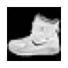

``` python
??collate_dict
```

    Signature: collate_dict(ds)
    Docstring: <no docstring>
    Source:   
    def collate_dict(ds):
      get = itemgetter(*ds.features)
      def _f(b): return get(default_collate(b))
      return _f
    File:      ~/Documents/S07/40–49 Artificial Intelligence/42 Miniprojects/xiaoai/xiaoai/core.py
    Type:      function

``` python
cf = collate_dict(ds); cf
```

    <function xiaoai.core.collate_dict.<locals>._f(b)>

``` python
from torch.utils.data import DataLoader
from xiaoai.conv import to_device
```

``` python
def collate_(b): return to_device(cf(b))
def data_loaders(dsd, bs, **kwargs): return {k:DataLoader(v, bs, **kwargs) for k,v in dsd.items()}
```

``` python
dls = data_loaders(tdsd, bs, collate_fn=collate_)
```

``` python
dlst, dlsv = dls['train'], dls['test']; dlst, dlsv
```

    (<torch.utils.data.dataloader.DataLoader>,
     <torch.utils.data.dataloader.DataLoader>)

``` python
from xiaoai.core import *
from xiaoai.conv import *
```

``` python
with suplog(): xb,yb = next(iter(dlst))
```

    Traceback (most recent call last):
      File "/Users/salmannaqvi/miniforge3/envs/default/lib/python3.11/site-packages/torch/utils/data/_utils/collate.py", line 155, in collate
        clone.update({key: collate([d[key] for d in batch], collate_fn_map=collate_fn_map) for key in elem})
                     ^^^^^^^^^^^^^^^^^^^^^^^^^^^^^^^^^^^^^^^^^^^^^^^^^^^^^^^^^^^^^^^^^^^^^^^^^^^^^^^^^^^^^^
      File "/Users/salmannaqvi/miniforge3/envs/default/lib/python3.11/site-packages/torch/utils/data/_utils/collate.py", line 155, in <dictcomp>
        clone.update({key: collate([d[key] for d in batch], collate_fn_map=collate_fn_map) for key in elem})
                           ^^^^^^^^^^^^^^^^^^^^^^^^^^^^^^^^^^^^^^^^^^^^^^^^^^^^^^^^^^^^^^^
      File "/Users/salmannaqvi/miniforge3/envs/default/lib/python3.11/site-packages/torch/utils/data/_utils/collate.py", line 192, in collate
        raise TypeError(default_collate_err_msg_format.format(elem_type))
    TypeError: default_collate: batch must contain tensors, numpy arrays, numbers, dicts or lists; found <class 'PIL.PngImagePlugin.PngImageFile'>

    During handling of the above exception, another exception occurred:

    Traceback (most recent call last):
      File "/Users/salmannaqvi/Documents/S07/40–49 Artificial Intelligence/42 Miniprojects/xiaoai/xiaoai/conv.py", line 14, in suplog
        try: yield
             ^^^^^
      File "/var/folders/fy/vg316qk1001227svr6d4d8l40000gn/T/ipykernel_21414/2296631074.py", line 1, in <module>
        with suplog(): xb,yb = next(iter(dlst))
                               ^^^^^^^^^^^^^^^^
      File "/Users/salmannaqvi/miniforge3/envs/default/lib/python3.11/site-packages/torch/utils/data/dataloader.py", line 630, in __next__
        data = self._next_data()
               ^^^^^^^^^^^^^^^^^
      File "/Users/salmannaqvi/miniforge3/envs/default/lib/python3.11/site-packages/torch/utils/data/dataloader.py", line 673, in _next_data
        data = self._dataset_fetcher.fetch(index)  # may raise StopIteration
               ^^^^^^^^^^^^^^^^^^^^^^^^^^^^^^^^^^
      File "/Users/salmannaqvi/miniforge3/envs/default/lib/python3.11/site-packages/torch/utils/data/_utils/fetch.py", line 55, in fetch
        return self.collate_fn(data)
               ^^^^^^^^^^^^^^^^^^^^^
      File "/var/folders/fy/vg316qk1001227svr6d4d8l40000gn/T/ipykernel_21414/3900802733.py", line 1, in collate_
        def collate_(b): return to_device(cf(b))
                                          ^^^^^
      File "/Users/salmannaqvi/Documents/S07/40–49 Artificial Intelligence/42 Miniprojects/xiaoai/xiaoai/core.py", line 27, in _f
        def _f(b): return get(default_collate(b))
                              ^^^^^^^^^^^^^^^^^^
      File "/Users/salmannaqvi/miniforge3/envs/default/lib/python3.11/site-packages/torch/utils/data/_utils/collate.py", line 317, in default_collate
        return collate(batch, collate_fn_map=default_collate_fn_map)
               ^^^^^^^^^^^^^^^^^^^^^^^^^^^^^^^^^^^^^^^^^^^^^^^^^^^^^
      File "/Users/salmannaqvi/miniforge3/envs/default/lib/python3.11/site-packages/torch/utils/data/_utils/collate.py", line 162, in collate
        return {key: collate([d[key] for d in batch], collate_fn_map=collate_fn_map) for key in elem}
               ^^^^^^^^^^^^^^^^^^^^^^^^^^^^^^^^^^^^^^^^^^^^^^^^^^^^^^^^^^^^^^^^^^^^^^^^^^^^^^^^^^^^^^
      File "/Users/salmannaqvi/miniforge3/envs/default/lib/python3.11/site-packages/torch/utils/data/_utils/collate.py", line 162, in <dictcomp>
        return {key: collate([d[key] for d in batch], collate_fn_map=collate_fn_map) for key in elem}
                     ^^^^^^^^^^^^^^^^^^^^^^^^^^^^^^^^^^^^^^^^^^^^^^^^^^^^^^^^^^^^^^^
      File "/Users/salmannaqvi/miniforge3/envs/default/lib/python3.11/site-packages/torch/utils/data/_utils/collate.py", line 192, in collate
        raise TypeError(default_collate_err_msg_format.format(elem_type))
    TypeError: default_collate: batch must contain tensors, numpy arrays, numbers, dicts or lists; found <class 'PIL.PngImagePlugin.PngImageFile'>

``` python
tdsd['train'][0]
```

    {'image': <PIL.PngImagePlugin.PngImageFile image mode=L size=28x28>,
     'label': 9}

It seems that `transformi` is not working. 🤨

``` python
??transformi
```

    Signature: transformi(b)
    Docstring: <no docstring>
    Source:   
      def _f(b):
        f(b)
        return b
    File:      ~/Documents/S07/40–49 Artificial Intelligence/42 Miniprojects/xiaoai/xiaoai/core.py
    Type:      function

Upon further inspection, it’s because after creating the list, I’m not
assigning it back to the batch! Let’s fix that.

``` python
@inplace
def transformi(b): b[x] = [TF.to_tensor(o) for o in b[x]]
```

``` python
tdsd = dsd.with_transform(transformi)
tdsd['train'][0]
```

    {'image': tensor([[[0.0000, 0.0000, 0.0000, 0.0000, 0.0000, 0.0000, 0.0000, 0.0000,
               0.0000, 0.0000, 0.0000, 0.0000, 0.0000, 0.0000, 0.0000, 0.0000,
               0.0000, 0.0000, 0.0000, 0.0000, 0.0000, 0.0000, 0.0000, 0.0000,
               0.0000, 0.0000, 0.0000, 0.0000],
              [0.0000, 0.0000, 0.0000, 0.0000, 0.0000, 0.0000, 0.0000, 0.0000,
               0.0000, 0.0000, 0.0000, 0.0000, 0.0000, 0.0000, 0.0000, 0.0000,
               0.0000, 0.0000, 0.0000, 0.0000, 0.0000, 0.0000, 0.0000, 0.0000,
               0.0000, 0.0000, 0.0000, 0.0000],
              [0.0000, 0.0000, 0.0000, 0.0000, 0.0000, 0.0000, 0.0000, 0.0000,
               0.0000, 0.0000, 0.0000, 0.0000, 0.0000, 0.0000, 0.0000, 0.0000,
               0.0000, 0.0000, 0.0000, 0.0000, 0.0000, 0.0000, 0.0000, 0.0000,
               0.0000, 0.0000, 0.0000, 0.0000],
              [0.0000, 0.0000, 0.0000, 0.0000, 0.0000, 0.0000, 0.0000, 0.0000,
               0.0000, 0.0000, 0.0000, 0.0000, 0.0039, 0.0000, 0.0000, 0.0510,
               0.2863, 0.0000, 0.0000, 0.0039, 0.0157, 0.0000, 0.0000, 0.0000,
               0.0000, 0.0039, 0.0039, 0.0000],
              [0.0000, 0.0000, 0.0000, 0.0000, 0.0000, 0.0000, 0.0000, 0.0000,
               0.0000, 0.0000, 0.0000, 0.0000, 0.0118, 0.0000, 0.1412, 0.5333,
               0.4980, 0.2431, 0.2118, 0.0000, 0.0000, 0.0000, 0.0039, 0.0118,
               0.0157, 0.0000, 0.0000, 0.0118],
              [0.0000, 0.0000, 0.0000, 0.0000, 0.0000, 0.0000, 0.0000, 0.0000,
               0.0000, 0.0000, 0.0000, 0.0000, 0.0235, 0.0000, 0.4000, 0.8000,
               0.6902, 0.5255, 0.5647, 0.4824, 0.0902, 0.0000, 0.0000, 0.0000,
               0.0000, 0.0471, 0.0392, 0.0000],
              [0.0000, 0.0000, 0.0000, 0.0000, 0.0000, 0.0000, 0.0000, 0.0000,
               0.0000, 0.0000, 0.0000, 0.0000, 0.0000, 0.0000, 0.6078, 0.9255,
               0.8118, 0.6980, 0.4196, 0.6118, 0.6314, 0.4275, 0.2510, 0.0902,
               0.3020, 0.5098, 0.2824, 0.0588],
              [0.0000, 0.0000, 0.0000, 0.0000, 0.0000, 0.0000, 0.0000, 0.0000,
               0.0000, 0.0000, 0.0000, 0.0039, 0.0000, 0.2706, 0.8118, 0.8745,
               0.8549, 0.8471, 0.8471, 0.6392, 0.4980, 0.4745, 0.4784, 0.5725,
               0.5529, 0.3451, 0.6745, 0.2588],
              [0.0000, 0.0000, 0.0000, 0.0000, 0.0000, 0.0000, 0.0000, 0.0000,
               0.0000, 0.0039, 0.0039, 0.0039, 0.0000, 0.7843, 0.9098, 0.9098,
               0.9137, 0.8980, 0.8745, 0.8745, 0.8431, 0.8353, 0.6431, 0.4980,
               0.4824, 0.7686, 0.8980, 0.0000],
              [0.0000, 0.0000, 0.0000, 0.0000, 0.0000, 0.0000, 0.0000, 0.0000,
               0.0000, 0.0000, 0.0000, 0.0000, 0.0000, 0.7176, 0.8824, 0.8471,
               0.8745, 0.8941, 0.9216, 0.8902, 0.8784, 0.8706, 0.8784, 0.8667,
               0.8745, 0.9608, 0.6784, 0.0000],
              [0.0000, 0.0000, 0.0000, 0.0000, 0.0000, 0.0000, 0.0000, 0.0000,
               0.0000, 0.0000, 0.0000, 0.0000, 0.0000, 0.7569, 0.8941, 0.8549,
               0.8353, 0.7765, 0.7059, 0.8314, 0.8235, 0.8275, 0.8353, 0.8745,
               0.8627, 0.9529, 0.7922, 0.0000],
              [0.0000, 0.0000, 0.0000, 0.0000, 0.0000, 0.0000, 0.0000, 0.0000,
               0.0000, 0.0039, 0.0118, 0.0000, 0.0471, 0.8588, 0.8627, 0.8314,
               0.8549, 0.7529, 0.6627, 0.8902, 0.8157, 0.8549, 0.8784, 0.8314,
               0.8863, 0.7725, 0.8196, 0.2039],
              [0.0000, 0.0000, 0.0000, 0.0000, 0.0000, 0.0000, 0.0000, 0.0000,
               0.0000, 0.0000, 0.0235, 0.0000, 0.3882, 0.9569, 0.8706, 0.8627,
               0.8549, 0.7961, 0.7765, 0.8667, 0.8431, 0.8353, 0.8706, 0.8627,
               0.9608, 0.4667, 0.6549, 0.2196],
              [0.0000, 0.0000, 0.0000, 0.0000, 0.0000, 0.0000, 0.0000, 0.0000,
               0.0000, 0.0157, 0.0000, 0.0000, 0.2157, 0.9255, 0.8941, 0.9020,
               0.8941, 0.9412, 0.9098, 0.8353, 0.8549, 0.8745, 0.9176, 0.8510,
               0.8510, 0.8196, 0.3608, 0.0000],
              [0.0000, 0.0000, 0.0039, 0.0157, 0.0235, 0.0275, 0.0078, 0.0000,
               0.0000, 0.0000, 0.0000, 0.0000, 0.9294, 0.8863, 0.8510, 0.8745,
               0.8706, 0.8588, 0.8706, 0.8667, 0.8471, 0.8745, 0.8980, 0.8431,
               0.8549, 1.0000, 0.3020, 0.0000],
              [0.0000, 0.0118, 0.0000, 0.0000, 0.0000, 0.0000, 0.0000, 0.0000,
               0.0000, 0.2431, 0.5686, 0.8000, 0.8941, 0.8118, 0.8353, 0.8667,
               0.8549, 0.8157, 0.8275, 0.8549, 0.8784, 0.8745, 0.8588, 0.8431,
               0.8784, 0.9569, 0.6235, 0.0000],
              [0.0000, 0.0000, 0.0000, 0.0000, 0.0706, 0.1725, 0.3216, 0.4196,
               0.7412, 0.8941, 0.8627, 0.8706, 0.8510, 0.8863, 0.7843, 0.8039,
               0.8275, 0.9020, 0.8784, 0.9176, 0.6902, 0.7373, 0.9804, 0.9725,
               0.9137, 0.9333, 0.8431, 0.0000],
              [0.0000, 0.2235, 0.7333, 0.8157, 0.8784, 0.8667, 0.8784, 0.8157,
               0.8000, 0.8392, 0.8157, 0.8196, 0.7843, 0.6235, 0.9608, 0.7569,
               0.8078, 0.8745, 1.0000, 1.0000, 0.8667, 0.9176, 0.8667, 0.8275,
               0.8627, 0.9098, 0.9647, 0.0000],
              [0.0118, 0.7922, 0.8941, 0.8784, 0.8667, 0.8275, 0.8275, 0.8392,
               0.8039, 0.8039, 0.8039, 0.8627, 0.9412, 0.3137, 0.5882, 1.0000,
               0.8980, 0.8667, 0.7373, 0.6039, 0.7490, 0.8235, 0.8000, 0.8196,
               0.8706, 0.8941, 0.8824, 0.0000],
              [0.3843, 0.9137, 0.7765, 0.8235, 0.8706, 0.8980, 0.8980, 0.9176,
               0.9765, 0.8627, 0.7608, 0.8431, 0.8510, 0.9451, 0.2549, 0.2863,
               0.4157, 0.4588, 0.6588, 0.8588, 0.8667, 0.8431, 0.8510, 0.8745,
               0.8745, 0.8784, 0.8980, 0.1137],
              [0.2941, 0.8000, 0.8314, 0.8000, 0.7569, 0.8039, 0.8275, 0.8824,
               0.8471, 0.7255, 0.7725, 0.8078, 0.7765, 0.8353, 0.9412, 0.7647,
               0.8902, 0.9608, 0.9373, 0.8745, 0.8549, 0.8314, 0.8196, 0.8706,
               0.8627, 0.8667, 0.9020, 0.2627],
              [0.1882, 0.7961, 0.7176, 0.7608, 0.8353, 0.7725, 0.7255, 0.7451,
               0.7608, 0.7529, 0.7922, 0.8392, 0.8588, 0.8667, 0.8627, 0.9255,
               0.8824, 0.8471, 0.7804, 0.8078, 0.7294, 0.7098, 0.6941, 0.6745,
               0.7098, 0.8039, 0.8078, 0.4510],
              [0.0000, 0.4784, 0.8588, 0.7569, 0.7020, 0.6706, 0.7176, 0.7686,
               0.8000, 0.8235, 0.8353, 0.8118, 0.8275, 0.8235, 0.7843, 0.7686,
               0.7608, 0.7490, 0.7647, 0.7490, 0.7765, 0.7529, 0.6902, 0.6118,
               0.6549, 0.6941, 0.8235, 0.3608],
              [0.0000, 0.0000, 0.2902, 0.7412, 0.8314, 0.7490, 0.6863, 0.6745,
               0.6863, 0.7098, 0.7255, 0.7373, 0.7412, 0.7373, 0.7569, 0.7765,
               0.8000, 0.8196, 0.8235, 0.8235, 0.8275, 0.7373, 0.7373, 0.7608,
               0.7529, 0.8471, 0.6667, 0.0000],
              [0.0078, 0.0000, 0.0000, 0.0000, 0.2588, 0.7843, 0.8706, 0.9294,
               0.9373, 0.9490, 0.9647, 0.9529, 0.9569, 0.8667, 0.8627, 0.7569,
               0.7490, 0.7020, 0.7137, 0.7137, 0.7098, 0.6902, 0.6510, 0.6588,
               0.3882, 0.2275, 0.0000, 0.0000],
              [0.0000, 0.0000, 0.0000, 0.0000, 0.0000, 0.0000, 0.0000, 0.1569,
               0.2392, 0.1725, 0.2824, 0.1608, 0.1373, 0.0000, 0.0000, 0.0000,
               0.0000, 0.0000, 0.0000, 0.0000, 0.0000, 0.0000, 0.0000, 0.0000,
               0.0000, 0.0000, 0.0000, 0.0000],
              [0.0000, 0.0000, 0.0000, 0.0000, 0.0000, 0.0000, 0.0000, 0.0000,
               0.0000, 0.0000, 0.0000, 0.0000, 0.0000, 0.0000, 0.0000, 0.0000,
               0.0000, 0.0000, 0.0000, 0.0000, 0.0000, 0.0000, 0.0000, 0.0000,
               0.0000, 0.0000, 0.0000, 0.0000],
              [0.0000, 0.0000, 0.0000, 0.0000, 0.0000, 0.0000, 0.0000, 0.0000,
               0.0000, 0.0000, 0.0000, 0.0000, 0.0000, 0.0000, 0.0000, 0.0000,
               0.0000, 0.0000, 0.0000, 0.0000, 0.0000, 0.0000, 0.0000, 0.0000,
               0.0000, 0.0000, 0.0000, 0.0000]]]),
     'label': 9}

There! Working.

``` python
ds = tdsd['train']
cf = collate_dict(ds)
dls = data_loaders(tdsd, bs, collate_fn=collate_)
dlst, dlsv = dls['train'], dls['test']; dlst, dlsv
```

    (<torch.utils.data.dataloader.DataLoader>,
     <torch.utils.data.dataloader.DataLoader>)

``` python
xb,yb = next(iter(dlst)); xb,yb
```

    (tensor([[[[0., 0., 0.,  ..., 0., 0., 0.],
               [0., 0., 0.,  ..., 0., 0., 0.],
               [0., 0., 0.,  ..., 0., 0., 0.],
               ...,
               [0., 0., 0.,  ..., 0., 0., 0.],
               [0., 0., 0.,  ..., 0., 0., 0.],
               [0., 0., 0.,  ..., 0., 0., 0.]]],
     
     
             [[[0., 0., 0.,  ..., 0., 0., 0.],
               [0., 0., 0.,  ..., 0., 0., 0.],
               [0., 0., 0.,  ..., 0., 0., 0.],
               ...,
               [0., 0., 0.,  ..., 0., 0., 0.],
               [0., 0., 0.,  ..., 0., 0., 0.],
               [0., 0., 0.,  ..., 0., 0., 0.]]],
     
     
             [[[0., 0., 0.,  ..., 0., 0., 0.],
               [0., 0., 0.,  ..., 0., 0., 0.],
               [0., 0., 0.,  ..., 0., 0., 0.],
               ...,
               [0., 0., 0.,  ..., 0., 0., 0.],
               [0., 0., 0.,  ..., 0., 0., 0.],
               [0., 0., 0.,  ..., 0., 0., 0.]]],
     
     
             ...,
     
     
             [[[0., 0., 0.,  ..., 0., 0., 0.],
               [0., 0., 0.,  ..., 0., 0., 0.],
               [0., 0., 0.,  ..., 0., 0., 0.],
               ...,
               [0., 0., 0.,  ..., 0., 0., 0.],
               [0., 0., 0.,  ..., 0., 0., 0.],
               [0., 0., 0.,  ..., 0., 0., 0.]]],
     
     
             [[[0., 0., 0.,  ..., 0., 0., 0.],
               [0., 0., 0.,  ..., 0., 0., 0.],
               [0., 0., 0.,  ..., 0., 0., 0.],
               ...,
               [0., 0., 0.,  ..., 0., 0., 0.],
               [0., 0., 0.,  ..., 0., 0., 0.],
               [0., 0., 0.,  ..., 0., 0., 0.]]],
     
     
             [[[0., 0., 0.,  ..., 0., 0., 0.],
               [0., 0., 0.,  ..., 0., 0., 0.],
               [0., 0., 0.,  ..., 0., 0., 0.],
               ...,
               [0., 0., 0.,  ..., 0., 0., 0.],
               [0., 0., 0.,  ..., 0., 0., 0.],
               [0., 0., 0.,  ..., 0., 0., 0.]]]], device='mps:0'),
     tensor([9, 0, 0, 3, 0, 2, 7, 2, 5, 5, 0, 9, 5, 5, 7, 9, 1, 0, 6, 4, 3, 1, 4, 8,
             4, 3, 0, 2, 4, 4, 5, 3, 6, 6, 0, 8, 5, 2, 1, 6, 6, 7, 9, 5, 9, 2, 7, 3,
             0, 3, 3, 3, 7, 2, 2, 6, 6, 8, 3, 3, 5, 0, 5, 5, 0, 2, 0, 0, 4, 1, 3, 1,
             6, 3, 1, 4, 4, 6, 1, 9, 1, 3, 5, 7, 9, 7, 1, 7, 9, 9, 9, 3, 2, 9, 3, 6,
             4, 1, 1, 8, 8, 0, 1, 1, 6, 8, 1, 9, 7, 8, 8, 9, 6, 6, 3, 1, 5, 4, 6, 7,
             5, 5, 9, 2, 2, 2, 7, 6, 4, 1, 8, 7, 7, 5, 4, 2, 9, 1, 7, 4, 6, 9, 7, 1,
             8, 7, 1, 2, 8, 0, 9, 1, 8, 7, 0, 5, 8, 6, 7, 2, 0, 8, 7, 1, 6, 2, 1, 9,
             6, 0, 1, 0, 5, 5, 1, 7, 0, 5, 8, 4, 0, 4, 0, 6, 6, 4, 0, 0, 4, 7, 3, 0,
             5, 8, 4, 1, 1, 2, 9, 2, 8, 5, 0, 6, 3, 4, 6, 0, 9, 1, 7, 3, 8, 5, 8, 3,
             8, 5, 2, 0, 8, 7, 0, 3, 5, 0, 6, 5, 2, 7, 5, 2, 6, 8, 2, 6, 8, 0, 4, 4,
             4, 4, 4, 1, 5, 6, 5, 3, 3, 7, 3, 3, 6, 2, 8, 4], device='mps:0'))

``` python
xb.shape, yb.shape
```

    (torch.Size([256, 1, 28, 28]), torch.Size([256]))

``` python
tdsd['train'].features
```

    {'image': Image(mode=None, decode=True, id=None),
     'label': ClassLabel(names=['T - shirt / top', 'Trouser', 'Pullover', 'Dress', 'Coat', 'Sandal', 'Shirt', 'Sneaker', 'Bag', 'Ankle boot'], id=None)}

``` python
from operator import itemgetter
```

    operator.itemgetter(tensor(9, device='mps:0'), tensor(0, device='mps:0'), tensor(0, device='mps:0'), tensor(3, device='mps:0'), tensor(0, device='mps:0'), tensor(2, device='mps:0'), tensor(7, device='mps:0'), tensor(2, device='mps:0'), tensor(5, device='mps:0'), tensor(5, device='mps:0'), tensor(0, device='mps:0'), tensor(9, device='mps:0'), tensor(5, device='mps:0'), tensor(5, device='mps:0'), tensor(7, device='mps:0'), tensor(9, device='mps:0'))

``` python
lbl_getter = itemgetter(*yb[:16]); lbl_getter
```

``` python
tdsd['train'].features['label'].names
```

    ['T - shirt / top',
     'Trouser',
     'Pullover',
     'Dress',
     'Coat',
     'Sandal',
     'Shirt',
     'Sneaker',
     'Bag',
     'Ankle boot']

``` python
labels = lbl_getter(tdsd['train'].features['label'].names); labels
```

    ('Ankle boot',
     'T - shirt / top',
     'T - shirt / top',
     'Dress',
     'T - shirt / top',
     'Pullover',
     'Sneaker',
     'Pullover',
     'Sandal',
     'Sandal',
     'T - shirt / top',
     'Ankle boot',
     'Sandal',
     'Sandal',
     'Sneaker',
     'Ankle boot')

``` python
?show_images
```

    Signature:
    show_images(
        ims: list,
        nrows: int | None = None,
        ncols: int | None = None,
        titles: list | None = None,
        *,
        figsize: tuple = None,
        imsize: int = 3,
        suptitle: str = None,
        sharex: "bool | Literal['none', 'all', 'row', 'col']" = False,
        sharey: "bool | Literal['none', 'all', 'row', 'col']" = False,
        squeeze: 'bool' = True,
        width_ratios: 'Sequence[float] | None' = None,
        height_ratios: 'Sequence[float] | None' = None,
        subplot_kw: 'dict[str, Any] | None' = None,
        gridspec_kw: 'dict[str, Any] | None' = None,
    )
    Docstring: Show all images `ims` as subplots with `rows` using `titles`
    File:      ~/Documents/S07/40–49 Artificial Intelligence/42 Miniprojects/xiaoai/xiaoai/core.py
    Type:      function

``` python
show_images(xb[:16], titles=labels, imsize=1.7)
```

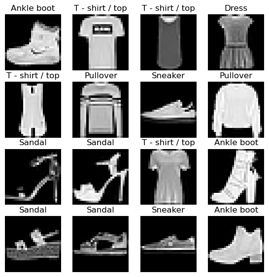

## Warmup - Classify

``` python
from torch import nn
from xiaoai.conv import *
```

``` python
cnn = nn.Sequential(
  conv( 1, 4), # 14x14
  conv( 4, 8), # 7x7
  conv( 8,16), # 4x4
  conv(16,16), # 2x2
  conv(16,10, act=False), # 1x1
  nn.Flatten()
).to(def_device)
```

``` python
bs,lr = 256,.4
```

``` python
from torch import optim
```

    Init signature:
    optim.SGD(
        params,
        lr: float = 0.001,
        momentum: float = 0,
        dampening: float = 0,
        weight_decay: float = 0,
        nesterov=False,
        *,
        maximize: bool = False,
        foreach: Optional[bool] = None,
        differentiable: bool = False,
        fused: Optional[bool] = None,
    )
    Docstring:     
    Implements stochastic gradient descent (optionally with momentum).

    .. math::
       \begin{aligned}
            &\rule{110mm}{0.4pt}                                                                 \\
            &\textbf{input}      : \gamma \text{ (lr)}, \: \theta_0 \text{ (params)}, \: f(\theta)
                \text{ (objective)}, \: \lambda \text{ (weight decay)},                          \\
            &\hspace{13mm} \:\mu \text{ (momentum)}, \:\tau \text{ (dampening)},
            \:\textit{ nesterov,}\:\textit{ maximize}                                     \\[-1.ex]
            &\rule{110mm}{0.4pt}                                                                 \\
            &\textbf{for} \: t=1 \: \textbf{to} \: \ldots \: \textbf{do}                         \\
            &\hspace{5mm}g_t           \leftarrow   \nabla_{\theta} f_t (\theta_{t-1})           \\
            &\hspace{5mm}\textbf{if} \: \lambda \neq 0                                           \\
            &\hspace{10mm} g_t \leftarrow g_t + \lambda  \theta_{t-1}                            \\
            &\hspace{5mm}\textbf{if} \: \mu \neq 0                                               \\
            &\hspace{10mm}\textbf{if} \: t > 1                                                   \\
            &\hspace{15mm} \textbf{b}_t \leftarrow \mu \textbf{b}_{t-1} + (1-\tau) g_t           \\
            &\hspace{10mm}\textbf{else}                                                          \\
            &\hspace{15mm} \textbf{b}_t \leftarrow g_t                                           \\
            &\hspace{10mm}\textbf{if} \: \textit{nesterov}                                       \\
            &\hspace{15mm} g_t \leftarrow g_{t} + \mu \textbf{b}_t                             \\
            &\hspace{10mm}\textbf{else}                                                   \\[-1.ex]
            &\hspace{15mm} g_t  \leftarrow  \textbf{b}_t                                         \\
            &\hspace{5mm}\textbf{if} \: \textit{maximize}                                          \\
            &\hspace{10mm}\theta_t \leftarrow \theta_{t-1} + \gamma g_t                   \\[-1.ex]
            &\hspace{5mm}\textbf{else}                                                    \\[-1.ex]
            &\hspace{10mm}\theta_t \leftarrow \theta_{t-1} - \gamma g_t                   \\[-1.ex]
            &\rule{110mm}{0.4pt}                                                          \\[-1.ex]
            &\bf{return} \:  \theta_t                                                     \\[-1.ex]
            &\rule{110mm}{0.4pt}                                                          \\[-1.ex]
       \end{aligned}

    Nesterov momentum is based on the formula from
    `On the importance of initialization and momentum in deep learning`__.

    Args:
        params (iterable): iterable of parameters to optimize or dicts defining
            parameter groups
        lr (float, optional): learning rate (default: 1e-3)
        momentum (float, optional): momentum factor (default: 0)
        weight_decay (float, optional): weight decay (L2 penalty) (default: 0)
        dampening (float, optional): dampening for momentum (default: 0)
        nesterov (bool, optional): enables Nesterov momentum (default: False)
        maximize (bool, optional): maximize the objective with respect to the
            params, instead of minimizing (default: False)
        foreach (bool, optional): whether foreach implementation of optimizer
            is used. If unspecified by the user (so foreach is None), we will try to use
            foreach over the for-loop implementation on CUDA, since it is usually
            significantly more performant. Note that the foreach implementation uses
            ~ sizeof(params) more peak memory than the for-loop version due to the intermediates
            being a tensorlist vs just one tensor. If memory is prohibitive, batch fewer
            parameters through the optimizer at a time or switch this flag to False (default: None)
        differentiable (bool, optional): whether autograd should
            occur through the optimizer step in training. Otherwise, the step()
            function runs in a torch.no_grad() context. Setting to True can impair
            performance, so leave it False if you don't intend to run autograd
            through this instance (default: False)
        fused (bool, optional): whether the fused implementation is used.
            Currently, `torch.float64`, `torch.float32`, `torch.float16`, and `torch.bfloat16`
            are supported. (default: None)

    .. note:: The foreach and fused implementations are typically faster than the for-loop,
              single-tensor implementation. Thus, if the user has not specified BOTH flags
              (i.e., when foreach = fused = None), we will attempt defaulting to the foreach
              implementation when the tensors are all on CUDA. For example, if the user specifies
              True for fused but nothing for foreach, we will run the fused implementation. If
              the user specifies False for foreach but nothing for fused (or False for fused but
              nothing for foreach), we will run the for-loop implementation. If the user specifies
              True for both foreach and fused, we will prioritize fused over foreach, as it is
              typically faster. We attempt to use the fastest, so the hierarchy goes fused ->
              foreach -> for-loop. HOWEVER, since the fused implementation is relatively new,
              we want to give it sufficient bake-in time, so we default to foreach and NOT
              fused when the user has not specified either flag.


    Example:
        >>> # xdoctest: +SKIP
        >>> optimizer = torch.optim.SGD(model.parameters(), lr=0.1, momentum=0.9)
        >>> optimizer.zero_grad()
        >>> loss_fn(model(input), target).backward()
        >>> optimizer.step()

    __ http://www.cs.toronto.edu/%7Ehinton/absps/momentum.pdf

    .. note::
        The implementation of SGD with Momentum/Nesterov subtly differs from
        Sutskever et al. and implementations in some other frameworks.

        Considering the specific case of Momentum, the update can be written as

        .. math::
            \begin{aligned}
                v_{t+1} & = \mu * v_{t} + g_{t+1}, \\
                p_{t+1} & = p_{t} - \text{lr} * v_{t+1},
            \end{aligned}

        where :math:`p`, :math:`g`, :math:`v` and :math:`\mu` denote the
        parameters, gradient, velocity, and momentum respectively.

        This is in contrast to Sutskever et al. and
        other frameworks which employ an update of the form

        .. math::
            \begin{aligned}
                v_{t+1} & = \mu * v_{t} + \text{lr} * g_{t+1}, \\
                p_{t+1} & = p_{t} - v_{t+1}.
            \end{aligned}

        The Nesterov version is analogously modified.

        Moreover, the initial value of the momentum buffer is set to the
        gradient value at the first step. This is in contrast to some other
        frameworks that initialize it to all zeros.
    File:           ~/miniforge3/envs/default/lib/python3.11/site-packages/torch/optim/sgd.py
    Type:           type
    Subclasses:     NewCls

``` python
?optim.SGD
```

``` python
opt = optim.SGD(cnn.parameters(), lr=lr); opt
```

    SGD (
    Parameter Group 0
        dampening: 0
        differentiable: False
        foreach: None
        fused: None
        lr: 0.4
        maximize: False
        momentum: 0
        nesterov: False
        weight_decay: 0
    )

``` python
from xiaoai.training import *
```

``` python
??fit
```

    Signature: fit(epochs, model, loss_func, opt, trn_dl, vld_dl)
    Docstring: <no docstring>
    Source:   
    def fit(epochs, model, loss_func, opt, trn_dl, vld_dl):
      for epoch in range(epochs):
        model.train()
        for xb, yb in trn_dl:
          loss = loss_func(model(xb), yb)
          loss.backward()
          opt.step()
          opt.zero_grad()
        
        model.eval()
        with torch.no_grad():
          tot_loss, tot_acc, count = 0., 0., 0
          for xb, yb in vld_dl:
            preds = model(xb)
            n = len(xb)
            count += n
            tot_loss += loss_func(preds, yb).item() * n
            tot_acc  += accuracy (preds, yb).item() * n
        print(epoch, tot_loss/count, tot_acc/count)
      return tot_loss/count, tot_acc/count
    File:      ~/Documents/S07/40–49 Artificial Intelligence/42 Miniprojects/xiaoai/xiaoai/training.py
    Type:      function

``` python
import torch.nn.functional as F
```

``` python
loss,acc = fit(5, cnn, F.cross_entropy, opt, dlst, dlsv)
```

    0 1.112137004852295 0.6341
    1 0.6192411111831665 0.7772
    2 0.5116905662536622 0.8181
    3 0.511855121088028 0.815
    4 0.5068988255739212 0.8156

# Autoencoder

``` python
?nn.UpsamplingNearest2d
```

    Init signature:
    nn.UpsamplingNearest2d(
        size: Union[int, Tuple[int, int], NoneType] = None,
        scale_factor: Union[float, Tuple[float, float], NoneType] = None,
    ) -> None
    Docstring:     
    Applies a 2D nearest neighbor upsampling to an input signal composed of several input channels.

    To specify the scale, it takes either the :attr:`size` or the :attr:`scale_factor`
    as it's constructor argument.

    When :attr:`size` is given, it is the output size of the image `(h, w)`.

    Args:
        size (int or Tuple[int, int], optional): output spatial sizes
        scale_factor (float or Tuple[float, float], optional): multiplier for
            spatial size.

    .. warning::
        This class is deprecated in favor of :func:`~nn.functional.interpolate`.

    Shape:
        - Input: :math:`(N, C, H_{in}, W_{in})`
        - Output: :math:`(N, C, H_{out}, W_{out})` where

    .. math::
          H_{out} = \left\lfloor H_{in} \times \text{scale\_factor} \right\rfloor

    .. math::
          W_{out} = \left\lfloor W_{in} \times \text{scale\_factor} \right\rfloor

    Examples::

        >>> input = torch.arange(1, 5, dtype=torch.float32).view(1, 1, 2, 2)
        >>> input
        tensor([[[[1., 2.],
                  [3., 4.]]]])

        >>> m = nn.UpsamplingNearest2d(scale_factor=2)
        >>> m(input)
        tensor([[[[1., 1., 2., 2.],
                  [1., 1., 2., 2.],
                  [3., 3., 4., 4.],
                  [3., 3., 4., 4.]]]])
    Init docstring: Initialize internal Module state, shared by both nn.Module and ScriptModule.
    File:           ~/miniforge3/envs/default/lib/python3.11/site-packages/torch/nn/modules/upsampling.py
    Type:           type
    Subclasses:     

``` python
from torch import tensor
```

``` python
t = tensor([[1,2,3],[4,5,6]])[None,None,...].float(); t, t.shape
```

    (tensor([[[[1., 2., 3.],
               [4., 5., 6.]]]]),
     torch.Size([1, 1, 2, 3]))

``` python
upsample = nn.UpsamplingNearest2d(size=(4,6))
```

``` python
?upsample
```

    Signature:      upsample(*args, **kwargs)
    Type:           UpsamplingNearest2d
    String form:    UpsamplingNearest2d(size=(4, 6), mode='nearest')
    File:           ~/miniforge3/envs/default/lib/python3.11/site-packages/torch/nn/modules/upsampling.py
    Docstring:     
    Applies a 2D nearest neighbor upsampling to an input signal composed of several input channels.

    To specify the scale, it takes either the :attr:`size` or the :attr:`scale_factor`
    as it's constructor argument.

    When :attr:`size` is given, it is the output size of the image `(h, w)`.

    Args:
        size (int or Tuple[int, int], optional): output spatial sizes
        scale_factor (float or Tuple[float, float], optional): multiplier for
            spatial size.

    .. warning::
        This class is deprecated in favor of :func:`~nn.functional.interpolate`.

    Shape:
        - Input: :math:`(N, C, H_{in}, W_{in})`
        - Output: :math:`(N, C, H_{out}, W_{out})` where

    .. math::
          H_{out} = \left\lfloor H_{in} \times \text{scale\_factor} \right\rfloor

    .. math::
          W_{out} = \left\lfloor W_{in} \times \text{scale\_factor} \right\rfloor

    Examples::

        >>> input = torch.arange(1, 5, dtype=torch.float32).view(1, 1, 2, 2)
        >>> input
        tensor([[[[1., 2.],
                  [3., 4.]]]])

        >>> m = nn.UpsamplingNearest2d(scale_factor=2)
        >>> m(input)
        tensor([[[[1., 1., 2., 2.],
                  [1., 1., 2., 2.],
                  [3., 3., 4., 4.],
                  [3., 3., 4., 4.]]]])
    Init docstring: Initialize internal Module state, shared by both nn.Module and ScriptModule.

``` python
upsample(t), upsample(t).shape
```

    (tensor([[[[1., 1., 2., 2., 3., 3.],
               [1., 1., 2., 2., 3., 3.],
               [4., 4., 5., 5., 6., 6.],
               [4., 4., 5., 5., 6., 6.]]]]),
     torch.Size([1, 1, 4, 6]))

`nn.UpsamplingNearest2d` increases the spatial dimensions of a 2D input
tensor through nearest neighbor interpolation. In other words, it
duplicates the nearest pixel values with the `scale_factor` or `size`
parameter.

``` python
nn.UpsamplingNearest2d(scale_factor=2)(t)
```

    tensor([[[[1., 1., 2., 2., 3., 3.],
              [1., 1., 2., 2., 3., 3.],
              [4., 4., 5., 5., 6., 6.],
              [4., 4., 5., 5., 6., 6.]]]])

The convolutoin process can be also be used as a compression method,
since the shape of an image gets reduced. Therefore, the opposite can
uncompress. In this way, an encoder or decoder of sorts can be created.

``` python
def deconv(ni, nf, ks=3, act=True):
  layers = [nn.UpsamplingNearest2d(scale_factor=2),
            nn.Conv2d(ni, nf, stride=1, kernel_size=ks, padding=ks//2)]
  if act: layers.append(nn.ReLU())
  return nn.Sequential(*layers)
```

Here, a decoder has been implemented by increasing spatial dimensions,
then applying a convolution to refine the upsampled dimensions.

``` python
t = tensor([[1, 2, 3, 4],
           [5, 6, 7, 8],
           [9, 10, 11, 12],
           [13, 14, 15, 16]])[None,None,...].float(); t
```

    tensor([[[[ 1.,  2.,  3.,  4.],
              [ 5.,  6.,  7.,  8.],
              [ 9., 10., 11., 12.],
              [13., 14., 15., 16.]]]])

------------------------------------------------------------------------

### eval

>      eval (model, loss_func, valid_dl, epoch=0)

``` python
def fit(epochs, model, loss_func, opt, train_dl, valid_dl):
  for epoch in range(epochs):
    model.train()
    for xb,_ in train_dl:
      loss = loss_func(model(xb), xb)
      loss.backward()
      opt.step()
      opt.zero_grad()
    eval(model, loss_func, valid_dl, epoch)
```

``` python
?nn.ZeroPad2d
```

    Init signature: nn.ZeroPad2d(padding: Union[int, Tuple[int, int, int, int]]) -> None
    Docstring:     
    Pads the input tensor boundaries with zero.

    For `N`-dimensional padding, use :func:`torch.nn.functional.pad()`.

    Args:
        padding (int, tuple): the size of the padding. If is `int`, uses the same
            padding in all boundaries. If a 4-`tuple`, uses (:math:`\text{padding\_left}`,
            :math:`\text{padding\_right}`, :math:`\text{padding\_top}`, :math:`\text{padding\_bottom}`)

    Shape:
        - Input: :math:`(N, C, H_{in}, W_{in})` or :math:`(C, H_{in}, W_{in})`.
        - Output: :math:`(N, C, H_{out}, W_{out})` or :math:`(C, H_{out}, W_{out})`, where

          :math:`H_{out} = H_{in} + \text{padding\_top} + \text{padding\_bottom}`

          :math:`W_{out} = W_{in} + \text{padding\_left} + \text{padding\_right}`

    Examples::

        >>> # xdoctest: +IGNORE_WANT("non-deterministic")
        >>> m = nn.ZeroPad2d(2)
        >>> input = torch.randn(1, 1, 3, 3)
        >>> input
        tensor([[[[-0.1678, -0.4418,  1.9466],
                  [ 0.9604, -0.4219, -0.5241],
                  [-0.9162, -0.5436, -0.6446]]]])
        >>> m(input)
        tensor([[[[ 0.0000,  0.0000,  0.0000,  0.0000,  0.0000,  0.0000,  0.0000],
                  [ 0.0000,  0.0000,  0.0000,  0.0000,  0.0000,  0.0000,  0.0000],
                  [ 0.0000,  0.0000, -0.1678, -0.4418,  1.9466,  0.0000,  0.0000],
                  [ 0.0000,  0.0000,  0.9604, -0.4219, -0.5241,  0.0000,  0.0000],
                  [ 0.0000,  0.0000, -0.9162, -0.5436, -0.6446,  0.0000,  0.0000],
                  [ 0.0000,  0.0000,  0.0000,  0.0000,  0.0000,  0.0000,  0.0000],
                  [ 0.0000,  0.0000,  0.0000,  0.0000,  0.0000,  0.0000,  0.0000]]]])
        >>> # using different paddings for different sides
        >>> m = nn.ZeroPad2d((1, 1, 2, 0))
        >>> m(input)
        tensor([[[[ 0.0000,  0.0000,  0.0000,  0.0000,  0.0000],
                  [ 0.0000,  0.0000,  0.0000,  0.0000,  0.0000],
                  [ 0.0000, -0.1678, -0.4418,  1.9466,  0.0000],
                  [ 0.0000,  0.9604, -0.4219, -0.5241,  0.0000],
                  [ 0.0000, -0.9162, -0.5436, -0.6446,  0.0000]]]])
    Init docstring: Initialize internal Module state, shared by both nn.Module and ScriptModule.
    File:           ~/miniforge3/envs/default/lib/python3.11/site-packages/torch/nn/modules/padding.py
    Type:           type
    Subclasses:     

Here, the input image will be compressed, before right after being
uncompressed.

``` python
ae = nn.Sequential( # 28x28
  nn.ZeroPad2d(2),  # 32x32
  conv(1,2),        # 16x16
  conv(2,4),        # 8x8
  deconv(4,2),      # 16x16
  deconv(2,1, act=False), #32x32
  nn.ZeroPad2d(-2), # 28x28
  nn.Sigmoid()
).to(def_device)
```

``` python
eval(ae, F.mse_loss, dlsv)
```

    0 0.162

``` python
opt = optim.SGD(ae.parameters(), lr=0.01)
```

``` python
fit(5, ae, F.mse_loss, opt, dlst, dlsv)
```

``` python
p = ae(xb)
show_images(p[:16].data.cpu(), imsize=1.5)
```

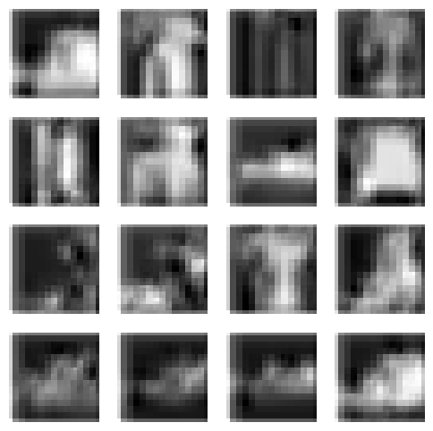

``` python
opt = optim.SGD(ae.parameters(), lr=0.01)
fit(20, ae, F.mse_loss, opt, dlst, dlsv)
p = ae(xb)
show_images(p[:16].data.cpu(), imsize=1.5)
```

    0 0.127
    1 0.126
    2 0.125
    3 0.125
    4 0.125
    5 0.124
    6 0.124
    7 0.124
    8 0.124
    9 0.124
    10 0.124
    11 0.124
    12 0.124
    13 0.124
    14 0.124
    15 0.124
    16 0.124
    17 0.124
    18 0.124
    19 0.124

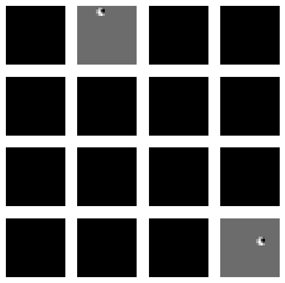

``` python
opt = optim.SGD(ae.parameters(), lr=0.1)
fit(5, ae, F.mse_loss, opt, dlst, dlsv)
p = ae(xb)
show_images(p[:16].data.cpu(), imsize=1.5)
```

    0 0.043
    1 0.030
    2 0.025
    3 0.022
    4 0.021

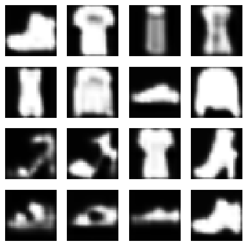

``` python
opt = optim.SGD(ae.parameters(), lr=0.5)
fit(5, ae, F.mse_loss, opt, dlst, dlsv)
p = ae(xb)
show_images(p[:16].data.cpu(), imsize=1.5)
```

    0 0.021
    1 0.018
    2 0.017
    3 0.015
    4 0.016

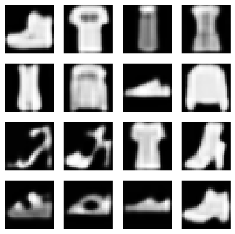

``` python
opt = optim.SGD(ae.parameters(), lr=1)
fit(5, ae, F.mse_loss, opt, dlst, dlsv)
p = ae(xb)
show_images(p[:16].data.cpu(), imsize=1.5)
```

    0 0.019
    1 0.020
    2 0.018
    3 0.019
    4 0.018

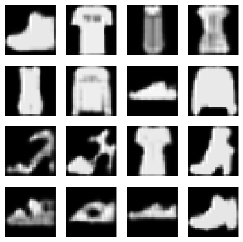

``` python
opt = optim.SGD(ae.parameters(), lr=2)
fit(5, ae, F.mse_loss, opt, dlst, dlsv)
p = ae(xb)
show_images(p[:16].data.cpu(), imsize=1.5)
```

    0 0.022
    1 0.021
    2 0.021
    3 0.020
    4 0.020

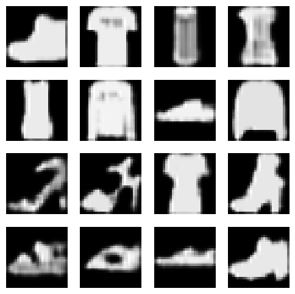

``` python
opt = optim.SGD(ae.parameters(), lr=0.5)
fit(10, ae, F.mse_loss, opt, dlst, dlsv)
p = ae(xb)
show_images(p[:16].data.cpu(), imsize=1.5)
```

    0 0.028
    1 0.023
    2 0.021
    3 0.020
    4 0.018
    5 0.018
    6 0.018
    7 0.018
    8 0.017
    9 0.018

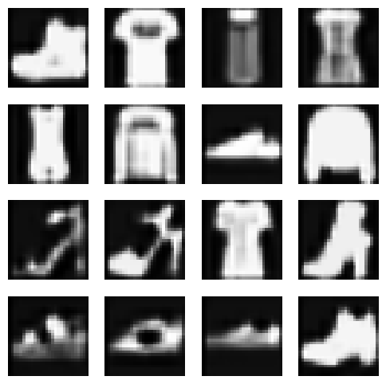

``` python
show_images(xb[:16].data.cpu(), imsize=1.5)
```

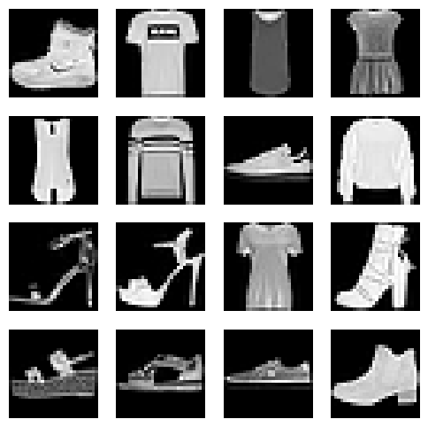

``` python
ae = nn.Sequential( # 28x28
  nn.ZeroPad2d(2),  # 32x32
  conv(1,2),        # 16x16
  conv(2,4),        # 8x8
  conv(4,8),        # 4x4
  deconv(8,4),      # 8x8
  deconv(4,2),      # 16x16
  deconv(2,1, act=False), #32x32
  nn.ZeroPad2d(-2), # 28x28
  nn.Sigmoid()
).to(def_device)
```

``` python
opt = optim.SGD(ae.parameters(), lr=0.5)
fit(10, ae, F.mse_loss, opt, dlst, dlsv)
p = ae(xb)
show_images(p[:16].data.cpu(), imsize=1.5)
```

    0 0.124
    1 0.124
    2 0.124
    3 0.124
    4 0.124
    5 0.124
    6 0.124
    7 0.124
    8 0.124
    9 0.124


``` python
opt = optim.SGD(ae.parameters(), lr=0.1)
fit(5, ae, F.mse_loss, opt, dlst, dlsv)
p = ae(xb)
show_images(p[:16].data.cpu(), imsize=1.5)
```

    0 0.124
    1 0.124
    2 0.124
    3 0.124
    4 0.124

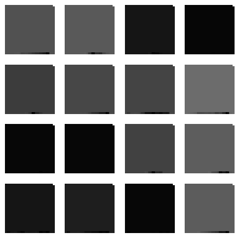

``` python
opt = optim.SGD(ae.parameters(), lr=0.01)
fit(5, ae, F.mse_loss, opt, dlst, dlsv)
p = ae(xb)
show_images(p[:16].data.cpu(), imsize=1.5)
```

    0 0.124
    1 0.124
    2 0.124
    3 0.124
    4 0.124

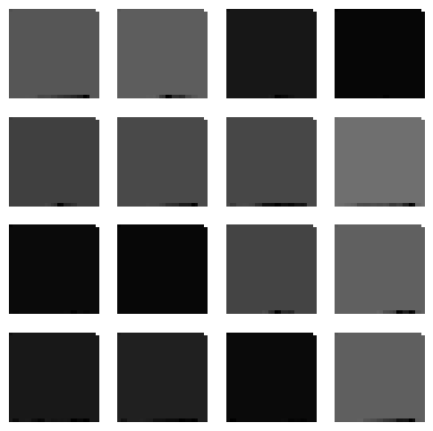
