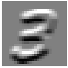
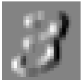
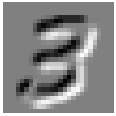
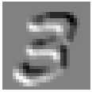
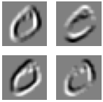

# convolutions


<!-- WARNING: THIS FILE WAS AUTOGENERATED! DO NOT EDIT! -->

``` python
```

    The autoreload extension is already loaded. To reload it, use:
      %reload_ext autoreload

The following is a context manager that allows me to keep error cells
whilst still being able to “Run all”.

------------------------------------------------------------------------

<a href="https://github.com/ForBo7/xiaoai/blob/main/xiaoai/conv.py#L13"
target="_blank" style="float:right; font-size:smaller">source</a>

### suplog

>      suplog ()

``` python
with suplog(): 5/0
```

    Traceback (most recent call last):
      File "/var/folders/fy/vg316qk1001227svr6d4d8l40000gn/T/ipykernel_49068/3430919829.py", line 3, in suplog
        try: yield
             ^^^^^
      File "/var/folders/fy/vg316qk1001227svr6d4d8l40000gn/T/ipykernel_49068/1494549769.py", line 1, in <module>
        with suplog(): 5/0
                       ~^~
    ZeroDivisionError: division by zero

------------------------------------------------------------------------

## Data

I’ll first load in some data.

``` python
from pathlib import Path
```

``` python
data = Path('data/mnist.pkl.gz'); data
```

    Path('data/mnist.pkl.gz')

``` python
import gzip, pickle
from torch import tensor
```

``` python
with gzip.open(data, 'rb') as f: ((xtrn, ytrn), (xvld, yvld), _) = pickle.load(f, encoding='latin-1')
xtrn, ytrn, xvld, yvld = map(tensor, [xtrn, ytrn, xvld, yvld])
```

``` python
xtrn[0].shape
```

    torch.Size([784])

``` python
from xiaoai.core import *
```

``` python
show_image(xtrn[0].view(-1,28,28));
```


## Convolutions

A convolution has three pieces: the object, the scanner, and the
resulting scan (metaphorically). Respectively, this is the tensor, the
kernel, and the activation map. The portion of the tensor being scanned
is known as the receptive field.

The amount a kernel shifts across the tensor is known as stride. A
stride of 1 means the kernel moves 1 pixel at a time. A stride of 2
means the kernel moves 2 pixels at a time.

When the kernel is over an area, a dot product is performed between the
respective areas of the kernel and tensor. In other words, a dot product
is performed between the kernel and the receptive field.

[Matt Kleinsmith]() shows this the best.

``` python
from matplotlib import rcParams
```

``` python
?rcParams
```

    Type:        RcParams
    String form:
    _internal.classic_mode: False
               agg.path.chunksize: 0
               animation.bitrate: -1
               animation.codec: h264
               a <...> : True
               ytick.minor.size: 2.0
               ytick.minor.visible: False
               ytick.minor.width: 0.6
               ytick.right: False
    Length:      316
    File:        ~/miniforge3/envs/default/lib/python3.11/site-packages/matplotlib/__init__.py
    Docstring:  
    A dict-like key-value store for config parameters, including validation.

    Validating functions are defined and associated with rc parameters in
    :mod:`matplotlib.rcsetup`.

    The list of rcParams is:

    - _internal.classic_mode
    - agg.path.chunksize
    - animation.bitrate
    - animation.codec
    - animation.convert_args
    - animation.convert_path
    - animation.embed_limit
    - animation.ffmpeg_args
    - animation.ffmpeg_path
    - animation.frame_format
    - animation.html
    - animation.writer
    - axes.autolimit_mode
    - axes.axisbelow
    - axes.edgecolor
    - axes.facecolor
    - axes.formatter.limits
    - axes.formatter.min_exponent
    - axes.formatter.offset_threshold
    - axes.formatter.use_locale
    - axes.formatter.use_mathtext
    - axes.formatter.useoffset
    - axes.grid
    - axes.grid.axis
    - axes.grid.which
    - axes.labelcolor
    - axes.labelpad
    - axes.labelsize
    - axes.labelweight
    - axes.linewidth
    - axes.prop_cycle
    - axes.spines.bottom
    - axes.spines.left
    - axes.spines.right
    - axes.spines.top
    - axes.titlecolor
    - axes.titlelocation
    - axes.titlepad
    - axes.titlesize
    - axes.titleweight
    - axes.titley
    - axes.unicode_minus
    - axes.xmargin
    - axes.ymargin
    - axes.zmargin
    - axes3d.grid
    - axes3d.xaxis.panecolor
    - axes3d.yaxis.panecolor
    - axes3d.zaxis.panecolor
    - backend
    - backend_fallback
    - boxplot.bootstrap
    - boxplot.boxprops.color
    - boxplot.boxprops.linestyle
    - boxplot.boxprops.linewidth
    - boxplot.capprops.color
    - boxplot.capprops.linestyle
    - boxplot.capprops.linewidth
    - boxplot.flierprops.color
    - boxplot.flierprops.linestyle
    - boxplot.flierprops.linewidth
    - boxplot.flierprops.marker
    - boxplot.flierprops.markeredgecolor
    - boxplot.flierprops.markeredgewidth
    - boxplot.flierprops.markerfacecolor
    - boxplot.flierprops.markersize
    - boxplot.meanline
    - boxplot.meanprops.color
    - boxplot.meanprops.linestyle
    - boxplot.meanprops.linewidth
    - boxplot.meanprops.marker
    - boxplot.meanprops.markeredgecolor
    - boxplot.meanprops.markerfacecolor
    - boxplot.meanprops.markersize
    - boxplot.medianprops.color
    - boxplot.medianprops.linestyle
    - boxplot.medianprops.linewidth
    - boxplot.notch
    - boxplot.patchartist
    - boxplot.showbox
    - boxplot.showcaps
    - boxplot.showfliers
    - boxplot.showmeans
    - boxplot.vertical
    - boxplot.whiskerprops.color
    - boxplot.whiskerprops.linestyle
    - boxplot.whiskerprops.linewidth
    - boxplot.whiskers
    - contour.algorithm
    - contour.corner_mask
    - contour.linewidth
    - contour.negative_linestyle
    - date.autoformatter.day
    - date.autoformatter.hour
    - date.autoformatter.microsecond
    - date.autoformatter.minute
    - date.autoformatter.month
    - date.autoformatter.second
    - date.autoformatter.year
    - date.converter
    - date.epoch
    - date.interval_multiples
    - docstring.hardcopy
    - errorbar.capsize
    - figure.autolayout
    - figure.constrained_layout.h_pad
    - figure.constrained_layout.hspace
    - figure.constrained_layout.use
    - figure.constrained_layout.w_pad
    - figure.constrained_layout.wspace
    - figure.dpi
    - figure.edgecolor
    - figure.facecolor
    - figure.figsize
    - figure.frameon
    - figure.hooks
    - figure.labelsize
    - figure.labelweight
    - figure.max_open_warning
    - figure.raise_window
    - figure.subplot.bottom
    - figure.subplot.hspace
    - figure.subplot.left
    - figure.subplot.right
    - figure.subplot.top
    - figure.subplot.wspace
    - figure.titlesize
    - figure.titleweight
    - font.cursive
    - font.family
    - font.fantasy
    - font.monospace
    - font.sans-serif
    - font.serif
    - font.size
    - font.stretch
    - font.style
    - font.variant
    - font.weight
    - grid.alpha
    - grid.color
    - grid.linestyle
    - grid.linewidth
    - hatch.color
    - hatch.linewidth
    - hist.bins
    - image.aspect
    - image.cmap
    - image.composite_image
    - image.interpolation
    - image.lut
    - image.origin
    - image.resample
    - interactive
    - keymap.back
    - keymap.copy
    - keymap.forward
    - keymap.fullscreen
    - keymap.grid
    - keymap.grid_minor
    - keymap.help
    - keymap.home
    - keymap.pan
    - keymap.quit
    - keymap.quit_all
    - keymap.save
    - keymap.xscale
    - keymap.yscale
    - keymap.zoom
    - legend.borderaxespad
    - legend.borderpad
    - legend.columnspacing
    - legend.edgecolor
    - legend.facecolor
    - legend.fancybox
    - legend.fontsize
    - legend.framealpha
    - legend.frameon
    - legend.handleheight
    - legend.handlelength
    - legend.handletextpad
    - legend.labelcolor
    - legend.labelspacing
    - legend.loc
    - legend.markerscale
    - legend.numpoints
    - legend.scatterpoints
    - legend.shadow
    - legend.title_fontsize
    - lines.antialiased
    - lines.color
    - lines.dash_capstyle
    - lines.dash_joinstyle
    - lines.dashdot_pattern
    - lines.dashed_pattern
    - lines.dotted_pattern
    - lines.linestyle
    - lines.linewidth
    - lines.marker
    - lines.markeredgecolor
    - lines.markeredgewidth
    - lines.markerfacecolor
    - lines.markersize
    - lines.scale_dashes
    - lines.solid_capstyle
    - lines.solid_joinstyle
    - macosx.window_mode
    - markers.fillstyle
    - mathtext.bf
    - mathtext.bfit
    - mathtext.cal
    - mathtext.default
    - mathtext.fallback
    - mathtext.fontset
    - mathtext.it
    - mathtext.rm
    - mathtext.sf
    - mathtext.tt
    - patch.antialiased
    - patch.edgecolor
    - patch.facecolor
    - patch.force_edgecolor
    - patch.linewidth
    - path.effects
    - path.simplify
    - path.simplify_threshold
    - path.sketch
    - path.snap
    - pcolor.shading
    - pcolormesh.snap
    - pdf.compression
    - pdf.fonttype
    - pdf.inheritcolor
    - pdf.use14corefonts
    - pgf.preamble
    - pgf.rcfonts
    - pgf.texsystem
    - polaraxes.grid
    - ps.distiller.res
    - ps.fonttype
    - ps.papersize
    - ps.useafm
    - ps.usedistiller
    - savefig.bbox
    - savefig.directory
    - savefig.dpi
    - savefig.edgecolor
    - savefig.facecolor
    - savefig.format
    - savefig.orientation
    - savefig.pad_inches
    - savefig.transparent
    - scatter.edgecolors
    - scatter.marker
    - svg.fonttype
    - svg.hashsalt
    - svg.image_inline
    - text.antialiased
    - text.color
    - text.hinting
    - text.hinting_factor
    - text.kerning_factor
    - text.latex.preamble
    - text.parse_math
    - text.usetex
    - timezone
    - tk.window_focus
    - toolbar
    - webagg.address
    - webagg.open_in_browser
    - webagg.port
    - webagg.port_retries
    - xaxis.labellocation
    - xtick.alignment
    - xtick.bottom
    - xtick.color
    - xtick.direction
    - xtick.labelbottom
    - xtick.labelcolor
    - xtick.labelsize
    - xtick.labeltop
    - xtick.major.bottom
    - xtick.major.pad
    - xtick.major.size
    - xtick.major.top
    - xtick.major.width
    - xtick.minor.bottom
    - xtick.minor.ndivs
    - xtick.minor.pad
    - xtick.minor.size
    - xtick.minor.top
    - xtick.minor.visible
    - xtick.minor.width
    - xtick.top
    - yaxis.labellocation
    - ytick.alignment
    - ytick.color
    - ytick.direction
    - ytick.labelcolor
    - ytick.labelleft
    - ytick.labelright
    - ytick.labelsize
    - ytick.left
    - ytick.major.left
    - ytick.major.pad
    - ytick.major.right
    - ytick.major.size
    - ytick.major.width
    - ytick.minor.left
    - ytick.minor.ndivs
    - ytick.minor.pad
    - ytick.minor.right
    - ytick.minor.size
    - ytick.minor.visible
    - ytick.minor.width
    - ytick.right

    See Also
    --------
    :ref:`customizing-with-matplotlibrc-files`

``` python
rcParams['image.cmap'] = 'gray'
rcParams['figure.dpi'] = 30
```

``` python
ximgs,xvimgs = xtrn.view(-1,28,28), xvld.view(-1,28,28)
```

``` python
im3 = ximgs[7]
show_image(im3);
```


Let’s create a kernel that detects a digit’s top edge.

``` python
top_edge = tensor([[-1,-1,-1],
                   [ 0, 0, 0],
                   [ 1, 1, 1]]).float()
```

``` python
show_image(top_edge, noframe=False);
```


Let’s also visualize how it detects so.

``` python
import pandas as pd
```

``` python
df = pd.DataFrame(im3[:13,:23])
df.style.format(precision=2).set_properties(**{'font-size':'7pt'}).background_gradient('Greys')
```

<style type="text/css">
#T_5f208_row0_col0, #T_5f208_row0_col1, #T_5f208_row0_col2, #T_5f208_row0_col3, #T_5f208_row0_col4, #T_5f208_row0_col5, #T_5f208_row0_col6, #T_5f208_row0_col7, #T_5f208_row0_col8, #T_5f208_row0_col9, #T_5f208_row0_col10, #T_5f208_row0_col11, #T_5f208_row0_col12, #T_5f208_row0_col13, #T_5f208_row0_col14, #T_5f208_row0_col15, #T_5f208_row0_col16, #T_5f208_row0_col17, #T_5f208_row0_col18, #T_5f208_row0_col19, #T_5f208_row0_col20, #T_5f208_row0_col21, #T_5f208_row0_col22, #T_5f208_row1_col0, #T_5f208_row1_col1, #T_5f208_row1_col2, #T_5f208_row1_col3, #T_5f208_row1_col4, #T_5f208_row1_col5, #T_5f208_row1_col6, #T_5f208_row1_col7, #T_5f208_row1_col8, #T_5f208_row1_col9, #T_5f208_row1_col10, #T_5f208_row1_col11, #T_5f208_row1_col12, #T_5f208_row1_col13, #T_5f208_row1_col14, #T_5f208_row1_col15, #T_5f208_row1_col16, #T_5f208_row1_col17, #T_5f208_row1_col18, #T_5f208_row1_col19, #T_5f208_row1_col20, #T_5f208_row1_col21, #T_5f208_row1_col22, #T_5f208_row2_col0, #T_5f208_row2_col1, #T_5f208_row2_col2, #T_5f208_row2_col3, #T_5f208_row2_col4, #T_5f208_row2_col5, #T_5f208_row2_col6, #T_5f208_row2_col7, #T_5f208_row2_col8, #T_5f208_row2_col9, #T_5f208_row2_col10, #T_5f208_row2_col11, #T_5f208_row2_col12, #T_5f208_row2_col13, #T_5f208_row2_col14, #T_5f208_row2_col15, #T_5f208_row2_col16, #T_5f208_row2_col17, #T_5f208_row2_col18, #T_5f208_row2_col19, #T_5f208_row2_col20, #T_5f208_row2_col21, #T_5f208_row2_col22, #T_5f208_row3_col0, #T_5f208_row3_col1, #T_5f208_row3_col2, #T_5f208_row3_col3, #T_5f208_row3_col4, #T_5f208_row3_col5, #T_5f208_row3_col6, #T_5f208_row3_col7, #T_5f208_row3_col8, #T_5f208_row3_col9, #T_5f208_row3_col10, #T_5f208_row3_col11, #T_5f208_row3_col12, #T_5f208_row3_col13, #T_5f208_row3_col14, #T_5f208_row3_col15, #T_5f208_row3_col16, #T_5f208_row3_col17, #T_5f208_row3_col18, #T_5f208_row3_col19, #T_5f208_row3_col20, #T_5f208_row3_col21, #T_5f208_row3_col22, #T_5f208_row4_col0, #T_5f208_row4_col1, #T_5f208_row4_col2, #T_5f208_row4_col3, #T_5f208_row4_col4, #T_5f208_row4_col5, #T_5f208_row4_col6, #T_5f208_row4_col7, #T_5f208_row4_col8, #T_5f208_row4_col9, #T_5f208_row4_col10, #T_5f208_row4_col11, #T_5f208_row4_col12, #T_5f208_row4_col13, #T_5f208_row4_col14, #T_5f208_row4_col15, #T_5f208_row4_col16, #T_5f208_row4_col17, #T_5f208_row4_col18, #T_5f208_row4_col19, #T_5f208_row4_col20, #T_5f208_row4_col21, #T_5f208_row4_col22, #T_5f208_row5_col0, #T_5f208_row5_col1, #T_5f208_row5_col2, #T_5f208_row5_col3, #T_5f208_row5_col4, #T_5f208_row5_col5, #T_5f208_row5_col6, #T_5f208_row5_col7, #T_5f208_row5_col8, #T_5f208_row5_col9, #T_5f208_row5_col10, #T_5f208_row5_col22, #T_5f208_row6_col0, #T_5f208_row6_col1, #T_5f208_row6_col2, #T_5f208_row6_col3, #T_5f208_row6_col4, #T_5f208_row6_col5, #T_5f208_row6_col6, #T_5f208_row6_col7, #T_5f208_row6_col8, #T_5f208_row7_col0, #T_5f208_row7_col1, #T_5f208_row7_col2, #T_5f208_row7_col3, #T_5f208_row7_col4, #T_5f208_row7_col5, #T_5f208_row7_col6, #T_5f208_row7_col7, #T_5f208_row7_col8, #T_5f208_row8_col0, #T_5f208_row8_col1, #T_5f208_row8_col2, #T_5f208_row8_col3, #T_5f208_row8_col4, #T_5f208_row8_col5, #T_5f208_row8_col6, #T_5f208_row8_col7, #T_5f208_row8_col8, #T_5f208_row9_col0, #T_5f208_row9_col1, #T_5f208_row9_col2, #T_5f208_row9_col3, #T_5f208_row9_col4, #T_5f208_row9_col5, #T_5f208_row9_col6, #T_5f208_row9_col7, #T_5f208_row9_col8, #T_5f208_row9_col13, #T_5f208_row9_col14, #T_5f208_row9_col15, #T_5f208_row9_col16, #T_5f208_row10_col0, #T_5f208_row10_col1, #T_5f208_row10_col2, #T_5f208_row10_col3, #T_5f208_row10_col4, #T_5f208_row10_col5, #T_5f208_row10_col6, #T_5f208_row10_col7, #T_5f208_row10_col8, #T_5f208_row10_col9, #T_5f208_row10_col10, #T_5f208_row10_col11, #T_5f208_row10_col12, #T_5f208_row10_col13, #T_5f208_row10_col14, #T_5f208_row10_col15, #T_5f208_row10_col16, #T_5f208_row10_col22, #T_5f208_row11_col0, #T_5f208_row11_col1, #T_5f208_row11_col2, #T_5f208_row11_col3, #T_5f208_row11_col4, #T_5f208_row11_col5, #T_5f208_row11_col6, #T_5f208_row11_col7, #T_5f208_row11_col8, #T_5f208_row11_col9, #T_5f208_row11_col10, #T_5f208_row11_col11, #T_5f208_row11_col12, #T_5f208_row11_col13, #T_5f208_row11_col14, #T_5f208_row11_col15, #T_5f208_row11_col22, #T_5f208_row12_col0, #T_5f208_row12_col1, #T_5f208_row12_col2, #T_5f208_row12_col3, #T_5f208_row12_col4, #T_5f208_row12_col5, #T_5f208_row12_col6, #T_5f208_row12_col7, #T_5f208_row12_col8, #T_5f208_row12_col9, #T_5f208_row12_col10, #T_5f208_row12_col11, #T_5f208_row12_col12, #T_5f208_row12_col13, #T_5f208_row12_col22 {
  font-size: 7pt;
  background-color: #ffffff;
  color: #000000;
}
#T_5f208_row5_col11 {
  font-size: 7pt;
  background-color: #ececec;
  color: #000000;
}
#T_5f208_row5_col12 {
  font-size: 7pt;
  background-color: #e8e8e8;
  color: #000000;
}
#T_5f208_row5_col13 {
  font-size: 7pt;
  background-color: #b0b0b0;
  color: #000000;
}
#T_5f208_row5_col14, #T_5f208_row5_col15, #T_5f208_row5_col16, #T_5f208_row5_col17, #T_5f208_row5_col18, #T_5f208_row5_col19, #T_5f208_row6_col13, #T_5f208_row6_col20, #T_5f208_row7_col9, #T_5f208_row7_col10, #T_5f208_row7_col11, #T_5f208_row7_col12, #T_5f208_row7_col13, #T_5f208_row7_col20, #T_5f208_row7_col21, #T_5f208_row7_col22, #T_5f208_row8_col10, #T_5f208_row8_col11, #T_5f208_row8_col20, #T_5f208_row8_col21, #T_5f208_row8_col22, #T_5f208_row9_col20, #T_5f208_row10_col20, #T_5f208_row11_col20 {
  font-size: 7pt;
  background-color: #000000;
  color: #f1f1f1;
}
#T_5f208_row5_col20 {
  font-size: 7pt;
  background-color: #626262;
  color: #f1f1f1;
}
#T_5f208_row5_col21 {
  font-size: 7pt;
  background-color: #fcfcfc;
  color: #000000;
}
#T_5f208_row6_col9 {
  font-size: 7pt;
  background-color: #dbdbdb;
  color: #000000;
}
#T_5f208_row6_col10 {
  font-size: 7pt;
  background-color: #878787;
  color: #f1f1f1;
}
#T_5f208_row6_col11 {
  font-size: 7pt;
  background-color: #212121;
  color: #f1f1f1;
}
#T_5f208_row6_col12 {
  font-size: 7pt;
  background-color: #1e1e1e;
  color: #f1f1f1;
}
#T_5f208_row6_col14, #T_5f208_row7_col14 {
  font-size: 7pt;
  background-color: #020202;
  color: #f1f1f1;
}
#T_5f208_row6_col15, #T_5f208_row6_col16, #T_5f208_row6_col17, #T_5f208_row6_col18, #T_5f208_row6_col19, #T_5f208_row7_col15, #T_5f208_row7_col16, #T_5f208_row7_col17, #T_5f208_row7_col18, #T_5f208_row7_col19, #T_5f208_row8_col18, #T_5f208_row8_col19, #T_5f208_row9_col19, #T_5f208_row10_col19, #T_5f208_row11_col18, #T_5f208_row11_col19, #T_5f208_row12_col17, #T_5f208_row12_col18, #T_5f208_row12_col19 {
  font-size: 7pt;
  background-color: #010101;
  color: #f1f1f1;
}
#T_5f208_row6_col21 {
  font-size: 7pt;
  background-color: #727272;
  color: #f1f1f1;
}
#T_5f208_row6_col22 {
  font-size: 7pt;
  background-color: #dcdcdc;
  color: #000000;
}
#T_5f208_row8_col9 {
  font-size: 7pt;
  background-color: #777777;
  color: #f1f1f1;
}
#T_5f208_row8_col12 {
  font-size: 7pt;
  background-color: #1a1a1a;
  color: #f1f1f1;
}
#T_5f208_row8_col13 {
  font-size: 7pt;
  background-color: #8f8f8f;
  color: #f1f1f1;
}
#T_5f208_row8_col14, #T_5f208_row8_col15, #T_5f208_row8_col16 {
  font-size: 7pt;
  background-color: #909090;
  color: #f1f1f1;
}
#T_5f208_row8_col17, #T_5f208_row11_col17 {
  font-size: 7pt;
  background-color: #525252;
  color: #f1f1f1;
}
#T_5f208_row9_col9 {
  font-size: 7pt;
  background-color: #fdfdfd;
  color: #000000;
}
#T_5f208_row9_col10, #T_5f208_row9_col11, #T_5f208_row9_col22 {
  font-size: 7pt;
  background-color: #f1f1f1;
  color: #000000;
}
#T_5f208_row9_col12 {
  font-size: 7pt;
  background-color: #f4f4f4;
  color: #000000;
}
#T_5f208_row9_col17, #T_5f208_row11_col21 {
  font-size: 7pt;
  background-color: #f8f8f8;
  color: #000000;
}
#T_5f208_row9_col18 {
  font-size: 7pt;
  background-color: #1f1f1f;
  color: #f1f1f1;
}
#T_5f208_row9_col21 {
  font-size: 7pt;
  background-color: #646464;
  color: #f1f1f1;
}
#T_5f208_row10_col17 {
  font-size: 7pt;
  background-color: #c5c5c5;
  color: #000000;
}
#T_5f208_row10_col18 {
  font-size: 7pt;
  background-color: #0c0c0c;
  color: #f1f1f1;
}
#T_5f208_row10_col21 {
  font-size: 7pt;
  background-color: #828282;
  color: #f1f1f1;
}
#T_5f208_row11_col16 {
  font-size: 7pt;
  background-color: #c3c3c3;
  color: #000000;
}
#T_5f208_row12_col14 {
  font-size: 7pt;
  background-color: #c1c1c1;
  color: #000000;
}
#T_5f208_row12_col15 {
  font-size: 7pt;
  background-color: #323232;
  color: #f1f1f1;
}
#T_5f208_row12_col16 {
  font-size: 7pt;
  background-color: #070707;
  color: #f1f1f1;
}
#T_5f208_row12_col20 {
  font-size: 7pt;
  background-color: #3c3c3c;
  color: #f1f1f1;
}
#T_5f208_row12_col21 {
  font-size: 7pt;
  background-color: #fbfbfb;
  color: #000000;
}
</style>

<table id="T_5f208" data-quarto-postprocess="true">
<thead>
<tr class="header">
<th class="blank level0" data-quarto-table-cell-role="th"> </th>
<th id="T_5f208_level0_col0" class="col_heading level0 col0"
data-quarto-table-cell-role="th">0</th>
<th id="T_5f208_level0_col1" class="col_heading level0 col1"
data-quarto-table-cell-role="th">1</th>
<th id="T_5f208_level0_col2" class="col_heading level0 col2"
data-quarto-table-cell-role="th">2</th>
<th id="T_5f208_level0_col3" class="col_heading level0 col3"
data-quarto-table-cell-role="th">3</th>
<th id="T_5f208_level0_col4" class="col_heading level0 col4"
data-quarto-table-cell-role="th">4</th>
<th id="T_5f208_level0_col5" class="col_heading level0 col5"
data-quarto-table-cell-role="th">5</th>
<th id="T_5f208_level0_col6" class="col_heading level0 col6"
data-quarto-table-cell-role="th">6</th>
<th id="T_5f208_level0_col7" class="col_heading level0 col7"
data-quarto-table-cell-role="th">7</th>
<th id="T_5f208_level0_col8" class="col_heading level0 col8"
data-quarto-table-cell-role="th">8</th>
<th id="T_5f208_level0_col9" class="col_heading level0 col9"
data-quarto-table-cell-role="th">9</th>
<th id="T_5f208_level0_col10" class="col_heading level0 col10"
data-quarto-table-cell-role="th">10</th>
<th id="T_5f208_level0_col11" class="col_heading level0 col11"
data-quarto-table-cell-role="th">11</th>
<th id="T_5f208_level0_col12" class="col_heading level0 col12"
data-quarto-table-cell-role="th">12</th>
<th id="T_5f208_level0_col13" class="col_heading level0 col13"
data-quarto-table-cell-role="th">13</th>
<th id="T_5f208_level0_col14" class="col_heading level0 col14"
data-quarto-table-cell-role="th">14</th>
<th id="T_5f208_level0_col15" class="col_heading level0 col15"
data-quarto-table-cell-role="th">15</th>
<th id="T_5f208_level0_col16" class="col_heading level0 col16"
data-quarto-table-cell-role="th">16</th>
<th id="T_5f208_level0_col17" class="col_heading level0 col17"
data-quarto-table-cell-role="th">17</th>
<th id="T_5f208_level0_col18" class="col_heading level0 col18"
data-quarto-table-cell-role="th">18</th>
<th id="T_5f208_level0_col19" class="col_heading level0 col19"
data-quarto-table-cell-role="th">19</th>
<th id="T_5f208_level0_col20" class="col_heading level0 col20"
data-quarto-table-cell-role="th">20</th>
<th id="T_5f208_level0_col21" class="col_heading level0 col21"
data-quarto-table-cell-role="th">21</th>
<th id="T_5f208_level0_col22" class="col_heading level0 col22"
data-quarto-table-cell-role="th">22</th>
</tr>
</thead>
<tbody>
<tr class="odd">
<td id="T_5f208_level0_row0" class="row_heading level0 row0"
data-quarto-table-cell-role="th">0</td>
<td id="T_5f208_row0_col0" class="data row0 col0">0.00</td>
<td id="T_5f208_row0_col1" class="data row0 col1">0.00</td>
<td id="T_5f208_row0_col2" class="data row0 col2">0.00</td>
<td id="T_5f208_row0_col3" class="data row0 col3">0.00</td>
<td id="T_5f208_row0_col4" class="data row0 col4">0.00</td>
<td id="T_5f208_row0_col5" class="data row0 col5">0.00</td>
<td id="T_5f208_row0_col6" class="data row0 col6">0.00</td>
<td id="T_5f208_row0_col7" class="data row0 col7">0.00</td>
<td id="T_5f208_row0_col8" class="data row0 col8">0.00</td>
<td id="T_5f208_row0_col9" class="data row0 col9">0.00</td>
<td id="T_5f208_row0_col10" class="data row0 col10">0.00</td>
<td id="T_5f208_row0_col11" class="data row0 col11">0.00</td>
<td id="T_5f208_row0_col12" class="data row0 col12">0.00</td>
<td id="T_5f208_row0_col13" class="data row0 col13">0.00</td>
<td id="T_5f208_row0_col14" class="data row0 col14">0.00</td>
<td id="T_5f208_row0_col15" class="data row0 col15">0.00</td>
<td id="T_5f208_row0_col16" class="data row0 col16">0.00</td>
<td id="T_5f208_row0_col17" class="data row0 col17">0.00</td>
<td id="T_5f208_row0_col18" class="data row0 col18">0.00</td>
<td id="T_5f208_row0_col19" class="data row0 col19">0.00</td>
<td id="T_5f208_row0_col20" class="data row0 col20">0.00</td>
<td id="T_5f208_row0_col21" class="data row0 col21">0.00</td>
<td id="T_5f208_row0_col22" class="data row0 col22">0.00</td>
</tr>
<tr class="even">
<td id="T_5f208_level0_row1" class="row_heading level0 row1"
data-quarto-table-cell-role="th">1</td>
<td id="T_5f208_row1_col0" class="data row1 col0">0.00</td>
<td id="T_5f208_row1_col1" class="data row1 col1">0.00</td>
<td id="T_5f208_row1_col2" class="data row1 col2">0.00</td>
<td id="T_5f208_row1_col3" class="data row1 col3">0.00</td>
<td id="T_5f208_row1_col4" class="data row1 col4">0.00</td>
<td id="T_5f208_row1_col5" class="data row1 col5">0.00</td>
<td id="T_5f208_row1_col6" class="data row1 col6">0.00</td>
<td id="T_5f208_row1_col7" class="data row1 col7">0.00</td>
<td id="T_5f208_row1_col8" class="data row1 col8">0.00</td>
<td id="T_5f208_row1_col9" class="data row1 col9">0.00</td>
<td id="T_5f208_row1_col10" class="data row1 col10">0.00</td>
<td id="T_5f208_row1_col11" class="data row1 col11">0.00</td>
<td id="T_5f208_row1_col12" class="data row1 col12">0.00</td>
<td id="T_5f208_row1_col13" class="data row1 col13">0.00</td>
<td id="T_5f208_row1_col14" class="data row1 col14">0.00</td>
<td id="T_5f208_row1_col15" class="data row1 col15">0.00</td>
<td id="T_5f208_row1_col16" class="data row1 col16">0.00</td>
<td id="T_5f208_row1_col17" class="data row1 col17">0.00</td>
<td id="T_5f208_row1_col18" class="data row1 col18">0.00</td>
<td id="T_5f208_row1_col19" class="data row1 col19">0.00</td>
<td id="T_5f208_row1_col20" class="data row1 col20">0.00</td>
<td id="T_5f208_row1_col21" class="data row1 col21">0.00</td>
<td id="T_5f208_row1_col22" class="data row1 col22">0.00</td>
</tr>
<tr class="odd">
<td id="T_5f208_level0_row2" class="row_heading level0 row2"
data-quarto-table-cell-role="th">2</td>
<td id="T_5f208_row2_col0" class="data row2 col0">0.00</td>
<td id="T_5f208_row2_col1" class="data row2 col1">0.00</td>
<td id="T_5f208_row2_col2" class="data row2 col2">0.00</td>
<td id="T_5f208_row2_col3" class="data row2 col3">0.00</td>
<td id="T_5f208_row2_col4" class="data row2 col4">0.00</td>
<td id="T_5f208_row2_col5" class="data row2 col5">0.00</td>
<td id="T_5f208_row2_col6" class="data row2 col6">0.00</td>
<td id="T_5f208_row2_col7" class="data row2 col7">0.00</td>
<td id="T_5f208_row2_col8" class="data row2 col8">0.00</td>
<td id="T_5f208_row2_col9" class="data row2 col9">0.00</td>
<td id="T_5f208_row2_col10" class="data row2 col10">0.00</td>
<td id="T_5f208_row2_col11" class="data row2 col11">0.00</td>
<td id="T_5f208_row2_col12" class="data row2 col12">0.00</td>
<td id="T_5f208_row2_col13" class="data row2 col13">0.00</td>
<td id="T_5f208_row2_col14" class="data row2 col14">0.00</td>
<td id="T_5f208_row2_col15" class="data row2 col15">0.00</td>
<td id="T_5f208_row2_col16" class="data row2 col16">0.00</td>
<td id="T_5f208_row2_col17" class="data row2 col17">0.00</td>
<td id="T_5f208_row2_col18" class="data row2 col18">0.00</td>
<td id="T_5f208_row2_col19" class="data row2 col19">0.00</td>
<td id="T_5f208_row2_col20" class="data row2 col20">0.00</td>
<td id="T_5f208_row2_col21" class="data row2 col21">0.00</td>
<td id="T_5f208_row2_col22" class="data row2 col22">0.00</td>
</tr>
<tr class="even">
<td id="T_5f208_level0_row3" class="row_heading level0 row3"
data-quarto-table-cell-role="th">3</td>
<td id="T_5f208_row3_col0" class="data row3 col0">0.00</td>
<td id="T_5f208_row3_col1" class="data row3 col1">0.00</td>
<td id="T_5f208_row3_col2" class="data row3 col2">0.00</td>
<td id="T_5f208_row3_col3" class="data row3 col3">0.00</td>
<td id="T_5f208_row3_col4" class="data row3 col4">0.00</td>
<td id="T_5f208_row3_col5" class="data row3 col5">0.00</td>
<td id="T_5f208_row3_col6" class="data row3 col6">0.00</td>
<td id="T_5f208_row3_col7" class="data row3 col7">0.00</td>
<td id="T_5f208_row3_col8" class="data row3 col8">0.00</td>
<td id="T_5f208_row3_col9" class="data row3 col9">0.00</td>
<td id="T_5f208_row3_col10" class="data row3 col10">0.00</td>
<td id="T_5f208_row3_col11" class="data row3 col11">0.00</td>
<td id="T_5f208_row3_col12" class="data row3 col12">0.00</td>
<td id="T_5f208_row3_col13" class="data row3 col13">0.00</td>
<td id="T_5f208_row3_col14" class="data row3 col14">0.00</td>
<td id="T_5f208_row3_col15" class="data row3 col15">0.00</td>
<td id="T_5f208_row3_col16" class="data row3 col16">0.00</td>
<td id="T_5f208_row3_col17" class="data row3 col17">0.00</td>
<td id="T_5f208_row3_col18" class="data row3 col18">0.00</td>
<td id="T_5f208_row3_col19" class="data row3 col19">0.00</td>
<td id="T_5f208_row3_col20" class="data row3 col20">0.00</td>
<td id="T_5f208_row3_col21" class="data row3 col21">0.00</td>
<td id="T_5f208_row3_col22" class="data row3 col22">0.00</td>
</tr>
<tr class="odd">
<td id="T_5f208_level0_row4" class="row_heading level0 row4"
data-quarto-table-cell-role="th">4</td>
<td id="T_5f208_row4_col0" class="data row4 col0">0.00</td>
<td id="T_5f208_row4_col1" class="data row4 col1">0.00</td>
<td id="T_5f208_row4_col2" class="data row4 col2">0.00</td>
<td id="T_5f208_row4_col3" class="data row4 col3">0.00</td>
<td id="T_5f208_row4_col4" class="data row4 col4">0.00</td>
<td id="T_5f208_row4_col5" class="data row4 col5">0.00</td>
<td id="T_5f208_row4_col6" class="data row4 col6">0.00</td>
<td id="T_5f208_row4_col7" class="data row4 col7">0.00</td>
<td id="T_5f208_row4_col8" class="data row4 col8">0.00</td>
<td id="T_5f208_row4_col9" class="data row4 col9">0.00</td>
<td id="T_5f208_row4_col10" class="data row4 col10">0.00</td>
<td id="T_5f208_row4_col11" class="data row4 col11">0.00</td>
<td id="T_5f208_row4_col12" class="data row4 col12">0.00</td>
<td id="T_5f208_row4_col13" class="data row4 col13">0.00</td>
<td id="T_5f208_row4_col14" class="data row4 col14">0.00</td>
<td id="T_5f208_row4_col15" class="data row4 col15">0.00</td>
<td id="T_5f208_row4_col16" class="data row4 col16">0.00</td>
<td id="T_5f208_row4_col17" class="data row4 col17">0.00</td>
<td id="T_5f208_row4_col18" class="data row4 col18">0.00</td>
<td id="T_5f208_row4_col19" class="data row4 col19">0.00</td>
<td id="T_5f208_row4_col20" class="data row4 col20">0.00</td>
<td id="T_5f208_row4_col21" class="data row4 col21">0.00</td>
<td id="T_5f208_row4_col22" class="data row4 col22">0.00</td>
</tr>
<tr class="even">
<td id="T_5f208_level0_row5" class="row_heading level0 row5"
data-quarto-table-cell-role="th">5</td>
<td id="T_5f208_row5_col0" class="data row5 col0">0.00</td>
<td id="T_5f208_row5_col1" class="data row5 col1">0.00</td>
<td id="T_5f208_row5_col2" class="data row5 col2">0.00</td>
<td id="T_5f208_row5_col3" class="data row5 col3">0.00</td>
<td id="T_5f208_row5_col4" class="data row5 col4">0.00</td>
<td id="T_5f208_row5_col5" class="data row5 col5">0.00</td>
<td id="T_5f208_row5_col6" class="data row5 col6">0.00</td>
<td id="T_5f208_row5_col7" class="data row5 col7">0.00</td>
<td id="T_5f208_row5_col8" class="data row5 col8">0.00</td>
<td id="T_5f208_row5_col9" class="data row5 col9">0.00</td>
<td id="T_5f208_row5_col10" class="data row5 col10">0.00</td>
<td id="T_5f208_row5_col11" class="data row5 col11">0.15</td>
<td id="T_5f208_row5_col12" class="data row5 col12">0.17</td>
<td id="T_5f208_row5_col13" class="data row5 col13">0.41</td>
<td id="T_5f208_row5_col14" class="data row5 col14">1.00</td>
<td id="T_5f208_row5_col15" class="data row5 col15">0.99</td>
<td id="T_5f208_row5_col16" class="data row5 col16">0.99</td>
<td id="T_5f208_row5_col17" class="data row5 col17">0.99</td>
<td id="T_5f208_row5_col18" class="data row5 col18">0.99</td>
<td id="T_5f208_row5_col19" class="data row5 col19">0.99</td>
<td id="T_5f208_row5_col20" class="data row5 col20">0.68</td>
<td id="T_5f208_row5_col21" class="data row5 col21">0.02</td>
<td id="T_5f208_row5_col22" class="data row5 col22">0.00</td>
</tr>
<tr class="odd">
<td id="T_5f208_level0_row6" class="row_heading level0 row6"
data-quarto-table-cell-role="th">6</td>
<td id="T_5f208_row6_col0" class="data row6 col0">0.00</td>
<td id="T_5f208_row6_col1" class="data row6 col1">0.00</td>
<td id="T_5f208_row6_col2" class="data row6 col2">0.00</td>
<td id="T_5f208_row6_col3" class="data row6 col3">0.00</td>
<td id="T_5f208_row6_col4" class="data row6 col4">0.00</td>
<td id="T_5f208_row6_col5" class="data row6 col5">0.00</td>
<td id="T_5f208_row6_col6" class="data row6 col6">0.00</td>
<td id="T_5f208_row6_col7" class="data row6 col7">0.00</td>
<td id="T_5f208_row6_col8" class="data row6 col8">0.00</td>
<td id="T_5f208_row6_col9" class="data row6 col9">0.17</td>
<td id="T_5f208_row6_col10" class="data row6 col10">0.54</td>
<td id="T_5f208_row6_col11" class="data row6 col11">0.88</td>
<td id="T_5f208_row6_col12" class="data row6 col12">0.88</td>
<td id="T_5f208_row6_col13" class="data row6 col13">0.98</td>
<td id="T_5f208_row6_col14" class="data row6 col14">0.99</td>
<td id="T_5f208_row6_col15" class="data row6 col15">0.98</td>
<td id="T_5f208_row6_col16" class="data row6 col16">0.98</td>
<td id="T_5f208_row6_col17" class="data row6 col17">0.98</td>
<td id="T_5f208_row6_col18" class="data row6 col18">0.98</td>
<td id="T_5f208_row6_col19" class="data row6 col19">0.98</td>
<td id="T_5f208_row6_col20" class="data row6 col20">0.98</td>
<td id="T_5f208_row6_col21" class="data row6 col21">0.62</td>
<td id="T_5f208_row6_col22" class="data row6 col22">0.05</td>
</tr>
<tr class="even">
<td id="T_5f208_level0_row7" class="row_heading level0 row7"
data-quarto-table-cell-role="th">7</td>
<td id="T_5f208_row7_col0" class="data row7 col0">0.00</td>
<td id="T_5f208_row7_col1" class="data row7 col1">0.00</td>
<td id="T_5f208_row7_col2" class="data row7 col2">0.00</td>
<td id="T_5f208_row7_col3" class="data row7 col3">0.00</td>
<td id="T_5f208_row7_col4" class="data row7 col4">0.00</td>
<td id="T_5f208_row7_col5" class="data row7 col5">0.00</td>
<td id="T_5f208_row7_col6" class="data row7 col6">0.00</td>
<td id="T_5f208_row7_col7" class="data row7 col7">0.00</td>
<td id="T_5f208_row7_col8" class="data row7 col8">0.00</td>
<td id="T_5f208_row7_col9" class="data row7 col9">0.70</td>
<td id="T_5f208_row7_col10" class="data row7 col10">0.98</td>
<td id="T_5f208_row7_col11" class="data row7 col11">0.98</td>
<td id="T_5f208_row7_col12" class="data row7 col12">0.98</td>
<td id="T_5f208_row7_col13" class="data row7 col13">0.98</td>
<td id="T_5f208_row7_col14" class="data row7 col14">0.99</td>
<td id="T_5f208_row7_col15" class="data row7 col15">0.98</td>
<td id="T_5f208_row7_col16" class="data row7 col16">0.98</td>
<td id="T_5f208_row7_col17" class="data row7 col17">0.98</td>
<td id="T_5f208_row7_col18" class="data row7 col18">0.98</td>
<td id="T_5f208_row7_col19" class="data row7 col19">0.98</td>
<td id="T_5f208_row7_col20" class="data row7 col20">0.98</td>
<td id="T_5f208_row7_col21" class="data row7 col21">0.98</td>
<td id="T_5f208_row7_col22" class="data row7 col22">0.23</td>
</tr>
<tr class="odd">
<td id="T_5f208_level0_row8" class="row_heading level0 row8"
data-quarto-table-cell-role="th">8</td>
<td id="T_5f208_row8_col0" class="data row8 col0">0.00</td>
<td id="T_5f208_row8_col1" class="data row8 col1">0.00</td>
<td id="T_5f208_row8_col2" class="data row8 col2">0.00</td>
<td id="T_5f208_row8_col3" class="data row8 col3">0.00</td>
<td id="T_5f208_row8_col4" class="data row8 col4">0.00</td>
<td id="T_5f208_row8_col5" class="data row8 col5">0.00</td>
<td id="T_5f208_row8_col6" class="data row8 col6">0.00</td>
<td id="T_5f208_row8_col7" class="data row8 col7">0.00</td>
<td id="T_5f208_row8_col8" class="data row8 col8">0.00</td>
<td id="T_5f208_row8_col9" class="data row8 col9">0.43</td>
<td id="T_5f208_row8_col10" class="data row8 col10">0.98</td>
<td id="T_5f208_row8_col11" class="data row8 col11">0.98</td>
<td id="T_5f208_row8_col12" class="data row8 col12">0.90</td>
<td id="T_5f208_row8_col13" class="data row8 col13">0.52</td>
<td id="T_5f208_row8_col14" class="data row8 col14">0.52</td>
<td id="T_5f208_row8_col15" class="data row8 col15">0.52</td>
<td id="T_5f208_row8_col16" class="data row8 col16">0.52</td>
<td id="T_5f208_row8_col17" class="data row8 col17">0.74</td>
<td id="T_5f208_row8_col18" class="data row8 col18">0.98</td>
<td id="T_5f208_row8_col19" class="data row8 col19">0.98</td>
<td id="T_5f208_row8_col20" class="data row8 col20">0.98</td>
<td id="T_5f208_row8_col21" class="data row8 col21">0.98</td>
<td id="T_5f208_row8_col22" class="data row8 col22">0.23</td>
</tr>
<tr class="even">
<td id="T_5f208_level0_row9" class="row_heading level0 row9"
data-quarto-table-cell-role="th">9</td>
<td id="T_5f208_row9_col0" class="data row9 col0">0.00</td>
<td id="T_5f208_row9_col1" class="data row9 col1">0.00</td>
<td id="T_5f208_row9_col2" class="data row9 col2">0.00</td>
<td id="T_5f208_row9_col3" class="data row9 col3">0.00</td>
<td id="T_5f208_row9_col4" class="data row9 col4">0.00</td>
<td id="T_5f208_row9_col5" class="data row9 col5">0.00</td>
<td id="T_5f208_row9_col6" class="data row9 col6">0.00</td>
<td id="T_5f208_row9_col7" class="data row9 col7">0.00</td>
<td id="T_5f208_row9_col8" class="data row9 col8">0.00</td>
<td id="T_5f208_row9_col9" class="data row9 col9">0.02</td>
<td id="T_5f208_row9_col10" class="data row9 col10">0.11</td>
<td id="T_5f208_row9_col11" class="data row9 col11">0.11</td>
<td id="T_5f208_row9_col12" class="data row9 col12">0.09</td>
<td id="T_5f208_row9_col13" class="data row9 col13">0.00</td>
<td id="T_5f208_row9_col14" class="data row9 col14">0.00</td>
<td id="T_5f208_row9_col15" class="data row9 col15">0.00</td>
<td id="T_5f208_row9_col16" class="data row9 col16">0.00</td>
<td id="T_5f208_row9_col17" class="data row9 col17">0.05</td>
<td id="T_5f208_row9_col18" class="data row9 col18">0.88</td>
<td id="T_5f208_row9_col19" class="data row9 col19">0.98</td>
<td id="T_5f208_row9_col20" class="data row9 col20">0.98</td>
<td id="T_5f208_row9_col21" class="data row9 col21">0.67</td>
<td id="T_5f208_row9_col22" class="data row9 col22">0.03</td>
</tr>
<tr class="odd">
<td id="T_5f208_level0_row10" class="row_heading level0 row10"
data-quarto-table-cell-role="th">10</td>
<td id="T_5f208_row10_col0" class="data row10 col0">0.00</td>
<td id="T_5f208_row10_col1" class="data row10 col1">0.00</td>
<td id="T_5f208_row10_col2" class="data row10 col2">0.00</td>
<td id="T_5f208_row10_col3" class="data row10 col3">0.00</td>
<td id="T_5f208_row10_col4" class="data row10 col4">0.00</td>
<td id="T_5f208_row10_col5" class="data row10 col5">0.00</td>
<td id="T_5f208_row10_col6" class="data row10 col6">0.00</td>
<td id="T_5f208_row10_col7" class="data row10 col7">0.00</td>
<td id="T_5f208_row10_col8" class="data row10 col8">0.00</td>
<td id="T_5f208_row10_col9" class="data row10 col9">0.00</td>
<td id="T_5f208_row10_col10" class="data row10 col10">0.00</td>
<td id="T_5f208_row10_col11" class="data row10 col11">0.00</td>
<td id="T_5f208_row10_col12" class="data row10 col12">0.00</td>
<td id="T_5f208_row10_col13" class="data row10 col13">0.00</td>
<td id="T_5f208_row10_col14" class="data row10 col14">0.00</td>
<td id="T_5f208_row10_col15" class="data row10 col15">0.00</td>
<td id="T_5f208_row10_col16" class="data row10 col16">0.00</td>
<td id="T_5f208_row10_col17" class="data row10 col17">0.33</td>
<td id="T_5f208_row10_col18" class="data row10 col18">0.95</td>
<td id="T_5f208_row10_col19" class="data row10 col19">0.98</td>
<td id="T_5f208_row10_col20" class="data row10 col20">0.98</td>
<td id="T_5f208_row10_col21" class="data row10 col21">0.56</td>
<td id="T_5f208_row10_col22" class="data row10 col22">0.00</td>
</tr>
<tr class="even">
<td id="T_5f208_level0_row11" class="row_heading level0 row11"
data-quarto-table-cell-role="th">11</td>
<td id="T_5f208_row11_col0" class="data row11 col0">0.00</td>
<td id="T_5f208_row11_col1" class="data row11 col1">0.00</td>
<td id="T_5f208_row11_col2" class="data row11 col2">0.00</td>
<td id="T_5f208_row11_col3" class="data row11 col3">0.00</td>
<td id="T_5f208_row11_col4" class="data row11 col4">0.00</td>
<td id="T_5f208_row11_col5" class="data row11 col5">0.00</td>
<td id="T_5f208_row11_col6" class="data row11 col6">0.00</td>
<td id="T_5f208_row11_col7" class="data row11 col7">0.00</td>
<td id="T_5f208_row11_col8" class="data row11 col8">0.00</td>
<td id="T_5f208_row11_col9" class="data row11 col9">0.00</td>
<td id="T_5f208_row11_col10" class="data row11 col10">0.00</td>
<td id="T_5f208_row11_col11" class="data row11 col11">0.00</td>
<td id="T_5f208_row11_col12" class="data row11 col12">0.00</td>
<td id="T_5f208_row11_col13" class="data row11 col13">0.00</td>
<td id="T_5f208_row11_col14" class="data row11 col14">0.00</td>
<td id="T_5f208_row11_col15" class="data row11 col15">0.00</td>
<td id="T_5f208_row11_col16" class="data row11 col16">0.34</td>
<td id="T_5f208_row11_col17" class="data row11 col17">0.74</td>
<td id="T_5f208_row11_col18" class="data row11 col18">0.98</td>
<td id="T_5f208_row11_col19" class="data row11 col19">0.98</td>
<td id="T_5f208_row11_col20" class="data row11 col20">0.98</td>
<td id="T_5f208_row11_col21" class="data row11 col21">0.05</td>
<td id="T_5f208_row11_col22" class="data row11 col22">0.00</td>
</tr>
<tr class="odd">
<td id="T_5f208_level0_row12" class="row_heading level0 row12"
data-quarto-table-cell-role="th">12</td>
<td id="T_5f208_row12_col0" class="data row12 col0">0.00</td>
<td id="T_5f208_row12_col1" class="data row12 col1">0.00</td>
<td id="T_5f208_row12_col2" class="data row12 col2">0.00</td>
<td id="T_5f208_row12_col3" class="data row12 col3">0.00</td>
<td id="T_5f208_row12_col4" class="data row12 col4">0.00</td>
<td id="T_5f208_row12_col5" class="data row12 col5">0.00</td>
<td id="T_5f208_row12_col6" class="data row12 col6">0.00</td>
<td id="T_5f208_row12_col7" class="data row12 col7">0.00</td>
<td id="T_5f208_row12_col8" class="data row12 col8">0.00</td>
<td id="T_5f208_row12_col9" class="data row12 col9">0.00</td>
<td id="T_5f208_row12_col10" class="data row12 col10">0.00</td>
<td id="T_5f208_row12_col11" class="data row12 col11">0.00</td>
<td id="T_5f208_row12_col12" class="data row12 col12">0.00</td>
<td id="T_5f208_row12_col13" class="data row12 col13">0.00</td>
<td id="T_5f208_row12_col14" class="data row12 col14">0.36</td>
<td id="T_5f208_row12_col15" class="data row12 col15">0.83</td>
<td id="T_5f208_row12_col16" class="data row12 col16">0.96</td>
<td id="T_5f208_row12_col17" class="data row12 col17">0.98</td>
<td id="T_5f208_row12_col18" class="data row12 col18">0.98</td>
<td id="T_5f208_row12_col19" class="data row12 col19">0.98</td>
<td id="T_5f208_row12_col20" class="data row12 col20">0.80</td>
<td id="T_5f208_row12_col21" class="data row12 col21">0.04</td>
<td id="T_5f208_row12_col22" class="data row12 col22">0.00</td>
</tr>
</tbody>
</table>

``` python
show_image(im3[3:6,13:16]);
```


``` python
top_edge.shape, im3[3:6,13:16].shape
```

    (torch.Size([3, 3]), torch.Size([3, 3]))

``` python
(top_edge*im3[3:6,13:16]).sum()
```

    tensor(2.3945)

The result is a value of 2.39.

Now let’s try the bottom most edge of the very same portion of the
digit.

``` python
show_image(im3[9:12,10:13]);
```


``` python
(top_edge*im3[9:12,10:13]).sum()
```

    tensor(-0.3203)

We have a negative result. Imagine the kernel, well this kernel at
least, as a spectrum of sorts. While the kernel was intended to detect a
top edge, it also managed to detect a bottom edge by outputting a
negative value. A larger value indicates the edge is more like a top
edge, and a smaller value indicates the edge is more likely a bottom
edge.

``` python
def apply_kernel(row, col, kernel): return (kernel*im3[row-1:row+2,col-1:col+2]).sum()
```

``` python
apply_kernel(10,11,top_edge)
```

    tensor(-0.3203)

Let’s now apply the kernel to the entire image.

``` python
for r in range(im3.shape[0]): print(r)
```

    0
    1
    2
    3
    4
    5
    6
    7
    8
    9
    10
    11
    12
    13
    14
    15
    16
    17
    18
    19
    20
    21
    22
    23
    24
    25
    26
    27

``` python
detect = torch.zeros_like(im3); detect.shape
```

    torch.Size([28, 28])

As the kernel has a stride of 1, and no other fancy processing
techniques are being applied, a 1 pixel region around the tensor will be
lost. This will result in 26x26 pixel activation map.

``` python
rng = range(1,27)
top_edge3 = tensor([[apply_kernel(r,c,top_edge) for c in rng] for r in rng])
top_edge3.shape, show_image(top_edge3)
```



Let’s now detect left edges.

``` python
top_edge, show_image(top_edge, noframe=False)
```

    (tensor([[-1., -1., -1.],
             [ 0.,  0.,  0.],
             [ 1.,  1.,  1.]]),
     <Axes: >)


``` python
left_edge = tensor([[-1,0,1],
                   [-1,0,1],
                   [-1,0,1]]).float()
```

``` python
show_image(left_edge, noframe=False)
```


``` python
left_edge3 = tensor([[apply_kernel(r,c,left_edge) for c in rng] for r in rng])
show_image(left_edge3);
```


### Convolutions in PyTorch

Here, I attempt to reimplemenet
[`im2col`](https://ForBo7.github.io/xiaoai/convolutions.html#im2col),
which is a much more efficient way to speed up convolutions, as also
demonstrated in [this](https://hal.inria.fr/inria-00112631/) 2006 paper.

[`im2col`](https://ForBo7.github.io/xiaoai/convolutions.html#im2col)
reshapes the input tensors to form a series of compatible dot products.
This eliminates the use of for loops when performing a convolution.

#### Base Implementation

``` python
show_image(im3);
```


``` python
im3.shape
```

    torch.Size([28, 28])

I’ll assume a 2x2 kernel. This would mean that the pixels at positions
(0,0), (0,1), (1,0), and (1,1) in the receptive field will need to be
rerranged to form one row of the new matrix.

``` python
im3[0,0], im3[0,1], im3[1,0], im3[1,1]
```

    (tensor(0.), tensor(0.), tensor(0.), tensor(0.))

With stride 1, the next pixels to be rearranged would be at positions
(0,1), (0,2), (1,1), and (1,2).

``` python
im3[0,1], im3[0,2], im3[1,1], im3[1,2]
```

    (tensor(0.), tensor(0.), tensor(0.), tensor(0.))

The next pixels are at (0,2), (0,3), (1,2), and (1,3).

``` python
im3[0,2], im3[0,3], im3[1,2], im3[1,3]
```

    (tensor(0.), tensor(0.), tensor(0.), tensor(0.))

Once the end of the zeroth row is reached, and we shift to the next row,
the new pixels would be at positions (1,0), (1,1), (2,0), and (2,1).

``` python
im3[1,0], im3[1,1], im3[2,0], im3[2,1]
```

    (tensor(0.), tensor(0.), tensor(0.), tensor(0.))

Then the next group of pixels are (1,1), (1,2), (2,1), and (2,2).

``` python
im3[1,1], im3[1,2], im3[2,1], im3[2,2]
```

    (tensor(0.), tensor(0.), tensor(0.), tensor(0.))

I’ll create a preliminary reshaping loop.

``` python
matrix = []
for r in range(im3.shape[0]-1):
  for c in range(im3.shape[1]-1):
    matrix.append(tensor([im3[r,c], im3[r,c+1], im3[r+1,c], im3[r+1,c+1]]))
```

``` python
len(matrix)
```

    729

``` python
matrix = torch.stack(matrix); matrix.shape, matrix
```

    (torch.Size([729, 4]),
     tensor([[0., 0., 0., 0.],
             [0., 0., 0., 0.],
             [0., 0., 0., 0.],
             ...,
             [0., 0., 0., 0.],
             [0., 0., 0., 0.],
             [0., 0., 0., 0.]]))

``` python
show_image(matrix);
```


That seems to work; I’ll encapsulate.

``` python
def im2col(im:torch.Tensor):
  matrix = []
  for r in range(im.shape[0]-1):
    for c in range(im3.shape[1]-1):
      matrix.append(tensor([im[r  ,c], im[r  ,c+1],
                            im[r+1,c], im[r+1,c+1]
                            ]))
  return torch.stack(matrix)
```

I’ll now confirm that my function matches the prior matrix.

``` python
from fastcore.all import *
```

``` python
test_eq(matrix, im2col(im3))
```

For a 3x3 kernel, we simply need to branch out 2 places from the
kernel’s anchor point.

``` python
matrix = []
for r in range(im3.shape[0]-3):
  for c in range(im3.shape[1]-3):
    matrix.append(tensor([im3[r  ,c], im3[r  ,c+1], im3[r  ,c+2],
                          im3[r+1,c], im3[r+1,c+1], im3[r+1,c+2],
                          im3[r+2,c], im3[r+2,c+1], im3[r+2,c+2]
                          ]))
```

``` python
matrix = torch.stack(matrix); matrix.shape
```

    torch.Size([625, 9])

``` python
show_image(matrix);
```


In a 2x2 kernel, we branch out only 1 place. In a 3x3 kernel, we branch
out 2.

``` python
im3[0:2,0:2], im3[0:3,0:3]
```

    (tensor([[0., 0.],
             [0., 0.]]),
     tensor([[0., 0., 0.],
             [0., 0., 0.],
             [0., 0., 0.]]))

Manually specifying all items of the tensor will not be feasible.
Therefore, I need to figure out a slicing operation that will handle it
for us.

``` python
im3[0:0+3,0:0+3]
```

    tensor([[0., 0., 0.],
            [0., 0., 0.],
            [0., 0., 0.]])

``` python
t = tensor([[1,2,3,4],
            [5,6,7,8],
            [9,10,11,12],
            [13,14,15,16]]); t
```

    tensor([[ 1,  2,  3,  4],
            [ 5,  6,  7,  8],
            [ 9, 10, 11, 12],
            [13, 14, 15, 16]])

``` python
t[0:0+3,0:0+3], t[0:0+3,0:0+3].flatten()
```

    (tensor([[ 1,  2,  3],
             [ 5,  6,  7],
             [ 9, 10, 11]]),
     tensor([ 1,  2,  3,  5,  6,  7,  9, 10, 11]))

``` python
m2 = []
for r in range(im3.shape[0]-3):
  for c in range(im3.shape[1]-3):
    m2.append(im3[r:r+3, c:c+3].flatten())
```

``` python
m2 = torch.stack(m2); m2.shape
```

    torch.Size([625, 9])

``` python
test_eq(m2, matrix)
```

My slicing operation implementation matches my prior implementation.
Time to encapsulate.

``` python
def im2col(im:torch.Tensor, kw:int, kh:int):
  matrix = []
  for r in range(im.shape[0]-kw):
    for c in range(im.shape[0]-kh):
      matrix.append(tensor(im[r:r+kw, c:c+kh]).flatten())
  return torch.stack(matrix)
```

``` python
test_eq(im2col(im3,3,3), matrix)
```

    /var/folders/fy/vg316qk1001227svr6d4d8l40000gn/T/ipykernel_49068/2292503785.py:5: UserWarning: To copy construct from a tensor, it is recommended to use sourceTensor.clone().detach() or sourceTensor.clone().detach().requires_grad_(True), rather than torch.tensor(sourceTensor).
      matrix.append(tensor(im[r:r+kw, c:c+kh]).flatten())

Right now, I’m assuming my
[`im2col`](https://ForBo7.github.io/xiaoai/convolutions.html#im2col)
implementation is correct. I’m going to verify whether it actually is by
comparing it against PyTorch’s `F.unfold`.

``` python
import torch.nn.functional as F
```

``` python
?F.unfold
```

    Signature:
    F.unfold(
        input: torch.Tensor,
        kernel_size: None,
        dilation: None = 1,
        padding: None = 0,
        stride: None = 1,
    ) -> torch.Tensor
    Docstring:
    Extract sliding local blocks from a batched input tensor.

    .. warning::
        Currently, only 4-D input tensors (batched image-like tensors) are
        supported.

    .. warning::

        More than one element of the unfolded tensor may refer to a single
        memory location. As a result, in-place operations (especially ones that
        are vectorized) may result in incorrect behavior. If you need to write
        to the tensor, please clone it first.


    See :class:`torch.nn.Unfold` for details
    File:      ~/miniforge3/envs/default/lib/python3.11/site-packages/torch/nn/functional.py
    Type:      function

`F.unfold` requires a 4D tensor to work.

``` python
im3[None,None,...].shape
```

    torch.Size([1, 1, 28, 28])

``` python
F.unfold(im3[None,None,...],(3,3)).shape
```

    torch.Size([1, 9, 676])

Technically, my
[`im2col`](https://ForBo7.github.io/xiaoai/convolutions.html#im2col)
function is `im2row`. So I’ll have to permute the resulting tensor to
match dimensions.

``` python
im2col(im3,3,3).shape, im2col(im3,3,3).permute(1,0).shape
```

    /var/folders/fy/vg316qk1001227svr6d4d8l40000gn/T/ipykernel_49068/2292503785.py:5: UserWarning: To copy construct from a tensor, it is recommended to use sourceTensor.clone().detach() or sourceTensor.clone().detach().requires_grad_(True), rather than torch.tensor(sourceTensor).
      matrix.append(tensor(im[r:r+kw, c:c+kh]).flatten())

    (torch.Size([625, 9]), torch.Size([9, 625]))

Aaand we can already see that my implementation is incorrect.

``` python
with suplog(): test_eq(im2col(im3,3,3).permute(1,0), F.unfold(im3[None,None,...],(3,3))[0,...])
```

    /var/folders/fy/vg316qk1001227svr6d4d8l40000gn/T/ipykernel_49068/2292503785.py:5: UserWarning: To copy construct from a tensor, it is recommended to use sourceTensor.clone().detach() or sourceTensor.clone().detach().requires_grad_(True), rather than torch.tensor(sourceTensor).
      matrix.append(tensor(im[r:r+kw, c:c+kh]).flatten())
    Traceback (most recent call last):
      File "/var/folders/fy/vg316qk1001227svr6d4d8l40000gn/T/ipykernel_49068/3430919829.py", line 3, in suplog
        try: yield
             ^^^^^
      File "/var/folders/fy/vg316qk1001227svr6d4d8l40000gn/T/ipykernel_49068/723384084.py", line 1, in <module>
        with suplog(): test_eq(im2col(im3,3,3).permute(1,0), F.unfold(im3[None,None,...],(3,3))[0,...])
                       ^^^^^^^^^^^^^^^^^^^^^^^^^^^^^^^^^^^^^^^^^^^^^^^^^^^^^^^^^^^^^^^^^^^^^^^^^^^^^^^^
      File "/Users/salmannaqvi/miniforge3/envs/default/lib/python3.11/site-packages/fastcore/test.py", line 39, in test_eq
        test(a,b,equals, cname='==')
      File "/Users/salmannaqvi/miniforge3/envs/default/lib/python3.11/site-packages/fastcore/test.py", line 29, in test
        assert cmp(a,b),f"{cname}:\n{a}\n{b}"
               ^^^^^^^^
      File "/Users/salmannaqvi/miniforge3/envs/default/lib/python3.11/site-packages/fastcore/imports.py", line 69, in equals
        return cmp(a,b)
               ^^^^^^^^
      File "/Users/salmannaqvi/miniforge3/envs/default/lib/python3.11/site-packages/fastcore/imports.py", line 52, in array_equal
        if isinstance_str(a, 'ndarray') and isinstance_str(b, 'ndarray'): return (a==b).all()
                                                                                  ^^^^
    ValueError: operands could not be broadcast together with shapes (9,625) (9,676) 

PyTorch’s base implementation reduces our 28x28 image to a 26x26 image.
My implementation loses an additional border of pixels, resulting in a
25x25 image.

``` python
625**.5, 676**.5
```

    (25.0, 26.0)

I’m going to see if the issue pertains to the range of the for loops.

``` python
def im2col(im:torch.Tensor, kw:int, kh:int):
  matrix = []
  for r in range(im.shape[0]-kw+1):
    for c in range(im.shape[0]-kh+1):
      matrix.append(tensor(im[r:r+kw, c:c+kh]).flatten())
  return torch.stack(matrix)
```

``` python
im2col(tensor([[1,2,3,4],[5,6,7,8],[9,10,11,12],[13,14,15,16]]), 3,3)
```

    /var/folders/fy/vg316qk1001227svr6d4d8l40000gn/T/ipykernel_49068/4074321543.py:5: UserWarning: To copy construct from a tensor, it is recommended to use sourceTensor.clone().detach() or sourceTensor.clone().detach().requires_grad_(True), rather than torch.tensor(sourceTensor).
      matrix.append(tensor(im[r:r+kw, c:c+kh]).flatten())

    tensor([[ 1,  2,  3,  5,  6,  7,  9, 10, 11],
            [ 2,  3,  4,  6,  7,  8, 10, 11, 12],
            [ 5,  6,  7,  9, 10, 11, 13, 14, 15],
            [ 6,  7,  8, 10, 11, 12, 14, 15, 16]])

``` python
test_eq(im2col(im3,3,3).permute(1,0), F.unfold(im3[None,None,...],(3,3))[0,...])
```

    /var/folders/fy/vg316qk1001227svr6d4d8l40000gn/T/ipykernel_49068/4074321543.py:5: UserWarning: To copy construct from a tensor, it is recommended to use sourceTensor.clone().detach() or sourceTensor.clone().detach().requires_grad_(True), rather than torch.tensor(sourceTensor).
      matrix.append(tensor(im[r:r+kw, c:c+kh]).flatten())

It did indeed! I’ll now test whether nonsquare kernels correctly work.

``` python
test_eq(im2col(im3,2,3).permute(1,0), F.unfold(im3[None,None,...],(2,3))[0,...])
```

    /var/folders/fy/vg316qk1001227svr6d4d8l40000gn/T/ipykernel_49068/4074321543.py:5: UserWarning: To copy construct from a tensor, it is recommended to use sourceTensor.clone().detach() or sourceTensor.clone().detach().requires_grad_(True), rather than torch.tensor(sourceTensor).
      matrix.append(tensor(im[r:r+kw, c:c+kh]).flatten())

They do! I’ll now add padding functionality.

#### Padding

``` python
t
```

    tensor([[ 1,  2,  3,  4],
            [ 5,  6,  7,  8],
            [ 9, 10, 11, 12],
            [13, 14, 15, 16]])

``` python
?torch.zeros
```

    Docstring:
    zeros(*size, *, out=None, dtype=None, layout=torch.strided, device=None, requires_grad=False) -> Tensor

    Returns a tensor filled with the scalar value `0`, with the shape defined
    by the variable argument :attr:`size`.

    Args:
        size (int...): a sequence of integers defining the shape of the output tensor.
            Can be a variable number of arguments or a collection like a list or tuple.

    Keyword args:
        out (Tensor, optional): the output tensor.
        dtype (:class:`torch.dtype`, optional): the desired data type of returned tensor.
            Default: if ``None``, uses a global default (see :func:`torch.set_default_dtype`).
        layout (:class:`torch.layout`, optional): the desired layout of returned Tensor.
            Default: ``torch.strided``.
        device (:class:`torch.device`, optional): the desired device of returned tensor.
            Default: if ``None``, uses the current device for the default tensor type
            (see :func:`torch.set_default_device`). :attr:`device` will be the CPU
            for CPU tensor types and the current CUDA device for CUDA tensor types.
        requires_grad (bool, optional): If autograd should record operations on the
            returned tensor. Default: ``False``.

    Example::

        >>> torch.zeros(2, 3)
        tensor([[ 0.,  0.,  0.],
                [ 0.,  0.,  0.]])

        >>> torch.zeros(5)
        tensor([ 0.,  0.,  0.,  0.,  0.])
    Type:      builtin_function_or_method

``` python
torch.zeros(1, t.shape[1])
```

    tensor([[0., 0., 0., 0.]])

``` python
t_ = torch.concat([t, torch.zeros(1,t.shape[1], dtype=int)]); t_
```

    tensor([[ 1,  2,  3,  4],
            [ 5,  6,  7,  8],
            [ 9, 10, 11, 12],
            [13, 14, 15, 16],
            [ 0,  0,  0,  0]])

``` python
t_ = torch.concat([torch.zeros(1,t.shape[1], dtype=int),t_]); t_
```

    tensor([[ 0,  0,  0,  0],
            [ 1,  2,  3,  4],
            [ 5,  6,  7,  8],
            [ 9, 10, 11, 12],
            [13, 14, 15, 16],
            [ 0,  0,  0,  0]])

``` python
?torch.concat
```

    Docstring:
    concat(tensors, dim=0, *, out=None) -> Tensor

    Alias of :func:`torch.cat`.
    Type:      builtin_function_or_method

``` python
t_.shape
```

    torch.Size([6, 4])

``` python
torch.zeros(t_.shape[0],dtype=int)
```

    tensor([0, 0, 0, 0, 0, 0])

``` python
t_ = torch.concat([torch.zeros(t_.shape[0],1,dtype=int),t_],dim=1); t_
```

    tensor([[ 0,  0,  0,  0,  0],
            [ 0,  1,  2,  3,  4],
            [ 0,  5,  6,  7,  8],
            [ 0,  9, 10, 11, 12],
            [ 0, 13, 14, 15, 16],
            [ 0,  0,  0,  0,  0]])

``` python
t_ = torch.concat([t_,torch.zeros(t_.shape[0],1,dtype=int)],dim=1); t_
```

    tensor([[ 0,  0,  0,  0,  0,  0],
            [ 0,  1,  2,  3,  4,  0],
            [ 0,  5,  6,  7,  8,  0],
            [ 0,  9, 10, 11, 12,  0],
            [ 0, 13, 14, 15, 16,  0],
            [ 0,  0,  0,  0,  0,  0]])

``` python
?F.pad
```

    Signature:
    F.pad(
        input: torch.Tensor,
        pad: List[int],
        mode: str = 'constant',
        value: Optional[float] = None,
    ) -> torch.Tensor
    Docstring:
    pad(input, pad, mode="constant", value=None) -> Tensor

    Pads tensor.

    Padding size:
        The padding size by which to pad some dimensions of :attr:`input`
        are described starting from the last dimension and moving forward.
        :math:`\left\lfloor\frac{\text{len(pad)}}{2}\right\rfloor` dimensions
        of ``input`` will be padded.
        For example, to pad only the last dimension of the input tensor, then
        :attr:`pad` has the form
        :math:`(\text{padding\_left}, \text{padding\_right})`;
        to pad the last 2 dimensions of the input tensor, then use
        :math:`(\text{padding\_left}, \text{padding\_right},`
        :math:`\text{padding\_top}, \text{padding\_bottom})`;
        to pad the last 3 dimensions, use
        :math:`(\text{padding\_left}, \text{padding\_right},`
        :math:`\text{padding\_top}, \text{padding\_bottom}`
        :math:`\text{padding\_front}, \text{padding\_back})`.

    Padding mode:
        See :class:`torch.nn.CircularPad2d`, :class:`torch.nn.ConstantPad2d`,
        :class:`torch.nn.ReflectionPad2d`, and :class:`torch.nn.ReplicationPad2d`
        for concrete examples on how each of the padding modes works. Constant
        padding is implemented for arbitrary dimensions. Circular, replicate and
        reflection padding are implemented for padding the last 3 dimensions of a
        4D or 5D input tensor, the last 2 dimensions of a 3D or 4D input tensor,
        or the last dimension of a 2D or 3D input tensor.

    Note:
        When using the CUDA backend, this operation may induce nondeterministic
        behaviour in its backward pass that is not easily switched off.
        Please see the notes on :doc:`/notes/randomness` for background.

    Args:
        input (Tensor): N-dimensional tensor
        pad (tuple): m-elements tuple, where
            :math:`\frac{m}{2} \leq` input dimensions and :math:`m` is even.
        mode: ``'constant'``, ``'reflect'``, ``'replicate'`` or ``'circular'``.
            Default: ``'constant'``
        value: fill value for ``'constant'`` padding. Default: ``0``

    Examples::

        >>> t4d = torch.empty(3, 3, 4, 2)
        >>> p1d = (1, 1) # pad last dim by 1 on each side
        >>> out = F.pad(t4d, p1d, "constant", 0)  # effectively zero padding
        >>> print(out.size())
        torch.Size([3, 3, 4, 4])
        >>> p2d = (1, 1, 2, 2) # pad last dim by (1, 1) and 2nd to last by (2, 2)
        >>> out = F.pad(t4d, p2d, "constant", 0)
        >>> print(out.size())
        torch.Size([3, 3, 8, 4])
        >>> t4d = torch.empty(3, 3, 4, 2)
        >>> p3d = (0, 1, 2, 1, 3, 3) # pad by (0, 1), (2, 1), and (3, 3)
        >>> out = F.pad(t4d, p3d, "constant", 0)
        >>> print(out.size())
        torch.Size([3, 9, 7, 3])
    File:      ~/miniforge3/envs/default/lib/python3.11/site-packages/torch/nn/functional.py
    Type:      function

``` python
F.pad(t,(1,1))
```

    tensor([[ 0,  1,  2,  3,  4,  0],
            [ 0,  5,  6,  7,  8,  0],
            [ 0,  9, 10, 11, 12,  0],
            [ 0, 13, 14, 15, 16,  0]])

``` python
F.pad(t,(1,1,1,1))
```

    tensor([[ 0,  0,  0,  0,  0,  0],
            [ 0,  1,  2,  3,  4,  0],
            [ 0,  5,  6,  7,  8,  0],
            [ 0,  9, 10, 11, 12,  0],
            [ 0, 13, 14, 15, 16,  0],
            [ 0,  0,  0,  0,  0,  0]])

``` python
??F.pad
```

    Signature:
    F.pad(
        input: torch.Tensor,
        pad: List[int],
        mode: str = 'constant',
        value: Optional[float] = None,
    ) -> torch.Tensor
    Source:   
    def pad(input: Tensor, pad: List[int], mode: str = "constant", value: Optional[float] = None) -> Tensor:
        r"""
    pad(input, pad, mode="constant", value=None) -> Tensor

    Pads tensor.

    Padding size:
        The padding size by which to pad some dimensions of :attr:`input`
        are described starting from the last dimension and moving forward.
        :math:`\left\lfloor\frac{\text{len(pad)}}{2}\right\rfloor` dimensions
        of ``input`` will be padded.
        For example, to pad only the last dimension of the input tensor, then
        :attr:`pad` has the form
        :math:`(\text{padding\_left}, \text{padding\_right})`;
        to pad the last 2 dimensions of the input tensor, then use
        :math:`(\text{padding\_left}, \text{padding\_right},`
        :math:`\text{padding\_top}, \text{padding\_bottom})`;
        to pad the last 3 dimensions, use
        :math:`(\text{padding\_left}, \text{padding\_right},`
        :math:`\text{padding\_top}, \text{padding\_bottom}`
        :math:`\text{padding\_front}, \text{padding\_back})`.

    Padding mode:
        See :class:`torch.nn.CircularPad2d`, :class:`torch.nn.ConstantPad2d`,
        :class:`torch.nn.ReflectionPad2d`, and :class:`torch.nn.ReplicationPad2d`
        for concrete examples on how each of the padding modes works. Constant
        padding is implemented for arbitrary dimensions. Circular, replicate and
        reflection padding are implemented for padding the last 3 dimensions of a
        4D or 5D input tensor, the last 2 dimensions of a 3D or 4D input tensor,
        or the last dimension of a 2D or 3D input tensor.

    Note:
        When using the CUDA backend, this operation may induce nondeterministic
        behaviour in its backward pass that is not easily switched off.
        Please see the notes on :doc:`/notes/randomness` for background.

    Args:
        input (Tensor): N-dimensional tensor
        pad (tuple): m-elements tuple, where
            :math:`\frac{m}{2} \leq` input dimensions and :math:`m` is even.
        mode: ``'constant'``, ``'reflect'``, ``'replicate'`` or ``'circular'``.
            Default: ``'constant'``
        value: fill value for ``'constant'`` padding. Default: ``0``

    Examples::

        >>> t4d = torch.empty(3, 3, 4, 2)
        >>> p1d = (1, 1) # pad last dim by 1 on each side
        >>> out = F.pad(t4d, p1d, "constant", 0)  # effectively zero padding
        >>> print(out.size())
        torch.Size([3, 3, 4, 4])
        >>> p2d = (1, 1, 2, 2) # pad last dim by (1, 1) and 2nd to last by (2, 2)
        >>> out = F.pad(t4d, p2d, "constant", 0)
        >>> print(out.size())
        torch.Size([3, 3, 8, 4])
        >>> t4d = torch.empty(3, 3, 4, 2)
        >>> p3d = (0, 1, 2, 1, 3, 3) # pad by (0, 1), (2, 1), and (3, 3)
        >>> out = F.pad(t4d, p3d, "constant", 0)
        >>> print(out.size())
        torch.Size([3, 9, 7, 3])

    """
        if has_torch_function_unary(input):
            return handle_torch_function(
                torch.nn.functional.pad, (input,), input, pad, mode=mode, value=value)
        if not torch.jit.is_scripting():
            if torch.are_deterministic_algorithms_enabled() and input.is_cuda:
                if mode == 'replicate':
                    # Use slow decomp whose backward will be in terms of index_put.
                    # importlib is required because the import cannot be top level
                    # (cycle) and cannot be nested (TS doesn't support)
                    return importlib.import_module('torch._decomp.decompositions')._replication_pad(
                        input, pad
                    )
        return torch._C._nn.pad(input, pad, mode, value)
    File:      ~/miniforge3/envs/default/lib/python3.11/site-packages/torch/nn/functional.py
    Type:      function

I have a hunch my concatenation approach to padding is quite slow. I’m
going to time it.

``` python
t_ = torch.concat((t, torch.zeros(1,t.shape[1], dtype=int)))
t_ = torch.concat((torch.zeros(1,t.shape[1], dtype=int),t_))
t_ = torch.concat((torch.zeros(t_.shape[0],1,dtype=int),t_),dim=1)
t_ = torch.concat((t_,torch.zeros(t_.shape[0],1,dtype=int)),dim=1)
```

    26.1 μs ± 40.3 ns per loop (mean ± std. dev. of 7 runs, 10,000 loops each)

In a vacuum, 21.4μs seems pretty quick! But let’s time `F.pad` and see
how quick it runs.

``` python
```

    6.96 μs ± 16.1 ns per loop (mean ± std. dev. of 7 runs, 100,000 loops each)

*Much* quicker! Roughly a 3-4x speed up!

An alternative approach I can try is to create a tensor of zeros that is
the size of our input tensor plus the padding amount.

``` python
t_ = torch.zeros(t.shape); t_.shape
```

    torch.Size([4, 4])

``` python
t_ = torch.zeros(t.shape[0]+2,t.shape[1]+2, dtype=int); t_, t_.shape
```

    (tensor([[0, 0, 0, 0, 0, 0],
             [0, 0, 0, 0, 0, 0],
             [0, 0, 0, 0, 0, 0],
             [0, 0, 0, 0, 0, 0],
             [0, 0, 0, 0, 0, 0],
             [0, 0, 0, 0, 0, 0]]),
     torch.Size([6, 6]))

``` python
t[0,:]
```

    tensor([1, 2, 3, 4])

``` python
t_[1,1:-2]
```

    tensor([0, 0, 0])

``` python
t, t[1,1:-2], t[1,1:-1]
```

    (tensor([[ 1,  2,  3,  4],
             [ 5,  6,  7,  8],
             [ 9, 10, 11, 12],
             [13, 14, 15, 16]]),
     tensor([6]),
     tensor([6, 7]))

``` python
t_[1,1:-1] = t[0,:]; t_
```

    tensor([[0, 0, 0, 0, 0, 0],
            [0, 1, 2, 3, 4, 0],
            [0, 0, 0, 0, 0, 0],
            [0, 0, 0, 0, 0, 0],
            [0, 0, 0, 0, 0, 0],
            [0, 0, 0, 0, 0, 0]])

``` python
t[1:3,1:-1]
```

    tensor([[ 6,  7],
            [10, 11]])

``` python
t_[1:t.shape[0]+1,1:-1] = t; t_
```

    tensor([[ 0,  0,  0,  0,  0,  0],
            [ 0,  1,  2,  3,  4,  0],
            [ 0,  5,  6,  7,  8,  0],
            [ 0,  9, 10, 11, 12,  0],
            [ 0, 13, 14, 15, 16,  0],
            [ 0,  0,  0,  0,  0,  0]])

``` python
t_ = torch.zeros(t.shape[0]+2,t.shape[1]+2, dtype=int)
t_[1:t.shape[0]+1,1:-1] = t
```

    7.34 μs ± 17.6 ns per loop (mean ± std. dev. of 7 runs, 100,000 loops each)

And now I roughly match PyTorch’s speed. I’ll now add this padding logic
to my function.

I plan to either let padding be automatically calculated, if the kernel
is square of a negative size, or for the padding to be manually
specified.

For autocalculation, the general rule of thumb is to floor divide the
kernel size by 2. This keeps the resulting activation map the same size
as the input tensor, given the kernel is an odd square.

``` python
bool(0), bool(1)
```

    (False, True)

``` python
padding = 5//2; padding
```

    2

``` python
t.shape
```

    torch.Size([4, 4])

``` python
t_ = torch.zeros(t.shape[0]+padding*2,t.shape[1]+padding*2,dtype=int); t_
```

    tensor([[0, 0, 0, 0, 0, 0, 0, 0],
            [0, 0, 0, 0, 0, 0, 0, 0],
            [0, 0, 0, 0, 0, 0, 0, 0],
            [0, 0, 0, 0, 0, 0, 0, 0],
            [0, 0, 0, 0, 0, 0, 0, 0],
            [0, 0, 0, 0, 0, 0, 0, 0],
            [0, 0, 0, 0, 0, 0, 0, 0],
            [0, 0, 0, 0, 0, 0, 0, 0]])

``` python
padding = 7//2
t_ = torch.zeros(t.shape[0]+padding*2,t.shape[1]+padding*2,dtype=int); t_
```

    tensor([[0, 0, 0, 0, 0, 0, 0, 0, 0, 0],
            [0, 0, 0, 0, 0, 0, 0, 0, 0, 0],
            [0, 0, 0, 0, 0, 0, 0, 0, 0, 0],
            [0, 0, 0, 0, 0, 0, 0, 0, 0, 0],
            [0, 0, 0, 0, 0, 0, 0, 0, 0, 0],
            [0, 0, 0, 0, 0, 0, 0, 0, 0, 0],
            [0, 0, 0, 0, 0, 0, 0, 0, 0, 0],
            [0, 0, 0, 0, 0, 0, 0, 0, 0, 0],
            [0, 0, 0, 0, 0, 0, 0, 0, 0, 0],
            [0, 0, 0, 0, 0, 0, 0, 0, 0, 0]])

``` python
t_[padding:-padding,padding:-padding] = t; t_
```

    tensor([[ 0,  0,  0,  0,  0,  0,  0,  0,  0,  0],
            [ 0,  0,  0,  0,  0,  0,  0,  0,  0,  0],
            [ 0,  0,  0,  0,  0,  0,  0,  0,  0,  0],
            [ 0,  0,  0,  1,  2,  3,  4,  0,  0,  0],
            [ 0,  0,  0,  5,  6,  7,  8,  0,  0,  0],
            [ 0,  0,  0,  9, 10, 11, 12,  0,  0,  0],
            [ 0,  0,  0, 13, 14, 15, 16,  0,  0,  0],
            [ 0,  0,  0,  0,  0,  0,  0,  0,  0,  0],
            [ 0,  0,  0,  0,  0,  0,  0,  0,  0,  0],
            [ 0,  0,  0,  0,  0,  0,  0,  0,  0,  0]])

``` python
def im2col(im:torch.Tensor, kw:int, kh:int, pad:bool|int=0):
  im_ = im
  if pad:
    if (kw==kh) and (kw%2==1) : pad=kw//2
    im_ = torch.zeros(im.shape[0]+pad*2, im.shape[1]+pad*2, dtype=int)
    im_[pad:-pad,pad:-pad] = im

  matrix = []
  for r in range(im_.shape[0]-kw+1):
    for c in range(im_.shape[0]-kh+1):
      matrix.append(tensor(im_[r:r+kw, c:c+kh]).flatten())
  return torch.stack(matrix)
```

``` python
show_image(im2col(im3, 3,3)), show_image(im2col(im3,3,3,True));
```

    /var/folders/fy/vg316qk1001227svr6d4d8l40000gn/T/ipykernel_49068/682097488.py:11: UserWarning: To copy construct from a tensor, it is recommended to use sourceTensor.clone().detach() or sourceTensor.clone().detach().requires_grad_(True), rather than torch.tensor(sourceTensor).
      matrix.append(tensor(im_[r:r+kw, c:c+kh]).flatten())


``` python
im2col(im3,3,3).shape, im2col(im3,3,3,True).shape
```

    /var/folders/fy/vg316qk1001227svr6d4d8l40000gn/T/ipykernel_49068/682097488.py:11: UserWarning: To copy construct from a tensor, it is recommended to use sourceTensor.clone().detach() or sourceTensor.clone().detach().requires_grad_(True), rather than torch.tensor(sourceTensor).
      matrix.append(tensor(im_[r:r+kw, c:c+kh]).flatten())

    (torch.Size([676, 9]), torch.Size([784, 9]))

``` python
im2col(im3,3,3,True)
```

    /var/folders/fy/vg316qk1001227svr6d4d8l40000gn/T/ipykernel_49068/682097488.py:11: UserWarning: To copy construct from a tensor, it is recommended to use sourceTensor.clone().detach() or sourceTensor.clone().detach().requires_grad_(True), rather than torch.tensor(sourceTensor).
      matrix.append(tensor(im_[r:r+kw, c:c+kh]).flatten())

    tensor([[0, 0, 0,  ..., 0, 0, 0],
            [0, 0, 0,  ..., 0, 0, 0],
            [0, 0, 0,  ..., 0, 0, 0],
            ...,
            [0, 0, 0,  ..., 0, 0, 0],
            [0, 0, 0,  ..., 0, 0, 0],
            [0, 0, 0,  ..., 0, 0, 0]])

``` python
?F.unfold
```

    Signature:
    F.unfold(
        input: torch.Tensor,
        kernel_size: None,
        dilation: None = 1,
        padding: None = 0,
        stride: None = 1,
    ) -> torch.Tensor
    Docstring:
    Extract sliding local blocks from a batched input tensor.

    .. warning::
        Currently, only 4-D input tensors (batched image-like tensors) are
        supported.

    .. warning::

        More than one element of the unfolded tensor may refer to a single
        memory location. As a result, in-place operations (especially ones that
        are vectorized) may result in incorrect behavior. If you need to write
        to the tensor, please clone it first.


    See :class:`torch.nn.Unfold` for details
    File:      ~/miniforge3/envs/default/lib/python3.11/site-packages/torch/nn/functional.py
    Type:      function

``` python
test_eq(im2col(im3,3,3).permute(1,0), F.unfold(im3[None,None,...],(3,3))[0,...])
```

    /var/folders/fy/vg316qk1001227svr6d4d8l40000gn/T/ipykernel_49068/682097488.py:11: UserWarning: To copy construct from a tensor, it is recommended to use sourceTensor.clone().detach() or sourceTensor.clone().detach().requires_grad_(True), rather than torch.tensor(sourceTensor).
      matrix.append(tensor(im_[r:r+kw, c:c+kh]).flatten())

``` python
with suplog(): test_eq(im2col(im3,3,3,1).permute(1,0), F.unfold(im3[None,None,...],(3,3),padding=(1,1))[0,...])
```

    /var/folders/fy/vg316qk1001227svr6d4d8l40000gn/T/ipykernel_49068/682097488.py:11: UserWarning: To copy construct from a tensor, it is recommended to use sourceTensor.clone().detach() or sourceTensor.clone().detach().requires_grad_(True), rather than torch.tensor(sourceTensor).
      matrix.append(tensor(im_[r:r+kw, c:c+kh]).flatten())
    Traceback (most recent call last):
      File "/var/folders/fy/vg316qk1001227svr6d4d8l40000gn/T/ipykernel_49068/3430919829.py", line 3, in suplog
        try: yield
             ^^^^^
      File "/var/folders/fy/vg316qk1001227svr6d4d8l40000gn/T/ipykernel_49068/1699385579.py", line 1, in <module>
        with suplog(): test_eq(im2col(im3,3,3,1).permute(1,0), F.unfold(im3[None,None,...],(3,3),padding=(1,1))[0,...])
                       ^^^^^^^^^^^^^^^^^^^^^^^^^^^^^^^^^^^^^^^^^^^^^^^^^^^^^^^^^^^^^^^^^^^^^^^^^^^^^^^^^^^^^^^^^^^^^^^^
      File "/Users/salmannaqvi/miniforge3/envs/default/lib/python3.11/site-packages/fastcore/test.py", line 39, in test_eq
        test(a,b,equals, cname='==')
      File "/Users/salmannaqvi/miniforge3/envs/default/lib/python3.11/site-packages/fastcore/test.py", line 29, in test
        assert cmp(a,b),f"{cname}:\n{a}\n{b}"
               ^^^^^^^^
    AssertionError: ==:
    tensor([[0, 0, 0,  ..., 0, 0, 0],
            [0, 0, 0,  ..., 0, 0, 0],
            [0, 0, 0,  ..., 0, 0, 0],
            ...,
            [0, 0, 0,  ..., 0, 0, 0],
            [0, 0, 0,  ..., 0, 0, 0],
            [0, 0, 0,  ..., 0, 0, 0]])
    tensor([[0., 0., 0.,  ..., 0., 0., 0.],
            [0., 0., 0.,  ..., 0., 0., 0.],
            [0., 0., 0.,  ..., 0., 0., 0.],
            ...,
            [0., 0., 0.,  ..., 0., 0., 0.],
            [0., 0., 0.,  ..., 0., 0., 0.],
            [0., 0., 0.,  ..., 0., 0., 0.]])

It seems that the test failed because of different data types. I’ll fix
that.

``` python
def im2col(im:torch.Tensor, kw:int, kh:int, pad:bool|int=0):
  im_ = im
  if pad:
    if (kw==kh) and (kw%2==1): pad=kw//2
    im_ = torch.zeros(im.shape[0]+pad*2, im.shape[1]+pad*2)
    im_[pad:-pad,pad:-pad] = im

  matrix = []
  for r in range(im_.shape[0]-kw+1):
    for c in range(im_.shape[0]-kh+1):
      matrix.append(tensor(im_[r:r+kw, c:c+kh]).flatten())
  return torch.stack(matrix)
```

``` python
test_eq(im2col(im3,3,3,1).permute(1,0), F.unfold(im3[None,None,...],(3,3),padding=(1,1))[0,...])
```

    /var/folders/fy/vg316qk1001227svr6d4d8l40000gn/T/ipykernel_49068/2054629304.py:11: UserWarning: To copy construct from a tensor, it is recommended to use sourceTensor.clone().detach() or sourceTensor.clone().detach().requires_grad_(True), rather than torch.tensor(sourceTensor).
      matrix.append(tensor(im_[r:r+kw, c:c+kh]).flatten())

And now it passes!

Time for stride.

#### Stride

``` python
t
```

    tensor([[ 1,  2,  3,  4],
            [ 5,  6,  7,  8],
            [ 9, 10, 11, 12],
            [13, 14, 15, 16]])

``` python
matrix = []
for r in range(t.shape[0]-2+1):
  for c in range(t.shape[0]-2+1):
    print(tensor(t[r:r+2, c:c+2]).flatten())
```

    tensor([1, 2, 5, 6])
    tensor([2, 3, 6, 7])
    tensor([3, 4, 7, 8])
    tensor([ 5,  6,  9, 10])
    tensor([ 6,  7, 10, 11])
    tensor([ 7,  8, 11, 12])
    tensor([ 9, 10, 13, 14])
    tensor([10, 11, 14, 15])
    tensor([11, 12, 15, 16])

    /var/folders/fy/vg316qk1001227svr6d4d8l40000gn/T/ipykernel_49068/2339776352.py:4: UserWarning: To copy construct from a tensor, it is recommended to use sourceTensor.clone().detach() or sourceTensor.clone().detach().requires_grad_(True), rather than torch.tensor(sourceTensor).
      print(tensor(t[r:r+2, c:c+2]).flatten())

``` python
matrix = []
for r in range(0, t.shape[0]-2+1, 2):
  for c in range(0, t.shape[0]-2+1, 2):
    print(tensor(t[r:r+2, c:c+2]).flatten())
```

    tensor([1, 2, 5, 6])
    tensor([3, 4, 7, 8])
    tensor([ 9, 10, 13, 14])
    tensor([11, 12, 15, 16])

    /var/folders/fy/vg316qk1001227svr6d4d8l40000gn/T/ipykernel_49068/3940382730.py:4: UserWarning: To copy construct from a tensor, it is recommended to use sourceTensor.clone().detach() or sourceTensor.clone().detach().requires_grad_(True), rather than torch.tensor(sourceTensor).
      print(tensor(t[r:r+2, c:c+2]).flatten())

Implementing stride will be as simple as setting the step parameter in
the for loops.

``` python
def im2col(im:torch.Tensor, kw:int, kh:int, pad:bool|int=0, stride=1):
  im_ = im
  if pad:
    if kw==kh and (kw%2==1): pad=kw//2
    im_ = torch.zeros(im.shape[0]+pad*2, im.shape[1]+pad*2)
    im_[pad:-pad,pad:-pad] = im

  matrix = []
  for r in range(0,im_.shape[0]-kw+1,stride):
    for c in range(0,im_.shape[0]-kh+1,stride):
      matrix.append(tensor(im_[r:r+kw, c:c+kh]).flatten())
  return torch.stack(matrix)
```

``` python
test_eq(im2col(im3,3,3).permute(1,0), F.unfold(im3[None,None,...],(3,3))[0,...])
```

    /var/folders/fy/vg316qk1001227svr6d4d8l40000gn/T/ipykernel_49068/2680794255.py:11: UserWarning: To copy construct from a tensor, it is recommended to use sourceTensor.clone().detach() or sourceTensor.clone().detach().requires_grad_(True), rather than torch.tensor(sourceTensor).
      matrix.append(tensor(im_[r:r+kw, c:c+kh]).flatten())

``` python
test_eq(im2col(im3,3,3,1).permute(1,0), F.unfold(im3[None,None,...],(3,3),padding=(1,1))[0,...])
```

    /var/folders/fy/vg316qk1001227svr6d4d8l40000gn/T/ipykernel_49068/2680794255.py:11: UserWarning: To copy construct from a tensor, it is recommended to use sourceTensor.clone().detach() or sourceTensor.clone().detach().requires_grad_(True), rather than torch.tensor(sourceTensor).
      matrix.append(tensor(im_[r:r+kw, c:c+kh]).flatten())

``` python
test_eq(im2col(im3,3,3,stride=2).permute(1,0), F.unfold(im3[None,None,...],(3,3),stride=2)[0,...])
```

    /var/folders/fy/vg316qk1001227svr6d4d8l40000gn/T/ipykernel_49068/2680794255.py:11: UserWarning: To copy construct from a tensor, it is recommended to use sourceTensor.clone().detach() or sourceTensor.clone().detach().requires_grad_(True), rather than torch.tensor(sourceTensor).
      matrix.append(tensor(im_[r:r+kw, c:c+kh]).flatten())

``` python
with suplog(): test_eq(im2col(im3,3,3,pad=2,stride=2).permute(1,0), F.unfold(im3[None,None,...],(3,3),padding=(2,2),stride=2)[0,...])
```

    /var/folders/fy/vg316qk1001227svr6d4d8l40000gn/T/ipykernel_49068/2680794255.py:11: UserWarning: To copy construct from a tensor, it is recommended to use sourceTensor.clone().detach() or sourceTensor.clone().detach().requires_grad_(True), rather than torch.tensor(sourceTensor).
      matrix.append(tensor(im_[r:r+kw, c:c+kh]).flatten())
    Traceback (most recent call last):
      File "/var/folders/fy/vg316qk1001227svr6d4d8l40000gn/T/ipykernel_49068/3430919829.py", line 3, in suplog
        try: yield
             ^^^^^
      File "/var/folders/fy/vg316qk1001227svr6d4d8l40000gn/T/ipykernel_49068/228466670.py", line 1, in <module>
        with suplog(): test_eq(im2col(im3,3,3,pad=2,stride=2).permute(1,0), F.unfold(im3[None,None,...],(3,3),padding=(2,2),stride=2)[0,...])
                       ^^^^^^^^^^^^^^^^^^^^^^^^^^^^^^^^^^^^^^^^^^^^^^^^^^^^^^^^^^^^^^^^^^^^^^^^^^^^^^^^^^^^^^^^^^^^^^^^^^^^^^^^^^^^^^^^^^^^^^
      File "/Users/salmannaqvi/miniforge3/envs/default/lib/python3.11/site-packages/fastcore/test.py", line 39, in test_eq
        test(a,b,equals, cname='==')
      File "/Users/salmannaqvi/miniforge3/envs/default/lib/python3.11/site-packages/fastcore/test.py", line 29, in test
        assert cmp(a,b),f"{cname}:\n{a}\n{b}"
               ^^^^^^^^
      File "/Users/salmannaqvi/miniforge3/envs/default/lib/python3.11/site-packages/fastcore/imports.py", line 69, in equals
        return cmp(a,b)
               ^^^^^^^^
      File "/Users/salmannaqvi/miniforge3/envs/default/lib/python3.11/site-packages/fastcore/imports.py", line 52, in array_equal
        if isinstance_str(a, 'ndarray') and isinstance_str(b, 'ndarray'): return (a==b).all()
                                                                                  ^^^^
    ValueError: operands could not be broadcast together with shapes (9,196) (9,225) 

🙄

Error again! With padding *and* stride, I’m obtaining an incorrect
resulting shape.

``` python
with suplog(): test_eq(im2col(im3,3,3,pad=2).permute(1,0), F.unfold(im3[None,None,...],(3,3),padding=(2,2))[0,...])
```

    /var/folders/fy/vg316qk1001227svr6d4d8l40000gn/T/ipykernel_49068/2680794255.py:11: UserWarning: To copy construct from a tensor, it is recommended to use sourceTensor.clone().detach() or sourceTensor.clone().detach().requires_grad_(True), rather than torch.tensor(sourceTensor).
      matrix.append(tensor(im_[r:r+kw, c:c+kh]).flatten())
    Traceback (most recent call last):
      File "/var/folders/fy/vg316qk1001227svr6d4d8l40000gn/T/ipykernel_49068/3430919829.py", line 3, in suplog
        try: yield
             ^^^^^
      File "/var/folders/fy/vg316qk1001227svr6d4d8l40000gn/T/ipykernel_49068/2540323105.py", line 1, in <module>
        with suplog(): test_eq(im2col(im3,3,3,pad=2).permute(1,0), F.unfold(im3[None,None,...],(3,3),padding=(2,2))[0,...])
                       ^^^^^^^^^^^^^^^^^^^^^^^^^^^^^^^^^^^^^^^^^^^^^^^^^^^^^^^^^^^^^^^^^^^^^^^^^^^^^^^^^^^^^^^^^^^^^^^^^^^^
      File "/Users/salmannaqvi/miniforge3/envs/default/lib/python3.11/site-packages/fastcore/test.py", line 39, in test_eq
        test(a,b,equals, cname='==')
      File "/Users/salmannaqvi/miniforge3/envs/default/lib/python3.11/site-packages/fastcore/test.py", line 29, in test
        assert cmp(a,b),f"{cname}:\n{a}\n{b}"
               ^^^^^^^^
      File "/Users/salmannaqvi/miniforge3/envs/default/lib/python3.11/site-packages/fastcore/imports.py", line 69, in equals
        return cmp(a,b)
               ^^^^^^^^
      File "/Users/salmannaqvi/miniforge3/envs/default/lib/python3.11/site-packages/fastcore/imports.py", line 52, in array_equal
        if isinstance_str(a, 'ndarray') and isinstance_str(b, 'ndarray'): return (a==b).all()
                                                                                  ^^^^
    ValueError: operands could not be broadcast together with shapes (9,784) (9,900) 

The issue’s not with stride, but rather still with my padding logic:
padding isn’t evening occuring!

``` python
def im2col(im:torch.Tensor, kw:int, kh:int, pad:bool|int=0, stride=1):
  im_ = im
  if pad:
    if isinstance(pad,bool) and kw==kh and kw%2==1: pad=kw//2 #<<
    im_ = torch.zeros(im.shape[0]+pad*2, im.shape[1]+pad*2)
    im_[pad:-pad,pad:-pad] = im

  matrix = []
  for r in range(0,im_.shape[0]-kw+1,stride):
    for c in range(0,im_.shape[0]-kh+1,stride):
      matrix.append(tensor(im_[r:r+kw, c:c+kh]).flatten())
  return torch.stack(matrix)
```

``` python
im2col(im3,3,3,2).shape
```

    /var/folders/fy/vg316qk1001227svr6d4d8l40000gn/T/ipykernel_49068/3990029337.py:11: UserWarning: To copy construct from a tensor, it is recommended to use sourceTensor.clone().detach() or sourceTensor.clone().detach().requires_grad_(True), rather than torch.tensor(sourceTensor).
      matrix.append(tensor(im_[r:r+kw, c:c+kh]).flatten())

    torch.Size([900, 9])

There, now it works. 😄

``` python
test_eq(im2col(im3,3,3,pad=2,stride=2).permute(1,0), F.unfold(im3[None,None,...],(3,3),padding=(2,2),stride=2)[0,...])
```

    /var/folders/fy/vg316qk1001227svr6d4d8l40000gn/T/ipykernel_49068/3990029337.py:11: UserWarning: To copy construct from a tensor, it is recommended to use sourceTensor.clone().detach() or sourceTensor.clone().detach().requires_grad_(True), rather than torch.tensor(sourceTensor).
      matrix.append(tensor(im_[r:r+kw, c:c+kh]).flatten())

#### Dilation

Now it’s time for dilation. Dilation alters the way patches are sampled.
If dilation is set to 2, a single element gap is introduced between each
element of the sampled patch, before the patch is applied to the kernel.
Or in simpler words, it takes 2 steps to reach the next item in the
sampled patch.

Here’s dilation 1, where it simply takes 1 step to reach the next item.

``` python
t
```

    tensor([[ 1,  2,  3,  4],
            [ 5,  6,  7,  8],
            [ 9, 10, 11, 12],
            [13, 14, 15, 16]])

``` python
matrix = []
for r in range(0,t.shape[0]-3+1,1):
  for c in range(0,t.shape[0]-3+1,1):
    matrix.append(tensor(t[r:r+3, c:c+3]).flatten())
print(torch.stack(matrix))
```

    tensor([[ 1,  2,  3,  5,  6,  7,  9, 10, 11],
            [ 2,  3,  4,  6,  7,  8, 10, 11, 12],
            [ 5,  6,  7,  9, 10, 11, 13, 14, 15],
            [ 6,  7,  8, 10, 11, 12, 14, 15, 16]])

    /var/folders/fy/vg316qk1001227svr6d4d8l40000gn/T/ipykernel_49068/743156554.py:4: UserWarning: To copy construct from a tensor, it is recommended to use sourceTensor.clone().detach() or sourceTensor.clone().detach().requires_grad_(True), rather than torch.tensor(sourceTensor).
      matrix.append(tensor(t[r:r+3, c:c+3]).flatten())

With dilation 2, two steps are needed to reach the next item.

``` python
t[0, :], t[::2, :]
```

    (tensor([1, 2, 3, 4]),
     tensor([[ 1,  2,  3,  4],
             [ 9, 10, 11, 12]]))

``` python
t[:, ::2]
```

    tensor([[ 1,  3],
            [ 5,  7],
            [ 9, 11],
            [13, 15]])

``` python
t,t[::2,1::2], t[1::2,::2]
```

    (tensor([[ 1,  2,  3,  4],
             [ 5,  6,  7,  8],
             [ 9, 10, 11, 12],
             [13, 14, 15, 16]]),
     tensor([[ 2,  4],
             [10, 12]]),
     tensor([[ 5,  7],
             [13, 15]]))

``` python
tensor([[1,2,3],[4,5,6],[7,8,9]]).flatten()
```

    tensor([1, 2, 3, 4, 5, 6, 7, 8, 9])

``` python
o = tensor([[1,2,3],[4,5,6],[7,8,9]]).flatten()
o[1::2] = 0; o
```

    tensor([1, 0, 3, 0, 5, 0, 7, 0, 9])

``` python
matrix = []
for r in range(0,t.shape[0]-3+1,1):
  for c in range(0,t.shape[0]-3+1,1):
    t_ = tensor(t[r:r+3, c:c+3]).flatten()
    t_[1::2] = 0
    matrix.append(t_)
print(torch.stack(matrix))
```

    tensor([[ 1,  0,  3,  0,  6,  0,  9,  0, 11],
            [ 2,  0,  4,  0,  7,  0, 10,  0, 12],
            [ 5,  0,  7,  0, 10,  0, 13,  0, 15],
            [ 6,  0,  8,  0, 11,  0, 14,  0, 16]])

    /var/folders/fy/vg316qk1001227svr6d4d8l40000gn/T/ipykernel_49068/1537092522.py:4: UserWarning: To copy construct from a tensor, it is recommended to use sourceTensor.clone().detach() or sourceTensor.clone().detach().requires_grad_(True), rather than torch.tensor(sourceTensor).
      t_ = tensor(t[r:r+3, c:c+3]).flatten()

With a dilation of 3, three steps are needed.

``` python
t = torch.arange(1, 26).view(5, 5); t
```

    tensor([[ 1,  2,  3,  4,  5],
            [ 6,  7,  8,  9, 10],
            [11, 12, 13, 14, 15],
            [16, 17, 18, 19, 20],
            [21, 22, 23, 24, 25]])

``` python
t.flatten()
```

    tensor([ 1,  2,  3,  4,  5,  6,  7,  8,  9, 10, 11, 12, 13, 14, 15, 16, 17, 18,
            19, 20, 21, 22, 23, 24, 25])

``` python
o = tensor([[1,2,3,4],
           [6,7,8,9],
           [11,12,13,14],
           [16,17,18,19]]); o
```

    tensor([[ 1,  2,  3,  4],
            [ 6,  7,  8,  9],
            [11, 12, 13, 14],
            [16, 17, 18, 19]])

``` python
o[1:3], o[:,1:3]
```

    (tensor([[ 6,  7,  8,  9],
             [11, 12, 13, 14]]),
     tensor([[ 2,  3],
             [ 7,  8],
             [12, 13],
             [17, 18]]))

``` python
o[1:2], o[:,1:2]
```

    (tensor([[6, 7, 8, 9]]),
     tensor([[ 2],
             [ 7],
             [12],
             [17]]))

``` python
o_ = o.clone().detach()
o_[1:3],o_[:,1:3] = 0,0; o_
```

    tensor([[ 1,  0,  0,  4],
            [ 0,  0,  0,  0],
            [ 0,  0,  0,  0],
            [16,  0,  0, 19]])

``` python
o_.flatten()
```

    tensor([ 1,  0,  0,  4,  0,  0,  0,  0,  0,  0,  0,  0, 16,  0,  0, 19])

I’m now going to try deduce a pattern that I can use for easy dilation.

**Dilation 2**

Every alternating digit is zero/nonzero.

The gaps between nonzero integers goes 1,1,1,1… or 2,2,2,2…

**Dilation 3**

So there are 16 indices. 0 is nonzero. 1-2 are zero. 4-11 are zero
again. 12 is nonzero. 13-14 are zero. 19 is zero.

The gaps between nonzero integers goes 2,8,2,8… or 3,9,3,9…

**Dilation 4**

The gaps between nonzero integers goes 3,15,3,15… or 4,16,4,16…

**Dilation 5**

The gap goes 5,25,5,25…

**Deduction**

Therefore, the intervals go n, n^2, n, n^2, where n=dilation, and
dilation≠2.

``` python
o, o.flatten()
```

    (tensor([[ 1,  2,  3,  4],
             [ 6,  7,  8,  9],
             [11, 12, 13, 14],
             [16, 17, 18, 19]]),
     tensor([ 1,  2,  3,  4,  6,  7,  8,  9, 11, 12, 13, 14, 16, 17, 18, 19]))

``` python
?o.flatten
```

    Docstring:
    flatten(start_dim=0, end_dim=-1) -> Tensor

    See :func:`torch.flatten`
    Type:      builtin_function_or_method

``` python
o.flatten()[L(range(1,3))+L(range(4,12))+L(range(14,15))]
```

    tensor([ 2,  3,  6,  7,  8,  9, 11, 12, 13, 14, 18])

``` python
o_ = o.flatten().clone().detach()
o_[L(range(1,3))+L(range(4,12))+L(range(13,15))] = 0; o_
```

    tensor([ 1,  0,  0,  4,  0,  0,  0,  0,  0,  0,  0,  0, 16,  0,  0, 19])

Adding a bunch of lists together to create a slice is clunky. Instead, I
think I can do something with the dilation value directly, and without
needing any sort of pattern.

Here, I’m trying a dilation of 3.

``` python
matrix = []
for r in range(0,t.shape[0]-4+1,1):
  for c in range(0,t.shape[0]-4+1,1):
    t_ = tensor(t[r:r+4, c:c+4])
    t_[1:3],t_[:,1:3] = 0,0 #<<
    matrix.append(t_.flatten())
print(torch.stack(matrix))
```

    tensor([[ 1,  0,  0,  4,  0,  0,  0,  0,  0,  0,  0,  0, 16,  0,  0, 19],
            [ 2,  0,  0,  5,  0,  0,  0,  0,  0,  0,  0,  0, 17,  0,  0, 20],
            [ 6,  0,  0,  9,  0,  0,  0,  0,  0,  0,  0,  0, 21,  0,  0, 24],
            [ 7,  0,  0, 10,  0,  0,  0,  0,  0,  0,  0,  0, 22,  0,  0, 25]])

    /var/folders/fy/vg316qk1001227svr6d4d8l40000gn/T/ipykernel_49068/1984075386.py:4: UserWarning: To copy construct from a tensor, it is recommended to use sourceTensor.clone().detach() or sourceTensor.clone().detach().requires_grad_(True), rather than torch.tensor(sourceTensor).
      t_ = tensor(t[r:r+4, c:c+4])

That appears to work.

``` python
o
```

    tensor([[ 1,  2,  3,  4],
            [ 6,  7,  8,  9],
            [11, 12, 13, 14],
            [16, 17, 18, 19]])

``` python
torch.zeros(4,4)
```

    tensor([[0., 0., 0., 0.],
            [0., 0., 0., 0.],
            [0., 0., 0., 0.],
            [0., 0., 0., 0.]])

``` python
torch.zeros(4,4)[1::2]
```

    tensor([[0., 0., 0., 0.],
            [0., 0., 0., 0.]])

Trying out an alternative approach whereby I step through a slice.

``` python
matrix = []
for r in range(0,t.shape[0]-4+1,1):
  for c in range(0,t.shape[0]-4+1,1):
    t_ = tensor(t[r:r+4, c:c+4])
    t_[1::2],t_[:,1::2] = 0,0
    matrix.append(t_.flatten())
print(torch.stack(matrix))
```

    tensor([[ 1,  0,  3,  0,  0,  0,  0,  0, 11,  0, 13,  0,  0,  0,  0,  0],
            [ 2,  0,  4,  0,  0,  0,  0,  0, 12,  0, 14,  0,  0,  0,  0,  0],
            [ 6,  0,  8,  0,  0,  0,  0,  0, 16,  0, 18,  0,  0,  0,  0,  0],
            [ 7,  0,  9,  0,  0,  0,  0,  0, 17,  0, 19,  0,  0,  0,  0,  0]])

    /var/folders/fy/vg316qk1001227svr6d4d8l40000gn/T/ipykernel_49068/1104041531.py:4: UserWarning: To copy construct from a tensor, it is recommended to use sourceTensor.clone().detach() or sourceTensor.clone().detach().requires_grad_(True), rather than torch.tensor(sourceTensor).
      t_ = tensor(t[r:r+4, c:c+4])

That doesn’t appear to quite work out.

``` python
t
```

    tensor([[ 1,  2,  3,  4,  5],
            [ 6,  7,  8,  9, 10],
            [11, 12, 13, 14, 15],
            [16, 17, 18, 19, 20],
            [21, 22, 23, 24, 25]])

``` python
matrix = []
for r in range(0,t.shape[0]-4+1,1):
  for c in range(0,t.shape[0]-4+1,1):
    t_ = tensor(t[r:r+4, c:c+4])
    t_[1:3],t_[:,1:3] = 0,0
    matrix.append(t_.flatten())
print(torch.stack(matrix))
```

    tensor([[ 1,  0,  0,  4,  0,  0,  0,  0,  0,  0,  0,  0, 16,  0,  0, 19],
            [ 2,  0,  0,  5,  0,  0,  0,  0,  0,  0,  0,  0, 17,  0,  0, 20],
            [ 6,  0,  0,  9,  0,  0,  0,  0,  0,  0,  0,  0, 21,  0,  0, 24],
            [ 7,  0,  0, 10,  0,  0,  0,  0,  0,  0,  0,  0, 22,  0,  0, 25]])

    /var/folders/fy/vg316qk1001227svr6d4d8l40000gn/T/ipykernel_49068/1936123401.py:4: UserWarning: To copy construct from a tensor, it is recommended to use sourceTensor.clone().detach() or sourceTensor.clone().detach().requires_grad_(True), rather than torch.tensor(sourceTensor).
      t_ = tensor(t[r:r+4, c:c+4])

Trying out the slicing approach with dilation 4.

``` python
matrix = []
for r in range(0,t.shape[0]-4+1,1):
  for c in range(0,t.shape[0]-4+1,1):
    t_ = tensor(t[r:r+4, c:c+4])
    t_[1:4],t_[:,1:4] = 0,0
    matrix.append(t_.flatten())
print(torch.stack(matrix))
```

    tensor([[1, 0, 0, 0, 0, 0, 0, 0, 0, 0, 0, 0, 0, 0, 0, 0],
            [2, 0, 0, 0, 0, 0, 0, 0, 0, 0, 0, 0, 0, 0, 0, 0],
            [6, 0, 0, 0, 0, 0, 0, 0, 0, 0, 0, 0, 0, 0, 0, 0],
            [7, 0, 0, 0, 0, 0, 0, 0, 0, 0, 0, 0, 0, 0, 0, 0]])

    /var/folders/fy/vg316qk1001227svr6d4d8l40000gn/T/ipykernel_49068/1538298569.py:4: UserWarning: To copy construct from a tensor, it is recommended to use sourceTensor.clone().detach() or sourceTensor.clone().detach().requires_grad_(True), rather than torch.tensor(sourceTensor).
      t_ = tensor(t[r:r+4, c:c+4])

Dilates correctly. Checking for dilation 1 now.

``` python
matrix = []
for r in range(0,t.shape[0]-4+1,1):
  for c in range(0,t.shape[0]-4+1,1):
    t_ = tensor(t[r:r+4, c:c+4])
    t_[1:1],t_[:,1:1] = 0,0
    matrix.append(t_.flatten())
print(torch.stack(matrix))
```

    tensor([[ 1,  2,  3,  4,  6,  7,  8,  9, 11, 12, 13, 14, 16, 17, 18, 19],
            [ 2,  3,  4,  5,  7,  8,  9, 10, 12, 13, 14, 15, 17, 18, 19, 20],
            [ 6,  7,  8,  9, 11, 12, 13, 14, 16, 17, 18, 19, 21, 22, 23, 24],
            [ 7,  8,  9, 10, 12, 13, 14, 15, 17, 18, 19, 20, 22, 23, 24, 25]])

    /var/folders/fy/vg316qk1001227svr6d4d8l40000gn/T/ipykernel_49068/481365368.py:4: UserWarning: To copy construct from a tensor, it is recommended to use sourceTensor.clone().detach() or sourceTensor.clone().detach().requires_grad_(True), rather than torch.tensor(sourceTensor).
      t_ = tensor(t[r:r+4, c:c+4])

I’ll now toss it into the function.

------------------------------------------------------------------------

<a href="https://github.com/ForBo7/xiaoai/blob/main/xiaoai/conv.py#L21"
target="_blank" style="float:right; font-size:smaller">source</a>

### im2col

>      im2col (im:torch.Tensor, kw:int, kh:int, pad:bool|int=0, stride=1,
>              dilation=1)

``` python
im2col(t,3,3,dilation=2)
```

    /var/folders/fy/vg316qk1001227svr6d4d8l40000gn/T/ipykernel_49068/2143249202.py:11: UserWarning: To copy construct from a tensor, it is recommended to use sourceTensor.clone().detach() or sourceTensor.clone().detach().requires_grad_(True), rather than torch.tensor(sourceTensor).
      im__ = tensor(im_[r:r+kw,c:c+kh])

    tensor([[ 1,  0,  3,  0,  0,  0, 11,  0, 13],
            [ 2,  0,  4,  0,  0,  0, 12,  0, 14],
            [ 3,  0,  5,  0,  0,  0, 13,  0, 15],
            [ 6,  0,  8,  0,  0,  0, 16,  0, 18],
            [ 7,  0,  9,  0,  0,  0, 17,  0, 19],
            [ 8,  0, 10,  0,  0,  0, 18,  0, 20],
            [11,  0, 13,  0,  0,  0, 21,  0, 23],
            [12,  0, 14,  0,  0,  0, 22,  0, 24],
            [13,  0, 15,  0,  0,  0, 23,  0, 25]])

``` python
im2col(t,3,3,pad=2,dilation=2)
```

    /var/folders/fy/vg316qk1001227svr6d4d8l40000gn/T/ipykernel_49068/2143249202.py:11: UserWarning: To copy construct from a tensor, it is recommended to use sourceTensor.clone().detach() or sourceTensor.clone().detach().requires_grad_(True), rather than torch.tensor(sourceTensor).
      im__ = tensor(im_[r:r+kw,c:c+kh])

    tensor([[ 0.,  0.,  0.,  0.,  0.,  0.,  0.,  0.,  1.],
            [ 0.,  0.,  0.,  0.,  0.,  0.,  0.,  0.,  2.],
            [ 0.,  0.,  0.,  0.,  0.,  0.,  1.,  0.,  3.],
            [ 0.,  0.,  0.,  0.,  0.,  0.,  2.,  0.,  4.],
            [ 0.,  0.,  0.,  0.,  0.,  0.,  3.,  0.,  5.],
            [ 0.,  0.,  0.,  0.,  0.,  0.,  4.,  0.,  0.],
            [ 0.,  0.,  0.,  0.,  0.,  0.,  5.,  0.,  0.],
            [ 0.,  0.,  0.,  0.,  0.,  0.,  0.,  0.,  6.],
            [ 0.,  0.,  0.,  0.,  0.,  0.,  0.,  0.,  7.],
            [ 0.,  0.,  0.,  0.,  0.,  0.,  6.,  0.,  8.],
            [ 0.,  0.,  0.,  0.,  0.,  0.,  7.,  0.,  9.],
            [ 0.,  0.,  0.,  0.,  0.,  0.,  8.,  0., 10.],
            [ 0.,  0.,  0.,  0.,  0.,  0.,  9.,  0.,  0.],
            [ 0.,  0.,  0.,  0.,  0.,  0., 10.,  0.,  0.],
            [ 0.,  0.,  1.,  0.,  0.,  0.,  0.,  0., 11.],
            [ 0.,  0.,  2.,  0.,  0.,  0.,  0.,  0., 12.],
            [ 1.,  0.,  3.,  0.,  0.,  0., 11.,  0., 13.],
            [ 2.,  0.,  4.,  0.,  0.,  0., 12.,  0., 14.],
            [ 3.,  0.,  5.,  0.,  0.,  0., 13.,  0., 15.],
            [ 4.,  0.,  0.,  0.,  0.,  0., 14.,  0.,  0.],
            [ 5.,  0.,  0.,  0.,  0.,  0., 15.,  0.,  0.],
            [ 0.,  0.,  6.,  0.,  0.,  0.,  0.,  0., 16.],
            [ 0.,  0.,  7.,  0.,  0.,  0.,  0.,  0., 17.],
            [ 6.,  0.,  8.,  0.,  0.,  0., 16.,  0., 18.],
            [ 7.,  0.,  9.,  0.,  0.,  0., 17.,  0., 19.],
            [ 8.,  0., 10.,  0.,  0.,  0., 18.,  0., 20.],
            [ 9.,  0.,  0.,  0.,  0.,  0., 19.,  0.,  0.],
            [10.,  0.,  0.,  0.,  0.,  0., 20.,  0.,  0.],
            [ 0.,  0., 11.,  0.,  0.,  0.,  0.,  0., 21.],
            [ 0.,  0., 12.,  0.,  0.,  0.,  0.,  0., 22.],
            [11.,  0., 13.,  0.,  0.,  0., 21.,  0., 23.],
            [12.,  0., 14.,  0.,  0.,  0., 22.,  0., 24.],
            [13.,  0., 15.,  0.,  0.,  0., 23.,  0., 25.],
            [14.,  0.,  0.,  0.,  0.,  0., 24.,  0.,  0.],
            [15.,  0.,  0.,  0.,  0.,  0., 25.,  0.,  0.],
            [ 0.,  0., 16.,  0.,  0.,  0.,  0.,  0.,  0.],
            [ 0.,  0., 17.,  0.,  0.,  0.,  0.,  0.,  0.],
            [16.,  0., 18.,  0.,  0.,  0.,  0.,  0.,  0.],
            [17.,  0., 19.,  0.,  0.,  0.,  0.,  0.,  0.],
            [18.,  0., 20.,  0.,  0.,  0.,  0.,  0.,  0.],
            [19.,  0.,  0.,  0.,  0.,  0.,  0.,  0.,  0.],
            [20.,  0.,  0.,  0.,  0.,  0.,  0.,  0.,  0.],
            [ 0.,  0., 21.,  0.,  0.,  0.,  0.,  0.,  0.],
            [ 0.,  0., 22.,  0.,  0.,  0.,  0.,  0.,  0.],
            [21.,  0., 23.,  0.,  0.,  0.,  0.,  0.,  0.],
            [22.,  0., 24.,  0.,  0.,  0.,  0.,  0.,  0.],
            [23.,  0., 25.,  0.,  0.,  0.,  0.,  0.,  0.],
            [24.,  0.,  0.,  0.,  0.,  0.,  0.,  0.,  0.],
            [25.,  0.,  0.,  0.,  0.,  0.,  0.,  0.,  0.]])

I cannot compare it to `F.unfold` because that uses a “different”
dilation mechanism.

``` python
F.unfold(t.type(torch.float)[None,None,...],(3,3),dilation=2)
```

    tensor([[[ 1.],
             [ 3.],
             [ 5.],
             [11.],
             [13.],
             [15.],
             [21.],
             [23.],
             [25.]]])

#### Optimize

To further optimize my function, I could perhaps replace the for-loops
with a zero tensor that has the final correct shapes, and then fill in
the blanks.

### Continuing the Lesson

Rather than using `F.unfold`, I can use my own
[`im2col`](https://ForBo7.github.io/xiaoai/convolutions.html#im2col)
function now!

``` python
inp_unf = im2col(im3, 3,3); inp_unf.shape
```

    /var/folders/fy/vg316qk1001227svr6d4d8l40000gn/T/ipykernel_49068/2143249202.py:11: UserWarning: To copy construct from a tensor, it is recommended to use sourceTensor.clone().detach() or sourceTensor.clone().detach().requires_grad_(True), rather than torch.tensor(sourceTensor).
      im__ = tensor(im_[r:r+kw,c:c+kh])

    torch.Size([676, 9])

``` python
left_edge, left_edge.view(-1)
```

    (tensor([[-1.,  0.,  1.],
             [-1.,  0.,  1.],
             [-1.,  0.,  1.]]),
     tensor([-1.,  0.,  1., -1.,  0.,  1., -1.,  0.,  1.]))

``` python
out_unf = inp_unf@(w:=left_edge.view(-1)); out_unf.shape
```

    torch.Size([676])

``` python
show_image(out_unf.view(26,26));
```



Let’s see how much more quickly the kernel can be applied after
reshaping.

``` python
```

    6.21 ms ± 44.9 μs per loop (mean ± std. dev. of 7 runs, 100 loops each)

``` python
```

    5.77 μs ± 121 ns per loop (mean ± std. dev. of 7 runs, 100,000 loops each)

*Multitudes* quicker!

``` python
F.unfold(im3[None,None,...], (3,3))[0].shape
```

    torch.Size([9, 676])

``` python
inp_unf = F.unfold(im3[None,None,...], (3,3))[0]
```

``` python
```

    7.09 μs ± 308 ns per loop (mean ± std. dev. of 7 runs, 100,000 loops each)

Interstingly, making the weights the second matrix slightly slows down
the process. 🤔

``` python
?F.conv2d
```

    Docstring:
    conv2d(input, weight, bias=None, stride=1, padding=0, dilation=1, groups=1) -> Tensor

    Applies a 2D convolution over an input image composed of several input
    planes.

    This operator supports :ref:`TensorFloat32<tf32_on_ampere>`.

    See :class:`~torch.nn.Conv2d` for details and output shape.

    Note:
        In some circumstances when given tensors on a CUDA device and using CuDNN, this operator may select a nondeterministic algorithm to increase performance. If this is undesirable, you can try to make the operation deterministic (potentially at a performance cost) by setting ``torch.backends.cudnn.deterministic = True``. See :doc:`/notes/randomness` for more information.

    Note:
        This operator supports complex data types i.e. ``complex32, complex64, complex128``.


    Args:
        input: input tensor of shape :math:`(\text{minibatch} , \text{in\_channels} , iH , iW)`
        weight: filters of shape :math:`(\text{out\_channels} , \frac{\text{in\_channels}}{\text{groups}} , kH , kW)`
        bias: optional bias tensor of shape :math:`(\text{out\_channels})`. Default: ``None``
        stride: the stride of the convolving kernel. Can be a single number or a
          tuple `(sH, sW)`. Default: 1
        padding: implicit paddings on both sides of the input. Can be a string {'valid', 'same'},
          single number or a tuple `(padH, padW)`. Default: 0
          ``padding='valid'`` is the same as no padding. ``padding='same'`` pads
          the input so the output has the same shape as the input. However, this mode
          doesn't support any stride values other than 1.

          .. warning::
              For ``padding='same'``, if the ``weight`` is even-length and
              ``dilation`` is odd in any dimension, a full :func:`pad` operation
              may be needed internally. Lowering performance.

        dilation: the spacing between kernel elements. Can be a single number or
          a tuple `(dH, dW)`. Default: 1
        groups: split input into groups, both :math:`\text{in\_channels}` and :math:`\text{out\_channels}`
          should be divisible by the number of groups. Default: 1

    Examples::

        >>> # With square kernels and equal stride
        >>> filters = torch.randn(8, 4, 3, 3)
        >>> inputs = torch.randn(1, 4, 5, 5)
        >>> F.conv2d(inputs, filters, padding=1)
    Type:      builtin_function_or_method

``` python
left_edge.shape, left_edge[None,None].shape
```

    (torch.Size([3, 3]), torch.Size([1, 1, 3, 3]))

``` python
```

    26.9 μs ± 2.51 μs per loop (mean ± std. dev. of 7 runs, 10,000 loops each)

``` python
show_image(left_edge, noframe=False);
```


``` python
left_edge
```

    tensor([[-1.,  0.,  1.],
            [-1.,  0.,  1.],
            [-1.,  0.,  1.]])

``` python
diag1_edge = tensor([[-1, 0, 1],
                     [0, 1, 0],
                     [1, 0, 0]]).float()
show_image(diag1_edge);
```


``` python
diag1_edge = tensor([[1, 0, -1],
                     [0, -1, -1],
                     [-1, -1, -1]]).float()
show_image(diag1_edge);
```


``` python
diag1_edge = tensor([[1,  1,   0],
                     [1,  0,  -1],
                     [0, -1, -1]]).float()
show_image(diag1_edge);
```


``` python
diag2_edge = tensor([[ 0,  1,  1],
                     [-1,  0,  1],
                     [-1, -1,  0]]).float()
show_image(diag2_edge);
```


``` python
inp_unf.shape
```

    torch.Size([9, 676])

``` python
diag1_edge.flatten().shape
```

    torch.Size([9])

``` python
show_image((diag1_edge.flatten()@inp_unf).view(26,26)), show_image((diag2_edge.flatten()@inp_unf).view(26,26));
```





``` python
xb = ximgs[:16]; xb.shape
```

    torch.Size([16, 28, 28])

``` python
xb = xb[:,None]
```

``` python
edge_kernels = torch.stack([left_edge,top_edge,diag1_edge,diag2_edge]); edge_kernels.shape
```

    torch.Size([4, 3, 3])

``` python
edge_kernels = edge_kernels[:, None, ...]; edge_kernels.shape
```

    torch.Size([4, 1, 3, 3])

``` python
batch_features = F.conv2d(xb, edge_kernels); batch_features.shape
```

    torch.Size([16, 4, 26, 26])

``` python
show_images([batch_features[1,i] for i in range(4)])
```



## Creating the CNN

``` python
n,m = xtrn.shape
c = ytrn.max()+1
nh = 50
```

``` python
n,m,c,nh
```

    (50000, 784, tensor(10), 50)

Let’s first create a basic neural network.

``` python
model = nn.Sequential(nn.Linear(m,nh), nn.ReLU(), nn.Linear(nh,10)) #
```

However, we can’t just create a CNN in the same way.

``` python
?nn.Conv2d
```

    Init signature:
    nn.Conv2d(
        in_channels: int,
        out_channels: int,
        kernel_size: Union[int, Tuple[int, int]],
        stride: Union[int, Tuple[int, int]] = 1,
        padding: Union[str, int, Tuple[int, int]] = 0,
        dilation: Union[int, Tuple[int, int]] = 1,
        groups: int = 1,
        bias: bool = True,
        padding_mode: str = 'zeros',
        device=None,
        dtype=None,
    ) -> None
    Docstring:     
    Applies a 2D convolution over an input signal composed of several input
    planes.

    In the simplest case, the output value of the layer with input size
    :math:`(N, C_{\text{in}}, H, W)` and output :math:`(N, C_{\text{out}}, H_{\text{out}}, W_{\text{out}})`
    can be precisely described as:

    .. math::
        \text{out}(N_i, C_{\text{out}_j}) = \text{bias}(C_{\text{out}_j}) +
        \sum_{k = 0}^{C_{\text{in}} - 1} \text{weight}(C_{\text{out}_j}, k) \star \text{input}(N_i, k)


    where :math:`\star` is the valid 2D `cross-correlation`_ operator,
    :math:`N` is a batch size, :math:`C` denotes a number of channels,
    :math:`H` is a height of input planes in pixels, and :math:`W` is
    width in pixels.


    This module supports :ref:`TensorFloat32<tf32_on_ampere>`.

    On certain ROCm devices, when using float16 inputs this module will use :ref:`different precision<fp16_on_mi200>` for backward.

    * :attr:`stride` controls the stride for the cross-correlation, a single
      number or a tuple.

    * :attr:`padding` controls the amount of padding applied to the input. It
      can be either a string {'valid', 'same'} or an int / a tuple of ints giving the
      amount of implicit padding applied on both sides.

    * :attr:`dilation` controls the spacing between the kernel points; also
      known as the \u00e0 trous algorithm. It is harder to describe, but this `link`_
      has a nice visualization of what :attr:`dilation` does.

    * :attr:`groups` controls the connections between inputs and outputs.
      :attr:`in_channels` and :attr:`out_channels` must both be divisible by
      :attr:`groups`. For example,

        * At groups=1, all inputs are convolved to all outputs.
        * At groups=2, the operation becomes equivalent to having two conv
          layers side by side, each seeing half the input channels
          and producing half the output channels, and both subsequently
          concatenated.
        * At groups= :attr:`in_channels`, each input channel is convolved with
          its own set of filters (of size
          :math:`\frac{\text{out\_channels}}{\text{in\_channels}}`).

    The parameters :attr:`kernel_size`, :attr:`stride`, :attr:`padding`, :attr:`dilation` can either be:

        - a single ``int`` -- in which case the same value is used for the height and width dimension
        - a ``tuple`` of two ints -- in which case, the first `int` is used for the height dimension,
          and the second `int` for the width dimension

    Note:
        When `groups == in_channels` and `out_channels == K * in_channels`,
        where `K` is a positive integer, this operation is also known as a "depthwise convolution".

        In other words, for an input of size :math:`(N, C_{in}, L_{in})`,
        a depthwise convolution with a depthwise multiplier `K` can be performed with the arguments
        :math:`(C_\text{in}=C_\text{in}, C_\text{out}=C_\text{in} \times \text{K}, ..., \text{groups}=C_\text{in})`.

    Note:
        In some circumstances when given tensors on a CUDA device and using CuDNN, this operator may select a nondeterministic algorithm to increase performance. If this is undesirable, you can try to make the operation deterministic (potentially at a performance cost) by setting ``torch.backends.cudnn.deterministic = True``. See :doc:`/notes/randomness` for more information.

    Note:
        ``padding='valid'`` is the same as no padding. ``padding='same'`` pads
        the input so the output has the shape as the input. However, this mode
        doesn't support any stride values other than 1.

    Note:
        This module supports complex data types i.e. ``complex32, complex64, complex128``.

    Args:
        in_channels (int): Number of channels in the input image
        out_channels (int): Number of channels produced by the convolution
        kernel_size (int or tuple): Size of the convolving kernel
        stride (int or tuple, optional): Stride of the convolution. Default: 1
        padding (int, tuple or str, optional): Padding added to all four sides of
            the input. Default: 0
        padding_mode (str, optional): ``'zeros'``, ``'reflect'``,
            ``'replicate'`` or ``'circular'``. Default: ``'zeros'``
        dilation (int or tuple, optional): Spacing between kernel elements. Default: 1
        groups (int, optional): Number of blocked connections from input
            channels to output channels. Default: 1
        bias (bool, optional): If ``True``, adds a learnable bias to the
            output. Default: ``True``


    Shape:
        - Input: :math:`(N, C_{in}, H_{in}, W_{in})` or :math:`(C_{in}, H_{in}, W_{in})`
        - Output: :math:`(N, C_{out}, H_{out}, W_{out})` or :math:`(C_{out}, H_{out}, W_{out})`, where

          .. math::
              H_{out} = \left\lfloor\frac{H_{in}  + 2 \times \text{padding}[0] - \text{dilation}[0]
                        \times (\text{kernel\_size}[0] - 1) - 1}{\text{stride}[0]} + 1\right\rfloor

          .. math::
              W_{out} = \left\lfloor\frac{W_{in}  + 2 \times \text{padding}[1] - \text{dilation}[1]
                        \times (\text{kernel\_size}[1] - 1) - 1}{\text{stride}[1]} + 1\right\rfloor

    Attributes:
        weight (Tensor): the learnable weights of the module of shape
            :math:`(\text{out\_channels}, \frac{\text{in\_channels}}{\text{groups}},`
            :math:`\text{kernel\_size[0]}, \text{kernel\_size[1]})`.
            The values of these weights are sampled from
            :math:`\mathcal{U}(-\sqrt{k}, \sqrt{k})` where
            :math:`k = \frac{groups}{C_\text{in} * \prod_{i=0}^{1}\text{kernel\_size}[i]}`
        bias (Tensor):   the learnable bias of the module of shape
            (out_channels). If :attr:`bias` is ``True``,
            then the values of these weights are
            sampled from :math:`\mathcal{U}(-\sqrt{k}, \sqrt{k})` where
            :math:`k = \frac{groups}{C_\text{in} * \prod_{i=0}^{1}\text{kernel\_size}[i]}`

    Examples:

        >>> # With square kernels and equal stride
        >>> m = nn.Conv2d(16, 33, 3, stride=2)
        >>> # non-square kernels and unequal stride and with padding
        >>> m = nn.Conv2d(16, 33, (3, 5), stride=(2, 1), padding=(4, 2))
        >>> # non-square kernels and unequal stride and with padding and dilation
        >>> m = nn.Conv2d(16, 33, (3, 5), stride=(2, 1), padding=(4, 2), dilation=(3, 1))
        >>> input = torch.randn(20, 16, 50, 100)
        >>> output = m(input)

    .. _cross-correlation:
        https://en.wikipedia.org/wiki/Cross-correlation

    .. _link:
        https://github.com/vdumoulin/conv_arithmetic/blob/master/README.md
    Init docstring: Initialize internal Module state, shared by both nn.Module and ScriptModule.
    File:           ~/miniforge3/envs/default/lib/python3.11/site-packages/torch/nn/modules/conv.py
    Type:           type
    Subclasses:     LazyConv2d, Conv2d, ConvBn2d, Conv2d

``` python
broken_cnn = nn.Sequential(
  nn.Conv2d(1,30,kernel_size=3,padding=1),
  nn.ReLU(),
  nn.Conv2d(30,10,kernel_size=3,padding=1)
)
```

``` python
broken_cnn(xb).shape
```

    torch.Size([16, 10, 28, 28])

We end up with 10 probabilities for *every* pixel in an image. To fix
this, we need to introduce a larger stride so that every consequent
resulting activation map is smaller.

------------------------------------------------------------------------

<a href="https://github.com/ForBo7/xiaoai/blob/main/xiaoai/conv.py#L40"
target="_blank" style="float:right; font-size:smaller">source</a>

### conv

>      conv (ni, nf, ks=3, stride=2, act=True)

``` python
simple_cnn = nn.Sequential(
  conv( 1, 4), # 14x14 activation map
  conv( 4, 8), # 7x7 activation map
  conv( 8,16), # 4x4 activation map
  conv(16,16), # 2x2
  conv(16,10, act=False), # 1x1
  nn.Flatten()
)
```

With a 1x1 activation map, we now have only 10 probabilities for every
image.

``` python
simple_cnn(xb).shape
```

    torch.Size([16, 10])

``` python
ximgs.shape
```

    torch.Size([50000, 28, 28])

``` python
ximgs = xtrn.view(-1,1,28,28); ximgs.shape
```

    torch.Size([50000, 1, 28, 28])

``` python
xvimgs = xvld.view(-1,1,28,28)
```

``` python
from xiaoai.training import *
```

``` python
trn_ds, vld_ds = Dataset(ximgs,ytrn), Dataset(xvimgs,yvld)
```

``` python
type(model)
```

    torch.nn.modules.container.Sequential

------------------------------------------------------------------------

<a href="https://github.com/ForBo7/xiaoai/blob/main/xiaoai/conv.py#L55"
target="_blank" style="float:right; font-size:smaller">source</a>

### collate_device

>      collate_device (b)

------------------------------------------------------------------------

<a href="https://github.com/ForBo7/xiaoai/blob/main/xiaoai/conv.py#L50"
target="_blank" style="float:right; font-size:smaller">source</a>

### to_device

>      to_device (x, device='cpu')

``` python
from torch import optim
```

``` python
bs = 256
lr = 0.4
trn_dl, vld_dl = get_dls(trn_ds, vld_ds, bs, collate_fn=collate_device)
opt = optim.SGD(simple_cnn.parameters(), lr=lr)
```

``` python
loss,acc = fit(5, simple_cnn.to(def_device), F.cross_entropy, opt, trn_dl, vld_dl)
```

    2.31, 0.11
    2.30, 0.13
    2.30, 0.11
    2.30, 0.08
    2.30, 0.09
    2.30, 0.12
    2.31, 0.10
    2.30, 0.09
    2.30, 0.11
    2.31, 0.07
    2.30, 0.07
    2.30, 0.13
    2.30, 0.12
    2.30, 0.12
    2.30, 0.14
    2.30, 0.11
    2.31, 0.12
    2.30, 0.14
    2.30, 0.16
    2.31, 0.07
    2.31, 0.09
    2.30, 0.09
    2.30, 0.11
    2.31, 0.07
    2.30, 0.09
    2.30, 0.08
    2.30, 0.08
    2.30, 0.09
    2.30, 0.11
    2.30, 0.08
    2.30, 0.11
    2.30, 0.11
    2.30, 0.11
    2.30, 0.11
    2.30, 0.11
    2.30, 0.14
    2.30, 0.10
    2.30, 0.11
    2.30, 0.15
    2.30, 0.17
    2.30, 0.11
    2.30, 0.11
    2.30, 0.09
    2.31, 0.09
    2.30, 0.11
    2.29, 0.14
    2.31, 0.12
    2.29, 0.12
    2.30, 0.12
    2.30, 0.12
    2.30, 0.09
    2.30, 0.12
    2.29, 0.18
    2.31, 0.09
    2.30, 0.11
    2.30, 0.11
    2.30, 0.11
    2.30, 0.10
    2.31, 0.08
    2.30, 0.12
    2.31, 0.09
    2.30, 0.12
    2.30, 0.10
    2.30, 0.10
    2.30, 0.08
    2.31, 0.10
    2.30, 0.09
    2.30, 0.09
    2.30, 0.11
    2.30, 0.11
    2.30, 0.12
    2.30, 0.14
    2.30, 0.11
    2.30, 0.11
    2.29, 0.16
    2.31, 0.09
    2.30, 0.13
    2.30, 0.13
    2.31, 0.08
    2.30, 0.12
    2.31, 0.11
    2.30, 0.09
    2.30, 0.12
    2.30, 0.09
    2.30, 0.09
    2.30, 0.16
    2.30, 0.12
    2.30, 0.12
    2.30, 0.13
    2.30, 0.10
    2.30, 0.11
    2.31, 0.10
    2.30, 0.11
    2.31, 0.08
    2.30, 0.12
    2.30, 0.14
    2.30, 0.11
    2.30, 0.14
    2.30, 0.10
    2.30, 0.13
    2.30, 0.09
    2.30, 0.09
    2.30, 0.13
    2.30, 0.09
    2.30, 0.09
    2.30, 0.11
    2.30, 0.12
    2.30, 0.11
    2.30, 0.13
    2.30, 0.11
    2.30, 0.12
    2.30, 0.13
    2.29, 0.14
    2.30, 0.13
    2.29, 0.15
    2.29, 0.13
    2.30, 0.09
    2.30, 0.14
    2.30, 0.11
    2.29, 0.14
    2.30, 0.11
    2.29, 0.14
    2.30, 0.10
    2.29, 0.14
    2.29, 0.12
    2.30, 0.12
    2.29, 0.14
    2.30, 0.11
    2.29, 0.12
    2.30, 0.09
    2.29, 0.12
    2.28, 0.13
    2.29, 0.13
    2.30, 0.06
    2.29, 0.12
    2.29, 0.14
    2.29, 0.11
    2.29, 0.12
    2.30, 0.08
    2.29, 0.11
    2.29, 0.11
    2.29, 0.07
    2.28, 0.13
    2.29, 0.16
    2.28, 0.13
    2.30, 0.11
    2.29, 0.16
    2.27, 0.18
    2.28, 0.15
    2.27, 0.23
    2.27, 0.21
    2.27, 0.20
    2.27, 0.20
    2.27, 0.17
    2.27, 0.20
    2.27, 0.32
    2.25, 0.38
    2.24, 0.35
    2.23, 0.28
    2.21, 0.38
    2.18, 0.41
    2.15, 0.39
    2.08, 0.33
    2.07, 0.33
    1.97, 0.47
    1.92, 0.25
    2.41, 0.30
    2.07, 0.45
    1.82, 0.56
    1.60, 0.52
    1.53, 0.57
    2.40, 0.30
    2.32, 0.12
    2.12, 0.37
    1.98, 0.39
    1.99, 0.42
    1.80, 0.58
    1.75, 0.47
    1.68, 0.45
    1.56, 0.50
    1.36, 0.59
    1.29, 0.57
    1.62, 0.38
    1.82, 0.38
    1.76, 0.43
    1.47, 0.55
    1.24, 0.62
    1.20, 0.59
    1.11, 0.61
    1.53, 0.47
    1.91, 0.33
    1.63, 0.40
    1.54, 0.50
    1.27, 0.57
    1.09, 0.63
    1.02, 0.69
    0 1.1798465255737305 0.610500000667572
    1.29, 0.59
    1.03, 0.66
    0.82, 0.76
    0.97, 0.66
    1.03, 0.67
    1.06, 0.68
    0.98, 0.70
    0.79, 0.75
    0.64, 0.81
    0.93, 0.68
    1.17, 0.60
    0.90, 0.69
    0.81, 0.73
    0.73, 0.74
    0.75, 0.72
    0.77, 0.76
    0.61, 0.77
    0.54, 0.80
    0.54, 0.86
    0.82, 0.74
    1.00, 0.69
    0.90, 0.67
    0.71, 0.80
    0.52, 0.86
    0.42, 0.91
    0.62, 0.83
    0.65, 0.78
    0.66, 0.78
    0.85, 0.70
    0.65, 0.77
    0.53, 0.86
    0.58, 0.84
    0.53, 0.83
    0.56, 0.81
    0.54, 0.81
    0.60, 0.79
    0.44, 0.87
    0.36, 0.89
    0.40, 0.87
    0.44, 0.85
    0.75, 0.79
    0.74, 0.75
    0.57, 0.82
    0.45, 0.88
    0.34, 0.88
    0.37, 0.89
    0.29, 0.91
    0.39, 0.87
    0.43, 0.87
    0.33, 0.92
    0.32, 0.90
    0.47, 0.87
    0.47, 0.88
    0.47, 0.86
    0.44, 0.85
    0.41, 0.88
    0.39, 0.89
    0.36, 0.88
    0.42, 0.88
    0.63, 0.84
    0.42, 0.86
    0.23, 0.93
    0.41, 0.88
    0.30, 0.91
    0.33, 0.90
    0.33, 0.91
    0.30, 0.91
    0.27, 0.91
    0.23, 0.93
    0.23, 0.93
    0.35, 0.89
    0.39, 0.88
    0.87, 0.75
    0.88, 0.72
    0.59, 0.78
    0.46, 0.88
    0.32, 0.90
    0.38, 0.89
    0.32, 0.89
    0.26, 0.92
    0.29, 0.91
    0.30, 0.91
    0.24, 0.93
    0.27, 0.91
    0.31, 0.89
    0.40, 0.89
    0.25, 0.94
    0.22, 0.92
    0.27, 0.94
    0.26, 0.91
    0.21, 0.94
    0.33, 0.90
    0.25, 0.93
    0.24, 0.93
    0.22, 0.92
    0.18, 0.93
    0.29, 0.91
    0.23, 0.92
    0.28, 0.91
    0.28, 0.93
    0.24, 0.93
    0.23, 0.94
    0.26, 0.92
    0.23, 0.94
    0.23, 0.94
    0.27, 0.90
    0.28, 0.93
    0.23, 0.91
    0.18, 0.94
    0.24, 0.93
    0.21, 0.93
    0.36, 0.89
    0.57, 0.84
    0.40, 0.88
    0.29, 0.91
    0.23, 0.94
    0.30, 0.91
    0.17, 0.95
    0.25, 0.92
    0.28, 0.94
    0.24, 0.93
    0.26, 0.92
    0.20, 0.92
    0.24, 0.91
    0.22, 0.93
    0.25, 0.92
    0.21, 0.94
    0.29, 0.93
    0.22, 0.93
    0.21, 0.92
    0.16, 0.95
    0.16, 0.95
    0.28, 0.92
    0.22, 0.93
    0.25, 0.92
    0.26, 0.93
    0.23, 0.91
    0.20, 0.93
    0.23, 0.92
    0.18, 0.95
    0.23, 0.94
    0.23, 0.94
    0.25, 0.92
    0.17, 0.94
    0.22, 0.93
    0.21, 0.93
    0.16, 0.95
    0.25, 0.93
    0.21, 0.94
    0.25, 0.91
    0.18, 0.95
    0.23, 0.94
    0.27, 0.92
    0.18, 0.95
    0.18, 0.95
    0.18, 0.95
    0.13, 0.96
    0.16, 0.96
    0.25, 0.91
    0.20, 0.94
    0.14, 0.96
    0.19, 0.93
    0.22, 0.95
    0.24, 0.94
    0.30, 0.92
    0.21, 0.93
    0.24, 0.92
    0.22, 0.93
    0.17, 0.95
    0.22, 0.93
    0.17, 0.96
    0.18, 0.93
    0.29, 0.91
    0.28, 0.93
    0.25, 0.93
    0.21, 0.93
    0.18, 0.94
    0.19, 0.94
    0.20, 0.92
    0.32, 0.89
    0.29, 0.90
    0.20, 0.94
    0.20, 0.93
    0.16, 0.97
    0.16, 0.95
    0.12, 0.97
    0.21, 0.93
    0.18, 0.95
    0.22, 0.92
    0.29, 0.90
    0.43, 0.86
    0.30, 0.92
    0.15, 0.95
    0.21, 0.93
    0.17, 0.95
    0.19, 0.91
    1 0.17297462754249573 0.9507000003814697
    0.24, 0.93
    0.23, 0.94
    0.23, 0.93
    0.19, 0.95
    0.18, 0.95
    0.16, 0.94
    0.13, 0.95
    0.17, 0.95
    0.11, 0.96
    0.27, 0.91
    0.17, 0.96
    0.24, 0.93
    0.19, 0.94
    0.18, 0.95
    0.14, 0.96
    0.16, 0.95
    0.14, 0.95
    0.12, 0.96
    0.13, 0.95
    0.20, 0.94
    0.25, 0.94
    0.17, 0.96
    0.23, 0.95
    0.15, 0.94
    0.23, 0.94
    0.22, 0.93
    0.16, 0.95
    0.12, 0.96
    0.10, 0.97
    0.19, 0.94
    0.21, 0.93
    0.17, 0.95
    0.19, 0.93
    0.16, 0.96
    0.24, 0.93
    0.15, 0.95
    0.14, 0.95
    0.14, 0.95
    0.17, 0.93
    0.16, 0.95
    0.23, 0.93
    0.16, 0.96
    0.12, 0.97
    0.16, 0.96
    0.24, 0.95
    0.21, 0.94
    0.13, 0.97
    0.12, 0.96
    0.16, 0.96
    0.16, 0.95
    0.18, 0.94
    0.17, 0.93
    0.14, 0.95
    0.13, 0.97
    0.15, 0.95
    0.15, 0.94
    0.16, 0.95
    0.13, 0.95
    0.10, 0.97
    0.22, 0.93
    0.22, 0.93
    0.15, 0.95
    0.12, 0.93
    0.17, 0.95
    0.12, 0.97
    0.12, 0.95
    0.12, 0.96
    0.28, 0.93
    0.15, 0.95
    0.15, 0.95
    0.15, 0.95
    0.17, 0.94
    0.20, 0.95
    0.13, 0.96
    0.25, 0.93
    0.16, 0.95
    0.21, 0.95
    0.19, 0.95
    0.19, 0.95
    0.17, 0.95
    0.16, 0.95
    0.16, 0.96
    0.15, 0.95
    0.17, 0.96
    0.12, 0.95
    0.17, 0.94
    0.15, 0.95
    0.16, 0.95
    0.18, 0.95
    0.15, 0.95
    0.16, 0.95
    0.13, 0.97
    0.10, 0.96
    0.22, 0.94
    0.14, 0.96
    0.13, 0.97
    0.18, 0.95
    0.19, 0.94
    0.12, 0.95
    0.11, 0.98
    0.10, 0.97
    0.14, 0.96
    0.14, 0.95
    0.11, 0.96
    0.19, 0.93
    0.10, 0.97
    0.21, 0.93
    0.32, 0.90
    0.32, 0.91
    0.28, 0.93
    0.14, 0.96
    0.23, 0.93
    0.12, 0.96
    0.14, 0.95
    0.14, 0.96
    0.20, 0.93
    0.16, 0.95
    0.13, 0.96
    0.17, 0.95
    0.06, 0.98
    0.11, 0.97
    0.16, 0.95
    0.18, 0.96
    0.13, 0.96
    0.14, 0.95
    0.17, 0.94
    0.17, 0.94
    0.12, 0.97
    0.12, 0.97
    0.13, 0.96
    0.11, 0.97
    0.11, 0.96
    0.13, 0.96
    0.13, 0.95
    0.17, 0.96
    0.17, 0.96
    0.16, 0.95
    0.16, 0.96
    0.20, 0.93
    0.13, 0.96
    0.16, 0.94
    0.18, 0.94
    0.11, 0.96
    0.10, 0.97
    0.19, 0.95
    0.15, 0.96
    0.12, 0.96
    0.13, 0.96
    0.13, 0.95
    0.13, 0.96
    0.12, 0.96
    0.17, 0.93
    0.24, 0.95
    0.20, 0.95
    0.10, 0.97
    0.15, 0.95
    0.15, 0.95
    0.24, 0.93
    0.21, 0.96
    0.20, 0.93
    0.20, 0.95
    0.18, 0.96
    0.13, 0.95
    0.13, 0.96
    0.17, 0.96
    0.17, 0.96
    0.06, 0.98
    0.24, 0.94
    0.15, 0.96
    0.10, 0.96
    0.11, 0.97
    0.10, 0.96
    0.14, 0.98
    0.22, 0.93
    0.14, 0.96
    0.16, 0.97
    0.18, 0.94
    0.18, 0.94
    0.13, 0.96
    0.09, 0.96
    0.15, 0.96
    0.12, 0.95
    0.14, 0.96
    0.14, 0.96
    0.13, 0.96
    0.16, 0.95
    0.17, 0.95
    0.20, 0.95
    0.11, 0.96
    0.19, 0.94
    0.11, 0.96
    0.16, 0.95
    0.09, 0.96
    0.08, 0.97
    0.10, 0.96
    0.22, 0.94
    2 0.16985113315582276 0.9469000003814697
    0.22, 0.92
    0.09, 0.97
    0.09, 0.98
    0.21, 0.93
    0.14, 0.97
    0.10, 0.98
    0.12, 0.96
    0.09, 0.98
    0.14, 0.97
    0.06, 0.99
    0.13, 0.96
    0.09, 0.96
    0.14, 0.96
    0.12, 0.95
    0.13, 0.97
    0.13, 0.95
    0.17, 0.95
    0.18, 0.96
    0.13, 0.95
    0.12, 0.97
    0.12, 0.96
    0.09, 0.97
    0.11, 0.97
    0.14, 0.96
    0.16, 0.95
    0.07, 0.98
    0.17, 0.95
    0.06, 0.99
    0.22, 0.93
    0.13, 0.97
    0.17, 0.93
    0.15, 0.96
    0.08, 0.98
    0.07, 0.98
    0.09, 0.97
    0.11, 0.97
    0.09, 0.97
    0.19, 0.93
    0.12, 0.96
    0.13, 0.95
    0.13, 0.96
    0.06, 0.98
    0.15, 0.96
    0.11, 0.96
    0.22, 0.94
    0.11, 0.96
    0.14, 0.95
    0.09, 0.97
    0.19, 0.94
    0.11, 0.96
    0.13, 0.97
    0.08, 0.98
    0.18, 0.93
    0.08, 0.97
    0.13, 0.95
    0.13, 0.97
    0.11, 0.95
    0.10, 0.97
    0.17, 0.95
    0.13, 0.95
    0.12, 0.96
    0.16, 0.94
    0.08, 0.98
    0.12, 0.96
    0.10, 0.95
    0.11, 0.97
    0.10, 0.95
    0.10, 0.97
    0.12, 0.97
    0.16, 0.96
    0.06, 0.98
    0.06, 0.98
    0.10, 0.96
    0.12, 0.96
    0.11, 0.96
    0.11, 0.95
    0.13, 0.95
    0.18, 0.95
    0.10, 0.97
    0.08, 0.97
    0.08, 0.98
    0.08, 0.97
    0.20, 0.95
    0.19, 0.94
    0.13, 0.96
    0.11, 0.97
    0.09, 0.97
    0.19, 0.93
    0.13, 0.95
    0.18, 0.95
    0.08, 0.98
    0.16, 0.96
    0.12, 0.96
    0.16, 0.96
    0.11, 0.97
    0.13, 0.98
    0.09, 0.98
    0.13, 0.96
    0.09, 0.96
    0.10, 0.97
    0.17, 0.96
    0.09, 0.97
    0.11, 0.98
    0.21, 0.96
    0.12, 0.95
    0.11, 0.96
    0.09, 0.98
    0.15, 0.96
    0.14, 0.95
    0.15, 0.97
    0.16, 0.95
    0.14, 0.95
    0.15, 0.94
    0.17, 0.95
    0.08, 0.97
    0.18, 0.95
    0.11, 0.97
    0.11, 0.96
    0.07, 0.98
    0.18, 0.95
    0.11, 0.96
    0.13, 0.96
    0.12, 0.96
    0.15, 0.94
    0.08, 0.97
    0.14, 0.94
    0.09, 0.96
    0.16, 0.95
    0.14, 0.95
    0.13, 0.97
    0.09, 0.96
    0.10, 0.97
    0.21, 0.96
    0.11, 0.96
    0.14, 0.96
    0.04, 0.99
    0.10, 0.97
    0.07, 0.98
    0.10, 0.96
    0.19, 0.96
    0.10, 0.97
    0.20, 0.93
    0.16, 0.95
    0.21, 0.93
    0.14, 0.97
    0.13, 0.95
    0.07, 0.99
    0.10, 0.98
    0.13, 0.95
    0.15, 0.95
    0.10, 0.98
    0.07, 0.97
    0.16, 0.95
    0.10, 0.97
    0.11, 0.96
    0.08, 0.97
    0.14, 0.95
    0.10, 0.97
    0.14, 0.95
    0.13, 0.95
    0.14, 0.96
    0.07, 0.98
    0.13, 0.96
    0.21, 0.94
    0.13, 0.96
    0.13, 0.96
    0.12, 0.96
    0.09, 0.96
    0.12, 0.96
    0.14, 0.96
    0.16, 0.95
    0.18, 0.96
    0.11, 0.96
    0.14, 0.96
    0.13, 0.95
    0.09, 0.98
    0.11, 0.97
    0.15, 0.96
    0.11, 0.96
    0.17, 0.96
    0.15, 0.95
    0.13, 0.95
    0.13, 0.97
    0.06, 0.98
    0.10, 0.98
    0.11, 0.95
    0.12, 0.96
    0.15, 0.94
    0.20, 0.96
    0.11, 0.96
    0.17, 0.96
    0.14, 0.96
    0.13, 0.96
    0.10, 0.97
    0.15, 0.95
    0.12, 0.96
    3 0.14399607157707214 0.957099999332428
    0.17, 0.95
    0.12, 0.96
    0.12, 0.96
    0.11, 0.96
    0.08, 0.98
    0.10, 0.98
    0.16, 0.95
    0.09, 0.96
    0.11, 0.97
    0.12, 0.95
    0.13, 0.96
    0.16, 0.95
    0.07, 0.98
    0.15, 0.96
    0.06, 0.98
    0.09, 0.96
    0.07, 0.98
    0.09, 0.97
    0.12, 0.94
    0.12, 0.96
    0.10, 0.97
    0.15, 0.96
    0.20, 0.95
    0.08, 0.97
    0.07, 0.98
    0.07, 0.98
    0.07, 0.97
    0.13, 0.96
    0.11, 0.95
    0.13, 0.96
    0.12, 0.97
    0.16, 0.95
    0.13, 0.96
    0.05, 0.99
    0.10, 0.96
    0.09, 0.97
    0.12, 0.97
    0.07, 0.97
    0.07, 0.99
    0.04, 0.99
    0.09, 0.97
    0.11, 0.96
    0.13, 0.96
    0.10, 0.96
    0.10, 0.97
    0.13, 0.97
    0.11, 0.95
    0.07, 0.98
    0.09, 0.97
    0.09, 0.98
    0.06, 0.98
    0.12, 0.96
    0.17, 0.95
    0.11, 0.95
    0.09, 0.96
    0.07, 0.98
    0.17, 0.93
    0.08, 0.97
    0.08, 0.97
    0.15, 0.97
    0.14, 0.95
    0.09, 0.96
    0.09, 0.96
    0.09, 0.97
    0.08, 0.97
    0.12, 0.97
    0.05, 0.98
    0.07, 0.98
    0.21, 0.94
    0.18, 0.95
    0.08, 0.97
    0.06, 0.98
    0.13, 0.95
    0.05, 0.98
    0.07, 0.98
    0.10, 0.98
    0.06, 0.98
    0.13, 0.96
    0.10, 0.97
    0.17, 0.93
    0.09, 0.97
    0.10, 0.98
    0.11, 0.96
    0.12, 0.96
    0.14, 0.96
    0.09, 0.96
    0.11, 0.95
    0.06, 0.97
    0.11, 0.96
    0.12, 0.97
    0.12, 0.96
    0.10, 0.96
    0.14, 0.98
    0.13, 0.96
    0.15, 0.95
    0.16, 0.95
    0.10, 0.98
    0.11, 0.97
    0.09, 0.97
    0.10, 0.96
    0.09, 0.98
    0.09, 0.98
    0.10, 0.97
    0.09, 0.97
    0.10, 0.97
    0.09, 0.97
    0.14, 0.96
    0.12, 0.98
    0.07, 0.97
    0.06, 0.98
    0.06, 0.99
    0.06, 0.97
    0.09, 0.97
    0.12, 0.98
    0.07, 0.98
    0.10, 0.97
    0.11, 0.96
    0.12, 0.96
    0.12, 0.97
    0.10, 0.97
    0.10, 0.97
    0.09, 0.97
    0.15, 0.95
    0.09, 0.98
    0.12, 0.96
    0.10, 0.97
    0.08, 0.98
    0.13, 0.96
    0.12, 0.95
    0.17, 0.95
    0.12, 0.97
    0.09, 0.96
    0.09, 0.96
    0.11, 0.96
    0.11, 0.96
    0.10, 0.96
    0.13, 0.97
    0.09, 0.98
    0.10, 0.97
    0.10, 0.97
    0.10, 0.96
    0.10, 0.98
    0.18, 0.96
    0.06, 0.98
    0.07, 0.98
    0.14, 0.95
    0.15, 0.96
    0.08, 0.98
    0.11, 0.96
    0.12, 0.95
    0.05, 0.98
    0.18, 0.96
    0.13, 0.97
    0.10, 0.97
    0.08, 0.98
    0.09, 0.98
    0.10, 0.97
    0.08, 0.97
    0.07, 0.98
    0.07, 0.98
    0.19, 0.94
    0.11, 0.97
    0.11, 0.96
    0.07, 0.97
    0.08, 0.97
    0.10, 0.97
    0.11, 0.98
    0.11, 0.96
    0.11, 0.95
    0.13, 0.96
    0.10, 0.97
    0.12, 0.97
    0.25, 0.95
    0.16, 0.94
    0.10, 0.96
    0.09, 0.98
    0.12, 0.96
    0.09, 0.97
    0.05, 0.98
    0.05, 0.98
    0.10, 0.96
    0.07, 0.98
    0.14, 0.94
    0.09, 0.96
    0.16, 0.95
    0.05, 0.98
    0.06, 0.98
    0.08, 0.98
    0.07, 0.98
    0.08, 0.97
    0.11, 0.98
    0.08, 0.97
    0.10, 0.98
    0.20, 0.95
    0.10, 0.96
    0.03, 0.99
    4 0.1153502867937088 0.9642999992370606

``` python
??fit
```

    Signature: fit(epochs, model, loss_func, opt, trn_dl, vld_dl)
    Docstring: <no docstring>
    Source:   
    def fit(epochs, model, loss_func, opt, trn_dl, vld_dl):
      for epoch in range(epochs):
        model.train()
        for xb, yb in trn_dl:
          preds = model(xb)
          loss = loss_func(preds, yb)
          loss.backward()
          opt.step()
          opt.zero_grad()
          report(loss, preds, yb)
        
        model.eval()
        with torch.no_grad():
          tot_loss, tot_acc, count = 0., 0., 0
          for xb, yb in vld_dl:
            preds = model(xb)
            n = len(xb)
            count += n
            tot_loss += loss_func(preds, yb).item() * n
            tot_acc  += accuracy (preds, yb).item() * n
        print(epoch, tot_loss/count, tot_acc/count)
      return tot_loss/count, tot_acc/count
    File:      ~/Documents/S07/40–49 Artificial Intelligence/42 Miniprojects/xiaoai/xiaoai/training.py
    Type:      function

### Understanding Convolution Arithmetic

There are different ways to shape the input axes. Channels-first is NCHW
(i.e., 64x1x28x28) and channels-last is NHWC (64x28x28x1). Channels-last
is often quicker for most models.
