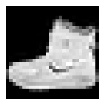
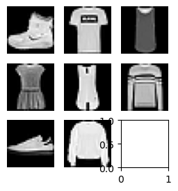
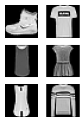
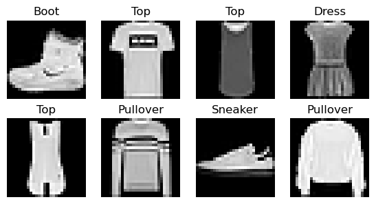

# core


<!-- WARNING: THIS FILE WAS AUTOGENERATED! DO NOT EDIT! -->

------------------------------------------------------------------------

## Hugging Face Datasets

``` python
import logging
```

``` python
logging.disable(logging.WARNING)
```

``` python
from datasets import load_dataset_builder
```

``` python
name = 'fashion_mnist'
ds_builder = load_dataset_builder(name); print(ds_builder.info.description)
```

``` python
dir(ds_builder.info)
```

    ['_INCLUDED_INFO_IN_YAML',
     '__annotations__',
     '__class__',
     '__dataclass_fields__',
     '__dataclass_params__',
     '__delattr__',
     '__dict__',
     '__dir__',
     '__doc__',
     '__eq__',
     '__format__',
     '__ge__',
     '__getattribute__',
     '__getstate__',
     '__gt__',
     '__hash__',
     '__init__',
     '__init_subclass__',
     '__le__',
     '__lt__',
     '__match_args__',
     '__module__',
     '__ne__',
     '__new__',
     '__post_init__',
     '__reduce__',
     '__reduce_ex__',
     '__repr__',
     '__setattr__',
     '__sizeof__',
     '__str__',
     '__subclasshook__',
     '__weakref__',
     '_dump_info',
     '_dump_license',
     '_from_yaml_dict',
     '_to_yaml_dict',
     'builder_name',
     'citation',
     'config_name',
     'copy',
     'dataset_name',
     'dataset_size',
     'description',
     'download_checksums',
     'download_size',
     'features',
     'from_dict',
     'from_directory',
     'from_merge',
     'homepage',
     'license',
     'post_processed',
     'post_processing_size',
     'size_in_bytes',
     'splits',
     'supervised_keys',
     'task_templates',
     'update',
     'version',
     'write_to_directory']

``` python
ds_builder.info.splits
```

    {'train': SplitInfo(name='train', num_bytes=31304707, num_examples=60000, shard_lengths=None, dataset_name='fashion_mnist'),
     'test': SplitInfo(name='test', num_bytes=5235160, num_examples=10000, shard_lengths=None, dataset_name='fashion_mnist')}

``` python
ds_builder.info.features
```

    {'image': Image(mode=None, decode=True, id=None),
     'label': ClassLabel(names=['T - shirt / top', 'Trouser', 'Pullover', 'Dress', 'Coat', 'Sandal', 'Shirt', 'Sneaker', 'Bag', 'Ankle boot'], id=None)}

``` python
from datasets import load_dataset
```

    DatasetDict({
        train: Dataset({
            features: ['image', 'label'],
            num_rows: 60000
        })
        test: Dataset({
            features: ['image', 'label'],
            num_rows: 10000
        })
    })

``` python
dsd = load_dataset(name); dsd
```

``` python
trn,tst= dsd['train'],dsd['test']; trn[0]
```

    {'image': <PIL.PngImagePlugin.PngImageFile image mode=L size=28x28>,
     'label': 9}

``` python
x,y = ds_builder.info.features; x,y
```

    ('image', 'label')

``` python
trn
```

    Dataset({
        features: ['image', 'label'],
        num_rows: 60000
    })

``` python
img = trn[0][x]; img
```


``` python
xb,yb = trn[:5][x],trn[:5][y]; yb
```

    [9, 0, 0, 3, 0]

``` python
trn.features
```

    {'image': Image(mode=None, decode=True, id=None),
     'label': ClassLabel(names=['T - shirt / top', 'Trouser', 'Pullover', 'Dress', 'Coat', 'Sandal', 'Shirt', 'Sneaker', 'Bag', 'Ankle boot'], id=None)}

``` python
featy = trn.features[y]; featy
```

    ClassLabel(names=['T - shirt / top', 'Trouser', 'Pullover', 'Dress', 'Coat', 'Sandal', 'Shirt', 'Sneaker', 'Bag', 'Ankle boot'], id=None)

``` python
?featy.int2str
```

    Signature: featy.int2str(values: Union[int, collections.abc.Iterable]) -> Union[str, collections.abc.Iterable]
    Docstring:
    Conversion `integer` => class name `string`.

    Regarding unknown/missing labels: passing negative integers raises `ValueError`.

    Example:

    ```py
    >>> from datasets import load_dataset
    >>> ds = load_dataset("rotten_tomatoes", split="train")
    >>> ds.features["label"].int2str(0)
    'neg'
    ```
    File:      ~/miniforge3/envs/default/lib/python3.11/site-packages/datasets/features/features.py
    Type:      method

``` python
featy.int2str(yb), yb
```

    (['Ankle boot',
      'T - shirt / top',
      'T - shirt / top',
      'Dress',
      'T - shirt / top'],
     [9, 0, 0, 3, 0])

``` python
import torchvision.transforms.functional as TF
```

    torch.Size([1, 28, 28])

``` python
TF.to_tensor(img).shape
```

``` python
[TF.to_tensor(o) for o in xb];
```

``` python
torch.stack([TF.to_tensor(o) for o in xb]).shape
```

``` python
def collate_fn(b):
  return {x: torch. stack([TF.to_tensor(o[x]) for o in b]),
          y: torch.tensor([o[y]               for o in b])}
```

``` python
from torch.utils.data import DataLoader
```

    Init signature:
    DataLoader(
        dataset: torch.utils.data.dataset.Dataset[+T_co],
        batch_size: Optional[int] = 1,
        shuffle: Optional[bool] = None,
        sampler: Union[torch.utils.data.sampler.Sampler, Iterable, NoneType] = None,
        batch_sampler: Union[torch.utils.data.sampler.Sampler[List], Iterable[List], NoneType] = None,
        num_workers: int = 0,
        collate_fn: Optional[Callable[[List[~T]], Any]] = None,
        pin_memory: bool = False,
        drop_last: bool = False,
        timeout: float = 0,
        worker_init_fn: Optional[Callable[[int], NoneType]] = None,
        multiprocessing_context=None,
        generator=None,
        *,
        prefetch_factor: Optional[int] = None,
        persistent_workers: bool = False,
        pin_memory_device: str = '',
    )
    Docstring:     
    Data loader combines a dataset and a sampler, and provides an iterable over the given dataset.

    The :class:`~torch.utils.data.DataLoader` supports both map-style and
    iterable-style datasets with single- or multi-process loading, customizing
    loading order and optional automatic batching (collation) and memory pinning.

    See :py:mod:`torch.utils.data` documentation page for more details.

    Args:
        dataset (Dataset): dataset from which to load the data.
        batch_size (int, optional): how many samples per batch to load
            (default: ``1``).
        shuffle (bool, optional): set to ``True`` to have the data reshuffled
            at every epoch (default: ``False``).
        sampler (Sampler or Iterable, optional): defines the strategy to draw
            samples from the dataset. Can be any ``Iterable`` with ``__len__``
            implemented. If specified, :attr:`shuffle` must not be specified.
        batch_sampler (Sampler or Iterable, optional): like :attr:`sampler`, but
            returns a batch of indices at a time. Mutually exclusive with
            :attr:`batch_size`, :attr:`shuffle`, :attr:`sampler`,
            and :attr:`drop_last`.
        num_workers (int, optional): how many subprocesses to use for data
            loading. ``0`` means that the data will be loaded in the main process.
            (default: ``0``)
        collate_fn (Callable, optional): merges a list of samples to form a
            mini-batch of Tensor(s).  Used when using batched loading from a
            map-style dataset.
        pin_memory (bool, optional): If ``True``, the data loader will copy Tensors
            into device/CUDA pinned memory before returning them.  If your data elements
            are a custom type, or your :attr:`collate_fn` returns a batch that is a custom type,
            see the example below.
        drop_last (bool, optional): set to ``True`` to drop the last incomplete batch,
            if the dataset size is not divisible by the batch size. If ``False`` and
            the size of dataset is not divisible by the batch size, then the last batch
            will be smaller. (default: ``False``)
        timeout (numeric, optional): if positive, the timeout value for collecting a batch
            from workers. Should always be non-negative. (default: ``0``)
        worker_init_fn (Callable, optional): If not ``None``, this will be called on each
            worker subprocess with the worker id (an int in ``[0, num_workers - 1]``) as
            input, after seeding and before data loading. (default: ``None``)
        multiprocessing_context (str or multiprocessing.context.BaseContext, optional): If
            ``None``, the default `multiprocessing context`_ of your operating system will
            be used. (default: ``None``)
        generator (torch.Generator, optional): If not ``None``, this RNG will be used
            by RandomSampler to generate random indexes and multiprocessing to generate
            ``base_seed`` for workers. (default: ``None``)
        prefetch_factor (int, optional, keyword-only arg): Number of batches loaded
            in advance by each worker. ``2`` means there will be a total of
            2 * num_workers batches prefetched across all workers. (default value depends
            on the set value for num_workers. If value of num_workers=0 default is ``None``.
            Otherwise, if value of ``num_workers > 0`` default is ``2``).
        persistent_workers (bool, optional): If ``True``, the data loader will not shut down
            the worker processes after a dataset has been consumed once. This allows to
            maintain the workers `Dataset` instances alive. (default: ``False``)
        pin_memory_device (str, optional): the device to :attr:`pin_memory` to if ``pin_memory`` is
            ``True``.


    .. warning:: If the ``spawn`` start method is used, :attr:`worker_init_fn`
                 cannot be an unpicklable object, e.g., a lambda function. See
                 :ref:`multiprocessing-best-practices` on more details related
                 to multiprocessing in PyTorch.

    .. warning:: ``len(dataloader)`` heuristic is based on the length of the sampler used.
                 When :attr:`dataset` is an :class:`~torch.utils.data.IterableDataset`,
                 it instead returns an estimate based on ``len(dataset) / batch_size``, with proper
                 rounding depending on :attr:`drop_last`, regardless of multi-process loading
                 configurations. This represents the best guess PyTorch can make because PyTorch
                 trusts user :attr:`dataset` code in correctly handling multi-process
                 loading to avoid duplicate data.

                 However, if sharding results in multiple workers having incomplete last batches,
                 this estimate can still be inaccurate, because (1) an otherwise complete batch can
                 be broken into multiple ones and (2) more than one batch worth of samples can be
                 dropped when :attr:`drop_last` is set. Unfortunately, PyTorch can not detect such
                 cases in general.

                 See `Dataset Types`_ for more details on these two types of datasets and how
                 :class:`~torch.utils.data.IterableDataset` interacts with
                 `Multi-process data loading`_.

    .. warning:: See :ref:`reproducibility`, and :ref:`dataloader-workers-random-seed`, and
                 :ref:`data-loading-randomness` notes for random seed related questions.

    .. _multiprocessing context:
        https://docs.python.org/3/library/multiprocessing.html#contexts-and-start-methods
    File:           ~/miniforge3/envs/default/lib/python3.11/site-packages/torch/utils/data/dataloader.py
    Type:           type
    Subclasses:     

``` python
?DataLoader
```

``` python
dl = DataLoader(trn, collate_fn=collate_fn, batch_size=16)
b = next(iter(dl))
b[x].shape, b[y]
```

    (torch.Size([16, 1, 28, 28]),
     tensor([9, 0, 0, 3, 0, 2, 7, 2, 5, 5, 0, 9, 5, 5, 7, 9]))

Instead of ahving to convert all images to tensors when the dataloader
is created, we can do so when only an individual batch is created.

``` python
def transforms(b):
  b[x] = [TF.to_tensor(o) for o in b[x]]
  return b
```

In this case, a collation function wil not be needed. This is because
either PyTorch know show to handle HF’s `with_transform` method, or
PyTorch will supply its own \[appropriate\] collate function.

``` python
tdsd = trn.with_transform(transforms)
dl = DataLoader(tdsd, batch_size=16)
b = next(iter(dl))
b[x].shape, b[y]
```

    (torch.Size([16, 1, 28, 28]),
     tensor([9, 0, 0, 3, 0, 2, 7, 2, 5, 5, 0, 9, 5, 5, 7, 9]))

To prevent having to include a return statement in our `transforms`
funciton, we can create an additional function to handle this for us.

``` python
TF.to_tensor(img).shape, torch.flatten(TF.to_tensor(img)).shape
```

    (torch.Size([1, 28, 28]), torch.Size([784]))

``` python
def _transformi(b): b[x] = [torch.flatten(TF.to_tensor(o)) for o in b[x]]
```

------------------------------------------------------------------------

<a href="https://github.com/ForBo7/xiaoai/blob/main/xiaoai/core.py#L12"
target="_blank" style="float:right; font-size:smaller">source</a>

### inplace

>      inplace (f)

``` python
transformi = inplace(_transformi)
```

``` python
r = trn.with_transform(transformi)[0]
r[x].shape, r[y]
```

    (torch.Size([784]), 9)

In fact, this is simply what a decorator is.

``` python
@inplace
def transformi(b): b[x] = [torch.flatten(TF.to_tensor(o)) for o in b[x]]
```

``` python
tdsd = trn.with_transform(transformi)
r = tdsd[0]
r[x].shape, r[y]
```

    (torch.Size([784]), 9)

### Itemgetters

``` python
import operator
```

    Call signature: operator(obj, /, *args, **kwargs)
    Type:           module
    String form:    <module 'operator' from '/Users/salmannaqvi/miniforge3/envs/default/lib/python3.11/operator.py'>
    File:           ~/miniforge3/envs/default/lib/python3.11/operator.py
    Docstring:     
    Operator interface.

    This module exports a set of functions implemented in C corresponding
    to the intrinsic operators of Python.  For example, operator.add(x, y)
    is equivalent to the expression x+y.  The function names are those
    used for special methods; variants without leading and trailing
    '__' are also provided for convenience.
    Call docstring: Same as obj(*args, **kwargs).

``` python
?operator
```

``` python
?operator
```

``` python
?itemgetter
```

``` python
d = dict(a=1,b=2,c=3)
ig = itemgetter('a','c'); ig(d)
```

    (1, 3)

``` python
class D:
  def __getitem__(self,k): return 1 if k=='a' else 2 if k=='b' else 3
```

``` python
d = D(); d['a']
```

    1

``` python
ig(d)
```

    (1, 3)

### Collation

``` python
from torch.utils.data import default_collate
```

    Signature: default_collate(batch)
    Docstring:
    Take in a batch of data and put the elements within the batch into a tensor with an additional outer dimension - batch size.

    The exact output type can be a :class:`torch.Tensor`, a `Sequence` of :class:`torch.Tensor`, a
    Collection of :class:`torch.Tensor`, or left unchanged, depending on the input type.
    This is used as the default function for collation when
    `batch_size` or `batch_sampler` is defined in :class:`~torch.utils.data.DataLoader`.

    Here is the general input type (based on the type of the element within the batch) to output type mapping:

        * :class:`torch.Tensor` -> :class:`torch.Tensor` (with an added outer dimension batch size)
        * NumPy Arrays -> :class:`torch.Tensor`
        * `float` -> :class:`torch.Tensor`
        * `int` -> :class:`torch.Tensor`
        * `str` -> `str` (unchanged)
        * `bytes` -> `bytes` (unchanged)
        * `Mapping[K, V_i]` -> `Mapping[K, default_collate([V_1, V_2, ...])]`
        * `NamedTuple[V1_i, V2_i, ...]` -> `NamedTuple[default_collate([V1_1, V1_2, ...]),
          default_collate([V2_1, V2_2, ...]), ...]`
        * `Sequence[V1_i, V2_i, ...]` -> `Sequence[default_collate([V1_1, V1_2, ...]),
          default_collate([V2_1, V2_2, ...]), ...]`

    Args:
        batch: a single batch to be collated

    Examples:
        >>> # xdoctest: +SKIP
        >>> # Example with a batch of `int`s:
        >>> default_collate([0, 1, 2, 3])
        tensor([0, 1, 2, 3])
        >>> # Example with a batch of `str`s:
        >>> default_collate(['a', 'b', 'c'])
        ['a', 'b', 'c']
        >>> # Example with `Map` inside the batch:
        >>> default_collate([{'A': 0, 'B': 1}, {'A': 100, 'B': 100}])
        {'A': tensor([  0, 100]), 'B': tensor([  1, 100])}
        >>> # Example with `NamedTuple` inside the batch:
        >>> Point = namedtuple('Point', ['x', 'y'])
        >>> default_collate([Point(0, 0), Point(1, 1)])
        Point(x=tensor([0, 1]), y=tensor([0, 1]))
        >>> # Example with `Tuple` inside the batch:
        >>> default_collate([(0, 1), (2, 3)])
        [tensor([0, 2]), tensor([1, 3])]
        >>> # Example with `List` inside the batch:
        >>> default_collate([[0, 1], [2, 3]])
        [tensor([0, 2]), tensor([1, 3])]
        >>> # Two options to extend `default_collate` to handle specific type
        >>> # Option 1: Write custom collate function and invoke `default_collate`
        >>> def custom_collate(batch):
        ...     elem = batch[0]
        ...     if isinstance(elem, CustomType):  # Some custom condition
        ...         return ...
        ...     else:  # Fall back to `default_collate`
        ...         return default_collate(batch)
        >>> # Option 2: In-place modify `default_collate_fn_map`
        >>> def collate_customtype_fn(batch, *, collate_fn_map=None):
        ...     return ...
        >>> default_collate_fn_map.update(CustomType, collate_customtype_fn)
        >>> default_collate(batch)  # Handle `CustomType` automatically
    File:      ~/miniforge3/envs/default/lib/python3.11/site-packages/torch/utils/data/_utils/collate.py
    Type:      function

``` python
?default_collate
```

``` python
batch = dict(a=[1],b=[2]), dict(a=[3],b=[4])
default_collate(batch), type(batch)
```

    ({'a': [tensor([1, 3])], 'b': [tensor([2, 4])]}, tuple)

``` python
ig = itemgetter(*trn.features); ig
```

    operator.itemgetter('image', 'label')

``` python
default_collate([b])
```

    {'image': tensor([[[[[0., 0., 0.,  ..., 0., 0., 0.],
                [0., 0., 0.,  ..., 0., 0., 0.],
                [0., 0., 0.,  ..., 0., 0., 0.],
                ...,
                [0., 0., 0.,  ..., 0., 0., 0.],
                [0., 0., 0.,  ..., 0., 0., 0.],
                [0., 0., 0.,  ..., 0., 0., 0.]]],
     
     
              [[[0., 0., 0.,  ..., 0., 0., 0.],
                [0., 0., 0.,  ..., 0., 0., 0.],
                [0., 0., 0.,  ..., 0., 0., 0.],
                ...,
                [0., 0., 0.,  ..., 0., 0., 0.],
                [0., 0., 0.,  ..., 0., 0., 0.],
                [0., 0., 0.,  ..., 0., 0., 0.]]],
     
     
              [[[0., 0., 0.,  ..., 0., 0., 0.],
                [0., 0., 0.,  ..., 0., 0., 0.],
                [0., 0., 0.,  ..., 0., 0., 0.],
                ...,
                [0., 0., 0.,  ..., 0., 0., 0.],
                [0., 0., 0.,  ..., 0., 0., 0.],
                [0., 0., 0.,  ..., 0., 0., 0.]]],
     
     
              ...,
     
     
              [[[0., 0., 0.,  ..., 0., 0., 0.],
                [0., 0., 0.,  ..., 0., 0., 0.],
                [0., 0., 0.,  ..., 0., 0., 0.],
                ...,
                [0., 0., 0.,  ..., 0., 0., 0.],
                [0., 0., 0.,  ..., 0., 0., 0.],
                [0., 0., 0.,  ..., 0., 0., 0.]]],
     
     
              [[[0., 0., 0.,  ..., 0., 0., 0.],
                [0., 0., 0.,  ..., 0., 0., 0.],
                [0., 0., 0.,  ..., 0., 0., 0.],
                ...,
                [0., 0., 0.,  ..., 0., 0., 0.],
                [0., 0., 0.,  ..., 0., 0., 0.],
                [0., 0., 0.,  ..., 0., 0., 0.]]],
     
     
              [[[0., 0., 0.,  ..., 0., 0., 0.],
                [0., 0., 0.,  ..., 0., 0., 0.],
                [0., 0., 0.,  ..., 0., 0., 0.],
                ...,
                [0., 0., 0.,  ..., 0., 0., 0.],
                [0., 0., 0.,  ..., 0., 0., 0.],
                [0., 0., 0.,  ..., 0., 0., 0.]]]]]),
     'label': tensor([[9, 0, 0, 3, 0, 2, 7, 2, 5, 5, 0, 9, 5, 5, 7, 9]])}

``` python
ig(default_collate([b]))
```

    (tensor([[[[[0., 0., 0.,  ..., 0., 0., 0.],
                [0., 0., 0.,  ..., 0., 0., 0.],
                [0., 0., 0.,  ..., 0., 0., 0.],
                ...,
                [0., 0., 0.,  ..., 0., 0., 0.],
                [0., 0., 0.,  ..., 0., 0., 0.],
                [0., 0., 0.,  ..., 0., 0., 0.]]],
     
     
              [[[0., 0., 0.,  ..., 0., 0., 0.],
                [0., 0., 0.,  ..., 0., 0., 0.],
                [0., 0., 0.,  ..., 0., 0., 0.],
                ...,
                [0., 0., 0.,  ..., 0., 0., 0.],
                [0., 0., 0.,  ..., 0., 0., 0.],
                [0., 0., 0.,  ..., 0., 0., 0.]]],
     
     
              [[[0., 0., 0.,  ..., 0., 0., 0.],
                [0., 0., 0.,  ..., 0., 0., 0.],
                [0., 0., 0.,  ..., 0., 0., 0.],
                ...,
                [0., 0., 0.,  ..., 0., 0., 0.],
                [0., 0., 0.,  ..., 0., 0., 0.],
                [0., 0., 0.,  ..., 0., 0., 0.]]],
     
     
              ...,
     
     
              [[[0., 0., 0.,  ..., 0., 0., 0.],
                [0., 0., 0.,  ..., 0., 0., 0.],
                [0., 0., 0.,  ..., 0., 0., 0.],
                ...,
                [0., 0., 0.,  ..., 0., 0., 0.],
                [0., 0., 0.,  ..., 0., 0., 0.],
                [0., 0., 0.,  ..., 0., 0., 0.]]],
     
     
              [[[0., 0., 0.,  ..., 0., 0., 0.],
                [0., 0., 0.,  ..., 0., 0., 0.],
                [0., 0., 0.,  ..., 0., 0., 0.],
                ...,
                [0., 0., 0.,  ..., 0., 0., 0.],
                [0., 0., 0.,  ..., 0., 0., 0.],
                [0., 0., 0.,  ..., 0., 0., 0.]]],
     
     
              [[[0., 0., 0.,  ..., 0., 0., 0.],
                [0., 0., 0.,  ..., 0., 0., 0.],
                [0., 0., 0.,  ..., 0., 0., 0.],
                ...,
                [0., 0., 0.,  ..., 0., 0., 0.],
                [0., 0., 0.,  ..., 0., 0., 0.],
                [0., 0., 0.,  ..., 0., 0., 0.]]]]]),
     tensor([[9, 0, 0, 3, 0, 2, 7, 2, 5, 5, 0, 9, 5, 5, 7, 9]]))

------------------------------------------------------------------------

<a href="https://github.com/ForBo7/xiaoai/blob/main/xiaoai/core.py#L22"
target="_blank" style="float:right; font-size:smaller">source</a>

### collate_dict

>      collate_dict (ds)

The function above collates a dictionary. it converts a dictionary into
a tuple, containing the *xs* and *ys*. Handy when working with both
Hugging Face and PyTorch.

``` python
dl = DataLoader(tdsd, batch_size=4, collate_fn=collate_dict(tdsd))
xb,yb = next(iter(dl))
xb.shape, yb
```

    (torch.Size([4, 784]), tensor([9, 0, 0, 3]))

``` python
xb,yb
```

    (tensor([[0., 0., 0.,  ..., 0., 0., 0.],
             [0., 0., 0.,  ..., 0., 0., 0.],
             [0., 0., 0.,  ..., 0., 0., 0.],
             [0., 0., 0.,  ..., 0., 0., 0.]]),
     tensor([9, 0, 0, 3]))

## Plotting Images

``` python
b = next(iter(dl)); b
```

    (tensor([[0., 0., 0.,  ..., 0., 0., 0.],
             [0., 0., 0.,  ..., 0., 0., 0.],
             [0., 0., 0.,  ..., 0., 0., 0.],
             [0., 0., 0.,  ..., 0., 0., 0.]]),
     tensor([9, 0, 0, 3]))

``` python
xb = b[0]
# img = xb[0]; img.shape, img[0].shape
```

``` python
import matplotlib as mpl
```

``` python
mpl.rcParams['image.cmap'] = 'gray'
```

``` python
plt.imshow(img)
```

``` python
img = TF.to_tensor(img)
```

``` python
img.shape, img.permute(1,2,0).shape
```

    (torch.Size([1, 28, 28]), torch.Size([28, 28, 1]))

``` python
?fc.delegates
```

``` python
?fc.hasattrs
```

    Signature: fc.hasattrs(o, attrs)
    Docstring: Test whether `o` contains all `attrs`
    File:      ~/miniforge3/envs/default/lib/python3.11/site-packages/fastcore/basics.py
    Type:      function

    /opt/hostedtoolcache/Python/3.10.15/x64/lib/python3.10/site-packages/fastcore/docscrape.py:230: UserWarning: Unknown section Other Parameters
      else: warn(msg)
    /opt/hostedtoolcache/Python/3.10.15/x64/lib/python3.10/site-packages/fastcore/docscrape.py:230: UserWarning: Unknown section See Also
      else: warn(msg)

------------------------------------------------------------------------

<a href="https://github.com/ForBo7/xiaoai/blob/main/xiaoai/core.py#L36"
target="_blank" style="float:right; font-size:smaller">source</a>

### show_image

>      show_image (im, ax=None, figsize=None, title=None, noframe=True,
>                  cmap=None, norm=None, aspect=None, interpolation=None,
>                  alpha=None, vmin=None, vmax=None, origin=None, extent=None,
>                  interpolation_stage=None, filternorm=True, filterrad=4.0,
>                  resample=None, url=None, data=None)

*Show a PIL or PyTorch image on `ax`.*

<table>
<colgroup>
<col style="width: 6%" />
<col style="width: 25%" />
<col style="width: 34%" />
<col style="width: 34%" />
</colgroup>
<thead>
<tr class="header">
<th></th>
<th><strong>Type</strong></th>
<th><strong>Default</strong></th>
<th><strong>Details</strong></th>
</tr>
</thead>
<tbody>
<tr class="odd">
<td>im</td>
<td></td>
<td></td>
<td></td>
</tr>
<tr class="even">
<td>ax</td>
<td>NoneType</td>
<td>None</td>
<td></td>
</tr>
<tr class="odd">
<td>figsize</td>
<td>NoneType</td>
<td>None</td>
<td></td>
</tr>
<tr class="even">
<td>title</td>
<td>NoneType</td>
<td>None</td>
<td></td>
</tr>
<tr class="odd">
<td>noframe</td>
<td>bool</td>
<td>True</td>
<td></td>
</tr>
<tr class="even">
<td>cmap</td>
<td>NoneType</td>
<td>None</td>
<td>The Colormap instance or registered colormap name used to map scalar
data<br>to colors.<br><br>This parameter is ignored if <em>X</em> is
RGB(A).</td>
</tr>
<tr class="odd">
<td>norm</td>
<td>NoneType</td>
<td>None</td>
<td>The normalization method used to scale scalar data to the [0, 1]
range<br>before mapping to colors using <em>cmap</em>. By default, a
linear scaling is<br>used, mapping the lowest value to 0 and the highest
to 1.<br><br>If given, this can be one of the following:<br><br>- An
instance of <code>.Normalize</code> or one of its subclasses<br> (see
:ref:<code>colormapnorms</code>).<br>- A scale name, i.e. one of
“linear”, “log”, “symlog”, “logit”, etc. For a<br> list of available
scales, call <code>matplotlib.scale.get_scale_names()</code>.<br> In
that case, a suitable <code>.Normalize</code> subclass is dynamically
generated<br> and instantiated.<br><br>This parameter is ignored if
<em>X</em> is RGB(A).</td>
</tr>
<tr class="even">
<td>aspect</td>
<td>NoneType</td>
<td>None</td>
<td>The aspect ratio of the Axes. This parameter is
particularly<br>relevant for images since it determines whether data
pixels are<br>square.<br><br>This parameter is a shortcut for explicitly
calling<br><code>.Axes.set_aspect</code>. See there for further
details.<br><br>- ‘equal’: Ensures an aspect ratio of 1. Pixels will be
square<br> (unless pixel sizes are explicitly made non-square in
data<br> coordinates using <em>extent</em>).<br>- ‘auto’: The Axes is
kept fixed and the aspect is adjusted so<br> that the data fit in the
Axes. In general, this will result in<br> non-square
pixels.<br><br>Normally, None (the default) means to use
:rc:<code>image.aspect</code>. However, if<br>the image uses a transform
that does not contain the axes data transform,<br>then None means to not
modify the axes aspect at all (in that case, directly<br>call
<code>.Axes.set_aspect</code> if desired).</td>
</tr>
<tr class="odd">
<td>interpolation</td>
<td>NoneType</td>
<td>None</td>
<td>The interpolation method used.<br><br>Supported values are ‘none’,
‘antialiased’, ‘nearest’, ‘bilinear’,<br>‘bicubic’, ‘spline16’,
‘spline36’, ‘hanning’, ‘hamming’, ‘hermite’,<br>‘kaiser’, ‘quadric’,
‘catrom’, ‘gaussian’, ‘bessel’, ‘mitchell’,<br>‘sinc’, ‘lanczos’,
‘blackman’.<br><br>The data <em>X</em> is resampled to the pixel size of
the image on the<br>figure canvas, using the interpolation method to
either up- or<br>downsample the data.<br><br>If <em>interpolation</em>
is ‘none’, then for the ps, pdf, and svg<br>backends no down- or
upsampling occurs, and the image data is<br>passed to the backend as a
native image. Note that different ps,<br>pdf, and svg viewers may
display these raw pixels differently. On<br>other backends, ‘none’ is
the same as ‘nearest’.<br><br>If <em>interpolation</em> is the default
‘antialiased’, then ‘nearest’<br>interpolation is used if the image is
upsampled by more than a<br>factor of three (i.e. the number of display
pixels is at least<br>three times the size of the data array). If the
upsampling rate is<br>smaller than 3, or the image is downsampled, then
‘hanning’<br>interpolation is used to act as an anti-aliasing filter,
unless the<br>image happens to be upsampled by exactly a factor of two
or
one.<br><br>See<br>:doc:<code>/gallery/images_contours_and_fields/interpolation_methods</code><br>for
an overview of the supported interpolation methods,
and<br>:doc:<code>/gallery/images_contours_and_fields/image_antialiasing</code>
for<br>a discussion of image antialiasing.<br><br>Some interpolation
methods require an additional radius parameter,<br>which can be set by
<em>filterrad</em>. Additionally, the antigrain image<br>resize filter
is controlled by the parameter <em>filternorm</em>.</td>
</tr>
<tr class="even">
<td>alpha</td>
<td>NoneType</td>
<td>None</td>
<td>The alpha blending value, between 0 (transparent) and 1
(opaque).<br>If <em>alpha</em> is an array, the alpha blending values
are applied pixel<br>by pixel, and <em>alpha</em> must have the same
shape as <em>X</em>.</td>
</tr>
<tr class="odd">
<td>vmin</td>
<td>NoneType</td>
<td>None</td>
<td></td>
</tr>
<tr class="even">
<td>vmax</td>
<td>NoneType</td>
<td>None</td>
<td></td>
</tr>
<tr class="odd">
<td>origin</td>
<td>NoneType</td>
<td>None</td>
<td>Place the [0, 0] index of the array in the upper left or
lower<br>left corner of the Axes. The convention (the default) ‘upper’
is<br>typically used for matrices and images.<br><br>Note that the
vertical axis points upward for ‘lower’<br>but downward for
‘upper’.<br><br>See the :ref:<code>imshow_extent</code> tutorial
for<br>examples and a more detailed description.</td>
</tr>
<tr class="even">
<td>extent</td>
<td>NoneType</td>
<td>None</td>
<td>The bounding box in data coordinates that the image will
fill.<br>These values may be unitful and match the units of the
Axes.<br>The image is stretched individually along x and y to fill the
box.<br><br>The default extent is determined by the following
conditions.<br>Pixels have unit size in data coordinates. Their centers
are on<br>integer coordinates, and their center coordinates range from 0
to<br>columns-1 horizontally and from 0 to rows-1
vertically.<br><br>Note that the direction of the vertical axis and thus
the default<br>values for top and bottom depend on
<em>origin</em>:<br><br>- For <code>origin == 'upper'</code> the default
is<br> <code>(-0.5, numcols-0.5, numrows-0.5, -0.5)</code>.<br>- For
<code>origin == 'lower'</code> the default is<br>
<code>(-0.5, numcols-0.5, -0.5, numrows-0.5)</code>.<br><br>See the
:ref:<code>imshow_extent</code> tutorial for<br>examples and a more
detailed description.</td>
</tr>
<tr class="odd">
<td>interpolation_stage</td>
<td>NoneType</td>
<td>None</td>
<td>If ‘data’, interpolation<br>is carried out on the data provided by
the user. If ‘rgba’, the<br>interpolation is carried out after the
colormapping has been<br>applied (visual interpolation).</td>
</tr>
<tr class="even">
<td>filternorm</td>
<td>bool</td>
<td>True</td>
<td>A parameter for the antigrain image resize filter (see
the<br>antigrain documentation). If <em>filternorm</em> is set, the
filter<br>normalizes integer values and corrects the rounding errors.
It<br>doesn’t do anything with the source floating point values,
it<br>corrects only integers according to the rule of 1.0 which
means<br>that any sum of pixel weights must be equal to 1.0. So,
the<br>filter function must produce a graph of the proper shape.</td>
</tr>
<tr class="odd">
<td>filterrad</td>
<td>float</td>
<td>4.0</td>
<td>The filter radius for filters that have a radius parameter,
i.e.<br>when interpolation is one of: ‘sinc’, ‘lanczos’ or
‘blackman’.</td>
</tr>
<tr class="even">
<td>resample</td>
<td>NoneType</td>
<td>None</td>
<td>When <em>True</em>, use a full resampling method. When
<em>False</em>, only<br>resample when the output image is larger than
the input image.</td>
</tr>
<tr class="odd">
<td>url</td>
<td>NoneType</td>
<td>None</td>
<td>Set the url of the created <code>.AxesImage</code>. See
<code>.Artist.set_url</code>.</td>
</tr>
<tr class="even">
<td>data</td>
<td>NoneType</td>
<td>None</td>
<td></td>
</tr>
</tbody>
</table>

``` python
img.permute(1,2,0).shape, img.permute(1,2,0)[...,0].shape
```

    (torch.Size([28, 28, 1]), torch.Size([28, 28]))

``` python
show_image(img, figsize=(2,2));
```



``` python
?show_image
```

    Signature:
    show_image(
        im,
        ax=None,
        figsize=None,
        title=None,
        noframe=True,
        *,
        cmap=None,
        norm=None,
        aspect=None,
        interpolation=None,
        alpha=None,
        vmin=None,
        vmax=None,
        origin=None,
        extent=None,
        interpolation_stage=None,
        filternorm=True,
        filterrad=4.0,
        resample=None,
        url=None,
        data=None,
    )
    Docstring: Show a PIL or PyTorch image on `ax`.
    File:      /var/folders/fy/vg316qk1001227svr6d4d8l40000gn/T/ipykernel_13157/1415261445.py
    Type:      function

``` python
fig,axs = plt.subplots(1,2)
show_image(img,axs[0])
show_image(trn[x][1], axs[1]);
```


------------------------------------------------------------------------

<a href="https://github.com/ForBo7/xiaoai/blob/main/xiaoai/core.py#L53"
target="_blank" style="float:right; font-size:smaller">source</a>

### subplots

>      subplots (nrows:int=1, ncols:int=1, figsize:tuple=None, imsize:int=3,
>                suptitle:str=None,
>                sharex:"bool|Literal['none','all','row','col']"=False,
>                sharey:"bool|Literal['none','all','row','col']"=False,
>                squeeze:bool=True, width_ratios:Sequence[float]|None=None,
>                height_ratios:Sequence[float]|None=None,
>                subplot_kw:dict[str,Any]|None=None,
>                gridspec_kw:dict[str,Any]|None=None, **kwargs)

*A figure and set of subplots to display images of `imsize` inches*

<table>
<colgroup>
<col style="width: 6%" />
<col style="width: 25%" />
<col style="width: 34%" />
<col style="width: 34%" />
</colgroup>
<thead>
<tr class="header">
<th></th>
<th><strong>Type</strong></th>
<th><strong>Default</strong></th>
<th><strong>Details</strong></th>
</tr>
</thead>
<tbody>
<tr class="odd">
<td>nrows</td>
<td>int</td>
<td>1</td>
<td>Number of rows in returned axes grid</td>
</tr>
<tr class="even">
<td>ncols</td>
<td>int</td>
<td>1</td>
<td>Number of cols in returned axes grid</td>
</tr>
<tr class="odd">
<td>figsize</td>
<td>tuple</td>
<td>None</td>
<td>w,h in inches of the returned figure</td>
</tr>
<tr class="even">
<td>imsize</td>
<td>int</td>
<td>3</td>
<td>Size (in inches) of images that will be displayed in the returned
figure</td>
</tr>
<tr class="odd">
<td>suptitle</td>
<td>str</td>
<td>None</td>
<td>Title to be set in returned figure</td>
</tr>
<tr class="even">
<td>sharex</td>
<td>bool | Literal[‘none’, ‘all’, ‘row’, ‘col’]</td>
<td>False</td>
<td></td>
</tr>
<tr class="odd">
<td>sharey</td>
<td>bool | Literal[‘none’, ‘all’, ‘row’, ‘col’]</td>
<td>False</td>
<td></td>
</tr>
<tr class="even">
<td>squeeze</td>
<td>bool</td>
<td>True</td>
<td></td>
</tr>
<tr class="odd">
<td>width_ratios</td>
<td>Sequence[float] | None</td>
<td>None</td>
<td></td>
</tr>
<tr class="even">
<td>height_ratios</td>
<td>Sequence[float] | None</td>
<td>None</td>
<td></td>
</tr>
<tr class="odd">
<td>subplot_kw</td>
<td>dict[str, Any] | None</td>
<td>None</td>
<td></td>
</tr>
<tr class="even">
<td>gridspec_kw</td>
<td>dict[str, Any] | None</td>
<td>None</td>
<td></td>
</tr>
<tr class="odd">
<td>kwargs</td>
<td></td>
<td></td>
<td></td>
</tr>
</tbody>
</table>

``` python
fig,axs = subplots(3,3, imsize=1)
imgs = trn[x][:8]
for ax,img in zip(axs.flat, imgs): show_image(img, ax)
```



------------------------------------------------------------------------

<a href="https://github.com/ForBo7/xiaoai/blob/main/xiaoai/core.py#L71"
target="_blank" style="float:right; font-size:smaller">source</a>

### get_grid

>      get_grid (n:int, nrows:int=None, ncols:int=None, title:str=None,
>                weight:str='bold', size:int=14, figsize:tuple=None,
>                imsize:int=3, suptitle:str=None,
>                sharex:"bool|Literal['none','all','row','col']"=False,
>                sharey:"bool|Literal['none','all','row','col']"=False,
>                squeeze:bool=True, width_ratios:Sequence[float]|None=None,
>                height_ratios:Sequence[float]|None=None,
>                subplot_kw:dict[str,Any]|None=None,
>                gridspec_kw:dict[str,Any]|None=None)

*Return a grid of `n` axes, `rows` by `cols`*

<table>
<colgroup>
<col style="width: 6%" />
<col style="width: 25%" />
<col style="width: 34%" />
<col style="width: 34%" />
</colgroup>
<thead>
<tr class="header">
<th></th>
<th><strong>Type</strong></th>
<th><strong>Default</strong></th>
<th><strong>Details</strong></th>
</tr>
</thead>
<tbody>
<tr class="odd">
<td>n</td>
<td>int</td>
<td></td>
<td>Number of axes</td>
</tr>
<tr class="even">
<td>nrows</td>
<td>int</td>
<td>None</td>
<td>Number of rows, defaulting to <code>int(math.sqrt(n))</code></td>
</tr>
<tr class="odd">
<td>ncols</td>
<td>int</td>
<td>None</td>
<td>Number of cols, defaulting to <code>ceil(n/rows)</code></td>
</tr>
<tr class="even">
<td>title</td>
<td>str</td>
<td>None</td>
<td>If passed, title set to the figure</td>
</tr>
<tr class="odd">
<td>weight</td>
<td>str</td>
<td>bold</td>
<td>Title font weight</td>
</tr>
<tr class="even">
<td>size</td>
<td>int</td>
<td>14</td>
<td>Title font size</td>
</tr>
<tr class="odd">
<td>figsize</td>
<td>tuple</td>
<td>None</td>
<td>w,h in inches of the returned figure</td>
</tr>
<tr class="even">
<td>imsize</td>
<td>int</td>
<td>3</td>
<td>Size (in inches) of images that will be displayed in the returned
figure</td>
</tr>
<tr class="odd">
<td>suptitle</td>
<td>str</td>
<td>None</td>
<td>Title to be set in returned figure</td>
</tr>
<tr class="even">
<td>sharex</td>
<td>bool | Literal[‘none’, ‘all’, ‘row’, ‘col’]</td>
<td>False</td>
<td></td>
</tr>
<tr class="odd">
<td>sharey</td>
<td>bool | Literal[‘none’, ‘all’, ‘row’, ‘col’]</td>
<td>False</td>
<td></td>
</tr>
<tr class="even">
<td>squeeze</td>
<td>bool</td>
<td>True</td>
<td></td>
</tr>
<tr class="odd">
<td>width_ratios</td>
<td>Sequence[float] | None</td>
<td>None</td>
<td></td>
</tr>
<tr class="even">
<td>height_ratios</td>
<td>Sequence[float] | None</td>
<td>None</td>
<td></td>
</tr>
<tr class="odd">
<td>subplot_kw</td>
<td>dict[str, Any] | None</td>
<td>None</td>
<td></td>
</tr>
<tr class="even">
<td>gridspec_kw</td>
<td>dict[str, Any] | None</td>
<td>None</td>
<td></td>
</tr>
</tbody>
</table>

``` python
fig,axs = get_grid(8, nrows=3, imsize=1)
for ax,img in zip(axs.flat,imgs): show_image(img, ax)
```



``` python
?zip_longest
```

------------------------------------------------------------------------

<a href="https://github.com/ForBo7/xiaoai/blob/main/xiaoai/core.py#L96"
target="_blank" style="float:right; font-size:smaller">source</a>

### show_images

>      show_images (ims:list, nrows:int|None=None, ncols:int|None=None,
>                   titles:list|None=None, figsize:tuple=None, imsize:int=3,
>                   suptitle:str=None,
>                   sharex:"bool|Literal['none','all','row','col']"=False,
>                   sharey:"bool|Literal['none','all','row','col']"=False,
>                   squeeze:bool=True, width_ratios:Sequence[float]|None=None,
>                   height_ratios:Sequence[float]|None=None,
>                   subplot_kw:dict[str,Any]|None=None,
>                   gridspec_kw:dict[str,Any]|None=None)

*Show all images `ims` as subplots with `rows` using `titles`*

<table>
<colgroup>
<col style="width: 6%" />
<col style="width: 25%" />
<col style="width: 34%" />
<col style="width: 34%" />
</colgroup>
<thead>
<tr class="header">
<th></th>
<th><strong>Type</strong></th>
<th><strong>Default</strong></th>
<th><strong>Details</strong></th>
</tr>
</thead>
<tbody>
<tr class="odd">
<td>ims</td>
<td>list</td>
<td></td>
<td>Images to show</td>
</tr>
<tr class="even">
<td>nrows</td>
<td>int | None</td>
<td>None</td>
<td>Number of rows in grid</td>
</tr>
<tr class="odd">
<td>ncols</td>
<td>int | None</td>
<td>None</td>
<td>Number of columsn in grid (auto-calculated if None)</td>
</tr>
<tr class="even">
<td>titles</td>
<td>list | None</td>
<td>None</td>
<td>Optional list of titles for each image</td>
</tr>
<tr class="odd">
<td>figsize</td>
<td>tuple</td>
<td>None</td>
<td>w,h in inches of the returned figure</td>
</tr>
<tr class="even">
<td>imsize</td>
<td>int</td>
<td>3</td>
<td>Size (in inches) of images that will be displayed in the returned
figure</td>
</tr>
<tr class="odd">
<td>suptitle</td>
<td>str</td>
<td>None</td>
<td>Title to be set in returned figure</td>
</tr>
<tr class="even">
<td>sharex</td>
<td>bool | Literal[‘none’, ‘all’, ‘row’, ‘col’]</td>
<td>False</td>
<td></td>
</tr>
<tr class="odd">
<td>sharey</td>
<td>bool | Literal[‘none’, ‘all’, ‘row’, ‘col’]</td>
<td>False</td>
<td></td>
</tr>
<tr class="even">
<td>squeeze</td>
<td>bool</td>
<td>True</td>
<td></td>
</tr>
<tr class="odd">
<td>width_ratios</td>
<td>Sequence[float] | None</td>
<td>None</td>
<td></td>
</tr>
<tr class="even">
<td>height_ratios</td>
<td>Sequence[float] | None</td>
<td>None</td>
<td></td>
</tr>
<tr class="odd">
<td>subplot_kw</td>
<td>dict[str, Any] | None</td>
<td>None</td>
<td></td>
</tr>
<tr class="even">
<td>gridspec_kw</td>
<td>dict[str, Any] | None</td>
<td>None</td>
<td></td>
</tr>
</tbody>
</table>

``` python
yb = trn[y][:8]
lbls = trn[y][:8]
```

``` python
names = 'Top Trouser Pullover Dress Coat Sandal Shirt Sneaker Bag Boot'.split()
titles = itemgetter(*lbls)(names)
' '.join(titles)
```

    'Boot Top Top Dress Top Pullover Sneaker Pullover'

``` python
show_images(imgs, imsize=1.7, titles=titles)
```


